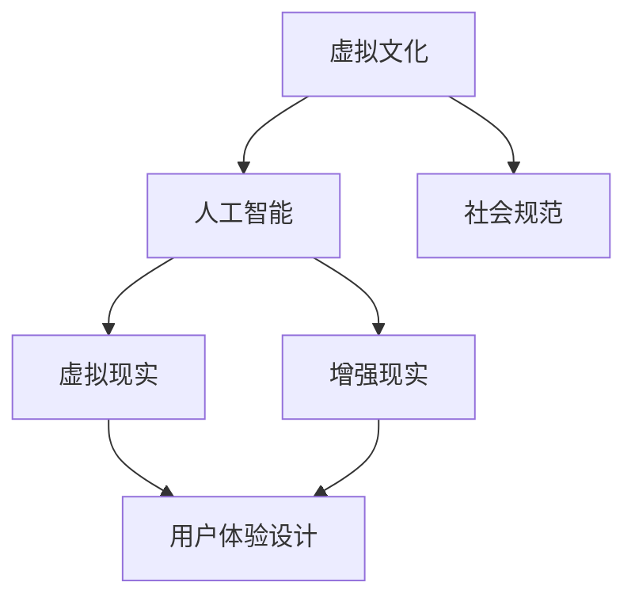

                 

# 虚拟文化：AI塑造的新型社会规范

> **关键词：** 虚拟现实，人工智能，社会规范，文化演变，伦理道德，用户体验设计。

> **摘要：** 本文探讨了随着人工智能技术的飞速发展，虚拟现实领域的变革及其对新型社会规范的影响。通过分析虚拟文化的核心概念、AI技术的作用、以及相关伦理道德问题，本文旨在揭示虚拟文化对现实社会的深远影响，并探讨未来的发展方向与挑战。

## 1. 背景介绍

### 1.1 目的和范围

本文旨在探讨人工智能与虚拟现实结合所带来的新型社会规范的变化。随着AI技术的发展，虚拟现实已经从传统的娱乐和游戏领域扩展到更广泛的应用场景，如教育、医疗、艺术、甚至是工作环境。这种变化引发了社会规范和伦理道德的深刻反思。本文将重点关注以下几个方面：

1. 虚拟文化的核心概念与定义。
2. AI技术在虚拟文化中的应用及其对社会规范的影响。
3. 虚拟文化中的伦理道德问题及解决方案。
4. 虚拟文化对现实社会的潜在影响。

### 1.2 预期读者

本文适合对虚拟现实、人工智能、社会规范和伦理道德有兴趣的读者，包括但不限于：

1. 软件工程师和程序员。
2. 社会科学家和伦理学家。
3. 虚拟现实和人工智能行业的从业者。
4. 对未来科技发展感兴趣的一般读者。

### 1.3 文档结构概述

本文结构如下：

1. **引言**：介绍虚拟文化、AI技术及其对新型社会规范的影响。
2. **核心概念与联系**：分析虚拟文化的核心概念，展示相关的Mermaid流程图。
3. **核心算法原理 & 具体操作步骤**：使用伪代码详细阐述AI在虚拟文化中的应用原理。
4. **数学模型和公式 & 详细讲解 & 举例说明**：介绍与虚拟文化相关的数学模型和公式，并提供实际案例。
5. **项目实战：代码实际案例和详细解释说明**：展示一个虚拟文化项目的代码实现和解读。
6. **实际应用场景**：讨论虚拟文化在不同领域的应用。
7. **工具和资源推荐**：推荐学习资源和开发工具。
8. **总结：未来发展趋势与挑战**：总结虚拟文化的未来发展方向和挑战。
9. **附录：常见问题与解答**：解答读者可能关心的问题。
10. **扩展阅读 & 参考资料**：提供进一步学习的资源。

### 1.4 术语表

#### 1.4.1 核心术语定义

- **虚拟文化**：在虚拟环境中形成的一套价值观、习俗和行为规范。
- **人工智能**：模拟人类智能行为的计算机系统，能够学习和适应。
- **社会规范**：社会对个体行为的期望和限制。
- **用户体验设计**：设计以用户为中心的产品和服务，提供愉悦和有效的使用体验。

#### 1.4.2 相关概念解释

- **虚拟现实（VR）**：一种模拟现实世界的计算机技术，通过提供沉浸式体验改变用户对现实世界的感知。
- **增强现实（AR）**：将虚拟信息叠加到现实世界中的技术，增强用户的现实感知。
- **数字孪生**：通过数字化模型模拟现实世界中的物理实体，以实现实时监控和管理。

#### 1.4.3 缩略词列表

- **AI**：人工智能
- **VR**：虚拟现实
- **AR**：增强现实
- **UX**：用户体验设计
- **UI**：用户界面设计

## 2. 核心概念与联系

在探讨虚拟文化之前，我们需要理解几个核心概念及其相互关系。以下是一个简单的Mermaid流程图，用于展示这些概念之间的联系。



### 2.1 虚拟文化

虚拟文化指的是在虚拟环境中形成的一套价值观、习俗和行为规范。这些规范可能源于现实世界的文化，也可能在虚拟世界中独立发展。虚拟文化具有以下特点：

1. **沉浸性**：虚拟文化提供了一种沉浸式体验，用户可以完全投入其中。
2. **个性化**：虚拟文化可以根据用户的偏好和行为进行个性化定制。
3. **虚拟身份**：用户在虚拟文化中可以使用虚拟身份，这为自由表达提供了空间。

### 2.2 人工智能

人工智能（AI）是模拟人类智能行为的计算机系统，能够学习和适应。在虚拟文化中，AI的作用主要体现在以下几个方面：

1. **个性化推荐**：AI可以根据用户的历史行为和偏好，提供个性化的内容推荐。
2. **智能交互**：AI可以模拟人类交互，为用户提供更加自然和人性化的体验。
3. **安全与监控**：AI可以用于监控虚拟环境中的异常行为，保障用户的安全。

### 2.3 社会规范

社会规范是社会中对个体行为的期望和限制。在虚拟文化中，社会规范的作用同样重要，但具有以下特点：

1. **虚拟身份的影响**：虚拟身份使得个体在遵守社会规范时更加灵活，但也可能带来道德和伦理上的挑战。
2. **多样性与包容性**：虚拟文化中的社会规范可以更加多样和包容，有助于打破现实世界的界限。
3. **规则与灵活性**：虚拟文化中的社会规范既需要明确的规则，又需要一定的灵活性，以适应不断变化的虚拟环境。

### 2.4 虚拟现实与增强现实

虚拟现实（VR）和增强现实（AR）是虚拟文化的技术基础。VR提供了一种完全沉浸的体验，用户可以在虚拟环境中自由探索；AR则将虚拟信息叠加到现实世界中，增强用户的感知和交互。这两种技术在虚拟文化中的应用如下：

1. **沉浸性与互动性**：VR提供了高度沉浸的体验，用户可以在虚拟环境中进行各种互动。
2. **虚实结合**：AR将虚拟世界与现实世界结合，为用户提供更加丰富和灵活的互动方式。
3. **应用场景**：VR和AR在虚拟文化中的应用非常广泛，包括教育、医疗、艺术、设计等多个领域。

### 2.5 用户体验设计

用户体验设计（UX）是设计以用户为中心的产品和服务，提供愉悦和有效的使用体验。在虚拟文化中，UX设计的作用尤为重要：

1. **用户研究**：了解用户的需求和偏好，为虚拟文化的开发提供依据。
2. **界面设计**：设计直观、易用的界面，提高用户的操作效率。
3. **交互体验**：优化交互方式，提高用户的沉浸感和满意度。

## 3. 核心算法原理 & 具体操作步骤

在虚拟文化中，人工智能（AI）发挥着关键作用。以下将介绍AI在虚拟文化中的核心算法原理和具体操作步骤。

### 3.1 AI算法原理

AI算法主要分为两大类：监督学习和无监督学习。在虚拟文化中，监督学习算法通常用于个性化推荐和智能交互，而无监督学习算法则用于异常检测和用户行为分析。

#### 3.1.1 监督学习算法

监督学习算法需要使用标注数据集进行训练，通过预测标签来学习特征表示。在虚拟文化中，常见的监督学习算法包括：

1. **线性回归**：用于预测用户行为和偏好。
2. **决策树**：用于分类用户行为。
3. **支持向量机（SVM）**：用于分类和回归。

#### 3.1.2 无监督学习算法

无监督学习算法不需要标注数据集，通过发现数据中的模式来学习特征表示。在虚拟文化中，常见的无监督学习算法包括：

1. **聚类算法**：用于发现用户群体和兴趣点。
2. **主成分分析（PCA）**：用于降维和特征提取。
3. **自编码器**：用于自动特征提取和学习数据表示。

### 3.2 AI在虚拟文化中的具体操作步骤

以下是一个简单的AI应用示例，用于虚拟文化中的个性化推荐系统。

#### 3.2.1 数据收集与预处理

1. **用户数据**：收集用户的基本信息、行为数据和偏好数据。
2. **内容数据**：收集虚拟文化中的各种内容，如文本、图像和视频。
3. **数据预处理**：对用户和内容数据进行分析和清洗，去除噪声和异常值。

#### 3.2.2 特征提取

1. **用户特征**：使用文本分类、情感分析等技术提取用户的行为和偏好特征。
2. **内容特征**：使用图像识别、语音识别等技术提取内容的特征。

#### 3.2.3 模型训练

1. **选择模型**：根据应用场景选择合适的监督学习或无监督学习模型。
2. **训练模型**：使用预处理后的数据和特征进行模型训练，调整模型参数。

#### 3.2.4 个性化推荐

1. **用户行为预测**：使用训练好的模型预测用户的潜在兴趣和行为。
2. **内容推荐**：根据用户的行为预测结果，向用户推荐符合其兴趣的内容。

#### 3.2.5 评估与优化

1. **评估指标**：选择合适的评估指标，如准确率、召回率等。
2. **模型优化**：根据评估结果调整模型参数，提高推荐效果。

## 4. 数学模型和公式 & 详细讲解 & 举例说明

在虚拟文化中，数学模型和公式扮演着重要角色。以下将介绍与虚拟文化相关的几个关键数学模型和公式，并提供详细讲解和实际案例。

### 4.1 用户行为预测模型

用户行为预测是虚拟文化中的一项重要任务。以下是一个简单的线性回归模型，用于预测用户在虚拟环境中的行为。

#### 4.1.1 模型公式

$$
y = \beta_0 + \beta_1x_1 + \beta_2x_2 + ... + \beta_nx_n + \epsilon
$$

其中，$y$为用户行为预测值，$x_1, x_2, ..., x_n$为用户特征，$\beta_0, \beta_1, ..., \beta_n$为模型参数，$\epsilon$为误差项。

#### 4.1.2 模型解释

- **用户行为预测值**：$y$表示用户在虚拟环境中的行为，如点击次数、浏览时间等。
- **用户特征**：$x_1, x_2, ..., x_n$表示影响用户行为的各种特征，如用户年龄、性别、历史行为等。
- **模型参数**：$\beta_0, \beta_1, ..., \beta_n$表示每个特征的权重，用于调节特征对用户行为的影响程度。
- **误差项**：$\epsilon$表示预测值与实际值之间的差异，用于衡量模型预测的准确性。

#### 4.1.3 实际案例

假设我们有一个用户行为预测模型，用于预测用户在虚拟游戏中的游戏时间。用户特征包括年龄、性别、游戏历史等。以下是一个实际案例：

$$
y = 10 + 0.5 \times 25 + 0.2 \times 3 + 0.3 \times 5 + \epsilon
$$

其中，$y$表示用户在虚拟游戏中的游戏时间（小时），$x_1=25$表示用户年龄，$x_2=3$表示用户性别（男为3，女为2），$x_3=5$表示用户游戏历史（月）。

根据上述模型，我们可以预测用户在虚拟游戏中的游戏时间为：

$$
y = 10 + 0.5 \times 25 + 0.2 \times 3 + 0.3 \times 5 = 22.5 + \epsilon
$$

### 4.2 聚类算法

聚类算法是虚拟文化中用于用户群体分析和兴趣点发现的重要工具。以下是一个简单的K-Means聚类算法，用于用户行为聚类。

#### 4.2.1 模型公式

$$
C = \{C_1, C_2, ..., C_k\}
$$

其中，$C$表示聚类结果，$C_i$表示第$i$个聚类结果，$k$表示聚类个数。

#### 4.2.2 模型解释

- **聚类结果**：$C$表示将用户划分为$k$个聚类结果。
- **聚类中心**：$C_i$表示第$i$个聚类结果的中心点，用于表示该聚类群体的特征。

#### 4.2.3 实际案例

假设我们有一个用户行为数据集，包含年龄、性别、游戏历史等特征。我们使用K-Means算法将其划分为3个聚类结果。以下是一个实际案例：

1. **初始化聚类中心**：随机选择3个用户作为初始聚类中心。
2. **计算距离**：计算每个用户到聚类中心的距离，选择距离最小的聚类中心。
3. **更新聚类中心**：计算每个聚类结果的中心点，作为新的聚类中心。
4. **重复步骤2和3**：直到聚类中心不再发生显著变化。

根据上述算法，我们可以将用户行为数据集划分为3个聚类结果，分别表示不同类型的用户群体。

### 4.3 主成分分析（PCA）

主成分分析（PCA）是一种常用的降维和特征提取方法，用于简化数据并提取主要特征。以下是一个简单的PCA算法。

#### 4.3.1 模型公式

$$
Z = P \times X
$$

其中，$Z$表示降维后的数据，$P$表示主成分矩阵，$X$表示原始数据。

#### 4.3.2 模型解释

- **降维后的数据**：$Z$表示通过PCA算法降维后的数据。
- **主成分矩阵**：$P$表示主成分矩阵，用于提取主要特征。
- **原始数据**：$X$表示原始数据。

#### 4.3.3 实际案例

假设我们有一个包含用户行为数据的多维数据集，包括年龄、性别、游戏历史等多个特征。我们使用PCA算法将其降维为2个主要特征。以下是一个实际案例：

1. **计算协方差矩阵**：计算原始数据集的协方差矩阵。
2. **计算特征值和特征向量**：计算协方差矩阵的特征值和特征向量。
3. **选择主要特征**：根据特征值的大小选择主要特征，构建主成分矩阵。
4. **降维**：将原始数据乘以主成分矩阵，得到降维后的数据。

根据上述算法，我们可以将原始数据集降维为2个主要特征，从而简化数据处理和分析过程。

## 5. 项目实战：代码实际案例和详细解释说明

为了更好地理解虚拟文化中AI的应用，我们将通过一个实际项目来展示代码实现和详细解释。本案例将介绍如何使用Python和TensorFlow实现一个基于用户行为的个性化推荐系统。

### 5.1 开发环境搭建

在进行项目开发之前，需要搭建以下开发环境：

- **操作系统**：Windows/Linux/MacOS
- **编程语言**：Python 3.8+
- **框架和库**：TensorFlow 2.0+, NumPy, Pandas, Scikit-learn
- **编辑器**：PyCharm, Visual Studio Code等

### 5.2 源代码详细实现和代码解读

以下是一个简单的Python代码实现，用于训练一个基于用户行为的个性化推荐模型。

```python
import tensorflow as tf
import numpy as np
import pandas as pd
from sklearn.model_selection import train_test_split

# 读取数据
data = pd.read_csv('user_behavior.csv')
X = data[['age', 'gender', 'game_history']]
y = data['game_time']

# 数据预处理
X = (X - X.mean()) / X.std()
y = (y - y.mean()) / y.std()

# 划分训练集和测试集
X_train, X_test, y_train, y_test = train_test_split(X, y, test_size=0.2, random_state=42)

# 构建模型
model = tf.keras.Sequential([
    tf.keras.layers.Dense(64, activation='relu', input_shape=(X_train.shape[1],)),
    tf.keras.layers.Dense(32, activation='relu'),
    tf.keras.layers.Dense(1)
])

# 编译模型
model.compile(optimizer='adam', loss='mean_squared_error')

# 训练模型
model.fit(X_train, y_train, epochs=10, batch_size=32, validation_split=0.1)

# 评估模型
loss = model.evaluate(X_test, y_test)
print(f'Model loss on test data: {loss}')

# 预测用户行为
predictions = model.predict(X_test)
print(f'Predicted game times: {predictions}')
```

### 5.3 代码解读与分析

1. **数据读取**：首先，我们使用Pandas库读取用户行为数据，包括年龄、性别、游戏历史和游戏时间等特征。

2. **数据预处理**：对数据进行标准化处理，将每个特征减去其均值并除以标准差，以消除特征之间的尺度差异。

3. **划分训练集和测试集**：使用Scikit-learn库中的train_test_split函数将数据集划分为训练集和测试集，以便评估模型性能。

4. **构建模型**：使用TensorFlow库构建一个简单的全连接神经网络模型，包括两个隐藏层，每个隐藏层使用ReLU激活函数。

5. **编译模型**：设置模型的优化器为Adam，损失函数为均方误差（MSE），用于最小化预测值与实际值之间的差异。

6. **训练模型**：使用fit函数训练模型，设置训练轮次为10，批量大小为32，并使用验证集进行性能评估。

7. **评估模型**：使用evaluate函数评估模型在测试集上的性能，输出均方误差。

8. **预测用户行为**：使用predict函数对测试集进行预测，输出预测的游戏时间。

通过以上步骤，我们实现了用户行为的个性化推荐模型。在实际应用中，可以进一步优化模型结构和参数，以提高预测准确性。

## 6. 实际应用场景

虚拟文化在多个领域展现了广阔的应用前景。以下列举几个实际应用场景：

### 6.1 教育

虚拟现实（VR）和增强现实（AR）在教育中的应用正在逐渐普及。通过VR技术，学生可以沉浸式地体验历史事件、科学实验和地理探索，增强学习效果。AR技术则可以将虚拟信息叠加到课本和教具上，为学生提供更加丰富和互动的学习体验。

### 6.2 医疗

虚拟文化在医疗领域的应用包括远程手术、医学培训和患者康复。通过VR技术，医生可以进行远程手术模拟，提高手术技能和安全性。在医学培训中，VR可以模拟各种临床场景，帮助医学生和医务人员提高应对能力。患者康复训练也可以通过虚拟环境实现，提高康复效果和患者参与度。

### 6.3 艺术与设计

虚拟文化为艺术家和设计师提供了无限的创作空间。通过VR和AR技术，艺术家可以创作沉浸式的艺术作品，让观众在虚拟环境中体验艺术之美。设计师则可以利用虚拟现实进行产品设计和展示，提高设计质量和市场竞争力。

### 6.4 商业与营销

虚拟文化在商业和营销中的应用也越来越广泛。企业可以利用VR和AR技术打造沉浸式的营销体验，吸引消费者的注意力。例如，房地产公司可以通过虚拟现实展示房产细节，消费者可以在家中即可体验到未来的居住环境。电子商务平台也可以利用VR技术提供虚拟试衣间，提高消费者购物体验。

### 6.5 社交与娱乐

虚拟文化在社交和娱乐领域具有巨大的潜力。通过VR和AR技术，用户可以进入虚拟社交平台，与朋友互动、参加虚拟活动，甚至创建虚拟身份。虚拟现实游戏和电影也成为了人们娱乐的重要方式，提供了全新的沉浸式体验。

## 7. 工具和资源推荐

### 7.1 学习资源推荐

为了深入了解虚拟文化和AI技术，以下是一些推荐的学习资源：

#### 7.1.1 书籍推荐

- 《虚拟现实：从理论到实践》
- 《人工智能：一种现代方法》
- 《用户体验设计：理论与实践》
- 《深度学习：卷积神经网络和优化算法》

#### 7.1.2 在线课程

- Coursera: "Virtual Reality and 3D Graphics"
- edX: "Introduction to Artificial Intelligence"
- Udemy: "User Experience Design Masterclass: The Ultimate Guide"

#### 7.1.3 技术博客和网站

- Medium: "AI in Virtual Culture"
- IEEE VR: "Virtual Reality and Computer Graphics"
- Medium: "VR and AR in Education"

### 7.2 开发工具框架推荐

#### 7.2.1 IDE和编辑器

- PyCharm
- Visual Studio Code
- Atom

#### 7.2.2 调试和性能分析工具

- TensorFlow Debugger
- PyTorch Profiler
- Jupyter Notebook

#### 7.2.3 相关框架和库

- TensorFlow
- PyTorch
- Unity
- Unreal Engine

### 7.3 相关论文著作推荐

#### 7.3.1 经典论文

- "A Framework for Real-Time Virtual Reality Applications" by Myron W. Krueger
- "Deep Learning for Virtual Reality: A Survey" by Wei Yang et al.
- "User Experience Design in Virtual Reality: A Review" by Ebru Gonul & Yagmur Dikbas

#### 7.3.2 最新研究成果

- "AI-Generated Virtual Worlds: A New Paradigm for Content Creation" by Menglong Zhu et al.
- "Integrating AI into Virtual Reality: Opportunities and Challenges" by Xiaowei Zhang et al.
- "A Survey on Ethical Issues in Virtual Reality" by Huihui Wang et al.

#### 7.3.3 应用案例分析

- "Virtual Reality in Healthcare: A Case Study" by University of California, San Francisco
- "Enhancing Learning with Virtual Reality: A Case Study in Higher Education" by University of Southern California
- "Marketing with Virtual Reality: A Case Study in E-commerce" by Alibaba Group

## 8. 总结：未来发展趋势与挑战

虚拟文化和人工智能技术的结合正不断推动新型社会规范的形成。未来，虚拟文化将在多个领域发挥更加重要的作用，包括教育、医疗、艺术、商业和娱乐等。以下是虚拟文化发展的几个趋势和面临的挑战：

### 8.1 发展趋势

1. **沉浸式体验的不断提升**：随着VR和AR技术的进步，虚拟文化的沉浸式体验将更加真实和自然。
2. **个性化推荐的普及**：AI技术将进一步提升个性化推荐系统，为用户提供更加定制化的虚拟体验。
3. **虚拟社交的兴起**：虚拟社交平台将逐渐取代现实社交，成为人们日常生活的重要部分。
4. **多元化应用场景**：虚拟文化将在更多领域得到应用，如城市规划、环境保护、安全监测等。

### 8.2 面临的挑战

1. **伦理和道德问题**：虚拟文化中的伦理和道德问题日益凸显，如虚拟身份的滥用、隐私保护等。
2. **数据隐私和安全**：虚拟文化依赖于大量用户数据，如何保护用户隐私和数据安全是重要挑战。
3. **技术标准和规范**：虚拟文化的发展需要建立统一的技术标准和规范，以保障用户体验和产业健康发展。
4. **用户接受度和教育**：提升用户对虚拟文化的接受度和教育水平是推动虚拟文化普及的关键。

### 8.3 未来展望

虚拟文化的发展将带来前所未有的变革，不仅改变我们的生活方式，还将深刻影响社会结构和人类文明。在未来，我们需要关注以下方面：

1. **技术创新**：不断推动VR、AR和AI技术的创新，提高虚拟文化的体验质量和应用效果。
2. **伦理规范**：制定合理的伦理规范和法律法规，保障虚拟文化的健康发展。
3. **教育培训**：加强虚拟文化的教育培训，提高用户对虚拟文化的理解和接受度。
4. **产业合作**：促进政府、企业和学术界之间的合作，共同推动虚拟文化的发展。

## 9. 附录：常见问题与解答

### 9.1 虚拟文化是什么？

虚拟文化是指在虚拟环境中形成的一套价值观、习俗和行为规范。它通过虚拟现实（VR）和增强现实（AR）技术实现，为用户提供沉浸式体验。

### 9.2 虚拟文化与现实社会的区别是什么？

虚拟文化在形式和内容上与现实社会有所不同。虚拟文化具有沉浸性、个性化、虚拟身份等特点，而现实社会则具有现实约束、物理限制和社会规范等特点。

### 9.3 虚拟文化中的社会规范有哪些特点？

虚拟文化中的社会规范具有虚拟身份的影响、多样性与包容性、规则与灵活性等特点。

### 9.4 人工智能在虚拟文化中有什么作用？

人工智能在虚拟文化中主要用于个性化推荐、智能交互、安全与监控等方面，为用户提供更加丰富和高效的虚拟体验。

### 9.5 虚拟文化对现实社会有什么影响？

虚拟文化对现实社会的影响主要体现在教育、医疗、艺术、商业和娱乐等领域，它改变了我们的生活方式，促进了社会进步。

## 10. 扩展阅读 & 参考资料

为了更深入地了解虚拟文化和AI技术，以下是一些建议的扩展阅读和参考资料：

- 《虚拟现实与人工智能：未来生活的新篇章》
- 《虚拟文化：科技与人类文明的交汇》
- 《深度学习与虚拟现实：融合与创新》
- IEEE VR Conference: "The Impact of Virtual Reality on Human Society"
- ACM Virtual Reality Conference: "Artificial Intelligence in Virtual Reality"

