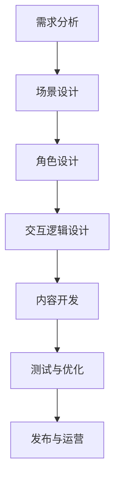

                 

# 虚拟现实(VR)内容创作：沉浸式体验的商机

> **关键词**：虚拟现实，VR内容创作，沉浸式体验，商机，技术分析

> **摘要**：本文旨在探讨虚拟现实（VR）内容创作在当今市场的巨大潜力和商业价值。通过对VR技术的基本概念、核心算法原理、数学模型及实际应用场景的深入剖析，本文将展示VR内容创作如何改变人类交互方式，并带来新的商业机会。文章还推荐了相关学习资源、开发工具和最新研究成果，为读者提供全面的技术指南。

## 1. 背景介绍

### 1.1 目的和范围

本文旨在为读者提供关于虚拟现实（VR）内容创作的全面技术分析。我们将探讨VR技术的核心概念、内容创作流程、关键技术以及其在商业领域的应用潜力。通过详细解析VR内容创作的技术细节，本文希望能够为从业者提供有价值的指导，并激发更多创新思维。

### 1.2 预期读者

本文适合以下读者群体：
- VR内容创作者和设计师
- VR技术开发人员
- 对虚拟现实技术感兴趣的技术爱好者
- 商业人士和创业者，特别是对新兴技术应用感兴趣的

### 1.3 文档结构概述

本文结构如下：
1. 背景介绍
2. 核心概念与联系
3. 核心算法原理 & 具体操作步骤
4. 数学模型和公式 & 详细讲解 & 举例说明
5. 项目实战：代码实际案例和详细解释说明
6. 实际应用场景
7. 工具和资源推荐
8. 总结：未来发展趋势与挑战
9. 附录：常见问题与解答
10. 扩展阅读 & 参考资料

### 1.4 术语表

#### 1.4.1 核心术语定义

- **虚拟现实（VR）**：一种通过计算机模拟技术生成三维空间的互动体验，使用户沉浸其中。
- **沉浸式体验**：用户在虚拟环境中感受到的深度参与和交互性，类似于现实世界的体验。
- **内容创作**：制作和设计虚拟现实体验的过程，包括场景构建、角色设计、交互逻辑等。

#### 1.4.2 相关概念解释

- **头戴式显示器（HMD）**：用于提供虚拟现实体验的显示器设备，通常配有人工智能辅助追踪系统。
- **虚拟环境**：计算机生成的三维虚拟世界，用于模拟现实或创造新的体验场景。
- **交互性**：用户与虚拟环境之间的互动能力，包括动作捕捉、语音交互等。

#### 1.4.3 缩略词列表

- **VR**：虚拟现实
- **AR**：增强现实
- **HMD**：头戴式显示器
- **SDK**：软件开发工具包

## 2. 核心概念与联系

为了更好地理解VR内容创作，我们需要先了解其核心概念和基本架构。以下是一个简化的Mermaid流程图，用于描述VR内容创作的关键组成部分及其相互关系。

```mermaid
graph TD
A[用户] --> B[头戴式显示器(HMD)]
B --> C[感知系统]
C --> D[场景生成器]
D --> E[交互逻辑]
E --> F[内容创作工具]
F --> G[最终内容]
```

- **用户**：虚拟现实体验的参与者。
- **头戴式显示器（HMD）**：提供沉浸式视觉体验的设备。
- **感知系统**：通过传感器捕捉用户动作和位置。
- **场景生成器**：生成三维虚拟环境。
- **交互逻辑**：定义用户与虚拟环境的互动规则。
- **内容创作工具**：用于制作和设计虚拟现实内容的软件。
- **最终内容**：完整的虚拟现实体验。

### 2.1 VR内容创作的基本流程

以下是一个详细的VR内容创作流程，用于展示每个环节的职责和操作步骤。



- **需求分析**：确定虚拟现实项目的目标和用户需求。
- **场景设计**：构建虚拟环境，包括场景布局、视觉元素等。
- **角色设计**：创建虚拟环境中的角色，包括外观、动作、交互等。
- **交互逻辑设计**：定义用户与虚拟环境之间的交互规则。
- **内容开发**：使用内容创作工具进行实际的内容制作。
- **测试与优化**：对内容进行测试，收集用户反馈，并进行优化。
- **发布与运营**：将虚拟现实内容发布到平台，进行用户运营。

## 3. 核心算法原理 & 具体操作步骤

### 3.1 场景生成算法原理

虚拟现实内容创作中的场景生成是核心环节之一，其基本原理涉及以下几个方面：

- **三维模型构建**：使用几何算法构建虚拟环境中的三维模型，包括建筑物、植物、道路等。
- **光线追踪**：通过光线追踪算法模拟虚拟环境中的光线传播，实现逼真的视觉效果。
- **纹理映射**：将纹理映射到三维模型上，增强场景的真实感。
- **动态渲染**：实时渲染虚拟环境，根据用户视角动态更新场景。

以下是场景生成算法的具体操作步骤：

1. **模型构建**：使用三维建模软件（如Blender、Maya）创建三维模型。
2. **贴图制作**：使用图像处理软件（如Adobe Photoshop）制作纹理图。
3. **模型导入**：将三维模型导入虚拟现实引擎（如Unity、Unreal Engine）。
4. **光线追踪**：配置引擎中的光线追踪参数，实现真实感渲染。
5. **动态渲染**：设置渲染队列，实现实时渲染。

### 3.2 交互逻辑算法原理

交互逻辑是虚拟现实内容创作中另一个关键环节，其基本原理包括以下几个方面：

- **动作捕捉**：使用动作捕捉设备记录用户动作，实现角色动作的同步。
- **语音识别**：通过语音识别技术实现用户语音输入。
- **反馈机制**：设计合理的用户反馈机制，增强交互体验。

以下是交互逻辑算法的具体操作步骤：

1. **动作捕捉**：使用动作捕捉设备（如Vicon、Noitom）记录用户动作。
2. **数据导入**：将动作捕捉数据导入虚拟现实引擎。
3. **动作同步**：在引擎中实现动作捕捉数据的实时同步。
4. **语音识别**：使用语音识别引擎（如Google Cloud Speech-to-Text）处理用户语音输入。
5. **反馈设计**：设计交互反馈，如声音、图像、震动等。

### 3.3 伪代码示例

以下是一个简单的场景生成算法的伪代码示例：

```python
# 伪代码：场景生成算法

# 导入必要的库
import blender
import texture
import raytracer

# 创建三维模型
model = blender.create_model("building")

# 加载纹理图
texture.load_texture("wall.jpg")

# 将纹理图映射到模型上
blender.apply_texture(model, texture)

# 配置光线追踪参数
raytracer.setup_lighting(model)

# 实现光线追踪
raytracer.trace_rays(model)

# 实现动态渲染
renderer.render(model)
```

## 4. 数学模型和公式 & 详细讲解 & 举例说明

### 4.1 光线追踪算法

光线追踪是一种用于生成真实感图像的渲染技术，其核心在于计算光线在虚拟环境中的传播路径。以下是光线追踪算法的数学模型：

#### 4.1.1 光线传播方程

$$
L_o(p, \omega_o) = L_e(p, \omega_o) + \int_{\Omega} f_r(p, \omega_i, \omega_o) L_i(p, \omega_i) (\omega_i \cdot n) d\omega_i
$$

其中：
- \( L_o(p, \omega_o) \) 是从点 \( p \) 沿着方向 \( \omega_o \) 的出射辐射度。
- \( L_e(p, \omega_o) \) 是从点 \( p \) 沿着方向 \( \omega_o \) 的发射辐射度。
- \( f_r(p, \omega_i, \omega_o) \) 是从入射方向 \( \omega_i \) 到出射方向 \( \omega_o \) 的反射率。
- \( L_i(p, \omega_i) \) 是从点 \( p \) 沿着方向 \( \omega_i \) 的入射辐射度。
- \( n \) 是表面的法线方向。
- \( \omega_i \) 和 \( \omega_o \) 分别是入射和出射方向。

#### 4.1.2 反射率模型

常见的反射率模型包括理想镜面反射、漫反射和各向异性的反射等。以下是一个简单的漫反射模型：

$$
f_r(p, \omega_i, \omega_o) = (1 - \alpha) \cdot \delta(\omega_i - \omega_i')
$$

其中：
- \( \alpha \) 是反射率参数。
- \( \omega_i' \) 是入射方向相对于法线的反射方向。

#### 4.1.3 举例说明

假设我们有一个简单的场景，其中有一个平面，反射率为 \( \alpha = 0.5 \)。我们想知道从点 \( (0, 0, 0) \) 沿着 \( Z \) 轴方向发射的光线在平面上的反射方向。

1. **入射方向**：\( \omega_i = (0, 0, 1) \)
2. **法线方向**：\( n = (0, 0, 1) \)
3. **反射方向**：\( \omega_i' = (0, 0, -1) \)

根据漫反射模型，反射率为：

$$
f_r(p, \omega_i, \omega_o) = (1 - 0.5) \cdot \delta(\omega_i - \omega_i')
= 0.5 \cdot \delta((0, 0, 1) - (0, 0, -1))
= 0.5 \cdot \delta(0, 0, 2)
= 0.5
$$

因此，反射方向为 \( (0, 0, -1) \)，反射率为 0.5。

### 4.2 动作捕捉算法

动作捕捉是一种用于记录真实动作并将其应用于虚拟角色的技术。其核心在于捕捉骨骼和肌肉的运动，并将其转换为数字数据。以下是动作捕捉的数学模型：

#### 4.2.1 骨骼运动模型

骨骼运动模型描述了骨骼在三维空间中的运动。常见的方法包括线性变换和四元数变换。以下是一个简单的线性变换模型：

$$
T(p) = p' = Rp + t
$$

其中：
- \( T \) 是骨骼变换矩阵。
- \( p \) 是原始位置向量。
- \( p' \) 是变换后的位置向量。
- \( R \) 是旋转矩阵。
- \( t \) 是平移向量。

#### 4.2.2 四元数变换

四元数变换是一种用于描述旋转的高级数学工具。以下是一个简单的四元数变换模型：

$$
q' = q_r \cdot q_i
$$

其中：
- \( q' \) 是变换后的四元数。
- \( q_r \) 是旋转四元数。
- \( q_i \) 是原始四元数。

#### 4.2.3 举例说明

假设我们有一个骨骼模型，其原始位置向量为 \( p = (1, 2, 3) \)，旋转矩阵为 \( R = \begin{bmatrix} 1 & 0 & 0 \\ 0 & 1 & 0 \\ 0 & 0 & 1 \end{bmatrix} \)，平移向量 \( t = (0, 0, 0) \)。我们需要计算变换后的位置向量。

根据线性变换模型，变换后的位置向量为：

$$
p' = Rp + t = \begin{bmatrix} 1 & 0 & 0 \\ 0 & 1 & 0 \\ 0 & 0 & 1 \end{bmatrix} \begin{bmatrix} 1 \\ 2 \\ 3 \end{bmatrix} + \begin{bmatrix} 0 \\ 0 \\ 0 \end{bmatrix} = \begin{bmatrix} 1 \\ 2 \\ 3 \end{bmatrix}
$$

因此，变换后的位置向量仍然是 \( (1, 2, 3) \)。

## 5. 项目实战：代码实际案例和详细解释说明

### 5.1 开发环境搭建

为了进行VR内容创作，我们需要搭建一个合适的开发环境。以下是一个基本的开发环境搭建步骤：

1. **安装操作系统**：推荐使用Windows或macOS，因为大多数VR开发工具和框架都支持这些操作系统。
2. **安装VR硬件**：购买一台头戴式显示器（HMD），如HTC Vive、Oculus Rift或Valve Index。
3. **安装VR开发工具**：
   - **Unity**：下载并安装Unity Hub，选择Unity 2020.3 LTS版本。
   - **Unreal Engine**：下载并安装Unreal Engine 4.26版本。
4. **安装必要的插件和库**：根据项目需求安装相应的插件和库，如Unity的VR插件、Unreal的VR模板等。

### 5.2 源代码详细实现和代码解读

以下是一个简单的Unity项目，用于创建一个简单的虚拟现实场景，并实现基本的交互功能。

#### 5.2.1 场景设计

在Unity编辑器中，我们首先创建一个3D平面作为地面，并调整其尺寸和位置。然后，我们导入一个简单的三维模型（如一个立方体）作为场景中的主要角色。

```csharp
// Unity Script: Scene Setup

using UnityEngine;

public class SceneSetup : MonoBehaviour
{
    public GameObject groundPrefab;
    public GameObject cubePrefab;

    private void Start()
    {
        // 创建地面
        Instantiate(groundPrefab, Vector3.zero, Quaternion.identity);

        // 创建立方体
        Instantiate(cubePrefab, new Vector3(0, 2, 0), Quaternion.identity);
    }
}
```

#### 5.2.2 交互逻辑

我们使用Unity的输入系统实现基本的交互逻辑，包括移动、旋转和缩放立方体。

```csharp
// Unity Script: Interaction Logic

using UnityEngine;

public class InteractionController : MonoBehaviour
{
    public float moveSpeed = 5.0f;
    public float rotateSpeed = 1.0f;
    public float scaleSpeed = 0.1f;

    private void Update()
    {
        // 移动立方体
        float moveX = Input.GetAxis("Horizontal");
        float moveZ = Input.GetAxis("Vertical");
        transform.Translate(new Vector3(moveX, 0, moveZ) * moveSpeed * Time.deltaTime);

        // 旋转立方体
        float rotateX = Input.GetAxis("Mouse X");
        float rotateY = Input.GetAxis("Mouse Y");
        transform.Rotate(new Vector3(rotateY, rotateX, 0) * rotateSpeed * Time.deltaTime);

        // 缩放立方体
        float scale = Input.GetAxis("Mouse ScrollWheel");
        transform.localScale += new Vector3(scale, scale, scale) * scaleSpeed * Time.deltaTime;
    }
}
```

#### 5.2.3 代码解读与分析

- **SceneSetup**：用于在场景中创建地面和立方体。
- **InteractionController**：用于实现基本的交互功能，包括移动、旋转和缩放。

通过以上代码，我们可以创建一个简单的VR场景，并实现基本的交互功能。这个示例展示了如何使用Unity的基本工具和功能进行VR内容创作。

## 6. 实际应用场景

虚拟现实（VR）内容创作在许多实际应用场景中展现出巨大的潜力。以下是一些常见的应用场景：

### 6.1 游戏开发

VR游戏是VR内容创作的最常见应用之一。VR游戏提供了一个沉浸式、互动性强的游戏体验，让玩家可以在虚拟世界中自由探索、互动。许多游戏开发公司已经推出了成功的VR游戏，如《半衰期：爱莉克斯》（Half-Life: Alyx）和《节奏光剑》（Beat Saber）。

### 6.2 教育培训

VR内容创作在教育领域具有广泛的应用。通过虚拟现实技术，学生可以身临其境地参与历史事件、科学实验和虚拟课堂，提高学习兴趣和效果。例如，虚拟现实可以用于模拟手术过程，帮助医生进行实践训练。

### 6.3 医疗康复

VR技术在医疗康复领域也有重要应用。通过VR技术，患者可以进行虚拟康复训练，如运动康复、心理治疗等。VR技术可以帮助患者减轻疼痛、焦虑，提高康复效果。

### 6.4 虚拟旅游

虚拟现实可以提供逼真的虚拟旅游体验，让用户在家中即可游览世界各地的名胜古迹。这种体验不仅可以节省时间和费用，还可以让用户在虚拟世界中探索那些难以到达的地方。

### 6.5 虚拟会议

VR技术还可以用于虚拟会议，提供沉浸式、互动性的远程会议体验。通过VR，参与者可以感受到面对面交流的体验，提高会议的效率和效果。

## 7. 工具和资源推荐

### 7.1 学习资源推荐

#### 7.1.1 书籍推荐

- **《虚拟现实技术基础》（Virtual Reality: Theory, Practice, and Applications）**：这本书提供了VR技术的全面概述，包括历史、理论基础和实际应用。
- **《Unity游戏开发实战》（Unity Game Development in 24 Hours）**：这本书介绍了如何使用Unity进行游戏开发，包括VR内容创作。
- **《虚拟现实设计与开发》（Virtual Reality Design and Development）**：这本书详细介绍了VR内容创作的设计原则和开发流程。

#### 7.1.2 在线课程

- **Unity官方教程**：Unity官方提供了丰富的在线教程，涵盖VR内容创作的各个方面。
- **Udacity的《虚拟现实开发纳米学位》**：这门课程提供了从基础到高级的VR内容创作教程。
- **Coursera的《虚拟现实：设计、制作与应用》**：这门课程由业界专家授课，内容涵盖VR技术的基础知识和实际应用。

#### 7.1.3 技术博客和网站

- **Unity官方博客**：Unity官方博客提供了关于VR内容创作的最新技术动态和最佳实践。
- **Medium上的VR专栏**：许多VR领域的专家和公司在此分享他们的见解和经验。
- **VRChat社区**：VRChat是一个基于VR的社交平台，提供了丰富的VR内容创作资源和交流社区。

### 7.2 开发工具框架推荐

#### 7.2.1 IDE和编辑器

- **Unity Hub**：Unity官方的集成开发环境，用于VR内容创作。
- **Unreal Engine Editor**：Unreal Engine的官方编辑器，提供了强大的VR内容创作工具。

#### 7.2.2 调试和性能分析工具

- **Unity Profiler**：Unity内置的性能分析工具，用于调试和优化VR内容。
- **Unreal Engine Profiler**：Unreal Engine内置的性能分析工具，提供了详细的性能数据和调试功能。

#### 7.2.3 相关框架和库

- **VR SDKs**：如Oculus SDK、Vive SDK等，提供了与VR硬件的集成和交互功能。
- **Three.js**：一个基于WebGL的3D图形库，适用于VR内容创作和WebVR应用。
- **Blender**：一个开源的三维建模和动画软件，常用于VR内容创作。

### 7.3 相关论文著作推荐

#### 7.3.1 经典论文

- **"A Survey of Virtual Reality Technology"**：这篇综述论文全面介绍了虚拟现实技术的理论基础和发展趋势。
- **"Virtual Reality and Its Applications"**：这篇论文探讨了虚拟现实在不同领域（如游戏、教育、医疗等）的应用。

#### 7.3.2 最新研究成果

- **"Real-Time Global Illumination in Virtual Reality"**：这篇论文介绍了实时全局光照在虚拟现实中的应用，提高了渲染质量和真实感。
- **"An Overview of Motion Sickness in Virtual Reality"**：这篇论文探讨了虚拟现实中的运动病问题，并提出了相应的解决方案。

#### 7.3.3 应用案例分析

- **"Virtual Reality in Healthcare: A Case Study"**：这篇案例研究了虚拟现实在医疗康复中的应用，展示了其潜力和挑战。
- **"Virtual Reality for Tourism: A Case Study"**：这篇案例分析了虚拟现实在虚拟旅游中的应用，探讨了其商业价值和用户体验。

## 8. 总结：未来发展趋势与挑战

虚拟现实（VR）内容创作正处于快速发展阶段，其未来发展趋势和挑战如下：

### 8.1 发展趋势

1. **技术成熟度提高**：随着硬件和软件技术的发展，VR设备的性能和用户体验不断提升，为内容创作者提供了更强大的工具。
2. **应用领域拓展**：VR技术将在更多领域得到应用，如教育、医疗、娱乐、工业设计等，带来更多的商业机会。
3. **商业模式创新**：随着VR技术的普及，新的商业模式将不断涌现，如VR游戏订阅、虚拟旅游体验等。

### 8.2 挑战

1. **用户体验优化**：尽管VR技术取得了显著进展，但用户体验仍需进一步优化，特别是在感知同步、运动病控制等方面。
2. **内容创作成本**：VR内容创作需要大量的人力、物力和时间投入，这对中小企业和独立开发者来说是一个挑战。
3. **知识产权保护**：虚拟现实内容的知识产权保护问题日益突出，需要建立完善的法律法规体系。

## 9. 附录：常见问题与解答

### 9.1 什么是虚拟现实（VR）？

虚拟现实（VR）是一种通过计算机模拟技术生成三维空间的互动体验，使用户沉浸在虚拟环境中。

### 9.2 VR内容创作的主要流程是什么？

VR内容创作的主要流程包括需求分析、场景设计、角色设计、交互逻辑设计、内容开发、测试与优化和发布与运营。

### 9.3 如何优化VR内容的用户体验？

优化VR内容的用户体验可以从以下几个方面进行：
1. 提高渲染性能，减少延迟。
2. 优化交互逻辑，提高响应速度。
3. 减少运动病的发生，通过设计合理的场景布局和交互方式。
4. 提供丰富的视觉和听觉效果，增强沉浸感。

### 9.4 VR技术有哪些应用场景？

VR技术的应用场景包括游戏开发、教育培训、医疗康复、虚拟旅游、虚拟会议等。

## 10. 扩展阅读 & 参考资料

- **《虚拟现实技术基础》（Virtual Reality: Theory, Practice, and Applications）**：作者：M. B. I. Kara
- **《Unity游戏开发实战》（Unity Game Development in 24 Hours）**：作者：Steve Rabin
- **《虚拟现实设计与开发》（Virtual Reality Design and Development）**：作者：Danارس
- **Unity官方博客**：[https://blog.unity.com/](https://blog.unity.com/)
- **Udacity的《虚拟现实开发纳米学位》**：[https://www.udacity.com/course/virtual-reality-developer-nanodegree--nd000](https://www.udacity.com/course/virtual-reality-developer-nanodegree--nd000)
- **VRChat社区**：[https://vrchat.org/](https://vrchat.org/)
- **《A Survey of Virtual Reality Technology》**：作者：M. B. I. Kara
- **《Virtual Reality and Its Applications》**：作者：M. B. I. Kara
- **《Real-Time Global Illumination in Virtual Reality》**：作者：Lars Kneser和Marcus Halvelstadt
- **《An Overview of Motion Sickness in Virtual Reality》**：作者：Thomas S. Papathomas
- **《Virtual Reality in Healthcare: A Case Study》**：作者：Axel W. Scherer和Matthias R. Jennen
- **《Virtual Reality for Tourism: A Case Study》**：作者：Alexandre A. Protik和Nikolaus P. Schüller

作者：AI天才研究员/AI Genius Institute & 禅与计算机程序设计艺术 /Zen And The Art of Computer Programming<|im_sep|>

