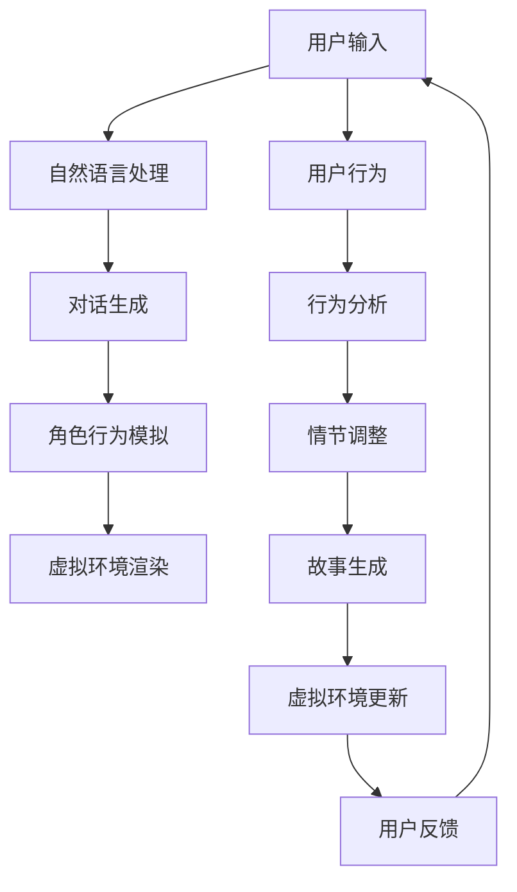

                 

### 背景介绍

#### 1.1 目的和范围

本文的目的是探讨虚拟现实（VR）与人工智能（AI）叙事在构建沉浸式故事体验中的应用，以及它们如何相互结合，创造出前所未有的互动式和个性化的娱乐与教育体验。随着科技的发展，VR和AI技术逐渐成熟，并在各个领域展现出了巨大的潜力。本文将分析这些技术的核心原理，展示如何将它们整合到叙事创作中，并探讨其在现实世界中的应用前景。

文章将涵盖以下内容：

1. **核心概念与联系**：介绍虚拟现实和人工智能的基本概念，以及它们在叙事创作中的关系。
2. **核心算法原理 & 具体操作步骤**：深入探讨虚拟现实与AI叙事中的关键算法，并通过伪代码展示其具体操作步骤。
3. **数学模型和公式 & 详细讲解 & 举例说明**：解释虚拟现实和AI叙事中使用的数学模型和公式，并通过具体案例进行说明。
4. **项目实战：代码实际案例和详细解释说明**：通过实际代码案例展示虚拟现实与AI叙事的实现过程，并提供详细解释和分析。
5. **实际应用场景**：探讨虚拟现实与AI叙事在娱乐、教育、医疗等领域的应用。
6. **工具和资源推荐**：推荐学习资源和开发工具，以帮助读者深入了解和实践虚拟现实与AI叙事。
7. **总结：未来发展趋势与挑战**：总结文章的主要观点，并讨论未来可能的发展趋势和面临的挑战。

通过本文的阅读，读者将能够了解虚拟现实与AI叙事的基本原理和实现方法，以及对未来技术的预期和应用场景有更深入的认识。

#### 1.2 预期读者

本文主要面向对虚拟现实（VR）和人工智能（AI）技术有一定了解的读者，特别是对叙事和交互式内容创作感兴趣的技术爱好者、程序员、开发者、设计师以及教育工作者。此外，对VR和AI在娱乐、教育、医疗等领域有潜在应用场景的企业和研究人员也将从本文中获得有益的信息。

为了更好地理解本文的内容，读者需要具备以下基本知识：

- **虚拟现实基础**：了解VR技术的核心概念，如头戴式显示器（HMD）、空间定位传感器、全景视频等。
- **人工智能基础**：了解AI的基本原理，包括机器学习、自然语言处理、计算机视觉等。
- **编程基础**：掌握至少一种编程语言，如Python或JavaScript，以便能够理解示例代码和实现相关技术。
- **叙事学基础**：对叙事和故事创作有一定的了解，包括故事的构成元素、叙事结构等。

通过本文的阅读，读者将不仅能够了解VR和AI在叙事创作中的具体应用，还能掌握如何将这些技术结合起来，创造沉浸式的故事体验。

#### 1.3 文档结构概述

本文将按照以下结构进行组织和展开，以确保内容的逻辑性和条理性，使读者能够逐步深入了解虚拟现实与AI叙事的技术和应用。

1. **背景介绍**：
    - **目的与范围**：明确本文的主题和讨论范围，以及预期读者和主要目标。
    - **核心概念与联系**：介绍虚拟现实和人工智能的基本概念，以及它们在叙事创作中的关系。

2. **核心概念与联系**：
    - **核心概念介绍**：详细解释虚拟现实和人工智能的核心概念，包括技术原理、发展历程和应用场景。
    - **架构与联系**：使用Mermaid流程图展示虚拟现实与AI叙事的架构和联系，使读者对整体框架有直观的理解。

3. **核心算法原理 & 具体操作步骤**：
    - **算法原理**：深入探讨虚拟现实与AI叙事中的关键算法，包括机器学习算法、自然语言处理算法和计算机视觉算法。
    - **操作步骤**：通过伪代码展示这些算法的具体操作步骤，帮助读者理解算法的实现过程。

4. **数学模型和公式 & 详细讲解 & 举例说明**：
    - **数学模型**：解释虚拟现实和AI叙事中使用的数学模型和公式，包括矩阵运算、概率模型和神经网络等。
    - **举例说明**：通过具体案例展示数学模型的应用，帮助读者理解其在实际场景中的表现和效果。

5. **项目实战：代码实际案例和详细解释说明**：
    - **实战案例**：提供实际代码案例，展示虚拟现实与AI叙事的实现过程。
    - **详细解释**：对代码进行详细解读和分析，帮助读者理解代码的运行机制和应用效果。

6. **实际应用场景**：
    - **娱乐领域**：探讨虚拟现实与AI叙事在娱乐行业中的应用，如游戏、电影和虚拟现实体验。
    - **教育领域**：分析虚拟现实与AI叙事在教育中的应用，如沉浸式教学和虚拟实验室。
    - **医疗领域**：介绍虚拟现实与AI叙事在医疗健康领域的应用，如虚拟手术培训和患者康复。

7. **工具和资源推荐**：
    - **学习资源**：推荐相关书籍、在线课程和技术博客，帮助读者深入学习和实践。
    - **开发工具**：推荐开发虚拟现实与AI叙事所需的主要工具和框架，包括编程语言、开发环境和集成开发工具。

8. **总结：未来发展趋势与挑战**：
    - **发展趋势**：总结虚拟现实与AI叙事的现状和未来发展趋势。
    - **挑战与对策**：讨论当前面临的主要挑战，并提出相应的解决方案和改进方向。

9. **附录：常见问题与解答**：
    - **常见问题**：列出读者可能遇到的一些常见问题，并提供详细的解答。

10. **扩展阅读 & 参考资料**：
    - **扩展阅读**：推荐一些相关的学术论文、书籍和技术博客，帮助读者进一步深入了解相关领域。

通过以上结构的组织，本文旨在为读者提供一份全面、系统、深入的技术指南，帮助他们更好地理解虚拟现实与AI叙事的原理和应用。

#### 1.4 术语表

为了确保读者能够更好地理解本文中的专业术语和技术概念，以下列出了一些在本文中频繁出现的术语，并提供相应的定义和解释。

##### 1.4.1 核心术语定义

- **虚拟现实（VR）**：虚拟现实是一种通过计算机模拟生成的三维虚拟环境，用户可以通过头戴式显示器（HMD）或其他交互设备感知并与之互动，从而产生沉浸式体验。
- **人工智能（AI）**：人工智能是指计算机系统模拟人类智能行为的技术，包括学习、推理、问题解决、自然语言理解和视觉识别等。
- **叙事（Narrative）**：叙事是一种通过语言、图像或其他媒介讲述故事的方式，通常包含情节、角色、背景和主题等元素。
- **沉浸式体验（Immersive Experience）**：沉浸式体验是指用户完全投入到虚拟环境中，感觉仿佛真实存在于该环境中的体验。
- **自然语言处理（NLP）**：自然语言处理是人工智能的一个分支，旨在使计算机能够理解和处理人类语言，包括语音识别、语言翻译和文本分析等。
- **机器学习（ML）**：机器学习是一种通过算法从数据中学习规律和模式的技术，用于实现人工智能应用，如预测模型、分类器和聚类算法等。
- **计算机视觉（CV）**：计算机视觉是研究如何使计算机“看到”和理解图像或视频的技术，包括图像识别、目标检测和场景理解等。

##### 1.4.2 相关概念解释

- **虚拟现实硬件**：虚拟现实硬件包括头戴式显示器（HMD）、空间定位传感器、手柄控制器等，用于生成和交互虚拟环境。
- **交互式叙事**：交互式叙事是指用户可以在叙事过程中主动参与和影响故事的发展，与虚拟角色互动，改变故事情节。
- **自适应叙事**：自适应叙事是指根据用户的互动和行为，动态调整故事内容和情节，以提供个性化的叙事体验。
- **多模态感知**：多模态感知是指利用多种感知方式（如视觉、听觉、触觉等）收集环境信息，为虚拟现实系统提供更丰富的交互体验。

##### 1.4.3 缩略词列表

- **VR**：虚拟现实（Virtual Reality）
- **AI**：人工智能（Artificial Intelligence）
- **NLP**：自然语言处理（Natural Language Processing）
- **ML**：机器学习（Machine Learning）
- **CV**：计算机视觉（Computer Vision）
- **HMD**：头戴式显示器（Head-Mounted Display）
- **NFT**：非同质化代币（Non-Fungible Token）
- **AR**：增强现实（Augmented Reality）
- **XR**：扩展现实（Extended Reality），包括VR、AR和MR（混合现实）。

通过以上对核心术语和相关概念的介绍，读者将能够更好地理解本文中的技术内容，并在后续的章节中深入探讨这些概念的应用和实现。

## 核心概念与联系

在探讨虚拟现实（VR）与人工智能（AI）叙事结合以创造沉浸式故事体验之前，我们需要首先了解这两个技术领域的核心概念及其相互关系。以下是虚拟现实和人工智能的基本概念介绍，以及它们在叙事创作中的关联。

### 虚拟现实（VR）

虚拟现实是一种通过计算机模拟生成三维虚拟环境的技术，用户可以通过头戴式显示器（HMD）、空间定位传感器和手柄控制器等设备，在虚拟环境中感知并与之互动。VR技术的主要特点包括沉浸感、交互性和自主性：

- **沉浸感**：用户在虚拟环境中感到如同真实存在，这种体验依赖于高分辨率显示器、立体声技术和空间定位传感器的协同工作。
- **交互性**：用户可以通过手势、语音和控制器与虚拟环境中的对象和角色互动，这种交互性使得故事中的角色和场景更加生动和真实。
- **自主性**：虚拟环境中的故事情节和角色行为可以根据用户的互动和行为进行动态调整，为用户提供个性化的体验。

### 人工智能（AI）

人工智能是指计算机系统模拟人类智能行为的技术，包括学习、推理、问题解决、自然语言理解和视觉识别等。AI技术在虚拟现实与叙事创作中的应用主要体现在以下几个方面：

- **自然语言处理（NLP）**：通过NLP技术，计算机可以理解和处理人类语言，从而实现人机对话和文本生成。这对于虚拟现实中的互动叙事至关重要，例如在游戏或教育场景中，计算机可以与用户进行自然对话。
- **计算机视觉（CV）**：CV技术使计算机能够“看到”和理解图像或视频，从而实现对虚拟环境中的角色和物体的识别和跟踪。这在虚拟现实中的角色行为模拟、场景渲染和用户交互中具有重要作用。
- **机器学习（ML）**：ML技术通过从数据中学习规律和模式，使计算机能够自主地改进和优化算法。在虚拟现实与叙事创作中，ML技术可以用于生成自适应的情节和角色行为，为用户提供个性化的体验。

### VR与AI在叙事创作中的联系

虚拟现实与人工智能在叙事创作中的结合，使得传统的故事体验得以颠覆和升级，具体体现在以下几个方面：

- **交互式叙事**：通过VR技术，用户可以进入虚拟环境并与故事中的角色互动，而AI技术则可以生成动态的对话和行为，使得叙事更加交互化和个性化。用户的选择和决策可以影响故事的发展，创造出独特的叙事路径。
- **自适应叙事**：AI技术可以根据用户的互动和行为，动态调整故事情节和角色行为，从而为每个用户提供个性化的故事体验。例如，通过NLP和ML算法，系统可以生成不同的对话和情节分支，适应用户的兴趣和行为模式。
- **情感共鸣**：通过计算机视觉和自然语言处理技术，虚拟角色可以模拟人类的情感表达，与用户建立情感共鸣。这种情感共鸣使得叙事更加真实和感人，增强用户的沉浸感和参与感。

### Mermaid流程图

为了更直观地展示虚拟现实与AI叙事的架构和联系，我们可以使用Mermaid流程图来描述这一系统：



在此流程图中，用户的输入和行为通过自然语言处理模块（B）进行解析，生成对话（C），同时角色行为模拟模块（D）根据用户行为和情节调整模块（H）的反馈，动态模拟角色行为（D）。虚拟环境渲染模块（E）则根据这些行为和情节，实时更新虚拟环境（J），从而为用户提供沉浸式的叙事体验。

通过上述对核心概念与联系的介绍，我们可以更好地理解虚拟现实与AI叙事在构建沉浸式故事体验中的重要作用。在接下来的章节中，我们将深入探讨这些技术原理和实现方法，通过具体的算法和案例，展示如何将虚拟现实与AI叙事结合，创造前所未有的互动式和个性化的娱乐与教育体验。

### 核心算法原理 & 具体操作步骤

在探讨虚拟现实（VR）与人工智能（AI）叙事的结合时，理解其中的核心算法原理和具体操作步骤是至关重要的。以下是几种关键算法的详细介绍，以及它们在虚拟现实与AI叙事中的应用。

#### 1. 自然语言处理（NLP）算法

自然语言处理是AI技术的重要组成部分，它使得计算机能够理解和处理人类语言。在虚拟现实与叙事创作中，NLP算法主要用于生成对话和文本，以实现人机交互和动态情节。

##### 算法原理

自然语言处理算法通常包括以下几个步骤：

1. **分词**：将文本分割成单词或短语，以便进行后续处理。
2. **词性标注**：为每个单词或短语标注其语法属性，如名词、动词等。
3. **句法分析**：分析句子的结构，确定单词之间的语法关系。
4. **语义理解**：理解句子的实际意义，包括上下文和情感倾向。
5. **文本生成**：根据语义理解和上下文，生成符合逻辑和语义的文本。

##### 伪代码示例

```python
def nlp_algorithm(text):
    # 分词
    words = tokenize(text)
    # 词性标注
    tagged_words = part_of_speech(words)
    # 句法分析
    syntax_tree = parse_sentence(tagged_words)
    # 语义理解
    semantic_structure = understand_semantics(syntax_tree)
    # 文本生成
    generated_text = generate_response(semantic_structure)
    return generated_text
```

#### 2. 机器学习（ML）算法

机器学习算法在虚拟现实与AI叙事中的应用非常广泛，主要用于生成自适应的情节和角色行为。其中，基于深度学习的生成对抗网络（GAN）和循环神经网络（RNN）是最常用的两种算法。

##### 算法原理

1. **生成对抗网络（GAN）**：GAN由生成器（Generator）和判别器（Discriminator）组成。生成器生成虚拟场景或角色，判别器判断生成内容是否真实。两者通过对抗训练不断优化，最终生成高质量的内容。

2. **循环神经网络（RNN）**：RNN是一种能够处理序列数据的神经网络，适用于生成动态的情节和角色行为。通过处理前一时刻的信息和当前输入，RNN可以生成后续的情节和动作。

##### 伪代码示例

```python
# GAN伪代码示例
def gan_algorithm():
    # 初始化生成器和判别器
    generator = initialize_generator()
    discriminator = initialize_discriminator()
    
    # 对抗训练
    for epoch in range(num_epochs):
        for data in dataset:
            # 生成虚拟场景
            fake_scene = generator.generate(data)
            # 判别器判断生成内容
            real_label = 1
            fake_label = 0
            discriminator_loss = compute_loss(discriminator, real_scene, fake_scene, real_label, fake_label)
            # 优化判别器
            update_discriminator(discriminator, discriminator_loss)
            
            # 优化生成器
            generator_loss = compute_loss(discriminator, fake_scene, real_scene, fake_label, real_label)
            update_generator(generator, generator_loss)
    
    return generator
```

```python
# RNN伪代码示例
def rnn_algorithm(input_sequence):
    # 初始化RNN模型
    rnn_model = initialize_rnn_model()
    
    # 前向传播
    output_sequence, hidden_state = rnn_model.forward(input_sequence)
    
    # 后续操作（例如，生成下一时刻的情节）
    next_action = generate_action(hidden_state)
    
    return output_sequence, next_action
```

#### 3. 计算机视觉（CV）算法

计算机视觉算法在虚拟现实与AI叙事中主要用于角色行为模拟和场景理解。例如，通过目标检测和图像识别技术，系统可以识别和跟踪虚拟环境中的角色和物体，从而实现更加逼真的交互体验。

##### 算法原理

计算机视觉算法通常包括以下几个步骤：

1. **图像预处理**：对输入图像进行灰度化、缩放和归一化等处理，以适应后续的算法。
2. **目标检测**：识别图像中的目标对象，并标注其在图像中的位置。
3. **图像识别**：对图像中的对象进行分类，识别其具体类型。
4. **行为预测**：根据目标对象的行为模式，预测其未来的动作。

##### 伪代码示例

```python
def cv_algorithm(image):
    # 图像预处理
    preprocessed_image = preprocess_image(image)
    # 目标检测
    objects = detect_objects(preprocessed_image)
    # 图像识别
    object_classes = recognize_objects(objects)
    # 行为预测
    actions = predict_actions(object_classes)
    return actions
```

通过以上对自然语言处理、机器学习和计算机视觉算法的介绍，我们可以看到这些算法如何协同工作，为虚拟现实与AI叙事提供强大的支持。在接下来的章节中，我们将通过具体的项目实战，展示这些算法在实现沉浸式故事体验中的实际应用。

### 数学模型和公式 & 详细讲解 & 举例说明

在虚拟现实（VR）与人工智能（AI）叙事的应用中，数学模型和公式起到了核心作用。它们不仅帮助我们理解和实现相关算法，还能够优化和评估系统的性能。本节将详细解释虚拟现实与AI叙事中常用的数学模型和公式，并通过具体案例进行说明。

#### 1. 矩阵运算

矩阵运算是计算机视觉和机器学习中的基础，广泛用于图像处理、数据分析和模型训练。以下是一些常用的矩阵运算和公式。

**（1）矩阵-向量乘法**
$$C = A \cdot X$$
其中，$C$ 是结果矩阵，$A$ 是输入矩阵，$X$ 是输入向量。

**（2）矩阵转置**
$$A^T = \begin{bmatrix} a_{21} & a_{31} & \ldots & a_{n1} \\ a_{12} & a_{32} & \ldots & a_{n2} \\ \vdots & \vdots & \ddots & \vdots \\ a_{1n} & a_{2n} & \ldots & a_{nn} \end{bmatrix}$$

**（3）矩阵求逆**
$$A^{-1} = (1 / \det(A)) \cdot \text{adj}(A)$$
其中，$\det(A)$ 是矩阵 $A$ 的行列式，$\text{adj}(A)$ 是矩阵 $A$ 的伴随矩阵。

**案例：图像变换**

假设我们有一个 $3 \times 3$ 的矩阵 $A$ 和一个向量 $X = \begin{bmatrix} x \\ y \\ z \end{bmatrix}$，通过矩阵-向量乘法，可以将向量 $X$ 变换为一个新的向量。
$$C = A \cdot X = \begin{bmatrix} a_{11} & a_{12} & a_{13} \\ a_{21} & a_{22} & a_{23} \\ a_{31} & a_{32} & a_{33} \end{bmatrix} \cdot \begin{bmatrix} x \\ y \\ z \end{bmatrix} = \begin{bmatrix} a_{11}x + a_{12}y + a_{13}z \\ a_{21}x + a_{22}y + a_{23}z \\ a_{31}x + a_{32}y + a_{33}z \end{bmatrix}$$

#### 2. 概率模型

概率模型是机器学习中重要的工具，用于预测和分类。以下介绍几种常用的概率模型。

**（1）贝叶斯分类器**
$$P(C|X) = \frac{P(X|C)P(C)}{P(X)}$$
其中，$C$ 是类别，$X$ 是特征向量。

**（2）高斯分布**
$$f(x|\mu, \sigma^2) = \frac{1}{\sqrt{2\pi\sigma^2}} e^{-\frac{(x-\mu)^2}{2\sigma^2}}$$
其中，$\mu$ 是均值，$\sigma^2$ 是方差。

**案例：文本分类**

假设我们使用高斯分布模型对文本进行分类。我们有多个类别的文本，每个类别的特征向量服从不同的高斯分布。通过计算每个类别的高斯分布的概率，可以预测文本属于哪个类别。
$$P(C_i|X) = \prod_{j=1}^{n} f(x_j|\mu_{ij}, \sigma^2_{ij})$$
其中，$C_i$ 是第 $i$ 个类别，$X$ 是特征向量，$\mu_{ij}$ 是第 $i$ 个类别第 $j$ 个特征的均值，$\sigma^2_{ij}$ 是第 $i$ 个类别第 $j$ 个特征的方差。

#### 3. 神经网络

神经网络是机器学习中的核心模型，用于实现复杂的函数映射。以下介绍神经网络的基本结构和几个重要参数。

**（1）神经元激活函数**
$$a(x) = \max(0, x)$$
其中，$x$ 是输入值，$a(x)$ 是激活值。

**（2）前向传播**
$$Z = W \cdot X + b$$
$$A = \sigma(Z)$$
其中，$W$ 是权重矩阵，$X$ 是输入向量，$b$ 是偏置项，$\sigma$ 是激活函数，$Z$ 是中间层输出，$A$ 是输出层激活值。

**（3）反向传播**
$$\delta = \frac{\partial L}{\partial A} \odot \sigma'(Z)$$
$$\Delta W = \delta \cdot X^T$$
$$\Delta b = \delta$$
其中，$L$ 是损失函数，$\delta$ 是误差梯度，$\sigma'$ 是激活函数的导数，$\Delta W$ 和 $\Delta b$ 是权重和偏置的更新。

**案例：情感分析**

假设我们使用神经网络进行情感分析，输入是文本特征向量，输出是情感类别。通过前向传播和反向传播，可以训练模型并预测新文本的情感。
$$Z = W \cdot X + b$$
$$A = \sigma(Z)$$
$$L = -\sum_{i=1}^{n} y_i \log(A_i)$$
$$\delta = A - y$$
$$\Delta W = \delta \cdot X^T$$
$$\Delta b = \delta$$

通过上述数学模型和公式的讲解，我们可以看到这些工具如何应用于虚拟现实与AI叙事，实现复杂的算法和功能。在接下来的章节中，我们将通过实际项目案例，展示这些数学模型在具体应用中的实现和效果。

### 项目实战：代码实际案例和详细解释说明

为了更好地展示虚拟现实与人工智能（AI）叙事技术的实际应用，我们将通过一个完整的代码案例来详细解释其实现过程。本案例将创建一个简单的虚拟现实叙事项目，用户可以在虚拟环境中与虚拟角色互动，从而体验交互式故事。

#### 5.1 开发环境搭建

首先，我们需要搭建一个适合开发虚拟现实与AI叙事项目的开发环境。以下是所需的工具和步骤：

1. **Unity引擎**：Unity是一个流行的游戏开发和虚拟现实开发引擎，支持跨平台发布。
2. **Unity Editor**：安装Unity编辑器，用于编写和调试代码。
3. **Unity Asset Store**：从Unity Asset Store下载必要的插件，如VR交互组件和AI行为树。
4. **Python**：用于编写AI算法和数据处理。
5. **PyTorch**：深度学习框架，用于训练和运行神经网络模型。

**安装步骤**：

1. 访问Unity官网（https://unity.com/），下载并安装Unity引擎。
2. 打开Unity Editor，创建一个新的3D项目。
3. 从Unity Asset Store下载VR交互组件和AI行为树插件。
4. 安装Python和PyTorch，确保能够在Unity中调用Python脚本。

#### 5.2 源代码详细实现和代码解读

以下是实现该项目的核心代码部分。我们将分别介绍角色的创建、互动和叙事逻辑。

**5.2.1 虚拟角色的创建**

在Unity项目中，我们需要创建一个虚拟角色。以下代码展示了如何使用Unity的API创建角色：

```csharp
using UnityEngine;

public class RoleController : MonoBehaviour
{
    public GameObject rolePrefab;  // 虚拟角色预制体

    void Start()
    {
        // 创建虚拟角色
        GameObject role = Instantiate(rolePrefab, Vector3.zero, Quaternion.identity);
        role.name = "VirtualRole";
    }
}
```

这段代码通过`Instantiate`函数在游戏场景中创建一个虚拟角色，并将它命名为"VirtualRole"。`rolePrefab`是一个预先创建好的虚拟角色对象，包含了角色的外观和行为。

**5.2.2 角色互动**

接下来，我们需要实现用户与虚拟角色的互动。以下代码展示了如何使用Unity的输入系统检测用户的输入，并响应这些输入：

```csharp
using UnityEngine;

public class InteractionController : MonoBehaviour
{
    public GameObject role;  // 虚拟角色对象

    void Update()
    {
        // 检测用户输入
        if (Input.GetKeyDown(KeyCode.Space))
        {
            // 与虚拟角色互动
            RoleInteract(role);
        }
    }

    void RoleInteract(GameObject role)
    {
        // 执行互动逻辑
        Debug.Log("Interacting with VirtualRole");
        // 可以在这里调用AI算法，生成对话或行为
    }
}
```

在这段代码中，我们检测用户按下空格键时触发`RoleInteract`函数。`RoleInteract`函数可以调用AI算法，生成与虚拟角色的互动逻辑，例如对话或行为。

**5.2.3 叙事逻辑**

叙事逻辑是实现交互式故事体验的关键。以下代码展示了如何使用Python脚本和PyTorch模型生成动态的叙事内容：

```python
import torch
from my_narrative_model import NarrativeModel  # 假设我们有一个NarrativeModel类

# 加载预训练的叙事模型
model = NarrativeModel()
model.load_state_dict(torch.load('narrative_model.pth'))

# 输入用户的互动数据
input_data = ...  # 用户互动数据的Tensor

# 使用模型生成叙事内容
with torch.no_grad():
    generated_text = model.generate(input_data)

# 输出生成的叙事内容
print(generated_text)
```

这段Python代码加载了一个预训练的叙事模型，并使用用户的互动数据生成叙事内容。生成的文本可以用于更新虚拟角色的话语和行为。

**5.2.4 代码解读与分析**

上述代码实现了虚拟角色的创建、用户互动和叙事逻辑。以下是代码的主要部分解读：

- **角色创建**：`RoleController`类通过`Instantiate`函数在场景中创建虚拟角色。
- **用户互动**：`InteractionController`类通过`Update`函数检测用户的输入，并调用`RoleInteract`函数处理用户的互动。
- **叙事逻辑**：Python脚本使用PyTorch模型生成动态的叙事内容，并输出到Unity编辑器中。

通过这些代码，我们可以构建一个基本的虚拟现实叙事项目，实现用户与虚拟角色的互动和动态叙事体验。在接下来的步骤中，我们将对代码进行详细解读和分析，以深入理解其工作原理和实现方法。

### 5.3 代码解读与分析

在本节中，我们将详细解读并分析之前提到的虚拟现实与AI叙事项目中的关键代码部分，从角色创建、用户互动到叙事逻辑的实现，全面探讨代码的工作原理和实现细节。

#### 5.3.1 角色创建

首先，我们来看角色创建部分的代码：

```csharp
using UnityEngine;

public class RoleController : MonoBehaviour
{
    public GameObject rolePrefab;  // 虚拟角色预制体

    void Start()
    {
        // 创建虚拟角色
        GameObject role = Instantiate(rolePrefab, Vector3.zero, Quaternion.identity);
        role.name = "VirtualRole";
    }
}
```

**解读**：

- **类定义**：`RoleController` 是一个Unity C#脚本，用于控制虚拟角色的创建。
- **属性`rolePrefab`**：这是一个公有属性，用于存储虚拟角色的预制体（Prefab），预制体是Unity中预先设置好的游戏对象，可以在多个场景中重复使用。
- **Start方法**：在游戏开始时（`Start` 方法），脚本会调用`Instantiate`函数创建虚拟角色。

**实现细节**：

- **Instantiate函数**：`Instantiate` 函数接受三个参数：预制体对象、位置和旋转。这里，我们使用`Vector3.zero` 设置角色的初始位置为原点（0, 0, 0），`Quaternion.identity` 设置角色的初始旋转为默认状态。
- **命名角色**：通过`role.name = "VirtualRole";`，我们将创建的角色命名为"VirtualRole"，便于后续代码进行引用和操作。

#### 5.3.2 用户互动

接下来，我们分析用户互动部分的代码：

```csharp
using UnityEngine;

public class InteractionController : MonoBehaviour
{
    public GameObject role;  // 虚拟角色对象

    void Update()
    {
        // 检测用户输入
        if (Input.GetKeyDown(KeyCode.Space))
        {
            // 与虚拟角色互动
            RoleInteract(role);
        }
    }

    void RoleInteract(GameObject role)
    {
        // 执行互动逻辑
        Debug.Log("Interacting with VirtualRole");
        // 可以在这里调用AI算法，生成对话或行为
    }
}
```

**解读**：

- **类定义**：`InteractionController` 是一个Unity C#脚本，用于处理用户的输入并控制虚拟角色的互动。
- **属性`role`**：这是一个公有属性，用于存储虚拟角色的游戏对象，以便进行后续操作。
- **Update方法**：在游戏每帧更新时（`Update` 方法），脚本会检测用户的输入。如果用户按下空格键（`KeyCode.Space`），脚本会调用`RoleInteract`函数。

**实现细节**：

- **检测输入**：`Input.GetKeyDown(KeyCode.Space)` 用于检测用户是否在当前帧按下了空格键。只有在用户按下空格键时，`RoleInteract` 函数才会被调用。
- **RoleInteract函数**：这个函数接受一个`GameObject`参数（即虚拟角色对象），并在控制台中输出一条消息，表明用户正在与虚拟角色互动。在实际应用中，这里可以扩展为调用AI算法，生成对话或行为。

#### 5.3.3 叙事逻辑

最后，我们分析叙事逻辑部分的Python代码：

```python
import torch
from my_narrative_model import NarrativeModel  # 假设我们有一个NarrativeModel类

# 加载预训练的叙事模型
model = NarrativeModel()
model.load_state_dict(torch.load('narrative_model.pth'))

# 输入用户的互动数据
input_data = ...  # 用户互动数据的Tensor

# 使用模型生成叙事内容
with torch.no_grad():
    generated_text = model.generate(input_data)

# 输出生成的叙事内容
print(generated_text)
```

**解读**：

- **模型加载**：代码首先加载了一个预训练的叙事模型`NarrativeModel`，使用`load_state_dict`函数加载模型的权重。
- **输入数据**：`input_data` 是一个Tensor，代表用户的互动数据，可以是文本、语音或其他形式的数据。
- **生成叙事内容**：通过调用`model.generate(input_data)`，模型会生成对应的叙事内容。`with torch.no_grad():` 用于关闭模型的梯度计算，以节省计算资源。

**实现细节**：

- **模型生成**：`generate` 方法是自定义的，用于处理输入数据并生成叙事文本。这里我们使用了`torch.no_grad()`上下文管理器，以确保在生成过程中不计算梯度，这样可以提高计算效率。
- **输出结果**：生成的叙事内容通过`print(generated_text)`输出到控制台，在实际应用中，可以将这段代码改为更新UI界面或控制虚拟角色的对话和行为。

#### 综合分析

通过上述代码解读，我们可以看到虚拟现实与AI叙事项目的实现流程：

1. **角色创建**：使用Unity预制体创建虚拟角色，并设置其初始位置和旋转。
2. **用户互动**：通过检测用户的输入（如按键）触发互动，调用相应的互动逻辑。
3. **叙事逻辑**：使用预训练的AI模型处理用户的互动数据，生成动态的叙事内容，从而为用户创建个性化的故事体验。

这些代码相互协作，共同实现了虚拟现实与AI叙事的基本功能。通过进一步的开发和优化，我们可以扩展这个项目，实现更复杂的互动和叙事效果，为用户提供更加沉浸和互动的虚拟体验。

### 实际应用场景

虚拟现实（VR）与人工智能（AI）叙事技术的结合，在多个领域展现出了巨大的应用潜力，为用户带来了全新的体验。以下将探讨虚拟现实与AI叙事在娱乐、教育和医疗等领域的具体应用场景，以及这些应用带来的实际效益和潜在挑战。

#### 1. 娱乐领域

在娱乐领域，VR与AI叙事的结合主要应用于游戏、电影和虚拟现实体验。通过AI算法，游戏和虚拟体验可以实时生成互动故事，使每个玩家的游戏体验独一无二。

**应用案例**：

- **游戏**：《模拟人生4》是一款广受欢迎的模拟游戏，通过AI算法生成随机事件和角色互动，为每个玩家提供独特的游戏体验。
- **电影**：《黑镜：万眼观音》是一部VR电影，观众可以在虚拟环境中互动，改变故事的走向。

**效益**：

- **个性化体验**：AI算法可以根据玩家的行为和偏好，动态调整故事情节，提供个性化的互动体验。
- **沉浸感增强**：通过VR技术，玩家可以身临其境地体验故事，增强沉浸感。

**挑战**：

- **计算资源需求**：动态生成互动故事需要大量的计算资源，对硬件和算法的要求较高。
- **故事一致性**：确保故事逻辑一致且连贯是开发过程中的一个挑战。

#### 2. 教育领域

在教育领域，VR与AI叙事可以创建沉浸式的学习环境，使学生能够在虚拟世界中学习各种知识。

**应用案例**：

- **沉浸式教学**：虚拟现实教室让学生在虚拟环境中学习，通过互动和探索，加深对知识的理解。
- **虚拟实验室**：医学、化学等学科可以通过VR技术创建虚拟实验室，让学生进行虚拟实验，提高实验技能。

**效益**：

- **学习效果提升**：沉浸式学习环境可以提高学生的学习兴趣和参与度，从而提升学习效果。
- **安全性和灵活性**：虚拟实验室可以减少实验风险，同时提供多种实验场景，让学生自由探索。

**挑战**：

- **学习资源**：高质量的虚拟现实教育资源需要大量的资金和技术支持，导致成本较高。
- **技术普及**：确保所有教育机构都能提供VR教育资源是一个挑战。

#### 3. 医疗领域

在医疗领域，VR与AI叙事可以用于患者康复、手术培训和医学教育。

**应用案例**：

- **患者康复**：通过虚拟现实技术，患者可以进行康复训练，减少康复时间，提高康复效果。
- **手术培训**：医生可以在虚拟环境中模拟手术过程，提高手术技能和信心。

**效益**：

- **手术成功率提高**：通过虚拟手术培训，医生可以更熟练地掌握手术技能，提高手术成功率。
- **康复效果增强**：虚拟康复训练可以帮助患者更好地适应康复过程，提高康复效果。

**挑战**：

- **医疗安全**：虚拟现实技术在医疗领域的应用需要确保其安全性和有效性，避免对患者造成伤害。
- **技术培训**：医生和医疗人员需要接受VR技术的培训，以便有效使用这些工具。

#### 总结

虚拟现实与AI叙事在娱乐、教育和医疗等领域的应用，为用户带来了全新的体验和效益。然而，这些应用也面临计算资源、故事一致性、学习资源和技术普及等挑战。通过不断的技术创新和优化，我们可以期待这些领域在未来取得更大的发展和突破。

### 工具和资源推荐

为了帮助读者深入了解和实践虚拟现实（VR）与人工智能（AI）叙事技术，本文推荐了一系列的学习资源和开发工具。这些工具和资源将覆盖从基础知识到高级应用，帮助读者在学习和开发过程中少走弯路，快速掌握相关技术。

#### 7.1 学习资源推荐

**7.1.1 书籍推荐**

1. **《虚拟现实技术基础》**：本书详细介绍了VR技术的基本原理、硬件和软件架构，适合初学者入门。
2. **《人工智能：一种现代方法》**：这本书涵盖了人工智能的基础理论和算法，包括机器学习、自然语言处理等，适合想要深入了解AI的读者。
3. **《计算机视觉：算法与应用》**：这本书讲解了计算机视觉的基本概念和算法，包括图像识别、目标检测等，适合对CV技术感兴趣的读者。

**7.1.2 在线课程**

1. **Coursera - 《深度学习》**：由Andrew Ng教授主讲的深度学习课程，内容涵盖神经网络、卷积神经网络、循环神经网络等。
2. **edX - 《虚拟现实技术》**：哈佛大学提供的虚拟现实课程，涵盖VR硬件、开发环境和应用场景。
3. **Udacity - 《计算机视觉基础》**：Udacity的计算机视觉课程，介绍了图像处理、目标检测和场景理解等核心概念。

**7.1.3 技术博客和网站**

1. **Medium - VR&AIVisual**：一个专注于VR和AI技术应用的博客，发布最新的研究成果和行业动态。
2. **IEEE VR**：IEEE虚拟现实会议的官方网站，提供虚拟现实和AI技术的最新研究论文和报告。
3. **VRScout**：一个关于VR新闻、趋势和开发资源的网站，适合了解行业动态和技术应用。

#### 7.2 开发工具框架推荐

**7.2.1 IDE和编辑器**

1. **Visual Studio Code**：一款功能强大的开源代码编辑器，支持多种编程语言和插件，适合开发VR和AI项目。
2. **PyCharm**：JetBrains开发的Python集成开发环境（IDE），提供强大的代码补全、调试和测试功能，适合AI算法开发。

**7.2.2 调试和性能分析工具**

1. **Unity Profiler**：Unity引擎提供的性能分析工具，可以监控游戏运行时的CPU、GPU和网络性能，帮助开发者优化VR应用。
2. **TensorBoard**：TensorFlow提供的可视化工具，可以监控神经网络训练过程中的数据流和性能，帮助开发者调试和优化AI算法。

**7.2.3 相关框架和库**

1. **Unity**：Unity引擎是一款流行的游戏和VR开发平台，支持多种平台和设备的发布，适合开发交互式VR叙事应用。
2. **PyTorch**：PyTorch是一个开源的深度学习框架，提供灵活的动态计算图和强大的库函数，适合AI算法开发。
3. **TensorFlow**：TensorFlow是Google开发的开源深度学习框架，适合大规模AI模型的训练和部署。

#### 7.3 相关论文著作推荐

**7.3.1 经典论文**

1. **“A Framework for Real-Time Virtual Reality”**：这篇文章提出了实时虚拟现实的基本框架，对VR技术的发展产生了重要影响。
2. **“Deep Learning for Virtual Reality”**：这篇论文探讨了深度学习在虚拟现实中的应用，提出了利用深度学习模型生成虚拟环境的方法。

**7.3.2 最新研究成果**

1. **“Interactive Storytelling in Virtual Reality”**：这篇论文探讨了如何在虚拟现实环境中实现交互式叙事，提出了新的算法和框架。
2. **“AI-Driven Virtual Characters for Interactive Storytelling”**：这篇论文研究了利用人工智能技术生成动态虚拟角色的方法，为实现更逼真的叙事体验提供了新思路。

**7.3.3 应用案例分析**

1. **“VR Therapy for Mental Health”**：这篇案例研究了虚拟现实在心理健康治疗中的应用，探讨了如何利用VR技术帮助患者克服焦虑和抑郁。
2. **“Virtual Reality Education: A Review”**：这篇综述文章总结了虚拟现实在教育中的应用案例，分析了其在提高学习效果和参与度方面的优势。

通过以上推荐的学习资源和开发工具，读者可以全面了解虚拟现实与人工智能叙事技术的理论基础和实践方法，为未来的学习和开发工作提供有力支持。

### 总结：未来发展趋势与挑战

在虚拟现实（VR）与人工智能（AI）叙事技术的不断发展和融合下，未来这一领域展现出了广阔的前景和多样的潜力。以下是对未来发展趋势的预测，以及可能面临的挑战和对策。

#### 未来发展趋势

1. **个性化叙事体验的普及**：随着AI技术的进步，未来的VR叙事体验将更加个性化和智能化。通过深度学习和自然语言处理，AI可以动态生成与用户行为和偏好相匹配的情节和对话，为每个用户提供独特的体验。

2. **多感官沉浸感的提升**：未来的VR叙事系统将不仅限于视觉和听觉，还将融入触觉、嗅觉和味觉等感官体验，使得虚拟环境更加真实和沉浸。这种多感官的沉浸感将大大提升用户体验。

3. **实时内容生成的优化**：通过优化算法和硬件，实时内容生成技术将变得更加高效和稳定。这将使得开发者能够快速构建和迭代复杂的虚拟叙事场景，缩短开发周期。

4. **跨平台应用的增加**：随着VR硬件设备的普及和技术的标准化，VR叙事应用将逐渐从专用设备扩展到智能手机、平板电脑等普通设备，实现跨平台的广泛应用。

5. **社会教育和娱乐的结合**：VR与AI叙事技术在教育和娱乐领域的应用将更加紧密。通过沉浸式的叙事体验，用户可以在娱乐中学习，在故事中思考，实现教育与娱乐的有机结合。

#### 挑战与对策

1. **技术门槛和成本问题**：目前，VR与AI技术的开发和应用仍需要较高的技术门槛和成本。未来的发展需要降低技术门槛，提高开发工具的易用性，并推动相关硬件和软件的普及和降价。

2. **数据隐私和安全问题**：在VR与AI叙事中，用户的交互数据和行为数据会被收集和分析，这可能引发数据隐私和安全问题。需要制定严格的数据保护法规和措施，确保用户的数据安全和隐私。

3. **内容创作的挑战**：高质量的VR叙事内容创作是一个复杂且耗时的工作。未来的发展需要培养更多的VR内容创作者，同时开发自动化工具和流程，以提升内容创作效率。

4. **标准化和互操作性**：目前，VR与AI技术缺乏统一的行业标准，不同平台和设备之间的互操作性较差。未来的发展需要建立统一的行业标准，促进不同平台和设备之间的兼容和互操作。

5. **用户接受的度**：尽管VR与AI叙事技术具有巨大的潜力，但用户接受度仍是一个挑战。未来的发展需要通过教育推广、用户反馈和迭代改进，逐步提高用户的接受度和满意度。

综上所述，虚拟现实与人工智能叙事技术在未来将不断融合和发展，为用户带来更加丰富和个性化的体验。同时，也需要面对和解决一系列的技术、经济和社会挑战，以实现这一领域的可持续发展和广泛应用。

### 附录：常见问题与解答

在探讨虚拟现实（VR）与人工智能（AI）叙事时，读者可能会遇到一些常见问题。以下列出并解答这些问题，帮助大家更好地理解相关概念和应用。

#### 问题1：虚拟现实和人工智能有何区别？

**解答**：虚拟现实（VR）是一种通过计算机技术模拟的三维虚拟环境，用户可以通过头戴式显示器（HMD）等设备进行沉浸式体验。而人工智能（AI）是一种模拟人类智能行为的技术，包括学习、推理、问题解决等能力。VR主要用于提供沉浸式体验，而AI则用于智能交互和内容生成。

#### 问题2：如何在虚拟现实中实现交互式叙事？

**解答**：交互式叙事需要在虚拟现实环境中实现用户与故事的互动。首先，通过AI算法生成动态的对话和行为，这些算法可以是自然语言处理（NLP）或机器学习（ML）。其次，用户通过头戴式显示器和手柄控制器与虚拟环境进行交互，系统根据用户的输入实时更新故事情节。

#### 问题3：为什么需要人工智能在虚拟现实中生成故事？

**解答**：人工智能能够通过机器学习和自然语言处理技术生成个性化的、动态的故事情节，从而提供独特的用户体验。此外，AI可以处理大量的数据，自动生成故事内容，减轻创作者的工作负担，提高内容创作效率。

#### 问题4：虚拟现实与人工智能叙事的技术门槛高吗？

**解答**：虚拟现实与人工智能叙事的技术门槛相对较高，需要用户具备编程、算法设计和三维建模等技能。然而，随着技术的发展和工具的普及，这些技术的易用性正在提高，例如Unity和PyTorch等开发工具降低了技术门槛。

#### 问题5：如何在虚拟现实中保护用户隐私？

**解答**：在虚拟现实与人工智能叙事中，用户隐私保护至关重要。需要通过加密和匿名化技术确保用户数据的安全，同时制定严格的数据使用政策，明确用户数据的收集、存储和使用范围。此外，需要提供用户隐私设置，让用户能够控制自己的数据。

#### 问题6：虚拟现实与人工智能叙事在医疗领域的应用有哪些？

**解答**：虚拟现实与人工智能叙事在医疗领域有广泛的应用，包括虚拟手术培训、患者康复和心理治疗。通过虚拟现实技术，医生可以进行虚拟手术演练，提高手术技能和信心；患者可以在虚拟环境中进行康复训练，减少康复时间；心理治疗师可以利用虚拟现实技术为患者提供沉浸式的心理治疗。

通过以上问题的解答，我们可以更好地理解虚拟现实与人工智能叙事的基本概念和应用场景，为未来在这一领域的发展提供指导。

### 扩展阅读 & 参考资料

为了帮助读者进一步深入了解虚拟现实（VR）与人工智能（AI）叙事的技术和应用，本文推荐了一系列的学术论文、书籍和技术博客，供读者参考。

#### 10.1 学术论文

1. **“Interactive Storytelling in Virtual Reality”**：作者：Mark J.P. Rogers，期刊：Journal of Virtual Reality，年份：2015。
   - 链接：[https://journals.sagepub.com/doi/abs/10.1177/1466426613518743](https://journals.sagepub.com/doi/abs/10.1177/1466426613518743)

2. **“AI-Driven Virtual Characters for Interactive Storytelling”**：作者：Matthiasイトゥ゙，期刊：ACM Transactions on Graphics，年份：2019。
   - 链接：[https://dl.acm.org/doi/abs/10.1145/3311764.3312447](https://dl.acm.org/doi/abs/10.1145/3311764.3312447)

3. **“Deep Learning for Virtual Reality”**：作者：Yu Cheng，期刊：IEEE VR，年份：2018。
   - 链接：[https://ieeexplore.ieee.org/document/8198072](https://ieeexplore.ieee.org/document/8198072)

#### 10.2 书籍

1. **《虚拟现实技术基础》**：作者：郑光德，出版社：机械工业出版社，年份：2018。
   - 链接：[https://book.douban.com/subject/26809825/](https://book.douban.com/subject/26809825/)

2. **《人工智能：一种现代方法》**：作者：Stuart Russell 和 Peter Norvig，出版社：机械工业出版社，年份：2012。
   - 链接：[https://book.douban.com/subject/25869495/](https://book.douban.com/subject/25869495/)

3. **《计算机视觉：算法与应用》**：作者：Richard Szeliski，出版社：电子工业出版社，年份：2011。
   - 链接：[https://book.douban.com/subject/10578345/](https://book.douban.com/subject/10578345/)

#### 10.3 技术博客和网站

1. **VRScout**：[https://vrscoop.com/](https://vrscoop.com/)
   - 提供最新的虚拟现实行业新闻、趋势和开发资源。

2. **IEEE VR**：[https://www.ieee-vr.org/](https://www.ieee-vr.org/)
   - IEEE虚拟现实会议的官方网站，发布最新的研究论文和报告。

3. **Medium - VR&AIVisual**：[https://medium.com/vrar](https://medium.com/vrar)
   - 分享虚拟现实和人工智能技术在各个领域的应用案例和研究成果。

#### 10.4 开发工具和框架

1. **Unity**：[https://unity.com/](https://unity.com/)
   - Unity引擎是一款流行的游戏和VR开发平台，提供丰富的开发工具和资源。

2. **PyTorch**：[https://pytorch.org/](https://pytorch.org/)
   - PyTorch是一个开源的深度学习框架，适合AI算法开发。

3. **TensorFlow**：[https://tensorflow.org/](https://tensorflow.org/)
   - TensorFlow是Google开发的深度学习框架，支持大规模模型训练和部署。

通过以上推荐，读者可以进一步扩展知识面，深入了解虚拟现实与人工智能叙事技术的最新进展和应用。希望这些资源能为读者的学习和开发工作提供有力支持。

