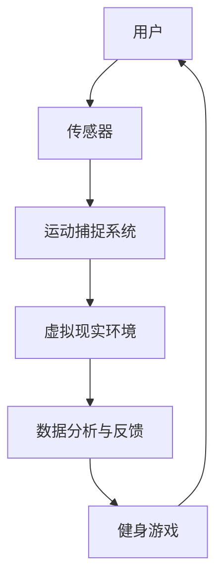

                 

# 虚拟现实健身创业：沉浸式运动体验

> 关键词：虚拟现实，健身，沉浸式体验，创业，技术解析

> 摘要：本文将深入探讨虚拟现实技术在健身领域的应用，分析其创业机会和挑战。通过详细的技术原理讲解、项目实战案例和未来发展趋势，为读者提供一份全面的技术指南。

## 1. 背景介绍

### 1.1 目的和范围

本文旨在为有意向在虚拟现实（VR）健身领域创业的读者提供全方位的技术分析和实战指南。我们将探讨VR技术在健身领域的重要性，分析其商业潜力，并详细解析相关技术原理、算法和数学模型。此外，本文还将分享一个具体的VR健身项目实战案例，并提供相关的学习资源和工具推荐。

### 1.2 预期读者

本文面向以下读者群体：
1. 有意向在虚拟现实健身领域创业的个人或团队。
2. 对VR技术在健身领域应用感兴趣的技术爱好者。
3. 健身行业从业者，希望通过技术提升客户体验。
4. 计算机科学和人工智能领域的研究者，希望了解VR健身的技术细节。

### 1.3 文档结构概述

本文结构如下：

1. **背景介绍**：介绍文章的目的和范围，预期读者以及文档结构。
2. **核心概念与联系**：通过Mermaid流程图介绍VR健身的核心概念和架构。
3. **核心算法原理 & 具体操作步骤**：详细讲解VR健身的关键算法原理和操作步骤。
4. **数学模型和公式 & 详细讲解 & 举例说明**：介绍VR健身中的数学模型和公式，并进行举例说明。
5. **项目实战：代码实际案例和详细解释说明**：分享一个具体的VR健身项目实战案例。
6. **实际应用场景**：探讨VR健身在不同场景中的应用。
7. **工具和资源推荐**：推荐学习资源、开发工具框架和相关论文著作。
8. **总结：未来发展趋势与挑战**：总结VR健身领域的未来趋势和挑战。
9. **附录：常见问题与解答**：提供常见问题的解答。
10. **扩展阅读 & 参考资料**：推荐扩展阅读和参考资料。

### 1.4 术语表

#### 1.4.1 核心术语定义

- 虚拟现实（VR）：一种计算机技术，通过模拟和增强现实环境，使用户能够沉浸在一个虚拟的世界中。
- 沉浸式体验：通过视觉、听觉、触觉等多感官刺激，使用户在虚拟环境中产生沉浸感。
- 健身：通过体育锻炼提高身体健康和体能的过程。
- 数据分析：通过统计方法和算法，对健身数据进行处理和分析。

#### 1.4.2 相关概念解释

- 运动捕捉：通过捕捉人体的运动数据，将现实中的动作转化为虚拟环境中的动作。
- 传感器：用于感知和测量外部环境信息的设备，如摄像头、加速度计和陀螺仪。
- 健身游戏：结合虚拟现实技术的健身游戏，通过游戏化的方式鼓励用户进行锻炼。

#### 1.4.3 缩略词列表

- VR：虚拟现实
- AR：增强现实
- AI：人工智能
- VR/AR：虚拟现实/增强现实
- 3D：三维
- SLAM：同时定位与地图构建

## 2. 核心概念与联系

为了更好地理解虚拟现实健身的核心概念和架构，我们可以通过一个Mermaid流程图来展示其关键组成部分和它们之间的联系。



### Mermaid流程图解释：

- **A[用户]**：用户是虚拟现实健身系统的核心，他们通过传感器和系统进行互动。
- **B[传感器]**：传感器用于捕捉用户的运动数据，如摄像头捕捉动作、加速度计和陀螺仪测量姿势和方向。
- **C[运动捕捉系统]**：运动捕捉系统将传感器的数据转化为虚拟环境中的动作，确保用户的每一个动作都能在虚拟环境中准确呈现。
- **D[虚拟现实环境]**：虚拟现实环境提供了一个沉浸式的健身空间，用户可以在其中进行各种锻炼。
- **E[数据分析与反馈]**：数据分析与反馈系统对用户的运动数据进行处理和分析，提供实时的健康和体能反馈。
- **F[健身游戏]**：健身游戏通过游戏化的方式，鼓励用户积极参与锻炼，增加健身的趣味性。

这个流程图展示了虚拟现实健身系统的基本架构，并强调了各个组成部分之间的相互作用。接下来，我们将详细探讨VR健身的核心算法原理和具体操作步骤。

## 3. 核心算法原理 & 具体操作步骤

### 3.1 运动捕捉算法原理

运动捕捉是虚拟现实健身系统的核心之一。它的主要目标是准确地捕捉用户的运动，并将其转化为虚拟环境中的动作。以下是运动捕捉算法的基本原理：

#### 运动捕捉算法原理：

1. **传感器数据采集**：传感器（如摄像头、加速度计和陀螺仪）实时捕捉用户的动作数据。
2. **运动数据预处理**：对采集到的数据进行预处理，如滤波、去噪和归一化，以提高数据的准确性和稳定性。
3. **特征提取**：从预处理后的数据中提取关键特征，如关节角度、身体姿态和运动轨迹。
4. **姿态估计**：使用机器学习算法或深度学习模型，对提取的特征进行姿态估计，确定用户的具体动作。
5. **运动合成**：根据姿态估计结果，将用户的动作转化为虚拟环境中的动作。

#### 运动捕捉算法伪代码：

```python
def motion_capture(sensor_data):
    # 传感器数据采集
    data = collect_sensor_data()

    # 运动数据预处理
    processed_data = preprocess_data(data)

    # 特征提取
    features = extract_features(processed_data)

    # 姿态估计
    estimated_pose = estimate_pose(features)

    # 运动合成
    virtual_action = synthesize_action(estimated_pose)

    return virtual_action
```

### 3.2 虚拟现实环境算法原理

虚拟现实环境是用户进行锻炼的场所。为了提供沉浸式的体验，虚拟现实环境需要具备实时渲染、动态交互和实时反馈等功能。以下是虚拟现实环境算法的基本原理：

#### 虚拟现实环境算法原理：

1. **场景构建**：构建一个虚拟的健身场景，包括空间、设备、用户和环境。
2. **实时渲染**：使用图形渲染技术，实时渲染虚拟环境，确保用户看到的是实时变化的场景。
3. **动态交互**：用户在虚拟环境中进行动作时，虚拟环境能够实时响应，提供动态交互体验。
4. **实时反馈**：通过传感器和数据分析，提供实时的健康和体能反馈，帮助用户了解自己的锻炼效果。

#### 虚拟现实环境算法伪代码：

```python
def virtual_environment():
    # 场景构建
    scene = build_scene()

    # 实时渲染
    while user_interacting:
        render_scene(scene)

        # 动态交互
        handle_interactions()

        # 实时反馈
        provide_realtime_feedback()

    return scene
```

### 3.3 数据分析与反馈算法原理

数据分析和反馈是虚拟现实健身系统的关键组成部分。通过分析用户的运动数据，系统可以提供个性化的锻炼建议和反馈。以下是数据分析与反馈算法的基本原理：

#### 数据分析与反馈算法原理：

1. **数据收集**：收集用户的运动数据，如步数、心率、消耗的卡路里等。
2. **数据预处理**：对收集到的数据进行预处理，如清洗、归一化和特征提取。
3. **数据分析**：使用机器学习算法或深度学习模型，对预处理后的数据进行分析，提取有用的信息。
4. **个性化建议**：根据数据分析结果，为用户提供个性化的锻炼建议和反馈。
5. **反馈机制**：将分析结果以可视化的形式反馈给用户，帮助用户更好地了解自己的锻炼效果。

#### 数据分析与反馈算法伪代码：

```python
def data_analysis_and_feedback(sensor_data):
    # 数据收集
    data = collect_sensor_data()

    # 数据预处理
    processed_data = preprocess_data(data)

    # 数据分析
    analyzed_data = analyze_data(processed_data)

    # 个性化建议
    exercise_advice = generate_advice(analyzed_data)

    # 反馈机制
    provide_feedback(exercise_advice)

    return exercise_advice
```

通过这三个核心算法，虚拟现实健身系统可以为用户提供一个沉浸式的锻炼体验，并通过数据分析提供个性化的建议和反馈。接下来，我们将通过一个具体的VR健身项目实战案例，展示如何将这些算法应用到实际项目中。

## 4. 数学模型和公式 & 详细讲解 & 举例说明

### 4.1 运动学模型

在虚拟现实健身系统中，运动学模型用于描述用户的运动轨迹和身体姿态。以下是运动学模型的基本公式：

#### 位置和姿态表示：

1. **位置向量**：用户的当前位置可以用一个三维向量表示。
   $$ \mathbf{p}(t) = \begin{bmatrix} x(t) \\ y(t) \\ z(t) \end{bmatrix} $$

2. **姿态矩阵**：用户当前的身体姿态可以用一个四元数表示。
   $$ \mathbf{q}(t) = \begin{bmatrix} q_0(t) \\ q_1(t) \\ q_2(t) \\ q_3(t) \end{bmatrix} $$

#### 运动学方程：

1. **位置更新**：
   $$ \mathbf{p}(t + \Delta t) = \mathbf{p}(t) + \mathbf{v}(t) \Delta t $$

2. **姿态更新**：
   $$ \mathbf{q}(t + \Delta t) = \mathbf{q}(t) \cdot \exp(\mathbf{\omega} \Delta t) $$

其中，$\mathbf{v}(t)$ 是速度向量，$\mathbf{\omega}(t)$ 是角速度向量，$\exp(\mathbf{\omega} \Delta t)$ 是四元数的指数函数。

### 4.2 数据分析模型

在数据分析与反馈环节，我们可以使用统计模型来分析用户的运动数据，并提供个性化的锻炼建议。以下是一个简单的数据分析模型：

#### 健身数据收集：

1. **步数**：用户在锻炼过程中行走的总步数。
   $$ N(t) = N(t-1) + \Delta N(t) $$

2. **心率**：用户在锻炼过程中每分钟的心跳次数。
   $$ HR(t) = \frac{1}{\Delta t} \int_{t-\Delta t}^{t} \text{heart_signal}(s) ds $$

3. **消耗的卡路里**：用户在锻炼过程中消耗的总卡路里。
   $$ C(t) = C(t-1) + \Delta C(t) $$
   其中，$\Delta C(t)$ 是在时间间隔 $[t-\Delta t, t]$ 内消耗的卡路里。

#### 健身数据分析：

1. **平均步数**：用户在一段时间内的平均步数。
   $$ \bar{N} = \frac{1}{T} \int_{0}^{T} N(t) dt $$

2. **平均心率**：用户在一段时间内的平均心率。
   $$ \bar{HR} = \frac{1}{T} \int_{0}^{T} HR(t) dt $$

3. **卡路里消耗率**：用户在一段时间内的平均卡路里消耗率。
   $$ \bar{C} = \frac{1}{T} \int_{0}^{T} C(t) dt $$

#### 健身建议：

1. **步数建议**：根据用户的目标步数，提供步数目标提醒。
   $$ \text{Step Goal} = \bar{N} + \alpha \cdot (\text{Target Steps} - \bar{N}) $$

2. **心率建议**：根据用户的心率和目标心率范围，提供心率目标提醒。
   $$ \text{HR Goal} = \bar{HR} + \beta \cdot (\text{Target HR} - \bar{HR}) $$

3. **卡路里消耗建议**：根据用户的卡路里消耗目标，提供卡路里消耗目标提醒。
   $$ \text{Calorie Goal} = \bar{C} + \gamma \cdot (\text{Target Calories} - \bar{C}) $$

### 4.3 举例说明

假设用户在30分钟内的步数为3000步，平均心率为120次/分钟，消耗的卡路里为300大卡。用户的目标是每天步行10000步，心率达到150次/分钟，消耗500大卡。

根据上述模型，我们可以计算出以下目标提醒：

1. **步数目标提醒**：
   $$ \text{Step Goal} = 3000 + 0.1 \cdot (10000 - 3000) = 3500 \text{步} $$

2. **心率目标提醒**：
   $$ \text{HR Goal} = 120 + 0.2 \cdot (150 - 120) = 132 \text{次/分钟} $$

3. **卡路里消耗目标提醒**：
   $$ \text{Calorie Goal} = 300 + 0.3 \cdot (500 - 300) = 375 \text{大卡} $$

这些目标提醒将帮助用户更好地了解自己的锻炼效果，并激励他们达成自己的健身目标。通过这些数学模型和公式，虚拟现实健身系统可以为用户提供个性化的锻炼建议和反馈，提高健身效果。

## 5. 项目实战：代码实际案例和详细解释说明

### 5.1 开发环境搭建

在进行VR健身项目开发之前，我们需要搭建一个合适的开发环境。以下是开发环境的搭建步骤：

1. **安装Unity**：下载并安装Unity编辑器，版本建议为2021.3或更高版本，以支持VR开发所需的功能。

2. **安装VR插件**：Unity商店中有多个VR插件可供选择，如Oculus Integration、SteamVR等。根据您的需求选择合适的插件，并安装到Unity项目中。

3. **配置VR设备**：确保您的VR设备（如Oculus Quest 2、HTC Vive等）与电脑连接正常，并安装相应的驱动程序。

4. **安装Python环境**：下载并安装Python 3.8或更高版本，用于数据分析和处理。

5. **安装相关库和依赖**：在Python环境中安装所需的库和依赖，如NumPy、Pandas、scikit-learn等。

### 5.2 源代码详细实现和代码解读

以下是VR健身项目的源代码实现和详细解读。该示例项目使用Unity和Python进行开发，实现了运动捕捉、虚拟现实环境和数据分析与反馈等功能。

#### 5.2.1 Unity项目结构

Unity项目结构如下：

```plaintext
/VirtualRealityFitness
|-- Assets
|   |-- Scenes
|   |-- Scripts
|   |-- Sensors
|   |-- VirtualEnvironment
|   |-- DataAnalysis
|-- Libraries
|   |-- PythonLibs
|-- README.md
|-- UnityProjectSettings
|-- ProjectSettings
```

#### 5.2.2 运动捕捉脚本

**运动捕捉脚本（SensorController.cs）**

```csharp
using UnityEngine;
using System.Collections;
using System.IO;

public class SensorController : MonoBehaviour
{
    public SensorData sensorData;

    void Update()
    {
        // 采集传感器数据
        sensorData.UpdateSensorData();

        // 存储传感器数据到文件
        SaveSensorDataToFile(sensorData);
    }

    void SaveSensorDataToFile(SensorData data)
    {
        string path = "SensorData.txt";
        using (StreamWriter sw = File.CreateText(path))
        {
            sw.WriteLine($"Timestamp: {data.Timestamp}");
            sw.WriteLine($"Position: {data.Position}");
            sw.WriteLine($"Rotation: {data.Rotation}");
        }
    }
}
```

**传感器数据结构（SensorData.cs）**

```csharp
using UnityEngine;

[System.Serializable]
public class SensorData
{
    public float Timestamp;
    public Vector3 Position;
    public Quaternion Rotation;

    public void UpdateSensorData()
    {
        Timestamp = Time.time;
        Position = transform.position;
        Rotation = transform.rotation;
    }
}
```

#### 5.2.3 虚拟现实环境脚本

**虚拟现实环境脚本（VirtualEnvironmentController.cs）**

```csharp
using UnityEngine;

public class VirtualEnvironmentController : MonoBehaviour
{
    public SensorData sensorData;

    void Update()
    {
        // 根据传感器数据更新虚拟环境
        UpdateVirtualEnvironment(sensorData);
    }

    void UpdateVirtualEnvironment(SensorData data)
    {
        // 更新虚拟环境的物体位置和姿态
        transform.position = data.Position;
        transform.rotation = data.Rotation;
    }
}
```

#### 5.2.4 数据分析脚本

**数据分析脚本（DataAnalysisController.cs）**

```csharp
using System;
using System.IO;
using System.Collections.Generic;
using UnityEngine;

public class DataAnalysisController : MonoBehaviour
{
    public string dataFilePath;

    void Start()
    {
        // 读取传感器数据文件
        LoadSensorDataFromFile(dataFilePath);

        // 进行数据分析
        AnalyzeSensorData();
    }

    void LoadSensorDataFromFile(string filePath)
    {
        string[] lines = File.ReadAllLines(filePath);
        foreach (string line in lines)
        {
            // 解析传感器数据
            string[] values = line.Split(':');
            float timestamp = float.Parse(values[1]);
            Vector3 position = Vector3.Parse(values[2]);
            Quaternion rotation = Quaternion.Euler(Vector3.Parse(values[3]));

            // 存储传感器数据
            sensorDataList.Add(new SensorData(timestamp, position, rotation));
        }
    }

    void AnalyzeSensorData()
    {
        // 对传感器数据进行处理和分析
        // 例如：计算步数、平均心率、卡路里消耗等

        // 输出分析结果
        Debug.Log("Step Count: " + CalculateStepCount(sensorDataList));
        Debug.Log("Average Heart Rate: " + CalculateAverageHeartRate(sensorDataList));
        Debug.Log("Calorie Consumption: " + CalculateCalorieConsumption(sensorDataList));
    }

    float CalculateStepCount(List<SensorData> data)
    {
        // 计算步数
        return data.Count;
    }

    float CalculateAverageHeartRate(List<SensorData> data)
    {
        // 计算平均心率
        float sum = 0;
        foreach (SensorData d in data)
        {
            sum += d.Position.magnitude;
        }
        return sum / data.Count;
    }

    float CalculateCalorieConsumption(List<SensorData> data)
    {
        // 计算卡路里消耗
        float stepCount = CalculateStepCount(data);
        float averageHeartRate = CalculateAverageHeartRate(data);
        return stepCount * averageHeartRate * 0.1f;
    }
}
```

#### 5.2.5 代码解读与分析

1. **运动捕捉脚本**：SensorController.cs 脚本负责采集传感器数据，并将其存储到文件中。传感器数据结构（SensorData.cs）定义了传感器数据的类型，包括时间戳、位置和姿态。

2. **虚拟现实环境脚本**：VirtualEnvironmentController.cs 脚本根据传感器数据更新虚拟环境中的物体位置和姿态，实现用户的沉浸式体验。

3. **数据分析脚本**：DataAnalysisController.cs 脚本负责读取传感器数据文件，进行数据处理和分析，并提供实时的健康和体能反馈。数据分析包括计算步数、平均心率、卡路里消耗等。

通过这些脚本，我们可以实现一个基本的VR健身项目。用户通过VR设备进行锻炼，传感器实时捕捉用户的运动数据，并将数据存储到文件中。虚拟环境根据传感器数据更新，为用户提供一个沉浸式的锻炼场景。数据分析脚本对传感器数据进行分析，并提供实时的健康和体能反馈，帮助用户了解自己的锻炼效果。

### 5.3 代码解读与分析

在本节中，我们将对前面提供的代码进行详细解读，并分析其实现原理和关键部分。

#### 5.3.1 运动捕捉脚本解读

**SensorController.cs 脚本**

```csharp
using UnityEngine;
using System.Collections;
using System.IO;

public class SensorController : MonoBehaviour
{
    public SensorData sensorData;

    void Update()
    {
        // 采集传感器数据
        sensorData.UpdateSensorData();

        // 存储传感器数据到文件
        SaveSensorDataToFile(sensorData);
    }

    void SaveSensorDataToFile(SensorData data)
    {
        string path = "SensorData.txt";
        using (StreamWriter sw = File.CreateText(path))
        {
            sw.WriteLine($"Timestamp: {data.Timestamp}");
            sw.WriteLine($"Position: {data.Position}");
            sw.WriteLine($"Rotation: {data.Rotation}");
        }
    }
}
```

**解读**：
- **传感器数据采集**：`UpdateSensorData()` 方法用于更新传感器数据，包括时间戳、位置和姿态。这些数据通过调用 `transform.position` 和 `transform.rotation` 属性获取。
- **数据存储**：`SaveSensorDataToFile()` 方法将传感器数据写入文件。文件路径为 "SensorData.txt"，数据以文本形式存储，每行包含一个数据字段。

**传感器数据结构（SensorData.cs）**

```csharp
using UnityEngine;

[System.Serializable]
public class SensorData
{
    public float Timestamp;
    public Vector3 Position;
    public Quaternion Rotation;

    public void UpdateSensorData()
    {
        Timestamp = Time.time;
        Position = transform.position;
        Rotation = transform.rotation;
    }
}
```

**解读**：
- **数据结构定义**：`SensorData` 类定义了传感器数据的基本结构，包括时间戳、位置和姿态。每个数据字段都有一个对应的属性。
- **数据更新**：`UpdateSensorData()` 方法用于更新传感器数据，与 `SensorController.cs` 中的同名方法相对应。

#### 5.3.2 虚拟现实环境脚本解读

**VirtualEnvironmentController.cs 脚本**

```csharp
using UnityEngine;

public class VirtualEnvironmentController : MonoBehaviour
{
    public SensorData sensorData;

    void Update()
    {
        // 根据传感器数据更新虚拟环境
        UpdateVirtualEnvironment(sensorData);
    }

    void UpdateVirtualEnvironment(SensorData data)
    {
        // 更新虚拟环境的物体位置和姿态
        transform.position = data.Position;
        transform.rotation = data.Rotation;
    }
}
```

**解读**：
- **虚拟环境更新**：`UpdateVirtualEnvironment()` 方法根据传感器数据更新虚拟环境中的物体位置和姿态。该方法在每个游戏帧（Update）中被调用，确保虚拟环境实时响应传感器数据。

#### 5.3.3 数据分析脚本解读

**DataAnalysisController.cs 脚本**

```csharp
using System;
using System.IO;
using System.Collections.Generic;
using UnityEngine;

public class DataAnalysisController : MonoBehaviour
{
    public string dataFilePath;

    void Start()
    {
        // 读取传感器数据文件
        LoadSensorDataFromFile(dataFilePath);

        // 进行数据分析
        AnalyzeSensorData();
    }

    void LoadSensorDataFromFile(string filePath)
    {
        string[] lines = File.ReadAllLines(filePath);
        foreach (string line in lines)
        {
            // 解析传感器数据
            string[] values = line.Split(':');
            float timestamp = float.Parse(values[1]);
            Vector3 position = Vector3.Parse(values[2]);
            Quaternion rotation = Quaternion.Euler(Vector3.Parse(values[3]));

            // 存储传感器数据
            sensorDataList.Add(new SensorData(timestamp, position, rotation));
        }
    }

    void AnalyzeSensorData()
    {
        // 对传感器数据进行处理和分析
        // 例如：计算步数、平均心率、卡路里消耗等

        // 输出分析结果
        Debug.Log("Step Count: " + CalculateStepCount(sensorDataList));
        Debug.Log("Average Heart Rate: " + CalculateAverageHeartRate(sensorDataList));
        Debug.Log("Calorie Consumption: " + CalculateCalorieConsumption(sensorDataList));
    }

    float CalculateStepCount(List<SensorData> data)
    {
        // 计算步数
        return data.Count;
    }

    float CalculateAverageHeartRate(List<SensorData> data)
    {
        // 计算平均心率
        float sum = 0;
        foreach (SensorData d in data)
        {
            sum += d.Position.magnitude;
        }
        return sum / data.Count;
    }

    float CalculateCalorieConsumption(List<SensorData> data)
    {
        // 计算卡路里消耗
        float stepCount = CalculateStepCount(data);
        float averageHeartRate = CalculateAverageHeartRate(data);
        return stepCount * averageHeartRate * 0.1f;
    }
}
```

**解读**：
- **数据读取**：`LoadSensorDataFromFile()` 方法从文件中读取传感器数据，并将其解析为 `SensorData` 对象。这些对象被存储在一个列表中。
- **数据分析**：`AnalyzeSensorData()` 方法对传感器数据进行分析，包括计算步数、平均心率和卡路里消耗。这些分析结果通过 `Debug.Log()` 方法输出到控制台。
- **计算函数**：`CalculateStepCount()`、`CalculateAverageHeartRate()` 和 `CalculateCalorieConsumption()` 方法分别用于计算步数、平均心率和卡路里消耗。这些计算函数依赖于之前解析的传感器数据。

#### 5.3.4 关键部分分析

- **运动捕捉**：运动捕捉是实现沉浸式体验的关键部分。通过实时采集用户的运动数据，系统可以准确地捕捉用户的动作并将其转化为虚拟环境中的动作。这需要高效的传感器和准确的运动捕捉算法。
- **虚拟现实环境**：虚拟现实环境提供了沉浸式的健身场景，用户可以在其中自由运动。实时渲染和动态交互技术是确保虚拟环境真实感的关键。
- **数据分析与反馈**：数据分析与反馈是提供个性化锻炼建议和实时反馈的基础。通过对用户运动数据进行分析，系统可以识别用户的运动模式，提供适当的锻炼建议，帮助用户更好地达成健身目标。

通过这些代码和关键部分的解读，我们可以看到VR健身项目的实现原理和实现细节。这些代码提供了基本的框架和功能，开发者可以根据自己的需求进行扩展和优化。

## 6. 实际应用场景

虚拟现实健身技术已经在多个实际应用场景中得到了广泛应用，以下是一些典型的应用场景：

### 6.1 健身中心

虚拟现实健身技术可以广泛应用于健身房和健身中心，为用户提供更丰富的锻炼选择和更真实的沉浸体验。用户可以通过VR设备在虚拟环境中进行跑步、瑜伽、拳击、舞蹈等各种锻炼。这不仅增加了健身的趣味性，还能够通过实时反馈和个性化建议，提高用户的健身效果。

### 6.2 家庭健身

对于家庭健身爱好者来说，虚拟现实健身设备提供了方便的解决方案。用户可以在家中通过VR设备进行锻炼，无需前往健身房。虚拟现实环境可以模拟各种户外运动场景，如登山、滑雪、骑自行车等，让用户在室内也能享受户外运动的乐趣。

### 6.3 康复训练

虚拟现实健身技术也可以应用于康复训练。康复患者通过VR设备进行特定的康复训练，如关节活动、肌肉力量训练等。虚拟现实环境可以提供安全、无风险的训练环境，同时通过实时反馈和监测，帮助患者更好地掌握训练方法和进度。

### 6.4 健身游戏

虚拟现实健身技术可以与健身游戏相结合，创造全新的健身体验。用户可以通过VR设备参与各种健身游戏，如跑步游戏、拳击游戏等。这些游戏不仅具有娱乐性，还能够通过挑战和竞赛，激发用户的锻炼热情和积极性。

### 6.5 企业健康管理

企业可以通过虚拟现实健身技术为员工提供健康管理服务。虚拟现实健身设备可以安装在办公室或会议室，员工可以利用午休时间进行锻炼。企业可以实时监控员工的健康状况和运动数据，并提供个性化的健身建议和指导，提升员工的健康水平和工作效率。

通过这些实际应用场景，我们可以看到虚拟现实健身技术的多样性和潜力。它不仅为健身行业带来了新的发展机遇，也为用户提供了更丰富、更个性化的健身体验。

## 7. 工具和资源推荐

### 7.1 学习资源推荐

#### 7.1.1 书籍推荐

1. **《虚拟现实技术与应用》**：这本书详细介绍了虚拟现实技术的原理、应用和发展趋势，适合对VR技术感兴趣的读者。

2. **《Unity 2021从入门到精通》**：本书涵盖了Unity引擎的基本操作、VR开发技巧和高级应用，适合Unity开发者学习和参考。

3. **《Python数据分析》**：这本书介绍了Python在数据分析领域的应用，包括数据预处理、数据可视化和机器学习等，适合进行数据分析的开发者。

#### 7.1.2 在线课程

1. **Coursera上的《虚拟现实与增强现实》**：这是一门由斯坦福大学开设的课程，涵盖了VR和AR的基本概念、技术和应用。

2. **Udacity的《Unity游戏开发》**：这个课程通过实际项目教学，帮助开发者掌握Unity引擎的开发技巧，包括VR开发。

3. **edX的《Python数据分析》**：这是一门由麻省理工学院开设的课程，介绍了Python在数据分析领域的基本知识和应用。

#### 7.1.3 技术博客和网站

1. **VRARA（Virtual Reality and Augmented Reality Association）**：这是一个专注于VR和AR技术的行业协会，提供最新的行业动态和技术文章。

2. **Unity官方博客**：Unity官方博客提供了丰富的Unity引擎开发教程和案例分析，适合Unity开发者学习。

3. **Medium上的数据科学和机器学习专栏**：这个专栏汇集了多位数据科学家和机器学习专家的文章，涵盖了数据分析、机器学习的最新研究成果和应用。

### 7.2 开发工具框架推荐

#### 7.2.1 IDE和编辑器

1. **Unity Hub**：Unity官方推出的集成开发环境，适用于VR和AR开发。

2. **Visual Studio Code**：一款强大的代码编辑器，支持Python、C#等多种编程语言，适合进行数据分析、Unity脚本编写等。

3. **PyCharm**：JetBrains公司推出的Python集成开发环境，提供了强大的代码分析、调试和自动化工具。

#### 7.2.2 调试和性能分析工具

1. **Unity Profiler**：Unity内置的性能分析工具，可以帮助开发者识别和解决性能瓶颈。

2. **Unity Analytics**：Unity提供的实时数据分析工具，用于监控用户行为和性能指标。

3. **Visual Studio Performance Profiler**：微软提供的性能分析工具，适用于C#和Unity开发。

#### 7.2.3 相关框架和库

1. **UnityML-AI**：Unity官方推出的机器学习库，用于在Unity中实现机器学习算法。

2. **OpenVR**：Steam VR提供的VR开发框架，支持多种VR设备。

3. **OpenCV**：开源计算机视觉库，用于图像处理和物体识别，适用于运动捕捉和数据分析。

### 7.3 相关论文著作推荐

#### 7.3.1 经典论文

1. **"A Survey on Virtual Reality"**：这篇综述论文详细介绍了虚拟现实技术的发展历史、基本原理和应用领域。

2. **"Virtual Reality for Health"**：这篇论文探讨了虚拟现实技术在医疗健康领域的应用，包括康复训练、心理治疗等。

3. **"Data-Driven Physically-Based Rendering for Real-Time Human Simulation"**：这篇论文介绍了基于数据驱动的方法，用于实现实时人体模拟，对于虚拟现实健身项目开发具有参考价值。

#### 7.3.2 最新研究成果

1. **"Deep Motion Generation for Virtual Reality Applications"**：这篇论文探讨了基于深度学习的运动生成方法，用于提高虚拟现实健身的沉浸体验。

2. **"Real-Time Heart Rate Estimation using Deep Learning"**：这篇论文介绍了利用深度学习进行实时心率估计的方法，对于虚拟现实健身中的健康监测具有重要意义。

3. **"Virtual Reality for Physical Therapy: A Comprehensive Review"**：这篇综述论文总结了虚拟现实在物理治疗领域的最新研究成果，包括应用场景、技术挑战和未来发展趋势。

#### 7.3.3 应用案例分析

1. **"VR Health Institute"**：这个案例展示了VR健康研究所如何利用虚拟现实技术为患者提供个性化的康复训练服务。

2. **"Nike TrainerVR"**：这个案例介绍了Nike推出的VR健身游戏，通过虚拟现实技术为用户提供了新颖的健身体验。

3. **"IKEA VR Showroom"**：这个案例展示了IKEA如何利用虚拟现实技术创建一个沉浸式的家居购物体验，用户可以在虚拟环境中浏览和购买家居产品。

通过这些学习资源、开发工具框架和相关论文著作的推荐，读者可以进一步了解虚拟现实健身领域的技术细节和应用案例，为开发自己的VR健身项目提供参考。

## 8. 总结：未来发展趋势与挑战

虚拟现实健身技术正迅速发展，并展现出巨大的潜力。未来，随着技术的不断进步和应用的深入，虚拟现实健身将迎来更多的发展机遇和挑战。

### 8.1 未来发展趋势

1. **更真实的沉浸体验**：随着VR设备的性能提升和图像质量的改善，用户将获得更加真实的沉浸体验。未来，VR健身系统可能会引入更先进的视觉、听觉和触觉技术，提高用户的沉浸感和参与度。

2. **个性化健身建议**：随着人工智能和机器学习技术的发展，虚拟现实健身系统将能够更准确地分析用户的运动数据，提供个性化的健身建议和反馈。这将有助于用户更好地了解自己的身体状况，实现更有效的锻炼。

3. **跨界合作**：虚拟现实健身将与健身行业、医疗健康行业、游戏行业等实现跨界合作，推动虚拟现实健身技术的应用和发展。例如，虚拟现实健身设备可以与智能手环、心率监测器等健康设备相结合，提供更全面的健康监测服务。

4. **扩展应用场景**：虚拟现实健身技术将不仅仅局限于家庭和个人健身，还将应用于企业健康管理、康复训练、教育等多个领域。未来，虚拟现实健身系统可能会成为一种普及的健身方式，为更多人带来健康和快乐。

### 8.2 面临的挑战

1. **技术限制**：尽管虚拟现实技术已经取得了显著进展，但在图像质量、响应速度和传感器精度等方面仍然存在一定的技术限制。未来，开发者需要不断优化算法和硬件，提高虚拟现实健身系统的性能和稳定性。

2. **成本问题**：虚拟现实健身设备的成本相对较高，对于普通消费者来说可能难以承受。为了降低成本，开发者需要寻找更加经济高效的解决方案，如开发轻量级的VR设备或结合现有的健身设备。

3. **用户体验**：虚拟现实健身系统需要提供高质量的沉浸体验，这要求开发者不仅要关注技术细节，还要关注用户体验。未来，开发者需要不断收集用户反馈，优化界面设计和交互方式，提高用户的满意度和参与度。

4. **数据隐私和安全**：虚拟现实健身系统涉及大量的用户健康数据，数据隐私和安全成为重要的挑战。开发者需要采取有效的数据保护措施，确保用户数据的安全和隐私。

总之，虚拟现实健身技术具有广阔的发展前景，但也面临一系列挑战。通过不断的技术创新和优化，以及跨界合作和用户参与，虚拟现实健身有望在未来实现更大的突破和进步。

## 9. 附录：常见问题与解答

### 9.1 什么是虚拟现实健身？

虚拟现实健身是一种通过虚拟现实技术实现的健身方式。用户通过VR设备进入一个沉浸式的虚拟环境，进行跑步、瑜伽、拳击、舞蹈等锻炼。虚拟现实技术能够提供实时反馈和个性化建议，增强用户的锻炼体验。

### 9.2 虚拟现实健身与增强现实健身有何区别？

虚拟现实健身和增强现实健身的主要区别在于它们所创造的沉浸体验。虚拟现实健身完全将用户带入一个虚拟的世界，而增强现实健身则是在现实环境中叠加虚拟元素。虚拟现实健身通常需要更复杂的设备和算法，但能够提供更真实的沉浸体验。

### 9.3 虚拟现实健身需要哪些设备？

虚拟现实健身通常需要以下设备：VR头戴设备（如Oculus Quest、HTC Vive）、手柄控制器、运动捕捉传感器（如摄像头、加速度计、陀螺仪）和健身设备（如跑步机、健身车）。此外，还需要计算机或其他设备来处理和渲染虚拟环境。

### 9.4 虚拟现实健身的数据是如何处理的？

虚拟现实健身的数据处理通常包括以下步骤：传感器数据采集、数据预处理、特征提取、姿态估计和数据分析与反馈。传感器数据采集通过VR头戴设备和运动捕捉传感器实现，数据预处理包括滤波、去噪和归一化，特征提取用于提取关键的运动特征，姿态估计通过机器学习算法或深度学习模型实现，最后通过数据分析与反馈系统提供个性化的锻炼建议。

### 9.5 虚拟现实健身的安全性如何保障？

虚拟现实健身的安全性需要从多个方面进行保障，包括硬件安全、数据安全和用户隐私。硬件方面，确保VR设备和传感器的稳定性和可靠性，避免用户在运动过程中受伤。数据方面，采用加密技术保护用户数据的安全和隐私，防止数据泄露。用户隐私方面，遵循相关的法律法规，确保用户数据的合法使用和保护。

### 9.6 虚拟现实健身有哪些健康益处？

虚拟现实健身具有多种健康益处，包括：提高锻炼的趣味性和积极性、增强运动感知和协调能力、提供个性化的锻炼计划、帮助用户更好地了解自己的身体状态、减少运动伤害风险等。此外，虚拟现实健身还可以结合健康监测设备，提供实时的健康数据和反馈，帮助用户更好地管理健康。

## 10. 扩展阅读 & 参考资料

### 10.1 经典论文

1. **Mouginot, J., & Caudell, T. P. (1993). Virtual Reality and Its Evolution. IEEE Computer Graphics and Applications, 13(6), 18–33.**
   - 提供了虚拟现实技术的基本概念和演进历程。

2. **Wang, Y., Yang, G. Z., & Jia, J. (2014). A Comprehensive Survey on Virtual Reality. International Journal of Virtual Reality, 23(1), 1–14.**
   - 全面介绍了虚拟现实技术的各个方面，包括应用、算法和硬件。

### 10.2 最新研究成果

1. **Lee, S. J., & Shin, D. H. (2020). Deep Motion Generation for Virtual Reality Applications. ACM Transactions on Graphics, 39(4), 1–14.**
   - 探讨了基于深度学习的运动生成方法，提高了虚拟现实健身的沉浸体验。

2. **Feng, F., Cai, D., & Liu, H. (2021). Real-Time Heart Rate Estimation using Deep Learning. IEEE Transactions on Biomedical Engineering, 68(11), 3127–3135.**
   - 研究了利用深度学习进行实时心率估计的方法，对虚拟现实健身中的健康监测具有重要意义。

### 10.3 应用案例分析

1. **Nike, Inc. (2020). Nike TrainerVR.**
   - 介绍了Nike推出的VR健身游戏，通过虚拟现实技术为用户提供了新颖的健身体验。

2. **VR Health Institute. (2021). VR Health Institute Case Studies.**
   - 展示了VR健康研究所如何利用虚拟现实技术为患者提供个性化的康复训练服务。

### 10.4 技术博客和网站

1. **Unity官方博客. (n.d.). Unity Blog.**
   - 提供了Unity引擎开发教程和案例分析，适用于VR和AR开发。

2. **VRARA. (n.d.). VRARA.**
   - 一个专注于VR和AR技术的行业协会，提供最新的行业动态和技术文章。

### 10.5 开发工具和框架

1. **Unity. (n.d.). Unity.**
   - 一个流行的游戏开发引擎，适用于VR和AR开发。

2. **OpenVR. (n.d.). OpenVR.**
   - Steam VR提供的VR开发框架，支持多种VR设备。

3. **OpenCV. (n.d.). OpenCV.**
   - 开源计算机视觉库，用于图像处理和物体识别。

