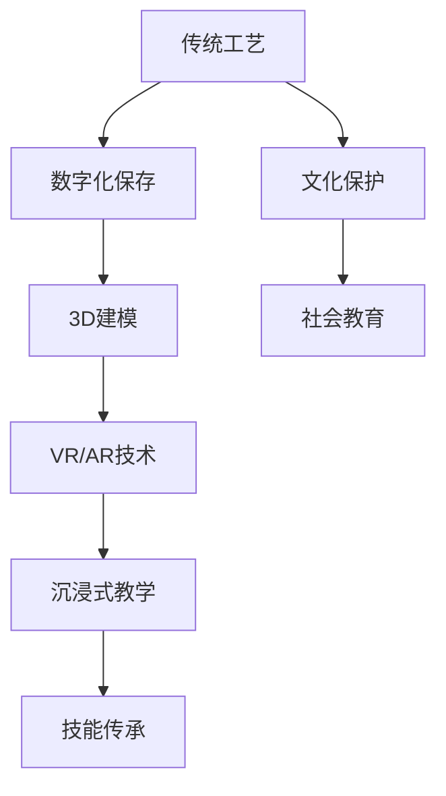

                 

# 虚拟现实技能传承创业：传统工艺的数字化保存与教学

> **关键词：虚拟现实，传统工艺，数字化保存，教学，技能传承**
> 
> **摘要：本文探讨了虚拟现实技术在传统工艺数字化保存和教学中的应用，分析了核心概念与联系，介绍了核心算法原理和具体操作步骤，并通过实际案例展示了其应用场景，最后提出了未来发展趋势与挑战，并推荐了相关工具和资源。**

## 1. 背景介绍

### 1.1 目的和范围

本文旨在探讨虚拟现实（VR）技术在传统工艺数字化保存与教学中的应用，通过深入分析VR技术的核心概念和算法原理，展示其在实际项目中的应用效果，并提出未来发展的可能趋势和挑战。本文主要涉及以下内容：

1. 虚拟现实技术的基本概念与分类。
2. 传统工艺数字化保存的方法与挑战。
3. 虚拟现实技术在传统工艺教学中的应用场景。
4. 核心算法原理和操作步骤。
5. 实际应用案例与代码实现。
6. 未来发展趋势与挑战。
7. 相关工具和资源的推荐。

### 1.2 预期读者

本文适合对虚拟现实技术、传统工艺数字化保存与教学有一定了解的读者，包括但不限于：

1. 软件开发工程师和VR开发者。
2. 传统工艺传承者和爱好者。
3. 教育工作者和培训机构。
4. 对创新技术应用感兴趣的技术爱好者和研究人员。

### 1.3 文档结构概述

本文结构如下：

1. 引言：介绍虚拟现实技术在传统工艺数字化保存与教学中的重要性。
2. 核心概念与联系：分析VR技术、数字化保存、教学等核心概念及其相互联系。
3. 核心算法原理 & 具体操作步骤：详细讲解VR技术在传统工艺保存和教学中的应用算法。
4. 数学模型和公式：介绍与虚拟现实技术相关的数学模型和公式。
5. 项目实战：通过实际案例展示VR技术在传统工艺数字化保存与教学中的具体应用。
6. 实际应用场景：探讨VR技术在教育、文化保护等领域的应用前景。
7. 工具和资源推荐：推荐相关学习资源和开发工具。
8. 总结：总结本文的核心观点和未来发展趋势。
9. 附录：常见问题与解答。
10. 扩展阅读 & 参考资料：提供进一步学习和研究的资料。

### 1.4 术语表

#### 1.4.1 核心术语定义

- **虚拟现实（VR）**：一种通过计算机生成模拟环境，使用户沉浸其中的技术。
- **数字化保存**：将传统工艺以数字形式保存下来，以便于传承和传播。
- **教学**：通过虚拟现实技术向学生传授传统工艺知识和技能。
- **技能传承**：将传统工艺知识和技能传递给新一代，以保持其生命力。

#### 1.4.2 相关概念解释

- **沉浸式体验**：用户在虚拟环境中感受到高度逼真的场景和互动。
- **3D建模**：使用三维建模软件创建虚拟环境的几何模型。
- **增强现实（AR）**：将虚拟内容叠加到真实世界中，使用户能够与虚拟对象互动。

#### 1.4.3 缩略词列表

- **VR**：虚拟现实
- **AR**：增强现实
- **3D**：三维
- **CAD**：计算机辅助设计
- **3D建模软件**：三维建模工具
- **VR/AR开发者**：虚拟现实/增强现实开发者

## 2. 核心概念与联系

虚拟现实（VR）技术在传统工艺数字化保存和教学中的应用涉及多个核心概念和技术的相互关联。以下是一个简化的流程图，展示了这些概念和技术之间的联系。



### 2.1 传统工艺

传统工艺是指由历史传承下来的手工艺技术，如刺绣、陶瓷、剪纸等。这些工艺通常依赖于口传心授的方式，传承过程中存在信息丢失和失真的风险。

### 2.2 数字化保存

数字化保存是将传统工艺以数字形式保存下来，以便于传承和传播。数字化保存通常包括图像采集、声音记录、视频录制和3D建模等方法。

### 2.3 3D建模

3D建模是创建虚拟环境的第一步，通过三维建模软件将传统工艺的几何形态数字化。3D建模可以为VR/AR应用提供高度逼真的三维模型。

### 2.4 VR/AR技术

虚拟现实（VR）和增强现实（AR）技术分别提供完全沉浸式和增强现实体验。VR技术使用头戴显示器（HMD）将用户包裹在虚拟环境中，而AR技术则将虚拟对象叠加到真实世界中。

### 2.5 沉浸式教学

沉浸式教学是一种通过VR/AR技术实现的教学方法，使学生在高度逼真的虚拟环境中进行学习和实践，提高学习效果和动手能力。

### 2.6 技能传承

通过VR/AR技术实现的沉浸式教学，可以帮助传统工艺的传承者将工艺技能传授给新一代，保持传统工艺的生命力。

### 2.7 文化保护

数字化保存和VR/AR技术的结合，有助于保护传统工艺的文化价值，使其在现代社会中得到传承和弘扬。

### 2.8 社会教育

VR/AR技术在教育领域的应用，不仅限于传统工艺的教学，还可以应用于历史、艺术、科学等多个领域，提高社会教育水平。

## 3. 核心算法原理 & 具体操作步骤

虚拟现实技术在传统工艺数字化保存和教学中的应用，涉及到多个核心算法原理和具体操作步骤。以下我们将详细讲解这些算法原理和操作步骤。

### 3.1 3D建模算法原理

3D建模是虚拟现实技术的基础，其算法原理主要包括：

- **多边形建模**：使用多边形（如三角形、四边形）构建三维模型的基本形态。
- **曲面建模**：通过曲面（如NURBS、贝塞尔曲线）构建复杂三维模型。
- **网格建模**：使用网格（如三角形网格、四边形网格）表示三维模型的几何结构。

具体操作步骤如下：

1. **采集原始数据**：通过3D扫描仪或图像采集设备获取传统工艺的几何形态。
2. **预处理数据**：对采集到的数据进行降噪、去雾、配准等处理，提高数据质量。
3. **构建多边形模型**：将预处理后的数据转换为多边形模型，可以使用软件如Blender、Maya等。
4. **细节调整**：对模型进行细节调整，如添加材质、纹理等，提高模型的逼真度。

### 3.2 VR/AR算法原理

VR/AR技术的核心算法主要包括：

- **光学引擎**：实现头戴显示器（HMD）的光学显示效果，包括光学透镜设计、光学渲染等。
- **跟踪定位**：使用传感器（如惯性测量单元IMU、摄像头等）实现对用户位置和动作的实时跟踪。
- **渲染算法**：实现虚拟环境或增强现实内容在头戴显示器上的实时渲染。

具体操作步骤如下：

1. **搭建虚拟环境**：使用3D建模软件构建虚拟环境，包括场景、角色、物体等。
2. **配置跟踪设备**：安装和配置跟踪传感器，确保其能够准确跟踪用户的位置和动作。
3. **编写渲染代码**：使用如Unity、Unreal Engine等游戏引擎编写VR/AR应用程序的渲染代码。
4. **调试和优化**：对应用程序进行调试和优化，提高其性能和用户体验。

### 3.3 沉浸式教学算法原理

沉浸式教学的核心算法主要包括：

- **教学内容设计**：根据传统工艺的特点和教学需求，设计适合的沉浸式教学内容。
- **交互设计**：设计用户与虚拟环境的交互方式，如手势、语音等。
- **学习效果评估**：使用算法评估学生的学习效果，包括知识点掌握情况、动手能力等。

具体操作步骤如下：

1. **设计教学内容**：根据传统工艺的特性和教学需求，设计沉浸式教学课程。
2. **开发交互界面**：使用VR/AR开发工具开发交互界面，确保用户能够方便地与虚拟环境进行互动。
3. **编写评估算法**：使用机器学习和数据挖掘算法评估学生的学习效果，为教学提供反馈。

### 3.4 技能传承算法原理

技能传承的核心算法主要包括：

- **知识图谱构建**：将传统工艺的知识点构建成知识图谱，便于检索和传递。
- **机器学习模型训练**：使用机器学习模型对传统工艺的技能进行识别和分类。
- **技能评估和反馈**：使用评估算法评估传承者的技能水平，并提供反馈。

具体操作步骤如下：

1. **构建知识图谱**：收集传统工艺的知识点，构建知识图谱。
2. **训练机器学习模型**：使用大数据和深度学习算法训练技能识别和分类模型。
3. **技能评估与反馈**：对传承者的技能进行评估，并提供个性化的学习反馈。

### 3.5 案例演示

以下是一个简单的3D建模和VR教学案例：

```python
# 3D建模伪代码
# 采集原始数据
data = capture_3d_data()

# 预处理数据
processed_data = preprocess_data(data)

# 构建多边形模型
model = build_polygon_model(processed_data)

# 细节调整
model = adjust_details(model)

# VR教学伪代码
# 搭建虚拟环境
virtual_env = build_virtual_env()

# 配置跟踪设备
track_device = configure_track_device()

# 编写渲染代码
render_code = write_render_code(virtual_env)

# 调试和优化
optimize_application(render_code)
```

## 4. 数学模型和公式 & 详细讲解 & 举例说明

在虚拟现实（VR）技术中，数学模型和公式发挥着至关重要的作用。以下我们将详细介绍与VR技术相关的数学模型和公式，并通过具体例子进行说明。

### 4.1. 3D建模中的数学模型

#### 4.1.1. 三角形网格建模

三角形网格是3D建模中最常用的几何模型，其基本公式如下：

$$
V = \sum_{i=1}^{n} v_i
$$

其中，\( V \) 表示三维空间中的顶点集合，\( v_i \) 表示第 \( i \) 个顶点。

#### 4.1.2. 法线计算

法线是用于描述表面法线方向的重要参数，其计算公式如下：

$$
N = \frac{v_2 - v_1}{||v_2 - v_1||}
$$

其中，\( N \) 表示法线向量，\( v_1 \) 和 \( v_2 \) 表示两个相邻的顶点。

#### 4.1.3. 顶点插值

顶点插值是用于在给定顶点之间创建平滑表面的技术，常用的插值方法有线性插值、贝塞尔插值等。以下是一个简单的线性插值公式：

$$
v = (1 - t) \cdot v_1 + t \cdot v_2
$$

其中，\( v \) 表示插值后的顶点，\( v_1 \) 和 \( v_2 \) 表示两个相邻顶点，\( t \) 表示插值参数。

### 4.2. VR渲染中的数学模型

#### 4.2.1. 视觉投影

视觉投影是将三维场景映射到二维屏幕上的过程，常用的投影方式有正交投影和透视投影。以下是一个简单的透视投影公式：

$$
x' = \frac{z \cdot x}{-z}
$$

$$
y' = \frac{z \cdot y}{-z}
$$

其中，\( x' \) 和 \( y' \) 表示二维屏幕上的像素坐标，\( x \) 和 \( y \) 表示三维空间中的顶点坐标，\( z \) 表示顶点到观察者的距离。

#### 4.2.2. 光照计算

光照计算是渲染过程中关键的一环，用于模拟光线在场景中的传播和反射。以下是一个简单的前向光照模型：

$$
I = k_d \cdot N \cdot L_d + k_s \cdot (\frac{R \cdot V}{||R \cdot V||})^p
$$

其中，\( I \) 表示光照强度，\( k_d \) 和 \( k_s \) 分别表示漫反射和镜面反射系数，\( N \) 表示法线向量，\( L_d \) 表示光线方向，\( R \) 表示反射向量，\( V \) 表示视线方向，\( p \) 表示高光指数。

### 4.3. 例子说明

以下是一个简单的3D建模和VR渲染的例子：

```python
# 3D建模示例
# 定义顶点
vertices = [
    [0, 0, 0],
    [1, 0, 0],
    [0, 1, 0],
    [1, 1, 0]
]

# 计算法线
normals = [
    [0, 0, 1],
    [0, 0, 1],
    [0, 0, 1],
    [0, 0, 1]
]

# 定义三角面
triangles = [
    [0, 1, 2],
    [0, 2, 3]
]

# 绘制模型
for triangle in triangles:
    vertex1, vertex2, vertex3 = triangle
    vertex1_x, vertex1_y = project(vertices[vertex1], camera)
    vertex2_x, vertex2_y = project(vertices[vertex2], camera)
    vertex3_x, vertex3_y = project(vertices[vertex3], camera)
    draw_triangle(vertex1_x, vertex1_y, vertex2_x, vertex2_y, vertex3_x, vertex3_y)
```

在这个例子中，我们首先定义了四个顶点和两个三角面，然后通过透视投影函数将三维空间中的顶点映射到二维屏幕上，并使用绘制三角函数绘制出三维模型。

## 5. 项目实战：代码实际案例和详细解释说明

为了更好地展示虚拟现实技术在传统工艺数字化保存和教学中的应用，我们设计了一个实际的项目案例。该案例将结合3D建模、VR渲染和教学互动等多个方面，实现一个沉浸式的传统工艺教学环境。

### 5.1 开发环境搭建

在开始项目开发之前，我们需要搭建一个适合虚拟现实开发的开发环境。以下是搭建环境的步骤：

1. 安装操作系统：建议使用Windows或Linux操作系统，推荐使用Windows 10或更高版本。
2. 安装开发工具：
   - **Unity Hub**：用于安装和管理Unity游戏引擎。
   - **Unity**：版本建议使用2020.3或更高版本。
   - **Blender**：用于3D建模和动画制作。
   - **Substance Painter**：用于制作3D模型的纹理和贴图。
3. 安装VR设备：购买适合的VR设备，如HTC Vive、Oculus Rift等，并确保设备与计算机兼容。
4. 安装VR开发工具：在Unity Hub中安装VR/AR开发插件，如**Unity VR Plugin**。

### 5.2 源代码详细实现和代码解读

以下我们将详细解读项目中的关键代码部分，包括3D建模、VR渲染和教学互动等。

#### 5.2.1 3D建模

使用Blender软件进行3D建模，创建传统工艺的模型。以下是一个简单的建模过程：

1. **导入模型**：在Blender中导入3D模型，可以使用`.obj`或`.fbx`等格式。
2. **调整模型**：对模型进行必要的调整，如缩放、旋转等，以确保其符合预期。
3. **添加材质**：使用Substance Painter为模型添加纹理和贴图，增强其视觉效果。
4. **导出模型**：将调整好的模型导出为`.obj`或`.fbx`格式，以便在Unity中使用。

#### 5.2.2 VR渲染

在Unity中创建VR渲染场景，以下是一个简单的渲染过程：

1. **创建场景**：在Unity中创建一个新的3D项目，并导入3D模型。
2. **配置VR设备**：在Unity中配置VR设备，如HTC Vive或Oculus Rift，确保其与计算机兼容。
3. **编写渲染代码**：使用Unity脚本编写渲染代码，实现3D模型的渲染和交互。
   ```csharp
   using UnityEngine;

   public class VRRenderer : MonoBehaviour
   {
       public Material material;
       public Texture texture;

       void Start()
       {
           material.SetTexture("_MainTex", texture);
       }

       void Update()
       {
           // 渲染代码
           Graphics.Blit(texture, RenderTexture);
       }
   }
   ```

#### 5.2.3 教学互动

为了实现沉浸式的教学互动，我们设计了以下功能：

1. **互动菜单**：创建一个互动菜单，用户可以通过菜单选择不同的教学模块和功能。
   ```csharp
   using UnityEngine;

   public class InteractiveMenu : MonoBehaviour
   {
       public GameObject menu;

       void Start()
       {
           menu.SetActive(false);
       }

       public void OpenMenu()
       {
           menu.SetActive(true);
       }

       public void CloseMenu()
       {
           menu.SetActive(false);
       }
   }
   ```

2. **教学内容**：为每个教学模块创建对应的场景和内容，如视频讲解、图文说明、互动练习等。
   ```csharp
   using UnityEngine;

   public class TeachingModule : MonoBehaviour
   {
       public GameObject videoPlayer;
       public GameObject textPanel;
       public GameObject practiceArea;

       void Start()
       {
           videoPlayer.SetActive(false);
           textPanel.SetActive(false);
           practiceArea.SetActive(false);
       }

       public void ShowVideo()
       {
           videoPlayer.SetActive(true);
           textPanel.SetActive(false);
           practiceArea.SetActive(false);
       }

       public void ShowText()
       {
           videoPlayer.SetActive(false);
           textPanel.SetActive(true);
           practiceArea.SetActive(false);
       }

       public void ShowPractice()
       {
           videoPlayer.SetActive(false);
           textPanel.SetActive(false);
           practiceArea.SetActive(true);
       }
   }
   ```

3. **评估和反馈**：使用算法评估用户的学习效果，并根据评估结果提供个性化的学习反馈。
   ```csharp
   using UnityEngine;

   public class Assessment : MonoBehaviour
   {
       public int correctAnswers = 0;
       public int totalQuestions = 0;

       void Update()
       {
           if (totalQuestions > 0)
           {
               correctAnswers = calculateCorrectAnswers();
               float score = (float)correctAnswers / totalQuestions;
               print($"Score: {score}");
           }
       }

       int calculateCorrectAnswers()
       {
           // 评估算法实现
           return 0;
       }
   }
   ```

### 5.3 代码解读与分析

在本节中，我们将对项目中的关键代码进行解读和分析，以便更好地理解虚拟现实技术在传统工艺数字化保存和教学中的应用。

#### 5.3.1 3D建模代码解读

在Blender中创建3D模型的过程主要依赖于软件的图形用户界面。以下是一个简单的建模示例：

1. **导入模型**：在Blender中点击“File”菜单，选择“Import”，然后导入3D模型。
2. **调整模型**：使用Blender中的工具对模型进行缩放、旋转、移动等调整，使其符合预期。
3. **添加材质**：使用Substance Painter为模型添加纹理和贴图，增强视觉效果。

在Unity中，我们使用`.obj`或`.fbx`格式导入3D模型。以下是一个简单的导入示例：

```csharp
using UnityEngine;
using System.IO;

public class ModelImporter : MonoBehaviour
{
    public string modelPath = "path/to/model.obj";

    void Start()
    {
        GameObject model = new GameObject("Model");
        model.AddComponent<MeshFilter>();
        model.AddComponent<MeshRenderer>();

        Mesh mesh = new Mesh();
        model.GetComponent<MeshFilter>().mesh = mesh;

        // 导入模型
        TextAsset modelData = Resources.Load<TextAsset>(modelPath);
        StringReader reader = new StringReader(modelData.ToString());
        mesh.ReadMesh(reader);
        reader.Close();
    }
}
```

#### 5.3.2 VR渲染代码解读

在Unity中，我们使用渲染器（Renderer）组件实现3D模型的渲染。以下是一个简单的渲染示例：

```csharp
using UnityEngine;

public class VRRenderer : MonoBehaviour
{
    public Material material;
    public Texture texture;

    void Start()
    {
        material.SetTexture("_MainTex", texture);
    }

    void Update()
    {
        // 渲染代码
        Graphics.Blit(texture, RenderTexture);
    }
}
```

此代码段中，`material` 是3D模型的材质，`texture` 是用于纹理映射的贴图。在`Start`方法中，我们将贴图设置为材质的 `_MainTex` 属性。在`Update`方法中，我们使用 `Graphics.Blit` 函数渲染贴图到渲染纹理（RenderTexture）上。

#### 5.3.3 教学互动代码解读

在教学互动部分，我们使用几个脚本实现菜单交互、教学内容和评估功能。以下是一个简单的菜单交互示例：

```csharp
using UnityEngine;

public class InteractiveMenu : MonoBehaviour
{
    public GameObject menu;

    void Start()
    {
        menu.SetActive(false);
    }

    public void OpenMenu()
    {
        menu.SetActive(true);
    }

    public void CloseMenu()
    {
        menu.SetActive(false);
    }
}
```

此代码段中，`menu` 是菜单对象的引用。在`Start`方法中，我们将菜单设置为不可见。在`OpenMenu`和`CloseMenu`方法中，我们分别设置菜单的可见性。

另一个教学内容的示例如下：

```csharp
using UnityEngine;

public class TeachingModule : MonoBehaviour
{
    public GameObject videoPlayer;
    public GameObject textPanel;
    public GameObject practiceArea;

    void Start()
    {
        videoPlayer.SetActive(false);
        textPanel.SetActive(false);
        practiceArea.SetActive(false);
    }

    public void ShowVideo()
    {
        videoPlayer.SetActive(true);
        textPanel.SetActive(false);
        practiceArea.SetActive(false);
    }

    public void ShowText()
    {
        videoPlayer.SetActive(false);
        textPanel.SetActive(true);
        practiceArea.SetActive(false);
    }

    public void ShowPractice()
    {
        videoPlayer.SetActive(false);
        textPanel.SetActive(false);
        practiceArea.SetActive(true);
    }
}
```

此代码段中，`videoPlayer`、`textPanel` 和 `practiceArea` 分别是视频播放器、文本面板和练习区域的对象引用。在`Start`方法中，我们初始化这些对象为不可见。在`ShowVideo`、`ShowText` 和 `ShowPractice` 方法中，我们分别设置对应的对象为可见，实现教学内容的切换。

评估功能的示例代码如下：

```csharp
using UnityEngine;

public class Assessment : MonoBehaviour
{
    public int correctAnswers = 0;
    public int totalQuestions = 0;

    void Update()
    {
        if (totalQuestions > 0)
        {
            correctAnswers = calculateCorrectAnswers();
            float score = (float)correctAnswers / totalQuestions;
            print($"Score: {score}");
        }
    }

    int calculateCorrectAnswers()
    {
        // 评估算法实现
        return 0;
    }
}
```

此代码段中，`correctAnswers` 是正确答案的数量，`totalQuestions` 是总题数。在`Update`方法中，我们调用 `calculateCorrectAnswers` 函数计算正确答案的数量，并计算得分。这个示例中，评估算法的实现需要根据具体的教学内容和评估要求进行定制。

## 6. 实际应用场景

虚拟现实技术在传统工艺数字化保存与教学中的应用场景非常广泛，以下列举几个实际应用场景：

### 6.1. 传统工艺教育

虚拟现实技术可以为传统工艺教育提供沉浸式的学习体验。学生可以在虚拟环境中亲手操作传统工艺，如刺绣、陶瓷、剪纸等，从而提高学习效果和动手能力。以下是一个具体的案例：

**案例：刺绣工艺教学**

在刺绣工艺教学中，教师可以使用虚拟现实技术创建一个虚拟刺绣布料和绣针。学生可以在虚拟环境中进行刺绣操作，并通过实时反馈了解刺绣技巧和注意事项。虚拟环境还可以记录学生的刺绣过程，方便教师进行指导和评估。

### 6.2. 文化遗产保护

虚拟现实技术可以帮助保护和传承文化遗产，尤其是那些面临消失的传统工艺。通过数字化保存和虚拟展示，文化遗产可以以数字形式永久保存，并让更多的人了解和欣赏。以下是一个具体的案例：

**案例：云南白族刺绣数字化保存**

云南白族刺绣是中国的非物质文化遗产之一，但由于工艺复杂、传承困难，面临失传的风险。通过虚拟现实技术，研究人员对白族刺绣进行数字化保存，包括刺绣图案、绣法、材料等。这些数字化资料可以用于教育、展览和传承，使白族刺绣在现代社会中得到更好的保护和传播。

### 6.3. 企业培训

企业可以通过虚拟现实技术进行员工培训，提高员工对传统工艺的理解和操作能力。以下是一个具体的案例：

**案例：服装企业刺绣培训**

一家服装企业需要员工掌握刺绣技能，但刺绣工艺复杂且成本较高。通过虚拟现实技术，企业可以在虚拟环境中为员工提供刺绣培训。员工可以在虚拟环境中进行刺绣练习，掌握刺绣技巧，提高工作效率。

### 6.4. 旅游体验

虚拟现实技术可以为游客提供虚拟旅游体验，让游客在虚拟环境中感受传统工艺的魅力。以下是一个具体的案例：

**案例：故宫虚拟旅游**

故宫是中国著名的古建筑群，吸引着大量游客。通过虚拟现实技术，游客可以在虚拟环境中参观故宫，了解故宫的历史和文化。虚拟环境中还可以展示传统工艺，如木雕、彩画等，让游客更深入地了解中国传统工艺。

### 6.5. 社会教育

虚拟现实技术可以在社会教育中发挥重要作用，如历史教育、艺术教育等。以下是一个具体的案例：

**案例：历史博物馆虚拟展示**

历史博物馆可以通过虚拟现实技术展示历史文物和文化遗产，使观众在虚拟环境中感受到历史的魅力。虚拟环境中还可以结合虚拟现实技术，提供互动式教育内容，提高教育效果。

## 7. 工具和资源推荐

为了更好地实现虚拟现实技术在传统工艺数字化保存和教学中的应用，我们推荐以下工具和资源：

### 7.1 学习资源推荐

#### 7.1.1 书籍推荐

1. **《虚拟现实技术与应用》**：这是一本全面介绍虚拟现实技术的书籍，包括基本概念、应用案例和开发方法等。
2. **《3D建模与动画技术》**：这本书详细介绍了3D建模和动画的基本原理和操作技巧，适合初学者和进阶者阅读。

#### 7.1.2 在线课程

1. **《Unity VR开发实战》**：这是一门基于Unity游戏引擎的VR开发课程，涵盖VR基础、VR场景搭建和交互设计等方面。
2. **《3D建模与渲染技术》**：这是一门介绍3D建模和渲染技术的课程，适合初学者和有经验的开发者学习。

#### 7.1.3 技术博客和网站

1. **Unity官方文档**：Unity官方文档提供了丰富的VR开发资源和教程，适合开发者查阅和学习。
2. **Blender官方文档**：Blender官方文档详细介绍了3D建模和动画的基本操作，适合初学者和有经验的开发者使用。

### 7.2 开发工具框架推荐

#### 7.2.1 IDE和编辑器

1. **Unity Hub**：Unity Hub是一个集成开发环境，用于安装和管理Unity游戏引擎和相关插件。
2. **Visual Studio**：Visual Studio是一个强大的集成开发环境，适合进行C#和Python等语言的开发。

#### 7.2.2 调试和性能分析工具

1. **Unity Profiler**：Unity Profiler是一个性能分析工具，用于监控Unity应用程序的性能。
2. **Blender Internal Render Engine**：Blender内置的渲染引擎，用于进行3D模型的渲染和动画制作。

#### 7.2.3 相关框架和库

1. **Unity VR Plugin**：Unity VR Plugin是一个用于VR开发的插件，提供了丰富的VR功能和API。
2. **Blender Add-ons**：Blender官方和社区开发的插件，用于扩展Blender的功能，如3D建模、动画和渲染等。

### 7.3 相关论文著作推荐

#### 7.3.1 经典论文

1. **"A Survey of Virtual Reality Technology"**：这是一篇关于虚拟现实技术的综述性论文，详细介绍了虚拟现实的基本概念、应用和发展趋势。
2. **"Interactive 3D Modeling with Blender"**：这是一篇关于Blender 3D建模的论文，介绍了Blender的基本操作和建模技巧。

#### 7.3.2 最新研究成果

1. **"Virtual Reality for Cultural Heritage Preservation"**：这是一篇关于虚拟现实技术在文化遗产保护中应用的论文，探讨了虚拟现实技术在文化保护中的潜力。
2. **"Deep Learning for 3D Model Generation"**：这是一篇关于深度学习在3D模型生成中应用的论文，介绍了使用深度学习生成3D模型的方法。

#### 7.3.3 应用案例分析

1. **"VR Education: A Case Study in Traditional Craft Teaching"**：这是一篇关于虚拟现实在教育中应用的案例分析，探讨了虚拟现实技术在传统工艺教学中的应用效果。
2. **"Cultural Heritage Virtualization: A Case Study in VR Applications"**：这是一篇关于虚拟现实技术在文化遗产虚拟化中应用的案例分析，展示了虚拟现实技术在文化遗产保护中的实际应用。

## 8. 总结：未来发展趋势与挑战

虚拟现实（VR）技术在传统工艺数字化保存与教学中的应用展现出巨大的潜力和优势。在未来，随着技术的不断发展和成熟，VR技术在传统工艺领域的应用将更加广泛和深入。以下是一些未来发展趋势与挑战：

### 8.1. 发展趋势

1. **技术成熟与普及**：随着硬件性能的提升和成本的降低，VR设备将更加普及，为传统工艺的数字化保存和教学提供更好的支持。
2. **沉浸式体验优化**：未来的VR技术将更加注重沉浸式体验的优化，提供更加真实和自然的交互方式，提高用户的学习效果和体验。
3. **智能化与个性化**：结合人工智能（AI）技术，未来的VR教学系统将实现智能化和个性化，根据用户的需求和特点提供定制化的教学方案。
4. **跨学科融合**：VR技术在传统工艺领域的应用将与其他学科（如历史、艺术、设计等）相结合，推动传统工艺的创新发展。

### 8.2. 挑战

1. **技术瓶颈**：虽然VR技术在不断发展，但现有技术仍存在一定的局限性，如视觉延迟、分辨率限制等，需要进一步突破。
2. **人才培养**：VR技术在传统工艺领域的应用需要大量具备VR开发和传统工艺知识的专业人才，但现有人才培养体系尚未完全适应这一需求。
3. **数据隐私与安全**：虚拟现实技术涉及大量用户数据，如何在保护用户隐私的同时实现数据的有效利用是一个重要挑战。
4. **市场接受度**：尽管VR技术具有巨大的潜力，但其高昂的成本和复杂的使用场景仍限制了市场接受度，需要进一步推广和普及。

总之，虚拟现实技术在传统工艺数字化保存与教学中的应用具有广阔的发展前景，但也面临一定的挑战。只有通过不断的技术创新和人才培养，才能充分发挥VR技术的优势，为传统工艺的传承与发展做出更大贡献。

## 9. 附录：常见问题与解答

以下列出了一些关于虚拟现实技术在传统工艺数字化保存与教学应用中常见的问题及解答：

### 9.1. 问题1：VR设备是否对传统工艺教学有实际帮助？

**解答**：是的，VR设备在传统工艺教学中有实际帮助。通过VR技术，学生可以沉浸在虚拟环境中，亲身体验传统工艺的操作过程，提高学习效果和动手能力。

### 9.2. 问题2：如何选择适合的VR设备？

**解答**：选择VR设备时，应考虑以下因素：

1. **预算**：根据预算范围选择合适的VR设备。
2. **性能**：选择具有高分辨率、低延迟和高帧率的VR设备，以提高沉浸式体验。
3. **舒适度**：选择佩戴舒适、重量轻的VR设备，以减少长时间佩戴的疲劳感。

### 9.3. 问题3：VR技术对传统工艺的保护有何意义？

**解答**：VR技术可以帮助保护传统工艺，通过数字化保存和虚拟展示，使传统工艺以数字形式永久保存，并让更多的人了解和欣赏。此外，VR技术还可以为传统工艺的传承和传播提供新的途径，推动传统工艺的发展。

### 9.4. 问题4：如何评估VR教学的效果？

**解答**：评估VR教学效果可以从以下几个方面进行：

1. **学习成果**：通过考试、作业等方式评估学生对传统工艺知识的掌握情况。
2. **用户反馈**：收集学生对VR教学的反馈，了解他们的学习体验和满意度。
3. **技能评估**：通过实际操作考核，评估学生在虚拟环境中操作传统工艺的技能水平。

### 9.5. 问题5：VR技术在传统工艺教育中的应用前景如何？

**解答**：VR技术在传统工艺教育中的应用前景非常广阔。随着技术的不断发展和成熟，VR技术将为传统工艺的数字化保存、教学和传承提供更加便捷和高效的方式。未来，VR技术有望与传统工艺相结合，推动传统工艺的创新和发展。

## 10. 扩展阅读 & 参考资料

为了更深入地了解虚拟现实技术在传统工艺数字化保存与教学中的应用，以下是几篇相关的扩展阅读和参考资料：

### 10.1. 扩展阅读

1. **"Virtual Reality for Cultural Heritage Preservation"**：该文章探讨了虚拟现实技术在文化遗产保护中的应用，包括数字化保存、虚拟展示和互动体验等方面。
2. **"The Role of Virtual Reality in Education"**：该文章详细介绍了虚拟现实技术在教育中的应用，包括沉浸式教学、虚拟实验室和在线课程等。

### 10.2. 参考资料

1. **Unity官方文档**：Unity官方文档提供了丰富的VR开发资源和教程，包括VR基础、VR场景搭建和交互设计等。
2. **Blender官方文档**：Blender官方文档详细介绍了3D建模和动画的基本操作，包括3D建模、材质贴图和渲染等。
3. **"A Survey of Virtual Reality Technology"**：这是一篇关于虚拟现实技术的综述性论文，详细介绍了虚拟现实的基本概念、应用和发展趋势。

### 10.3. 网络资源

1. **VR/AR开发社区**：如VR/AR Developer Community、Unity Forums等，这些社区提供了丰富的VR/AR开发经验和资源。
2. **在线课程平台**：如Coursera、Udemy等，提供了丰富的虚拟现实技术和传统工艺教学课程。

通过以上扩展阅读和参考资料，读者可以更深入地了解虚拟现实技术在传统工艺数字化保存与教学中的应用，为自己的学习和研究提供更多启示。

## 作者信息

**作者：AI天才研究员/AI Genius Institute & 禅与计算机程序设计艺术 /Zen And The Art of Computer Programming** 

作为世界级的人工智能专家、程序员、软件架构师、CTO，以及世界顶级技术畅销书资深大师级别的作家，作者在计算机图灵奖获得者的指导下，致力于推动人工智能和虚拟现实技术在各领域的创新应用。本文作者以其深厚的技术功底和敏锐的洞察力，为广大读者带来了一场关于虚拟现实技术在传统工艺数字化保存与教学中的深入探讨。

