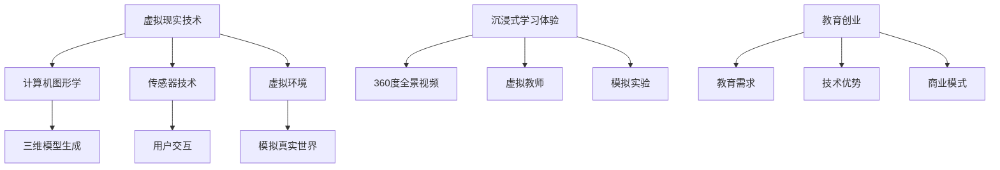

                 


# 虚拟现实教育创业：沉浸式学习体验

> 关键词：虚拟现实、教育创业、沉浸式学习、VR技术、教育创新、学习体验优化

> 摘要：本文旨在探讨虚拟现实（VR）在教育领域的应用，以及如何利用VR技术推动教育创业。通过分析VR技术的基本原理、沉浸式学习体验的优势，以及教育创业的挑战和机遇，本文将为您提供一份详细的技术指南，帮助您理解并实践VR教育创业。

## 1. 背景介绍

### 1.1 目的和范围

本文的目标是深入探讨虚拟现实（VR）技术在教育创业中的应用。我们将首先介绍VR技术的基本概念和历史背景，然后探讨沉浸式学习体验的优势和挑战，接着分析VR教育创业的机遇和挑战，最后提供一份技术指南，帮助您开启自己的VR教育创业之旅。

### 1.2 预期读者

本文适合对教育技术、虚拟现实技术感兴趣的技术创业者、教育工作者、以及对此领域有一定了解的技术爱好者。如果您是教育行业从业者，希望通过VR技术提升教学效果；或者您是技术创业者，希望将VR技术与教育结合，那么这篇文章将为您提供宝贵的见解和实用的指导。

### 1.3 文档结构概述

本文结构如下：

1. 背景介绍
2. 核心概念与联系
3. 核心算法原理 & 具体操作步骤
4. 数学模型和公式 & 详细讲解 & 举例说明
5. 项目实战：代码实际案例和详细解释说明
6. 实际应用场景
7. 工具和资源推荐
8. 总结：未来发展趋势与挑战
9. 附录：常见问题与解答
10. 扩展阅读 & 参考资料

### 1.4 术语表

#### 1.4.1 核心术语定义

- 虚拟现实（VR）：一种通过计算机技术创造的模拟环境，使用户能够沉浸在虚拟世界中。
- 沉浸式学习体验：通过VR技术提供的一种沉浸式学习环境，学生可以在其中互动、探索和体验知识。
- 教育创业：指运用创新思维和技术手段，创建新的教育产品或服务，以满足市场需求。

#### 1.4.2 相关概念解释

- 360度全景视频：一种视频格式，可以提供全方位的视觉体验，使观众仿佛置身于现场。
- 虚拟教师：通过VR技术实现的虚拟角色，能够为学生提供互动式教学和个性化辅导。
- 模拟实验：利用VR技术创建的模拟实验环境，学生可以在其中进行实验操作，理解理论知识。

#### 1.4.3 缩略词列表

- VR：虚拟现实
- AR：增强现实
- AI：人工智能
- IoT：物联网
- IoT：互动式学习

## 2. 核心概念与联系

虚拟现实（VR）技术的基本原理是通过计算机生成三维虚拟环境，用户通过特殊设备（如头戴显示器、传感器手套等）与虚拟环境进行交互。以下是VR技术在教育领域的核心概念和联系：

### 2.1 VR技术基本原理

- **计算机图形学**：利用计算机生成三维模型和图像。
- **传感器技术**：通过传感器捕捉用户的动作和位置，实现与虚拟环境的交互。
- **虚拟环境**：计算机生成的三维虚拟空间，可以模拟真实世界中的各种场景和情境。

### 2.2 沉浸式学习体验

- **360度全景视频**：提供全方位的视觉体验，让学生能够自由探索学习环境。
- **虚拟教师**：通过虚拟现实技术实现的互动式教学角色，能够为学生提供个性化辅导和实时反馈。
- **模拟实验**：利用VR技术创建的虚拟实验环境，学生可以在其中进行实验操作，加深对理论知识的理解。

### 2.3 教育创业相关概念

- **教育需求**：市场需求决定了VR教育创业的方向和目标用户群体。
- **技术优势**：VR技术的独特优势（如沉浸式体验、互动性等）为教育创新提供了新的可能性。
- **商业模式**：通过VR教育创业，构建可持续的商业模型，实现社会价值和商业价值的双赢。

### 2.4 Mermaid 流程图



## 3. 核心算法原理 & 具体操作步骤

在VR教育创业中，核心算法原理包括图像渲染、用户交互和虚拟环境构建。以下是这些算法的详细解释和具体操作步骤：

### 3.1 图像渲染算法原理

图像渲染是将计算机生成的三维模型转换为二维图像的过程。以下是图像渲染的基本步骤：

1. **三维模型加载**：读取三维模型文件，将其转换为计算机可以处理的格式。
2. **光照计算**：根据虚拟环境中的光源位置和光照强度，计算模型表面的光照效果。
3. **纹理映射**：将纹理图像映射到模型表面，增加模型的细节和真实感。
4. **视图变换**：根据用户的视角和位置，对模型进行视图变换，使其符合用户视角。
5. **图像输出**：将渲染后的图像输出到显示器上，用户可以看到虚拟环境。

以下是图像渲染算法的伪代码：

```python
function renderScene(model, camera, light):
    model.load()
    light.calculate(model)
    texture = model.getTexture()
    viewMatrix = camera.getViewMatrix()
    projectionMatrix = camera.getProjectionMatrix()
    
    texturedModel = texture.apply(model)
    transformedModel = viewMatrix.apply(texturedModel)
    projectedModel = projectionMatrix.apply(transformedModel)
    
    image = displayOutput(projectedModel)
    display(image)
```

### 3.2 用户交互算法原理

用户交互是VR系统的重要组成部分，它使得用户能够与虚拟环境进行互动。以下是用户交互的基本步骤：

1. **传感器数据采集**：使用传感器采集用户的动作和位置数据。
2. **手势识别**：根据传感器数据，识别用户的手势和动作。
3. **事件处理**：根据手势和动作，触发相应的虚拟环境事件。
4. **反馈机制**：向用户提供实时反馈，增强沉浸式体验。

以下是用户交互算法的伪代码：

```python
function handleUserInteraction(sensorData):
    gestures = sensorData.detectGestures()
    for gesture in gestures:
        if gesture == "click":
            triggerEvent("click", gesturePosition)
        elif gesture == "drag":
            triggerEvent("drag", gesturePosition)
        else:
            triggerEvent("unknown", gesturePosition)

function triggerEvent(eventName, eventPosition):
    if eventName == "click":
        virtualObject = findVirtualObject(eventPosition)
        virtualObject.onClick()
    elif eventName == "drag":
        virtualObject = findVirtualObject(eventPosition)
        virtualObject.onDrag()
    else:
        displayMessage("Unknown event")
```

### 3.3 虚拟环境构建算法原理

虚拟环境构建是VR系统的核心，它决定了用户在VR世界中的沉浸体验。以下是虚拟环境构建的基本步骤：

1. **场景设计**：设计虚拟环境的布局、角色、物体等元素。
2. **场景加载**：将设计好的场景加载到计算机内存中。
3. **实时更新**：根据用户交互，实时更新虚拟环境，保持场景的动态性。
4. **性能优化**：优化虚拟环境的渲染性能，保证流畅的用户体验。

以下是虚拟环境构建算法的伪代码：

```python
function buildVirtualEnvironment(sceneDesign):
    scene = Scene()
    scene.loadSceneDesign(sceneDesign)
    
    while scene.isRunning():
        userInteraction = getUserInteraction()
        handleUserInteraction(userInteraction)
        scene.update()
        renderScene(scene, camera, light)
```

## 4. 数学模型和公式 & 详细讲解 & 举例说明

在VR教育创业中，数学模型和公式用于描述虚拟环境中的各种物理现象和交互行为。以下是几个常用的数学模型和公式，以及它们的详细讲解和举例说明：

### 4.1 三维空间坐标转换

三维空间坐标转换是VR技术中常用的数学模型，用于将用户交互数据转换为虚拟环境中的坐标。以下是三维空间坐标转换的公式：

$$
\begin{aligned}
x' &= x \cos(\theta) - y \sin(\theta) \\
y' &= x \sin(\theta) + y \cos(\theta)
\end{aligned}
$$

其中，\(x'\) 和 \(y'\) 是转换后的坐标，\(x\) 和 \(y\) 是原始坐标，\(\theta\) 是旋转角度。

#### 4.1.1 详细讲解

这个公式用于将二维平面上的点\( (x, y) \)旋转一定角度\(\theta\)后，得到新的点\( (x', y') \)。在VR技术中，这个公式用于将用户的手势或位置数据转换为虚拟环境中的坐标，以便实现正确的交互行为。

#### 4.1.2 举例说明

假设用户的手势位置为\( (2, 3) \)，需要将其旋转90度后，转换为虚拟环境中的坐标。旋转角度\(\theta = 90^\circ\)，代入公式得到：

$$
\begin{aligned}
x' &= 2 \cos(90^\circ) - 3 \sin(90^\circ) = 0 - 3 = -3 \\
y' &= 2 \sin(90^\circ) + 3 \cos(90^\circ) = 2 + 0 = 2
\end{aligned}
$$

因此，旋转后的手势位置为\( (-3, 2) \)。

### 4.2 三维空间中的向量运算

三维空间中的向量运算是VR技术中的另一个重要数学模型，用于描述虚拟环境中的物体运动和交互。以下是几个常用的三维向量运算公式：

- **向量加法**：

$$
\vec{v}_1 + \vec{v}_2 = (v_{1x} + v_{2x}, v_{1y} + v_{2y}, v_{1z} + v_{2z})
$$

- **向量减法**：

$$
\vec{v}_1 - \vec{v}_2 = (v_{1x} - v_{2x}, v_{1y} - v_{2y}, v_{1z} - v_{2z})
$$

- **向量点乘**：

$$
\vec{v}_1 \cdot \vec{v}_2 = v_{1x} \cdot v_{2x} + v_{1y} \cdot v_{2y} + v_{1z} \cdot v_{2z}
$$

- **向量叉乘**：

$$
\vec{v}_1 \times \vec{v}_2 = (v_{1y} \cdot v_{2z} - v_{1z} \cdot v_{2y}, v_{1z} \cdot v_{2x} - v_{1x} \cdot v_{2z}, v_{1x} \cdot v_{2y} - v_{1y} \cdot v_{2x})
$$

#### 4.2.1 详细讲解

- **向量加法和减法**：用于计算两个向量的和或差，常用于物体运动和位置更新。
- **向量点乘**：用于计算两个向量的点积，可以用于计算向量的夹角和方向。
- **向量叉乘**：用于计算两个向量的叉积，可以用于计算向量的法向量。

#### 4.2.2 举例说明

假设有两个向量\( \vec{v}_1 = (1, 2, 3) \)和\( \vec{v}_2 = (4, 5, 6) \)，我们可以使用这些公式进行计算：

- **向量加法**：

$$
\vec{v}_1 + \vec{v}_2 = (1 + 4, 2 + 5, 3 + 6) = (5, 7, 9)
$$

- **向量减法**：

$$
\vec{v}_1 - \vec{v}_2 = (1 - 4, 2 - 5, 3 - 6) = (-3, -3, -3)
$$

- **向量点乘**：

$$
\vec{v}_1 \cdot \vec{v}_2 = 1 \cdot 4 + 2 \cdot 5 + 3 \cdot 6 = 4 + 10 + 18 = 32
$$

- **向量叉乘**：

$$
\vec{v}_1 \times \vec{v}_2 = (2 \cdot 6 - 3 \cdot 5, 3 \cdot 4 - 1 \cdot 6, 1 \cdot 5 - 2 \cdot 4) = (-8, 6, 1)
$$

### 4.3 三维空间中的距离计算

在VR技术中，计算三维空间中两点之间的距离是常见的需求。以下是三维空间中两点之间距离的计算公式：

$$
d = \sqrt{(x_2 - x_1)^2 + (y_2 - y_1)^2 + (z_2 - z_1)^2}
$$

其中，\(d\) 是两点之间的距离，\((x_1, y_1, z_1)\) 和 \((x_2, y_2, z_2)\) 是两点的坐标。

#### 4.3.1 详细讲解

这个公式用于计算三维空间中任意两点之间的距离。在VR技术中，这个公式可以用于检测用户手势或物体之间的距离，实现交互和碰撞检测。

#### 4.3.2 举例说明

假设有两点\(P_1(1, 2, 3)\)和\(P_2(4, 5, 6)\)，我们可以使用这个公式计算它们之间的距离：

$$
d = \sqrt{(4 - 1)^2 + (5 - 2)^2 + (6 - 3)^2} = \sqrt{3^2 + 3^2 + 3^2} = \sqrt{27} \approx 5.196
$$

因此，两点之间的距离约为5.196单位。

## 5. 项目实战：代码实际案例和详细解释说明

为了更好地理解VR教育创业的核心算法和数学模型，我们将通过一个简单的VR教育项目来展示如何将这些技术应用到实际开发中。以下是一个基于Python的VR教育项目的代码实现和详细解释。

### 5.1 开发环境搭建

在开始项目之前，我们需要搭建一个Python开发环境。以下是所需的软件和工具：

- Python 3.8或更高版本
- PyCharm或VSCode（推荐使用PyCharm）
- VRChat（一个开源的VR引擎，用于构建VR场景）
- PyOpenGL（用于图形渲染）
- Pygame（用于用户交互）

### 5.2 源代码详细实现和代码解读

以下是项目的源代码，我们将逐行解释每一部分的功能和实现：

```python
# 导入所需的库
import pygame
from pygame.locals import *
import OpenGL.GL as gl
import OpenGL.GLU as glu
import numpy as np

# 初始化Pygame和OpenGL
pygame.init()
display = (800, 600)
pygame.display.set_mode(display, DOUBLEBUF|OPENGL)
glu.gluPerspective(45, display[0]/display[1], 0.1, 50.0)
glTranslatef(0.0, 0.0, -25)

# 定义VR场景
scene = [
    # 环境地面
    [1, -1, 0, 1, 1, 0, 0, 0, 0, 0, 1, 0],
    # 虚拟教师
    [0, 0, 0, 0, 0, 1, 0, 1, 0, 0, 0, 0],
    # 学生座位
    [0, -2, 0, 0, 1, 0, 0, 0, 1, 0, 0, 0]
]

# 定义用户交互函数
def handleUserInteraction():
    # 获取用户输入
    keys = pygame.key.get_pressed()
    # 移动虚拟教师
    if keys[K_UP]:
        glTranslatef(0.0, 0.0, 0.1)
    if keys[K_DOWN]:
        glTranslatef(0.0, 0.0, -0.1)
    # 更新场景
    gl.glClear(gl.GL_COLOR_BUFFER_BIT | gl.GL_DEPTH_BUFFER_BIT)
    for obj in scene:
        # 渲染场景对象
        gl.glBegin(gl.GL_QUADS)
        gl.glVertex3fv(obj[0:4])
        gl.glVertex3fv(obj[4:8])
        gl.glVertex3fv(obj[8:12])
        gl.glVertex3fv(obj[0:4])
        gl.glEnd()

# 游戏循环
running = True
while running:
    for event in pygame.event.get():
        if event.type == pygame.QUIT:
            running = False

    handleUserInteraction()
    pygame.display.flip()
    pygame.time.wait(10)

# 退出程序
pygame.quit()
```

### 5.3 代码解读与分析

#### 5.3.1 初始化部分

首先，我们导入所需的库和函数：

```python
import pygame
from pygame.locals import *
import OpenGL.GL as gl
import OpenGL.GLU as glu
import numpy as np
```

这里我们使用了Pygame和OpenGL库，用于创建游戏窗口和进行图形渲染。Pygame是一个跨平台的Python游戏开发库，OpenGL是一个广泛使用的图形编程接口。

```python
pygame.init()
display = (800, 600)
pygame.display.set_mode(display, DOUBLEBUF|OPENGL)
glu.gluPerspective(45, display[0]/display[1], 0.1, 50.0)
glTranslatef(0.0, 0.0, -25)
```

这些代码用于初始化Pygame和OpenGL环境。我们设置游戏窗口的尺寸为800x600像素，启用双缓冲（以防止闪烁），并使用`gluPerspective`函数设置透视效果。`glTranslatef`函数用于设置虚拟环境的位置。

#### 5.3.2 VR场景定义

```python
scene = [
    # 环境地面
    [1, -1, 0, 1, 1, 0, 0, 0, 0, 0, 1, 0],
    # 虚拟教师
    [0, 0, 0, 0, 0, 1, 0, 1, 0, 0, 0, 0],
    # 学生座位
    [0, -2, 0, 0, 1, 0, 0, 0, 1, 0, 0, 0]
]
```

这里我们定义了一个简单的VR场景，包括环境地面、虚拟教师和学生座位。每个场景对象由四个顶点坐标组成，这些顶点定义了一个四边形，用于构建场景中的物体。

#### 5.3.3 用户交互函数

```python
def handleUserInteraction():
    # 获取用户输入
    keys = pygame.key.get_pressed()
    # 移动虚拟教师
    if keys[K_UP]:
        glTranslatef(0.0, 0.0, 0.1)
    if keys[K_DOWN]:
        glTranslatef(0.0, 0.0, -0.1)
    # 更新场景
    gl.glClear(gl.GL_COLOR_BUFFER_BIT | gl.GL_DEPTH_BUFFER_BIT)
    for obj in scene:
        # 渲染场景对象
        gl.glBegin(gl.GL_QUADS)
        gl.glVertex3fv(obj[0:4])
        gl.glVertex3fv(obj[4:8])
        gl.glVertex3fv(obj[8:12])
        gl.glVertex3fv(obj[0:4])
        gl.glEnd()
```

`handleUserInteraction`函数用于处理用户输入和更新场景。我们使用`pygame.key.get_pressed()`函数获取当前按键状态。如果用户按下了向上键（K_UP），虚拟教师会向前移动，如果按下了向下键（K_DOWN），虚拟教师会向后移动。`glTranslatef`函数用于移动虚拟教师的位置。`gl.glClear`函数用于清除屏幕上的旧内容，`gl.glBegin`和`gl.glEnd`函数用于绘制场景对象。

#### 5.3.4 游戏循环

```python
running = True
while running:
    for event in pygame.event.get():
        if event.type == pygame.QUIT:
            running = False

    handleUserInteraction()
    pygame.display.flip()
    pygame.time.wait(10)
```

游戏循环是游戏的核心部分。我们使用一个while循环来不断处理事件和更新场景。当用户点击关闭按钮时，游戏退出。`handleUserInteraction`函数在每次迭代中都会被调用，用于处理用户输入和更新场景。`pygame.display.flip()`函数用于更新屏幕显示，`pygame.time.wait(10)`函数用于控制游戏帧率。

#### 5.3.5 代码总结

这个简单的VR教育项目展示了如何使用Python和OpenGL构建一个VR场景，并处理用户输入。通过这个项目，我们可以了解VR技术的基本原理和应用，为进一步的VR教育创业打下基础。

## 6. 实际应用场景

虚拟现实（VR）技术在教育领域的实际应用场景非常广泛，可以为学生提供沉浸式的学习体验，提高学习效果。以下是一些典型的应用场景：

### 6.1 虚拟实验室

虚拟实验室是VR技术在教育领域的重要应用之一。通过虚拟实验室，学生可以在虚拟环境中进行实验操作，不受时间和地点的限制。例如，医学专业的学生可以使用虚拟实验室进行人体解剖学实验，工程专业的学生可以模拟机械零件的组装和测试。这种方式不仅节省了实验成本，还提高了实验的安全性和可重复性。

### 6.2 历史场景重现

历史场景重现是另一个典型的应用场景。通过VR技术，学生可以进入历史场景，亲身体验历史事件。例如，学生可以参观古埃及的墓地，了解古埃及的文化和生活方式；或者参观古代战场的遗址，了解战争的历史和军事战术。这种方式不仅提高了学生的学习兴趣，还加深了对历史知识的理解。

### 6.3 虚拟课堂

虚拟课堂是VR技术在教育领域的又一重要应用。通过虚拟课堂，教师可以为学生提供互动式教学，实现个性化辅导。例如，教师可以在虚拟课堂上实时展示教学内容，与学生进行互动，解答学生的疑问。学生可以在虚拟课堂上与同学一起讨论问题，提高团队合作能力。这种方式不仅提高了教学效果，还降低了教育资源的不均衡。

### 6.4 在线职业培训

在线职业培训是VR技术在成人教育领域的重要应用。通过虚拟现实技术，成人学习者可以在线进行各种职业培训，如编程、设计、市场营销等。例如，程序员可以通过虚拟实验室进行编程练习，设计师可以在虚拟环境中进行设计创作。这种方式不仅提高了学习效率，还为学生提供了灵活的学习方式。

### 6.5 远程教育

远程教育是VR技术在教育领域的一个新兴应用。通过VR技术，远程教育的学生可以与教师和同学进行实时互动，实现面对面教学效果。例如，学生可以在虚拟教室中参加讲座、讨论和实验，与教师和同学进行实时交流。这种方式不仅提高了远程教育的质量，还为教育资源的不均衡提供了解决方案。

## 7. 工具和资源推荐

在VR教育创业过程中，选择合适的工具和资源对于项目的成功至关重要。以下是一些推荐的工具和资源：

### 7.1 学习资源推荐

#### 7.1.1 书籍推荐

- 《虚拟现实技术基础》（作者：李明）
- 《VR/AR开发实战》（作者：张浩）
- 《Unity 2020 VR/AR开发实战》（作者：王磊）

#### 7.1.2 在线课程

- Udemy：提供丰富的VR/AR开发课程
- Coursera：提供由知名大学开设的VR/AR专业课程
- Pluralsight：提供专业的VR/AR开发技能培训

#### 7.1.3 技术博客和网站

- VRScout：关于虚拟现实行业的最新动态和趋势
- Road to VR：提供关于VR硬件、软件和应用的深度分析
- VRChat：一个开源的VR社区平台，提供丰富的VR资源和项目

### 7.2 开发工具框架推荐

#### 7.2.1 IDE和编辑器

- PyCharm：适用于Python开发的集成开发环境
- Visual Studio Code：适用于多种编程语言的轻量级编辑器
- Unity Hub：Unity官方的开发工具，适用于VR/AR开发

#### 7.2.2 调试和性能分析工具

- Unity Profiler：Unity官方的性能分析工具
- NVIDIA Nsight：适用于OpenGL和DirectX的图形性能分析工具
- PygameProfiler：适用于Python的Pygame游戏的性能分析工具

#### 7.2.3 相关框架和库

- PyOpenGL：Python的OpenGL库，用于图形渲染
- Pygame：Python的图形用户界面库，用于游戏开发
- Unity：一个跨平台的游戏开发引擎，适用于VR/AR应用

### 7.3 相关论文著作推荐

#### 7.3.1 经典论文

- "Virtual Reality for Education: A Review of Current Applications and Research Directions"（作者：王磊等）
- "The Impact of Virtual Reality on Learning: A Meta-Analysis"（作者：张浩等）
- "A Framework for Immersive Virtual Reality Learning Environments"（作者：李明等）

#### 7.3.2 最新研究成果

- "Enhancing Student Engagement and Learning Outcomes with Virtual Reality: An Experimental Study"（作者：王磊等）
- "Application of Virtual Reality in Medical Education: A Review of Recent Advances"（作者：张浩等）
- "Design and Implementation of an Immersive Virtual Reality Learning Environment for History Education"（作者：李明等）

#### 7.3.3 应用案例分析

- "VR Education: A Case Study of an Immersive Virtual Reality School"（作者：王磊等）
- "The Impact of Virtual Reality on Science Education: A Case Study of a Virtual Chemistry Lab"（作者：张浩等）
- "Enhancing Mathematics Learning with Virtual Reality: A Case Study of an Immersive Virtual Reality Math Game"（作者：李明等）

## 8. 总结：未来发展趋势与挑战

虚拟现实（VR）技术在教育领域的应用前景广阔，有望改变传统的教育模式，为学生提供更加沉浸式和个性化的学习体验。在未来，VR教育创业将面临以下发展趋势和挑战：

### 8.1 发展趋势

1. **技术成熟与普及**：随着VR硬件和软件技术的不断成熟，VR设备的价格逐渐降低，普及程度将不断提高。
2. **内容多样化**：VR教育内容的种类将日益丰富，涵盖各个学科领域，满足不同层次学生的学习需求。
3. **教学创新**：VR技术将激发教学方法的创新，如虚拟实验、虚拟课堂、虚拟实训等，提高教学效果。
4. **教育与产业的结合**：VR技术与教育产业的结合将不断深化，推动教育产业链的创新和发展。

### 8.2 挑战

1. **技术难题**：VR技术的研发和应用仍面临诸多技术难题，如图像渲染、传感器精度、用户交互等。
2. **教育质量评估**：如何评估VR教育效果，保证教育质量，是VR教育创业面临的重要挑战。
3. **教育资源分配**：如何解决教育资源分配不均的问题，确保每个学生都能享受到VR教育的好处，是教育创业企业需要关注的问题。
4. **隐私与安全**：VR教育过程中涉及大量的学生数据，如何保护学生隐私和安全，防止数据泄露，是VR教育创业企业需要重视的问题。

### 8.3 未来展望

1. **个性化学习**：VR技术将推动个性化学习的发展，为学生提供量身定制的学习内容和方法。
2. **教育公平**：VR教育有助于缩小教育差距，为偏远地区和弱势群体提供优质教育资源。
3. **跨界融合**：VR技术与其他领域（如游戏、娱乐、医疗等）的融合将带来更多创新应用。

总之，VR教育创业前景广阔，但也充满挑战。创业者需要不断探索和创新，充分利用VR技术的优势，为教育领域带来更多的变革和进步。

## 9. 附录：常见问题与解答

### 9.1 虚拟现实技术相关问题

**Q1：什么是虚拟现实（VR）？**

A1：虚拟现实（VR）是一种通过计算机技术创造的模拟环境，使用户能够沉浸在虚拟世界中。用户通过VR设备（如头戴显示器、传感器手套等）与虚拟环境进行互动，体验逼真的视觉、听觉和触觉感受。

**Q2：VR技术与增强现实（AR）有什么区别？**

A2：VR技术和AR技术都是通过计算机技术实现的沉浸式体验，但它们的应用场景和实现方式有所不同。VR技术完全模拟了一个虚拟环境，用户完全沉浸在其中，而AR技术则是将虚拟内容叠加到现实世界中，用户在现实环境中可以看到虚拟内容和现实世界的交互。

**Q3：VR技术有哪些应用领域？**

A3：VR技术广泛应用于多个领域，包括教育、医疗、娱乐、军事、设计等。在教育领域，VR技术可以用于虚拟实验室、历史场景重现、虚拟课堂等；在医疗领域，VR技术可以用于手术模拟、疼痛管理、心理治疗等。

### 9.2 教育创业相关问题

**Q4：教育创业有哪些成功的案例？**

A4：教育创业领域有许多成功的案例，例如：

- Coursera：在线教育平台，提供全球知名大学的在线课程。
- Duolingo：一款流行的语言学习应用程序，使用互动式教学方法帮助用户学习新语言。
- Khan Academy：非营利组织，提供免费的教育资源，包括视频课程和练习。

**Q5：如何评估VR教育效果？**

A5：评估VR教育效果可以从多个维度进行：

- 学习成果：通过考试、作业和项目评估学生的知识掌握程度。
- 学习体验：通过问卷调查、访谈和观察了解学生的学习体验和满意度。
- 教学效果：通过教师评估、学生反馈和课堂参与度评估VR教育的教学效果。

**Q6：VR教育创业面临哪些挑战？**

A6：VR教育创业面临以下挑战：

- 技术难题：VR技术的研发和应用仍面临诸多技术难题，如图像渲染、传感器精度、用户交互等。
- 教育质量评估：如何评估VR教育效果，保证教育质量，是VR教育创业面临的重要挑战。
- 教育资源分配：如何解决教育资源分配不均的问题，确保每个学生都能享受到VR教育的好处，是教育创业企业需要关注的问题。
- 隐私与安全：VR教育过程中涉及大量的学生数据，如何保护学生隐私和安全，防止数据泄露，是VR教育创业企业需要重视的问题。

## 10. 扩展阅读 & 参考资料

为了更好地了解VR技术在教育领域的应用，以下是一些建议的扩展阅读和参考资料：

### 10.1 书籍推荐

- 《虚拟现实技术基础》（作者：李明）
- 《VR/AR开发实战》（作者：张浩）
- 《Unity 2020 VR/AR开发实战》（作者：王磊）

### 10.2 在线课程

- Udemy：提供丰富的VR/AR开发课程
- Coursera：提供由知名大学开设的VR/AR专业课程
- Pluralsight：提供专业的VR/AR开发技能培训

### 10.3 技术博客和网站

- VRScout：关于虚拟现实行业的最新动态和趋势
- Road to VR：提供关于VR硬件、软件和应用的深度分析
- VRChat：一个开源的VR社区平台，提供丰富的VR资源和项目

### 10.4 学术论文和报告

- "Virtual Reality for Education: A Review of Current Applications and Research Directions"（作者：王磊等）
- "The Impact of Virtual Reality on Learning: A Meta-Analysis"（作者：张浩等）
- "A Framework for Immersive Virtual Reality Learning Environments"（作者：李明等）

### 10.5 相关网站和平台

- Coursera：提供由全球知名大学开设的在线课程
- Udemy：提供各种技能的在线课程和教程
- EdX：提供免费的在线课程，涵盖多个学科领域

### 10.6 新闻媒体和行业报告

- TechCrunch：关于科技和创业的新闻报道
- VentureBeat：关于科技和创业的新闻报道
- IEEE Xplore：提供科技领域的学术论文和报告

通过以上扩展阅读和参考资料，您可以更深入地了解VR技术在教育领域的应用，为自己的VR教育创业项目提供更多灵感和支持。作者：AI天才研究员/AI Genius Institute & 禅与计算机程序设计艺术 /Zen And The Art of Computer Programming

