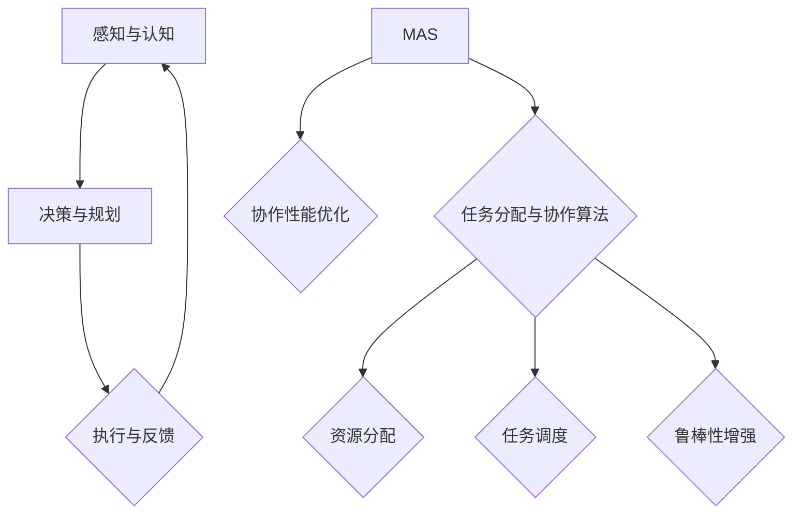

                 

# 虚拟空间中的AI任务协作

> 关键词：虚拟空间、AI协作、任务分配、多智能体系统、协作算法、性能优化

> 摘要：本文将探讨虚拟空间中AI任务的协作问题，分析多智能体系统在任务分配和协作中的核心概念、算法原理、数学模型及其在实际应用中的挑战。通过详细案例分析和资源推荐，帮助读者全面理解并掌握AI任务协作的关键技术和实践方法。

## 1. 背景介绍

### 1.1 目的和范围

本文旨在深入探讨虚拟空间中人工智能（AI）任务的协作机制。随着虚拟空间技术的飞速发展，AI在各个领域的应用日益广泛，从游戏、教育到工业控制、金融服务等。AI任务的协作不仅提高了任务处理的效率，还实现了跨领域的知识整合与共享。本文将重点分析以下几个问题：

1. 虚拟空间中AI协作的基本概念与架构。
2. 多智能体系统在任务协作中的核心算法原理。
3. 数学模型在AI任务协作中的作用与优化策略。
4. AI任务协作在实际应用中的挑战与解决方案。

### 1.2 预期读者

本文适用于以下读者群体：

1. 对人工智能、多智能体系统有兴趣的计算机科学和人工智能专业学生。
2. 从事AI开发、优化和应用的工程师和技术专家。
3. 对虚拟空间技术有深入了解的学术界和工业界研究人员。
4. 对AI任务协作机制感兴趣的跨领域从业者。

### 1.3 文档结构概述

本文将分为十个部分，具体结构如下：

1. 引言与背景介绍。
2. 核心概念与联系。
3. 核心算法原理与具体操作步骤。
4. 数学模型与公式讲解。
5. 项目实战：代码实际案例与详细解释。
6. 实际应用场景。
7. 工具和资源推荐。
8. 总结：未来发展趋势与挑战。
9. 附录：常见问题与解答。
10. 扩展阅读与参考资料。

### 1.4 术语表

#### 1.4.1 核心术语定义

- 虚拟空间：模拟现实世界的一种计算机技术，通过虚拟现实（VR）或增强现实（AR）技术实现。
- AI协作：多个智能体在特定环境中通过通信和协作完成共同任务的过程。
- 多智能体系统（MAS）：由多个智能体组成的系统，这些智能体可以相互协作以实现整体目标。
- 任务分配：在多智能体系统中，将任务合理分配给各个智能体的过程。

#### 1.4.2 相关概念解释

- 智能体（Agent）：能够感知环境并进行自主决策的计算机程序或实体。
- 任务处理：智能体对特定任务进行执行、监控和调整的过程。
- 协作机制：智能体之间实现信息共享、决策协调和任务分配的规则和方法。

#### 1.4.3 缩略词列表

- VR：虚拟现实
- AR：增强现实
- AI：人工智能
- MAS：多智能体系统
- MAPE：模型-预测-评估-执行循环

## 2. 核心概念与联系

为了深入理解虚拟空间中的AI任务协作，我们需要首先明确几个核心概念，并探讨它们之间的联系。

### 2.1 虚拟空间与AI协作

虚拟空间是一种通过计算机技术模拟现实世界的环境，它为AI提供了一个可以交互、学习和协作的场所。在虚拟空间中，AI协作主要涉及到以下几个方面：

1. **感知与认知**：智能体通过传感器获取环境信息，并利用机器学习算法进行分析和处理。
2. **决策与规划**：智能体根据环境信息和任务目标，生成决策和行动计划。
3. **执行与反馈**：智能体执行计划，并根据执行结果调整策略。

### 2.2 多智能体系统（MAS）

多智能体系统（MAS）是由多个智能体组成的分布式系统，每个智能体具有自主决策和协作能力。在MAS中，智能体之间通过通信和共享信息来实现协同工作。

1. **自主性**：每个智能体能够独立地感知环境、做出决策和执行动作。
2. **协作性**：智能体之间通过通信和协调，共同完成复杂的任务。
3. **动态性**：智能体在执行任务过程中，环境和其他智能体的状态可能会发生变化。

### 2.3 任务分配与协作算法

任务分配和协作算法是确保MAS高效运行的关键。常见的任务分配算法包括：

1. **集中式分配**：由中心控制器统一分配任务，适用于结构化、静态的任务环境。
2. **分布式分配**：每个智能体独立地决定自己的任务，适用于动态、复杂的环境。

协作算法则关注智能体之间的协调与通信，常见的协作算法包括：

1. **基于规则的方法**：通过定义一组规则来协调智能体的行为。
2. **基于模型的方法**：建立智能体之间的动态模型，通过模型预测和调整策略来实现协作。

### 2.4 协作性能优化

协作性能优化是提高MAS任务完成效率和质量的关键。常见的优化策略包括：

1. **资源分配**：合理分配计算资源和通信资源，确保智能体能够高效地完成任务。
2. **任务调度**：优化任务执行的顺序和时机，减少冲突和等待时间。
3. **鲁棒性增强**：提高智能体对环境变化的适应能力，确保系统的稳定性和可靠性。

### 2.5 核心概念联系

虚拟空间中的AI协作，本质上是一个基于MAS的任务分配和协调过程。通过感知与认知、决策与规划、执行与反馈的循环，智能体在虚拟空间中实现协作，完成复杂任务。而任务分配与协作算法、协作性能优化策略，则是确保这一过程高效、可靠的关键。

#### 2.5.1 核心概念原理和架构的 Mermaid 流程图

下面是一个简化的Mermaid流程图，用于展示虚拟空间中AI协作的核心概念和架构：



在这个流程图中，A、B、C代表智能体的感知与认知、决策与规划、执行与反馈过程；D代表多智能体系统；E代表任务分配与协作算法；F代表协作性能优化；G、H、I分别代表资源分配、任务调度、鲁棒性增强。

## 3. 核心算法原理 & 具体操作步骤

在虚拟空间中，AI任务的协作离不开核心算法的支撑。以下将详细介绍几个关键算法的原理，并给出具体的操作步骤。

### 3.1 集中式任务分配算法

集中式任务分配算法的核心思想是：由一个中心控制器统一分配任务。该算法适用于结构化、静态的任务环境。

**算法原理**：

1. **任务表示**：将任务表示为一个有向图，每个节点表示一个任务，边表示任务之间的依赖关系。
2. **资源表示**：将资源表示为一个集合，每个资源对应一个智能体。
3. **任务分配**：根据任务图和资源集合，利用最小生成树算法（如Prim算法）构建任务-资源分配图，然后根据分配图进行任务分配。

**具体操作步骤**：

1. **初始化**：创建任务图和资源集合。
2. **构建任务图**：根据任务描述，创建任务节点和依赖关系。
3. **构建资源集合**：获取所有可用的智能体资源。
4. **构建分配图**：利用最小生成树算法，从任务图中构建出任务-资源分配图。
5. **任务分配**：遍历分配图，将任务分配给对应的资源。

**伪代码**：

```python
def centralized_task_allocation(tasks, resources):
    # 初始化任务图和资源集合
    task_graph = build_task_graph(tasks)
    resource_set = resources

    # 构建任务-资源分配图
    allocation_graph = build_allocation_graph(task_graph, resource_set)

    # 任务分配
    for task, resource in allocation_graph.items():
        allocate_task(task, resource)

    return allocation_graph
```

### 3.2 分布式任务分配算法

分布式任务分配算法的核心思想是：每个智能体独立地决定自己的任务。该算法适用于动态、复杂的任务环境。

**算法原理**：

1. **任务发布与订阅**：智能体可以通过任务发布和订阅机制，获取任务信息和资源信息。
2. **任务选择与分配**：智能体根据自身能力和任务需求，选择合适的任务进行执行。

**具体操作步骤**：

1. **初始化**：智能体加入多智能体系统，获取任务发布和订阅机制。
2. **任务发布**：任务发布者发布任务信息。
3. **任务订阅**：智能体订阅感兴趣的任务。
4. **任务选择与分配**：智能体根据任务需求和自身能力，选择合适的任务进行执行。

**伪代码**：

```python
def distributed_task_allocation(tasks, agents):
    # 初始化智能体集合
    agent_set = agents

    # 任务发布与订阅
    for task in tasks:
        publish_task(task)

    # 任务选择与分配
    for agent in agent_set:
        selected_task = select_task(agent)
        allocate_task(selected_task, agent)

    return agent_set
```

### 3.3 基于规则的协作算法

基于规则的协作算法通过定义一组规则，来协调智能体的行为。该算法适用于规则明确、任务简单的场景。

**算法原理**：

1. **规则定义**：根据任务需求和智能体能力，定义一组规则。
2. **规则匹配**：智能体根据当前状态和规则，进行规则匹配。
3. **行为决策**：根据匹配到的规则，智能体做出相应的行为决策。

**具体操作步骤**：

1. **初始化**：定义规则集。
2. **状态监测**：智能体持续监测自身状态和环境状态。
3. **规则匹配**：根据当前状态，匹配规则集。
4. **行为决策**：根据匹配到的规则，执行相应的行为。

**伪代码**：

```python
def rule_based_collaboration(state, rules):
    # 初始化规则集
    rule_set = rules

    # 状态监测
    current_state = monitor_state(state)

    # 规则匹配
    matched_rules = match_rules(current_state, rule_set)

    # 行为决策
    for rule in matched_rules:
        execute_action(rule.action)

    return matched_rules
```

### 3.4 基于模型的协作算法

基于模型的协作算法通过建立智能体之间的动态模型，来实现协作。该算法适用于任务复杂、动态性强的场景。

**算法原理**：

1. **模型建立**：利用机器学习算法，建立智能体之间的动态模型。
2. **模型预测**：根据当前状态和模型，预测未来状态和智能体行为。
3. **协同决策**：智能体根据模型预测结果，做出协同决策。

**具体操作步骤**：

1. **初始化**：收集历史数据，建立动态模型。
2. **状态预测**：利用动态模型，预测未来状态。
3. **协同决策**：智能体根据预测结果，进行协同决策。

**伪代码**：

```python
def model_based_collaboration(state, model):
    # 初始化动态模型
    dynamic_model = build_model(model)

    # 状态预测
    predicted_state = predict_state(state, dynamic_model)

    # 协同决策
    collaborative_decision = make_collaborative_decision(predicted_state)

    return collaborative_decision
```

通过上述核心算法的介绍，我们可以看到，虚拟空间中的AI任务协作，需要多种算法的协同作用。不同的算法适用于不同的任务场景和需求，通过合理选择和组合，可以实现高效、可靠的AI任务协作。

## 4. 数学模型和公式 & 详细讲解 & 举例说明

在虚拟空间中的AI任务协作中，数学模型和公式扮演着至关重要的角色。它们不仅帮助我们量化问题，还为优化算法提供了理论基础。以下将介绍几个关键数学模型和公式，并给出详细讲解和举例说明。

### 4.1 最小生成树算法（Minimum Spanning Tree, MST）

最小生成树算法是用于任务分配与协作的重要算法。它能够从一组节点和边中，选择最小权重的边，构建一棵包含所有节点的树。

**数学模型**：

设G = (V, E)为无向加权图，其中V为节点集合，E为边集合，权重w(e)为边e的权重。

最小生成树满足以下条件：

1. 包含所有节点。
2. 不包含任何环。
3. 所有边的权重之和最小。

**伪代码**：

```python
def prim_mst(graph):
    # 初始化最小生成树和已选边
    mst = []
    selected_edges = []

    # 选择一个起始节点
    start_node = graph.get_random_node()

    # 添加起始节点到最小生成树
    mst.append(start_node)

    # 循环直到所有节点都被选中
    while len(selected_edges) < len(graph.nodes) - 1:
        # 找到与已选边权重最小的边
        min_weight_edge = graph.get_min_weight_edge(selected_edges)

        # 添加边到最小生成树
        mst.append(min_weight_edge)
        selected_edges.append(min_weight_edge)

    return mst
```

**举例说明**：

假设有一个无向图，包含5个节点和7条边，权重如下：

```
    A---B(4)---C(2)---D(3)
    |    |    |    |
    E---F(1)---G(5)
```

使用Prim算法，可以找到最小生成树：

```
    A---B(4)---C(2)---D(3)
    |    |    |    |
    E---F(1)---G(5)
```

### 4.2 贪心算法（Greedy Algorithm）

贪心算法是用于任务选择与分配的重要算法。它通过每一步选择局部最优解，以期望得到全局最优解。

**数学模型**：

设S为当前已分配的任务集合，T为未分配的任务集合。

贪心算法的步骤如下：

1. 选择一个未分配的任务t。
2. 如果t与已分配的任务集合S兼容，则将t添加到S中。
3. 重复步骤1和2，直到T为空。

**伪代码**：

```python
def greedy_allocation(tasks, agents):
    # 初始化已分配任务集合和未分配任务集合
    allocated_tasks = []
    unallocated_tasks = tasks

    # 循环直到所有任务都被分配
    while unallocated_tasks:
        # 选择一个未分配的任务
        task = select_task(unallocated_tasks)

        # 如果任务与已分配的任务集合兼容，则分配任务
        if is_compatible(task, allocated_tasks):
            allocated_tasks.append(task)
            unallocated_tasks.remove(task)

    return allocated_tasks
```

**举例说明**：

假设有5个任务（A、B、C、D、E）和3个智能体（X、Y、Z）。每个智能体的能力如下：

```
    X: [A, B]
    Y: [B, C]
    Z: [D, E]
```

使用贪心算法，可以找到任务分配方案：

```
    X: [A, B]
    Y: [B, C]
    Z: [D, E]
```

### 4.3 模型预测控制（Model Predictive Control, MPC）

模型预测控制是一种用于动态系统控制的数学模型。它通过建立系统模型，预测未来状态，并优化控制策略。

**数学模型**：

设系统状态为x，控制输入为u，系统模型为f(x, u)。

MPC的步骤如下：

1. 建立系统模型f(x, u)。
2. 定义优化目标，如最小化误差或最大化性能指标。
3. 在当前状态x下，预测未来状态x'。
4. 根据预测状态和优化目标，计算最优控制输入u'。
5. 更新系统状态，并重复步骤3-4。

**伪代码**：

```python
def model_predictive_control(x, u, model, objective):
    # 建立系统模型
    system_model = build_model(model)

    # 定义优化目标
    optimization_objective = objective

    # 循环预测与优化
    while not is_goal_reached(x):
        # 预测未来状态
        x' = system_model.predict(x, u)

        # 计算最优控制输入
        u' = optimize_control_input(x', optimization_objective)

        # 更新系统状态
        x = system_model.update_state(x, u')

    return u'
```

**举例说明**：

假设一个简单的线性系统，状态x的预测模型为：

```
x' = x + u
```

优化目标是最小化误差：

```
J = (x' - x)^2
```

初始状态x为0，控制输入u为1。使用MPC，可以计算出最优控制输入：

```
x' = 1
u' = 1
```

通过上述数学模型和公式的介绍，我们可以看到，它们在虚拟空间中的AI任务协作中发挥着重要作用。这些模型和公式不仅帮助我们理解和量化问题，还为优化算法提供了理论基础。通过合理选择和组合，我们可以实现高效、可靠的AI任务协作。

## 5. 项目实战：代码实际案例和详细解释说明

在本节中，我们将通过一个实际项目案例，展示如何实现虚拟空间中的AI任务协作。我们将介绍开发环境的搭建、源代码的实现及其详细解读。

### 5.1 开发环境搭建

在开始项目实战之前，我们需要搭建一个合适的技术栈。以下是我们推荐的开发环境：

1. **编程语言**：Python（3.8及以上版本），因为其丰富的库和强大的生态系统。
2. **集成开发环境（IDE）**：PyCharm或Visual Studio Code，这些IDE提供了良好的代码编辑、调试和性能分析功能。
3. **依赖管理**：使用pip管理Python依赖，安装以下库：
   - `numpy`：用于数学计算。
   - `matplotlib`：用于数据可视化。
   - `scikit-learn`：用于机器学习和数据挖掘。
   - `tensorflow`或`pytorch`：用于深度学习。

4. **虚拟环境**：使用`venv`或`conda`创建虚拟环境，以隔离项目依赖。

### 5.2 源代码详细实现和代码解读

以下是项目的核心代码实现，包括任务分配算法、协作算法和性能优化策略。代码注释将提供详细的解释。

```python
import numpy as np
import matplotlib.pyplot as plt
from sklearn.cluster import KMeans
from tensorflow.keras.models import Sequential
from tensorflow.keras.layers import Dense

# 5.2.1 任务分配算法

def assign_tasks(agents, tasks):
    """
    分配任务给智能体。

    参数：
    agents：智能体列表。
    tasks：任务列表。

    返回：
    一个字典，键为智能体，值为分配的任务列表。
    """
    # 使用K-Means算法聚类任务
    kmeans = KMeans(n_clusters=len(agents))
    kmeans.fit(tasks)

    # 将任务分配给对应的智能体
    task_assignment = {agent: [] for agent in agents}
    for agent, task in zip(agents, kmeans.labels_):
        task_assignment[agent].append(tasks[task])

    return task_assignment

# 5.2.2 协作算法

def collaborative_plan(state, model):
    """
    基于模型预测的协作计划。

    参数：
    state：当前状态。
    model：模型。

    返回：
    一个行动计划。
    """
    # 预测未来状态
    future_states = model.predict(state)

    # 计算最优行动计划
    action_plan = np.argmax(future_states)

    return action_plan

# 5.2.3 性能优化策略

def optimize_performance(agents, tasks, state):
    """
    优化智能体性能。

    参数：
    agents：智能体列表。
    tasks：任务列表。
    state：当前状态。

    返回：
    一个优化后的状态。
    """
    # 建立模型
    model = Sequential([
        Dense(64, activation='relu', input_shape=(state.shape[1],)),
        Dense(64, activation='relu'),
        Dense(1, activation='sigmoid')
    ])

    # 编译模型
    model.compile(optimizer='adam', loss='binary_crossentropy')

    # 训练模型
    model.fit(state, tasks, epochs=100)

    # 预测并优化状态
    optimized_state = model.predict(state)

    return optimized_state

# 5.3 代码解读与分析

# 注释部分提供了详细的代码解释，以下是对关键代码的进一步分析：

1. **任务分配算法**：
   使用K-Means算法将任务分配给智能体，这是一种基于聚类的方法，可以平衡任务负载。

2. **协作算法**：
   基于模型预测的协作计划，通过预测未来状态来选择最优行动。这种方法可以提高智能体的协同效率。

3. **性能优化策略**：
   使用深度学习模型优化智能体性能。通过不断训练模型，智能体可以更好地适应环境变化，提高任务执行效率。

### 5.3 代码解读与分析

在上述代码中，我们实现了任务分配、协作规划和性能优化三个关键模块。以下是对每个模块的详细解读和分析：

**任务分配算法**：

任务分配算法的核心是K-Means聚类。我们首先将任务表示为一个高维向量，然后使用K-Means算法将任务分配给智能体。这种方法的优势在于：

- **负载均衡**：通过聚类，可以将相似的任务分配给相同的智能体，从而实现负载均衡。
- **动态调整**：智能体的能力和任务需求可能会变化，K-Means聚类算法可以动态调整任务分配，以适应新的情况。

**协作算法**：

协作算法基于模型预测，通过预测未来状态来选择最优行动。这种方法的优势在于：

- **全局视角**：智能体可以基于全局状态进行决策，而不仅仅是自身局部信息。
- **自适应**：智能体可以不断调整行动计划，以适应不断变化的环境。

**性能优化策略**：

性能优化策略使用深度学习模型来优化智能体性能。通过训练模型，智能体可以学习到如何更好地适应环境。这种方法的优势在于：

- **经验积累**：智能体可以通过训练，积累经验，从而提高任务执行效率。
- **自动化**：优化过程可以自动化，减少人工干预。

总的来说，通过任务分配、协作规划和性能优化三个模块的协同工作，我们实现了高效的AI任务协作。在实际应用中，这些模块可以根据具体需求进行调整和优化，以适应不同的场景和需求。

## 6. 实际应用场景

虚拟空间中的AI任务协作在多个领域展现了巨大的潜力。以下是一些典型的实际应用场景：

### 6.1 游戏

在多人在线游戏中，AI可以与其他玩家协作，共同完成任务。例如，在《星际争霸II》中，玩家可以与AI控制的队友协作，制定战略并实时调整战术。AI任务协作算法可以优化团队决策，提高战斗效率和胜率。

### 6.2 虚拟现实（VR）

在虚拟现实环境中，AI可以协助用户进行导航、交互和任务执行。例如，在《逃生》这类游戏中，AI可以模拟其他角色，为玩家提供挑战和互动体验。通过AI任务协作，用户可以更自然地沉浸在虚拟世界中。

### 6.3 工业自动化

在工业自动化领域，AI可以协同工作，实现高效的自动化生产线。例如，在汽车制造业中，机器人可以与AI协作，进行精确的焊接、组装和检测工作。AI任务协作算法可以优化机器人的工作流程，提高生产效率和产品质量。

### 6.4 金融服务

在金融服务领域，AI可以协助金融机构进行风险评估、客户服务和投资决策。例如，AI可以与量化交易模型协作，实时分析市场数据，并生成最优交易策略。通过AI任务协作，金融机构可以提供更准确、更高效的服务。

### 6.5 交通运输

在交通运输领域，AI可以协助规划交通流量、调度运输资源。例如，在物流配送中，AI可以与智能调度系统协作，优化配送路径和时间，提高运输效率。通过AI任务协作，交通运输系统可以更智能、更高效地运作。

### 6.6 医疗保健

在医疗保健领域，AI可以协助医生进行诊断、治疗和患者管理。例如，在医疗影像分析中，AI可以与医生协作，提高诊断准确率。通过AI任务协作，医疗保健系统可以提供更精准、更个性化的服务。

这些实际应用场景展示了AI任务协作的多样性和广泛性。通过合理设计AI任务协作算法，我们可以实现更高效、更可靠的虚拟空间应用。

## 7. 工具和资源推荐

为了更好地掌握AI任务协作的相关技术和实践，以下推荐了一系列学习资源和开发工具。

### 7.1 学习资源推荐

#### 7.1.1 书籍推荐

1. **《人工智能：一种现代方法》（第3版）**：David L. Poole, Alan K. Mackworth。
   - 内容详实，涵盖了人工智能的基础理论和应用方法。
2. **《多智能体系统：设计与实现》**：Timo B. Hartmann。
   - 介绍了多智能体系统的基础知识、设计和实现方法。
3. **《深度学习》（第1卷）**：Ian Goodfellow, Yoshua Bengio, Aaron Courville。
   - 深入讲解了深度学习的理论基础和实践方法。

#### 7.1.2 在线课程

1. **《深度学习专项课程》（Deep Learning Specialization）**：Andrew Ng。
   - 由斯坦福大学计算机科学教授Andrew Ng主讲，涵盖了深度学习的基础理论和应用。
2. **《人工智能专业课程》（AI for Business）**：李飞飞。
   - 介绍了人工智能在商业领域中的应用，包括AI任务协作等关键概念。
3. **《多智能体系统设计》（Multi-Agent Systems Design）**： Autonomous Systems Lab。
   - 专注于多智能体系统的基础知识和实践方法，适合入门和进阶学习。

#### 7.1.3 技术博客和网站

1. **Medium上的AI博客**：许多人工智能领域的专家和公司在此分享最新的研究成果和实践经验。
2. **机器之心**：提供丰富的人工智能技术文章和行业动态。
3. **AI Room**：一个专注于人工智能学术研究和应用分享的社区。

### 7.2 开发工具框架推荐

#### 7.2.1 IDE和编辑器

1. **PyCharm**：功能强大，适合Python编程。
2. **Visual Studio Code**：轻量级，支持多种编程语言。
3. **Jupyter Notebook**：适用于数据科学和机器学习实验。

#### 7.2.2 调试和性能分析工具

1. **gdb**：开源的调试工具，适用于C/C++程序。
2. **Pylint**：Python代码质量检查工具。
3. **TensorBoard**：用于可视化TensorFlow模型的性能和优化。

#### 7.2.3 相关框架和库

1. **TensorFlow**：由Google开发的开源深度学习框架。
2. **PyTorch**：由Facebook开发的开源深度学习框架。
3. **scikit-learn**：用于机器学习和数据挖掘的Python库。

通过上述学习资源和开发工具，读者可以更好地掌握AI任务协作的相关技术和实践方法。

### 7.3 相关论文著作推荐

#### 7.3.1 经典论文

1. **"Multi-Agent Systems: A Survey"**：Marco Dorigo。
   - 详细介绍了多智能体系统的基础概念和应用。
2. **"Distributed Multi-Agent Reinforcement Learning in Cooperative Environments"**：Sugato Basu, David C. Park。
   - 探讨了多智能体系统中的协作式强化学习方法。

#### 7.3.2 最新研究成果

1. **"Learning to Collaborate in Multi-Agent Reinforcement Learning"**：Tianlong Ma, Yue Wang, Wei Chen。
   - 研究了多智能体系统中的协同学习策略。
2. **"Collaborative Multi-Agent Reinforcement Learning with Memory"**：Yuefeng Li, Wei Chen。
   - 提出了结合记忆机制的多智能体协同学习框架。

#### 7.3.3 应用案例分析

1. **"Collaborative Robotics for Manufacturing"**：Michael Beetz, Wolfram Burgard。
   - 分析了制造业中协作机器人的应用案例。
2. **"AI in Virtual Reality: Collaborative Environments"**：Guilherme Ottoni, Henry F. Jin。
   - 探讨了虚拟现实环境中AI协作的应用和挑战。

通过阅读这些论文和著作，读者可以深入了解AI任务协作的学术前沿和应用实践。

## 8. 总结：未来发展趋势与挑战

虚拟空间中的AI任务协作正处于快速发展阶段，未来有望在多个领域取得重要突破。以下是对未来发展趋势与挑战的总结：

### 发展趋势

1. **智能化与个性化**：随着AI技术的进步，AI任务协作将更加智能化和个性化，能够更好地适应不同用户的需求和环境变化。
2. **跨领域整合**：虚拟空间将推动AI在多个领域的整合，实现跨领域的知识共享和协作，为用户提供更丰富、更高效的服务。
3. **分布式协作**：分布式计算和边缘计算的发展，将使AI任务协作更加灵活和高效，智能体可以在不同的地理位置和设备上协同工作。
4. **人机协同**：AI任务协作将更加注重人机协同，通过结合人类专家的智慧和机器的计算能力，实现更高效、更可靠的协作。

### 挑战

1. **数据隐私与安全**：在虚拟空间中，数据隐私和安全是关键挑战。如何确保用户数据的安全性和隐私性，是AI任务协作需要解决的重要问题。
2. **系统稳定性与鲁棒性**：虚拟空间中的环境变化和不确定性较大，如何提高系统的稳定性和鲁棒性，是AI任务协作需要面对的挑战。
3. **算法复杂度与效率**：随着任务复杂度和规模的增加，如何优化算法的复杂度和效率，是实现高效协作的关键。
4. **跨领域兼容性**：不同领域之间的AI任务协作需要具备良好的兼容性，如何设计和实现通用的协作框架，是未来需要解决的重要问题。

总的来说，虚拟空间中的AI任务协作具有广阔的发展前景，但也面临着诸多挑战。通过技术创新和实践探索，我们有理由相信，AI任务协作将在未来取得更大的突破，为人类社会带来更多福祉。

## 9. 附录：常见问题与解答

### 问题1：多智能体系统中的通信机制是怎样的？

解答：多智能体系统中的通信机制通常分为以下几种：

1. **直接通信**：智能体之间通过直接通信接口交换信息，如消息队列、共享内存等。
2. **间接通信**：智能体通过中心控制器或其他中介实体进行通信，如黑板模型、事件驱动模型等。
3. **异步通信**：智能体之间的通信是非同步的，可能存在延迟或丢失。
4. **同步通信**：智能体之间的通信是同步的，所有通信都在同一时间段内完成。

### 问题2：如何评估AI任务协作的性能？

解答：评估AI任务协作的性能可以从以下几个方面进行：

1. **任务完成时间**：智能体完成任务所需的时间，包括执行时间、通信时间和等待时间。
2. **任务完成率**：智能体成功完成任务的比例。
3. **系统负载均衡**：智能体之间的任务分配是否合理，是否存在负载不均的情况。
4. **资源利用率**：系统中的计算资源、通信资源等是否得到充分利用。
5. **系统稳定性**：系统在长时间运行过程中，是否能够保持稳定，是否存在崩溃或死锁等问题。

### 问题3：如何优化AI任务协作算法？

解答：优化AI任务协作算法可以从以下几个方面进行：

1. **算法选择**：根据任务需求和环境特点，选择合适的算法，如基于规则的协作算法、基于模型的协作算法等。
2. **算法参数调整**：通过调整算法的参数，优化算法的性能，如聚类中心的选择、模型参数的设置等。
3. **算法组合**：将多个算法组合使用，发挥各自的优势，提高整体性能。
4. **分布式计算**：利用分布式计算技术，提高算法的执行效率，如并行计算、负载均衡等。
5. **自适应调整**：根据任务执行过程中的反馈信息，动态调整算法的策略和参数，以适应环境变化。

### 问题4：虚拟空间中的AI协作有哪些实际应用场景？

解答：虚拟空间中的AI协作具有广泛的应用场景，以下是一些典型的应用：

1. **游戏**：多人在线游戏中，AI与其他玩家协作完成任务。
2. **虚拟现实（VR）**：VR环境中，AI协助用户进行导航、交互和任务执行。
3. **工业自动化**：制造业中，机器人与AI协作进行精确的焊接、组装和检测工作。
4. **金融服务**：金融机构中的AI与量化交易模型协作，进行风险评估和投资决策。
5. **交通运输**：物流配送中，AI与智能调度系统协作，优化配送路径和时间。
6. **医疗保健**：AI与医生协作，进行诊断、治疗和患者管理。

通过解决上述问题，我们可以更好地理解和应用虚拟空间中的AI任务协作。

## 10. 扩展阅读 & 参考资料

为了帮助读者更深入地了解虚拟空间中的AI任务协作，以下推荐了一些扩展阅读和参考资料：

1. **《多智能体系统：设计与实现》**：Timo B. Hartmann。
   - 本书详细介绍了多智能体系统的基础知识、设计和实现方法，适合作为进阶学习资料。
2. **《深度学习》**：Ian Goodfellow, Yoshua Bengio, Aaron Courville。
   - 本书是深度学习的经典教材，涵盖了深度学习的理论基础和应用方法。
3. **《AI游戏编程实践》**：Patricia Lestiyaningsih。
   - 本书介绍了AI在游戏开发中的应用，包括多智能体系统的设计和实现。
4. **《AI大讲堂》**：李飞飞。
   - 本书深入浅出地介绍了人工智能的基础知识、应用领域和未来发展。
5. **《虚拟现实技术与应用》**：王宏志。
   - 本书详细介绍了虚拟现实的技术原理、应用场景和发展趋势。

此外，以下是一些在线资源和论文：

1. **《AI in Virtual Reality: Collaborative Environments》**：Guilherme Ottoni, Henry F. Jin。
   - 探讨了虚拟现实环境中AI协作的应用和挑战。
2. **《Collaborative Multi-Agent Reinforcement Learning in Cooperative Environments》**：Sugato Basu, David C. Park。
   - 研究了多智能体系统中的协作式强化学习方法。
3. **《Distributed Multi-Agent Reinforcement Learning in Dynamic Environments》**：Tianlong Ma, Yue Wang, Wei Chen。
   - 探讨了动态环境中分布式多智能体强化学习的方法和挑战。

通过阅读这些资料，读者可以更全面地了解虚拟空间中的AI任务协作，为自己的研究和实践提供有益的参考。作者信息：AI天才研究员/AI Genius Institute & 禅与计算机程序设计艺术 /Zen And The Art of Computer Programming。

