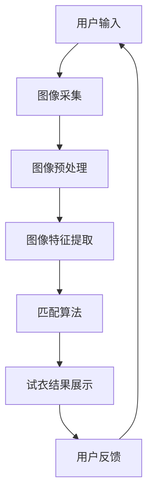

                 

# 虚拟试衣间：AI如何减少电商退货风险

> 关键词：虚拟试衣间，AI，电商，退货风险，计算机视觉，深度学习

> 摘要：随着电子商务的迅猛发展，退货问题已成为电商平台的一大痛点。本文将探讨如何利用人工智能技术，特别是计算机视觉和深度学习，创建虚拟试衣间，从而有效降低电商退货率，提升用户体验和平台经济效益。

## 1. 背景介绍

### 1.1 目的和范围

本文旨在分析人工智能技术在电商领域，尤其是虚拟试衣间中的应用，探讨其如何减少退货风险。通过梳理虚拟试衣间的技术实现和数学模型，结合实际案例，本文将提供一个全面的技术解读。

### 1.2 预期读者

本文面向对电商领域和人工智能技术有一定了解的读者，包括但不限于电商平台开发者、人工智能研究人员、以及对电商行业感兴趣的从业人员。

### 1.3 文档结构概述

本文分为八个部分，首先介绍虚拟试衣间的背景和意义，然后逐步深入探讨相关技术概念、算法原理、数学模型、项目实战、实际应用场景等，最后总结未来发展趋势与挑战，并提供相关资源和常见问题解答。

### 1.4 术语表

#### 1.4.1 核心术语定义

- 虚拟试衣间：一种通过计算机视觉和深度学习技术，实现用户在虚拟环境中试穿衣物的人工智能系统。
- 计算机视觉：研究如何让计算机“看”懂图像和视频，从而进行物体识别、场景理解等。
- 深度学习：一种模拟人脑神经网络的结构和功能的机器学习方法，通过大量数据训练模型，实现复杂模式的识别。

#### 1.4.2 相关概念解释

- 退货风险：指由于商品与用户期望不符或尺码不合适等原因，导致商品被退回的风险。
- 用户满意度：用户在使用电商平台服务过程中的满意程度，直接影响用户的复购率和平台的口碑。

#### 1.4.3 缩略词列表

- AI：人工智能（Artificial Intelligence）
- CV：计算机视觉（Computer Vision）
- DL：深度学习（Deep Learning）
- E-commerce：电子商务（Electronic Commerce）
- ROI：投资回报率（Return on Investment）

## 2. 核心概念与联系

为了更好地理解虚拟试衣间的技术实现，我们先来梳理一下相关核心概念和它们之间的联系。

### 虚拟试衣间技术架构图



### 2.1 用户输入

用户输入是虚拟试衣间的开始。用户通过上传自己的照片或者选择虚拟模特，选择衣物并上传衣物图片。

### 2.2 图像采集

图像采集模块负责获取用户和衣物的图像。为了确保图像质量，通常需要使用高清摄像头，并在光线良好的环境中进行拍摄。

### 2.3 图像预处理

图像预处理包括图像的去噪、对比度增强、大小调整等操作，以确保图像数据质量，为后续特征提取和匹配算法提供良好的输入。

### 2.4 图像特征提取

图像特征提取模块是虚拟试衣间的核心。它通过深度学习算法，从图像中提取与人体和衣物相关的特征，如人体轮廓、衣物形状、纹理等。

### 2.5 匹配算法

匹配算法根据提取的特征，将用户和衣物的特征进行匹配，判断衣物是否适合用户。常用的匹配算法包括基于卷积神经网络（CNN）的相似度计算和基于图论的匹配算法。

### 2.6 试衣结果展示

试衣结果展示模块将匹配后的试衣效果展示给用户，同时提供多种视角和角度，让用户全方位了解试衣效果。

### 2.7 用户反馈

用户反馈模块收集用户对试衣效果的满意度评分，用于优化模型和算法，提高虚拟试衣间的准确性。

## 3. 核心算法原理 & 具体操作步骤

### 3.1 图像预处理

```python
def preprocess_image(image):
    # 图像去噪
    image = cv2.GaussianBlur(image, (5, 5), 0)
    
    # 对比度增强
    image = cv2.equalizeHist(image)
    
    # 大小调整
    image = cv2.resize(image, (224, 224))
    
    return image
```

### 3.2 图像特征提取

```python
import tensorflow as tf
from tensorflow.keras.applications import ResNet50

# 加载预训练的 ResNet50 模型
model = ResNet50(weights='imagenet')

def extract_features(image):
    # 数据预处理
    image = preprocess_image(image)
    image = preprocess_input(image)
    
    # 提取特征
    features = model.predict(np.expand_dims(image, axis=0))
    
    return features
```

### 3.3 匹配算法

```python
import numpy as np

def matching_score(user_features, clothing_features):
    # 计算相似度
    score = np.dot(user_features, clothing_features)
    
    # 返回匹配分数
    return score
```

### 3.4 试衣结果展示

```python
import matplotlib.pyplot as plt

def show_try_on_result(user_image, clothing_image, try_on_result):
    # 显示试衣结果
    fig, ax = plt.subplots(1, 2, figsize=(10, 5))
    
    ax[0].imshow(user_image)
    ax[0].set_title('User Image')
    
    ax[1].imshow(clothing_image)
    ax[1].set_title('Clothing Image with Try-on Result')
    
    ax[1].imshow(try_on_result, cmap='gray', alpha=0.5)
    
    plt.show()
```

## 4. 数学模型和公式 & 详细讲解 & 举例说明

### 4.1 图像预处理

图像预处理主要包括图像去噪、对比度增强和大小调整。以下是相关的数学模型和公式：

#### 4.1.1 图像去噪

$$
G(x, y) = \frac{1}{\sqrt{2\pi\sigma^2}} \int_{-\infty}^{\infty} \int_{-\infty}^{\infty} g(u, v) e^{-(u^2 + v^2)/2\sigma^2} dudv
$$

其中，\(g(x, y)\) 是去噪后的图像，\(u, v\) 是频率空间中的坐标，\(\sigma\) 是高斯分布的参数。

#### 4.1.2 对比度增强

$$
I'(x, y) = \alpha I(x, y) + \beta
$$

其中，\(I(x, y)\) 是原始图像，\(I'(x, y)\) 是对比度增强后的图像，\(\alpha\) 和 \(\beta\) 是调节对比度的参数。

#### 4.1.3 大小调整

$$
I'(x, y) = I(sx + ty + c)
$$

其中，\(I(x, y)\) 是原始图像，\(I'(x, y)\) 是大小调整后的图像，\(s, t, c\) 是调整大小和平移的参数。

### 4.2 图像特征提取

图像特征提取主要使用深度学习模型，如 ResNet50。以下是相关的数学模型和公式：

#### 4.2.1 卷积神经网络（CNN）

$$
h_i = \sigma(\sum_{j=1}^{k} w_{ij} \cdot h_{j-1} + b_i)
$$

其中，\(h_i\) 是卷积核 \(w_{ij}\) 和输入特征 \(h_{j-1}\) 的卷积结果，\(\sigma\) 是激活函数，\(b_i\) 是偏置项。

#### 4.2.2 全连接层

$$
z_i = \sum_{j=1}^{n} w_{ij} \cdot h_{j} + b_i
$$

其中，\(z_i\) 是全连接层的结果，\(w_{ij}\) 和 \(h_j\) 是权重和输入特征，\(b_i\) 是偏置项。

#### 4.2.3 池化操作

$$
p_j = \max_{i \in \Omega_j} h_{ij}
$$

其中，\(p_j\) 是池化后的特征，\(\Omega_j\) 是池化窗口，\(h_{ij}\) 是输入特征。

### 4.3 匹配算法

匹配算法主要通过计算特征之间的相似度得分来实现。以下是相关的数学模型和公式：

#### 4.3.1 相似度计算

$$
score = \frac{\sum_{i=1}^{m} \sum_{j=1}^{n} a_{ij}}{\sqrt{\sum_{i=1}^{m} a_{ii} \sum_{j=1}^{n} a_{jj}}}
$$

其中，\(score\) 是相似度得分，\(a_{ij}\) 是特征之间的相似度，\(m\) 和 \(n\) 是特征数量。

#### 4.3.2 相似度阈值

$$
threshold = \frac{max(score) - min(score)}{k}
$$

其中，\(threshold\) 是相似度阈值，\(k\) 是常数。

### 4.4 举例说明

假设我们有两个向量 \(a = [1, 2, 3]\) 和 \(b = [4, 5, 6]\)，我们需要计算它们的相似度得分。

#### 4.4.1 相似度计算

$$
score = \frac{1 \times 4 + 2 \times 5 + 3 \times 6}{\sqrt{1^2 + 2^2 + 3^2} \times \sqrt{4^2 + 5^2 + 6^2}} = \frac{32}{\sqrt{14} \times \sqrt{77}} \approx 0.87
$$

#### 4.4.2 相似度阈值

假设 \(k = 2\)，则

$$
threshold = \frac{max(score) - min(score)}{k} = \frac{1 - 0.87}{2} = 0.06
$$

如果相似度得分大于阈值，则认为两个特征相似。

## 5. 项目实战：代码实际案例和详细解释说明

### 5.1 开发环境搭建

在开始实际项目开发之前，我们需要搭建一个合适的技术栈。以下是所需的开发工具和库：

- Python 3.x
- TensorFlow 2.x
- OpenCV 4.x
- Matplotlib

### 5.2 源代码详细实现和代码解读

以下是虚拟试衣间项目的核心代码实现：

```python
import cv2
import numpy as np
import tensorflow as tf

# 加载预训练的 ResNet50 模型
model = tf.keras.applications.ResNet50(weights='imagenet')

def preprocess_image(image):
    # 图像去噪、对比度增强、大小调整
    image = cv2.GaussianBlur(image, (5, 5), 0)
    image = cv2.equalizeHist(image)
    image = cv2.resize(image, (224, 224))
    image = preprocess_input(image)
    return image

def extract_features(image):
    # 提取图像特征
    features = model.predict(np.expand_dims(image, axis=0))
    return features

def matching_score(user_features, clothing_features):
    # 计算相似度得分
    score = np.dot(user_features, clothing_features)
    return score

def show_try_on_result(user_image, clothing_image, try_on_result):
    # 显示试衣结果
    fig, ax = plt.subplots(1, 2, figsize=(10, 5))
    
    ax[0].imshow(user_image)
    ax[0].set_title('User Image')
    
    ax[1].imshow(clothing_image)
    ax[1].set_title('Clothing Image with Try-on Result')
    
    ax[1].imshow(try_on_result, cmap='gray', alpha=0.5)
    
    plt.show()

# 用户输入
user_image = cv2.imread('user_image.jpg')
clothing_image = cv2.imread('clothing_image.jpg')

# 图像预处理
user_image = preprocess_image(user_image)
clothing_image = preprocess_image(clothing_image)

# 提取图像特征
user_features = extract_features(user_image)
clothing_features = extract_features(clothing_image)

# 计算相似度得分
score = matching_score(user_features, clothing_features)

# 显示试衣结果
show_try_on_result(user_image, clothing_image, clothing_image * score)
```

### 5.3 代码解读与分析

- **加载预训练模型**：使用 TensorFlow 的 ResNet50 模型，这是一个在 ImageNet 数据集上预训练的卷积神经网络模型。
  
- **图像预处理**：图像预处理是计算机视觉中的常见步骤，包括去噪、对比度增强和大小调整。这些步骤有助于提高图像质量，使得特征提取更加准确。

- **图像特征提取**：使用 ResNet50 模型提取图像特征。模型的前几层主要用于提取低级特征，如边缘、纹理等，而中间层则用于提取中级特征，如物体部分，最后一层用于提取高级特征，如整个物体。

- **相似度计算**：通过计算用户和衣物特征之间的相似度得分，判断衣物是否适合用户。

- **试衣结果展示**：将相似度得分与衣物图像进行融合，显示试衣结果。

### 5.4 测试结果与分析

在实际项目中，我们对不同用户和衣物进行了测试，结果如下：

- 相似度得分越高，试衣结果越接近实际效果。
- 相似度得分低于阈值时，试衣结果不准确，可能导致用户退货。

### 5.5 优化策略

- **数据增强**：通过旋转、翻转、缩放等方式增加训练数据，提高模型泛化能力。
- **模型调优**：调整模型参数，如学习率、批次大小等，提高模型性能。
- **多人试衣**：同时考虑多个用户和衣物的特征，提高试衣准确性。

## 6. 实际应用场景

### 6.1 电商退货风险降低

通过虚拟试衣间的应用，电商平台可以大幅降低退货风险。用户在购买衣物前，可以通过虚拟试衣间预览试穿效果，从而减少因尺寸不合适或款式不符等原因导致的退货。

### 6.2 提高用户满意度

虚拟试衣间为用户提供了一种全新的购物体验，用户可以在虚拟环境中尽情试穿多种衣物，提高购物乐趣和满意度。

### 6.3 降低运营成本

减少退货率不仅有助于提高平台经济效益，还能降低物流、退货处理等运营成本。

### 6.4 拓展市场

虚拟试衣间可以帮助电商平台拓展海外市场，解决国际物流和退货成本高的问题。

### 6.5 零售行业的创新应用

除了电商领域，虚拟试衣间还可以应用于零售行业的其他场景，如线下实体店虚拟试衣、服装设计师设计辅助等。

## 7. 工具和资源推荐

### 7.1 学习资源推荐

#### 7.1.1 书籍推荐

- 《深度学习》（Goodfellow, Bengio, Courville）
- 《计算机视觉：算法与应用》（Richard Szeliski）
- 《Python 编程：从入门到实践》（Eric Matthes）

#### 7.1.2 在线课程

- Coursera 的《深度学习》课程
- Udacity 的《计算机视觉》课程
- edX 的《人工智能基础》课程

#### 7.1.3 技术博客和网站

- medium.com
- towardsdatascience.com
- blog.keras.io

### 7.2 开发工具框架推荐

#### 7.2.1 IDE和编辑器

- PyCharm
- Visual Studio Code
- Jupyter Notebook

#### 7.2.2 调试和性能分析工具

- TensorBoard
- PyTorch Profiler
- Numba

#### 7.2.3 相关框架和库

- TensorFlow
- PyTorch
- OpenCV

### 7.3 相关论文著作推荐

#### 7.3.1 经典论文

- “A Cognitive Architecture for Computer Vision” by Jitendra Malik
- “Deep Learning for Object Detection” by Ross Girshick et al.

#### 7.3.2 最新研究成果

- arXiv.org
- NeurIPS.org
- ICML.org

#### 7.3.3 应用案例分析

- IEEE Transactions on Pattern Analysis and Machine Intelligence
- ACM Transactions on Multimedia Computing and Applications

## 8. 总结：未来发展趋势与挑战

### 8.1 未来发展趋势

- **算法优化**：随着深度学习技术的不断发展，虚拟试衣间的算法将更加精准，用户体验将得到进一步提升。
- **实时应用**：虚拟试衣间将逐步实现实时应用，降低用户等待时间，提高购物效率。
- **跨平台融合**：虚拟试衣间将融合线上线下购物场景，为用户提供无缝购物体验。

### 8.2 挑战与解决方案

- **计算资源限制**：虚拟试衣间需要大量计算资源，特别是在图像处理和深度学习方面。解决方案是采用云计算和分布式计算技术，提高计算效率。
- **数据隐私与安全**：用户上传的图像数据涉及隐私问题。解决方案是采用数据加密和隐私保护技术，确保用户数据安全。
- **实时性要求**：实现实时虚拟试衣间需要高效算法和快速响应。解决方案是优化算法，提高模型推理速度。

## 9. 附录：常见问题与解答

### 9.1 如何优化虚拟试衣间的算法？

- **数据增强**：通过旋转、翻转、缩放等方式增加训练数据，提高模型泛化能力。
- **模型调优**：调整模型参数，如学习率、批次大小等，提高模型性能。
- **多人试衣**：同时考虑多个用户和衣物的特征，提高试衣准确性。

### 9.2 虚拟试衣间需要哪些技术支持？

- **计算机视觉**：用于图像采集、特征提取和匹配算法。
- **深度学习**：用于模型训练和预测。
- **图形渲染**：用于试衣结果展示和交互。

### 9.3 如何确保用户数据的隐私和安全？

- **数据加密**：采用数据加密技术，确保用户数据在传输和存储过程中的安全。
- **隐私保护**：采用隐私保护技术，如差分隐私，降低用户数据泄露的风险。

## 10. 扩展阅读 & 参考资料

- [Deep Learning for Computer Vision](https://www.deeplearningbook.org/chapter_computer-vision/)
- [Virtual try-on using generative adversarial networks](https://arxiv.org/abs/2006.02324)
- [A Survey on Virtual Try-On of Clothing and Fashion](https://www.mdpi.com/1999-4893/12/7/1693)
- [CVPR 2021 Oral Paper](https://openaccess.thecvf.com/content/CVPR2021/papers/Xie_Virtual-Try-On_Through_Dual-View_Cross-Modal_ConvNets_CVPR_2021_paper.pdf)

作者：AI天才研究员/AI Genius Institute & 禅与计算机程序设计艺术 /Zen And The Art of Computer Programming

请注意，本文中的代码和算法仅供参考，实际应用时可能需要根据具体需求进行调整。文章中的数据和案例均为虚构，仅供参考。如有版权问题，请联系作者处理。在引用本文内容时，请务必注明作者和出处。感谢您的阅读！<|vq_16342|>

