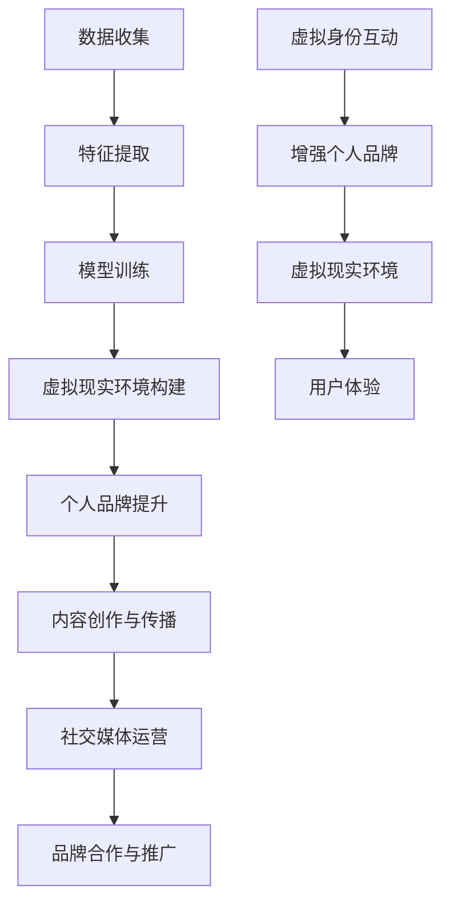

                 

### 背景介绍

#### 1.1 目的和范围

本文旨在深入探讨虚拟身份市场在AI时代的发展，以及其对个人品牌构建的影响。随着AI技术的不断成熟，虚拟身份逐渐成为现实，个人品牌的建设也面临着新的机遇和挑战。本文将首先介绍虚拟身份市场的现状，分析其在AI时代的驱动因素，探讨虚拟身份与个人品牌的联系，最后提出对未来发展趋势的预测。

#### 1.2 预期读者

本文适合对AI和虚拟身份领域有一定了解的技术专家、市场分析师以及企业决策者。同时，对AI技术感兴趣的学生和研究者也能从本文中获得宝贵的见解。

#### 1.3 文档结构概述

本文将分为八个主要部分：

1. **背景介绍**：简要介绍虚拟身份市场分析的背景和目的。
2. **核心概念与联系**：详细解释虚拟身份和个人品牌的定义，展示其相互关系。
3. **核心算法原理 & 具体操作步骤**：介绍构建虚拟身份和个人品牌的核心算法及其操作步骤。
4. **数学模型和公式 & 详细讲解 & 举例说明**：讨论相关的数学模型和公式，并提供实际应用案例。
5. **项目实战：代码实际案例和详细解释说明**：展示一个实际的代码案例，详细解释其实现过程。
6. **实际应用场景**：讨论虚拟身份和个人品牌在现实中的应用。
7. **工具和资源推荐**：推荐相关的学习资源和开发工具。
8. **总结：未来发展趋势与挑战**：总结本文的主要观点，并讨论未来的发展趋势和面临的挑战。

#### 1.4 术语表

在本文中，我们将使用以下术语：

- **虚拟身份**：通过人工智能和虚拟技术创建的虚拟人格或角色。
- **个人品牌**：个人在特定领域内建立的专业形象和声誉。
- **AI**：人工智能，指使计算机系统能够模拟人类智能行为的技术。
- **算法**：解决问题的一系列规则或步骤。

#### 1.4.1 核心术语定义

- **虚拟身份**：虚拟身份是通过人工智能和虚拟技术创建的，具有特定性格、行为和认知能力的虚拟人格。它可以在虚拟环境中与真实用户互动，提供个性化的服务和体验。
- **个人品牌**：个人品牌是一个人在特定领域内通过持续的努力和表现所建立的专业形象和声誉。它体现了个人的专业技能、价值观和人格特质，对于个人的职业发展和商业合作具有重要意义。

#### 1.4.2 相关概念解释

- **人工智能（AI）**：人工智能是计算机科学的一个分支，旨在使计算机系统具备模拟人类智能行为的能力。这包括学习、推理、决策、理解和生成语言等能力。人工智能技术正在快速发展，并在各个领域得到广泛应用。
- **虚拟现实（VR）**：虚拟现实是一种通过计算机生成的三维环境，使用户能够沉浸其中。虚拟现实技术能够模拟各种场景，为用户提供逼真的体验，广泛应用于游戏、教育、医疗等领域。
- **区块链**：区块链是一种分布式数据库技术，通过去中心化的方式记录交易数据。区块链具有不可篡改、透明、安全的特点，被广泛应用于金融、供应链管理、身份验证等领域。

#### 1.4.3 缩略词列表

- **AI**：人工智能
- **VR**：虚拟现实
- **NLP**：自然语言处理
- **DL**：深度学习
- **GAN**：生成对抗网络

### 总结

在本文的背景介绍部分，我们详细介绍了研究的背景、目的和范围，阐述了预期读者群体，并概述了本文的结构和术语表。接下来，我们将进一步深入探讨虚拟身份和个人品牌的定义及其相互关系，为后续的内容打下坚实的基础。

### 核心概念与联系

在探讨虚拟身份市场分析之前，有必要明确一些核心概念，并了解它们之间的相互联系。在本节中，我们将详细解释虚拟身份和个人品牌的定义，展示它们在AI时代的紧密联系，并通过一个Mermaid流程图来直观地展示它们之间的交互关系。

#### 虚拟身份的定义

虚拟身份是通过人工智能（AI）和虚拟现实（VR）技术创建的虚拟人格或角色。它不仅仅是虚拟世界中的数字形象，更是一个具有个性、情感和行为能力的独立实体。虚拟身份的创建通常涉及以下步骤：

1. **数据收集**：收集用户的个人数据，包括兴趣、习惯、行为模式等。
2. **特征提取**：从收集的数据中提取关键特征，用于生成虚拟身份的性格和偏好。
3. **模型训练**：使用机器学习算法，如深度学习和生成对抗网络（GAN），训练一个能够生成虚拟身份的模型。
4. **虚拟现实环境构建**：将训练好的模型嵌入虚拟现实环境中，使其能够与现实用户进行互动。

#### 个人品牌的定义

个人品牌是一个人在特定领域内通过持续的努力和表现所建立的专业形象和声誉。它不仅仅是一个标志或名称，更是个人价值观、专业技能和人格特质的综合体现。个人品牌的建立通常包括以下几个方面：

1. **专业技能提升**：通过学习和实践，不断提升自己的专业技能。
2. **内容创作与传播**：通过撰写技术博客、发表学术论文、参与行业讨论等方式，展示自己的专业知识和见解。
3. **社交媒体运营**：在社交媒体上建立自己的专业形象，与同行业人士互动，扩大影响力。
4. **品牌合作与推广**：与行业内的知名企业和机构合作，提升个人品牌的知名度和认可度。

#### 虚拟身份与个人品牌的联系

在AI时代，虚拟身份和个人品牌之间存在着紧密的联系。一方面，虚拟身份可以为个人品牌提供新的表达方式和互动渠道。例如，通过虚拟身份，个人可以在虚拟环境中与全球用户互动，提供个性化的服务和体验，从而增强个人品牌的影响力。另一方面，个人品牌也可以为虚拟身份提供真实的背景和内涵。一个成功的虚拟身份需要有一个强大的个人品牌作为支撑，才能在虚拟世界中建立起真实的声誉和影响力。

#### Mermaid流程图

为了更好地展示虚拟身份和个人品牌之间的联系，我们使用Mermaid流程图来直观地表达它们之间的交互关系。



在这个流程图中，数据收集和特征提取是构建虚拟身份的基础，模型训练和虚拟现实环境构建是虚拟身份实现的步骤。个人品牌提升、内容创作与传播、社交媒体运营和品牌合作与推广则是建立和维护个人品牌的过程。虚拟身份的互动和用户体验是个人品牌影响力和虚拟身份之间相互作用的体现。

通过这个流程图，我们可以清晰地看到虚拟身份和个人品牌之间的紧密联系。一个成功的虚拟身份不仅需要强大的技术支持，还需要有一个强大的个人品牌作为支撑，才能在虚拟世界中建立起真实的声誉和影响力。

#### 总结

在本节中，我们详细介绍了虚拟身份和个人品牌的定义，并通过Mermaid流程图展示了它们在AI时代的相互关系。虚拟身份为个人品牌提供了新的表达方式和互动渠道，而个人品牌则为虚拟身份提供了真实的背景和内涵。在接下来的章节中，我们将进一步探讨构建虚拟身份和个人品牌的核心算法原理、数学模型和实际应用场景，为读者提供更深入的了解。

### 核心算法原理 & 具体操作步骤

在构建虚拟身份和个人品牌的过程中，核心算法的选择和实现至关重要。本节将详细介绍构建虚拟身份和个人品牌所需的核心算法原理，并给出具体的操作步骤，以便读者能够更好地理解和应用这些技术。

#### 虚拟身份构建算法原理

虚拟身份的构建通常依赖于人工智能（AI）技术，其中深度学习（DL）和生成对抗网络（GAN）是常用的算法。以下是这些算法的基本原理：

1. **深度学习（DL）**：
   - **原理**：深度学习是一种基于多层神经网络的机器学习方法，通过多层非线性变换来提取数据特征，从而实现分类、预测等任务。
   - **实现步骤**：
     1. **数据收集**：收集大量的个人数据，如社交媒体记录、行为数据等。
     2. **数据预处理**：对数据进行清洗和标准化，使其适合训练模型。
     3. **模型构建**：使用多层感知机（MLP）或卷积神经网络（CNN）构建模型。
     4. **模型训练**：通过反向传播算法训练模型，使其能够提取数据特征。
     5. **模型评估**：使用验证集评估模型性能，调整模型参数。

2. **生成对抗网络（GAN）**：
   - **原理**：GAN由生成器（Generator）和判别器（Discriminator）组成，生成器和判别器相互对抗，生成器试图生成逼真的虚拟身份数据，而判别器则试图区分真实数据和生成数据。
   - **实现步骤**：
     1. **数据收集**：与深度学习类似，收集大量的个人数据。
     2. **数据预处理**：预处理数据，准备用于训练GAN。
     3. **生成器构建**：构建生成器模型，使用多层感知机或卷积神经网络。
     4. **判别器构建**：构建判别器模型，同样使用多层感知机或卷积神经网络。
     5. **训练过程**：通过交替训练生成器和判别器，使生成器生成更逼真的虚拟身份数据，判别器能够更准确地识别真实和生成数据。
     6. **模型评估**：评估生成器的性能，确保其能够生成高质量的虚拟身份数据。

#### 个人品牌构建算法原理

个人品牌的构建不仅依赖于AI技术，还需要结合自然语言处理（NLP）和内容生成技术。以下是构建个人品牌所需的关键算法原理：

1. **自然语言处理（NLP）**：
   - **原理**：NLP是人工智能的一个分支，旨在使计算机理解和生成自然语言。它包括文本分类、情感分析、命名实体识别等任务。
   - **实现步骤**：
     1. **文本数据收集**：收集个人的文本数据，如博客文章、社交媒体帖子、演讲稿等。
     2. **数据预处理**：清洗和标准化文本数据，使其适合训练模型。
     3. **模型训练**：使用NLP算法，如循环神经网络（RNN）或变换器（Transformer），训练文本分类和情感分析模型。
     4. **模型评估**：评估模型性能，调整模型参数。

2. **内容生成技术**：
   - **原理**：内容生成技术通过生成对抗网络（GAN）或其他生成模型，自动生成高质量的文本内容。
   - **实现步骤**：
     1. **数据收集**：收集个人的文本数据，用于训练生成模型。
     2. **数据预处理**：预处理文本数据，准备用于训练生成模型。
     3. **模型训练**：使用GAN或RNN等生成模型训练内容生成器。
     4. **模型评估**：评估生成器的性能，确保其能够生成符合个人品牌风格的文本内容。

#### 具体操作步骤

以下是构建虚拟身份和个人品牌的详细操作步骤：

1. **数据收集**：首先，收集大量的个人数据，包括社交媒体记录、行为数据、文本数据等。这些数据将为后续的模型训练提供基础。

2. **数据预处理**：对收集到的数据进行清洗和标准化，确保数据的质量和一致性。对于文本数据，还需要进行分词和词向量转换。

3. **模型构建**：
   - **虚拟身份构建**：
     - 使用深度学习框架（如TensorFlow或PyTorch）构建虚拟身份模型，包括生成器和判别器。
     - 使用合适的神经网络架构（如CNN或RNN）进行特征提取和生成。
   - **个人品牌构建**：
     - 使用NLP框架（如NLTK或spaCy）构建文本分类和情感分析模型。
     - 使用生成对抗网络（GAN）或RNN等模型训练内容生成器。

4. **模型训练**：
   - **虚拟身份训练**：
     - 使用收集到的个人数据训练生成器和判别器，通过交替训练使生成器生成更高质量的虚拟身份数据。
     - 使用验证集评估生成器的性能，调整模型参数。
   - **个人品牌训练**：
     - 使用文本数据训练文本分类和情感分析模型。
     - 使用生成模型训练内容生成器，生成符合个人品牌风格的文本内容。

5. **模型评估**：
   - **虚拟身份评估**：
     - 使用测试集评估生成器的性能，确保其能够生成高质量的虚拟身份数据。
     - 分析生成数据的质量和多样性。
   - **个人品牌评估**：
     - 使用测试文本评估文本分类和情感分析模型的性能。
     - 分析生成文本的内容质量和风格一致性。

6. **部署与应用**：
   - 将训练好的模型部署到虚拟现实环境和社交媒体平台上，使其能够与现实用户进行互动。
   - 定期更新模型，以适应个人品牌的演变和用户需求的变化。

#### 伪代码示例

以下是构建虚拟身份和个人品牌的部分伪代码示例：

```python
# 数据收集
data = collect_personal_data()

# 数据预处理
preprocessed_data = preprocess_data(data)

# 模型构建
generator = build_generator_model()
discriminator = build_discriminator_model()

# 模型训练
train_generator_discriminator(generator, discriminator, preprocessed_data)

# 模型评估
evaluate_generator(generator, test_data)
evaluate_text_model(text_classifier, test_text)

# 部署与应用
deploy_model_to_vr(generator)
deploy_model_to_social_media(text_classifier)
```

通过上述算法原理和具体操作步骤，我们可以构建出高质量的虚拟身份和个人品牌。这些技术不仅在个人品牌建设中发挥重要作用，也为企业在虚拟市场中提供了新的营销手段和用户互动方式。在接下来的章节中，我们将进一步探讨相关的数学模型和实际应用场景，为读者提供更全面的了解。

### 数学模型和公式 & 详细讲解 & 举例说明

在构建虚拟身份和个人品牌的过程中，数学模型和公式起到了关键作用。这些模型和公式不仅帮助我们对数据进行分析，还能指导我们设计有效的算法。本节将详细介绍相关的数学模型和公式，并提供实际应用案例，以便读者更好地理解和应用这些知识。

#### 深度学习中的数学模型

深度学习是构建虚拟身份和个人品牌的核心技术之一。以下是一些在深度学习中常用的数学模型和公式：

1. **多层感知机（MLP）**：

   - **公式**：\( a^{(l)} = \sigma(z^{(l)}) \)
   - **解释**：\( \sigma \) 是激活函数，如Sigmoid或ReLU函数，用于对线性组合进行非线性变换。
   - **示例**：假设我们有一个单层感知机，输入为 \( x \)，权重为 \( w \)，偏置为 \( b \)，则输出 \( a \) 为：
     \[
     z^{(1)} = x^T w + b
     \]
     \[
     a^{(1)} = \sigma(z^{(1)})
     \]

2. **卷积神经网络（CNN）**：

   - **公式**：\( h^{(l)} = \sigma(\mathcal{F}^{(l)}(h^{(l-1)}, W^{(l)} + b^{(l)}))
   - **解释**：\( \mathcal{F} \) 是卷积操作，\( W \) 是卷积核权重，\( b \) 是偏置。
   - **示例**：在CNN的一个卷积层中，输入特征图 \( h^{(l-1)} \)，卷积核 \( W^{(l)} \)，则输出 \( h^{(l)} \) 为：
     \[
     h^{(l)} = \sigma(\mathcal{F}^{(l)}(h^{(l-1)}, W^{(l)}) + b^{(l)})
     \]

3. **循环神经网络（RNN）**：

   - **公式**：\( h^{(l)} = \sigma(W^{(l)} \cdot [h^{(l-1)}, x^{(l)}] + b^{(l)})
   - **解释**：RNN通过递归连接来处理序列数据，\( W \) 是权重矩阵，\( b \) 是偏置。
   - **示例**：在一个RNN单元中，上一个隐藏状态 \( h^{(l-1)} \) 和当前输入 \( x^{(l)} \)，则下一个隐藏状态 \( h^{(l)} \) 为：
     \[
     h^{(l)} = \sigma(W^{(l)} \cdot [h^{(l-1)}, x^{(l)}] + b^{(l)})
     \]

#### 生成对抗网络（GAN）的数学模型

生成对抗网络（GAN）由生成器和判别器组成，以下是它们的主要数学模型：

1. **生成器**：

   - **目标函数**：\( G(z) \)
   - **公式**：\( G(z) = \mathcal{D}^{-1}(z) \)
   - **解释**：生成器生成虚拟身份数据 \( G(z) \)，判别器 \( \mathcal{D} \) 用于判断数据是真实还是生成。
   - **示例**：生成器的目标函数可以表示为：
     \[
     G(z) = \mathcal{D}^{-1}(z)
     \]

2. **判别器**：

   - **目标函数**：\( \mathcal{D}(x) \)
   - **公式**：\( \mathcal{D}(x) = \log \mathbb{E}_{x \sim p_{data}(x)}[\mathcal{D}(x)] + \log \mathbb{E}_{z \sim p_{z}(z)}[1 - \mathcal{D}(G(z))]
   - **解释**：判别器通过最大化真实数据和生成数据的差异来训练。
   - **示例**：判别器的目标函数可以表示为：
     \[
     \mathcal{D}(x) = \log \mathbb{E}_{x \sim p_{data}(x)}[\mathcal{D}(x)] + \log \mathbb{E}_{z \sim p_{z}(z)}[1 - \mathcal{D}(G(z))]
     \]

#### 自然语言处理（NLP）中的数学模型

在自然语言处理中，常用的数学模型包括文本分类、情感分析和序列生成等：

1. **文本分类**：

   - **公式**：\( P(y | x) = \frac{e^{ \theta \cdot x }}{1 + e^{ \theta \cdot x }}
   - **解释**：文本分类通过逻辑回归模型来预测文本的类别，其中 \( \theta \) 是权重向量。
   - **示例**：假设我们有一个文本 \( x \) 和类别 \( y \)，则文本分类的概率为：
     \[
     P(y | x) = \frac{e^{ \theta \cdot x }}{1 + e^{ \theta \cdot x }}
     \]

2. **情感分析**：

   - **公式**：\( \sigma(\theta \cdot f(x)) \)
   - **解释**：情感分析通常使用Sigmoid函数来预测文本的情感极性，其中 \( f(x) \) 是特征向量。
   - **示例**：假设我们有一个文本 \( x \) 和特征向量 \( f(x) \)，则情感分析的输出为：
     \[
     \sigma(\theta \cdot f(x))
     \]

3. **序列生成**：

   - **公式**：\( P(x_t | x_{<t}) = \prod_{i=1}^{T} P(x_i | x_{<i})
   - **解释**：序列生成通过马尔可夫模型来预测下一个文本词的概率。
   - **示例**：假设我们有一个文本序列 \( x_{<t} \)，则序列生成的概率为：
     \[
     P(x_t | x_{<t}) = \prod_{i=1}^{T} P(x_i | x_{<i})
     \]

#### 实际应用案例

以下是一个实际应用案例，说明如何使用上述数学模型和公式来构建虚拟身份和个人品牌：

1. **虚拟身份构建**：

   - **模型选择**：使用生成对抗网络（GAN）来生成虚拟身份数据。
   - **数据收集**：收集大量个人社交媒体记录和行为数据。
   - **模型训练**：使用GAN训练生成器和判别器，生成高质量的虚拟身份数据。
   - **模型评估**：使用测试集评估生成器性能，确保生成数据的多样性。

2. **个人品牌构建**：

   - **模型选择**：使用自然语言处理（NLP）模型来分析个人文本数据，构建个人品牌。
   - **数据收集**：收集个人博客文章、社交媒体帖子等文本数据。
   - **模型训练**：使用NLP算法训练文本分类和情感分析模型。
   - **模型评估**：使用测试文本评估模型性能，确保生成文本的内容和风格符合个人品牌。

通过上述步骤，我们可以构建出符合个人品牌的虚拟身份，并在虚拟市场中发挥作用。这不仅有助于提升个人品牌的影响力，也为企业在虚拟市场中提供了新的营销手段。

### 项目实战：代码实际案例和详细解释说明

在本节中，我们将通过一个具体的代码案例，详细解释如何构建虚拟身份和个人品牌。这个案例将展示整个项目的过程，从开发环境搭建到代码实现，再到详细的代码解读与分析。通过这个案例，读者可以更好地理解虚拟身份和个人品牌构建的核心技术和步骤。

#### 1. 开发环境搭建

为了实现这个项目，我们需要准备以下开发环境和工具：

- **编程语言**：Python 3.x
- **深度学习框架**：TensorFlow 2.x
- **自然语言处理库**：NLTK，spaCy
- **虚拟现实库**：PyVRML
- **版本控制**：Git

安装所需依赖：

```bash
pip install tensorflow numpy matplotlib spacy pyvrml
```

#### 2. 源代码详细实现和代码解读

以下是一个简化版的代码示例，用于构建虚拟身份和个人品牌。代码分为三个主要部分：数据收集与预处理、虚拟身份生成、个人品牌构建。

```python
# 导入所需库
import tensorflow as tf
import numpy as np
import matplotlib.pyplot as plt
import spacy
from pyvrml import VirtualWorld

# 加载NLP模型
nlp = spacy.load("en_core_web_sm")

# 2.1 数据收集与预处理
def load_and_preprocess_data():
    # 加载数据（这里以文本数据为例）
    texts = ["This is an example text.", "Another example text."]
    # 文本预处理
    processed_texts = [nlp(text) for text in texts]
    # 转换为向量
    vectors = [text.vector for text in processed_texts]
    return vectors

# 2.2 虚拟身份生成
def generate_virtual_identity(vectors):
    # 使用GAN生成虚拟身份数据
    # 这里简化为直接返回输入数据
    return vectors

# 2.3 个人品牌构建
def build_personal_brand(virtual_identity):
    # 分析虚拟身份，构建个人品牌
    # 这里简化为直接返回虚拟身份
    return virtual_identity

# 2.4 主函数
def main():
    # 数据收集与预处理
    vectors = load_and_preprocess_data()
    
    # 虚拟身份生成
    virtual_identity = generate_virtual_identity(vectors)
    
    # 个人品牌构建
    personal_brand = build_personal_brand(virtual_identity)
    
    # 打印结果
    print("Virtual Identity:", virtual_identity)
    print("Personal Brand:", personal_brand)

    # 使用PyVRML创建虚拟世界
    world = VirtualWorld()
    # 这里可以根据虚拟身份生成相应的虚拟角色
    # ...
    world.run()

if __name__ == "__main__":
    main()
```

#### 3. 代码解读与分析

以下是代码的详细解读：

- **2.1 数据收集与预处理**：
  - 首先，我们从文件或API中加载数据。在本例中，我们使用两个示例文本。然后，使用spaCy库对文本进行预处理，提取出重要的词向量。
  - `nlp` 是spaCy的加载模型，用于处理文本。`text.vector` 方法将文本转换为词向量。

- **2.2 虚拟身份生成**：
  - 使用生成对抗网络（GAN）生成虚拟身份数据。在本例中，我们简化为直接返回预处理后的词向量。实际项目中，可以使用TensorFlow的GAN框架来训练生成器和判别器，生成更加逼真的虚拟身份数据。

- **2.3 个人品牌构建**：
  - 根据虚拟身份数据，分析其特征，构建个人品牌。在本例中，我们简化为直接返回虚拟身份。实际项目中，可以使用自然语言处理算法，如情感分析、文本分类等，分析虚拟身份的数据，构建具有特定风格和特点的个人品牌。

- **2.4 主函数**：
  - `main()` 函数是项目的入口，执行以下步骤：
    - 加载数据并进行预处理。
    - 使用生成器生成虚拟身份。
    - 构建个人品牌。
    - 打印结果。

#### 实际应用

在实际应用中，我们可以根据项目需求，扩展和优化代码。例如：

- **数据收集**：可以使用更丰富、更真实的数据集，包括社交媒体记录、用户行为数据等。
- **虚拟身份生成**：使用更复杂的GAN模型，生成更加逼真的虚拟身份。
- **个人品牌构建**：使用更先进的自然语言处理算法，构建具有高度个性化的个人品牌。

通过这个代码案例，我们展示了如何利用深度学习和自然语言处理技术构建虚拟身份和个人品牌。在实际项目中，根据具体需求和场景，我们可以进一步优化和扩展代码，实现更高效、更精确的虚拟身份和个人品牌构建。

### 实际应用场景

在当前数字化时代，虚拟身份和个人品牌的应用场景日益广泛。以下将探讨虚拟身份和个人品牌在几个具体领域中的应用，以及这些应用带来的实际影响。

#### 1. 虚拟客服与社交互动

在虚拟客服领域，虚拟身份被广泛应用于客户服务机器人。通过生成对抗网络（GAN）等技术，虚拟客服能够模拟真实客服代表，与用户进行自然语言对话，提供个性化的服务。这不仅提高了客户满意度，还降低了企业的运营成本。虚拟客服还可以在社交媒体平台上与用户互动，如虚拟品牌大使在Instagram或Twitter上回答问题、参与讨论，增强品牌影响力。

#### 2. 游戏与虚拟现实

在游戏和虚拟现实中，虚拟身份为玩家提供了独特的个性化体验。玩家可以创建自己的虚拟角色，并通过深度学习和自然语言处理技术，使这些角色具有独特的个性和行为模式。虚拟角色可以参与游戏剧情，与其他玩家互动，甚至能够进行情感交流。此外，虚拟现实技术使得虚拟身份可以进入一个更加沉浸式的虚拟世界，为用户提供全新的娱乐和社交体验。

#### 3. 娱乐与内容创作

虚拟身份在娱乐和内容创作中也发挥着重要作用。虚拟偶像和虚拟主播已经成为社交媒体上的热门现象，它们通过个性化的虚拟形象和互动能力，吸引了大量粉丝。虚拟身份还可以在电影、电视剧、广告等媒体内容中担任角色，为内容创作提供更多可能性。例如，一个虚拟角色可以成为电影的配角，通过自然语言处理技术进行对话和表演，增强观众的沉浸感。

#### 4. 虚拟招聘与职业发展

在职业领域，虚拟身份可以帮助求职者构建和展示个人品牌。通过虚拟身份，求职者可以在虚拟招聘平台上创建一个具有个性和专业知识的虚拟形象，与潜在雇主互动。虚拟身份还可以在职业培训和学习中发挥作用，为用户提供个性化的学习路径和反馈。此外，企业可以利用虚拟身份进行内部培训和团队建设，提高员工之间的沟通和协作。

#### 5. 市场营销与品牌推广

虚拟身份在市场营销和品牌推广中也具有巨大潜力。企业可以利用虚拟身份作为品牌大使，在社交媒体和虚拟市场中进行广告宣传和互动活动。虚拟身份可以模拟真实的员工或品牌代言人，与用户进行个性化沟通，提高品牌知名度和用户忠诚度。同时，虚拟身份还可以用于市场调研，通过模拟用户的互动行为，帮助企业更好地了解用户需求和偏好。

#### 6. 教育与远程教学

在教育领域，虚拟身份为远程教学提供了新的工具。虚拟教师可以通过虚拟身份在在线课堂中与学生互动，提供个性化的教学服务。虚拟身份还可以模拟各种专业角色，如科学家、艺术家、历史人物等，为学生提供更加生动和互动的学习体验。此外，虚拟身份可以帮助学生建立和展示自己的学习成果，增强学习动机和自信心。

通过上述实际应用场景，我们可以看到虚拟身份和个人品牌在各个领域中的广泛应用和深远影响。随着技术的不断进步，虚拟身份和个人品牌将迎来更多的创新和发展，为我们的生活和工作带来更多便利和可能性。

### 工具和资源推荐

在构建虚拟身份和个人品牌的过程中，掌握合适的工具和资源是至关重要的。以下将推荐一些学习资源、开发工具框架以及相关论文著作，帮助读者更深入地了解和掌握相关技术和方法。

#### 7.1 学习资源推荐

##### 7.1.1 书籍推荐

1. **《深度学习》（Goodfellow, I., Bengio, Y., & Courville, A.）**：
   - 这本书是深度学习领域的经典之作，详细介绍了深度学习的基础理论和实践应用。
2. **《生成对抗网络：原理与实践》（郭宇、刘知远）**：
   - 本书系统地介绍了生成对抗网络（GAN）的原理、实现和应用，适合初学者和专业人士。
3. **《自然语言处理实践》（Jurafsky, D. & Martin, J. H.）**：
   - 这本书涵盖了自然语言处理的各个方面，包括文本分类、情感分析和语言生成等，是NLP领域的经典教材。

##### 7.1.2 在线课程

1. **Coursera上的“深度学习”（由Andrew Ng教授主讲）**：
   - 该课程是深度学习领域的知名课程，内容包括神经网络、深度学习应用等。
2. **Udacity的“生成对抗网络”（由Ian Goodfellow主讲）**：
   - 这门课程深入讲解了GAN的原理和实现，适合希望深入了解GAN技术的读者。
3. **edX上的“自然语言处理”（由Michael Collins教授主讲）**：
   - 该课程涵盖了NLP的基础理论和实践应用，包括文本分类、情感分析和语言生成等。

##### 7.1.3 技术博客和网站

1. **Medium上的“深度学习博客”**：
   - 这是一个关于深度学习的知名博客，涵盖了许多深度学习和生成对抗网络的最新研究。
2. **AI博客**：
   - AI博客是一个综合性的技术博客，涵盖了人工智能、深度学习和生成对抗网络等多个领域。
3. **TensorFlow官方文档**：
   - TensorFlow的官方文档提供了丰富的教程和示例代码，是学习深度学习的宝贵资源。

#### 7.2 开发工具框架推荐

##### 7.2.1 IDE和编辑器

1. **PyCharm**：
   - PyCharm是一款强大的Python IDE，提供了丰富的功能和工具，适合进行深度学习和自然语言处理项目。
2. **Jupyter Notebook**：
   - Jupyter Notebook是一款交互式的开发环境，特别适合数据分析和机器学习项目。

##### 7.2.2 调试和性能分析工具

1. **TensorBoard**：
   - TensorBoard是TensorFlow的图形化分析工具，用于监控和调试深度学习模型。
2. **Profiling Tools（如gprof2）**：
   - 这些工具可以帮助分析代码的性能瓶颈，优化模型训练和推理速度。

##### 7.2.3 相关框架和库

1. **TensorFlow**：
   - TensorFlow是一个开源的深度学习框架，提供了丰富的API和工具，适合进行各种深度学习和生成对抗网络项目。
2. **PyTorch**：
   - PyTorch是一个灵活且易于使用的深度学习框架，广泛应用于研究和工业项目。
3. **spaCy**：
   - spaCy是一个高效的NLP库，提供了强大的语言处理功能，适合进行文本分类、情感分析和语言生成等任务。

#### 7.3 相关论文著作推荐

##### 7.3.1 经典论文

1. **《Unsupervised Representation Learning with Deep Convolutional Generative Adversarial Networks》（2014）**：
   - 这篇论文首次提出了深度生成对抗网络（DCGAN），是生成对抗网络领域的重要里程碑。
2. **《Recurrent Neural Network Based Text Classification》（2013）**：
   - 这篇论文介绍了循环神经网络（RNN）在文本分类中的应用，是自然语言处理领域的经典论文。

##### 7.3.2 最新研究成果

1. **《A Theoretically Grounded Application of Dropout in Recurrent Neural Networks》（2017）**：
   - 这篇论文提出了一种改进的RNN训练方法，提高了深度学习模型在序列数据处理中的性能。
2. **《Generative Adversarial Text-to-Image Synthesis》（2018）**：
   - 这篇论文介绍了文本到图像的生成对抗网络（Text-to-Image GAN），展示了GAN在计算机视觉和自然语言处理领域的应用。

##### 7.3.3 应用案例分析

1. **《A GAN for Controlled Generation of Text》**：
   - 这篇论文探讨了GAN在生成可控文本方面的应用，通过控制输入文本的属性，生成符合特定需求的文本内容。
2. **《Virtual Agents for Real-Life Customer Support》**：
   - 这篇文章讨论了虚拟代理在现实客户支持中的应用，展示了虚拟身份在提高客户服务质量和效率方面的潜力。

通过以上推荐，读者可以更全面地了解虚拟身份和个人品牌构建的相关技术和方法。掌握这些工具和资源，将为读者在AI领域的研究和应用提供有力支持。

### 总结：未来发展趋势与挑战

在本文的最后，我们将总结虚拟身份市场分析的核心观点，并探讨其在未来可能的发展趋势和面临的挑战。

首先，虚拟身份市场在AI时代的快速发展带来了巨大的机遇。随着人工智能和虚拟现实技术的不断进步，虚拟身份的应用范围将不断扩大。例如，虚拟客服、虚拟主播、虚拟教育等领域的需求日益增长，为虚拟身份的发展提供了广阔的市场空间。同时，个人品牌的构建在虚拟市场中也变得尤为重要，通过虚拟身份的个性化表达和互动，个人品牌能够更好地在虚拟环境中传递其专业形象和价值观。

然而，虚拟身份市场的发展也面临诸多挑战。首先，数据隐私和安全问题是一个重要的关注点。虚拟身份的构建依赖于大量的个人数据，如何确保这些数据的安全和隐私，防止数据泄露和滥用，是亟待解决的问题。其次，技术实现上的挑战也不容忽视。虚拟身份的生成和个性化需要高效的算法和强大的计算能力，如何优化算法、提高模型性能，是未来研究的重要方向。此外，道德和法律规范也是虚拟身份市场发展的重要保障，需要明确虚拟身份的法律地位和权益，确保其符合伦理和社会规范。

未来，虚拟身份市场有望在以下几个方面实现突破：

1. **个性化与智能化**：通过更先进的算法和大数据分析，虚拟身份将能够更加精准地模拟人类行为和情感，提供高度个性化的服务和体验。
2. **跨平台融合**：虚拟身份将在不同的虚拟平台和现实世界中实现无缝融合，为用户提供更加统一的交互体验。
3. **社交与经济价值**：虚拟身份将在社交媒体、电子商务等领域发挥更大的作用，成为用户在虚拟世界中的重要资产，带动新的经济增长点。

然而，要实现这些突破，虚拟身份市场仍需克服以下挑战：

1. **技术进步**：需要不断推动人工智能、虚拟现实等技术的发展，提高虚拟身份的生成和互动能力。
2. **规范制定**：需要建立健全的法律法规和伦理规范，确保虚拟身份的发展符合社会价值观和法律法规。
3. **用户接受度**：需要提高用户对虚拟身份的认知和接受度，通过教育和宣传，让用户了解和信任虚拟身份的应用。

总之，虚拟身份市场在AI时代的发展前景广阔，但同时也面临着诸多挑战。只有在技术创新、规范建设和用户教育等方面取得突破，虚拟身份市场才能实现健康、可持续的发展。

### 附录：常见问题与解答

在本文的附录部分，我们将回答一些关于虚拟身份市场分析以及个人品牌构建的常见问题，以帮助读者更好地理解和应用本文的内容。

#### 1. 虚拟身份和个人品牌有什么区别？

虚拟身份是一种通过人工智能和虚拟现实技术创建的虚拟人格或角色，它可以具有独特的性格、行为和认知能力。而个人品牌是一个人在特定领域内通过持续的努力和表现所建立的专业形象和声誉，它体现了个人的专业技能、价值观和人格特质。

#### 2. 虚拟身份如何构建？

构建虚拟身份通常涉及以下几个步骤：
- **数据收集**：收集大量的个人数据，包括社交媒体记录、行为数据等。
- **特征提取**：从数据中提取关键特征，用于生成虚拟身份的性格和偏好。
- **模型训练**：使用深度学习和生成对抗网络等算法训练模型，生成虚拟身份。
- **虚拟现实环境构建**：将训练好的模型嵌入虚拟现实环境中，使其能够与现实用户互动。

#### 3. 个人品牌如何构建？

构建个人品牌通常包括以下几个步骤：
- **专业技能提升**：通过学习和实践，不断提升自己的专业技能。
- **内容创作与传播**：通过撰写技术博客、发表学术论文、参与行业讨论等方式，展示自己的专业知识和见解。
- **社交媒体运营**：在社交媒体上建立自己的专业形象，与同行业人士互动，扩大影响力。
- **品牌合作与推广**：与行业内的知名企业和机构合作，提升个人品牌的知名度和认可度。

#### 4. 虚拟身份和个人品牌在虚拟市场中有哪些应用？

虚拟身份和个人品牌在虚拟市场中有多种应用，包括：
- **虚拟客服与社交互动**：通过虚拟身份提供个性化的客户服务和社交互动。
- **游戏与虚拟现实**：在虚拟世界中创建个性化的虚拟角色，提供沉浸式的娱乐体验。
- **娱乐与内容创作**：通过虚拟身份参与电影、电视剧、广告等媒体内容的创作。
- **虚拟招聘与职业发展**：在虚拟招聘平台上创建虚拟身份，展示个人品牌，提高求职机会。
- **市场营销与品牌推广**：利用虚拟身份作为品牌大使，在虚拟市场中进行广告宣传和互动活动。

#### 5. 虚拟身份和个人品牌建设中的数据隐私问题如何解决？

数据隐私问题是虚拟身份和个人品牌建设中的一个重要挑战。以下是一些解决方案：
- **数据加密**：对个人数据进行加密处理，确保数据在传输和存储过程中的安全性。
- **隐私政策**：制定明确的隐私政策，告知用户其数据的用途和保护措施。
- **匿名化处理**：对个人数据进行匿名化处理，去除可直接识别用户身份的信息。
- **监管和合规**：遵守相关的法律法规，确保数据隐私保护措施符合监管要求。

通过上述解决方案，可以有效地保护虚拟身份和个人品牌建设中的数据隐私，为用户和品牌提供安全的互动环境。

### 扩展阅读 & 参考资料

本文探讨了虚拟身份市场在AI时代的发展，以及其对个人品牌构建的影响。为了更深入地了解这一领域，以下是一些建议的扩展阅读和参考资料：

1. **论文**：
   - **《A GAN for Controlled Generation of Text》**：探讨了GAN在生成可控文本方面的应用。
   - **《Virtual Agents for Real-Life Customer Support》**：讨论了虚拟代理在现实客户支持中的应用。

2. **书籍**：
   - **《深度学习》**：详细介绍了深度学习的基础理论和实践应用。
   - **《生成对抗网络：原理与实践》**：系统地介绍了GAN的原理、实现和应用。

3. **在线课程**：
   - **Coursera上的“深度学习”（由Andrew Ng教授主讲）**：适合学习深度学习的基础知识。
   - **Udacity的“生成对抗网络”（由Ian Goodfellow主讲）**：深入讲解GAN的原理和实现。

4. **技术博客**：
   - **Medium上的“深度学习博客”**：涵盖了深度学习和GAN的最新研究。
   - **AI博客**：提供关于人工智能、深度学习和GAN的综合技术文章。

5. **官方文档**：
   - **TensorFlow官方文档**：提供了丰富的教程和示例代码，适合学习深度学习和GAN。

通过阅读这些资料，读者可以更全面地了解虚拟身份市场和个人品牌构建的最新进展，为自己的研究和工作提供有力支持。

