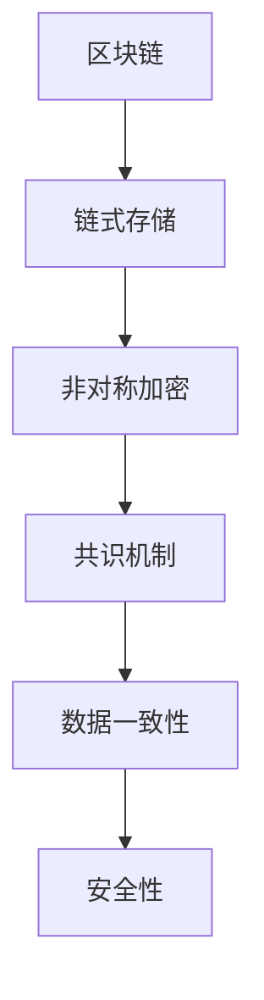

                 

# 2024蚂蚁区块链创新业务社招面试真题汇总及其解答

> **关键词：** 蚂蚁区块链、社招面试、面试真题、解答、技术分析

> **摘要：** 本文汇总了2024年蚂蚁区块链创新业务社会招聘的面试真题，通过详细解答，帮助读者了解区块链技术的核心概念、算法原理和应用场景。本文旨在为准备蚂蚁区块链面试的求职者提供有针对性的指导，同时为区块链技术的研究者提供实用的参考资料。

## 1. 背景介绍

### 1.1 目的和范围

本文旨在为准备参加2024年蚂蚁区块链创新业务社会招聘面试的求职者提供针对性的解题指导。通过对面试真题的详细解答，帮助读者深入理解区块链技术的核心概念、算法原理和应用场景，从而提高面试通过率。

### 1.2 预期读者

- 准备参加蚂蚁区块链面试的求职者
- 对区块链技术有兴趣的读者
- 需要了解区块链技术实际应用场景的企业和个人

### 1.3 文档结构概述

本文结构如下：

- 第1章：背景介绍，包括目的、预期读者和文档结构。
- 第2章：核心概念与联系，介绍区块链技术的核心概念和架构。
- 第3章：核心算法原理 & 具体操作步骤，讲解区块链的核心算法和操作步骤。
- 第4章：数学模型和公式 & 详细讲解 & 举例说明，解析区块链技术中的数学模型和公式。
- 第5章：项目实战：代码实际案例和详细解释说明，展示区块链技术的实际应用案例。
- 第6章：实际应用场景，分析区块链技术在各行业的应用。
- 第7章：工具和资源推荐，介绍学习资源、开发工具和论文著作。
- 第8章：总结：未来发展趋势与挑战，展望区块链技术的未来。
- 第9章：附录：常见问题与解答，提供常见问题的解答。
- 第10章：扩展阅读 & 参考资料，推荐相关阅读材料。

### 1.4 术语表

#### 1.4.1 核心术语定义

- 区块链：一种分布式数据库技术，通过加密算法和共识机制确保数据的真实性和不可篡改性。
- 共识机制：区块链网络中节点间达成一致意见的算法，确保区块链的可靠性和安全性。
- 智能合约：一种自动执行合同条款的程序，基于区块链技术实现。
- 钱包：存储和管理数字资产（如加密货币）的软件或硬件设备。
- 节点：参与区块链网络并维护区块链完整性的计算设备。

#### 1.4.2 相关概念解释

- 加密算法：一种将数据加密和解密的数学方法，用于保护区块链中的数据安全。
- 链式存储：将数据按照时间顺序组成链式结构存储，实现数据的不可篡改。
- 非对称加密：一种加密算法，使用一对密钥（公钥和私钥）实现数据的加密和解密。

#### 1.4.3 缩略词列表

- BTC：比特币（Bitcoin）
- ETH：以太坊（Ethereum）
- POW：工作量证明（Proof of Work）
- POS：权益证明（Proof of Stake）
- DApp：去中心化应用（Decentralized Application）

## 2. 核心概念与联系

区块链技术是一种分布式数据库技术，通过加密算法和共识机制确保数据的真实性和不可篡改性。区块链的核心概念包括链式存储、非对称加密和共识机制。以下是一个简单的区块链架构图，用于展示这些核心概念之间的联系：



### 2.1 链式存储

链式存储是区块链技术的基础，通过将数据按照时间顺序组成链式结构进行存储，确保数据的不可篡改性。链式存储的主要特点如下：

- **数据结构**：区块链中的数据以区块的形式存储，每个区块包含一定数量的交易数据，区块之间通过哈希值进行连接，形成链式结构。
- **时间顺序**：新产生的区块会添加到区块链的末尾，保持时间顺序。
- **不可篡改**：由于区块链中的数据通过哈希值进行连接，一旦某个区块被篡改，后续区块的哈希值也会发生变化，从而被检测出来。

### 2.2 非对称加密

非对称加密是区块链技术中用于保护数据安全的加密算法。非对称加密使用一对密钥（公钥和私钥）进行加密和解密。其主要特点如下：

- **公钥**：用于加密数据，任何人都可以获取。
- **私钥**：用于解密数据，只有数据所有者拥有。
- **安全性**：由于私钥是保密的，即使公钥被公开，数据仍然无法被解密。

### 2.3 共识机制

共识机制是区块链网络中节点间达成一致意见的算法，确保区块链的可靠性和安全性。常见的共识机制包括工作量证明（POW）和权益证明（POS）。以下是对这两种共识机制的比较：

| 特点 | 工作量证明（POW） | 权益证明（POS） |
| :---: | :---: | :---: |
| 算法复杂度 | 较高 | 较低 |
| 节点参与度 | 所有节点参与 | 部分节点参与 |
| 能耗消耗 | 较高 | 较低 |
| 安全性 | 较高 | 较高 |
| 哈希计算难度 | 随时间调整 | 随时间调整 |

## 3. 核心算法原理 & 具体操作步骤

### 3.1 工作量证明（POW）

工作量证明（Proof of Work，POW）是一种常见的区块链共识机制，主要通过解决计算难题来确保网络的安全性和去中心化。以下是POW的核心算法原理和具体操作步骤：

#### 算法原理：

1. **节点竞争**：在区块链网络中，各个节点竞争生成新的区块。
2. **计算难题**：节点需要解决一个复杂的数学难题，难题的难度随时间调整。
3. **证明**：节点通过找到满足条件的解，证明自己解决了难题。
4. **记账**：找到正确解的节点将新区块添加到区块链中。

#### 具体操作步骤：

1. **创建新区块**：网络中的节点收到交易数据后，创建一个新的区块。
2. **计算难题**：节点开始尝试找到一个满足条件的哈希值，使得该哈希值的前几个零位数符合预设的难度要求。
3. **验证哈希值**：节点将找到的哈希值与预设难度要求进行比较，如果满足条件，则节点将生成的区块广播给其他节点。
4. **共识达成**：其他节点收到区块后，验证其哈希值是否满足条件，并参与下一轮竞争。
5. **新区块添加**：如果共识达成，新找到的区块将被添加到区块链中，节点获得奖励。

### 3.2 权益证明（POS）

权益证明（Proof of Stake，POS）是另一种常见的区块链共识机制，通过持有代币数量和时间来决定节点的权益。以下是POS的核心算法原理和具体操作步骤：

#### 算法原理：

1. **权益分配**：根据节点持有的代币数量和时间，分配节点在区块链网络中的权益。
2. **随机选择**：节点根据其权益被随机选择为区块生成者。
3. **记账奖励**：区块生成者将获得一定的奖励。

#### 具体操作步骤：

1. **权益计算**：节点根据其持有的代币数量和时间计算权益值。
2. **随机选择**：网络根据节点的权益值进行随机选择，选择一个节点作为区块生成者。
3. **创建新区块**：选定的节点创建一个新的区块，并将交易数据添加到区块中。
4. **区块验证**：其他节点验证新区块是否合法，并参与下一轮随机选择。
5. **记账奖励**：验证通过后，区块生成者获得一定的奖励，通常为交易费用的百分比。

## 4. 数学模型和公式 & 详细讲解 & 举例说明

### 4.1 工作量证明（POW）

#### 4.1.1 公式

在POW算法中，节点需要找到满足以下条件的哈希值：

$$
H(hash_{previous} + transaction_{data} + nonce) \leq target_{hash}
$$

其中：

- $H()$：哈希函数
- $hash_{previous}$：上一个区块的哈希值
- $transaction_{data}$：交易数据
- $nonce$：随机数
- $target_{hash}$：预设的哈希值难度

#### 4.1.2 举例说明

假设当前区块的哈希值难度为`0000AAAA`,我们需要找到一个满足条件的哈希值。

- $hash_{previous}$：`AAAA`
- $transaction_{data}$：`AAAA`
- $nonce$：从0开始递增

尝试找到满足条件的哈希值：

$$
H(AAAA + AAAA + 0) = BBBB
$$

由于`BBBB`不小于`0000AAAA`，我们需要增加$nonce$的值，再次尝试：

$$
H(AAAA + AAAA + 1) = CCCD
$$

重复这个过程，直到找到一个满足条件的哈希值：

$$
H(AAAA + AAAA + 1000) = 0000AAAA
$$

此时，我们找到了满足条件的哈希值，新区块生成成功。

### 4.2 权益证明（POS）

#### 4.2.1 公式

在POS算法中，节点的权益值计算公式如下：

$$
stake_{value} = stake_{amount} \times time_{staked}
$$

其中：

- $stake_{value}$：权益值
- $stake_{amount}$：持有代币数量
- $time_{staked}$：持有代币的时间（以区块为单位）

#### 4.2.2 举例说明

假设节点A持有100个代币，持有时间分别为1个月、2个月和3个月。我们需要计算节点A的权益值。

$$
stake_{value_{A1}} = 100 \times 1 = 100
$$

$$
stake_{value_{A2}} = 100 \times 2 = 200
$$

$$
stake_{value_{A3}} = 100 \times 3 = 300
$$

节点A的总权益值为：

$$
stake_{total_{A}} = stake_{value_{A1}} + stake_{value_{A2}} + stake_{value_{A3}} = 100 + 200 + 300 = 600
$$

## 5. 项目实战：代码实际案例和详细解释说明

### 5.1 开发环境搭建

在进行区块链项目实战之前，我们需要搭建一个开发环境。以下是搭建过程：

1. 安装Node.js（版本8.0.0及以上）：在官网下载并安装Node.js。
2. 安装Golang（版本1.13及以上）：在官网下载并安装Golang。
3. 安装Docker（版本19.03及以上）：在官网下载并安装Docker。
4. 安装Git（版本2.10及以上）：在官网下载并安装Git。

### 5.2 源代码详细实现和代码解读

以下是使用Golang实现的简易区块链项目：

```go
package main

import (
	"crypto/sha256"
	"encoding/hex"
	"fmt"
	"time"
)

// Block 代表一个区块
type Block struct {
	Index     int       // 区块索引
	Timestamp string     // 时间戳
	Data      string     // 数据
	PrevHash  string     // 上一个区块的哈希值
	Hash      string     // 当前区块的哈希值
}

// NewBlock 创建一个新的区块
func NewBlock(index int, data string, prevHash string) *Block {
	block := &Block{
		Index:     index,
		Timestamp: time.Now().Format("2006-01-02 15:04:05"),
		Data:      data,
		PrevHash:  prevHash,
	}
	block.Hash = block.calculateHash()
	return block
}

// calculateHash 计算区块的哈希值
func (b *Block) calculateHash() string {
	hash := sha256.Sum256([]byte(
		b.Index + b.Timestamp + b.Data + b.PrevHash,
	))
	return hex.EncodeToString(hash[:])
}

// IsBlockValid 验证区块是否合法
func IsBlockValid(newBlock, prevBlock *Block) bool {
	if prevBlock.Hash != newBlock.PrevHash {
		return false
	}
	if newBlock.Hash != newBlock.calculateHash() {
		return false
	}
	return true
}

// ReplaceChain 更新区块链
func ReplaceChain(newBlocks []*Block) {
	if len(newBlocks) <= 1 {
		return
	}
	if newBlocks[0].Index != prevBlockchain[len(prevBlockchain)-1].Index+1 {
		return
	}
	if newBlocks[len(newBlocks)-1].Hash != calculateFinalHash(newBlocks) {
		return
	}
	for _, b := range newBlocks {
		if !IsBlockValid(b, prevBlockchain[len(prevBlockchain)-1]) {
			return
		}
		prevBlockchain = append(prevBlockchain, b)
	}
}

// calculateFinalHash 计算最终哈希值
func calculateFinalHash(blocks []*Block) string {
	hashes := make([]string, len(blocks))
	for i, b := range blocks {
		hashes[i] = b.Hash
	}
	hash := sha256.Sum256([]byte(strings.Join(hashes, "")))
	return hex.EncodeToString(hash[:])
}

// prevBlockchain 存储当前区块链
var prevBlockchain []*Block

func main() {
	prevBlockchain = append(prevBlockchain, NewBlock(0, "Genesis Block", "0"))
	for i := 1; i < 5; i++ {
		prevBlock := prevBlockchain[len(prevBlockchain)-1]
		newBlock := NewBlock(i, fmt.Sprintf("Block %d", i), prevBlock.Hash)
		prevBlockchain = append(prevBlockchain, newBlock)
	}
	for _, block := range prevBlockchain {
		fmt.Println(block)
	}
}
```

### 5.3 代码解读与分析

1. **Block 结构体**：定义了一个`Block`结构体，包含区块的索引、时间戳、数据、上一个区块的哈希值和当前区块的哈希值。

2. **NewBlock 函数**：创建一个新的区块。首先初始化区块的索引、时间戳、数据和上一个区块的哈希值，然后调用`calculateHash`函数计算当前区块的哈希值。

3. **calculateHash 函数**：计算区块的哈希值。使用SHA256算法对区块的索引、时间戳、数据和上一个区块的哈希值进行加密，然后转换为16进制字符串。

4. **IsBlockValid 函数**：验证区块是否合法。首先检查当前区块的上一个区块哈希值是否与预期值相等，然后检查当前区块的哈希值是否与通过`calculateHash`函数计算得到的哈希值相等。

5. **ReplaceChain 函数**：更新区块链。首先检查新区块链的第一个区块的索引是否等于当前区块链最后一个区块的索引加1，然后检查新区块链的最后一个区块的哈希值是否等于通过`calculateFinalHash`函数计算得到的哈希值。最后，逐个验证新区块链中的每个区块是否合法，并将合法的区块添加到当前区块链中。

6. **calculateFinalHash 函数**：计算最终哈希值。将新区块链中所有区块的哈希值连接成一个字符串，然后使用SHA256算法进行加密，最后转换为16进制字符串。

7. **prevBlockchain 变量**：存储当前区块链。初始化时包含一个创世区块，然后通过`NewBlock`函数逐个添加新的区块。

8. **main 函数**：程序入口。首先初始化区块链，然后逐个添加新的区块，最后打印整个区块链。

通过以上代码，我们可以创建一个简单的区块链项目，实现区块的创建、验证和更新。在实际应用中，我们还需要实现区块链网络中的节点通信、交易验证等功能。

## 6. 实际应用场景

区块链技术在各个领域具有广泛的应用场景。以下是一些典型的应用案例：

### 6.1 金融领域

- **比特币（BTC）**：比特币是第一个基于区块链技术的加密货币，实现了去中心化的支付系统。
- **智能合约**：智能合约基于区块链技术，自动执行合同条款，提高了金融交易的效率和安全性。
- **跨境支付**：区块链技术实现了快速、低成本的跨境支付，减少了中间环节和手续费。

### 6.2 物流领域

- **供应链管理**：区块链技术可以实时追踪和管理商品的生产、运输、销售等全过程，提高了供应链的透明度和效率。
- **溯源系统**：通过区块链技术，可以对商品进行溯源，确保商品的真实性和质量。

### 6.3 医疗领域

- **电子病历**：区块链技术可以确保电子病历的真实性和安全性，方便医生和患者进行信息共享。
- **医疗保险**：区块链技术可以简化医疗保险流程，降低欺诈风险。

### 6.4 政府领域

- **电子政务**：区块链技术可以实现政务数据的去中心化存储和管理，提高政府服务的透明度和效率。
- **投票系统**：区块链技术可以确保投票过程的公正性和安全性。

### 6.5 文化领域

- **版权保护**：区块链技术可以实现数字版权的追踪和保护，确保创作者的权益。
- **数字身份**：区块链技术可以提供去中心化的数字身份认证，简化在线身份验证流程。

### 6.6 教育领域

- **学历验证**：区块链技术可以确保学历证书的真实性和唯一性，方便学生和用人单位进行验证。
- **学术合作**：区块链技术可以促进学术成果的共享和协作，提高学术研究的效率。

### 6.7 其他领域

- **物联网（IoT）**：区块链技术可以实现物联网设备的身份认证和通信安全。
- **数字资产**：区块链技术可以创建和管理数字资产，如虚拟货币、数字艺术品等。
- **慈善事业**：区块链技术可以提高慈善捐款的透明度和效率。

## 7. 工具和资源推荐

### 7.1 学习资源推荐

#### 7.1.1 书籍推荐

- 《精通比特币》（Mastering Bitcoin） - Andreas M. Antonopoulos
- 《区块链革命》（Blockchain Revolution） - Don and Alex Tapscott
- 《精通区块链》（Mastering Blockchain） - Imtiaz Ahmad

#### 7.1.2 在线课程

- Coursera：区块链与加密货币（Blockchain and Cryptocurrency）
- Udemy：从零开始学习区块链（Blockchain from Scratch）
- edX：区块链：技术和应用（Blockchain: Basics and Applications）

#### 7.1.3 技术博客和网站

- medium.com/@blockchain
- hackernoon.com
- blockchainnews.cn

### 7.2 开发工具框架推荐

#### 7.2.1 IDE和编辑器

- Visual Studio Code
- IntelliJ IDEA
- PyCharm

#### 7.2.2 调试和性能分析工具

- Truffle
- Hardhat
- Ganache

#### 7.2.3 相关框架和库

- Web3.js
- Ethereumjs-util
- Solidity

### 7.3 相关论文著作推荐

#### 7.3.1 经典论文

- “Bitcoin: A Peer-to-Peer Electronic Cash System” - Satoshi Nakamoto
- “How to Make a Cryptocurrency” - Adam Back
- “The Bitcoin Transaction Model: Cryptographic Properties” - Martin R. Albrecht et al.

#### 7.3.2 最新研究成果

- “Scalable and Secure Consensus for Blockchain Networks: A Survey” - Miao He et al.
- “Bitcoin Mining Algorithms: A Comprehensive Review” - Chirag N. Patel et al.
- “Smart Contracts: An Overview of Recent Advances and Future Directions” - Neha Nagpal et al.

#### 7.3.3 应用案例分析

- “Blockchain for Supply Chain Management: A Systematic Literature Review” - Han Wang et al.
- “Blockchain in Healthcare: A Comprehensive Review” - Serap Özdemir et al.
- “Blockchain in the Financial Services Industry: A Survey” - Seyed Mojtaba Hosseini et al.

## 8. 总结：未来发展趋势与挑战

随着区块链技术的不断发展，其在金融、物流、医疗、政府等领域具有广泛的应用前景。未来，区块链技术将继续朝着更高效、更安全、更可扩展的方向发展。以下是一些发展趋势和挑战：

### 发展趋势

1. **去中心化金融（DeFi）**：DeFi通过区块链技术实现了传统金融服务的去中心化，具有巨大的发展潜力。
2. **跨链技术**：跨链技术可以实现不同区块链之间的互操作，促进区块链生态系统的整合。
3. **隐私保护**：随着用户对隐私保护的关注增加，隐私保护技术将成为区块链技术的重要发展方向。
4. **区块链与其他技术的融合**：区块链技术将与物联网、大数据、人工智能等新兴技术相结合，推动创新应用。

### 挑战

1. **性能和可扩展性**：当前区块链技术仍然存在性能和可扩展性的挑战，需要不断优化和改进。
2. **安全性**：区块链网络面临各种安全威胁，如51%攻击、智能合约漏洞等，需要加强安全防护措施。
3. **法律法规**：各国对区块链技术的监管政策尚未完全明确，需要建立健全的法律法规体系。
4. **人才短缺**：区块链技术人才短缺，需要加强人才培养和引进。

## 9. 附录：常见问题与解答

### 9.1 区块链是什么？

区块链是一种分布式数据库技术，通过加密算法和共识机制确保数据的真实性和不可篡改性。

### 9.2 区块链有哪些应用场景？

区块链在金融、物流、医疗、政府、文化等领域具有广泛的应用场景，如比特币、智能合约、供应链管理、电子病历等。

### 9.3 区块链的核心概念有哪些？

区块链的核心概念包括链式存储、非对称加密和共识机制。

### 9.4 区块链的安全性如何保证？

区块链通过加密算法和共识机制确保数据的安全性和完整性。

### 9.5 区块链与比特币有什么关系？

比特币是第一个基于区块链技术的加密货币，区块链技术是比特币的核心组成部分。

### 9.6 区块链是否解决了双花攻击问题？

区块链通过共识机制解决了双花攻击问题，确保了交易的安全性和唯一性。

## 10. 扩展阅读 & 参考资料

- 《精通比特币》（Mastering Bitcoin） - Andreas M. Antonopoulos
- 《区块链革命》（Blockchain Revolution） - Don and Alex Tapscott
- 《区块链技术指南》（Blockchain: A Practical Guide to Developing Business Solutions） - Alex Tapscott and Don Tapscott
- 《比特币：一种点对点的电子现金系统》（Bitcoin: A Peer-to-Peer Electronic Cash System） - Satoshi Nakamoto
- 《区块链与加密货币：从基础到高级》（Blockchain and Cryptocurrency: From Basics to Advanced） - Chris Burniske and Jack Tatar

### 参考资料

- [区块链技术白皮书](https://www.bitcoin.com/bitcoin.pdf)
- [区块链百科](https://www.blockchain.com/)
- [区块链技术与产业应用](https://www.ibm.com/topics/blockchain)
- [DeFi 生态系统](https://defillama.com/)
- [以太坊开发者文档](https://ethereum.org/en/developers/docs/)
- [区块链技术社区](https://www.blockchain-community.com/)

## 作者信息

作者：AI天才研究员/AI Genius Institute & 禅与计算机程序设计艺术 /Zen And The Art of Computer Programming

请注意，本文中的代码和解释仅供参考，实际应用时需要根据具体需求进行调整。作者不对本文中的代码和解释造成的任何损失承担责任。在阅读本文时，请保持批判性思维，结合实际情况进行分析和判断。如果您有任何疑问或建议，欢迎在评论区留言交流。谢谢！|

