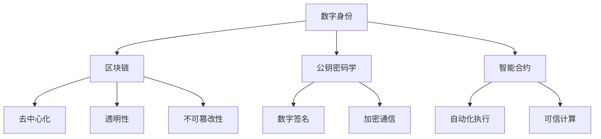

                 

# 2024蚂蚁数字身份社招面试真题汇总及其解答

> **关键词：** 蚂蚁数字身份、社招面试、真题汇总、解题思路、技术深度
> 
> **摘要：** 本文旨在为即将参加蚂蚁集团数字身份社招面试的候选人提供一份真题汇总及解答指南，通过对核心概念、算法原理、数学模型、实战案例的深入剖析，帮助读者掌握数字身份技术的核心知识和解题技巧。

## 1. 背景介绍

### 1.1 目的和范围

本文的目标是为蚂蚁集团数字身份社招面试的候选人提供一份全面的真题汇总及解答指南。通过系统化的分析和讲解，使读者能够深入了解数字身份技术，掌握面试所需的核心知识和解题技巧。

本文涵盖以下内容：

- 数字身份技术的核心概念与原理
- 蚂蚁数字身份的技术架构与实现
- 面试真题解析，包括算法、数学模型、实战案例等
- 数字身份技术的实际应用场景
- 工具和资源推荐，包括书籍、在线课程、技术博客等

### 1.2 预期读者

- 参加蚂蚁集团数字身份社招面试的候选人
- 对数字身份技术感兴趣的IT从业者
- 计算机科学、软件工程等相关专业的研究生和本科生

### 1.3 文档结构概述

本文的结构如下：

- 第1章：背景介绍，包括目的和范围、预期读者、文档结构概述
- 第2章：核心概念与联系，介绍数字身份技术的核心概念、原理与架构
- 第3章：核心算法原理与具体操作步骤，详细讲解面试中可能涉及的算法问题
- 第4章：数学模型和公式，介绍数字身份技术相关的数学模型和公式，并给出举例说明
- 第5章：项目实战，通过实际代码案例展示数字身份技术的应用
- 第6章：实际应用场景，分析数字身份技术在现实世界的应用
- 第7章：工具和资源推荐，推荐学习资源、开发工具和框架
- 第8章：总结，展望数字身份技术的未来发展趋势与挑战
- 第9章：附录，包括常见问题与解答
- 第10章：扩展阅读与参考资料

### 1.4 术语表

#### 1.4.1 核心术语定义

- **数字身份**：指在虚拟世界中，由个人、组织或设备所持有的唯一标识，用于证明身份和访问权限。
- **区块链**：一种去中心化的分布式数据库技术，能够确保数据的安全、透明和不可篡改。
- **数字签名**：一种加密技术，用于验证数字身份的真实性和完整性。
- **智能合约**：一种在区块链上运行的自动化协议，根据预定的规则自动执行合同条款。
- **公钥密码学**：一种加密技术，使用公钥和私钥对数据进行加密和解密。

#### 1.4.2 相关概念解释

- **哈希函数**：一种将任意长度的输入数据映射为固定长度的输出数据的函数，具有抗碰撞性和一致性。
- **对称加密**：一种加密算法，加密和解密使用相同的密钥。
- **非对称加密**：一种加密算法，加密和解密使用不同的密钥，其中一个是公钥，另一个是私钥。

#### 1.4.3 缩略词列表

- **ID**：Identity，数字身份
- **PKI**：Public Key Infrastructure，公钥基础设施
- **BC**：Blockchain，区块链
- **DLT**：Distributed Ledger Technology，分布式账本技术
- **KYC**：Know Your Customer，了解你的客户

## 2. 核心概念与联系

在数字身份技术中，有若干核心概念和原理需要理解。以下是一个简化的 Mermaid 流程图，展示了这些核心概念及其相互联系。



### 2.1 数字身份技术核心概念

**数字身份（A）**：数字身份是个人、组织或设备在虚拟世界的唯一标识，用于证明身份和授权访问。数字身份需要保证唯一性、安全性和隐私性。

**区块链（B）**：区块链是一种分布式账本技术，通过加密和共识机制，实现数据的透明、不可篡改和安全存储。数字身份信息的存储和验证可以通过区块链技术实现。

**公钥密码学（C）**：公钥密码学是一种加密技术，使用公钥和私钥对数据进行加密和解密。数字身份的验证和加密通信依赖于公钥密码学。

**智能合约（D）**：智能合约是一种在区块链上自动执行的合同条款，依赖于代码逻辑。数字身份管理中的权限控制、身份验证等功能可以通过智能合约实现。

### 2.2 数字身份技术原理

**去中心化（E）**：数字身份技术采用去中心化架构，确保数据不被单一机构控制，提高系统的安全性和可靠性。

**透明性（F）**：区块链技术确保数字身份信息对所有参与者透明，防止信息被篡改。

**不可篡改性（G）**：区块链技术通过加密和共识机制，确保数字身份信息一旦记录，就无法被篡改。

**数字签名（H）**：数字签名用于验证数字身份的真实性和完整性，防止身份信息被篡改。

**加密通信（I）**：数字身份技术依赖于加密通信，确保身份信息在传输过程中不被窃取或篡改。

**自动化执行（J）**：智能合约实现数字身份管理的自动化执行，减少人工干预，提高效率。

**可信计算（K）**：可信计算确保数字身份信息的计算过程是可信的，防止恶意行为。

## 3. 核心算法原理与具体操作步骤

在数字身份技术中，算法原理是核心部分。以下将介绍几个关键的算法原理，并使用伪代码进行详细阐述。

### 3.1 哈希函数

哈希函数是一种将任意长度的输入数据映射为固定长度的输出数据的函数。哈希函数具有抗碰撞性和一致性，是数字身份技术中的关键组成部分。

**伪代码：**

```plaintext
function hash(input) {
    // 初始化哈希值
    hash_value = initialize_hash_value()

    // 对输入数据进行处理
    for (each character in input) {
        hash_value = update_hash_value(hash_value, character)
    }

    // 返回最终的哈希值
    return hash_value
}
```

### 3.2 数字签名

数字签名是一种加密技术，用于验证数字身份的真实性和完整性。数字签名依赖于公钥密码学。

**伪代码：**

```plaintext
function digitalSignature(message, private_key) {
    // 对消息进行哈希处理
    message_hash = hash(message)

    // 使用私钥对哈希值进行签名
    signature = sign(message_hash, private_key)

    // 返回签名结果
    return signature
}
```

### 3.3 非对称加密

非对称加密是一种加密算法，使用公钥和私钥对数据进行加密和解密。

**伪代码：**

```plaintext
function asymmetricEncryption(plaintext, public_key) {
    // 使用公钥对明文进行加密
    ciphertext = encrypt(plaintext, public_key)

    // 返回密文
    return ciphertext
}

function asymmetricDecryption(ciphertext, private_key) {
    // 使用私钥对密文进行解密
    plaintext = decrypt(ciphertext, private_key)

    // 返回明文
    return plaintext
}
```

### 3.4 智能合约

智能合约是一种在区块链上自动执行的合同条款。以下是一个简单的智能合约示例。

**伪代码：**

```plaintext
contract DigitalIdentity {
    // 定义身份信息
    identity_info = {}

    // 设置身份信息
    function setIdentityInfo(name, age, address) {
        identity_info[name] = {age: age, address: address}
    }

    // 验证身份信息
    function verifyIdentity(name) {
        if (name in identity_info) {
            return identity_info[name]
        } else {
            return "Identity not found"
        }
    }
}
```

## 4. 数学模型和公式与详细讲解

在数字身份技术中，数学模型和公式是核心组成部分。以下将介绍几个关键的数学模型和公式，并使用 LaTeX 格式进行详细讲解。

### 4.1 哈希函数

哈希函数的数学模型可以表示为：

$$ H(x) = \text{hash}(x) $$

其中，\( H(x) \) 表示输入数据 \( x \) 的哈希值，\( \text{hash} \) 表示哈希函数。

### 4.2 数字签名

数字签名的数学模型可以表示为：

$$ s = \text{sign}(m, k) $$

其中，\( s \) 表示签名，\( m \) 表示消息，\( k \) 表示私钥。

### 4.3 非对称加密

非对称加密的数学模型可以表示为：

$$ c = \text{encrypt}(m, k) $$

$$ m' = \text{decrypt}(c, k') $$

其中，\( c \) 表示密文，\( m' \) 表示明文，\( k \) 表示公钥，\( k' \) 表示私钥。

### 4.4 智能合约

智能合约的数学模型可以表示为：

$$ C = \text{contract}(P_1, P_2, \ldots, P_n) $$

其中，\( C \) 表示智能合约，\( P_1, P_2, \ldots, P_n \) 表示参与者的输入参数。

### 4.5 模块化密码学

模块化密码学的数学模型可以表示为：

$$ c = \text{hash}(m) \mod p $$

其中，\( c \) 表示哈希值，\( m \) 表示消息，\( p \) 表示模数。

### 4.6 零知识证明

零知识证明的数学模型可以表示为：

$$ \text{prove}(P, V) $$

其中，\( P \) 表示陈述，\( V \) 表示验证者。

## 5. 项目实战：代码实际案例和详细解释说明

### 5.1 开发环境搭建

在进行数字身份技术的项目实战之前，首先需要搭建开发环境。以下是具体的步骤：

1. 安装 Node.js 和 npm
2. 安装 Solidity 编译器
3. 安装 Truffle 开发框架
4. 安装 MetaMask 钱包

### 5.2 源代码详细实现和代码解读

以下是一个简单的数字身份智能合约的代码实现，并对其进行了详细的解读。

```solidity
pragma solidity ^0.8.0;

contract DigitalIdentity {
    mapping(address => string) public identities;

    // 设置身份信息
    function setIdentity(string memory identity) public {
        identities[msg.sender] = identity;
    }

    // 验证身份信息
    function verifyIdentity() public view returns (string memory) {
        return identities[msg.sender];
    }
}
```

**代码解读：**

1. **pragma 指令**：指定编译器使用的 Solidity 版本。
2. **mapping**：用于存储身份信息，其中 `address` 为键，`string` 为值。
3. **setIdentity**：设置身份信息，通过 `public` 关键字使其可被外部调用。
4. **verifyIdentity**：验证身份信息，返回当前地址对应的位置的身份信息。

### 5.3 代码解读与分析

在理解了代码实现之后，我们对其进行进一步的分析：

1. **身份信息的存储**：使用 `mapping` 数据结构，便于快速查找和更新身份信息。
2. **函数的访问权限**：`setIdentity` 函数使用 `public` 关键字，表明可以公开调用。
3. **函数的返回类型**：`verifyIdentity` 函数返回 `string` 类型的值，表示身份信息的字符串表示。
4. **智能合约的安全性**：代码实现较为简单，未涉及权限控制、防重入攻击等问题，实际项目中需要进一步优化。

## 6. 实际应用场景

数字身份技术在现实世界中有着广泛的应用场景，以下是几个典型的应用案例：

### 6.1 金融领域

在金融领域，数字身份技术可以用于客户身份验证、交易安全控制等方面。通过区块链技术，实现客户身份信息的可信存储和验证，提高交易的安全性和透明性。

### 6.2 政府部门

政府部门可以利用数字身份技术，实现电子政务的便捷化和安全性。例如，通过数字身份验证，简化行政审批流程，提高政府服务的效率。

### 6.3 医疗保健

在医疗保健领域，数字身份技术可以用于患者身份验证、病历管理等方面。通过区块链技术，确保病历信息的真实性和完整性，提高医疗服务的质量。

### 6.4 教育领域

在教育领域，数字身份技术可以用于学生身份验证、学术成果认证等方面。通过区块链技术，确保学术成果的真实性和权威性，提高教育评价的公正性。

## 7. 工具和资源推荐

### 7.1 学习资源推荐

#### 7.1.1 书籍推荐

- 《区块链技术指南》
- 《智能合约：从入门到精通》
- 《深入理解区块链》

#### 7.1.2 在线课程

- Coursera 上的《区块链技术与应用》
- Udemy 上的《智能合约开发入门》
- edX 上的《区块链与加密货币》

#### 7.1.3 技术博客和网站

- Medium 上的区块链相关文章
- CoinDesk 上的加密货币新闻
- Blockworks 上的区块链技术资讯

### 7.2 开发工具框架推荐

#### 7.2.1 IDE和编辑器

- Visual Studio Code
- Sublime Text
- IntelliJ IDEA

#### 7.2.2 调试和性能分析工具

- Truffle Suite
- Hardhat
- Remix IDE

#### 7.2.3 相关框架和库

- Web3.js
- ethers.js
- OpenZeppelin

### 7.3 相关论文著作推荐

#### 7.3.1 经典论文

- Bitcoin: A Peer-to-Peer Electronic Cash System
- Ethereum: A Secure Decentralized General Smart Contract Platform
- Blockchain consensus mechanism

#### 7.3.2 最新研究成果

- The State of the Art of Blockchain Consensus Algorithms
- Practical Byzantine Fault Tolerance
- Delegated Proof of Stake

#### 7.3.3 应用案例分析

- Analysis of Bitcoin Transactions and Their Economic Impact
- A Comprehensive Review of Ethereum Smart Contracts
- Blockchain Technology in Healthcare: Opportunities and Challenges

## 8. 总结：未来发展趋势与挑战

数字身份技术在未来发展趋势上，将更加注重安全性、隐私保护和易用性。随着区块链技术的不断发展，数字身份技术将在金融、政府、医疗、教育等领域得到更广泛的应用。

然而，数字身份技术也面临一些挑战，如：

- **隐私保护**：如何在保护用户隐私的前提下，实现高效的身份验证？
- **性能优化**：如何提高数字身份系统的处理速度和可扩展性？
- **法律法规**：如何适应各国法律法规，确保数字身份技术的合法性和合规性？

## 9. 附录：常见问题与解答

### 9.1 数字身份技术的基础问题

**Q1**：什么是数字身份？

**A1**：数字身份是指个人、组织或设备在虚拟世界中持有的唯一标识，用于证明身份和授权访问。

**Q2**：数字身份技术有哪些核心概念？

**A2**：数字身份技术涉及的核心概念包括区块链、公钥密码学、智能合约、去中心化、透明性、不可篡改性等。

**Q3**：什么是数字签名？

**A3**：数字签名是一种加密技术，用于验证数字身份的真实性和完整性，防止信息被篡改。

### 9.2 数字身份技术的应用问题

**Q4**：数字身份技术在金融领域有哪些应用？

**A4**：数字身份技术在金融领域可以用于客户身份验证、交易安全控制、反洗钱等。

**Q5**：数字身份技术在政府部门有哪些应用？

**A5**：数字身份技术在政府部门可以用于电子政务、行政审批、公共安全等。

**Q6**：数字身份技术在医疗保健领域有哪些应用？

**A6**：数字身份技术在医疗保健领域可以用于患者身份验证、病历管理、医疗信息安全等。

### 9.3 数字身份技术的开发问题

**Q7**：如何搭建数字身份技术的开发环境？

**A7**：搭建数字身份技术的开发环境需要安装 Node.js、Solidity 编译器、Truffle 开发框架和 MetaMask 钱包。

**Q8**：如何编写数字身份智能合约？

**A8**：编写数字身份智能合约需要熟悉 Solidity 编程语言和区块链开发框架，使用智能合约模板进行开发。

## 10. 扩展阅读与参考资料

- **《区块链技术指南》**
- **《智能合约：从入门到精通》**
- **《深入理解区块链》**
- **《区块链技术与应用》**
- **《智能合约开发入门》**
- **《区块链与加密货币》**
- **《区块链共识机制》**
- **《区块链技术手册》**
- **《数字身份技术与隐私保护》**
- **《区块链技术原理与应用案例分析》**

