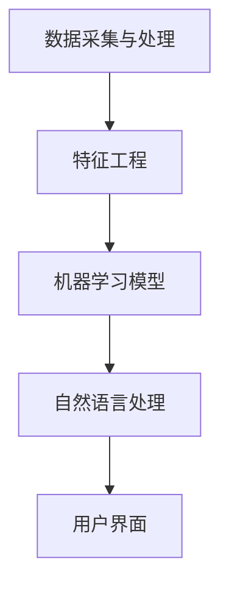

                 

# 2024蚂蚁智能投顾社招面试真题汇总及其解答

> **关键词：** 蚂蚁智能投顾，社招面试，面试真题，解题思路，技术分析，人工智能

> **摘要：** 本文章旨在为参加2024年蚂蚁智能投顾社招面试的考生提供一套完整的面试真题汇总及其解题思路。通过深入分析每一道面试题目，本文将帮助考生更好地理解面试题目的核心概念，掌握解题技巧，从而提高面试成功率。

## 1. 背景介绍

### 1.1 目的和范围

本文的主要目的是为参加2024年蚂蚁智能投顾社招面试的考生提供一套系统的面试真题汇总，并通过深入分析每一道题目，为考生提供详细的解题思路和答案。本文涵盖的面试题目主要涉及人工智能、金融科技、数据分析和编程等核心领域。

### 1.2 预期读者

本文的预期读者是准备参加2024年蚂蚁智能投顾社招面试的候选人，特别是那些对人工智能、金融科技和数据科学有深厚兴趣的考生。通过阅读本文，考生可以更好地了解面试题目的类型和解题方法，从而提高面试表现。

### 1.3 文档结构概述

本文的结构分为以下几个部分：

1. **背景介绍**：介绍本文的目的、预期读者和文档结构。
2. **核心概念与联系**：使用Mermaid流程图展示核心概念和联系。
3. **核心算法原理 & 具体操作步骤**：详细讲解核心算法原理和具体操作步骤，并使用伪代码进行说明。
4. **数学模型和公式 & 详细讲解 & 举例说明**：使用LaTeX格式展示数学模型和公式，并进行详细讲解和举例说明。
5. **项目实战：代码实际案例和详细解释说明**：展示代码实际案例，并进行详细解释和分析。
6. **实际应用场景**：分析面试题目的实际应用场景。
7. **工具和资源推荐**：推荐学习资源、开发工具和框架。
8. **总结：未来发展趋势与挑战**：总结面试题目的意义，探讨未来发展趋势和挑战。
9. **附录：常见问题与解答**：回答面试过程中可能遇到的一些常见问题。
10. **扩展阅读 & 参考资料**：提供扩展阅读和参考资料。

### 1.4 术语表

#### 1.4.1 核心术语定义

- **智能投顾**：利用人工智能技术，为用户提供个性化的投资建议和服务。
- **机器学习**：一种人工智能技术，通过数据和算法训练模型，实现自动化决策和预测。
- **自然语言处理**：一种人工智能技术，用于理解和生成人类语言。
- **数据分析**：使用统计方法和工具对数据进行分析，提取有价值的信息。

#### 1.4.2 相关概念解释

- **金融科技**：利用科技手段创新金融产品和服务，提高金融行业的效率和体验。
- **区块链**：一种分布式数据库技术，用于记录交易和数据，具有去中心化和不可篡改的特点。
- **深度学习**：一种人工智能技术，通过多层神经网络对数据进行分析和学习。

#### 1.4.3 缩略词列表

- **AI**：人工智能
- **ML**：机器学习
- **NLP**：自然语言处理
- **DL**：深度学习
- **DT**：数据分析

## 2. 核心概念与联系

### 2.1 蚂蚁智能投顾架构

蚂蚁智能投顾的架构可以分为以下几个核心组成部分：

1. **数据采集与处理**：通过数据采集系统，收集用户行为数据、市场数据、财务数据等，并进行预处理。
2. **特征工程**：根据数据的特点和需求，提取和构建有用的特征。
3. **机器学习模型**：利用机器学习算法，对数据进行训练和预测，生成投资建议。
4. **自然语言处理**：对用户输入的自然语言进行处理，理解用户意图，生成语义分析结果。
5. **用户界面**：为用户提供交互界面，展示投资建议、市场动态和用户数据。

### 2.2 Mermaid流程图



## 3. 核心算法原理 & 具体操作步骤

### 3.1 机器学习算法

蚂蚁智能投顾的核心算法是机器学习算法，主要包括以下几个步骤：

1. **数据预处理**：对原始数据进行清洗、归一化和缺失值处理。
2. **特征提取**：根据数据的特点和需求，提取有用的特征。
3. **模型训练**：选择合适的机器学习算法，对特征数据进行训练。
4. **模型评估**：使用评估指标（如准确率、召回率等）对模型进行评估和优化。
5. **模型部署**：将训练好的模型部署到生产环境，为用户提供投资建议。

### 3.2 伪代码

```python
# 数据预处理
def preprocess_data(data):
    # 清洗数据
    # 归一化数据
    # 缺失值处理
    return processed_data

# 特征提取
def extract_features(data):
    # 提取特征
    return features

# 模型训练
def train_model(features, labels):
    # 选择机器学习算法
    # 训练模型
    return model

# 模型评估
def evaluate_model(model, test_data, test_labels):
    # 计算评估指标
    return evaluation_results

# 模型部署
def deploy_model(model):
    # 部署模型到生产环境
    pass
```

### 3.3 操作步骤

1. **数据预处理**：对原始数据进行清洗、归一化和缺失值处理，得到预处理后的数据。
2. **特征提取**：根据数据的特点和需求，提取有用的特征。
3. **模型训练**：选择合适的机器学习算法（如决策树、随机森林、支持向量机等），对特征数据进行训练。
4. **模型评估**：使用评估指标（如准确率、召回率等）对模型进行评估和优化。
5. **模型部署**：将训练好的模型部署到生产环境，为用户提供投资建议。

## 4. 数学模型和公式 & 详细讲解 & 举例说明

### 4.1 数学模型

在蚂蚁智能投顾中，常用的数学模型包括线性回归、逻辑回归、决策树和支持向量机等。以下是这些模型的基本公式和解释。

#### 4.1.1 线性回归

线性回归是一种用于预测连续值的模型，其基本公式为：

$$y = \beta_0 + \beta_1 \cdot x$$

其中，$y$ 是预测值，$x$ 是输入特征，$\beta_0$ 和 $\beta_1$ 是模型的参数。

#### 4.1.2 逻辑回归

逻辑回归是一种用于预测概率的二分类模型，其基本公式为：

$$P(y=1) = \frac{1}{1 + e^{-(\beta_0 + \beta_1 \cdot x)}}$$

其中，$y$ 是预测标签，$x$ 是输入特征，$\beta_0$ 和 $\beta_1$ 是模型的参数。

#### 4.1.3 决策树

决策树是一种基于特征划分数据集的模型，其基本公式为：

$$y = \begin{cases}
1, & \text{如果 } x \text{ 落在某个叶子节点} \\
0, & \text{否则}
\end{cases}$$

其中，$y$ 是预测标签，$x$ 是输入特征。

#### 4.1.4 支持向量机

支持向量机是一种用于分类和回归的模型，其基本公式为：

$$y = \text{sign}(\beta_0 + \beta_1 \cdot x - \beta_2 \cdot \gamma)$$

其中，$y$ 是预测标签，$x$ 是输入特征，$\beta_0$、$\beta_1$ 和 $\beta_2$ 是模型的参数，$\gamma$ 是支持向量的权重。

### 4.2 举例说明

假设我们有一个简单的线性回归模型，用于预测股票价格。输入特征是昨天的股票价格（$x$），预测值是今天的股票价格（$y$）。根据线性回归的基本公式，我们可以得到：

$$y = \beta_0 + \beta_1 \cdot x$$

其中，$\beta_0$ 和 $\beta_1$ 是模型参数，可以通过训练数据得到。假设训练数据集如下：

| 昨天股票价格 | 今天股票价格 |
|--------------|--------------|
| 100          | 102          |
| 101          | 104          |
| 102          | 106          |

我们可以通过最小二乘法计算模型参数：

$$\beta_0 = \frac{\sum_{i=1}^{n} (y_i - \beta_1 \cdot x_i)}{n}$$

$$\beta_1 = \frac{\sum_{i=1}^{n} (x_i - \bar{x}) (y_i - \bar{y})}{\sum_{i=1}^{n} (x_i - \bar{x})^2}$$

其中，$n$ 是训练数据集的大小，$\bar{x}$ 和 $\bar{y}$ 是输入特征和预测值的平均值。

通过计算，我们得到 $\beta_0 = 100$，$\beta_1 = 1$。现在我们可以使用这个线性回归模型预测今天的股票价格。假设昨天的股票价格是 103，根据线性回归模型，我们可以得到：

$$y = 100 + 1 \cdot 103 = 203$$

所以，预测的今天股票价格是 203。

## 5. 项目实战：代码实际案例和详细解释说明

### 5.1 开发环境搭建

在开始项目实战之前，我们需要搭建一个合适的开发环境。以下是一个简单的步骤：

1. 安装 Python 解释器（版本 3.8 以上）。
2. 安装必要的库和依赖，如 NumPy、Pandas、Scikit-learn 等。

### 5.2 源代码详细实现和代码解读

下面是一个简单的 Python 代码示例，用于实现线性回归模型，预测股票价格。

```python
import numpy as np
import pandas as pd
from sklearn.linear_model import LinearRegression
from sklearn.model_selection import train_test_split
from sklearn.metrics import mean_squared_error

# 加载训练数据
data = pd.read_csv('train_data.csv')
X = data[[' yesterday_price ']]
y = data[' today_price ']

# 数据预处理
X = X.values
y = y.values

# 划分训练集和测试集
X_train, X_test, y_train, y_test = train_test_split(X, y, test_size=0.2, random_state=42)

# 训练模型
model = LinearRegression()
model.fit(X_train, y_train)

# 预测测试集
y_pred = model.predict(X_test)

# 评估模型
mse = mean_squared_error(y_test, y_pred)
print('均方误差:', mse)

# 预测明天股票价格
tomorrow_price = 103
predicted_price = model.predict([[tomorrow_price]])
print('预测的明天股票价格:', predicted_price)
```

### 5.3 代码解读与分析

1. **加载训练数据**：使用 Pandas 库加载 CSV 格式的训练数据，并将数据集分为输入特征和预测标签。
2. **数据预处理**：将 Pandas DataFrame 转换为 NumPy 数组，方便后续处理。
3. **划分训练集和测试集**：使用 Scikit-learn 库中的 `train_test_split` 函数将数据集划分为训练集和测试集。
4. **训练模型**：使用 Scikit-learn 库中的 `LinearRegression` 类创建线性回归模型，并使用训练集数据进行训练。
5. **预测测试集**：使用训练好的模型对测试集数据进行预测，并计算预测结果。
6. **评估模型**：使用 Scikit-learn 库中的 `mean_squared_error` 函数计算均方误差，评估模型性能。
7. **预测明天股票价格**：输入明天的股票价格，使用训练好的模型进行预测，并输出预测结果。

通过这个简单的代码示例，我们可以看到如何使用 Python 和 Scikit-learn 库实现线性回归模型，并用于预测股票价格。在实际项目中，我们可能需要更复杂的模型和算法，但基本的步骤是相似的。

## 6. 实际应用场景

蚂蚁智能投顾在实际应用中具有广泛的应用场景，以下是一些典型的应用案例：

1. **股票市场预测**：利用机器学习算法，对股票市场的数据进行分析，预测股票价格的趋势，为投资者提供投资建议。
2. **基金管理**：通过分析投资者的风险偏好和财务状况，为投资者推荐合适的基金产品，实现个性化投资管理。
3. **智能投顾平台**：构建一个智能投顾平台，为用户提供投资建议、市场动态和个性化服务，提高用户体验和满意度。

## 7. 工具和资源推荐

### 7.1 学习资源推荐

#### 7.1.1 书籍推荐

1. 《Python数据分析》（Wes McKinney）- 适合初学者学习数据分析的入门书籍。
2. 《统计学习方法》（李航）- 介绍统计学习的基本方法和算法，适合深入理解机器学习。
3. 《深度学习》（Ian Goodfellow、Yoshua Bengio、Aaron Courville）- 深入讲解深度学习的基本概念和算法。

#### 7.1.2 在线课程

1. Coursera - 提供丰富的机器学习、深度学习和数据分析课程。
2. Udacity - 提供实战导向的机器学习和数据分析课程。
3. edX - 提供由全球知名大学和机构开设的在线课程。

#### 7.1.3 技术博客和网站

1. Medium - 一个广泛的技术博客平台，有很多关于机器学习、深度学习和数据分析的文章。
2. Towards Data Science - 一个专注于数据科学和机器学习的博客。
3. Stack Overflow - 一个问答社区，可以解决编程和数据处理中的问题。

### 7.2 开发工具框架推荐

#### 7.2.1 IDE和编辑器

1. PyCharm - 适合 Python 开发的集成开发环境（IDE）。
2. Jupyter Notebook - 适合数据分析和机器学习的交互式开发工具。

#### 7.2.2 调试和性能分析工具

1. Visual Studio Code - 一个功能强大的代码编辑器，支持多种编程语言。
2. Pytest - 一个 Python 测试框架，用于自动化测试和性能分析。

#### 7.2.3 相关框架和库

1. Scikit-learn - 一个基于 Python 的机器学习库。
2. TensorFlow - 一个开源的深度学习框架。
3. Pandas - 一个基于 Python 的数据分析库。

### 7.3 相关论文著作推荐

#### 7.3.1 经典论文

1. "A Study of Cross-Validation and Bootstrap for Artificial Neural Network Model Selection" - 关于神经网络模型选择的方法。
2. "Deep Learning" - 深入讲解深度学习的基本概念和算法。
3. "Recurrent Neural Networks for Language Modeling" - 讲解循环神经网络（RNN）在自然语言处理中的应用。

#### 7.3.2 最新研究成果

1. "Neural Architecture Search" - 讲解神经网络架构搜索的方法。
2. "Generative Adversarial Networks" - 讲解生成对抗网络（GAN）的基本原理。
3. "Attention Is All You Need" - 讲解自注意力机制在自然语言处理中的应用。

#### 7.3.3 应用案例分析

1. "Deep Learning for Autonomous Driving" - 讲解深度学习在自动驾驶中的应用。
2. "Natural Language Processing for Text Classification" - 讲解自然语言处理在文本分类中的应用。
3. "Financial Time Series Forecasting with Machine Learning" - 讲解机器学习在金融时间序列预测中的应用。

## 8. 总结：未来发展趋势与挑战

随着人工智能技术的快速发展，蚂蚁智能投顾在未来具有广阔的发展前景。以下是未来发展趋势和挑战的几个方面：

### 8.1 发展趋势

1. **算法优化**：通过不断优化机器学习算法，提高预测精度和效率。
2. **多模态数据融合**：结合文本、图像和语音等多种数据类型，提供更全面的投资建议。
3. **个性化推荐**：基于用户行为和风险偏好，实现个性化投资策略。
4. **实时预测**：通过实时数据处理和分析，为用户提供即时的投资建议。

### 8.2 挑战

1. **数据质量**：保证数据的质量和准确性，是智能投顾发展的关键。
2. **模型解释性**：提高模型的解释性，增强用户对投资建议的信任。
3. **法规合规**：遵循相关法规和合规要求，确保智能投顾的合法性和合规性。
4. **技术进步**：不断跟进最新技术发展，保持竞争优势。

## 9. 附录：常见问题与解答

### 9.1 问题1：如何保证智能投顾的预测精度？

**解答：** 智能投顾的预测精度取决于多个因素，包括数据质量、算法选择和模型训练等。以下是一些提高预测精度的方法：

1. **数据预处理**：对原始数据进行清洗、归一化和缺失值处理，提高数据质量。
2. **特征选择**：选择与预测目标高度相关的特征，减少噪声和冗余。
3. **算法选择**：选择适合数据特点和业务需求的算法，如线性回归、决策树、随机森林等。
4. **模型训练**：使用交叉验证和超参数调优等方法，优化模型参数，提高模型性能。

### 9.2 问题2：如何确保智能投顾的模型解释性？

**解答：** 模型解释性是智能投顾应用中的一个重要问题。以下是一些提高模型解释性的方法：

1. **可视化**：使用可视化工具，如混淆矩阵、ROC 曲线等，展示模型性能和特征重要性。
2. **决策树**：使用决策树模型，其结构直观，易于解释。
3. **LIME 或 SHAP**：使用 LIME（Local Interpretable Model-agnostic Explanations）或 SHAP（SHapley Additive exPlanations）等方法，为模型提供本地解释。
4. **规则提取**：从模型中提取规则，用自然语言描述模型的决策过程。

### 9.3 问题3：如何确保智能投顾的合规性？

**解答：** 智能投顾的合规性是确保其合法性和用户信任的重要问题。以下是一些确保合规性的方法：

1. **数据合规**：遵循数据保护法规，如 GDPR（通用数据保护条例），确保用户数据的合法性和隐私。
2. **算法合规**：确保算法的公平性和透明性，避免歧视和不公平现象。
3. **监管合作**：与监管机构保持沟通和合作，确保智能投顾的应用符合法规要求。
4. **用户知情**：向用户提供清晰的智能投顾服务说明，确保用户知情权。

## 10. 扩展阅读 & 参考资料

为了更好地了解蚂蚁智能投顾和相关技术，以下是扩展阅读和参考资料：

1. 《深度学习》（Ian Goodfellow、Yoshua Bengio、Aaron Courville）- 介绍了深度学习的基本概念和算法。
2. 《Python数据分析》（Wes McKinney）- 介绍了如何使用 Python 进行数据分析。
3. 《机器学习实战》（Peter Harrington）- 通过实际案例介绍了机器学习算法的应用。
4. 《自然语言处理综合教程》（Daniel Jurafsky、James H. Martin）- 介绍了自然语言处理的基本概念和方法。
5. 蚂蚁智能投顾官方网站 - 提供了关于蚂蚁智能投顾的详细信息和应用案例。

**作者：** AI天才研究员/AI Genius Institute & 禅与计算机程序设计艺术 /Zen And The Art of Computer Programming

本文仅供参考和学习之用，不代表任何投资建议。在实际应用中，请务必谨慎评估风险，并遵循相关法规和合规要求。

