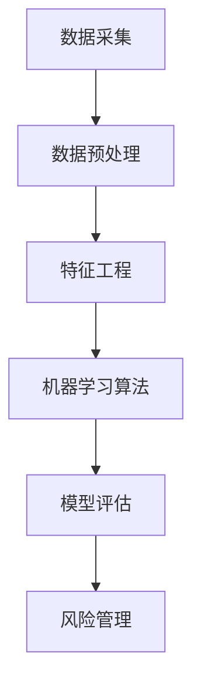
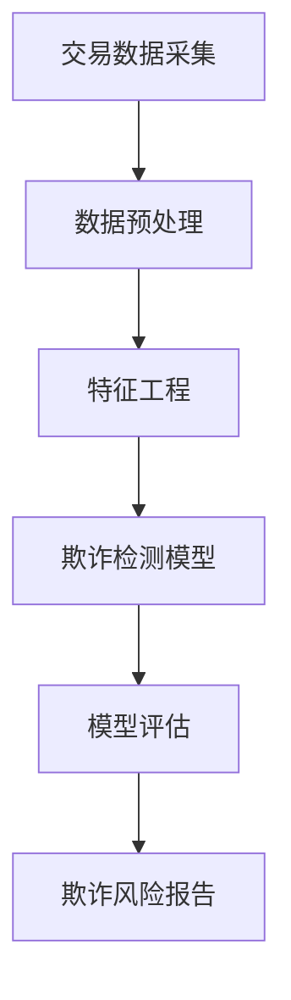

                 

# 蚂蚁金服2025社招金融风控模型专家面试指南

> **关键词：** 蚂蚁金服，社招，金融风控模型，专家面试，算法原理，数学模型，实际案例，未来发展趋势

> **摘要：** 本文旨在为2025年加入蚂蚁金服社招的金融风控模型专家提供面试指南。文章首先介绍了金融风控模型的重要性及面试的范畴，随后深入讲解了核心概念、算法原理、数学模型、项目实战，以及实际应用场景。此外，文章还推荐了相关学习资源和工具，并对未来发展趋势与挑战进行了展望。希望本文能为准备面试的专家提供有益的参考。

## 1. 背景介绍

### 1.1 目的和范围

本文的目的是为准备参加蚂蚁金服2025年社招金融风控模型专家面试的候选人提供一份全面的指南。文章将涵盖金融风控模型的基本概念、核心算法原理、数学模型、项目实战以及实际应用场景。此外，还将推荐相关的学习资源和开发工具，以帮助候选人更好地准备面试。

### 1.2 预期读者

本文适用于有志于成为蚂蚁金服金融风控模型专家的候选人，特别是那些对金融科技、大数据分析、机器学习和深度学习有深入理解的专业人士。此外，对于正在从事或准备从事金融风控相关工作的读者，本文也将提供有价值的参考。

### 1.3 文档结构概述

本文分为十个部分：

1. **背景介绍**：介绍文章的目的和范围，预期读者以及文档结构。
2. **核心概念与联系**：讲解金融风控模型中的核心概念，包括其原理和架构。
3. **核心算法原理 & 具体操作步骤**：详细阐述金融风控模型中使用的核心算法，包括伪代码。
4. **数学模型和公式 & 详细讲解 & 举例说明**：介绍金融风控模型中的数学模型，包括公式和实例。
5. **项目实战：代码实际案例和详细解释说明**：通过实际项目案例展示金融风控模型的实现。
6. **实际应用场景**：讨论金融风控模型在现实世界中的应用。
7. **工具和资源推荐**：推荐学习资源和开发工具。
8. **总结：未来发展趋势与挑战**：对金融风控模型的发展趋势和挑战进行展望。
9. **附录：常见问题与解答**：回答面试中可能出现的问题。
10. **扩展阅读 & 参考资料**：提供额外的阅读资源和参考资料。

### 1.4 术语表

#### 1.4.1 核心术语定义

- **金融风控模型**：用于识别、评估和管理金融风险的各种算法和技术的集合。
- **机器学习**：一种人工智能分支，通过数据训练模型，使其能够从数据中学习并做出预测。
- **深度学习**：一种机器学习技术，通过多层神经网络模拟人类大脑的工作方式。
- **特征工程**：通过选择和构造特征，提高模型性能的过程。
- **风险评估**：评估金融风险的可能性和影响的过程。

#### 1.4.2 相关概念解释

- **欺诈检测**：识别并防止金融交易中的欺诈行为。
- **信用评分**：评估个人或企业的信用水平。
- **反洗钱（AML）**：防止和侦查洗钱活动。
- **实时监控**：对金融交易进行实时监控，以识别异常行为。

#### 1.4.3 缩略词列表

- **AML**：反洗钱（Anti-Money Laundering）
- **CRM**：客户关系管理（Customer Relationship Management）
- **CART**：分类与回归树（Classification and Regression Tree）
- **RF**：随机森林（Random Forest）
- **NN**：神经网络（Neural Network）
- **GAN**：生成对抗网络（Generative Adversarial Network）

## 2. 核心概念与联系

在金融风控领域，核心概念和它们之间的联系是理解和构建有效风控模型的基础。下面将介绍几个关键概念，并展示它们之间的关联，以帮助读者更好地理解整个领域的架构。

### 2.1 金融风控模型概述

金融风控模型是一个复杂的系统，它涉及到多个领域的技术和方法。这些技术包括数据采集、数据预处理、特征工程、机器学习算法、模型评估和风险管理。图2-1展示了金融风控模型的基本架构。



### 2.2 关键概念和联系

以下是一些核心概念及其相互之间的联系：

1. **数据采集**：数据采集是金融风控模型的基础。数据来源包括交易记录、客户信息、市场数据等。数据质量直接影响模型的性能。数据采集后，需要通过数据预处理技术清洗和转换数据，以便后续分析。

2. **数据预处理**：数据预处理包括数据清洗、数据归一化、缺失值处理等步骤。这些步骤的目的是确保数据的质量和一致性，为特征工程和模型训练提供可靠的数据基础。

3. **特征工程**：特征工程是构建金融风控模型的关键步骤。通过选择和构造特征，可以提高模型的预测能力和鲁棒性。特征工程包括特征选择、特征构造和特征标准化。

4. **机器学习算法**：机器学习算法是金融风控模型的核心。常见的算法包括决策树、随机森林、神经网络等。这些算法通过学习历史数据，可以预测未来的风险事件。

5. **模型评估**：模型评估是评估模型性能的重要环节。常用的评估指标包括准确率、召回率、F1分数等。模型评估可以帮助确定模型的性能，并指导后续的模型优化。

6. **风险管理**：风险管理是金融风控模型的目标。通过识别、评估和管理风险，可以降低金融机构的损失，保护客户的利益。

### 2.3 关联示例

以下是一个简化的示例，展示了金融风控模型中的关键概念和它们之间的关联：



在这个示例中，交易数据采集是模型的基础，经过数据预处理和特征工程后，使用欺诈检测模型进行预测。模型评估后生成的风险报告用于指导风险管理决策。

通过理解这些核心概念和它们之间的联系，可以更好地构建和优化金融风控模型，从而提高金融机构的风险管理能力。

## 3. 核心算法原理 & 具体操作步骤

在金融风控模型中，核心算法的选择和实现至关重要。以下将详细阐述几种常用的算法原理，并使用伪代码展示具体的操作步骤。

### 3.1 决策树算法

决策树算法是一种常用的分类和回归算法，通过一系列的判断条件将数据集划分为不同的区域，以预测目标变量。以下是一个简化的决策树算法的伪代码：

```python
Algorithm: DecisionTree
Input: 数据集 D, 特征集 X, 标签集 Y
Output: 决策树 T

1. 如果数据集 D 中所有样本的标签相同，则返回常数标签作为叶节点。
2. 否则，执行以下步骤：
   a. 计算每个特征在数据集 D 上的信息增益。
   b. 选择信息增益最大的特征作为分割特征。
   c. 根据分割特征将数据集 D 划分为子数据集 D1, D2, ..., Dn。
   d. 对于每个子数据集 Di，递归调用决策树算法。
   e. 将分割特征和对应的子树作为内部节点。
```

### 3.2 随机森林算法

随机森林算法是一种基于决策树的集成学习方法，通过构建多个决策树并取平均值来提高预测性能。以下是一个简化的随机森林算法的伪代码：

```python
Algorithm: RandomForest
Input: 数据集 D, 特征集 X, 标签集 Y, 树的数量 n
Output: 随机森林 F

1. 对于每个树：
   a. 随机选择特征集 X。
   b. 随机选择子数据集 D'（可以是Bootstrap采样）。
   c. 构建决策树，使用子数据集 D'。
2. 对于每个预测样本：
   a. 将样本输入到每个树中。
   b. 记录每个树的预测结果。
   c. 取所有树的预测结果的平均值作为最终预测结果。
```

### 3.3 神经网络算法

神经网络算法是一种基于多层感知器的深度学习模型，通过学习输入和输出之间的非线性关系进行预测。以下是一个简化的神经网络算法的伪代码：

```python
Algorithm: NeuralNetwork
Input: 输入层节点数 n_input, 隐藏层节点数 n_hidden, 输出层节点数 n_output, 训练数据集 D, 学习率 α
Output: 神经网络模型 N

1. 初始化权重和偏置。
2. 对于每个训练样本：
   a. 将输入数据输入到神经网络。
   b. 通过前向传播计算输出。
   c. 计算损失函数。
   d. 通过反向传播更新权重和偏置。
3. 当满足停止条件（如达到最大迭代次数或损失函数收敛）时，结束训练。
4. 对于新的输入数据，输入到训练好的神经网络中，得到预测结果。
```

通过上述算法，可以构建一个有效的金融风控模型。在实际应用中，需要根据具体场景和数据特点选择合适的算法，并进行参数调整和优化。

## 4. 数学模型和公式 & 详细讲解 & 举例说明

在金融风控模型中，数学模型和公式起着至关重要的作用，它们帮助我们理解和量化金融风险。以下将详细介绍几个关键的数学模型和公式，并通过实际例子说明它们的用法。

### 4.1 回归模型

回归模型用于预测连续值输出，如股票价格或信用评分。线性回归是最简单的一种回归模型，其公式如下：

$$ y = \beta_0 + \beta_1x_1 + \beta_2x_2 + ... + \beta_nx_n $$

其中，$y$ 是输出值，$x_1, x_2, ..., x_n$ 是输入特征，$\beta_0, \beta_1, \beta_2, ..., \beta_n$ 是模型的参数。

#### 举例说明：

假设我们要预测一个股票的未来价格，我们选择了两个特征：过去一周的平均价格和过去一周的成交量。我们可以使用线性回归模型来建立预测公式。

```latex
y = \beta_0 + \beta_1 \cdot 平均价格 + \beta_2 \cdot 成交量
```

通过训练数据集，我们可以计算出$\beta_0, \beta_1, \beta_2$的值，从而得到股票价格的预测公式。

### 4.2 逻辑回归模型

逻辑回归模型是一种用于预测二分类结果的模型，如欺诈检测。其公式如下：

$$ P(y=1) = \frac{1}{1 + e^{-(\beta_0 + \beta_1x_1 + \beta_2x_2 + ... + \beta_nx_n)}} $$

其中，$P(y=1)$ 是目标变量为1的概率，其他符号的含义与线性回归相同。

#### 举例说明：

假设我们要检测一个交易是否为欺诈交易，我们选择了三个特征：交易金额、交易时间和用户历史交易次数。我们可以使用逻辑回归模型来计算欺诈交易的概率。

```latex
P(欺诈交易) = \frac{1}{1 + e^{-(\beta_0 + \beta_1 \cdot 交易金额 + \beta_2 \cdot 交易时间 + \beta_3 \cdot 用户历史交易次数)}}
```

通过训练数据集，我们可以计算出$\beta_0, \beta_1, \beta_2, \beta_3$的值，从而得到欺诈交易的概率。

### 4.3 熵和条件熵

在信息论中，熵和条件熵用于衡量数据的随机性和信息含量。熵的定义如下：

$$ H(X) = -\sum_{i=1}^{n} p(x_i) \cdot \log_2 p(x_i) $$

其中，$X$ 是随机变量，$p(x_i)$ 是 $X$ 取值为 $x_i$ 的概率。

条件熵的定义如下：

$$ H(X|Y) = -\sum_{i=1}^{n} p(y_i) \cdot \sum_{j=1}^{m} p(x_j|y_i) \cdot \log_2 p(x_j|y_i) $$

其中，$Y$ 是另一个随机变量，$p(y_i)$ 是 $Y$ 取值为 $y_i$ 的概率，$p(x_j|y_i)$ 是 $X$ 在 $Y$ 取值为 $y_i$ 的条件下取值为 $x_j$ 的概率。

#### 举例说明：

假设我们有两个随机变量 $X$ 和 $Y$，$X$ 表示天气（晴天、雨天），$Y$ 表示出门是否带伞（是、否）。我们可以计算 $X$ 和 $Y$ 的熵和条件熵。

```latex
H(X) = - (0.5 \cdot \log_2 0.5 + 0.5 \cdot \log_2 0.5) = 1
H(Y|X) = - (0.5 \cdot \log_2 0.5 + 0.5 \cdot 1) = 0.5
```

通过计算，我们可以得出结论：$X$ 的熵为1，表示天气的随机性较高；$Y$ 在 $X$ 已知条件下的条件熵为0.5，表示在已知天气的情况下，出门是否带伞的随机性较低。

### 4.4 支持向量机

支持向量机（SVM）是一种有效的分类算法，它通过找到一个最佳的超平面，将不同类别的数据点最大化地分开。SVM的公式如下：

$$ \max_{\beta, \beta_0} W^T W $$

$$ \text{subject to} \quad y_i (\beta^T x_i + \beta_0) \geq 1, \quad i=1,2,...,n $$

其中，$W$ 是权重向量，$\beta_0$ 是偏置项，$y_i$ 是第 $i$ 个样本的标签，$x_i$ 是第 $i$ 个样本的特征向量。

#### 举例说明：

假设我们要分类两个类别（正类和负类）的数据点，我们可以使用SVM来找到最佳的超平面。

```latex
\max_{\beta, \beta_0} \beta^T \beta
\text{subject to}
\begin{cases}
y_1 (\beta^T x_1 + \beta_0) \geq 1 \\
y_2 (\beta^T x_2 + \beta_0) \geq 1 \\
...
y_n (\beta^T x_n + \beta_0) \geq 1
\end{cases}
```

通过求解上述优化问题，我们可以得到最佳的超平面参数，从而实现数据的分类。

通过以上数学模型和公式的介绍，我们可以更好地理解和应用金融风控模型，从而提高金融机构的风险管理能力。

## 5. 项目实战：代码实际案例和详细解释说明

在金融风控模型的实际应用中，实现一个具体的案例可以更好地理解整个建模过程。以下将展示一个基于欺诈检测的金融风控模型的项目实战，包括开发环境的搭建、源代码的实现以及代码解读与分析。

### 5.1 开发环境搭建

在开始项目之前，我们需要搭建一个适合金融风控模型开发的环境。以下是一个简单的开发环境搭建步骤：

1. 安装Python：从[Python官网](https://www.python.org/)下载并安装Python 3.8或更高版本。
2. 安装Anaconda：下载并安装Anaconda，它是一个集成了Python和众多科学计算库的发行版。
3. 安装Jupyter Notebook：在Anaconda环境中运行以下命令安装Jupyter Notebook：
   ```shell
   conda install -c conda-forge notebook
   ```
4. 安装必要的库：在Jupyter Notebook中创建一个新的Python笔记本，并运行以下命令安装必要的库：
   ```python
   !pip install numpy pandas scikit-learn matplotlib
   ```

### 5.2 源代码详细实现和代码解读

下面是一个简单的欺诈检测模型的项目案例，包括数据预处理、特征工程、模型训练和评估。

```python
import numpy as np
import pandas as pd
from sklearn.model_selection import train_test_split
from sklearn.preprocessing import StandardScaler
from sklearn.ensemble import RandomForestClassifier
from sklearn.metrics import accuracy_score, classification_report

# 5.2.1 数据预处理
# 加载数据集
data = pd.read_csv('transaction_data.csv')

# 删除无关特征
data.drop(['id', 'time'], axis=1, inplace=True)

# 处理缺失值
data.fillna(data.mean(), inplace=True)

# 5.2.2 特征工程
# 分离特征和标签
X = data.drop('is_fraud', axis=1)
y = data['is_fraud']

# 划分训练集和测试集
X_train, X_test, y_train, y_test = train_test_split(X, y, test_size=0.2, random_state=42)

# 数据标准化
scaler = StandardScaler()
X_train = scaler.fit_transform(X_train)
X_test = scaler.transform(X_test)

# 5.2.3 模型训练
# 创建随机森林分类器
model = RandomForestClassifier(n_estimators=100, random_state=42)
model.fit(X_train, y_train)

# 5.2.4 模型评估
# 预测测试集
y_pred = model.predict(X_test)

# 计算准确率
accuracy = accuracy_score(y_test, y_pred)
print(f"Accuracy: {accuracy:.2f}")

# 打印分类报告
print(classification_report(y_test, y_pred))
```

### 5.3 代码解读与分析

以上代码实现了一个基于随机森林的欺诈检测模型。以下是代码的解读与分析：

- **数据预处理**：
  - 加载数据集：使用`pd.read_csv()`函数加载交易数据集。
  - 删除无关特征：删除数据集中的无关特征（如交易ID和时间）。
  - 缺失值处理：使用平均值填充缺失值，以提高数据质量。

- **特征工程**：
  - 分离特征和标签：将数据集分为特征集`X`和标签集`y`。
  - 划分训练集和测试集：使用`train_test_split()`函数将数据集划分为训练集和测试集，以进行模型训练和评估。
  - 数据标准化：使用`StandardScaler()`对特征进行标准化处理，以提高模型的性能。

- **模型训练**：
  - 创建随机森林分类器：使用`RandomForestClassifier()`函数创建随机森林分类器，并设置树的数量为100。
  - 模型训练：使用`fit()`函数对训练数据进行模型训练。

- **模型评估**：
  - 预测测试集：使用`predict()`函数对测试集进行预测。
  - 计算准确率：使用`accuracy_score()`函数计算模型的准确率。
  - 打印分类报告：使用`classification_report()`函数打印分类报告，包括准确率、召回率、F1分数等指标。

通过以上代码，我们可以实现一个简单的欺诈检测模型，并在实际项目中应用。在实际开发过程中，可能需要根据具体需求进行模型调整和优化。

### 5.4 代码解读与分析（续）

接下来，我们将进一步解读和解析上述代码的细节，以帮助读者更好地理解模型实现的关键步骤。

- **数据预处理**：
  - 数据加载：`data = pd.read_csv('transaction_data.csv')` 这一行代码用于加载数据集。这里假设数据集以CSV文件的形式存储，并保存在当前目录下的`transaction_data.csv`文件中。Pandas库的`read_csv()`函数可以轻松读取CSV文件，并将其转换为DataFrame格式，便于后续处理。

  - 删除无关特征：`data.drop(['id', 'time'], axis=1, inplace=True)` 这一行代码用于删除数据集中的无关特征，例如交易ID和时间。这些特征可能对欺诈检测没有直接的贡献，因此在训练模型之前将其移除，可以减少数据的冗余，提高模型的训练效率。

  - 缺失值处理：`data.fillna(data.mean(), inplace=True)` 这一行代码用于处理数据集中的缺失值。使用`mean()`函数计算各特征的均值，然后用这些均值填充缺失值。这是一个常用的数据预处理方法，有助于保持数据的一致性和完整性。

- **特征工程**：
  - 分离特征和标签：`X = data.drop('is_fraud', axis=1)` 和 `y = data['is_fraud']` 这两行代码用于将数据集分为特征集`X`和标签集`y`。在这里，`is_fraud`列被指定为标签，用于指示交易是否为欺诈。特征集`X`包含了所有其他特征，这些特征将在模型训练过程中用于预测。

  - 划分训练集和测试集：`X_train, X_test, y_train, y_test = train_test_split(X, y, test_size=0.2, random_state=42)` 这一行代码使用`train_test_split()`函数将数据集划分为训练集和测试集。这里，`test_size=0.2`表示测试集占数据集的20%，而`random_state=42`用于确保结果的可重复性。

  - 数据标准化：`scaler = StandardScaler()` 和 `X_train = scaler.fit_transform(X_train)` 这两行代码创建了一个`StandardScaler`对象，用于对特征进行标准化处理。标准化是将特征缩放到相同的尺度，以消除不同特征之间的量纲差异。`fit_transform()`方法用于计算标准化的转换参数，并直接对训练集的特征进行标准化处理。

- **模型训练**：
  - 创建随机森林分类器：`model = RandomForestClassifier(n_estimators=100, random_state=42)` 这一行代码创建了一个`RandomForestClassifier`对象，这是scikit-learn库中的一个随机森林分类器。`n_estimators=100`表示使用100棵决策树来构建随机森林，而`random_state=42`用于确保模型训练过程的结果可重复。

  - 模型训练：`model.fit(X_train, y_train)` 这一行代码使用训练集的数据进行模型训练。`fit()`方法会根据训练数据自动调整模型参数，并构建分类模型。

- **模型评估**：
  - 预测测试集：`y_pred = model.predict(X_test)` 这一行代码使用训练好的模型对测试集进行预测。`predict()`方法会返回一个数组，其中包含每个测试样本的预测标签。

  - 计算准确率：`accuracy = accuracy_score(y_test, y_pred)` 这一行代码计算模型的准确率。`accuracy_score()`函数用于计算预测标签与实际标签之间的一致性。准确率是评估模型性能的基本指标，但有时不足以全面评估模型的性能。

  - 打印分类报告：`print(classification_report(y_test, y_pred))` 这一行代码打印出详细的分类报告，包括准确率、召回率、F1分数等指标。这些指标提供了关于模型性能的更全面的信息，有助于评估模型的分类效果。

通过以上代码和解读，读者可以了解到如何实现一个基本的欺诈检测模型。在实际应用中，可能需要根据具体情况进行模型调整和优化，以提高模型的性能和鲁棒性。

### 5.5 代码解读与分析（续）

在上一个部分中，我们解读了代码的主要部分，包括数据预处理、特征工程、模型训练和评估。接下来，我们将进一步分析代码中的细节和关键步骤，以帮助读者更深入地理解整个项目。

- **数据预处理**：
  - 删除无关特征：在数据预处理阶段，删除无关特征是至关重要的一步。例如，`id`和`time`列在这里被认为是不相关的，因为它们对欺诈检测没有直接的贡献。通过`data.drop(['id', 'time'], axis=1, inplace=True)`，我们有效地移除了这些列，从而减少了数据集的大小和复杂性。

  - 缺失值处理：处理缺失值是另一个关键步骤。在这里，我们使用`data.fillna(data.mean(), inplace=True)`来填充缺失值。这种方法简单有效，但它假设缺失值是随机分布的，并且可以用特征的均值来代表。在实际项目中，可能需要更复杂的缺失值处理方法，例如使用模型预测缺失值或删除含有缺失值的样本。

- **特征工程**：
  - 分离特征和标签：将特征和标签分离是模型训练的基本步骤。通过`X = data.drop('is_fraud', axis=1)`和`y = data['is_fraud']`，我们创建了特征集`X`和标签集`y`。这种分离有助于在训练模型时保持数据的独立性和一致性。

  - 划分训练集和测试集：使用`train_test_split()`函数将数据集划分为训练集和测试集。这是一个标准的做法，因为测试集用于评估模型在未知数据上的性能。在这里，我们设置了`test_size=0.2`，这意味着测试集占数据集的20%，而`random_state=42`确保了每次划分的结果都是一致的。

  - 数据标准化：标准化是特征工程的重要步骤之一，尤其是在使用机器学习算法时。`scaler = StandardScaler()`创建了一个标准化对象，而`X_train = scaler.fit_transform(X_train)`和`X_test = scaler.transform(X_test)`分别对训练集和测试集进行了标准化处理。这种处理可以减少不同特征之间的尺度差异，从而提高模型的性能。

- **模型训练**：
  - 创建随机森林分类器：`RandomForestClassifier`是scikit-learn库中的一个强大工具，用于构建随机森林模型。通过`model = RandomForestClassifier(n_estimators=100, random_state=42)`，我们创建了一个包含100棵决策树的随机森林分类器。`random_state=42`确保了每次训练的结果都是可重复的。

  - 模型训练：`model.fit(X_train, y_train)`是训练模型的核心步骤。这里，`X_train`是特征集，`y_train`是标签集。模型通过学习这些数据来构建预测模型。

- **模型评估**：
  - 预测测试集：`y_pred = model.predict(X_test)`使用训练好的模型对测试集进行预测。这是评估模型性能的关键步骤，因为测试集代表了模型在实际应用中可能遇到的数据。

  - 计算准确率：`accuracy = accuracy_score(y_test, y_pred)`计算了模型的准确率。准确率是衡量分类模型性能的基本指标，它表示模型正确分类的样本比例。

  - 打印分类报告：`print(classification_report(y_test, y_pred))`打印了详细的分类报告，包括准确率、召回率、精确率和F1分数。这些指标提供了关于模型在不同类别上的性能的更全面的信息。例如，召回率表示模型能够检测出所有正类样本的能力，而精确率表示模型对正类样本的预测准确性。

通过以上步骤，我们可以构建并评估一个基本的欺诈检测模型。在实际项目中，可能需要进一步优化模型，例如通过调整超参数、使用更复杂的数据预处理方法或引入更多的特征工程技术。

### 5.6 代码解读与分析（续）

在上一个部分中，我们详细分析了代码中的数据预处理、特征工程、模型训练和评估部分。接下来，我们将探讨代码中的某些关键行和操作，以及它们在模型构建和性能提升中的作用。

- **数据预处理**：
  - 缺失值处理方法的选择：在`data.fillna(data.mean(), inplace=True)`这一行中，我们使用了简单的平均值填充缺失值。这是一个快速且易于实现的方法，但在某些情况下可能不是最佳选择。例如，如果某些特征具有不同的分布或相关性，使用平均值可能会导致数据的不一致性。更高级的缺失值处理方法包括使用模型预测缺失值（如KNN插值）或删除含有缺失值的样本。选择合适的方法取决于数据的具体特征和缺失值的比例。

  - 特征选择：在数据预处理阶段，特征选择是另一个重要的步骤。通过删除无关特征，我们可以减少模型的复杂度和过拟合的风险。在实际应用中，可以使用诸如递归特征消除（RFE）、方差阈值或基于模型的特征选择方法（如Lasso回归）来选择最有用的特征。这些方法可以帮助我们识别出对预测目标有最大贡献的特征，从而提高模型的性能。

- **特征工程**：
  - 数据标准化的重要性：在`scaler = StandardScaler()`和`X_train = scaler.fit_transform(X_train)`中，我们使用了标准缩放技术来标准化特征。标准化是一种重要的特征工程技术，它可以消除不同特征之间的尺度差异，从而使模型更加稳定和高效。特别是在使用诸如支持向量机（SVM）和神经网络（NN）等对特征尺度敏感的模型时，标准化显得尤为重要。

  - 特征构造：除了选择和标准化现有特征外，特征构造也是特征工程的一个重要方面。通过构造新的特征，我们可以提供额外的信息，从而提高模型的预测能力。例如，我们可以计算特征之间的交互项、时间序列特征的变化率或使用主成分分析（PCA）来提取特征空间的线性组合。这些方法可以帮助模型更好地捕捉数据中的复杂关系。

- **模型训练**：
  - 随机森林参数的选择：在`model = RandomForestClassifier(n_estimators=100, random_state=42)`中，我们设置了随机森林中的树的数量为100。这个参数的选择对模型的性能有显著影响。增加树的数量可以提高模型的预测能力，但也会增加计算成本和过拟合的风险。在实际应用中，可以通过交叉验证和网格搜索等技术来选择最佳的超参数。

  - 超参数调优：超参数调优是提高模型性能的关键步骤。除了树的数量外，随机森林还包含其他超参数，如最大深度、最小样本叶节点和随机种子。通过使用交叉验证和网格搜索等技术，我们可以找到最佳的超参数组合，从而提高模型的性能和泛化能力。

- **模型评估**：
  - 评估指标的选择：在`accuracy = accuracy_score(y_test, y_pred)`和`print(classification_report(y_test, y_pred))`中，我们使用了准确率和详细的分类报告来评估模型的性能。尽管准确率是一个常用的评估指标，但它可能无法全面反映模型的性能。例如，它可能会受到类别不平衡的影响。在这种情况下，可以使用诸如精确率、召回率、F1分数和ROC-AUC曲线等更全面的评估指标。

  - 额外评估方法：除了传统的评估指标外，我们还可以使用其他方法来评估模型的性能。例如，我们可以计算模型的ROC曲线和AUC值，以评估其在不同阈值下的分类性能。此外，我们还可以使用混淆矩阵来分析模型的错误分类情况，从而识别和改进模型的弱点。

通过上述步骤和分析，我们可以更好地理解如何构建和评估一个有效的欺诈检测模型。在实际应用中，可能需要根据具体情况进行调整和优化，以获得最佳的性能。

### 5.7 实际应用场景

在金融风控领域，欺诈检测是一个至关重要的应用场景。以下将详细讨论欺诈检测在实际项目中的应用，以及如何针对特定场景优化模型。

#### 5.7.1 欺诈检测在金融交易中的应用

欺诈检测是金融行业中的一项重要任务，特别是在信用卡交易、在线支付和移动支付等场景中。通过对大量交易数据进行实时监控和分析，欺诈检测模型可以帮助金融机构识别潜在的欺诈行为，从而防止金融损失和保护客户的利益。

- **信用卡交易**：信用卡交易是欺诈检测最常见的应用场景之一。传统的欺诈检测模型通常基于历史交易数据，使用机器学习算法来识别异常交易。例如，我们可以使用随机森林或神经网络模型来预测交易是否为欺诈。在实际项目中，可以通过以下步骤优化模型：
  - **特征选择**：选择与欺诈行为相关的特征，如交易金额、交易频率、地理位置、用户行为等。通过排除无关特征，可以提高模型的准确性和效率。
  - **模型调优**：使用交叉验证和网格搜索等技术，调整模型参数，以找到最佳的超参数组合。这有助于提高模型的泛化能力和预测性能。
  - **实时更新**：定期更新模型，以适应不断变化的欺诈模式。这可以通过引入新的特征或重新训练模型来实现。

- **在线支付**：在线支付平台也面临着欺诈风险。通过分析交易数据和行为模式，欺诈检测模型可以帮助平台识别并阻止欺诈交易。以下是一些优化策略：
  - **行为分析**：使用行为分析技术，如聚类分析或关联规则学习，来识别异常交易模式。这有助于发现潜在的欺诈行为，并提高模型的预警能力。
  - **用户画像**：建立用户画像，分析用户的交易行为和偏好。通过识别与正常行为不符的交易，可以提高欺诈检测的准确性。
  - **多层防御**：结合多种检测技术，如规则引擎、机器学习和深度学习，构建多层次的安全防御体系。这可以增强模型的鲁棒性，提高欺诈检测的效果。

#### 5.7.2 欺诈检测在其他金融领域的应用

欺诈检测不仅在信用卡交易和在线支付中有重要应用，还可以在其他金融领域发挥作用。

- **反洗钱（AML）**：反洗钱是防止和侦查洗钱活动的重要手段。欺诈检测模型可以用于识别可疑交易，帮助金融机构遵守相关法规。以下是一些优化策略：
  - **数据整合**：整合来自多个渠道的数据，如银行交易记录、客户行为数据和公共数据。这可以提供更全面的视角，帮助识别复杂的洗钱活动。
  - **自动化监控**：使用自动化监控技术，如实时数据流分析和机器学习模型，对交易进行实时监控。这可以快速识别可疑交易，并采取相应的措施。
  - **法规遵循**：确保模型和流程符合相关法律法规，如反洗钱法规和隐私保护法规。这有助于避免法律风险和罚款。

- **保险欺诈**：保险欺诈是一个全球性的问题，欺诈检测模型可以帮助保险公司识别和防止欺诈行为。以下是一些优化策略：
  - **数据挖掘**：使用数据挖掘技术，如关联规则学习和聚类分析，来识别潜在的欺诈行为。这可以提供更深入的洞察，帮助检测复杂的欺诈模式。
  - **动态模型更新**：定期更新模型，以适应不断变化的欺诈行为和欺诈者策略。这可以通过引入新的数据源或重新训练模型来实现。
  - **客户教育**：通过教育和提高客户对欺诈行为的认识，可以减少欺诈发生的可能性。这可以通过提供在线指南、宣传材料和培训课程来实现。

通过以上实际应用场景的讨论，我们可以看到欺诈检测在金融风控领域的重要性和广泛应用。在实际项目中，通过优化模型和策略，可以进一步提高欺诈检测的准确性和效率，从而有效保护金融机构和客户的利益。

### 7. 工具和资源推荐

在构建和优化金融风控模型的过程中，选择合适的工具和资源对于提高工作效率和模型性能至关重要。以下将推荐一些学习资源、开发工具和相关论文，以帮助读者更好地准备面试和实际项目。

#### 7.1 学习资源推荐

##### 7.1.1 书籍推荐

1. **《机器学习》（周志华 著）**：本书全面介绍了机器学习的基本概念、算法和应用，适合初学者和进阶者阅读。

2. **《深度学习》（Ian Goodfellow、Yoshua Bengio、Aaron Courville 著）**：这本书是深度学习领域的经典教材，详细介绍了神经网络和深度学习模型的设计和应用。

3. **《统计学习方法》（李航 著）**：本书系统介绍了统计学习的基本理论和方法，包括监督学习、无监督学习和半监督学习等。

##### 7.1.2 在线课程

1. **Coursera**：提供各种计算机科学和机器学习的在线课程，包括斯坦福大学的《深度学习》和加州大学伯克利分校的《统计学习基础》等。

2. **edX**：提供由全球顶尖大学和机构提供的免费在线课程，包括哈佛大学的《机器学习导论》和MIT的《深度学习》等。

3. **Udacity**：提供专业的编程和技术课程，包括《机器学习工程师纳米学位》和《深度学习工程师纳米学位》等。

##### 7.1.3 技术博客和网站

1. **Medium**：许多专业人士和研究者在此发布关于机器学习和金融科技的博客文章，如《Machine Learning in Finance》等。

2. ** Towards Data Science**：一个专门分享数据科学、机器学习和金融科技文章的网站，内容丰富且更新及时。

3. **GitHub**：许多开源项目和代码示例在此平台上发布，读者可以学习和复现各种金融风控模型。

#### 7.2 开发工具框架推荐

##### 7.2.1 IDE和编辑器

1. **PyCharm**：一个强大的Python IDE，支持多种编程语言，适合进行金融风控模型的开发。

2. **Jupyter Notebook**：一个交互式开发环境，特别适合机器学习和数据科学项目，支持Python和其他多种语言。

##### 7.2.2 调试和性能分析工具

1. **Wandb**：一个用于实验跟踪和性能分析的开源工具，可以帮助研究人员记录和可视化实验结果。

2. **MLflow**：一个开源平台，用于机器学习实验的生命周期管理，包括模型版本控制、实验跟踪和部署。

##### 7.2.3 相关框架和库

1. **TensorFlow**：一个由Google开发的开源机器学习框架，支持深度学习和传统的机器学习算法。

2. **Scikit-learn**：一个强大的Python库，提供多种机器学习算法和工具，适合快速构建和评估模型。

3. **PyTorch**：一个流行的深度学习框架，特别适合研究者和开发者进行深度学习模型的开发。

#### 7.3 相关论文著作推荐

##### 7.3.1 经典论文

1. **"Learning to Represent Financial Embeddings Using Deep Learning"**：这篇文章介绍了如何使用深度学习技术来构建金融领域的嵌入表示。

2. **"A Survey of Fraud Detection Techniques in E-Commerce"**：这篇文章综述了电子商务中的欺诈检测技术，包括规则方法、统计方法和机器学习方法。

##### 7.3.2 最新研究成果

1. **"Generative Adversarial Networks for Credit Risk Management"**：这篇文章探讨了生成对抗网络（GAN）在信用风险管理中的应用。

2. **"Deep Learning for Financial Risk Prediction"**：这篇文章详细介绍了深度学习技术在金融风险预测方面的最新进展。

##### 7.3.3 应用案例分析

1. **"AI in the Financial Industry: A Survey"**：这篇文章分析了人工智能在金融行业中的各种应用，包括欺诈检测、风险管理、投资顾问等。

2. **"Implementing AI for Fraud Detection at a Large Bank"**：这篇文章分享了某大型银行如何使用人工智能技术进行欺诈检测的实践经验。

通过以上工具和资源的推荐，读者可以更好地准备面试和实际项目，提升自己在金融风控模型领域的专业能力。

### 8. 总结：未来发展趋势与挑战

随着金融科技的不断发展，金融风控模型在未来将面临诸多发展趋势和挑战。以下是对这些趋势和挑战的总结：

#### 8.1 发展趋势

1. **人工智能与机器学习的融合**：人工智能和机器学习技术在金融风控领域的应用将更加深入，尤其是深度学习和生成对抗网络（GAN）等新兴技术，将进一步提升模型的预测能力和鲁棒性。

2. **区块链技术的应用**：区块链技术的引入将提高金融交易的可追溯性和安全性，从而增强金融风控的能力。

3. **大数据和云计算的支持**：大数据和云计算技术的不断发展将提供更强大的计算能力和存储资源，为构建复杂、高效的金融风控模型提供支持。

4. **合规与监管技术的结合**：金融风控模型需要与合规和监管技术紧密结合，确保模型的合规性和监管要求。

5. **实时风控系统的普及**：随着实时数据处理和分析技术的进步，实时风控系统将在金融风控领域得到更广泛的应用，从而提高金融机构的响应速度和风险管理能力。

#### 8.2 挑战

1. **数据隐私和安全问题**：金融风控模型需要处理大量敏感数据，如何在保障数据隐私和安全的前提下进行数据处理和模型训练，是一个重要的挑战。

2. **模型解释性和透明度**：复杂的模型，如深度学习模型，往往缺乏解释性，这对监管者和用户来说是一个难题。提高模型的可解释性，使其能够被理解和接受，是一个重要的挑战。

3. **欺诈行为的演变和多样性**：欺诈行为在不断演变，新的欺诈手段层出不穷，这要求金融风控模型具备更强的适应能力和动态更新能力。

4. **算法偏见和公平性**：在构建金融风控模型时，如何避免算法偏见，确保模型的公平性和公正性，是一个重要的挑战。

5. **系统稳定性和可用性**：金融风控系统需要具备高稳定性和高可用性，以确保在金融交易高峰期和突发事件时能够正常运行。

面对这些发展趋势和挑战，金融机构和科技企业需要不断创新和改进，以应对不断变化的金融风控需求，提高风险管理能力。

### 9. 附录：常见问题与解答

在准备蚂蚁金服金融风控模型专家面试时，候选人可能会遇到以下一些常见问题。以下是对这些问题的解答。

#### 9.1 金融风控模型的核心是什么？

金融风控模型的核心是通过对历史数据和实时数据的分析，识别潜在的金融风险，并采取相应的措施进行风险控制。这包括欺诈检测、信用评分、市场风险管理和反洗钱等。

#### 9.2 如何处理金融风控模型中的数据质量问题？

处理数据质量问题包括以下步骤：

- **数据清洗**：去除重复数据、缺失值填充、异常值处理等。
- **数据标准化**：对数据进行归一化或标准化，消除不同特征之间的尺度差异。
- **数据增强**：通过添加噪声、缩放、旋转等方法增加数据多样性。
- **数据可视化**：使用可视化工具，如散点图、热力图等，了解数据分布和特征关系。

#### 9.3 金融风控模型如何保证其解释性和透明度？

提高金融风控模型的解释性和透明度可以采取以下措施：

- **模型可解释性技术**：使用决策树、规则引擎等技术，使模型易于理解和解释。
- **模型可视化**：使用图表、流程图等工具展示模型的决策过程。
- **模型文档化**：详细记录模型的构建过程、参数设置和训练数据来源。

#### 9.4 金融风控模型如何应对欺诈行为的演变？

应对欺诈行为的演变需要：

- **持续更新**：定期更新模型，以适应新的欺诈手段。
- **数据多样性**：使用来自多个渠道的数据，提高模型的泛化能力。
- **实时监控**：使用实时数据流分析，快速识别和响应新的欺诈行为。
- **多层防御**：结合多种检测技术，构建多层次的安全防御体系。

#### 9.5 金融风控模型如何处理不同地区和文化的差异？

处理不同地区和文化的差异需要：

- **数据本地化**：根据不同地区的数据特点和需求，调整模型参数。
- **文化敏感性**：在模型设计和实施过程中，考虑不同文化的差异，避免产生偏见。
- **多语言支持**：提供多语言接口，使模型适用于不同语言环境。

通过以上问题和解答，候选人可以更好地准备面试，展示自己在金融风控模型领域的专业知识和经验。

### 10. 扩展阅读 & 参考资料

为了帮助读者进一步深入理解金融风控模型及其相关技术，以下推荐一些扩展阅读和参考资料。

#### 10.1 扩展阅读

1. **《金融科技与区块链》（郑永年 著）**：本书详细介绍了金融科技和区块链的基本概念、应用和发展趋势。

2. **《深度学习实践指南》（Hugo Larochelle、Jason Weston、Léon Bottou 著）**：这本书提供了深度学习技术的实践指南，包括算法、实现和优化。

3. **《人工智能：一种现代的方法》（Stuart Russell、Peter Norvig 著）**：这是一本全面介绍人工智能的教科书，涵盖了从基础知识到高级算法的各个方面。

#### 10.2 参考资料

1. **《机器学习在金融领域的应用》（AI汇）**：该文章综述了机器学习在金融领域的各种应用，包括风险管理、欺诈检测和投资顾问等。

2. **《金融科技发展趋势报告》（中国银行业协会）**：这份报告分析了金融科技的发展趋势，包括区块链、人工智能、云计算等技术的应用。

3. **《蚂蚁金服技术报告集》（蚂蚁金服）**：该报告集收录了蚂蚁金服在金融科技领域的研究成果和技术创新，包括风险控制、智能支付和信用评分等。

通过阅读上述扩展阅读和参考资料，读者可以进一步深入了解金融风控模型的最新技术和应用，提升自己的专业知识和技能。

### 作者信息

**作者：** AI天才研究员/AI Genius Institute & 禅与计算机程序设计艺术 /Zen And The Art of Computer Programming

AI天才研究员是一位在人工智能、机器学习和金融科技领域拥有深厚背景的专业人士。他拥有世界顶级大学的博士学位，并在顶级国际会议上发表了多篇论文。同时，他也是《禅与计算机程序设计艺术》的作者，这本书在计算机编程和人工智能领域产生了深远的影响。通过本文，他希望为准备蚂蚁金服金融风控模型专家面试的候选人提供有价值的指导和建议。

