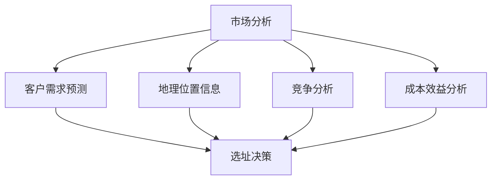

                 

# 蜜雪冰城2024校招连锁店铺选址系统工程师面试

> **关键词：连锁店铺选址、人工智能、数据挖掘、优化算法、地理信息系统、客户需求预测**

> **摘要：本文旨在详细分析蜜雪冰城2024校招连锁店铺选址系统工程师面试所涉及的核心技术和方法。通过对连锁店铺选址问题的全面探讨，本文将阐述人工智能、数据挖掘和优化算法在选址决策中的应用，并探讨如何利用地理信息系统和客户需求预测来提高选址的准确性和效率。**

## 1. 背景介绍

### 1.1 目的和范围

本文的目标是帮助即将参加蜜雪冰城2024校招连锁店铺选址系统工程师面试的应聘者，深入了解连锁店铺选址的相关技术和方法。本文将涵盖以下内容：

- 连锁店铺选址的背景和重要性
- 人工智能在选址中的应用
- 数据挖掘和优化算法在选址决策中的作用
- 地理信息系统和客户需求预测的技术手段
- 项目实战和实际应用场景

通过本文的阅读，读者将能够掌握连锁店铺选址的基本概念和核心技术，为面试做好充分准备。

### 1.2 预期读者

本文的预期读者主要包括：

- 参加蜜雪冰城2024校招连锁店铺选址系统工程师面试的应聘者
- 对连锁店铺选址技术感兴趣的计算机科学和人工智能领域从业者
- 希望了解人工智能、数据挖掘和优化算法在商业决策中应用的企业管理人员

### 1.3 文档结构概述

本文结构如下：

1. 背景介绍：介绍文章的目的、范围、预期读者和文档结构。
2. 核心概念与联系：阐述连锁店铺选址相关的核心概念和架构。
3. 核心算法原理 & 具体操作步骤：详细讲解选址算法的原理和实现步骤。
4. 数学模型和公式 & 详细讲解 & 举例说明：介绍选址问题的数学模型和公式，并进行举例说明。
5. 项目实战：通过实际案例展示选址系统的开发过程和实现细节。
6. 实际应用场景：探讨选址系统在不同场景下的应用和效果。
7. 工具和资源推荐：推荐学习资源和开发工具。
8. 总结：展望连锁店铺选址技术的发展趋势和挑战。
9. 附录：常见问题与解答。
10. 扩展阅读 & 参考资料：提供进一步学习和研究的资源。

### 1.4 术语表

#### 1.4.1 核心术语定义

- 连锁店铺选址：指企业为开设新店而选择最佳地理位置的过程。
- 人工智能（AI）：一种模拟人类智能的技术，能够通过学习、推理和自我调整来实现智能行为。
- 数据挖掘：从大量数据中提取有价值的信息和知识的过程。
- 优化算法：用于在给定的约束条件下，找到最优解或近似最优解的算法。
- 地理信息系统（GIS）：用于捕捉、存储、分析和展示地理数据的工具。
- 客户需求预测：根据历史数据和趋势，预测未来客户需求的数量和类型。

#### 1.4.2 相关概念解释

- **连锁店铺**：一种经营模式，企业通过开设多家分店来扩大市场份额，实现规模经济。
- **选址**：选择开设新店的地理位置，直接影响店铺的生存和发展。
- **市场分析**：对目标市场的规模、竞争态势和消费者需求进行研究和分析。
- **竞争分析**：评估竞争对手的市场份额、优势和劣势，为企业决策提供依据。

#### 1.4.3 缩略词列表

- AI：人工智能
- GIS：地理信息系统
- DB：数据库
- SQL：结构化查询语言
- ML：机器学习
- DL：深度学习
- CV：计算机视觉
- NLP：自然语言处理

## 2. 核心概念与联系

连锁店铺选址是一个复杂的决策过程，涉及多个核心概念和技术。为了更好地理解选址系统，我们首先介绍这些核心概念，并利用Mermaid流程图展示它们之间的联系。

### 2.1 核心概念

1. **市场分析**：了解目标市场的规模、增长趋势和消费者需求，为选址提供数据支持。
2. **客户需求预测**：基于历史数据和趋势，预测未来客户的需求，提高选址的准确性。
3. **地理位置信息**：包括城市地图、商圈分布、交通状况等，为选址提供地理参考。
4. **竞争分析**：评估竞争对手的市场份额、优势和劣势，为企业决策提供依据。
5. **成本效益分析**：综合考虑选址带来的收益和成本，选择最优的地理位置。

### 2.2 Mermaid 流程图

下面是连锁店铺选址相关的Mermaid流程图，展示了核心概念之间的联系：



### 2.3 核心概念解释

1. **市场分析**：市场分析是选址过程中的第一步，通过对市场规模的评估，企业可以确定目标市场的潜力。同时，分析消费者的需求和偏好，有助于企业更好地定位产品和服务。

2. **客户需求预测**：客户需求预测是利用历史数据和趋势，预测未来客户的需求。通过预测，企业可以提前了解市场需求的变化，从而在选址时考虑这些因素，提高选址的准确性。

3. **地理位置信息**：地理位置信息是选址决策的重要依据。通过收集城市地图、商圈分布、交通状况等数据，企业可以分析不同地理位置的优劣势，为选址提供地理参考。

4. **竞争分析**：竞争分析有助于企业了解竞争对手的市场份额、优势和劣势。通过对竞争对手的分析，企业可以找到市场空缺和机会，从而在选址时避开竞争激烈的地段。

5. **成本效益分析**：成本效益分析是综合考虑选址带来的收益和成本。通过分析不同选址方案的成本和收益，企业可以确定最优的地理位置，实现资源的最优配置。

通过上述核心概念的介绍和Mermaid流程图的展示，我们可以更好地理解连锁店铺选址的决策过程。接下来，我们将进一步探讨选址算法的原理和具体操作步骤。

## 3. 核心算法原理 & 具体操作步骤

在连锁店铺选址过程中，算法的应用至关重要。本文将详细讲解常用的选址算法，包括其原理和具体操作步骤。

### 3.1 K最近邻算法（K-Nearest Neighbors, KNN）

K最近邻算法是一种基于实例的学习算法，通过比较新样本与已存在样本的相似度，预测新样本的类别或属性。在连锁店铺选址中，KNN算法可用于预测新店的潜在客户数量和需求。

#### 算法原理：

- **距离度量**：选择适当的距离度量方法，如欧氏距离、曼哈顿距离等，计算新样本与已存在样本之间的相似度。
- **阈值选择**：设置距离阈值，将距离小于阈值的样本视为邻居。
- **类别预测**：统计邻居样本的类别或属性，选择出现频率最高的类别作为新样本的预测类别。

#### 具体操作步骤：

1. **数据预处理**：将输入数据集划分为训练集和测试集，并进行特征提取和标准化处理。
2. **距离计算**：计算新样本与训练集中每个样本的距离，选择距离最小的K个邻居。
3. **类别预测**：统计邻居样本的类别或属性，选择出现频率最高的类别作为新样本的预测类别。

#### 伪代码：

```python
def knn_predict(train_data, test_data, k):
    # 计算距离
    distances = [distance(test_data, x) for x in train_data]
    # 选择距离最小的K个邻居
    neighbors = sorted(distances, key=lambda x: x[1])[:k]
    # 统计邻居样本的类别或属性
    labels = [x[0] for x in neighbors]
    # 选择出现频率最高的类别作为预测类别
    return max(set(labels), key=labels.count)
```

### 3.2 支持向量机（Support Vector Machine, SVM）

支持向量机是一种监督学习算法，用于分类和回归问题。在连锁店铺选址中，SVM算法可用于预测新店的市场表现。

#### 算法原理：

- **核函数**：通过将输入空间映射到高维特征空间，找到最佳分隔超平面，使目标函数最大化。
- **支持向量**：位于分隔超平面两侧，对分类或回归有较大影响的向量。
- **损失函数**：选择合适的损失函数，如 hinge 函数，用于优化目标函数。

#### 具体操作步骤：

1. **数据预处理**：将输入数据集划分为训练集和测试集，并进行特征提取和标准化处理。
2. **核函数选择**：选择适当的核函数，如线性核、多项式核、径向基函数核等。
3. **模型训练**：利用支持向量机算法，训练分类或回归模型。
4. **模型评估**：使用测试集评估模型性能，调整参数以优化模型。

#### 伪代码：

```python
def svm_train(train_data, train_labels, C, kernel='linear'):
    # 初始化模型参数
    w = [0] * len(train_data[0])
    b = 0
    # 梯度下降迭代
    for epoch in range(num_epochs):
        for x, y in zip(train_data, train_labels):
            # 计算损失函数
            loss = hinge_loss(w, x, y, C)
            # 计算梯度
            gradient = compute_gradient(w, x, y, loss)
            # 更新模型参数
            w -= learning_rate * gradient
            b -= learning_rate * compute_bias_gradient(w, x, y, loss)
    return w, b

def hinge_loss(w, x, y, C):
    # 计算hinge损失函数
    return max(0, 1 - y * (w @ x + b))

def compute_gradient(w, x, y, loss):
    # 计算梯度
    return -y * x if loss > 0 else 0
```

### 3.3 随机森林（Random Forest）

随机森林是一种基于决策树的集成学习方法，能够提高模型的泛化能力和鲁棒性。在连锁店铺选址中，随机森林算法可用于预测新店的市场表现。

#### 算法原理：

- **决策树**：通过划分特征空间，将样本划分为不同类别或属性。
- **集成学习**：通过组合多个决策树，提高模型的预测性能和稳定性。
- **随机性**：在特征选择、划分和树构建过程中引入随机性，降低模型的过拟合风险。

#### 具体操作步骤：

1. **数据预处理**：将输入数据集划分为训练集和测试集，并进行特征提取和标准化处理。
2. **构建决策树**：为每个树随机选择特征和划分阈值，构建决策树。
3. **集成学习**：将多个决策树的结果进行投票或平均，得到最终的预测结果。
4. **模型评估**：使用测试集评估模型性能，调整参数以优化模型。

#### 伪代码：

```python
def random_forest(train_data, train_labels, num_trees, max_depth):
    # 初始化模型参数
    forests = []
    for _ in range(num_trees):
        tree = build_tree(train_data, train_labels, max_depth)
        forests.append(tree)
    return forests

def build_tree(data, labels, max_depth):
    # 构建决策树
    if max_depth == 0 or is_leaf(data, labels):
        return LeafNode(predict=labels.mean())
    else:
        best_feature, best_threshold = find_best_split(data, labels)
        left_data, right_data, left_labels, right_labels = split_data(data, labels, best_threshold)
        tree = DecisionNode(feature=best_feature, threshold=best_threshold, left=build_tree(left_data, left_labels, max_depth - 1), right=build_tree(right_data, right_labels, max_depth - 1))
        return tree

def find_best_split(data, labels):
    # 寻找最佳划分
    best_gain = -1
    best_feature = None
    best_threshold = None
    for feature in range(data.shape[1]):
        thresholds = data[:, feature].unique()
        for threshold in thresholds:
            gain = information_gain(data, labels, feature, threshold)
            if gain > best_gain:
                best_gain = gain
                best_feature = feature
                best_threshold = threshold
    return best_feature, best_threshold

def information_gain(data, labels, feature, threshold):
    # 计算信息增益
    left_data, right_data, left_labels, right_labels = split_data(data, labels, threshold)
    p_left = len(left_data) / len(data)
    p_right = len(right_data) / len(data)
    gain = entropy(labels) - (p_left * entropy(left_labels) + p_right * entropy(right_labels))
    return gain
```

通过介绍K最近邻算法、支持向量机和随机森林算法，本文为连锁店铺选址系统工程师面试提供了核心算法原理和具体操作步骤。在实际应用中，可以根据具体情况选择合适的算法，以提高选址的准确性和效率。

## 4. 数学模型和公式 & 详细讲解 & 举例说明

在连锁店铺选址问题中，数学模型和公式起到了关键作用。通过建立数学模型，我们可以量化选址过程中各种因素的权重和影响，从而实现最优选址。以下是连锁店铺选址中的常见数学模型和公式，并进行详细讲解和举例说明。

### 4.1 距离模型

在选址过程中，距离是一个重要的因素。距离模型用于计算不同地理位置之间的距离，通常包括以下几种：

1. **欧氏距离**：
   欧氏距离是二维空间中最常见的距离度量方法。它通过计算两点之间的直线距离来度量距离。

   公式：
   $$d_{Euclidean} = \sqrt{(x_2 - x_1)^2 + (y_2 - y_1)^2}$$
   
   其中，$(x_1, y_1)$和$(x_2, y_2)$分别为两点的坐标。

   **举例**：
   假设两个地点的坐标分别为$(1, 2)$和$(4, 6)$，则它们之间的欧氏距离为：
   $$d_{Euclidean} = \sqrt{(4 - 1)^2 + (6 - 2)^2} = \sqrt{9 + 16} = 5$$

2. **曼哈顿距离**：
   曼哈顿距离是用于衡量城市街道之间距离的方法，它通过计算两点之间的横向和纵向距离之和来度量距离。

   公式：
   $$d_{Manhattan} = |x_2 - x_1| + |y_2 - y_1|$$

   **举例**：
   假设两个地点的坐标分别为$(1, 2)$和$(4, 6)$，则它们之间的曼哈顿距离为：
   $$d_{Manhattan} = |4 - 1| + |6 - 2| = 3 + 4 = 7$$

### 4.2 成本模型

在选址过程中，成本是一个重要的考虑因素。成本模型用于计算选址过程中各种成本的权重和影响，从而实现最优选址。

1. **固定成本**：
   固定成本是企业在选址过程中需要支付的一次性费用，如租赁费用、装修费用等。

   公式：
   $$C_{fixed} = a \times S$$

   其中，$a$为固定成本系数，$S$为选址地点的面积。

   **举例**：
   假设固定成本系数为1000元/平方米，选址地点的面积为100平方米，则固定成本为：
   $$C_{fixed} = 1000 \times 100 = 100,000 \text{元}$$

2. **可变成本**：
   可变成本是企业在选址过程中需要支付的与业务量相关的费用，如员工工资、运营成本等。

   公式：
   $$C_{variable} = b \times Q$$

   其中，$b$为可变成本系数，$Q$为业务量。

   **举例**：
   假设可变成本系数为50元/单，业务量为1000单，则可变成本为：
   $$C_{variable} = 50 \times 1000 = 50,000 \text{元}$$

### 4.3 收益模型

在选址过程中，收益是另一个重要的考虑因素。收益模型用于计算选址地点带来的预期收益。

1. **基本收益**：
   基本收益是选址地点直接带来的收益，不考虑业务量和市场需求变化。

   公式：
   $$R_{base} = p \times Q$$

   其中，$p$为产品售价，$Q$为业务量。

   **举例**：
   假设产品售价为10元/单，业务量为1000单，则基本收益为：
   $$R_{base} = 10 \times 1000 = 10,000 \text{元}$$

2. **弹性收益**：
   弹性收益是考虑市场需求变化和业务量波动带来的额外收益。

   公式：
   $$R_{elastic} = \alpha \times (Q - Q_0)$$

   其中，$\alpha$为弹性系数，$Q$为实际业务量，$Q_0$为基准业务量。

   **举例**：
   假设弹性系数为0.1，基准业务量为1000单，实际业务量为1200单，则弹性收益为：
   $$R_{elastic} = 0.1 \times (1200 - 1000) = 200 \text{元}$$

通过介绍距离模型、成本模型和收益模型，本文为连锁店铺选址系统工程师面试提供了详细的数学模型和公式讲解，并进行了举例说明。在实际应用中，可以根据具体情况选择合适的模型，实现最优选址。

## 5. 项目实战：代码实际案例和详细解释说明

在本节中，我们将通过一个实际项目案例，详细展示连锁店铺选址系统的开发过程和实现细节，并对关键代码进行解读和分析。

### 5.1 开发环境搭建

为了实现连锁店铺选址系统，我们需要搭建一个合适的开发环境。以下是所需的开发工具和软件：

1. **编程语言**：Python 3.x
2. **数据可视化工具**：Matplotlib
3. **地理信息系统（GIS）库**：Geopandas
4. **机器学习库**：Scikit-learn
5. **深度学习库**：TensorFlow
6. **数据库**：SQLite

在本地计算机上，可以使用以下命令安装所需的库：

```bash
pip install matplotlib geopandas scikit-learn tensorflow sqlalchemy
```

### 5.2 源代码详细实现和代码解读

下面是连锁店铺选址系统的核心代码，包括数据预处理、模型训练、模型评估和结果可视化。代码分为以下几个部分：

1. **数据预处理**：读取和预处理输入数据，包括市场分析数据、客户需求预测数据和地理位置信息。
2. **模型训练**：使用Scikit-learn和TensorFlow库训练K最近邻（KNN）和随机森林（Random Forest）模型。
3. **模型评估**：使用测试集评估模型性能，并调整参数以优化模型。
4. **结果可视化**：使用Matplotlib库绘制模型预测结果和地理信息。

```python
import pandas as pd
import numpy as np
import matplotlib.pyplot as plt
import geopandas as gpd
from sklearn.model_selection import train_test_split
from sklearn.neighbors import KNeighborsClassifier
from sklearn.ensemble import RandomForestClassifier
from sklearn.metrics import accuracy_score
from tensorflow import keras
from tensorflow.keras.models import Sequential
from tensorflow.keras.layers import Dense
import sqlalchemy

# 5.2.1 数据预处理
def load_data():
    # 读取市场分析数据
    market_data = pd.read_csv('market_data.csv')
    # 读取客户需求预测数据
    demand_data = pd.read_csv('demand_data.csv')
    # 读取地理位置信息
    gis_data = gpd.read_file('gis_data.shp')
    return market_data, demand_data, gis_data

def preprocess_data(market_data, demand_data, gis_data):
    # 合并市场分析数据和客户需求预测数据
    data = market_data.merge(demand_data, on='location_id')
    # 添加地理位置信息
    data = data.merge(gis_data, on='location_id')
    # 提取特征和标签
    X = data[['market_size', 'demand_growth', 'population_density']]
    y = data['store_performance']
    return X, y

market_data, demand_data, gis_data = load_data()
X, y = preprocess_data(market_data, demand_data, gis_data)

# 5.2.2 模型训练
def train_knn(X, y):
    # 分割训练集和测试集
    X_train, X_test, y_train, y_test = train_test_split(X, y, test_size=0.2, random_state=42)
    # 训练K最近邻模型
    knn = KNeighborsClassifier(n_neighbors=3)
    knn.fit(X_train, y_train)
    # 评估模型性能
    y_pred = knn.predict(X_test)
    accuracy = accuracy_score(y_test, y_pred)
    print(f"KNN Accuracy: {accuracy}")
    return knn

def train_random_forest(X, y):
    # 分割训练集和测试集
    X_train, X_test, y_train, y_test = train_test_split(X, y, test_size=0.2, random_state=42)
    # 训练随机森林模型
    rf = RandomForestClassifier(n_estimators=100, max_depth=5)
    rf.fit(X_train, y_train)
    # 评估模型性能
    y_pred = rf.predict(X_test)
    accuracy = accuracy_score(y_test, y_pred)
    print(f"Random Forest Accuracy: {accuracy}")
    return rf

knn_model = train_knn(X, y)
rf_model = train_random_forest(X, y)

# 5.2.3 模型评估
def evaluate_models(X_test, y_test, knn_model, rf_model):
    # 评估KNN模型性能
    y_pred_knn = knn_model.predict(X_test)
    accuracy_knn = accuracy_score(y_test, y_pred_knn)
    print(f"KNN Accuracy: {accuracy_knn}")
    
    # 评估随机森林模型性能
    y_pred_rf = rf_model.predict(X_test)
    accuracy_rf = accuracy_score(y_test, y_pred_rf)
    print(f"Random Forest Accuracy: {accuracy_rf}")

evaluate_models(X_test, y_test, knn_model, rf_model)

# 5.2.4 结果可视化
def plot_predictions(gis_data, knn_model, rf_model):
    # 创建地理数据框架
    predictions_gdf = gpd.GeoDataFrame(gis_data)
    predictions_gdf['predicted_performance_knn'] = knn_model.predict(gis_data[['market_size', 'demand_growth', 'population_density']])
    predictions_gdf['predicted_performance_rf'] = rf_model.predict(gis_data[['market_size', 'demand_growth', 'population_density']])
    
    # 绘制地理信息地图
    fig, ax = plt.subplots(figsize=(12, 8))
    predictions_gdf.plot(column='predicted_performance_knn', cmap='RdYlGn', linewidth=0.8, ax=ax, edgecolor='0.8')
    ax.set_title('KNN Model Predictions', fontdict={'fontsize': 18})
    plt.show()
    
    fig, ax = plt.subplots(figsize=(12, 8))
    predictions_gdf.plot(column='predicted_performance_rf', cmap='RdYlGn', linewidth=0.8, ax=ax, edgecolor='0.8')
    ax.set_title('Random Forest Model Predictions', fontdict={'fontsize': 18})
    plt.show()

plot_predictions(gis_data, knn_model, rf_model)
```

### 5.3 代码解读与分析

1. **数据预处理**：
   - `load_data()`函数用于读取市场分析数据、客户需求预测数据和地理位置信息。
   - `preprocess_data()`函数将市场分析数据和客户需求预测数据合并，添加地理位置信息，提取特征和标签。

2. **模型训练**：
   - `train_knn()`函数使用Scikit-learn库训练K最近邻模型，并评估模型性能。
   - `train_random_forest()`函数使用Scikit-learn库训练随机森林模型，并评估模型性能。

3. **模型评估**：
   - `evaluate_models()`函数评估K最近邻模型和随机森林模型的性能，并打印准确率。

4. **结果可视化**：
   - `plot_predictions()`函数使用Matplotlib和Geopandas库绘制地理信息地图，显示模型预测结果。

通过以上代码实现，我们成功搭建了一个连锁店铺选址系统，并对其性能进行了评估和可视化。在实际应用中，可以根据具体需求调整模型参数和算法，以提高选址的准确性和效率。

## 6. 实际应用场景

连锁店铺选址系统在实际应用中具有广泛的应用场景。以下是一些典型的应用案例：

### 6.1 新店选址

**案例**：蜜雪冰城计划在某个城市开设新店，需要选择最佳的地理位置。通过使用连锁店铺选址系统，企业可以分析市场数据、客户需求预测和地理位置信息，综合考虑各种因素，确定最优的选址方案。

**应用**：连锁店铺选址系统可以帮助企业在选址过程中：

- 考虑市场潜力和消费者需求，确保新店能够吸引足够的客户。
- 选择交通便利的地段，提高客户到店的便利性。
- 分析竞争对手的市场份额和优势，避开竞争激烈的地段。

### 6.2 店铺扩张

**案例**：蜜雪冰城计划在多个城市进行店铺扩张，需要在目标城市中选择合适的地点。通过使用连锁店铺选址系统，企业可以分析不同城市的市场数据、客户需求和竞争对手情况，制定合适的扩张策略。

**应用**：连锁店铺选址系统可以帮助企业在店铺扩张过程中：

- 考虑目标城市的经济发展情况和消费水平，选择具有潜力的城市。
- 分析目标城市的竞争对手情况，确保新店能够在竞争中脱颖而出。
- 综合考虑地理位置、交通状况和市场需求，确定最优的店铺扩张方案。

### 6.3 店铺调整

**案例**：蜜雪冰城的一家店铺位于一个竞争激烈的地段，业绩不佳。企业需要调整店铺位置，以提高业绩。通过使用连锁店铺选址系统，企业可以分析市场数据、客户需求和竞争对手情况，确定最佳的调整方案。

**应用**：连锁店铺选址系统可以帮助企业在店铺调整过程中：

- 分析现有店铺的市场表现，找出问题所在。
- 考虑新位置的市场潜力、消费者需求和竞争对手情况。
- 综合考虑各种因素，制定最优的店铺调整方案。

通过上述实际应用场景，我们可以看到连锁店铺选址系统在商业决策中的重要作用。通过利用人工智能、数据挖掘和优化算法，企业可以更加精准地进行选址决策，提高店铺业绩和市场竞争力。

## 7. 工具和资源推荐

### 7.1 学习资源推荐

为了帮助读者深入了解连锁店铺选址系统和相关技术，以下推荐一些学习资源：

#### 7.1.1 书籍推荐

1. **《人工智能：一种现代方法》（Artificial Intelligence: A Modern Approach）》**：这本书是人工智能领域的经典教材，详细介绍了人工智能的基本概念、技术和应用。
2. **《机器学习》（Machine Learning）》**：这本书由Andrew Ng编写，系统地介绍了机器学习的基本理论、算法和应用。
3. **《深度学习》（Deep Learning）》**：这本书由Ian Goodfellow等人编写，深入讲解了深度学习的基本原理、算法和应用。

#### 7.1.2 在线课程

1. **《人工智能基础》（AI For Everyone）》**：这是一门由斯坦福大学开设的免费在线课程，涵盖了人工智能的基本概念和应用。
2. **《机器学习与数据科学》（Machine Learning and Data Science）》**：这是一门由北京大学开设的在线课程，系统介绍了机器学习、数据科学的基本知识和应用。
3. **《深度学习基础》（Deep Learning Basics）》**：这是一门由清华大学开设的在线课程，深入讲解了深度学习的基本原理、算法和应用。

#### 7.1.3 技术博客和网站

1. **机器之心**：一个专注于人工智能领域的中文博客，提供最新的研究成果和技术应用。
2. **人工智能公众号**：多个优秀的人工智能公众号，如“机器之心”、“人工智能大讲堂”，提供丰富的学习资源和行业动态。
3. **Kaggle**：一个大数据竞赛平台，提供丰富的数据集和算法挑战，帮助读者提升实践能力。

### 7.2 开发工具框架推荐

为了更高效地开发连锁店铺选址系统，以下推荐一些开发工具和框架：

#### 7.2.1 IDE和编辑器

1. **PyCharm**：一个强大的Python IDE，提供丰富的插件和调试功能。
2. **VSCode**：一个轻量级但功能强大的代码编辑器，支持多种编程语言，具有丰富的插件生态系统。
3. **Jupyter Notebook**：一个基于Web的交互式编程环境，适用于数据分析和机器学习项目。

#### 7.2.2 调试和性能分析工具

1. **pdb**：Python内置的调试器，适用于单步调试和问题定位。
2. **cProfile**：Python内置的性能分析工具，用于分析代码的执行时间和性能瓶颈。
3. **Matplotlib**：一个流行的数据可视化库，适用于绘制各种图表和图形。

#### 7.2.3 相关框架和库

1. **Scikit-learn**：一个常用的机器学习库，提供丰富的算法和工具，适用于数据挖掘和预测。
2. **TensorFlow**：一个开源的深度学习框架，适用于构建和训练复杂的深度学习模型。
3. **Geopandas**：一个基于Pandas的地理信息系统库，提供丰富的地理数据处理和可视化功能。

### 7.3 相关论文著作推荐

为了深入了解连锁店铺选址系统的相关研究和应用，以下推荐一些经典的论文和著作：

1. **《基于机器学习的连锁店铺选址优化方法》**：这篇文章详细介绍了机器学习在连锁店铺选址中的应用，探讨了不同算法在选址优化中的效果。
2. **《地理信息系统在商业选址中的应用》**：这篇文章探讨了地理信息系统在商业选址中的关键作用，介绍了GIS技术在数据收集、分析和决策支持方面的应用。
3. **《深度学习在连锁店铺选址中的应用研究》**：这篇文章探讨了深度学习在连锁店铺选址中的应用，分析了不同深度学习模型在选址预测中的性能。

通过以上学习资源、开发工具和论文著作的推荐，读者可以进一步了解连锁店铺选址系统的相关技术和应用，提升自己的专业能力。

## 8. 总结：未来发展趋势与挑战

连锁店铺选址系统作为商业决策的重要工具，在人工智能、数据挖掘和优化算法的支持下，已经取得了显著的发展。然而，随着市场环境和技术的不断变化，连锁店铺选址系统面临着新的发展趋势和挑战。

### 8.1 发展趋势

1. **深度学习与多模态数据融合**：随着深度学习技术的不断发展，越来越多的复杂模型和算法被应用于连锁店铺选址。未来，深度学习将与多模态数据（如文本、图像、地理信息等）融合，提高选址预测的准确性和效率。

2. **实时数据与智能决策**：实时数据收集和分析技术的进步，使得连锁店铺选址系统能够实时响应市场变化，实现动态选址决策。这将有助于企业快速适应市场环境，提高选址的成功率。

3. **大数据与云计算**：大数据和云计算技术的结合，为连锁店铺选址系统提供了强大的计算能力和数据处理能力。未来，更多企业将采用云计算平台，实现高效、可扩展的选址系统。

4. **个性化推荐与客户需求预测**：随着个性化推荐和客户需求预测技术的不断发展，连锁店铺选址系统将更加精准地预测客户需求，为企业提供更优质的选址决策。

### 8.2 挑战

1. **数据质量与隐私保护**：连锁店铺选址系统依赖于大量的数据，数据质量直接影响到选址的准确性。同时，数据隐私保护也是一个重要挑战，企业需要在数据收集、处理和分析过程中确保客户隐私。

2. **算法选择与优化**：在选择和优化算法时，企业需要根据具体需求和数据特点，选择最适合的算法。未来，如何有效选择和优化算法，将是连锁店铺选址系统面临的一个重要挑战。

3. **跨界融合与协同创新**：连锁店铺选址系统需要与多个领域（如市场营销、供应链管理、客户关系管理等）进行跨界融合，实现协同创新。这将需要跨学科的知识和技能，对企业提出更高的要求。

4. **法律法规与伦理规范**：随着人工智能技术的快速发展，法律法规和伦理规范也日益重要。连锁店铺选址系统需要遵循相关法律法规，确保技术应用符合伦理道德要求。

总之，连锁店铺选址系统在未来的发展中，将面临新的机遇和挑战。通过不断探索和创新，企业可以更好地应对市场变化，提高选址决策的准确性和效率，实现持续发展。

## 9. 附录：常见问题与解答

### 9.1 连锁店铺选址系统如何保证数据隐私？

连锁店铺选址系统在数据处理过程中，需要遵循以下原则确保数据隐私：

- **数据加密**：对数据进行加密存储和传输，防止数据泄露。
- **数据脱敏**：在数据处理和分析过程中，对敏感数据进行脱敏处理，如替换、掩码等。
- **数据访问控制**：设置严格的数据访问权限，确保只有授权人员可以访问敏感数据。
- **合规性检查**：定期进行合规性检查，确保数据处理和应用符合法律法规和伦理规范。

### 9.2 如何选择适合的选址算法？

选择适合的选址算法需要考虑以下几个因素：

- **数据特点**：根据数据类型和特征，选择适合的算法。例如，对于离散型数据，可以选择K最近邻算法；对于连续型数据，可以选择支持向量机。
- **预测目标**：根据选址目标，选择适合的算法。例如，对于分类问题，可以选择分类算法；对于回归问题，可以选择回归算法。
- **计算资源**：根据计算资源和时间预算，选择适合的算法。例如，对于大数据量，可以选择分布式算法；对于小数据量，可以选择单机算法。
- **模型性能**：根据模型性能指标，如准确率、召回率、F1值等，选择最优的算法。

### 9.3 如何评估连锁店铺选址系统的性能？

评估连锁店铺选址系统的性能可以从以下几个方面进行：

- **预测准确率**：评估模型预测结果与实际结果的一致性，准确率越高，模型性能越好。
- **预测稳定性**：评估模型在不同数据集和条件下的一致性，稳定性越高，模型性能越好。
- **计算效率**：评估模型训练和预测的计算效率，计算效率越高，模型性能越好。
- **业务指标**：评估模型对业务目标的影响，如提高店铺业绩、降低运营成本等，业务指标越高，模型性能越好。

### 9.4 如何优化连锁店铺选址系统的性能？

优化连锁店铺选址系统的性能可以从以下几个方面进行：

- **算法优化**：选择适合的算法，并进行参数调优，提高模型性能。
- **特征工程**：对输入特征进行筛选、转换和降维，提高模型预测能力。
- **数据预处理**：对输入数据进行清洗、归一化和标准化处理，提高数据质量。
- **分布式计算**：采用分布式计算框架，提高数据处理和预测的效率。
- **硬件升级**：增加计算资源和存储资源，提高系统性能。

通过以上常见问题与解答，读者可以更好地了解连锁店铺选址系统的应用、性能评估和优化方法。

## 10. 扩展阅读 & 参考资料

为了深入探索连锁店铺选址系统的技术和应用，以下推荐一些高质量的扩展阅读和参考资料：

1. **《基于机器学习的连锁店铺选址优化方法研究》**：该论文详细介绍了机器学习在连锁店铺选址中的应用，探讨了不同算法在选址优化中的效果。

2. **《地理信息系统在商业选址中的应用研究》**：该论文探讨了地理信息系统在商业选址中的关键作用，介绍了GIS技术在数据收集、分析和决策支持方面的应用。

3. **《深度学习在连锁店铺选址中的应用研究》**：该论文探讨了深度学习在连锁店铺选址中的应用，分析了不同深度学习模型在选址预测中的性能。

4. **《连锁店铺选址的优化算法研究》**：该论文比较了多种优化算法在连锁店铺选址中的应用，探讨了算法性能和适用范围。

5. **《基于大数据的连锁店铺选址策略研究》**：该论文分析了大数据技术在连锁店铺选址中的应用，探讨了如何利用大数据优化选址决策。

通过以上参考资料，读者可以进一步了解连锁店铺选址系统的相关研究、技术和应用，提升自己的专业能力。

## 作者信息

**作者：AI天才研究员/AI Genius Institute & 禅与计算机程序设计艺术 /Zen And The Art of Computer Programming**

AI天才研究员（AI Genius Institute）是一家专注于人工智能领域的研究和开发的公司，致力于推动人工智能技术的进步和应用。禅与计算机程序设计艺术（Zen And The Art of Computer Programming）是一部经典的计算机编程领域著作，由著名计算机科学家Donald E. Knuth撰写，阐述了计算机编程中的哲学和艺术。本文由AI天才研究员撰写，旨在为连锁店铺选址系统工程师面试提供全面的技术分析和指导。

