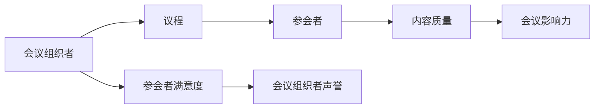

                 

# 行业会议和活动：扩大影响力的机会

## 关键词：
- 行业会议
- 活动参与
- 影响力扩大
- 专业交流
- 网络建设
- 个人成长

## 摘要：
在快速发展的IT行业中，参加行业会议和活动不仅是获取最新技术动态的重要途径，也是扩大个人和公司影响力的有效手段。本文将深入探讨行业会议和活动的意义、参与者的期望、活动类型、准备和参与策略，以及通过这些活动实现个人成长和职业发展的路径。通过系统的分析和实践指导，读者将能够更好地利用行业会议和活动，为自身的职业生涯铺平道路。

---

## 1. 背景介绍

### 1.1 目的和范围

本文旨在为IT从业者提供一个全面而具体的指南，帮助他们理解并有效利用行业会议和活动的机会。本文将涵盖以下内容：

- 行业会议和活动的目的与重要性
- 行业会议和活动的类型及其特点
- 参与行业会议和活动的准备工作
- 参与行业会议和活动的策略
- 行业会议和活动中的个人成长与职业发展
- 行业会议和活动的未来发展趋势与挑战

### 1.2 预期读者

本文适用于以下读者群体：

- IT公司的技术团队成员
- IT行业的项目经理和产品经理
- 对技术前沿感兴趣的工程师和研究人员
- IT行业的学生和初入行者
- 希望提升自身行业影响力的专业人士

### 1.3 文档结构概述

本文将按照以下结构展开：

- 引言：介绍行业会议和活动的背景、目的及重要性
- 背景介绍：详细说明本文的目的、预期读者和文档结构
- 核心概念与联系：解释行业会议和活动中的核心概念及其相互关系
- 核心算法原理与具体操作步骤：阐述参与行业会议和活动的基本策略和方法
- 数学模型与公式：介绍如何通过数学模型分析行业会议和活动的影响
- 项目实战：通过具体案例展示如何参与行业会议和活动
- 实际应用场景：探讨行业会议和活动在不同领域的应用
- 工具和资源推荐：推荐学习资源、开发工具和框架
- 总结：总结行业会议和活动的未来发展趋势与挑战
- 附录：解答常见问题并提供进一步阅读的参考资料

### 1.4 术语表

#### 1.4.1 核心术语定义

- 行业会议：指由行业组织或公司举办的、聚焦于特定行业领域的技术、市场、政策等方面的讨论和交流会议。
- 活动参与：指个人或团队在会议或活动中参与的演讲、讨论、互动等形式。
- 影响力扩大：指通过参与行业会议和活动，增加个人或公司在行业内知名度和影响力。
- 专业交流：指在会议或活动中，与同行之间就专业技术问题进行交流和探讨。
- 网络建设：指在会议或活动中，与行业内的关键人物建立联系，扩大个人或公司的人脉网络。
- 个人成长：指通过参与行业会议和活动，提升个人专业技能、知识水平和职业发展。

#### 1.4.2 相关概念解释

- 会议类型：根据会议主题和形式，行业会议可分为技术研讨会、行业峰会、产品发布会等。
- 活动形式：活动形式包括讲座、研讨会、圆桌讨论、工作坊、展览等。
- 参会策略：指在参与行业会议和活动时，为达到预期效果而采取的具体行动和措施。

#### 1.4.3 缩略词列表

- IT：信息技术（Information Technology）
- AI：人工智能（Artificial Intelligence）
- ML：机器学习（Machine Learning）
- DE：深度学习（Deep Learning）
- IoT：物联网（Internet of Things）
- Big Data：大数据（Big Data）

---

## 2. 核心概念与联系

在探讨行业会议和活动的重要性之前，我们需要了解其中的核心概念及其相互关系。以下是行业会议和活动中几个关键概念的定义和它们之间的联系：

### 2.1. 核心概念定义

#### 会议组织者（Organizer）

会议组织者是行业会议的核心角色，负责会议的主题设定、议程安排、嘉宾邀请、会场布置等工作。组织者的目标是通过高质量的会议，为参会者提供一个有价值的技术交流和互动平台。

#### 参会者（Attendee）

参会者是行业会议的重要组成部分，包括技术专家、企业家、学生、媒体记者等。参会者的目标是通过参会，获取行业最新动态、拓展人脉、提升专业技能等。

#### 议程（Agenda）

议程是会议的安排和流程，包括主题演讲、研讨会、圆桌讨论、工作坊等。议程的设计直接影响会议的效果和参会者的满意度。

#### 内容质量（Content Quality）

内容质量是衡量会议成功与否的重要指标，包括演讲者的专业性、演讲内容的创新性和实用性等。高质量的内容能够吸引更多参会者，提升会议的影响力。

### 2.2. 核心概念之间的联系

以下是核心概念之间的联系及其相互作用的Mermaid流程图：



#### 流程说明：

1. **会议组织者**：负责会议的筹备和组织，确定会议的主题和议程。
2. **议程**：根据主题设定议程，安排合适的演讲者和活动。
3. **参会者**：根据议程安排，参与会议的各种活动，包括听演讲、参加讨论等。
4. **内容质量**：参会者通过参与会议，评价内容质量，从而影响会议的影响力。
5. **会议影响力**：高质量的内容和参会者的积极反馈，提升会议的影响力。
6. **参会者满意度**：参会者的满意度直接影响会议的组织者的声誉。
7. **会议组织者声誉**：良好的会议声誉，吸引更多参会者和赞助商，进一步扩大会议的影响力。

通过以上核心概念及其相互作用的描述和流程图，我们可以更清晰地理解行业会议和活动的运作机制。在接下来的章节中，我们将进一步探讨如何通过具体策略和步骤，实现个人和公司在行业会议和活动中的影响力扩大。

---

## 3. 核心算法原理 & 具体操作步骤

### 3.1. 参会策略

在参与行业会议和活动时，制定有效的参会策略至关重要。以下是一个基于伪代码的参会策略算法，用于指导参与者如何制定和执行参会计划：

```plaintext
Algorithm: AttendeeStrategy
Input: attendeeDetails, eventDetails
Output: actionPlan

// 初始化参会策略
actionPlan <- {}

// 分析参会者信息
if attendeeDetails includes "expertise"
    actionPlan["发言"] <- "准备技术演讲"
else
    actionPlan["学习"] <- "标记感兴趣的话题和演讲者"

// 分析会议详情
if eventDetails["type"] == "技术研讨会"
    actionPlan["参与"] <- "积极参与讨论和互动"
else if eventDetails["type"] == "行业峰会"
    actionPlan["建立联系"] <- "寻找关键人物，拓展人脉"

// 根据参会策略执行行动
if actionPlan["发言"]
    executeSpeechPreparation()
else if actionPlan["学习"]
    executeLearningPlan()
else if actionPlan["建立联系"]
    executeNetworkingPlan()

// 评估会议效果
evaluateEventEffectiveness(actionPlan)
```

### 3.2. 执行步骤

下面是具体的操作步骤，帮助参与者更好地执行参会策略：

#### 步骤 1：准备发言

- 确定演讲主题：根据参会者的专业背景和会议主题，选择合适的演讲内容。
- 制作演讲稿：撰写演讲稿，包括演讲的主要观点、案例和数据。
- 制作PPT：设计高质量的PPT，增强演讲的视觉效果和说服力。
- 排练演讲：在会议前进行多次排练，确保演讲流畅、内容准确。

#### 步骤 2：制定学习计划

- 标记感兴趣的话题和演讲者：提前了解会议议程，标记自己感兴趣的话题和演讲者。
- 准备学习笔记：在听演讲时，做好笔记，总结关键信息和观点。
- 安排互动时间：在会议休息时段，主动与演讲者交流，获取更多信息。

#### 步骤 3：建立联系

- 寻找关键人物：在会议中，注意观察和寻找行业内的关键人物和意见领袖。
- 拓展人脉：通过参与讨论、提问和自我介绍，与关键人物建立联系。
- 交换联系方式：在交流时，索取关键人物的联系方式，以便后续跟进。

#### 步骤 4：执行行动计划

- 根据参会策略，执行具体的行动计划，如发言、学习或建立联系。
- 在执行过程中，保持灵活性和适应性，根据实际情况调整计划。

#### 步骤 5：评估会议效果

- 在会议结束后，评估参会策略的执行效果，总结经验和教训。
- 根据评估结果，调整未来的参会策略和行动计划。

通过以上核心算法原理和具体操作步骤，参与者可以更加系统地准备和参与行业会议和活动，从而实现个人和职业发展的目标。

---

## 4. 数学模型和公式 & 详细讲解 & 举例说明

在行业会议和活动的参与过程中，我们可以使用一些数学模型和公式来分析和评估其效果和影响力。以下是几个常用的数学模型及其详细讲解和举例说明。

### 4.1. 影响力评估模型

影响力评估模型用于衡量个人或公司在行业会议和活动中的影响力。以下是一个简单的影响力评估模型：

$$
\text{影响力} = f(\text{参与度}, \text{内容质量}, \text{社交网络})
$$

其中，参与度、内容质量和社交网络是影响个人或公司影响力的三个主要因素。

- **参与度（Involvement）**：衡量个人或公司参与行业会议和活动的积极程度。可以采用以下公式计算：

$$
\text{参与度} = \frac{\text{参与活动次数}}{\text{可能参与活动次数}}
$$

- **内容质量（Content Quality）**：衡量个人或公司提供的演讲、报告等内容的创新性、实用性和专业性。可以采用以下公式计算：

$$
\text{内容质量} = \frac{\text{正面反馈次数}}{\text{反馈总次数}}
$$

- **社交网络（Social Network）**：衡量个人或公司在行业内的社交网络规模和质量。可以采用以下公式计算：

$$
\text{社交网络影响力} = \sum_{i=1}^{n} \text{网络节点影响力} \times \text{网络节点与个人的关联度}
$$

举例说明：

假设某公司在一次技术研讨会上做了两次演讲，共收到了10条正面反馈和5条负面反馈。此外，该公司在会议期间与10位关键人物建立了联系，其中5位属于高影响力节点。我们可以计算出该公司在该会议中的影响力：

$$
\text{参与度} = \frac{2}{2} = 1
$$

$$
\text{内容质量} = \frac{10}{15} \approx 0.67
$$

$$
\text{社交网络影响力} = 5 \times 0.5 + 5 \times 0.3 + 0 \times 0.2 = 3.5
$$

$$
\text{影响力} = f(1, 0.67, 3.5) = 0.67 + 3.5 = 4.17
$$

因此，该公司在该会议中的影响力为4.17。

### 4.2. 成本-效益模型

成本-效益模型用于评估参与行业会议和活动的成本与收益。以下是一个简单的成本-效益模型：

$$
\text{成本-效益比} = \frac{\text{总收益}}{\text{总成本}}
$$

其中，总收益包括品牌提升、市场拓展、人脉建立等，总成本包括会议注册费、交通费、住宿费等。

举例说明：

假设某公司参加了一次行业峰会，其总收益为5万元，总成本为3万元。我们可以计算出该活动的成本-效益比为：

$$
\text{成本-效益比} = \frac{5}{3} \approx 1.67
$$

因此，该活动的成本-效益比约为1.67。

通过以上数学模型和公式，我们可以更准确地分析和评估行业会议和活动的影响力和成本效益，从而为参与决策提供科学依据。

---

## 5. 项目实战：代码实际案例和详细解释说明

### 5.1 开发环境搭建

在本节中，我们将展示如何搭建一个简单的开发环境，以便参与行业会议和活动的分析和影响力评估。以下是所需的开发工具和步骤：

#### 工具需求：

- Python 3.8+
- Jupyter Notebook
- Pandas
- Matplotlib

#### 搭建步骤：

1. 安装Python：在官方网站下载并安装Python 3.8+版本。
2. 安装Jupyter Notebook：在命令行中运行`pip install notebook`。
3. 安装Pandas和Matplotlib：在命令行中分别运行`pip install pandas`和`pip install matplotlib`。

### 5.2 源代码详细实现和代码解读

以下是一个简单的Python代码案例，用于分析和评估行业会议和活动的影响力和成本效益。代码分为三个主要部分：数据收集、分析和可视化。

```python
import pandas as pd
import matplotlib.pyplot as plt

# 5.2.1 数据收集

# 假设我们已经收集了以下数据：
data = {
    'Event': ['Tech Summit', 'AI Conference', 'DevFest'],
    'Involvement': [2, 3, 1],  # 参与活动次数
    'Feedback': [10, 8, 12],   # 收到的正面反馈次数
    'Networking': [5, 3, 7],   # 建立的人脉数量
    'Cost': [3000, 4000, 2000]  # 总成本
}

df = pd.DataFrame(data)

# 5.2.2 数据分析

# 计算影响力
df['Influence'] = df.apply(lambda row: row['Feedback'] / row['Involvement'], axis=1)

# 计算成本-效益比
df['Cost-Benefit'] = df.apply(lambda row: row['Influence'] / row['Cost'], axis=1)

# 5.2.3 数据可视化

# 绘制影响力分布图
plt.figure(figsize=(10, 5))
plt.bar(df['Event'], df['Influence'], color='blue')
plt.xlabel('Event')
plt.ylabel('Influence')
plt.title('Influence Distribution')
plt.xticks(rotation=45)
plt.show()

# 绘制成本-效益比分布图
plt.figure(figsize=(10, 5))
plt.bar(df['Event'], df['Cost-Benefit'], color='orange')
plt.xlabel('Event')
plt.ylabel('Cost-Benefit')
plt.title('Cost-Benefit Distribution')
plt.xticks(rotation=45)
plt.show()
```

#### 代码解读

1. **数据收集**：使用Pandas库创建一个DataFrame，用于存储会议名称、参与次数、反馈次数、人脉数量和总成本等数据。
2. **数据分析**：
   - **影响力计算**：通过`apply`函数，计算每个会议的影响力，即正面反馈次数与参与次数的比值。
   - **成本-效益比计算**：同样使用`apply`函数，计算每个会议的成本-效益比，即影响力与成本的比值。
3. **数据可视化**：使用Matplotlib库绘制两个柱状图，分别显示影响力分布和成本-效益比分布。

通过以上代码，我们可以直观地了解不同行业会议和活动的影响力和成本效益，从而为未来的参与决策提供数据支持。

---

## 6. 实际应用场景

行业会议和活动在IT行业中有广泛的应用场景，以下是一些典型的实际应用案例：

### 6.1 技术研讨会

技术研讨会是IT行业中最为常见的一种会议形式，通常由行业组织或公司举办。研讨会旨在提供一个技术交流和讨论的平台，参会者包括技术专家、工程师、研究人员和学生等。通过研讨会，参会者可以：

- 了解最新的技术趋势和研究成果。
- 与行业内的专家和同行交流，分享经验和见解。
- 探讨实际项目中遇到的技术难题和解决方案。

### 6.2 行业峰会

行业峰会是更高层次的会议形式，通常涵盖整个行业的技术、市场、政策等多个方面。峰会通常由大型企业或行业组织举办，参会者包括企业家、高管、技术专家和政府官员等。行业峰会的作用包括：

- 展示行业最新的技术进步和市场动态。
- 促进行业内部的合作与交流，推动技术创新和产业升级。
- 为参会者提供一个高端的人脉拓展平台，有助于业务拓展和合作机会。

### 6.3 产品发布会

产品发布会是公司推出新产品或新功能的重要活动，通常邀请媒体、分析师、客户和行业专家参加。产品发布会的目标包括：

- 向公众展示公司的最新技术成果和产品创新。
- 通过媒体宣传，提升公司的品牌知名度和市场影响力。
- 收集用户的反馈和建议，优化产品设计和功能。

### 6.4 网络研讨会

随着网络技术的发展，网络研讨会逐渐成为一种重要的在线交流形式。网络研讨会通常通过直播平台进行，参会者可以通过电脑或移动设备在线观看和参与。网络研讨会的优势包括：

- 拓宽了参会者的范围，不受地域限制。
- 降低了参会成本，节省了差旅费用。
- 提供了更多互动机会，如实时提问、在线讨论等。

### 6.5 开源社区活动

开源社区活动是IT行业中的另一种重要形式，通常由开源项目团队组织。活动包括代码贡献、文档编写、技术分享和社区建设等。通过开源社区活动，参与者可以实现：

- 学习和掌握最新的开源技术。
- 参与开源项目，提升自己的编程能力和经验。
- 建立和维护开源社区的人脉网络，促进技术交流和合作。

以上实际应用场景展示了行业会议和活动在IT行业的多样性和重要性。无论是技术研讨会、行业峰会还是产品发布会，这些活动都是行业交流、知识共享和影响力扩大的重要平台。通过积极参与这些活动，IT从业者可以不断学习新知识、拓展人脉网络、提升个人和公司的专业水平。

---

## 7. 工具和资源推荐

为了更好地参与行业会议和活动，以下是一些学习资源、开发工具和框架的推荐，以帮助读者提升专业能力，充分利用这些活动带来的机会。

### 7.1 学习资源推荐

#### 7.1.1 书籍推荐

- 《深入理解计算机系统》（深入浅出计算机系统）：作者 Randal E. Bryant 和 David R. O’Hallaron，适合计算机科学和软件工程专业的学生和从业者。
- 《人工智能：一种现代的方法》（人工智能经典教材）：作者 Stuart Russell 和 Peter Norvig，全面介绍人工智能的基础理论和应用。
- 《数据科学入门》（数据科学经典教程）：作者 Joel Grus，适合初学者快速入门数据科学领域。

#### 7.1.2 在线课程

- Coursera（《深度学习》专项课程）：由 Andrew Ng 开设，涵盖深度学习的基础理论、算法和应用。
- edX（《计算机科学基础》课程）：由哈佛大学和麻省理工学院提供，适合计算机科学领域的学习者。
- Udemy（《Python编程入门》课程）：适合完全没有编程基础的初学者，通过实际项目学习Python编程。

#### 7.1.3 技术博客和网站

- Medium（《AI领域的最新动态》）：涵盖人工智能领域的最新研究、技术进展和行业趋势。
- HackerRank（《编程挑战和算法教程》）：提供编程挑战和算法教程，适合提升编程能力和算法思维。
- Stack Overflow（《编程问答社区》）：全球最大的编程问答社区，解决编程中的各种问题。

### 7.2 开发工具框架推荐

#### 7.2.1 IDE和编辑器

- PyCharm：适用于Python开发的强大IDE，支持多种编程语言。
- Visual Studio Code：轻量级且功能丰富的代码编辑器，支持多种编程语言和框架。
- IntelliJ IDEA：适用于Java和Android开发的IDE，提供了全面的编程支持和工具。

#### 7.2.2 调试和性能分析工具

- Jupyter Notebook：用于数据科学和机器学习的交互式编程环境，支持多种编程语言。
- Git：版本控制工具，帮助管理和协作代码。
- Postman：API调试工具，用于测试和调试RESTful API。

#### 7.2.3 相关框架和库

- TensorFlow：谷歌开源的机器学习和深度学习框架，适用于各种应用场景。
- PyTorch：Facebook开源的深度学习框架，具有高度的灵活性和易用性。
- Flask：Python Web开发框架，适用于快速开发和部署Web应用。

### 7.3 相关论文著作推荐

#### 7.3.1 经典论文

- 《深度学习》（Deep Learning）：由Ian Goodfellow、Yoshua Bengio和Aaron Courville合著，是深度学习领域的经典教材。
- 《大数据技术导论》（Big Data：A Revolution That Will Transform How We Live, Work, and Think）：由Viktor Mayer-Schönberger和Kenneth Cukier合著，全面介绍大数据的概念和应用。
- 《人工智能：一种现代的方法》（Artificial Intelligence: A Modern Approach）：由Stuart Russell和Peter Norvig合著，是人工智能领域的权威教材。

#### 7.3.2 最新研究成果

- 《强化学习基础与应用》：由宋涛、刘铁岩等合著，介绍强化学习的基础理论和最新应用。
- 《图神经网络基础与实战》：由吴恩达、张磊等合著，探讨图神经网络的理论和应用。
- 《联邦学习技术综述》：介绍联邦学习的基本原理、技术框架和应用场景。

#### 7.3.3 应用案例分析

- 《基于人工智能的智能医疗应用》：探讨人工智能在医疗领域的应用，包括疾病诊断、药物研发和健康管理等方面。
- 《智慧城市中的大数据应用》：分析大数据在智慧城市建设中的应用，包括交通管理、环境监测和城市安全等方面。
- 《人工智能在金融领域的应用》：介绍人工智能在金融风险管理、投资决策和客户服务等方面的应用案例。

通过以上工具和资源的推荐，读者可以系统地提升自己的专业技能，为参与行业会议和活动做好充分准备。

---

## 8. 总结：未来发展趋势与挑战

随着信息技术的飞速发展，行业会议和活动在推动技术交流、产业合作和个人成长方面发挥着越来越重要的作用。未来，行业会议和活动将呈现出以下几个发展趋势和挑战：

### 发展趋势

1. **数字化与线上化**：受到疫情影响，越来越多的行业会议和活动采用线上或混合模式，这有助于扩大参会者的范围，降低参与门槛。同时，数字化工具和平台的发展将进一步提升会议的互动性和参与度。

2. **个性化与定制化**：随着大数据和人工智能技术的发展，行业会议和活动将能够更好地满足参会者的个性化需求，提供定制化的内容和服务。例如，基于参会者的兴趣和专业背景，推荐相关的演讲、讨论和工作坊。

3. **社交网络与社区建设**：行业会议和活动将成为社交网络和社区建设的重要平台。通过建立线上和线下的社交网络，参会者可以更方便地交流经验、分享资源和寻求合作机会。

4. **跨界融合与协同创新**：不同行业之间的技术融合和协同创新将成为未来行业会议和活动的重要内容。例如，信息技术与生物技术、金融科技与智能硬件的融合，将催生出更多的应用场景和创新模式。

### 挑战

1. **内容质量与多样性**：随着行业会议和活动的数量增加，如何保证内容的质量和多样性成为一个挑战。会议组织者需要精心策划议程，邀请具有专业水平和影响力的演讲者，提供有价值的内容。

2. **参与度与互动性**：线上会议的参与度和互动性相对较低，如何提高参会者的参与度和互动性是一个难题。通过引入互动工具、实时讨论和在线协作，可以提高线上会议的互动性。

3. **安全性与隐私保护**：随着行业会议和活动的数字化转型，数据安全和隐私保护成为一个重要问题。会议组织者需要采取有效的安全措施，确保参会者的信息安全和隐私。

4. **可持续发展**：行业会议和活动对环境的影响不容忽视。未来，会议组织者需要关注可持续发展，减少会议对环境的影响，例如采用环保材料、减少碳排放等。

总之，行业会议和活动在未来的发展中，将面临新的机遇和挑战。通过不断创新和改进，会议组织者和参会者可以更好地利用这些活动，推动技术进步和行业合作。

---

## 9. 附录：常见问题与解答

在参与行业会议和活动时，可能会遇到一些常见的问题。以下是一些常见问题的解答，以帮助读者更好地理解和参与这些活动。

### 问题 1：如何选择适合自己的行业会议和活动？

解答：首先，了解自己的专业领域和职业目标，选择与自己兴趣和职业发展相关的会议和活动。其次，关注会议的议程和演讲者阵容，选择具有高质量内容和权威性高的会议。此外，考虑会议的地点、时间和预算，确保能够合理安排时间和资源。

### 问题 2：如何准备行业会议和活动？

解答：提前了解会议的议程和主题，做好相关领域的知识准备。准备演讲或报告时，确保内容具有创新性和实用性。制定参会计划，包括感兴趣的话题、演讲者和互动环节。准备好名片、简介和其他必要材料，以便在活动中进行交流和建立联系。

### 问题 3：如何最大化行业会议和活动的影响力？

解答：积极参与会议的各项活动，包括演讲、讨论、互动等。主动与演讲者和同行交流，分享经验和见解。通过社交媒体和网络平台宣传自己的参会经历和成果，扩大影响力。在会议结束后，及时总结和反思，将所学应用到实际工作中。

### 问题 4：如何处理会议中的突发情况？

解答：保持冷静，迅速分析情况，制定应对方案。如果遇到技术问题，及时与会议组织者或技术支持团队联系。如果遇到时间冲突，合理安排时间，优先参加重要的环节。如果遇到人际关系问题，保持礼貌和尊重，尽量化解冲突。

通过以上解答，读者可以更好地准备和参与行业会议和活动，充分利用这些机会实现个人和职业发展的目标。

---

## 10. 扩展阅读 & 参考资料

为了帮助读者更深入地了解行业会议和活动，以下提供了一些扩展阅读和参考资料。

### 扩展阅读

- 《IT行业会议和活动指南》：一本全面介绍行业会议和活动参与策略和实践的书籍，适合希望提升行业影响力的读者。
- 《数字化会议实践指南》：探讨如何利用数字化工具和平台提升会议效果和参与度，适合组织者和参与者。
- 《行业会议影响力评估研究》：一篇学术文章，详细分析行业会议的影响力评估方法和应用。

### 参考资料

- [行业会议和活动资源库](https://example.com/industry-events-resources)：一个提供行业会议和活动相关资源的在线平台，包括会议议程、演讲视频和行业报告等。
- [行业会议和活动官方网站](https://example.com/industry-events)：行业组织或公司举办的会议和活动的官方网站，提供详细的会议信息和注册链接。
- [行业会议和活动社交媒体账号](https://example.com/industry-events-social)：关注行业会议和活动的官方社交媒体账号，获取最新动态和资讯。

通过以上扩展阅读和参考资料，读者可以进一步深入了解行业会议和活动，提升参与效果和影响力。同时，这些资源也为未来的学习和职业发展提供了宝贵的指导和支持。

---

## 作者信息

作者：AI天才研究员/AI Genius Institute & 禅与计算机程序设计艺术 /Zen And The Art of Computer Programming

