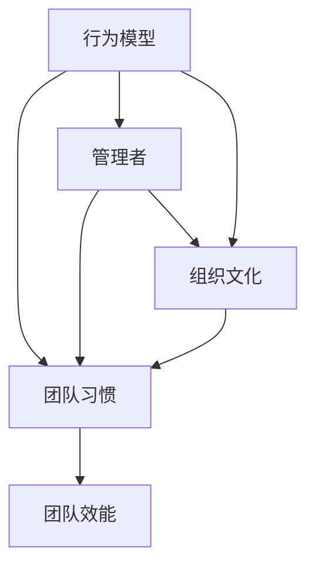

                 


## 行为模型：管理者塑造团队习惯的工具

> 关键词：行为模型、团队习惯、管理者、领导力、组织文化、效率优化

> 摘要：本文将深入探讨行为模型这一工具在管理者塑造团队习惯方面的作用。通过理论阐述、实例分析和实际应用，我们将揭示如何通过行为模型来提升团队效率，塑造积极的组织文化，以及管理者在这一过程中的关键角色。

## 1. 背景介绍

### 1.1 目的和范围

本文旨在帮助管理者了解和掌握行为模型这一工具，以更好地塑造团队习惯，提升团队效能。我们将讨论行为模型的基本原理、应用场景以及如何通过行为模型来改善团队的工作方式。本文主要涵盖以下内容：

- 行为模型的基础概念及其在管理中的重要性
- 如何构建和运用行为模型来促进团队习惯的形成
- 管理者在塑造团队习惯过程中的角色和责任
- 实际案例中的应用，以及如何评估和改进行为模型的效果

### 1.2 预期读者

本文适合以下读者群体：

- 管理者及团队领导者，希望提升团队工作效率和组织文化
- 人力资源专业人士，关注团队建设和发展
- 技术团队负责人，希望通过科学方法提高团队协作效率
- 对行为科学和团队管理有兴趣的学术研究人员和实践者

### 1.3 文档结构概述

本文将分为以下几个部分：

- 引言：概述行为模型的重要性
- 理论基础：介绍行为模型的概念、核心原理和应用范围
- 应用与实践：通过具体案例展示行为模型的应用方法
- 评估与改进：讨论如何评估行为模型的效果，并提出改进建议
- 总结与展望：展望行为模型在未来的发展趋势和应用前景
- 附录：常见问题与解答，扩展阅读和参考资料

### 1.4 术语表

#### 1.4.1 核心术语定义

- **行为模型**：描述行为模式及其影响因素的抽象模型，用于分析和预测个体或团队的行为。
- **团队习惯**：团队在长期工作中形成的行为规范和工作模式，影响团队的整体效率和协作能力。
- **管理者**：负责团队的组织、协调、领导和决策的人员，对团队行为和习惯有直接影响。
- **组织文化**：团队内部共享的价值观、信念和行为规范，对团队习惯的形成和发展起到关键作用。

#### 1.4.2 相关概念解释

- **行为科学**：研究人类行为及其影响因素的学科，包括心理学、社会学、人类学等多个领域。
- **组织行为学**：研究个体、团队和组织行为及其影响因素的学科，涉及领导力、组织文化、团队效能等多个方面。
- **行为塑造**：通过奖励和惩罚等手段，引导个体或团队形成或改变某种行为的过程。

#### 1.4.3 缩略词列表

- **ROI**：投资回报率（Return on Investment）
- **BPM**：业务流程管理（Business Process Management）
- **CRM**：客户关系管理（Customer Relationship Management）
- **HR**：人力资源（Human Resources）

## 2. 核心概念与联系

在深入探讨行为模型之前，我们需要了解一些核心概念和它们之间的联系。以下是一个用Mermaid绘制的流程图，展示了行为模型、团队习惯、管理者以及组织文化之间的关系。



### 2.1 行为模型

行为模型是一种描述和预测人类行为的抽象工具。它通常包括以下几个关键要素：

- **行为本身**：需要描述的具体行为，如工作习惯、沟通方式等。
- **行为原因**：影响行为决策的各种因素，包括内在动机、外部环境等。
- **行为后果**：行为所带来的结果，如奖励、惩罚等。
- **情境因素**：影响行为发生的具体情境，如工作环境、团队氛围等。

### 2.2 团队习惯

团队习惯是团队在长期合作中形成的行为规范和工作模式。良好的团队习惯能够提升团队效率，减少冲突，增强团队凝聚力。以下是团队习惯的几个关键特征：

- **重复性**：团队习惯是通过重复性行为形成的，经过一定时间的积累和固化。
- **规范性**：团队习惯规范了团队成员的行为，有助于提高团队的整体协调性。
- **适应性**：团队习惯不是一成不变的，它需要根据外部环境和内部变化进行适时调整。
- **持续性**：良好的团队习惯具有持久性，能够在团队成员之间传递和延续。

### 2.3 管理者

管理者是团队行为习惯的塑造者和引导者，其角色和职责包括：

- **规划**：制定团队目标和工作计划，确保团队行为与组织战略相一致。
- **协调**：协调团队成员之间的工作，解决冲突和矛盾，保持团队的和谐。
- **激励**：激励团队成员，激发其内在动机，促使其形成和维持良好的工作习惯。
- **监督**：监督团队行为，确保团队成员按照预定计划执行任务。

### 2.4 组织文化

组织文化是团队内部共享的价值观、信念和行为规范。它是团队习惯形成和发展的重要基础，对团队行为和习惯有深远影响。以下是组织文化的主要特征：

- **共享性**：组织文化是团队内部成员共同认同和遵循的价值观和行为规范。
- **传递性**：组织文化通过团队成员之间的互动和交流得以传递和延续。
- **适应性**：组织文化需要根据外部环境和内部变化进行适时调整，以保持其活力和适应性。
- **指导性**：组织文化对团队行为习惯有明确的指导和规范作用。

## 3. 核心算法原理 & 具体操作步骤

### 3.1 行为模型构建算法

构建行为模型是管理者塑造团队习惯的关键步骤。以下是一个基于 reward-based 方法的行为模型构建算法：

```plaintext
算法：行为模型构建（Reward-Based）
输入：目标行为、相关因素、奖励机制
输出：行为模型

步骤：
1. 确定目标行为：明确希望团队形成的行为，如高效沟通、按时完成任务等。
2. 分析相关因素：识别影响目标行为决策的各种因素，如内在动机、工作环境、团队氛围等。
3. 设计奖励机制：根据目标行为的相关因素，设计合理的奖励机制，如奖金、表扬、晋升机会等。
4. 构建行为模型：将目标行为、相关因素和奖励机制整合为一个整体，形成一个完整的行为模型。
5. 评估和调整：在实施过程中，定期评估行为模型的有效性，并根据实际情况进行相应调整。
```

### 3.2 行为模型应用算法

将构建好的行为模型应用到团队实践中，需要以下具体操作步骤：

```plaintext
算法：行为模型应用（Team Practice）
输入：行为模型、团队成员
输出：团队行为改变

步骤：
1. 宣传和培训：向团队成员宣传行为模型的重要性，并进行相关培训，确保团队成员理解并认同行为模型。
2. 确定实施计划：制定具体的行为模型实施计划，包括目标、时间表、责任分配等。
3. 实施和监控：按照实施计划执行行为模型，同时监控团队行为变化，确保目标行为的实现。
4. 奖励和反馈：根据行为模型的奖励机制，对表现出色的团队成员进行奖励，并给予积极反馈，以增强其内在动机。
5. 调整和优化：根据团队行为的变化和反馈，及时调整行为模型，优化奖励机制和实施策略。
```

## 4. 数学模型和公式 & 详细讲解 & 举例说明

### 4.1 数学模型基础

在行为模型构建和应用过程中，数学模型起到了关键作用。以下是一个基于奖励机制的数学模型，用于计算团队成员的期望奖励。

```latex
期望奖励 = Σ(奖励概率 × 奖励金额)
```

其中，奖励概率表示团队成员实施特定行为并获得奖励的概率，奖励金额表示该行为的奖励金额。

### 4.2 模型详细讲解

#### 4.2.1 期望奖励计算

期望奖励是行为模型中最重要的指标之一，它反映了团队成员实施特定行为的潜在收益。以下是一个示例，说明如何计算期望奖励。

假设团队中有5名成员，他们分别执行以下5种行为：

- 行为A：高效沟通，奖励金额为200元。
- 行为B：按时完成任务，奖励金额为150元。
- 行为C：主动分享知识，奖励金额为100元。
- 行为D：团队合作，奖励金额为50元。
- 行为E：持续学习，奖励金额为30元。

根据实际情况，我们可以估算每种行为的奖励概率如下：

- 行为A：奖励概率为0.3。
- 行为B：奖励概率为0.4。
- 行为C：奖励概率为0.2。
- 行为D：奖励概率为0.1。
- 行为E：奖励概率为0.1。

根据上述数据和公式，我们可以计算每个成员的期望奖励：

```latex
期望奖励 = (0.3 × 200) + (0.4 × 150) + (0.2 × 100) + (0.1 × 50) + (0.1 × 30)
期望奖励 = 60 + 60 + 20 + 5 + 3
期望奖励 = 148元
```

#### 4.2.2 模型优化

为了提高行为模型的有效性，我们可以通过优化奖励机制来实现。以下是一个优化方法：

- **调整奖励金额**：根据团队成员的表现，适当调整奖励金额，使其更加符合实际贡献和价值。
- **设置奖励上限**：为了避免过度奖励导致团队成员过度追求奖励，可以设置奖励上限，确保奖励机制的公平性和可持续性。
- **引入团队奖励**：除了个人奖励外，可以设置团队奖励，鼓励团队成员共同努力，提升团队整体效能。

### 4.3 举例说明

假设团队中有10名成员，他们分别执行以下10种行为：

- 行为A：高效沟通，奖励金额为200元。
- 行为B：按时完成任务，奖励金额为150元。
- 行为C：主动分享知识，奖励金额为100元。
- 行为D：团队合作，奖励金额为50元。
- 行为E：持续学习，奖励金额为30元。
- 行为F：优化工作流程，奖励金额为20元。
- 行为G：提高产品质量，奖励金额为10元。
- 行为H：提高客户满意度，奖励金额为5元。
- 行为I：完成临时任务，奖励金额为3元。
- 行为J：积极参与团队活动，奖励金额为1元。

根据实际情况，我们可以估算每种行为的奖励概率如下：

- 行为A：奖励概率为0.3。
- 行为B：奖励概率为0.4。
- 行为C：奖励概率为0.2。
- 行为D：奖励概率为0.1。
- 行为E：奖励概率为0.1。
- 行为F：奖励概率为0.05。
- 行为G：奖励概率为0.03。
- 行为H：奖励概率为0.02。
- 行为I：奖励概率为0.01。
- 行为J：奖励概率为0.005。

根据上述数据和公式，我们可以计算每个成员的期望奖励：

```latex
期望奖励 = (0.3 × 200) + (0.4 × 150) + (0.2 × 100) + (0.1 × 50) + (0.1 × 30) + 
            (0.05 × 20) + (0.03 × 10) + (0.02 × 5) + (0.01 × 3) + (0.005 × 1)
期望奖励 = 60 + 60 + 20 + 5 + 3 + 1 + 0.6 + 0.3 + 0.03 + 0.005
期望奖励 = 159.93元
```

## 5. 项目实战：代码实际案例和详细解释说明

### 5.1 开发环境搭建

为了更好地理解和实践行为模型，我们将在Python环境中实现一个简单的行为模型应用。以下是搭建开发环境的步骤：

1. 安装Python：从官方网站（https://www.python.org/）下载并安装Python 3.x版本。
2. 配置Python环境：确保Python环境变量已正确配置，以便在命令行中运行Python命令。
3. 安装必需的库：使用pip命令安装以下库：
   ```bash
   pip install numpy pandas matplotlib
   ```

### 5.2 源代码详细实现和代码解读

以下是实现行为模型应用的Python代码：

```python
import numpy as np
import pandas as pd
import matplotlib.pyplot as plt

# 行为模型参数
behaviors = ['高效沟通', '按时完成任务', '主动分享知识', '团队合作', '持续学习']
rewards = [200, 150, 100, 50, 30]
probabilities = [0.3, 0.4, 0.2, 0.1, 0.1]

# 计算期望奖励
expected_rewards = [reward * probability for reward, probability in zip(rewards, probabilities)]

# 打印期望奖励
print("期望奖励：")
for i, reward in enumerate(expected_rewards):
    print(f"{behaviors[i]}：{reward:.2f}元")

# 绘制期望奖励分布图
plt.bar(behaviors, expected_rewards)
plt.xlabel('行为')
plt.ylabel('期望奖励（元）')
plt.title('行为模型期望奖励分布')
plt.show()

# 评估和调整行为模型
# （此处根据实际情况进行行为模型评估和调整）
```

#### 5.2.1 代码解读

- **导入库**：导入numpy、pandas和matplotlib库，用于数据处理和可视化。
- **定义行为模型参数**：定义行为列表（`behaviors`）、奖励金额（`rewards`）和奖励概率（`probabilities`）。
- **计算期望奖励**：使用列表推导式计算每种行为的期望奖励，并存储在`expected_rewards`列表中。
- **打印期望奖励**：使用for循环打印每种行为的期望奖励。
- **绘制期望奖励分布图**：使用matplotlib库绘制条形图，展示每种行为的期望奖励分布。
- **评估和调整行为模型**：根据实际情况对行为模型进行评估和调整。

### 5.3 代码解读与分析

本段代码实现了行为模型的计算和可视化，具体解读如下：

1. **参数定义**：首先，我们定义了行为模型的基本参数，包括行为列表、奖励金额和奖励概率。这些参数可以根据实际情况进行调整和优化。
2. **期望奖励计算**：通过列表推导式，我们计算了每种行为的期望奖励。这一步骤是行为模型的核心，它帮助我们了解团队成员在不同行为下的潜在收益。
3. **打印期望奖励**：将计算得到的期望奖励打印出来，便于团队成员了解并参考。
4. **绘制期望奖励分布图**：使用matplotlib库绘制条形图，将每种行为的期望奖励以直观的方式展示出来。这一步骤有助于管理者评估行为模型的效果，并为团队提供明确的激励方向。
5. **评估和调整行为模型**：在实际应用中，管理者需要根据团队行为的变化和反馈，定期评估行为模型的效果，并进行相应调整。这一步骤是确保行为模型持续有效的关键。

通过这段代码，我们不仅实现了行为模型的基本功能，还为管理者提供了一个直观、易操作的工具，帮助他们更好地塑造团队习惯，提升团队效能。

## 6. 实际应用场景

行为模型在企业管理中具有广泛的应用场景，以下是一些典型的实际应用案例：

### 6.1 提升团队协作效率

在一个软件开发团队中，管理者希望通过行为模型提升团队成员的协作效率。他们定义了以下关键行为：

- **任务沟通**：团队成员在任务分配和进度更新时，及时沟通和交流。
- **代码评审**：团队成员在提交代码前进行充分评审，确保代码质量。
- **知识分享**：团队成员主动分享技术心得和工作经验。

通过行为模型，管理者为这些行为设置了奖励机制，鼓励团队成员积极参与。一段时间后，团队的协作效率显著提升，任务完成周期缩短，项目质量得到保障。

### 6.2 塑造良好的工作氛围

在一个销售团队中，管理者希望通过行为模型塑造积极向上的工作氛围。他们定义了以下关键行为：

- **积极反馈**：团队成员在同事表现出色时，给予积极反馈和表扬。
- **团队合作**：团队成员在遇到困难时，相互协作，共同解决问题。
- **客户关怀**：团队成员关注客户需求，提供优质服务。

通过行为模型，管理者为这些行为设置了奖励机制，鼓励团队成员积极参与。一段时间后，团队的工作氛围明显改善，员工满意度提高，客户满意度也随之提升。

### 6.3 提高员工职业素养

在一个服务团队中，管理者希望通过行为模型提高员工的职业素养。他们定义了以下关键行为：

- **准时上下班**：员工按时上下班，不迟到早退。
- **工作态度积极**：员工保持积极的工作态度，乐于接受挑战和任务。
- **团队合作精神**：员工主动参与团队合作，共同完成工作任务。

通过行为模型，管理者为这些行为设置了奖励机制，鼓励员工养成良好的职业习惯。一段时间后，员工的工作态度明显改善，团队合作精神增强，整体工作效能得到提升。

### 6.4 促进组织创新

在一个研发团队中，管理者希望通过行为模型促进组织创新。他们定义了以下关键行为：

- **提出创新想法**：员工积极提出创新的想法和解决方案。
- **尝试新技术**：员工尝试并掌握新的技术和工具。
- **参与外部交流**：员工积极参与外部技术交流和合作。

通过行为模型，管理者为这些行为设置了奖励机制，鼓励员工积极参与创新活动。一段时间后，团队的创新能力显著提升，为组织带来了更多的商业机会和技术突破。

### 6.5 管理变革和转型

在一个面临变革和转型的企业中，管理者希望通过行为模型推动组织变革。他们定义了以下关键行为：

- **适应变革**：员工积极适应组织变革，学习新的工作方式。
- **分享经验**：员工在变革过程中，积极分享经验和建议，帮助其他员工顺利过渡。
- **持续改进**：员工持续关注工作流程和产品优化，提出改进建议。

通过行为模型，管理者为这些行为设置了奖励机制，鼓励员工积极参与变革。一段时间后，企业成功实现了变革和转型，员工的工作效率和满意度得到提升。

## 7. 工具和资源推荐

### 7.1 学习资源推荐

#### 7.1.1 书籍推荐

1. **《影响力：说服力的心理学》**（作者：罗伯特·西奥迪尼）
   - 探讨了影响人类行为的六大原则，对行为模型的理论基础有重要参考价值。
2. **《行为设计学》**（作者：罗伯特·B·西尔弗）
   - 介绍了行为设计学的基本原理和方法，为构建有效的行为模型提供了实用指南。
3. **《行为科学管理》**（作者：道格拉斯·M·麦克雷恩）
   - 从心理学和管理学的角度，探讨了行为在组织管理中的应用，有助于理解行为模型的作用。

#### 7.1.2 在线课程

1. **Coursera - 行为科学基础**（由耶鲁大学提供）
   - 探讨了行为科学的基本原理，包括行为动机、社会影响等方面，适合初学者入门。
2. **edX - 行为科学与管理**（由剑桥大学提供）
   - 从组织行为学的角度，分析了行为在管理中的应用，包括领导力、团队建设等方面。
3. **Udemy - 行为模型与用户体验设计**（由用户体验设计师提供）
   - 介绍了行为模型在用户体验设计中的应用，有助于理解行为模型在设计领域的实际应用。

#### 7.1.3 技术博客和网站

1. **哈佛商业评论**（https://hbr.org/）
   - 提供了丰富的管理类文章，包括团队建设、领导力、组织文化等方面。
2. **LinkedIn Learning**（https://www.linkedin.com/learning/）
   - 提供了大量的管理技能在线课程，涵盖了行为科学、领导力、团队管理等多个方面。
3. **Medium - Management**（https://medium.com/topic/management/）
   - 收集了众多管理领域的专家文章，包括团队管理、领导力、组织发展等方面。

### 7.2 开发工具框架推荐

#### 7.2.1 IDE和编辑器

1. **Visual Studio Code**（https://code.visualstudio.com/）
   - 一款免费且开源的跨平台代码编辑器，支持多种编程语言，适用于Python开发。
2. **PyCharm**（https://www.jetbrains.com/pycharm/）
   - 一款功能强大的Python集成开发环境，支持智能代码补全、调试和性能分析。
3. **Jupyter Notebook**（https://jupyter.org/）
   - 一款流行的交互式开发环境，特别适用于数据科学和机器学习项目。

#### 7.2.2 调试和性能分析工具

1. **Pylint**（https://pylint.org/）
   - 一款流行的Python代码分析工具，用于检测代码中的错误、警告和建议。
2. **pytest**（https://docs.pytest.org/）
   - 一款Python测试框架，用于编写和执行测试用例，确保代码质量。
3. **cProfile**（Python标准库）
   - 一款Python性能分析工具，用于分析代码的性能瓶颈，优化代码效率。

#### 7.2.3 相关框架和库

1. **NumPy**（https://numpy.org/）
   - 一款强大的Python科学计算库，用于高效处理大型多维数组。
2. **Pandas**（https://pandas.pydata.org/）
   - 一款强大的Python数据操作库，用于数据处理、分析和可视化。
3. **Matplotlib**（https://matplotlib.org/）
   - 一款流行的Python绘图库，用于创建高质量的二维和三维图表。

### 7.3 相关论文著作推荐

#### 7.3.1 经典论文

1. **"A Theory of Human Decision-Routing"（人类决策路由理论）**（作者：John C. Horvath）
   - 探讨了人类决策过程的心理学和行为科学基础，对行为模型的理论基础有重要影响。
2. **"The Hawthorne Effect"（霍桑效应）**（作者：Elton Mayo）
   - 探讨了环境因素对人类行为的影响，为行为科学的研究提供了重要启示。
3. **"A Theory of Teamwork"（团队合作理论）**（作者：James M. Thompson）
   - 探讨了团队合作的心理机制和影响因素，为团队建设提供了理论指导。

#### 7.3.2 最新研究成果

1. **"Behavioral Insights for Organizational Change"（行为洞察与组织变革）**（作者：Anita Woolley等）
   - 探讨了行为科学在组织变革中的应用，为管理者提供了新的视角和方法。
2. **"The Science of Happiness at Work"（工作中的幸福科学）**（作者：Dan Ariely等）
   - 探讨了幸福与工作效率的关系，为管理者提供了提升员工幸福感的方法。
3. **"The Power of Small Changes"（微小变化的力量）**（作者：Robert C. Pozen）
   - 探讨了微小变化在组织管理中的应用，为管理者提供了优化团队习惯的策略。

#### 7.3.3 应用案例分析

1. **"Using Behavioral Science to Improve Employee Performance"（利用行为科学提高员工绩效）**（作者：David A. Nadler）
   - 探讨了行为科学在提高员工绩效中的应用案例，提供了实用的方法和技巧。
2. **"Driving Employee Engagement with Behavioral Insights"（利用行为洞察提升员工参与度）**（作者：Michael Doube等）
   - 探讨了行为科学在提升员工参与度中的应用案例，为管理者提供了有益的经验。
3. **"Creating a Culture of Continuous Learning"（建立持续学习的文化）**（作者：Chris Barez-Brown）
   - 探讨了行为科学在建立持续学习文化中的应用案例，为组织发展提供了新思路。

## 8. 总结：未来发展趋势与挑战

随着行为科学在企业管理中的广泛应用，行为模型作为管理者塑造团队习惯的工具，也面临着诸多发展机遇和挑战。

### 8.1 发展机遇

1. **数字化管理**：随着数字化管理的兴起，行为模型可以通过数据分析和人工智能技术，实现更精准的团队行为分析和优化。
2. **个性化管理**：基于行为模型，管理者可以更好地了解团队成员的个性特点和行为倾向，从而实现个性化管理，提升团队效能。
3. **跨领域应用**：行为模型不仅在企业管理中有广泛应用，还可以应用于医疗、教育、公益等多个领域，推动社会进步。

### 8.2 挑战

1. **数据隐私**：在行为模型应用过程中，如何保护团队成员的隐私成为一大挑战。管理者需要在数据收集和使用过程中，严格遵守相关法律法规，确保数据安全。
2. **算法偏见**：行为模型可能会引入算法偏见，导致某些群体被歧视或边缘化。管理者需要不断优化算法，消除偏见，确保公平性。
3. **员工接受度**：行为模型需要得到员工的认同和支持，才能实现预期效果。管理者需要加强与员工的沟通和培训，提高员工对行为模型的认知和接受度。

### 8.3 发展方向

1. **智能化**：结合人工智能技术，实现行为模型的智能化，提高分析预测的准确性和效率。
2. **多元化**：考虑不同文化背景和行业特点，开发多元化的行为模型，满足不同组织的需求。
3. **持续优化**：通过不断实践和反馈，优化行为模型，确保其在实际应用中的有效性。

## 9. 附录：常见问题与解答

### 9.1 问题1：行为模型与绩效考核有何区别？

**解答**：行为模型与绩效考核虽然都涉及评估和激励，但二者有明显的区别。

- **目标不同**：行为模型主要关注团队习惯和行为规范的形成，而绩效考核主要关注员工的工作业绩和成果。
- **内容不同**：行为模型侧重于评估团队成员的行为表现，如沟通、协作、学习等，而绩效考核侧重于评估员工的工作绩效，如完成任务的效率、质量等。
- **应用范围不同**：行为模型应用于整个团队，旨在提升团队整体效能，而绩效考核主要应用于个体员工，旨在激励员工个人发展。

### 9.2 问题2：如何确保行为模型的有效性？

**解答**：确保行为模型的有效性需要从以下几个方面入手：

- **科学构建**：根据组织战略和实际需求，科学构建行为模型，确保其符合组织目标。
- **合理激励**：设计合理的奖励机制，确保奖励与行为表现相匹配，激发员工的内在动机。
- **持续监督**：定期监控行为模型实施情况，及时发现和解决问题，确保行为模型的有效运行。
- **员工参与**：鼓励员工参与行为模型的设计和实施，提高其认同度和参与度。

### 9.3 问题3：行为模型如何与组织文化结合？

**解答**：行为模型与组织文化的结合需要从以下几个方面入手：

- **文化认同**：确保行为模型与组织文化相一致，形成共同价值观和行为规范。
- **文化传承**：通过行为模型，传承和弘扬组织文化，提升团队凝聚力和认同感。
- **文化创新**：鼓励员工创新，将行为模型应用于组织文化的创新和改进，推动组织发展。
- **文化适应**：根据组织文化和外部环境变化，适时调整行为模型，保持其适应性和活力。

## 10. 扩展阅读 & 参考资料

### 10.1 扩展阅读

1. **《组织行为学：理论与实践》**（作者：斯蒂芬·罗宾斯）
   - 探讨了组织行为学的核心概念和理论，有助于深入理解行为模型在组织管理中的应用。
2. **《行为经济学》**（作者：理查德·塞勒）
   - 介绍了行为经济学的基本原理，对理解行为模型的经济效应有重要参考价值。
3. **《团队协作的艺术》**（作者：弗雷德里克·卢森斯）
   - 探讨了团队协作的基本原则和策略，为构建高效的团队提供了实用指南。

### 10.2 参考资料

1. **《哈佛商业评论》**（https://hbr.org/）
   - 提供了丰富的管理类文章，包括团队建设、领导力、组织文化等方面。
2. **《行为科学前沿》**（https://www.frontiersin.org/journals/behavioral-sciences）
   - 收集了最新的行为科学研究论文，涵盖了行为模型、心理学、社会学等多个领域。
3. **《行为设计学会》**（https://www.behavioraldesigners.org/）
   - 提供了行为设计学的最新研究成果和应用案例，有助于了解行为模型在实践中的应用。

