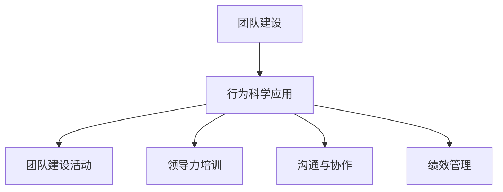

                 

# 行为科学在团队建设中的应用

> 关键词：团队建设、行为科学、心理学、领导力、沟通、协作
> 
> 摘要：本文旨在探讨行为科学在团队建设中的应用，通过分析心理学原理和领导力模型，探讨如何利用行为科学工具和方法，提高团队的协作效率与创造力。文章将详细阐述行为科学的基本概念，结合实际案例，分析其在团队建设中的具体应用，最后展望行为科学在团队建设领域的未来发展。

## 1. 背景介绍

### 1.1 目的和范围

本文的主要目的是探讨行为科学在团队建设中的应用。我们将从心理学和行为学的角度，分析团队建设中的关键因素，并提出相应的策略和工具。本文将覆盖以下内容：

1. 行为科学的基本概念及其在团队建设中的应用。
2. 心理学原理和领导力模型在团队建设中的作用。
3. 实际案例中的行为科学应用。
4. 行为科学在团队建设中的未来发展趋势。

### 1.2 预期读者

本文的预期读者包括：

1. 企业管理者：了解如何利用行为科学提高团队绩效。
2. 项目经理：掌握团队建设中的关键心理因素。
3. 心理咨询师和培训师：探索行为科学在组织发展中的应用。
4. 对团队建设和心理学有兴趣的学者和研究人员。

### 1.3 文档结构概述

本文分为以下章节：

1. 背景介绍：介绍本文的目的、范围和预期读者。
2. 核心概念与联系：介绍行为科学的基本概念和相关模型。
3. 核心算法原理 & 具体操作步骤：阐述行为科学在团队建设中的应用策略。
4. 数学模型和公式 & 详细讲解 & 举例说明：提供具体的数学工具和案例分析。
5. 项目实战：代码实际案例和详细解释说明。
6. 实际应用场景：探讨行为科学在不同行业中的应用。
7. 工具和资源推荐：推荐相关学习资源和开发工具。
8. 总结：未来发展趋势与挑战。
9. 附录：常见问题与解答。
10. 扩展阅读 & 参考资料：提供进一步的阅读建议。

### 1.4 术语表

#### 1.4.1 核心术语定义

- 行为科学：研究人类行为及其影响因素的学科。
- 团队建设：提高团队协作和绩效的过程。
- 领导力：领导者影响和激励团队的能力。
- 沟通：信息在团队中的传递和交流。
- 协作：团队成员共同努力，实现共同目标。

#### 1.4.2 相关概念解释

- 团队动力学：团队内部相互作用和关系的研究。
- 组织行为学：研究组织内部个体和团队行为的学科。
- 领导风格：领导者处理团队关系和任务的方式。
- 组织文化：组织成员共同遵循的价值观和行为准则。

#### 1.4.3 缩略词列表

- AI：人工智能
- SDLC：软件开发生命周期
- ML：机器学习
- HR：人力资源管理

## 2. 核心概念与联系

### 2.1 行为科学的基本概念

行为科学是一门跨学科的研究领域，它结合了心理学、社会学、经济学等多个学科，旨在理解人类行为及其背后的动机和机制。在团队建设中，行为科学提供了以下核心概念：

- 行为激励：通过奖励和惩罚来影响团队成员的行为。
- 自我效能：个体对自己完成任务的信心。
- 群体动力学：团队内部相互作用和关系的研究。
- 情绪智力：理解和管理自己及他人情绪的能力。

### 2.2 心理学原理和领导力模型

心理学原理和领导力模型是团队建设中不可或缺的部分。以下是一些关键概念：

- 领导风格：领导者处理团队关系和任务的方式，如民主型、专制型、参与型等。
- 激励理论：解释个体如何被激励和驱动去完成任务的理论，如需求层次理论、双因素理论等。
- 情绪智力：个体理解和管理自己及他人情绪的能力。

### 2.3 行为科学在团队建设中的应用

行为科学在团队建设中的应用可以分为以下几个方面：

1. **团队建设活动**：利用心理学原理设计团队建设活动，如团队角色识别、团队任务分配、团队目标设定等。
2. **领导力培训**：通过领导力模型和心理学原理，提高领导者的领导能力和团队管理技能。
3. **沟通与协作**：利用心理学知识，改善团队内部的沟通和协作，提高团队效率和创造力。
4. **绩效管理**：通过行为激励和自我效能理论，建立有效的绩效管理体系，提高团队成员的工作动力和绩效。

### 2.4 核心概念原理和架构的 Mermaid 流程图

下面是一个简化的 Mermaid 流程图，展示了行为科学在团队建设中的应用：



## 3. 核心算法原理 & 具体操作步骤

### 3.1 行为科学在团队建设中的应用策略

为了在团队建设中有效应用行为科学，我们可以采取以下策略：

1. **了解团队成员的行为动机**：通过问卷调查、面谈等方式，了解团队成员的个人需求、价值观和职业目标，为后续的团队建设提供依据。

2. **建立明确的团队目标和任务分配**：确保团队成员清楚了解团队的目标和各自的职责，通过合理的任务分配，提高团队协作效率。

3. **运用激励理论**：根据团队成员的需求层次，设计合适的奖励和惩罚机制，激励团队成员为实现团队目标而努力。

4. **培养领导力和情绪智力**：通过领导力培训，提高团队领导者的领导能力，培养团队成员的情绪智力，促进团队内部的和谐与协作。

5. **优化团队沟通和协作**：通过心理学知识，改善团队内部的沟通方式，提高团队成员的协作能力，减少冲突和误解。

### 3.2 具体操作步骤

以下是一个基于行为科学原理的团队建设具体操作步骤：

1. **评估团队成员的行为动机**：

   ```python
   # 伪代码：评估团队成员的行为动机
   for member in team_members:
       motivation = assess_motivation(member)
       print(f"{member.name} 的行为动机：{motivation}")
   ```

2. **设定团队目标和任务分配**：

   ```python
   # 伪代码：设定团队目标和任务分配
   team_objective = set_team_objective()
   assign_tasks(team_members, team_objective)
   ```

3. **运用激励理论**：

   ```python
   # 伪代码：运用激励理论
   for member in team_members:
       if member.performance > threshold:
           reward_member(member)
       else:
           warn_member(member)
   ```

4. **领导力培训和情绪智力培养**：

   ```python
   # 伪代码：领导力培训和情绪智力培养
   for leader in team_leaders:
       train_leader(leader)
       develop_emotional_intelligence(leader)
   ```

5. **优化团队沟通和协作**：

   ```python
   # 伪代码：优化团队沟通和协作
   for member in team_members:
       improve_communication(member)
       enhance_collaboration(member)
   ```

## 4. 数学模型和公式 & 详细讲解 & 举例说明

### 4.1 数学模型和公式

在团队建设中，行为科学提供了一些关键数学模型和公式，以下是一些常用模型：

1. **泰勒公式**：用于评估团队成员的工作绩效。

   $$ P = f(T, S, E) $$

   其中，$P$ 表示绩效，$T$ 表示任务难度，$S$ 表示技能水平，$E$ 表示环境因素。

2. **归因理论**：用于解释团队成员对绩效归因的认知。

   $$ A = \frac{P - E}{T} $$

   其中，$A$ 表示归因，$P$ 表示绩效，$E$ 表示环境因素，$T$ 表示任务难度。

3. **情感智力模型**：用于评估团队成员的情绪智力水平。

   $$ EI = \frac{E + I}{S} $$

   其中，$EI$ 表示情绪智力，$E$ 表示情绪表达，$I$ 表示情绪理解，$S$ 表示社交技能。

### 4.2 详细讲解和举例说明

#### 4.2.1 泰勒公式

泰勒公式用于评估团队成员的工作绩效，通过考虑任务难度、技能水平和环境因素，可以更全面地评估团队成员的表现。

举例说明：

假设某团队成员在难度为3的任务上，技能水平为4，环境因素为2，根据泰勒公式，我们可以计算其绩效：

$$ P = f(3, 4, 2) = 3 \times 4 - 2 = 10 $$

因此，该团队成员在任务中的绩效为10。

#### 4.2.2 归因理论

归因理论用于解释团队成员对绩效归因的认知，通过分析绩效和任务难度，可以了解团队成员如何解释其绩效。

举例说明：

假设某团队成员在难度为3的任务上获得了绩效8，根据归因理论，我们可以分析其可能的归因：

- 如果任务难度较低（如2），则团队成员可能归因于自身技能（$A = \frac{8 - 2}{3} = 2$）。
- 如果任务难度较高（如4），则团队成员可能归因于外部环境（$A = \frac{8 - 4}{3} = 0.67$）。

#### 4.2.3 情绪智力模型

情绪智力模型用于评估团队成员的情绪智力水平，通过分析情绪表达、情绪理解和社交技能，可以了解团队成员的情绪智力状况。

举例说明：

假设某团队成员的情绪表达为6，情绪理解

