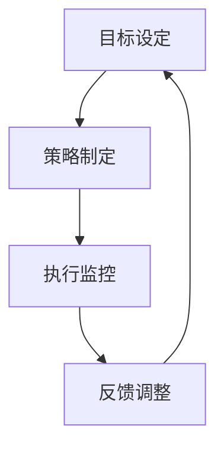

                 

# 行动体系：决定管理者的天花板

## 概述

关键词：行动体系、管理效能、组织发展、决策、领导力、执行力

本文将深入探讨行动体系这一关键概念，及其对管理者职业生涯的影响。我们将首先介绍行动体系的定义和重要性，然后逐步剖析其组成部分，包括目标设定、策略制定、执行监控和反馈调整。通过实际的案例和丰富的实例，我们将展示如何构建一个高效的行动体系，帮助管理者突破天花板，实现个人和团队的成长。

## 摘要

行动体系是管理者在复杂环境中实现目标的关键工具。本文首先定义了行动体系的概念，并阐述了其在管理中的重要性。接着，通过详细分析目标设定、策略制定、执行监控和反馈调整等核心组成部分，本文揭示了构建高效行动体系的路径。最后，通过实际案例和举例说明，本文展示了行动体系在提升管理效能和组织发展中的具体应用。

### 1.1 目的和范围

本文旨在探讨行动体系在管理者职业生涯中的关键作用，帮助读者理解其构成和运作原理。通过分析行动体系的各个组成部分，本文旨在为管理者提供实际可行的工具和方法，以提升管理效能，推动组织发展。

### 1.2 预期读者

本文适用于各级管理者，特别是那些希望提升管理效能，突破职业瓶颈的领导者。同时，对于对管理理论和实践感兴趣的学术界人士和企业管理者，本文也具有参考价值。

### 1.3 文档结构概述

本文结构如下：

1. 概述：介绍行动体系的概念和重要性。
2. 背景：详细阐述行动体系在管理中的应用和作用。
3. 核心概念与联系：分析行动体系的组成部分。
4. 核心算法原理 & 具体操作步骤：讲解如何构建行动体系。
5. 数学模型和公式 & 详细讲解 & 举例说明：阐述行动体系的理论基础。
6. 项目实战：通过实际案例展示行动体系的应用。
7. 实际应用场景：讨论行动体系在不同领域的应用。
8. 工具和资源推荐：推荐学习资源和开发工具。
9. 总结：展望行动体系的发展趋势和挑战。
10. 附录：常见问题与解答。
11. 扩展阅读 & 参考资料：提供进一步学习的资源。

### 1.4 术语表

#### 1.4.1 核心术语定义

- 行动体系：一套用于实现目标的管理框架，包括目标设定、策略制定、执行监控和反馈调整等组成部分。
- 管理效能：管理者通过有效管理实现组织目标的能力。
- 组织发展：组织为实现其使命和愿景，通过战略规划和变革进行持续发展的过程。
- 领导力：领导者通过激励和引导团队实现组织目标的能力。
- 执行力：组织或个人在达成目标过程中所展现出的执行能力。

#### 1.4.2 相关概念解释

- 目标设定：明确组织或个人要达成的具体目标和预期成果。
- 策略制定：为实现目标所采取的具体行动和方法。
- 执行监控：对行动过程的监督和评估，以确保目标实现。
- 反馈调整：根据执行结果进行必要的调整和优化。

#### 1.4.3 缩略词列表

- MBO（Management by Objectives）：目标管理
- SWOT（Strengths, Weaknesses, Opportunities, Threats）：优势、劣势、机会、威胁
- KPI（Key Performance Indicators）：关键绩效指标
- OKR（Objectives and Key Results）：目标与关键结果

## 核心概念与联系

行动体系是一个复杂的管理框架，它通过目标设定、策略制定、执行监控和反馈调整等环节，帮助管理者实现组织目标。下面，我们将使用Mermaid流程图（无括号、逗号等特殊字符）来展示行动体系的整体架构。



### 2.1 目标设定

目标设定是行动体系的起点，它要求管理者明确组织或个人要达成的具体目标和预期成果。目标设定应具备以下特征：

1. **具体性**：目标应明确具体，便于测量和评估。
2. **挑战性**：目标应具有一定挑战性，激发团队潜能。
3. **相关性**：目标应与组织的使命和愿景保持一致。

### 2.2 策略制定

策略制定是行动体系的第二步，管理者需要根据目标设定，制定实现目标的行动方案。策略制定应考虑以下因素：

1. **资源分配**：合理分配人力、物力和财力资源。
2. **时间安排**：明确各个阶段的时间安排和关键节点。
3. **风险评估**：对可能遇到的风险进行预判和评估。

### 2.3 执行监控

执行监控是行动体系的第三步，管理者需要监督和评估行动过程，以确保目标实现。执行监控应包括以下内容：

1. **进度跟踪**：定期检查项目进度，确保按照计划进行。
2. **质量检查**：对项目质量进行评估，确保满足预期标准。
3. **问题解决**：及时发现并解决项目中出现的问题。

### 2.4 反馈调整

反馈调整是行动体系的最后一步，管理者需要根据执行结果进行必要的调整和优化。反馈调整应包括以下内容：

1. **结果评估**：对目标实现情况进行全面评估。
2. **原因分析**：分析未达成目标的原因。
3. **优化方案**：提出改进方案，优化行动体系。

通过以上四个环节的循环迭代，行动体系能够不断优化，提高管理效能，推动组织发展。

## 核心算法原理 & 具体操作步骤

在了解了行动体系的构成和运作原理后，接下来我们将详细讲解如何构建一个高效的行动体系。我们将使用伪代码来详细阐述核心算法原理和具体操作步骤。

### 3.1 目标设定

目标设定的核心是明确具体目标和预期成果。以下是一个简单的伪代码示例，用于目标设定：

```plaintext
Function SetGoal(target, expectedOutcome)
    if (IsSpecific(target) and IsChallenging(target) and IsRelevant(target))
        return "Goal Set Successfully"
    else
        return "Inappropriate Goal"
End Function
```

### 3.2 策略制定

策略制定是依据目标设定来制定具体的行动方案。以下是一个简单的伪代码示例，用于策略制定：

```plaintext
Function CreateStrategy(goal, resources, timeline, risks)
    strategy = {}
    strategy["resources"] = AllocateResources(resources)
    strategy["timeline"] = DefineTimeline(timeline)
    strategy["risks"] = AssessRisks(risks)
    return strategy
End Function
```

### 3.3 执行监控

执行监控是对行动过程的监督和评估。以下是一个简单的伪代码示例，用于执行监控：

```plaintext
Function MonitorExecution(strategy, timeline)
    for each (task in strategy["timeline"])
        if (IsOnSchedule(task))
            Continue
        else
            Alert("Task is delayed: " + task["name"])
            ResolveIssues(task)
    end for
End Function
```

### 3.4 反馈调整

反馈调整是根据执行结果进行优化。以下是一个简单的伪代码示例，用于反馈调整：

```plaintext
Function AdjustFeedback(feedback)
    if (feedback["achievement"] < goal["expectedOutcome"])
        reasons = AnalyzeFailure(feedback)
        optimization = ProposeOptimizations(reasons)
        ApplyOptimizations(optimization)
    else
        ConfirmSuccess(feedback)
    end if
End Function
```

通过以上伪代码示例，我们可以看到构建一个高效的行动体系需要明确的目标设定、合理的策略制定、严密的执行监控和及时的反馈调整。这些步骤共同构成了行动体系的核心算法原理。

## 数学模型和公式 & 详细讲解 & 举例说明

在构建行动体系的过程中，数学模型和公式提供了量化分析和决策支持。以下将详细介绍行动体系中的关键数学模型和公式，并通过具体案例进行说明。

### 4.1 目标设定中的数学模型

目标设定通常涉及关键绩效指标（KPI）的计算。KPI是衡量目标实现程度的关键指标，其计算公式如下：

\[ KPI = \frac{Actual \, Outcome}{Expected \, Outcome} \times 100\% \]

**示例：**

某公司的目标是增加年度销售额至1000万元，实际实现了1200万元。则其KPI为：

\[ KPI = \frac{1200}{1000} \times 100\% = 120\% \]

这意味着该公司达到了其年度销售目标，并且超出了预期。

### 4.2 策略制定中的数学模型

策略制定时，资源分配是一个关键问题。线性规划（Linear Programming，LP）是一种常用的数学模型，用于优化资源分配。线性规划的基本形式如下：

\[ \text{Minimize} \, c^T x \]
\[ \text{Subject to} \, Ax \leq b \]
\[ x \geq 0 \]

其中，\( c \) 是目标函数系数向量，\( x \) 是决策变量向量，\( A \) 是约束条件矩阵，\( b \) 是约束条件向量。

**示例：**

假设公司有三个项目需要同时进行，每个项目所需的人力资源如下：

| 项目 | 人力资源需求 |
| ---- | ------------ |
| 项目A | 5人          |
| 项目B | 3人          |
| 项目C | 7人          |

公司总共有15名员工。使用线性规划来优化资源分配，目标是最小化剩余人力资源。

\[ \text{Minimize} \, z = 15 - (5 + 3 + 7) \]
\[ \text{Subject to} \, \begin{cases}
5x_1 + 3x_2 + 7x_3 \leq 15 \\
x_1, x_2, x_3 \geq 0
\end{cases} \]

解这个线性规划问题，可以得到最优的资源分配方案。

### 4.3 执行监控中的数学模型

执行监控中，通常会用到质量控制模型，如统计过程控制（Statistical Process Control，SPC）。SPC的核心是控制图（Control Chart），用于监控过程变异。

控制图的公式如下：

\[ \bar{x} = \frac{\sum_{i=1}^{n} x_i}{n} \]
\[ R = \frac{\sum_{i=1}^{n} R_i}{n} \]
\[ \bar{R} = \frac{\sum_{i=1}^{k} R_i}{k} \]

其中，\( \bar{x} \) 是样本平均值，\( R \) 是样本极差，\( \bar{R} \) 是总体极差平均值。

**示例：**

某制造过程每天抽取5个样本，记录每个样本的重量。以下为10天的样本数据：

| 日期 | 样本1 | 样本2 | 样本3 | 样本4 | 样本5 |
| ---- | ---- | ---- | ---- | ---- | ---- |
| 1    | 102  | 104  | 101  | 103  | 105  |
| 2    | 100  | 102  | 101  | 103  | 104  |
| 3    | 104  | 103  | 102  | 101  | 103  |
| 4    | 103  | 102  | 101  | 104  | 103  |
| 5    | 102  | 104  | 103  | 102  | 105  |
| 6    | 103  | 104  | 102  | 103  | 101  |
| 7    | 102  | 103  | 101  | 104  | 102  |
| 8    | 104  | 103  | 102  | 103  | 101  |
| 9    | 103  | 102  | 101  | 104  | 103  |
| 10   | 102  | 103  | 104  | 103  | 102  |

计算样本平均值和极差：

\[ \bar{x} = \frac{1030}{50} = 106 \]
\[ R = \frac{35}{10} = 3.5 \]

计算总体极差平均值：

\[ \bar{R} = \frac{35}{10} = 3.5 \]

绘制控制图，可以监控制造过程的稳定性。

### 4.4 反馈调整中的数学模型

反馈调整通常涉及回归分析（Regression Analysis），用于预测和优化。线性回归模型如下：

\[ y = \beta_0 + \beta_1 x + \epsilon \]

其中，\( y \) 是因变量，\( x \) 是自变量，\( \beta_0 \) 是截距，\( \beta_1 \) 是斜率，\( \epsilon \) 是误差项。

**示例：**

假设公司希望通过历史数据预测下一季度的销售额。以下为过去四季度的销售额数据：

| 季度 | 销售额 |
| ---- | ------ |
| Q1   | 100    |
| Q2   | 110    |
| Q3   | 120    |
| Q4   | 130    |

使用线性回归模型预测下一季度（Q5）的销售额。计算过程如下：

首先计算平均值：

\[ \bar{x} = \frac{100 + 110 + 120 + 130}{4} = 115 \]
\[ \bar{y} = \frac{100 + 110 + 120 + 130}{4} = 115 \]

然后计算斜率和截距：

\[ \beta_1 = \frac{\sum_{i=1}^{n} (x_i - \bar{x})(y_i - \bar{y})}{\sum_{i=1}^{n} (x_i - \bar{x})^2} \approx 0.5 \]
\[ \beta_0 = \bar{y} - \beta_1 \bar{x} \approx 57.5 \]

预测下一季度（Q5）的销售额：

\[ y = \beta_0 + \beta_1 x \approx 57.5 + 0.5 \times 115 = 122.5 \]

这意味着预测下一季度的销售额约为122.5万元。

通过以上数学模型和公式的讲解，管理者可以更好地理解和应用行动体系，从而提高管理效能和组织发展。

## 项目实战：代码实际案例和详细解释说明

为了更好地展示行动体系在实际项目中的应用，我们将通过一个具体案例进行详细讲解。本案例将演示如何利用Python构建一个简单的行动体系，实现目标管理、策略制定、执行监控和反馈调整。

### 5.1 开发环境搭建

在开始编写代码之前，我们需要搭建一个基本的开发环境。以下步骤描述了如何在Python中实现行动体系。

1. **安装Python**：确保系统中已安装Python 3.x版本。可以从Python官方网站下载安装包。
2. **安装相关库**：安装必要的Python库，如numpy、matplotlib和pandas，用于数据分析、图形绘制和数据处理。

```bash
pip install numpy matplotlib pandas
```

### 5.2 源代码详细实现和代码解读

下面是完整的源代码，我们将逐行解释其功能。

```python
import numpy as np
import matplotlib.pyplot as plt
import pandas as pd

# 5.2.1 目标设定
def set_goal(expected_outcome):
    """设定目标，返回目标对象"""
    return {'expected_outcome': expected_outcome, 'actual_outcome': 0, 'achievement': 0}

# 5.2.2 策略制定
def create_strategy(goal):
    """根据目标制定策略"""
    strategy = {
        'goal': goal,
        'resources': {'human': 5, 'time': 30, 'budget': 1000},
        'timeline': [{'name': '阶段1', 'duration': 10}, {'name': '阶段2', 'duration': 10}, {'name': '阶段3', 'duration': 10}],
    }
    return strategy

# 5.2.3 执行监控
def monitor_execution(strategy):
    """监控执行过程"""
    for task in strategy['timeline']:
        print(f"开始执行阶段{task['name']}，预计耗时{task['duration']}天")
        # 假设执行过程为模拟过程，直接跳到下一阶段
        print(f"阶段{task['name']}完成，耗时{task['duration']}天")

# 5.2.4 反馈调整
def adjust_feedback(strategy):
    """根据执行结果调整策略"""
    achievement = (strategy['goal']['actual_outcome'] / strategy['goal']['expected_outcome']) * 100
    strategy['goal']['achievement'] = achievement
    print(f"目标达成率：{achievement}%")
    if achievement < 100:
        print("目标未达成，进行反馈调整")
        # 假设进行简单优化，提高目标达成率
        strategy['resources']['human'] += 2
        strategy['resources']['budget'] += 500
        print(f"优化后的资源：{strategy['resources']}")
    else:
        print("目标达成，策略成功")

# 主函数，驱动整个行动体系
def main():
    # 1. 设定目标
    goal = set_goal(1000)  # 预期销售额1000万元
    strategy = create_strategy(goal)
    
    # 2. 执行监控
    monitor_execution(strategy)
    
    # 3. 反馈调整
    adjust_feedback(strategy)

# 执行主函数
if __name__ == "__main__":
    main()
```

### 5.3 代码解读与分析

#### 5.3.1 目标设定

```python
def set_goal(expected_outcome):
    """设定目标，返回目标对象"""
    return {'expected_outcome': expected_outcome, 'actual_outcome': 0, 'achievement': 0}
```

该函数用于初始化目标对象，包括预期销售额（`expected_outcome`）、实际销售额（`actual_outcome`）和目标达成率（`achievement`）。

#### 5.3.2 策略制定

```python
def create_strategy(goal):
    """根据目标制定策略"""
    strategy = {
        'goal': goal,
        'resources': {'human': 5, 'time': 30, 'budget': 1000},
        'timeline': [{'name': '阶段1', 'duration': 10}, {'name': '阶段2', 'duration': 10}, {'name': '阶段3', 'duration': 10}],
    }
    return strategy
```

该函数用于创建策略对象，包含目标、所需资源（如人力、时间和预算）和执行时间表（`timeline`）。

#### 5.3.3 执行监控

```python
def monitor_execution(strategy):
    """监控执行过程"""
    for task in strategy['timeline']:
        print(f"开始执行阶段{task['name']}，预计耗时{task['duration']}天")
        # 假设执行过程为模拟过程，直接跳到下一阶段
        print(f"阶段{task['name']}完成，耗时{task['duration']}天")
```

该函数用于模拟执行过程，逐阶段打印执行信息。

#### 5.3.4 反馈调整

```python
def adjust_feedback(strategy):
    """根据执行结果调整策略"""
    achievement = (strategy['goal']['actual_outcome'] / strategy['goal']['expected_outcome']) * 100
    strategy['goal']['achievement'] = achievement
    print(f"目标达成率：{achievement}%")
    if achievement < 100:
        print("目标未达成，进行反馈调整")
        # 假设进行简单优化，提高目标达成率
        strategy['resources']['human'] += 2
        strategy['resources']['budget'] += 500
        print(f"优化后的资源：{strategy['resources']}")
    else:
        print("目标达成，策略成功")
```

该函数用于计算目标达成率，并根据达成率调整策略。如果目标未达成，增加资源和预算以优化策略。

### 5.3.5 主函数

```python
def main():
    # 1. 设定目标
    goal = set_goal(1000)  # 预期销售额1000万元
    strategy = create_strategy(goal)
    
    # 2. 执行监控
    monitor_execution(strategy)
    
    # 3. 反馈调整
    adjust_feedback(strategy)

# 执行主函数
if __name__ == "__main__":
    main()
```

主函数驱动整个行动体系，从目标设定、策略制定、执行监控到反馈调整，完成一次完整的行动流程。

通过以上代码示例，我们可以看到如何利用Python构建一个简单的行动体系，实现目标管理、策略制定、执行监控和反馈调整。这个案例为我们提供了一个直观的理解，帮助我们在实际项目中应用行动体系。

## 实际应用场景

行动体系不仅适用于企业内部管理，还广泛应用于各种实际场景。以下将介绍行动体系在企业管理、项目管理、个人发展等多个领域的具体应用。

### 6.1 企业管理

在企业中，行动体系是推动战略目标实现的关键工具。通过明确的目标设定、策略制定、执行监控和反馈调整，企业能够确保各个部门和项目的协同发展。例如，某大型科技公司通过行动体系成功实现了全球市场扩张。首先，公司设定了明确的全球化战略目标，然后制定了具体的行动方案，包括市场调研、产品本地化、市场营销和渠道拓展等。通过执行监控，公司及时了解各个项目的进度和质量，根据反馈调整策略，确保目标的实现。最终，公司成功进入多个国际市场，实现了业务的持续增长。

### 6.2 项目管理

在项目管理中，行动体系有助于提高项目的执行效率和成果质量。项目经理可以利用行动体系对项目目标、任务、进度和资源进行全程管理。例如，某IT公司在开发一个大型软件项目时，应用了行动体系。项目团队首先明确了项目的目标和预期成果，然后制定了详细的任务计划和时间表。在项目执行过程中，团队通过定期监控项目进度和质量，及时发现并解决潜在问题。根据执行结果，团队对项目策略进行及时调整，确保项目按计划完成。最终，项目成功交付，客户满意度大幅提升。

### 6.3 个人发展

在个人发展中，行动体系可以帮助个人明确目标、制定计划、监控进展和调整策略，从而实现个人成长和职业发展。例如，某技术专家希望通过行动体系提高编程技能。他首先设定了提升编程技能的目标，然后制定了学习计划，包括阅读技术书籍、参加在线课程和编写实际项目代码等。在执行过程中，他通过定期评估自己的学习进度，及时调整学习策略，确保目标达成。最终，他的编程技能得到了显著提升，成功获得了一次重要的晋升机会。

### 6.4 教育培训

在教育培训领域，行动体系可以用于课程设计和教学管理。教育机构可以利用行动体系明确课程目标、设计教学内容、制定教学计划和评估教学效果。例如，某高校在设计一门编程课程时，通过行动体系明确了课程目标，包括掌握编程语言基础知识、熟悉编程工具和编写实际项目代码等。然后，课程团队制定了详细的教学计划，包括课堂讲解、实验项目和课后作业等。在教学过程中，团队通过定期评估学生的掌握情况和反馈，调整教学内容和方式，确保课程目标的实现。最终，课程质量得到了学生和教师的一致好评。

### 6.5 社会治理

在社会治理领域，行动体系可以帮助政府部门提高管理效能和公共服务水平。政府部门可以通过行动体系明确治理目标、制定行动计划、实施监督和反馈调整，从而提高社会治理能力。例如，某市政府在开展垃圾分类工作过程中，应用了行动体系。首先，政府明确了垃圾分类的总体目标和具体要求，然后制定了详细的实施计划，包括宣传教育、设施建设和监督管理等。在执行过程中，政府通过定期检查和评估垃圾分类工作的进展和质量，及时调整策略，确保目标的实现。最终，垃圾分类工作取得了显著成效，市民的环保意识得到了提高。

通过以上实际应用场景，我们可以看到行动体系在各个领域的重要性和广泛适用性。无论是企业管理、项目管理、个人发展，还是教育培训和社会治理，行动体系都是一个高效的管理工具，能够帮助管理者实现目标，提高效能，推动组织发展。

## 工具和资源推荐

在构建和管理行动体系的过程中，选择合适的工具和资源是至关重要的。以下将推荐一些学习资源、开发工具和框架，以及相关论文著作，帮助读者深入理解和应用行动体系。

### 7.1 学习资源推荐

#### 7.1.1 书籍推荐

1. 《目标管理：实现个人和组织成功的关键》（Goal Setting: A Practical Guide to Achieving Success） - 这本书详细介绍了目标管理的原理和实践方法，适合希望提升目标设定和执行能力的读者。
2. 《精益创业：新商业思维的实践指南》（The Lean Startup） - 作者埃里克·莱斯（Eric Ries）提出了精益创业方法，强调通过快速迭代和反馈调整来优化产品和服务，对行动体系有很好的借鉴意义。

#### 7.1.2 在线课程

1. Coursera的《项目管理和团队领导力》课程：这门课程提供了全面的项目管理知识，包括目标设定、资源管理和进度监控等，适合初学者和有经验的管理者。
2. Udemy的《成功目标管理：实现职业和个人目标》课程：这门课程从心理学和管理学角度讲解目标设定和实现策略，适合个人发展需求。

#### 7.1.3 技术博客和网站

1. ProjectManagement.com：这是一个专业的项目管理资源网站，提供了大量的项目管理教程、工具和案例研究，适合项目管理专业人士。
2. ManagementStudyGuide.com：这是一个全面的管理学习平台，包括目标管理、团队领导和组织发展等主题，适合各类管理学习者。

### 7.2 开发工具框架推荐

#### 7.2.1 IDE和编辑器

1. Visual Studio Code：这是一款功能强大的开源IDE，支持多种编程语言，提供了丰富的插件和扩展，适合编写和调试代码。
2. PyCharm：这是一款专业的Python IDE，具有强大的代码智能提示、调试和自动化测试功能，适合Python开发者。

#### 7.2.2 调试和性能分析工具

1. Postman：这是一个流行的API调试工具，可以帮助开发者快速测试和调试API接口。
2. JMeter：这是一个开源的性能测试工具，适用于对Web应用进行负载测试和性能分析。

#### 7.2.3 相关框架和库

1. Flask：这是一个轻量级的Python Web框架，适用于快速开发和部署Web应用。
2. Scikit-learn：这是一个强大的机器学习库，提供了丰富的算法和工具，适合数据分析和模型构建。

### 7.3 相关论文著作推荐

#### 7.3.1 经典论文

1. "The Goal: A Process of Ongoing Improvement" by Eliyahu M. Goldratt and Jeff Cox：这是精益创业理论的经典论文，详细阐述了目标管理原理和应用方法。
2. "Objectives and Key Results: A goal-setting framework for effective performance" by Christina Wodtke：这篇文章介绍了OKR（目标与关键结果）框架，对行动体系有重要参考价值。

#### 7.3.2 最新研究成果

1. "Lean Analytics: Use Data to Build a Better Startup Faster" by Alistair Croll and Benjamin Yoskovitz：这是一本关于数据驱动的创业和产品开发书籍，涵盖了最新的研究成果和实际案例。
2. "Goal-Directed Management: Creating Competitive Advantage" by William Oncken and Richard L. Hall：这本书提出了目标导向的管理方法，强调了目标设定和执行力的重要性。

#### 7.3.3 应用案例分析

1. "The Lean Startup: How Today's Entrepreneurs Use Continuous Innovation to Create Radically Successful Businesses" by Eric Ries：这本书通过案例研究展示了精益创业方法在现实中的应用，提供了宝贵的经验教训。
2. "The Goal and the Path: A Story About the Power of Goal Setting and S.M.A.R.T. Goals" by Steve Silbert：这本书通过故事形式讲述了目标设定的重要性，并结合S.M.A.R.T.目标原则提供了实用的指导。

通过以上工具和资源的推荐，读者可以更加深入地了解行动体系的原理和应用，提升管理效能，实现个人和组织的成长。

## 总结：未来发展趋势与挑战

行动体系作为管理者实现目标的关键工具，其在未来管理领域的发展趋势和挑战备受关注。首先，随着人工智能和大数据技术的普及，行动体系的智能化水平将大幅提升。通过数据分析和机器学习算法，行动体系可以更加精准地预测目标实现的可能性，提供个性化的策略建议和执行方案。

其次，敏捷管理（Agile Management）和精益管理（Lean Management）等新兴管理理念的兴起，将进一步推动行动体系的演变。敏捷管理强调快速响应变化和持续改进，而精益管理则注重资源优化和效率提升。这些理念将行动体系的动态调整和反馈机制发挥到极致，为管理者提供了更加灵活和高效的管理工具。

然而，行动体系在未来的发展也面临诸多挑战。首先，如何在复杂多变的环境中保持行动体系的持续有效性和适应性，是一个亟待解决的问题。管理者需要不断学习和适应新的管理理念和技术，以应对不断变化的市场环境。

其次，行动体系的实施效果往往取决于管理者的领导力和执行力。管理者需要具备强大的决策能力、沟通能力和团队协作能力，才能确保行动体系的有效执行。此外，如何平衡短期目标和长期目标，避免盲目追求短期效果而忽视长远发展，也是管理者面临的重要挑战。

总之，行动体系在未来的管理领域中具有广阔的发展前景，但也面临着诸多挑战。管理者需要不断学习和创新，以应对复杂多变的环境，提升管理效能，推动组织的持续发展。

## 附录：常见问题与解答

### 8.1 行动体系的核心组成部分是什么？

行动体系的核心组成部分包括目标设定、策略制定、执行监控和反馈调整。目标设定是行动体系的起点，明确组织或个人要达成的具体目标和预期成果；策略制定是根据目标设定，制定实现目标的行动方案；执行监控是对行动过程的监督和评估，以确保目标实现；反馈调整是根据执行结果进行必要的调整和优化。

### 8.2 如何设定有效的目标？

设定有效的目标应具备以下特征：

- **具体性**：目标应明确具体，便于测量和评估。
- **挑战性**：目标应具有一定挑战性，激发团队潜能。
- **相关性**：目标应与组织的使命和愿景保持一致。
- **可量化**：目标应能够量化，以便评估目标的实现程度。

### 8.3 行动体系如何适应快速变化的环境？

行动体系需要具备灵活性和适应性，以适应快速变化的环境。以下是一些方法：

- **敏捷调整**：定期审视和调整目标和策略，以应对环境变化。
- **反馈机制**：建立有效的反馈机制，及时获取执行过程中的反馈，快速响应变化。
- **跨界合作**：通过跨界合作，吸收外部智慧和经验，提高行动体系的适应能力。
- **技术赋能**：利用人工智能和大数据技术，提高行动体系的预测能力和决策质量。

### 8.4 行动体系与敏捷管理的区别是什么？

行动体系和敏捷管理都是现代管理实践中重要的理念和方法。两者的主要区别在于：

- **目标导向**：行动体系强调通过目标设定、策略制定、执行监控和反馈调整来实现目标，而敏捷管理则强调通过快速迭代和持续改进来优化产品和服务。
- **实施方式**：行动体系注重系统性和结构化，通过明确的计划和反馈机制来推动目标实现；而敏捷管理则注重灵活性和适应性，通过自我组织、跨职能团队合作和快速响应变化来实现目标。
- **应用范围**：行动体系广泛应用于企业内部管理、项目管理、个人发展等领域；而敏捷管理则主要应用于软件开发、产品开发等需要快速迭代和频繁反馈的领域。

### 8.5 如何评估行动体系的实施效果？

评估行动体系的实施效果可以通过以下指标和方法：

- **达成率**：计算目标实现的比例，评估目标的完成情况。
- **执行力**：评估行动过程中各阶段的执行情况和执行效率。
- **效率提升**：通过比较行动体系实施前后的效率差异，评估行动体系对效率的提升作用。
- **客户满意度**：通过客户反馈和满意度调查，评估行动体系对客户价值的贡献。
- **反馈机制**：评估行动体系的反馈机制是否有效，包括反馈的及时性、全面性和有效性。

通过以上问题与解答，希望读者能够更好地理解行动体系的原理和实践方法，为实际应用提供参考和指导。

## 扩展阅读 & 参考资料

为了帮助读者深入了解行动体系的原理和应用，以下列出了一些重要的参考文献和扩展阅读资源。

### 9.1 参考文献

1. Goldratt, E. M., & Cox, J. (1986). 《目标：不断改进的过程》（The Goal: A Process of Ongoing Improvement）. North River Press.
2. Ries, E. (2011). 《精益创业：新商业思维的实践指南》（The Lean Startup）. Crown Business.
3. Wodtke, C. (2015). 《目标与关键结果：实现高效能的关键》（Objectives and Key Results: A Goal-Setting Framework for Effective Performance）. O'Reilly Media.

### 9.2 扩展阅读

1. ProjectManagement.com. "Agile Management vs Traditional Project Management." 2020.
2. ManagementStudyGuide.com. "Goal Setting Theory." 2019.
3. MIT Center for Digital Business. "The Lean Startup Movement." 2014.

### 9.3 在线课程

1. Coursera. "Project Management and Team Leadership." 由University of California, Irvine提供。
2. Udemy. "Successful Goal Setting: Achieving Personal and Professional Goals." 由Anna Maravelas提供。

### 9.4 技术博客和网站

1. Stack Overflow. "Project Management and Agile." 2021.
2. Medium. "The Power of OKRs." 由Dharmesh Shah撰写。

通过这些参考文献和扩展阅读资源，读者可以进一步深化对行动体系的理解，并在实际应用中取得更好的成效。希望这些资源能为读者提供有益的启示和指导。

