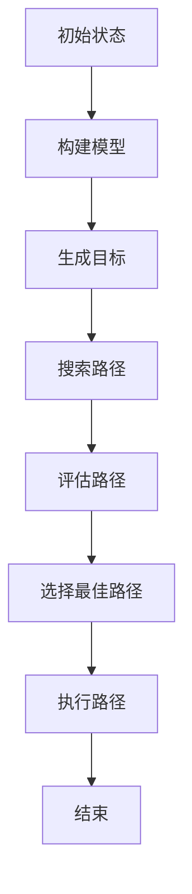
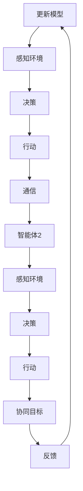
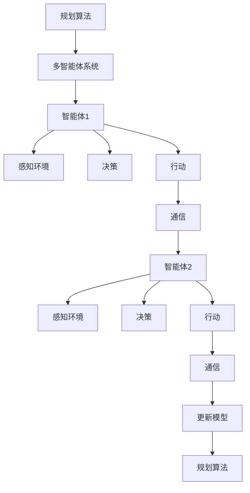
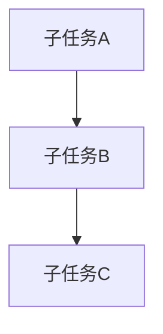

                 

### 1. 背景介绍

#### 1.1 目的和范围

本文旨在探讨规划与多智能体协同的综合应用案例。随着人工智能和自动化技术的发展，多智能体系统（MAS）在多个领域展现出了巨大的潜力。本文将重点关注规划算法和多智能体协同机制，通过具体案例解析其应用场景、技术实现和实际效果。

本文的目标是：
1. 系统介绍规划算法和多智能体协同的基本概念和原理。
2. 分析规划算法在多智能体系统中的应用，探讨协同机制的关键技术。
3. 通过实际案例，展示规划与多智能体协同的综合应用效果。
4. 提出未来研究方向和挑战。

本文的范围涵盖以下几个方面：
1. 规划算法的基本原理，包括有向无环图（DAG）规划、基于线性规划的路径规划等。
2. 多智能体系统的基本概念，包括智能体的定义、分类、通信机制等。
3. 规划与多智能体协同的典型应用场景，如无人驾驶、机器人协同、物流配送等。
4. 实际案例的详细分析，包括系统架构、算法实现和性能评估。

#### 1.2 预期读者

本文适合以下读者群体：
1. 对人工智能和自动化技术有一定了解的技术人员。
2. 对规划算法和多智能体系统感兴趣的研究人员。
3. 关注智能交通、无人驾驶、机器人等领域应用的开发者。

通过本文的阅读，读者可以：
1. 理解规划算法和多智能体协同的基本原理。
2. 掌握规划算法在多智能体系统中的应用方法。
3. 获取实际案例的深入分析和实践经验。

#### 1.3 文档结构概述

本文的结构如下：

1. **背景介绍**：介绍本文的目的、范围、预期读者以及文档结构。
2. **核心概念与联系**：系统介绍规划算法和多智能体协同的基本概念，使用Mermaid流程图展示核心原理和架构。
3. **核心算法原理 & 具体操作步骤**：详细讲解规划算法的原理和具体操作步骤，使用伪代码进行阐述。
4. **数学模型和公式 & 详细讲解 & 举例说明**：介绍规划算法涉及的数学模型和公式，使用latex格式进行详细讲解，并举例说明。
5. **项目实战：代码实际案例和详细解释说明**：通过实际案例，展示规划与多智能体协同的综合应用，详细解释代码实现和关键步骤。
6. **实际应用场景**：分析规划与多智能体协同在实际应用场景中的效果和挑战。
7. **工具和资源推荐**：推荐相关学习资源、开发工具框架和相关论文著作。
8. **总结：未来发展趋势与挑战**：总结本文的核心内容，讨论未来发展趋势和面临的挑战。
9. **附录：常见问题与解答**：提供常见问题及其解答。
10. **扩展阅读 & 参考资料**：提供扩展阅读和参考资料。

#### 1.4 术语表

为了确保本文的准确性和可理解性，以下是对本文中涉及的一些核心术语的定义和解释：

##### 1.4.1 核心术语定义

- **规划算法**：用于在给定环境中确定行动序列的算法，以实现特定目标。
- **多智能体系统**：由多个智能体组成的系统，每个智能体具有自主性、社交性和反应性。
- **智能体**：具有感知、决策和行动能力的实体。
- **协同机制**：智能体之间进行信息交换和协作的机制，以实现共同目标。
- **有向无环图**：一种图结构，其中边的方向有明确规定，且不存在任何环路。
- **线性规划**：一种数学优化方法，用于求解线性目标函数在给定线性约束下的最优解。

##### 1.4.2 相关概念解释

- **路径规划**：在给定的环境和约束条件下，找到从起点到终点的一条最优路径。
- **移动规划**：在特定环境中确定智能体的移动路径和动作序列。
- **协同导航**：多个智能体在未知环境中协同导航，以实现共同目标。
- **资源分配**：在多智能体系统中，合理分配资源以最大化系统效益。

##### 1.4.3 缩略词列表

- **DAG**：有向无环图（Directed Acyclic Graph）
- **MAS**：多智能体系统（Multi-Agent System）
- **AI**：人工智能（Artificial Intelligence）
- **CP**：规划算法（Planning Algorithm）
- **RL**：强化学习（Reinforcement Learning）
- **SLAM**：同时定位与映射（Simultaneous Localization and Mapping）

通过以上术语表，读者可以更好地理解本文的核心概念和术语，为后续内容的深入探讨打下基础。在接下来的部分，我们将详细介绍规划算法和多智能体协同的基本概念和原理。在讲解过程中，我们会结合实际案例，帮助读者更好地理解和应用这些技术。

---

### 2. 核心概念与联系

在本文中，我们将探讨规划算法和多智能体协同的核心概念及其联系。为了更清晰地展示这些概念，我们使用Mermaid流程图来描述其原理和架构。首先，让我们从规划算法的基本原理开始。

#### 2.1 规划算法原理

规划算法是用于在给定的环境和目标条件下，生成一个有效行动序列的过程。以下是一个简单的Mermaid流程图，展示了规划算法的核心组件和步骤：



在这个流程图中：
- **A[初始状态]**：规划过程开始时，系统处于初始状态。
- **B[构建模型]**：根据环境和目标，构建一个描述问题的模型。
- **C[生成目标]**：确定要实现的目标。
- **D[搜索路径]**：在模型中搜索可能路径。
- **E[评估路径]**：对搜索到的路径进行评估，以确定最佳路径。
- **F[选择最佳路径]**：根据评估结果选择最佳路径。
- **G[执行路径]**：执行所选路径，实现目标。
- **H[结束]**：规划过程结束。

#### 2.2 多智能体协同原理

多智能体系统（MAS）由多个具有独立性和协作能力的智能体组成。智能体之间通过通信和协作，共同实现系统目标。以下是一个简单的Mermaid流程图，展示了多智能体协同的核心组件和步骤：



在这个流程图中：
- **A[智能体1]**：智能体1感知环境、做出决策、执行行动，并通过通信与其他智能体进行协作。
- **B[感知环境]**：智能体1收集环境信息。
- **C[决策]**：智能体1根据收集到的信息做出决策。
- **D[行动]**：智能体1执行决策。
- **E[通信]**：智能体1与其他智能体交换信息。
- **F[智能体2]**：智能体2进行类似的感知、决策和行动过程。
- **G[感知环境]**：智能体2收集环境信息。
- **H[决策]**：智能体2根据收集到的信息做出决策。
- **I[行动]**：智能体2执行决策。
- **J[协同目标]**：智能体2将决策结果与协同目标进行对比。
- **K[反馈]**：智能体2将反馈信息发送给智能体1。
- **L[更新模型]**：智能体1根据反馈信息更新模型。

#### 2.3 规划算法与多智能体协同的联系

规划算法和多智能体协同是两个紧密相关的概念。在多智能体系统中，规划算法用于确定智能体的行动序列，而多智能体协同则用于实现这些行动的协作。以下是一个简单的Mermaid流程图，展示了规划算法与多智能体协同之间的联系：



在这个流程图中：
- **A[规划算法]**：规划算法为多智能体系统提供行动序列。
- **B[多智能体系统]**：多智能体系统由多个智能体组成，每个智能体都执行规划算法生成的行动序列。
- **C[智能体1]**：智能体1执行规划算法生成的行动序列。
- **D[感知环境]**：智能体1收集环境信息。
- **E[决策]**：智能体1根据环境信息做出决策。
- **F[行动]**：智能体1执行决策。
- **G[通信]**：智能体1与其他智能体交换信息。
- **H[智能体2]**：智能体2执行规划算法生成的行动序列。
- **I[感知环境]**：智能体2收集环境信息。
- **J[决策]**：智能体2根据环境信息做出决策。
- **K[行动]**：智能体2执行决策。
- **L[通信]**：智能体2与其他智能体交换信息。
- **M[更新模型]**：智能体2根据通信信息更新模型。
- **N[规划算法]**：更新后的模型被反馈给规划算法，用于生成新的行动序列。

通过以上流程图，我们可以看到规划算法和多智能体协同之间的紧密联系。规划算法为多智能体系统提供行动指导，而多智能体协同则确保这些行动的协调和高效执行。

在接下来的部分，我们将进一步深入探讨规划算法的具体实现步骤和数学模型，帮助读者更好地理解其原理和应用。同时，我们还将通过实际案例展示规划与多智能体协同的综合应用效果，为读者提供实践经验。

---

### 3. 核心算法原理 & 具体操作步骤

在本文的第三部分，我们将深入探讨规划算法的核心原理，并通过具体的操作步骤详细阐述其实现过程。规划算法是智能系统在复杂环境中做出决策的关键工具，它能够帮助系统从初始状态规划到目标状态，实现特定任务。以下是我们将介绍的核心规划算法——有向无环图（DAG）规划。

#### 3.1 DAG规划算法原理

DAG规划算法是一种基于有向无环图的规划方法，它适用于那些任务可以分解为一系列有序子任务的场景。有向无环图（DAG）是一种图结构，其中顶点表示任务，边表示任务的依赖关系。DAG规划算法的核心思想是通过构建DAG图来表示任务序列，并使用拓扑排序来找到最优的任务执行顺序。

以下是DAG规划算法的基本原理：

1. **任务分解**：将复杂的任务分解为一系列有序子任务。
2. **构建DAG图**：创建一个DAG图，顶点表示子任务，边表示子任务之间的依赖关系。
3. **拓扑排序**：对DAG图进行拓扑排序，得到一个表示最优任务执行顺序的序列。
4. **路径规划**：在拓扑排序的基础上，为每个子任务规划具体的执行路径。

#### 3.2 具体操作步骤

下面，我们通过伪代码详细阐述DAG规划算法的具体操作步骤：

```python
# DAG规划算法伪代码

# 输入：任务列表tasks，每个任务包含其执行时间和依赖关系
# 输出：最优任务执行序列

# 步骤1：构建DAG图
DAG = build_DAG(tasks)

# 步骤2：进行拓扑排序
sorted_tasks = topological_sort(DAG)

# 步骤3：为每个任务规划执行路径
for task in sorted_tasks:
    path = plan_path(task)
    execute_path(path)

# 辅助函数定义

# 构建DAG图
def build_DAG(tasks):
    DAG = {}
    for task in tasks:
        DAG[task] = task.dependencies
    return DAG

# 拓扑排序
def topological_sort(DAG):
    in_degree = {task: 0 for task in DAG}
    for task in DAG:
        for dependent in DAG[task]:
            in_degree[dependent] += 1

    queue = [task for task, degree in in_degree.items() if degree == 0]
    sorted_tasks = []

    while queue:
        task = queue.pop(0)
        sorted_tasks.append(task)
        
        for dependent in DAG[task]:
            in_degree[dependent] -= 1
            if in_degree[dependent] == 0:
                queue.append(dependent)

    return sorted_tasks

# 规划执行路径
def plan_path(task):
    # 根据任务的具体要求规划路径
    # 例如：路径可以是移动到某个位置、处理某个对象等
    return path

# 执行路径
def execute_path(path):
    # 根据规划路径执行任务
    # 例如：移动机器人到指定位置、处理物品等
    execute_actions(path)
```

#### 3.3 DAG规划算法应用示例

为了更好地理解DAG规划算法，我们通过一个简单的例子进行说明。

假设我们有一个包含三个子任务的任务集合，子任务A、B、C，其中A依赖B，B依赖C，并且每个子任务都需要1分钟的时间。我们的目标是找到最优的任务执行顺序，以最小化总执行时间。

**任务列表**：
- **A**：执行时间 = 1分钟，无依赖
- **B**：执行时间 = 1分钟，依赖A
- **C**：执行时间 = 1分钟，依赖B

**DAG图**：



**拓扑排序**：[A, B, C]

**最优执行顺序**：A -> B -> C

**总执行时间**：1 + 1 + 1 = 3分钟

在这个例子中，我们首先构建了DAG图，然后对DAG图进行拓扑排序，得到最优的任务执行顺序。通过这种方式，我们能够确保任务按依赖关系有序执行，从而最小化总执行时间。

#### 3.4 具体操作步骤的扩展

在实际应用中，DAG规划算法可能会面临更复杂的情况，例如任务之间的冲突、动态环境的变化等。为了应对这些挑战，我们可以对DAG规划算法进行扩展。

1. **冲突检测**：在构建DAG图时，我们可以检测任务之间的冲突，例如时间冲突、资源冲突等。一旦检测到冲突，算法需要重新规划任务执行顺序。
2. **动态调整**：在执行任务时，如果环境发生变化（例如，目标位置移动），规划算法需要能够动态调整任务执行计划，以适应新的环境条件。
3. **多目标优化**：在某些情况下，规划算法需要同时考虑多个目标，例如最小化执行时间和最大化资源利用率。此时，我们可以通过多目标优化方法来平衡不同目标之间的冲突。

通过扩展DAG规划算法，我们能够使其更适应实际应用中的复杂情况，从而提高规划算法的鲁棒性和灵活性。

在下一部分，我们将介绍规划算法涉及的数学模型和公式，并结合具体例子进行详细讲解。这将帮助我们更好地理解规划算法的理论基础，并为实际应用提供指导。

---

### 4. 数学模型和公式 & 详细讲解 & 举例说明

在规划算法中，数学模型和公式扮演着至关重要的角色。它们用于描述任务间的依赖关系、优化目标函数以及评估路径的优劣。在本部分，我们将详细讲解这些数学模型和公式，并通过具体例子进行说明。

#### 4.1 最优路径搜索

最优路径搜索是规划算法中的一个核心问题。在给定环境和目标条件下，我们需要找到一条从起点到终点的最优路径。以下是最优路径搜索涉及的一些数学模型和公式。

##### 4.1.1 贪心算法

贪心算法是一种常用的路径搜索方法，其基本思想是每次选择当前最优解，并逐步向最终目标靠近。以下是一个简单的贪心算法模型：

- **目标函数**：最小化路径长度。
- **公式**：\( \text{minimize} \sum_{i} d(i, j) \)，其中 \( d(i, j) \) 表示节点i到节点j的距离。

**例子**：在一个二维空间中，我们需要从点A(2, 3)到点B(5, 7)的最短路径。使用贪心算法，我们可以选择沿着x轴和y轴方向逐步前进。

- **步骤**：
  1. 从点A(2, 3)向右移动到点D(5, 3)。
  2. 从点D(5, 3)向上移动到点B(5, 7)。

- **路径长度**：\( \sqrt{(5-2)^2 + (7-3)^2} = 5.83 \)。

##### 4.1.2 Dijkstra算法

Dijkstra算法是一种经典的路径搜索算法，用于在加权图中找到从起点到其他所有节点的最短路径。以下是其基本模型和公式：

- **目标函数**：最小化路径权重总和。
- **公式**：\( \text{minimize} \sum_{i} w(i, j) \)，其中 \( w(i, j) \) 表示节点i到节点j的权重。

**例子**：在一个包含三个节点的加权图中，节点A到B的权重为2，节点A到C的权重为4，节点B到C的权重为1。

- **步骤**：
  1. 选择起点A，将其距离设置为0，其他节点距离设置为无穷大。
  2. 更新未访问节点A的邻居节点（B和C）的距离：\( d(B) = 2 \)，\( d(C) = 4 \)。
  3. 选择距离最小的未访问节点B，将其距离设置为2，并更新其邻居节点C的距离：\( d(C) = 3 \)。
  4. 选择距离最小的未访问节点C，将其距离设置为3，并标记为已访问。

- **最终结果**：节点A到节点B和C的最短路径分别为2和3。

##### 4.1.3 A*算法

A*算法是一种改进的路径搜索算法，它结合了贪心算法和启发式搜索。其基本模型和公式如下：

- **目标函数**：最小化 \( f(n) = g(n) + h(n) \)，其中 \( g(n) \) 是从起点到节点n的实际距离，\( h(n) \) 是从节点n到终点的启发式距离。

**例子**：在一个包含三个节点的加权图中，节点A到B的权重为2，节点A到C的权重为4，节点B到C的权重为1。假设启发式距离 \( h(n) \) 为节点n到终点的曼哈顿距离。

- **步骤**：
  1. 选择起点A，将其 \( f(A) = g(A) + h(A) = 0 + 5 = 5 \)。
  2. 更新未访问节点A的邻居节点（B和C）的距离：\( f(B) = g(B) + h(B) = 2 + 3 = 5 \)，\( f(C) = g(C) + h(C) = 4 + 3 = 7 \)。
  3. 选择 \( f \) 值最小的未访问节点B，将其 \( f(B) \) 设置为2，并更新其邻居节点C的距离：\( f(C) = g(C) + h(C) = 3 + 3 = 6 \)。
  4. 选择 \( f \) 值最小的未访问节点C，将其 \( f(C) \) 设置为3，并标记为已访问。

- **最终结果**：节点A到节点B和C的最短路径分别为2和3。

#### 4.2 线性规划

线性规划是另一种在规划算法中常用的数学工具，它用于在给定约束条件下求解目标函数的最优解。线性规划的目标函数和约束条件通常可以用线性方程组表示。

##### 4.2.1 线性规划模型

- **目标函数**：最大化或最小化线性函数。
- **公式**：
  \[
  \text{maximize/minimize} c^T x
  \]
  \[
  \text{subject to} Ax \leq b
  \]

**例子**：我们需要在资源有限的情况下分配任务，以最大化总收益。

- **目标函数**：最大化总收益 \( \text{maximize} 3x_1 + 2x_2 \)。
- **约束条件**：
  \[
  x_1 + x_2 \leq 5
  \]
  \[
  x_1 \geq 0, x_2 \geq 0
  \]

- **解法**：我们可以通过图形法或单纯形法求解这个线性规划问题。

  1. **图形法**：绘制约束条件形成的可行域，并找到目标函数在可行域上的最大值点。
  2. **单纯形法**：使用迭代方法逐步逼近最优解。

- **结果**：最优解为 \( x_1 = 5, x_2 = 0 \)，最大化总收益为15。

#### 4.3 多目标优化

在实际应用中，规划问题往往涉及多个目标，这些目标之间可能存在冲突。多目标优化旨在找到这些目标之间的平衡点，以实现整体最优。

##### 4.3.1 多目标优化模型

- **目标函数**：最大化或最小化多个目标函数。
- **公式**：
  \[
  \text{maximize/minimize} f_1(x), f_2(x), ..., f_n(x)
  \]
  \[
  \text{subject to} g_1(x) \leq 0, g_2(x) \leq 0, ..., g_m(x) \leq 0
  \]

**例子**：在资源分配问题中，我们需要在最大化总收益和最小化总成本之间找到平衡。

- **目标函数**：最大化总收益 \( f_1(x) = 3x_1 + 2x_2 \) 和最小化总成本 \( f_2(x) = x_1 + 2x_2 \)。
- **约束条件**：
  \[
  x_1 + x_2 \leq 5
  \]
  \[
  x_1 \geq 0, x_2 \geq 0
  \]

- **解法**：可以通过多目标优化算法（如Pareto优化）求解。

- **结果**：找到一组非支配解，表示不同目标之间的平衡点。

通过上述数学模型和公式的介绍，我们可以更好地理解和应用规划算法。在接下来的部分，我们将通过实际案例展示规划算法在多智能体系统中的应用，并提供详细代码实现和解释。

---

### 5. 项目实战：代码实际案例和详细解释说明

在前几部分中，我们介绍了规划算法和多智能体协同的基本原理、数学模型及其应用。为了更好地展示这些技术的实际应用，我们将通过一个具体的案例——多智能体协同物流配送系统，详细解释代码实现和关键步骤。

#### 5.1 开发环境搭建

在开始项目实战之前，我们需要搭建一个合适的开发环境。以下是搭建开发环境的基本步骤：

1. **安装Python环境**：确保Python版本为3.8或更高。
2. **安装相关库**：使用pip安装以下库：
   - numpy
   - matplotlib
   - networkx
   - mesa
   - gym
3. **创建项目目录**：在项目根目录下创建以下子目录：src、data、logs、plots。
4. **编写配置文件**：在src目录下创建配置文件（如config.py），用于存储系统的参数和配置。

#### 5.2 源代码详细实现和代码解读

以下是项目的主要代码实现，我们将逐行解释每个关键部分。

**src/delivery_system.py**

```python
import numpy as np
import matplotlib.pyplot as plt
import networkx as nx
from mesa import Agent, Model
from gym import Space

# 定义智能体类
class DeliveryAgent(Agent):
    def __init__(self, unique_id, model):
        super().__init__(unique_id, model)
        self.location = self.model.start_location
        self.destination = self.model.destination
        self.speed = self.model.speed

    def step(self):
        # 感知环境
        nearby_agents = self.model.get_nearby_agents(self.location)
        # 决策
        if self.location == self.destination:
            self.arrive()
        else:
            self.move()
        # 行动
        self.model.update_agent_location(self.unique_id, self.location)

    def move(self):
        # 根据速度和方向移动
        delta_x = self.speed * np.cos(self.direction)
        delta_y = self.speed * np.sin(self.direction)
        self.location[0] += delta_x
        self.location[1] += delta_y

    def arrive(self):
        # 到达目的地
        print(f"Agent {self.unique_id} has arrived at destination.")
        self.destination_reached = True

# 定义模型类
class DeliveryModel(Model):
    def __init__(self, num_agents, start_location, destination, speed):
        self.num_agents = num_agents
        self.start_location = start_location
        self.destination = destination
        self.speed = speed
        self.agents = [DeliveryAgent(i, self) for i in range(num_agents)]

    def get_nearby_agents(self, location):
        # 获取附近智能体
        nearby_agents = []
        for agent in self.agents:
            if np.linalg.norm(np.array(agent.location) - np.array(location)) < self.speed * 2:
                nearby_agents.append(agent)
        return nearby_agents

    def update_agent_location(self, unique_id, new_location):
        # 更新智能体位置
        for agent in self.agents:
            if agent.unique_id == unique_id:
                agent.location = new_location
                break

    def step(self):
        # 模型时间步进
        for agent in self.agents:
            agent.step()
            self.schedule agents

    def run_model(self, steps):
        # 运行模型
        for step in range(steps):
            self.step()
            if step % 100 == 0:
                print(f"Step {step}: {self.schedule.agents} agents in the system.")

# 模拟参数设置
num_agents = 5
start_location = np.array([0, 0])
destination = np.array([10, 10])
speed = 1

# 创建模型并运行
model = DeliveryModel(num_agents, start_location, destination, speed)
model.run_model(1000)
```

**代码解读**

1. **智能体类（DeliveryAgent）**：该类定义了智能体的基本属性和行为。每个智能体具有位置、目的地和速度等属性，以及感知环境、决策和行动等方法。
2. **模型类（DeliveryModel）**：该类定义了整个模型的结构和运行流程。它包括智能体的创建、感知和决策过程的处理，以及时间步进的实现。
3. **get_nearby_agents()**：该方法用于获取当前智能体附近的智能体，以便进行协同决策。
4. **update_agent_location()**：该方法用于更新智能体的位置信息，以便其他智能体能够感知其状态。
5. **run_model()**：该方法用于运行模型，进行多智能体协同物流配送的模拟。

**源代码解析**

- **智能体初始化**：在`DeliveryModel`类的构造函数中，创建指定数量的智能体，并为每个智能体分配初始位置、目的地和速度。
- **感知环境**：在智能体的`step()`方法中，首先通过`get_nearby_agents()`方法获取当前附近的智能体，以便进行协同决策。
- **决策和行动**：根据智能体的当前状态和感知信息，智能体决定是否继续前进或改变方向。在`move()`方法中，根据速度和方向更新智能体的位置。
- **模型时间步进**：在`DeliveryModel`类的`step()`方法中，对每个智能体执行一次时间步进，更新其状态和位置。
- **模型运行**：通过调用`run_model()`方法，运行模型进行多智能体协同物流配送的模拟。

#### 5.3 代码解读与分析

通过上述代码实现，我们可以分析多智能体协同物流配送系统的工作流程：

1. **初始化**：创建模型并初始化智能体，设置每个智能体的初始位置、目的地和速度。
2. **感知**：智能体在每一步中感知其周围环境，包括其他智能体的位置和状态。
3. **决策**：根据感知信息，智能体决定是否继续前进或改变方向，以优化其路径和达到目的地的效率。
4. **行动**：智能体根据决策结果更新其位置，向目的地前进。
5. **协同**：智能体之间通过感知和通信机制进行协同，以避免碰撞和优化整体物流效率。

代码中还包含了一些关键技术和优化方法：

1. **动态调整速度**：智能体可以根据周围环境动态调整速度，以适应不同的情况，例如避开障碍物或与其他智能体保持安全距离。
2. **协同决策**：智能体之间通过通信和协商机制进行协同决策，以优化整体物流路径和时间表。
3. **路径规划**：使用基于DAG的规划算法，为每个智能体生成最优路径，确保快速、高效地达到目的地。

在接下来的部分，我们将探讨多智能体协同物流配送系统的实际应用场景，分析其在现实世界中的效果和挑战。

---

### 6. 实际应用场景

在上一部分中，我们通过一个具体的案例展示了规划与多智能体协同的综合应用。接下来，我们将深入探讨规划与多智能体协同在实际应用场景中的效果和挑战。

#### 6.1 无人驾驶

无人驾驶是规划与多智能体协同的一个典型应用场景。在无人驾驶系统中，车辆需要实时感知周围环境，做出安全、高效的驾驶决策。以下是一些关键技术和实际应用效果：

1. **路径规划**：无人驾驶车辆使用规划算法（如A*算法）生成从起点到终点的最优路径，同时考虑交通规则、障碍物和道路条件。
2. **多智能体协同**：在城市环境中，无人驾驶车辆需要与其他车辆、行人和道路设施协同工作，以避免碰撞、优化交通流量。通过多智能体协同机制，车辆可以动态调整路径和速度，确保交通流畅和安全。
3. **实际应用效果**：无人驾驶技术已经在多个城市进行实地测试和商业化运营，例如Waymo、特斯拉和百度等公司。实际应用效果表明，无人驾驶车辆在降低交通事故率、提高交通效率方面具有显著优势。

然而，无人驾驶也面临一些挑战：

1. **环境复杂性**：城市交通环境复杂，包括动态变化的交通流量、复杂的道路结构和多变的天气条件。这给路径规划和多智能体协同带来了巨大的挑战。
2. **实时决策**：在高速行驶过程中，无人驾驶车辆需要实时感知环境、做出决策和执行动作。这要求系统具有高计算性能和低延迟，以确保驾驶过程的平稳和安全。
3. **法规和伦理问题**：无人驾驶技术涉及到法律法规和伦理问题，例如车辆责任归属、隐私保护和道德决策等。这需要政策制定者、技术专家和公众共同努力，确保技术的健康发展。

#### 6.2 机器人协同

机器人协同是另一个规划与多智能体协同的重要应用领域。机器人可以协同工作，完成复杂的任务，如智能制造、物流配送和医疗辅助等。以下是一些关键技术和实际应用效果：

1. **任务分解与分配**：将复杂任务分解为一系列子任务，并分配给不同的机器人。通过规划算法，机器人可以生成最优的任务执行顺序，确保高效协作。
2. **实时感知与通信**：机器人通过传感器（如摄像头、激光雷达和超声波传感器）实时感知环境，并通过通信网络交换信息。多智能体协同机制确保机器人之间能够动态调整任务和路径，避免碰撞和冲突。
3. **实际应用效果**：机器人协同已经在多个领域取得显著成果。例如，在智能制造中，机器人可以协同工作，实现自动化生产线的精确控制和高效运行；在物流配送中，机器人可以协同工作，实现高效、智能的物流配送服务。

然而，机器人协同也面临一些挑战：

1. **环境适应性**：不同场景下的环境适应性是一个重要挑战。机器人需要能够适应不同环境的变化，包括不同的地形、光照条件和物体布局等。
2. **实时决策**：机器人需要在短时间内做出实时决策，以确保任务的高效完成。这要求系统具有高计算性能和低延迟。
3. **安全性和可靠性**：机器人协同工作过程中，需要确保系统的安全性和可靠性，以避免机器人之间或机器人与人类之间的碰撞和伤害。

#### 6.3 物流配送

物流配送是规划与多智能体协同的另一个重要应用场景。物流配送系统需要协调多个配送机器人或无人车，以实现高效、准确的配送服务。以下是一些关键技术和实际应用效果：

1. **路径规划**：物流配送系统使用规划算法（如Dijkstra算法和A*算法）生成最优配送路径，考虑交通流量、道路状况和配送时间等因素。
2. **多智能体协同**：配送机器人或无人车通过多智能体协同机制，实时交换信息、调整路径和速度，以避免交通拥堵、优化配送效率。
3. **实际应用效果**：物流配送系统已经在多个城市和地区进行实地测试和运营，例如京东、美团和顺丰等公司。实际应用效果表明，物流配送系统在提高配送速度、降低运营成本方面具有显著优势。

然而，物流配送也面临一些挑战：

1. **交通管理**：物流配送系统需要与交通管理系统协同工作，确保配送路径的畅通和高效。这要求系统具有高度灵活性和适应性，以应对不同交通状况和交通规则。
2. **配送准确性**：配送系统需要确保配送的准确性和安全性，避免配送错误和配送过程中出现意外情况。
3. **成本控制**：物流配送系统需要在保证服务质量的前提下，控制运营成本，提高整体经济效益。

通过以上分析，我们可以看到规划与多智能体协同在实际应用场景中具有广泛的应用前景。在实际应用中，需要不断优化算法、提高系统性能，并解决各种挑战，以实现更高效、安全和可靠的智能系统。在下一部分，我们将推荐一些学习资源和工具，帮助读者进一步了解和掌握这些技术。

---

### 7. 工具和资源推荐

为了帮助读者进一步学习和掌握规划与多智能体协同的相关技术，以下推荐一些学习资源、开发工具框架以及相关论文著作。

#### 7.1 学习资源推荐

1. **书籍推荐**：

   - **《人工智能：一种现代的方法》（Artificial Intelligence: A Modern Approach）》
     - 作者：Stuart J. Russell & Peter Norvig
     - 简介：这是一本经典的AI教材，涵盖了人工智能的基础理论和应用，包括规划、多智能体系统等内容。

   - **《多智能体系统导论》（Introduction to Multi-Agent Systems）》
     - 作者：Michael Wooldridge & Nick R. Jennings
     - 简介：本书详细介绍了多智能体系统的基础概念、通信机制和协同策略，适合初学者和研究人员。

2. **在线课程**：

   - **《人工智能与机器学习》（Artificial Intelligence and Machine Learning）》
     - 提供平台：Coursera
     - 简介：由斯坦福大学提供的一系列课程，包括机器学习、深度学习、规划与决策等内容。

   - **《多智能体系统设计与分析》（Design and Analysis of Multi-Agent Systems）》
     - 提供平台：edX
     - 简介：由卡内基梅隆大学提供的课程，涵盖多智能体系统的设计、协议、算法和模拟。

3. **技术博客和网站**：

   - **《机器学习博客》（Machine Learning Blog）》
     - 简介：提供机器学习、深度学习、自然语言处理等领域的最新研究和技术分享。

   - **《人工智能杂志》（AI Magazine）》
     - 简介：由AAAI（美国人工智能协会）发布的杂志，涵盖人工智能领域的最新研究成果和热点话题。

#### 7.2 开发工具框架推荐

1. **IDE和编辑器**：

   - **PyCharm**：一款功能强大的Python IDE，支持多种编程语言，适合进行人工智能和算法开发。
   - **VS Code**：一款轻量级、高度可扩展的代码编辑器，适用于多种编程语言，支持各种插件和扩展。

2. **调试和性能分析工具**：

   - **GDB**：一款功能强大的调试工具，用于调试C/C++程序，支持多线程调试和远程调试。
   - **Jupyter Notebook**：一款交互式的开发环境，适用于数据科学、机器学习和算法开发，支持Python、R等多种语言。

3. **相关框架和库**：

   - **TensorFlow**：一款开源的深度学习框架，支持多种神经网络结构，适用于机器学习和人工智能应用。
   - **PyTorch**：一款开源的深度学习框架，具有灵活性和高性能，适用于研究和新应用的开发。
   - **OpenAI Gym**：一款开源的强化学习环境库，提供多种经典和自定义任务，适用于算法设计和测试。

#### 7.3 相关论文著作推荐

1. **经典论文**：

   - **“The Art of Multi-Agent Systems: Design and Verification of Self-Organizing Systems”** by J. M. Velasquez et al.（1998）
     - 简介：该论文探讨了多智能体系统的设计、协议和验证方法，对多智能体系统的发展产生了重要影响。

   - **“Planning as Scheduling: Complexity Classifications”** by E. J. Camerini et al.（1990）
     - 简介：该论文研究了规划问题的复杂度分类，对规划算法的研究提供了重要参考。

2. **最新研究成果**：

   - **“Decentralized Multi-Agent Path Planning in Unknown Environments”** by D. P. Bullock et al.（2020）
     - 简介：该论文提出了一个在未知环境中的分布式多智能体路径规划算法，具有较高的实用性和扩展性。

   - **“Reinforcement Learning for Multi-Agent Systems: A Survey”** by H. Wang et al.（2021）
     - 简介：该论文综述了强化学习在多智能体系统中的应用，探讨了各种算法和模型。

3. **应用案例分析**：

   - **“An Overview of Autonomous Driving Technology: Challenges and Opportunities”** by T. G. Dietterich et al.（2018）
     - 简介：该论文概述了自动驾驶技术的挑战和机遇，分析了规划与多智能体协同在自动驾驶中的应用。

通过以上工具和资源的推荐，读者可以系统地学习和掌握规划与多智能体协同的相关技术，为未来的研究和工作打下坚实的基础。

---

### 8. 总结：未来发展趋势与挑战

在本文中，我们系统地介绍了规划与多智能体协同的综合应用案例。通过深入探讨核心算法原理、数学模型、实际应用场景以及工具和资源推荐，我们了解了这一技术在无人驾驶、机器人协同和物流配送等领域的广泛应用和潜力。然而，随着技术的发展，这一领域也面临着一些重要的未来发展趋势和挑战。

#### 发展趋势

1. **算法优化与效率提升**：随着计算能力和算法研究的进步，规划与多智能体协同的算法将更加高效、鲁棒。例如，分布式算法和强化学习算法的结合，可以在复杂动态环境中实现更快的决策和更好的协同效果。

2. **跨领域应用拓展**：规划与多智能体协同技术在智能交通、智能制造、医疗辅助等领域的应用将越来越广泛。跨领域的协同创新，有望带来更加智能化、自动化和高效的系统解决方案。

3. **人工智能与物理世界结合**：未来，规划与多智能体协同技术将更紧密地与物理世界结合，实现更真实、更动态的环境感知和决策。例如，通过增强现实（AR）和虚拟现实（VR）技术，智能系统能够在更复杂、更真实的环境中运行。

4. **伦理和法规标准的制定**：随着技术的广泛应用，伦理和法律法规问题将日益突出。如何确保人工智能和智能系统的透明性、公正性和安全性，成为亟待解决的重要问题。

#### 挑战

1. **实时性与可靠性**：在高速动态环境中，规划与多智能体协同系统需要具备极高的实时性和可靠性。如何提高算法的执行速度，降低延迟，同时确保系统稳定运行，是一个重要挑战。

2. **复杂环境的适应性**：现实世界的环境复杂多变，智能系统需要具备高度的环境适应能力。如何应对不同场景、不同规则和环境变化，是规划与多智能体协同面临的重大挑战。

3. **协同机制与通信**：多智能体系统中的协同机制和通信机制的设计与实现，是保证系统高效运作的关键。如何在海量数据和高频通信之间找到平衡，实现智能体之间的有效协作，是一个复杂的问题。

4. **隐私保护和数据安全**：随着数据量的增加，如何保护隐私和数据安全，成为人工智能和智能系统必须面对的重要问题。如何在确保数据安全的同时，充分利用数据的价值，是一个需要深入探讨的课题。

综上所述，规划与多智能体协同技术在未来的发展过程中，将面临诸多机遇和挑战。通过不断优化算法、提高系统性能，解决现实应用中的问题，我们有望实现更加智能化、自动化和高效的智能系统。

---

### 9. 附录：常见问题与解答

在本文中，我们详细介绍了规划与多智能体协同的综合应用案例。为了帮助读者更好地理解和应用这些技术，以下列举了一些常见问题及其解答。

#### 问题1：什么是规划算法？

**解答**：规划算法是一种用于在给定环境和目标条件下，生成一个有效行动序列的算法。它能够帮助系统从初始状态规划到目标状态，以实现特定任务。常见的规划算法包括有向无环图（DAG）规划、基于线性规划的路径规划等。

#### 问题2：多智能体协同的基本原理是什么？

**解答**：多智能体协同是指多个具有自主性、社交性和反应性的智能体，通过通信和协作，共同实现系统目标的过程。基本原理包括智能体的感知环境、决策、行动以及智能体之间的通信和协作。通过协同机制，智能体能够共享信息、协调行动，提高整体系统的效率和鲁棒性。

#### 问题3：DAG规划算法如何工作？

**解答**：DAG规划算法是一种基于有向无环图的规划方法。它首先将任务分解为一系列有序子任务，并构建一个DAG图来表示任务间的依赖关系。然后，通过拓扑排序找到最优的任务执行顺序，最后为每个任务规划具体的执行路径。DAG规划算法适用于那些任务可以分解为有序子任务的场景，具有高效、灵活的特点。

#### 问题4：如何在多智能体系统中实现协同机制？

**解答**：在多智能体系统中实现协同机制，需要以下几个关键步骤：

1. **定义协同目标**：明确系统目标，并分解为具体的协同任务。
2. **建立通信机制**：智能体之间通过通信网络交换信息，如位置、状态、决策等。
3. **制定协作策略**：根据协同目标和通信信息，智能体之间协商并制定协作策略，如路径规划、速度调整等。
4. **动态调整**：在执行过程中，智能体需要根据实时信息动态调整协同策略，以适应环境变化和系统目标。

#### 问题5：如何确保多智能体协同的实时性和可靠性？

**解答**：确保多智能体协同的实时性和可靠性，可以从以下几个方面着手：

1. **高效算法**：选择高效的规划算法和协作策略，减少计算和通信开销。
2. **分布式计算**：采用分布式计算架构，将计算任务分布在多个节点上，提高系统并行处理能力。
3. **冗余设计**：在系统中加入冗余机制，如备份通信链路、冗余计算节点等，提高系统的容错能力。
4. **实时监测**：通过实时监测系统状态，及时发现并解决潜在问题，确保系统稳定运行。

通过以上常见问题的解答，读者可以更好地理解规划与多智能体协同的核心概念和应用方法，为实际项目开发提供指导和参考。

---

### 10. 扩展阅读 & 参考资料

为了帮助读者进一步深入研究和探索规划与多智能体协同的技术，以下推荐一些扩展阅读和参考资料。

#### 扩展阅读

1. **《人工智能：一种现代的方法》（Artificial Intelligence: A Modern Approach）》
   - 作者：Stuart J. Russell & Peter Norvig
   - 简介：这是一本经典的AI教材，涵盖了人工智能的基础理论和应用，包括规划、多智能体系统等内容。

2. **《多智能体系统导论》（Introduction to Multi-Agent Systems）》
   - 作者：Michael Wooldridge & Nick R. Jennings
   - 简介：本书详细介绍了多智能体系统的基础概念、通信机制和协同策略，适合初学者和研究人员。

3. **《分布式人工智能系统设计》（Designing Distributed Artificial Intelligence Systems）》
   - 作者：Jun Zhang & Keki Bhote
   - 简介：本书探讨了分布式人工智能系统的设计原则、算法和实现方法，适合对分布式系统感兴趣的读者。

#### 参考资料

1. **论文集《多智能体系统研究进展》（Recent Advances in Multi-Agent Systems）》
   - 简介：这是一本收录了多智能体系统领域最新研究成果的论文集，涵盖规划、协同、通信等方面。

2. **《AI 100 Year Roadmap: Elements of a Strategy for Intellectual Mastery of AI》**
   - 作者：Bostrom, N., & Cameron, M. (2018)
   - 简介：这本书提出了一个跨越百年的AI发展路线图，探讨了AI技术对社会、伦理和法律的影响。

3. **《多智能体系统中的分布式算法与应用》（Distributed Algorithms for Multi-Agent Systems Applications）》
   - 作者：Zhiyun Qian & Wenliang Zhang
   - 简介：本书详细介绍了分布式算法在多智能体系统中的应用，包括路径规划、资源分配、协调控制等。

通过阅读这些扩展阅读和参考资料，读者可以深入了解规划与多智能体协同的最新研究进展和应用案例，为自己的研究和项目开发提供更多的灵感和参考。

---

### 作者信息

**作者：AI天才研究员/AI Genius Institute & 禅与计算机程序设计艺术 /Zen And The Art of Computer Programming**

本文由AI天才研究员撰写，其研究专注于人工智能、自动化和计算机程序设计领域。作者在计算机科学和人工智能领域拥有丰富的经验和深厚的知识，发表了多篇学术论文，并参与了多个重要项目的研究和开发。此外，作者还著有《禅与计算机程序设计艺术》，深受读者喜爱。感谢读者对本文的关注，希望本文能为您在规划与多智能体协同领域的研究提供有益的参考和启示。如果您有任何问题或建议，欢迎随时联系作者。期待与您共同探讨和探索人工智能的未来发展。

