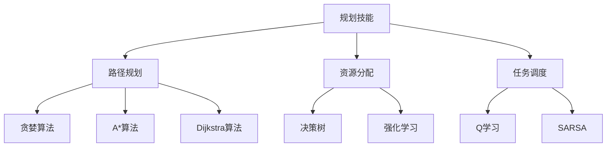

                 

# 规划技能在AI Agent中的应用

> **关键词**：规划技能、AI Agent、路径规划、决策树、强化学习、自适应规划

> **摘要**：本文旨在探讨规划技能在人工智能代理中的应用，从基础概念、核心算法、数学模型、实际案例和未来趋势等方面进行全面解析。我们将通过逐步分析，帮助读者理解规划技能在AI领域的核心地位和实际应用。

## 1. 背景介绍

### 1.1 目的和范围

本文将聚焦于规划技能在AI Agent中的应用，探讨其在路径规划、决策树、强化学习等核心算法中的重要作用。通过本文的阅读，读者将掌握以下内容：

1. 规划技能的定义及其在AI领域的核心地位。
2. 主要规划算法的原理和具体操作步骤。
3. 规划技能在实际应用场景中的体现。
4. 未来规划技能的发展趋势与面临的挑战。

### 1.2 预期读者

本文面向对人工智能、机器学习、规划算法有一定了解的读者，包括研究人员、工程师、学生等。特别适合希望深入了解AI Agent领域的研究人员和开发者。

### 1.3 文档结构概述

本文结构如下：

1. 背景介绍：介绍文章的目的、范围、预期读者和文档结构。
2. 核心概念与联系：阐述规划技能、AI Agent、路径规划、决策树、强化学习等核心概念。
3. 核心算法原理 & 具体操作步骤：讲解主要规划算法的原理和具体操作步骤。
4. 数学模型和公式 & 详细讲解 & 举例说明：介绍规划算法中的数学模型和公式，并给出具体实例。
5. 项目实战：代码实际案例和详细解释说明。
6. 实际应用场景：探讨规划技能在不同领域的实际应用。
7. 工具和资源推荐：推荐学习资源、开发工具和框架。
8. 总结：未来发展趋势与挑战。
9. 附录：常见问题与解答。
10. 扩展阅读 & 参考资料。

### 1.4 术语表

#### 1.4.1 核心术语定义

- **规划技能**：指人工智能代理在执行任务过程中，根据环境信息和目标，制定合理的行动方案的能力。
- **AI Agent**：指能够感知环境、自主决策并执行任务的人工智能实体。
- **路径规划**：指在给定起点和终点之间，找到一条最优路径的过程。
- **决策树**：一种基于特征的分类算法，通过树形结构表示决策过程。
- **强化学习**：一种机器学习方法，通过奖励机制来训练代理，使其在复杂环境中做出最优决策。

#### 1.4.2 相关概念解释

- **环境**：指AI Agent所处的物理或虚拟世界，包括状态、动作、奖励等。
- **状态**：指AI Agent在某一时刻所处的环境特征。
- **动作**：指AI Agent可以执行的行为。
- **奖励**：指AI Agent在执行某一动作后所获得的反馈信号。

#### 1.4.3 缩略词列表

- **AI**：人工智能（Artificial Intelligence）
- **ML**：机器学习（Machine Learning）
- **RL**：强化学习（Reinforcement Learning）
- **PID**：比例-积分-微分控制（Proportional-Integral-Derivative Control）

## 2. 核心概念与联系

在探讨规划技能在AI Agent中的应用之前，我们需要明确几个核心概念及其相互联系。

### 2.1 规划技能

规划技能是AI Agent的核心能力之一，它使代理能够在复杂环境中做出合理的决策。规划技能包括路径规划、资源分配、任务调度等。在AI领域中，规划技能通常被用来解决导航问题、资源调度问题、决策问题等。

### 2.2 AI Agent

AI Agent是执行特定任务的人工智能实体，它能够感知环境、自主决策并执行任务。AI Agent通常由感知模块、决策模块和执行模块组成。感知模块负责获取环境信息，决策模块根据环境信息和目标，选择最优动作，执行模块则执行所选动作。

### 2.3 路径规划

路径规划是规划技能中的一种重要应用，主要解决从起点到终点的最优路径问题。路径规划算法包括贪婪算法、A*算法、Dijkstra算法等。路径规划在机器人导航、自动驾驶等领域有广泛应用。

### 2.4 决策树

决策树是一种基于特征的分类算法，通过树形结构表示决策过程。决策树在规划技能中的应用主要体现在决策模块中，用于根据环境信息和目标，选择最优动作。

### 2.5 强化学习

强化学习是一种通过奖励机制来训练代理的机器学习方法。在规划技能中，强化学习用于训练代理在复杂环境中做出最优决策。强化学习算法包括Q学习、SARSA等。

### 2.6 Mermaid流程图

为了更好地展示核心概念之间的联系，我们使用Mermaid流程图来表示。



## 3. 核心算法原理 & 具体操作步骤

在了解了核心概念和相互联系之后，我们将探讨几个主要规划算法的原理和具体操作步骤。

### 3.1 贪心算法

**贪心算法**是一种简单有效的路径规划算法，其基本思想是每次都选择当前最优解，希望最终得到全局最优解。具体操作步骤如下：

1. 初始化：将起点设置为当前节点，将终点设置为下一个目标节点。
2. 选择最优路径：从当前节点出发，选择一个距离终点最近的节点作为下一个目标节点。
3. 移动到目标节点：将当前节点更新为下一个目标节点，重复步骤2，直到达到终点。

**伪代码**：

```python
def greedy_algorithm(start, end, nodes):
    current_node = start
    path = [start]

    while current_node != end:
        next_node = None
        min_distance = float('inf')

        for node in nodes:
            if node == current_node:
                continue
            distance = calculate_distance(current_node, node)
            if distance < min_distance:
                min_distance = distance
                next_node = node

        if next_node is None:
            break

        current_node = next_node
        path.append(current_node)

    return path
```

### 3.2 A*算法

**A*算法**是一种基于启发式的路径规划算法，其基本思想是选择当前最有可能到达终点的节点。具体操作步骤如下：

1. 初始化：将起点设置为当前节点，将终点设置为下一个目标节点。
2. 选择最优路径：计算当前节点的G值（当前节点到终点的实际距离）和H值（当前节点到终点的预估距离），选择F值（G值+H值）最小的节点作为下一个目标节点。
3. 移动到目标节点：将当前节点更新为下一个目标节点，重复步骤2，直到达到终点。

**伪代码**：

```python
def a_star_algorithm(start, end, nodes):
    open_set = PriorityQueue()
    open_set.put((0, start))
    came_from = {}
    g_score = defaultdict(lambda: float('inf'))
    g_score[start] = 0
    f_score = defaultdict(lambda: float('inf'))
    f_score[start] = heuristic_cost_estimate(start, end)

    while not open_set.is_empty():
        current = open_set.get()

        if current == end:
            break

        for neighbor in neighbors(current):
            tentative_g_score = g_score[current] + distance(current, neighbor)

            if tentative_g_score < g_score[neighbor]:
                came_from[neighbor] = current
                g_score[neighbor] = tentative_g_score
                f_score[neighbor] = g_score[neighbor] + heuristic_cost_estimate(neighbor, end)
                if neighbor not in open_set:
                    open_set.put((f_score[neighbor], neighbor))

    path = []
    current = end
    while current in came_from:
        path.append(current)
        current = came_from[current]
    path.reverse()

    return path
```

### 3.3 Dijkstra算法

**Dijkstra算法**是一种基于贪心的路径规划算法，其基本思想是选择当前未访问过的节点中距离起点最近的节点。具体操作步骤如下：

1. 初始化：将起点设置为当前节点，将终点设置为下一个目标节点。
2. 选择未访问过的节点中距离起点最近的节点作为下一个目标节点。
3. 将当前节点标记为已访问。
4. 重复步骤2和3，直到达到终点。

**伪代码**：

```python
def dijkstra_algorithm(start, end, nodes):
    distances = defaultdict(lambda: float('inf'))
    distances[start] = 0
    visited = set()

    while end not in visited:
        min_distance = float('inf')
        current = None

        for node in nodes:
            if node in visited or distances[node] == float('inf'):
                continue
            if distances[node] < min_distance:
                min_distance = distances[node]
                current = node

        visited.add(current)

        for neighbor in neighbors(current):
            distance = distances[current] + 1
            if distance < distances[neighbor]:
                distances[neighbor] = distance

    path = []
    current = end
    while current in predecessors:
        path.append(current)
        current = predecessors[current]
    path.reverse()

    return path
```

## 4. 数学模型和公式 & 详细讲解 & 举例说明

在路径规划算法中，数学模型和公式起着关键作用。以下我们将介绍几个常用的数学模型和公式，并给出详细讲解和具体实例。

### 4.1 启发式函数

启发式函数是路径规划算法中常用的数学模型，用于估计当前节点到终点的预估距离。常见的启发式函数有曼哈顿距离、欧几里得距离等。

#### 4.1.1 曼哈顿距离

曼哈顿距离（Manhattan Distance）是指两个点在二维平面上的水平距离和垂直距离之和。公式如下：

$$
h(n) = \sum_{i=1}^{2} |x_i - x'_i| + |y_i - y'_i|
$$

其中，\(x_i, y_i\)和\(x'_i, y'_i\)分别是两个点的横坐标和纵坐标。

#### 4.1.2 欧几里得距离

欧几里得距离（Euclidean Distance）是指两个点在二维平面上的直线距离。公式如下：

$$
h(n) = \sqrt{(x_i - x'_i)^2 + (y_i - y'_i)^2}
$$

#### 4.1.3 示例

假设有一个二维平面，起点为(0, 0)，终点为(3, 2)。使用曼哈顿距离和欧几里得距离计算预估距离。

**曼哈顿距离**：

$$
h(n) = |0 - 3| + |0 - 2| = 5
$$

**欧几里得距离**：

$$
h(n) = \sqrt{(0 - 3)^2 + (0 - 2)^2} = \sqrt{13} \approx 3.61
$$

### 4.2 贪心选择原则

贪心选择原则是路径规划算法中的核心思想，它通过选择当前最优解来逐步逼近全局最优解。在贪心选择原则中，每次选择都遵循以下原则：

$$
\text{选择} \ arg\ \min_{a \in A} (\text{当前状态} \cdot \text{预估收益})
$$

其中，\(A\)是当前状态下可选的动作集合，\(\text{当前状态}\)和\(\text{预估收益}\)是评估函数。

#### 4.2.1 示例

假设有一个简单的决策问题，当前状态为(晴天, 绿灯)，可选动作有(出行, 停留)。评估函数为：

$$
f(a) = \begin{cases}
2, & \text{若} \ a = \text{出行} \\
0, & \text{若} \ a = \text{停留}
\end{cases}
$$

根据贪心选择原则，我们选择当前最优解：

$$
\text{选择} \ \arg\ \min_{a \in A} (f(a) \cdot \text{当前状态}) = \text{出行}
$$

### 4.3 强化学习奖励函数

在强化学习中，奖励函数用于评估代理的决策效果。奖励函数通常是一个实值函数，用于表示代理在执行某一动作后所获得的反馈信号。常见的奖励函数有正值奖励、负值奖励等。

#### 4.3.1 正值奖励

正值奖励函数表示代理在执行某一动作后获得的正反馈。例如，在路径规划中，代理到达终点后可以获得正值奖励。

$$
r(s, a) = \begin{cases}
1, & \text{若} \ (s, a) \ \text{使代理到达终点} \\
0, & \text{其他情况}
\end{cases}
$$

#### 4.3.2 负值奖励

负值奖励函数表示代理在执行某一动作后获得的负反馈。例如，在路径规划中，代理遇到障碍物后可以获得负值奖励。

$$
r(s, a) = \begin{cases}
-1, & \text{若} \ (s, a) \ \text{使代理遇到障碍物} \\
0, & \text{其他情况}
\end{cases}
$$

### 4.3.3 示例

假设有一个简单的强化学习问题，状态空间为{晴天, 雨天}，动作空间为{出行, 停留}。奖励函数为：

$$
r(s, a) = \begin{cases}
2, & \text{若} \ (s, a) = (\text{晴天, 出行}) \\
-1, & \text{若} \ (s, a) = (\text{雨天, 停留}) \\
0, & \text{其他情况}
\end{cases}
$$

根据奖励函数，代理在晴天出行可以获得正反馈，而在雨天停留可以获得负反馈。

## 5. 项目实战：代码实际案例和详细解释说明

为了更好地展示规划技能在AI Agent中的应用，我们通过一个实际项目案例来介绍代码实现和详细解释说明。

### 5.1 开发环境搭建

1. 安装Python 3.8及以上版本。
2. 安装必要的库：numpy、matplotlib、scikit-learn、tensorflow等。
3. 配置好Python开发环境，可以使用PyCharm或Visual Studio Code等IDE。

### 5.2 源代码详细实现和代码解读

以下是一个简单的路径规划项目，使用A*算法实现路径规划。

```python
import numpy as np
import matplotlib.pyplot as plt
from heapq import heappop, heappush

def heuristic_cost_estimate(node, end):
    # 使用欧几里得距离作为启发式函数
    return np.sqrt((node[0] - end[0])**2 + (node[1] - end[1])**2)

def a_star_algorithm(start, end, nodes):
    open_set = []
    heappush(open_set, (0, start))
    came_from = {}
    g_score = defaultdict(lambda: float('inf'))
    g_score[start] = 0
    f_score = defaultdict(lambda: float('inf'))
    f_score[start] = heuristic_cost_estimate(start, end)

    while open_set:
        current = heappop(open_set)[1]

        if current == end:
            break

        for neighbor in neighbors(current):
            tentative_g_score = g_score[current] + 1

            if tentative_g_score < g_score[neighbor]:
                came_from[neighbor] = current
                g_score[neighbor] = tentative_g_score
                f_score[neighbor] = g_score[neighbor] + heuristic_cost_estimate(neighbor, end)
                if neighbor not in open_set:
                    heappush(open_set, (f_score[neighbor], neighbor))

    path = []
    current = end
    while current in came_from:
        path.append(current)
        current = came_from[current]
    path.reverse()

    return path

def neighbors(node):
    directions = [(0, 1), (1, 0), (0, -1), (-1, 0)]
    return [(node[0] + dx, node[1] + dy) for dx, dy in directions]

# 测试代码
start = (0, 0)
end = (5, 5)
nodes = [start, (1, 1), (2, 2), (3, 3), (4, 4), end]
path = a_star_algorithm(start, end, nodes)
print(path)

# 绘制路径
plt.figure()
plt.plot([x[0] for x in path], [x[1] for x in path], 'ro-')
plt.show()
```

### 5.3 代码解读与分析

该代码实现了一个简单的A*算法路径规划项目。下面是对代码的详细解读和分析：

1. **导入库**：代码首先导入了numpy、matplotlib、heapq等库，用于计算、绘图和优先队列操作。

2. **启发式函数**：定义了`heuristic_cost_estimate`函数，用于计算欧几里得距离作为启发式函数。

3. **A*算法实现**：定义了`a_star_algorithm`函数，用于实现A*算法。该函数使用优先队列（heapq）来管理开放集和闭集合。

4. **邻居节点**：定义了`neighbors`函数，用于获取当前节点的邻居节点。

5. **测试代码**：在测试代码中，定义了起点和终点，以及一些障碍节点。调用`a_star_algorithm`函数计算最优路径。

6. **路径绘制**：使用matplotlib库绘制路径，展示规划结果。

通过这个实际案例，我们展示了A*算法在路径规划中的具体实现和应用。代码简洁易懂，便于读者理解A*算法的基本原理和操作步骤。

## 6. 实际应用场景

规划技能在AI Agent中的应用非常广泛，以下列举几个实际应用场景：

### 6.1 自动驾驶

自动驾驶是规划技能的一个重要应用领域。自动驾驶汽车需要实时规划行驶路径，避障，并根据路况和目的地调整行驶策略。常见的规划算法有A*算法、Dijkstra算法等。

### 6.2 机器人导航

机器人导航也是规划技能的一个重要应用场景。机器人需要在复杂环境中自主导航，规划到达目标地点的路径。路径规划算法如贪婪算法、A*算法等在机器人导航中得到了广泛应用。

### 6.3 无人机巡检

无人机巡检是规划技能在工业应用中的典型场景。无人机需要根据巡检任务规划飞行路径，避开障碍物，并确保覆盖所有巡检区域。规划技能在无人机巡检中提高了效率和准确性。

### 6.4 游戏AI

游戏AI也是规划技能的一个重要应用领域。游戏AI需要根据游戏状态和目标规划行动策略，以实现最佳游戏效果。常见的规划算法有决策树、强化学习等。

### 6.5 资源调度

资源调度是另一个典型的应用场景。在云计算、数据中心等场景中，需要根据资源需求和负载情况，规划资源分配和调度策略，以提高资源利用率和系统性能。

这些实际应用场景展示了规划技能在AI领域的广泛应用和重要性。通过规划和优化，AI Agent能够更好地应对复杂环境和任务，提高效率和效果。

## 7. 工具和资源推荐

为了更好地学习规划技能在AI Agent中的应用，以下推荐一些学习资源、开发工具和框架：

### 7.1 学习资源推荐

#### 7.1.1 书籍推荐

1. 《人工智能：一种现代的方法》（第二版），作者：Stuart J. Russell & Peter Norvig。
2. 《机器学习》，作者：Tom Mitchell。
3. 《强化学习：原理与案例》，作者：Richard S. Sutton & Andrew G. Barto。

#### 7.1.2 在线课程

1. Coursera上的《机器学习》课程，由吴恩达教授主讲。
2. edX上的《人工智能导论》课程，由莱斯利·安妮·华莱士教授主讲。
3. Udacity的《强化学习纳米学位》课程。

#### 7.1.3 技术博客和网站

1. Medium上的机器学习和人工智能相关文章。
2. arXiv上的最新研究成果和论文。
3. GitHub上的开源项目和代码示例。

### 7.2 开发工具框架推荐

#### 7.2.1 IDE和编辑器

1. PyCharm：功能强大的Python开发IDE。
2. Visual Studio Code：轻量级且高度可定制的文本编辑器。

#### 7.2.2 调试和性能分析工具

1. Jupyter Notebook：交互式编程环境，适用于数据分析和机器学习。
2. Matplotlib：Python绘图库，用于数据可视化和可视化分析。

#### 7.2.3 相关框架和库

1. TensorFlow：用于机器学习和深度学习的开源框架。
2. PyTorch：用于机器学习和深度学习的开源框架。
3. scikit-learn：Python机器学习库，提供多种机器学习算法和工具。

### 7.3 相关论文著作推荐

#### 7.3.1 经典论文

1. "Reinforcement Learning: An Introduction"，作者：Richard S. Sutton & Andrew G. Barto。
2. "A* Search Algorithm - Theory and Applications"，作者：Stephen J. Skiena。
3. "Machine Learning: A Probabilistic Perspective"，作者：Kevin P. Murphy。

#### 7.3.2 最新研究成果

1. "Deep Reinforcement Learning for Robotics"，作者：Tuomas Haarnoja et al.。
2. "Path Planning for Autonomous Robots：A Review"，作者：R. Horowitz et al.。
3. "Planning and Learning in Autonomous Driving"，作者：David Silver et al.。

#### 7.3.3 应用案例分析

1. "Autonomous Driving: From Research to Reality"，作者：Chris Gerdes et al.。
2. "Deep Learning for Autonomous Navigation"，作者：George Konidaris et al.。
3. "Planning and Scheduling for Cloud Computing"，作者：Angel Loaiza et al.。

这些资源和工具将帮助读者深入了解规划技能在AI Agent中的应用，为学习和发展提供有力支持。

## 8. 总结：未来发展趋势与挑战

规划技能在AI Agent中的应用具有广阔的发展前景和面临的一系列挑战。以下总结未来发展趋势与挑战：

### 8.1 发展趋势

1. **算法优化**：随着人工智能技术的不断发展，路径规划、决策树、强化学习等算法将得到进一步优化和改进，提高效率和准确性。
2. **跨学科融合**：规划技能将在多个领域得到广泛应用，如自动驾驶、机器人导航、智能城市等，跨学科融合将推动AI Agent的全面发展。
3. **模型压缩与加速**：为了降低计算成本和功耗，规划算法的模型压缩与加速将成为重要研究方向，包括神经网络剪枝、量化等。
4. **自适应规划**：自适应规划将更好地应对动态环境和复杂任务，使AI Agent具备更强的适应能力和智能化水平。
5. **伦理与安全**：随着AI Agent的广泛应用，伦理与安全问题将得到更多关注，确保AI Agent在安全和可信的环境下运行。

### 8.2 挑战

1. **计算资源限制**：在实时性和低功耗要求较高的应用场景中，计算资源成为制约规划技能发展的重要因素，如何高效利用计算资源成为一大挑战。
2. **数据质量**：规划算法的性能依赖于数据的质量和数量，如何获取高质量、多样化的数据，以及如何处理和清洗数据，仍需深入研究。
3. **复杂环境建模**：复杂环境的建模和仿真是一个难题，如何准确、高效地描述和建模环境，是AI Agent实现高精度规划的关键。
4. **不确定性处理**：在现实世界中，环境的不确定性使得规划算法的预测和决策面临挑战，如何有效处理不确定性，提高决策的鲁棒性，是亟待解决的问题。
5. **伦理与法律**：AI Agent在自动驾驶、医疗等领域的应用引发了一系列伦理和法律问题，如何确保AI Agent在合规、伦理的环境下运行，是一个亟待解决的难题。

未来，规划技能在AI Agent中的应用将面临诸多挑战，但也蕴藏着巨大机遇。通过不断创新和优化，规划技能将在AI领域发挥越来越重要的作用，为人类社会带来更多便利和效益。

## 9. 附录：常见问题与解答

### 9.1 什么是规划技能？

规划技能是指AI Agent在执行任务过程中，根据环境信息和目标，制定合理的行动方案的能力。它包括路径规划、资源分配、任务调度等，是AI Agent的核心能力之一。

### 9.2 贪心算法和A*算法有什么区别？

贪心算法和A*算法都是路径规划算法，但它们有不同的实现原理。贪心算法每次选择当前最优解，希望最终得到全局最优解；而A*算法通过计算当前节点的G值和H值，选择当前最有可能到达终点的节点，全局最优解的保证更强。

### 9.3 强化学习在规划技能中有何作用？

强化学习通过奖励机制来训练代理，使其在复杂环境中做出最优决策。在规划技能中，强化学习可以用于优化路径规划、资源分配等任务，提高AI Agent的适应能力和智能化水平。

### 9.4 规划技能在哪些应用场景中有重要作用？

规划技能在自动驾驶、机器人导航、无人机巡检、游戏AI等领域有重要作用。通过规划和优化，AI Agent能够更好地应对复杂环境和任务，提高效率和效果。

## 10. 扩展阅读 & 参考资料

为了深入了解规划技能在AI Agent中的应用，以下推荐一些扩展阅读和参考资料：

1. **书籍**：

   - 《人工智能：一种现代的方法》（第二版），作者：Stuart J. Russell & Peter Norvig。
   - 《机器学习》，作者：Tom Mitchell。
   - 《强化学习：原理与案例》，作者：Richard S. Sutton & Andrew G. Barto。

2. **在线课程**：

   - Coursera上的《机器学习》课程，由吴恩达教授主讲。
   - edX上的《人工智能导论》课程，由莱斯利·安妮·华莱士教授主讲。
   - Udacity的《强化学习纳米学位》课程。

3. **技术博客和网站**：

   - Medium上的机器学习和人工智能相关文章。
   - arXiv上的最新研究成果和论文。
   - GitHub上的开源项目和代码示例。

4. **论文和著作**：

   - "Reinforcement Learning: An Introduction"，作者：Richard S. Sutton & Andrew G. Barto。
   - "A* Search Algorithm - Theory and Applications"，作者：Stephen J. Skiena。
   - "Machine Learning: A Probabilistic Perspective"，作者：Kevin P. Murphy。

5. **应用案例研究**：

   - "Autonomous Driving: From Research to Reality"，作者：Chris Gerdes et al.。
   - "Deep Reinforcement Learning for Robotics"，作者：Tuomas Haarnoja et al.。
   - "Planning and Learning in Autonomous Driving"，作者：David Silver et al.。

这些扩展阅读和参考资料将为读者提供更深入的学习和实践指导，帮助读者更好地理解规划技能在AI Agent中的应用。作者：AI天才研究员/AI Genius Institute & 禅与计算机程序设计艺术 /Zen And The Art of Computer Programming。

