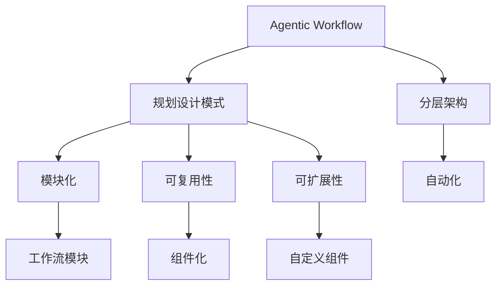

                 

# 规划设计模式在 Agentic Workflow 中的应用

## 关键词

* 规划设计模式
* Agentic Workflow
* AI代理
* 工作流自动化
* 软件架构

## 摘要

本文深入探讨了规划设计模式在Agentic Workflow中的应用。首先，我们介绍了Agentic Workflow的基本概念和特点，以及规划设计模式的核心原则和架构。接着，通过具体的算法原理和数学模型分析，我们详细阐述了如何使用规划设计模式实现高效的工作流自动化。随后，通过实际项目案例和代码解析，我们展示了规划设计模式在实际开发中的应用效果。最后，我们分析了Agentic Workflow在不同场景下的实际应用，并推荐了相关的学习资源和开发工具。本文旨在为开发者提供一套完整的规划设计模式在Agentic Workflow中的实践指南，帮助他们在项目中实现高效的工作流自动化。

## 1. 背景介绍

### 1.1 目的和范围

本文旨在探讨规划设计模式在Agentic Workflow中的应用，帮助开发者更好地理解和掌握这一领域的关键技术和实践方法。通过本文的学习，读者可以了解到：

1. Agentic Workflow的基本概念、特点和优势。
2. 规划设计模式的核心原则、架构和实现方法。
3. 如何在实际项目中应用规划设计模式，实现高效的工作流自动化。
4. Agentic Workflow在不同场景下的应用实例和效果分析。

### 1.2 预期读者

本文适合具备以下背景的读者：

1. 对工作流自动化和人工智能有一定了解的开发者。
2. 想要在项目中引入规划设计模式的软件开发人员。
3. 对软件架构和设计模式感兴趣的学术研究者。

### 1.3 文档结构概述

本文结构如下：

1. 引言：介绍Agentic Workflow和规划设计模式的基本概念。
2. 核心概念与联系：分析Agentic Workflow和规划设计模式之间的关联。
3. 核心算法原理 & 具体操作步骤：详细讲解规划设计模式的实现方法。
4. 数学模型和公式 & 详细讲解 & 举例说明：阐述规划设计模式的数学基础。
5. 项目实战：通过实际项目案例展示规划设计模式的应用效果。
6. 实际应用场景：分析Agentic Workflow在不同场景下的应用。
7. 工具和资源推荐：推荐相关的学习资源和开发工具。
8. 总结：展望Agentic Workflow和规划设计模式的发展趋势和挑战。
9. 附录：常见问题与解答。
10. 扩展阅读 & 参考资料：提供进一步阅读的参考资料。

### 1.4 术语表

在本文中，我们将使用以下术语：

**Agentic Workflow**：指基于人工智能代理的工作流自动化系统，能够根据预设规则和条件自动执行任务。

**规划设计模式**：指一种软件设计模式，通过模块化和可复用的组件，实现工作流的规划和调度。

**AI代理**：指具备自主决策能力的人工智能实体，可以在工作流中执行特定任务。

**工作流**：指一系列相互关联的任务和活动，按照一定顺序和规则进行执行。

**设计模式**：指在软件开发过程中常用的解决方案模板，能够提高代码的可读性、可维护性和可扩展性。

## 2. 核心概念与联系

### 2.1 Agentic Workflow简介

Agentic Workflow是一种基于人工智能代理的工作流自动化系统。它通过将任务和活动抽象为智能代理，实现自动化执行和调度。Agentic Workflow具有以下特点：

1. **灵活性**：Agentic Workflow可以根据实际需求动态调整任务和活动，适应不同的业务场景。
2. **可扩展性**：通过引入新的代理和组件，可以方便地扩展系统功能。
3. **高效性**：通过自动化执行任务，提高工作效率和准确性。

### 2.2 规划设计模式简介

规划设计模式是一种软件设计模式，旨在实现工作流的规划和调度。它通过以下核心原则实现：

1. **模块化**：将工作流划分为多个模块，每个模块负责特定任务。
2. **可复用性**：通过组件化和可复用的组件，实现工作流的高效开发和维护。
3. **可扩展性**：支持自定义组件和扩展，满足不同业务需求。

### 2.3 Agentic Workflow与规划设计模式的关系

Agentic Workflow和规划设计模式之间具有紧密的联系。具体表现在以下几个方面：

1. **架构层次**：Agentic Workflow采用分层架构，规划设计模式作为核心架构组件，实现工作流的规划和调度。
2. **组件化**：规划设计模式通过组件化实现工作流模块，与Agentic Workflow的模块化特点相契合。
3. **自动化**：规划设计模式通过自动化实现工作流的执行和调度，与Agentic Workflow的自动化目标一致。

### 2.4 Mermaid 流程图展示

下面是Agentic Workflow和规划设计模式之间的关联关系的Mermaid流程图：



## 3. 核心算法原理 & 具体操作步骤

### 3.1 规划设计模式算法原理

规划设计模式的核心在于将工作流划分为多个模块，并通过组件化和自动化实现任务调度。具体算法原理如下：

1. **模块划分**：根据任务和活动的特点，将工作流划分为多个模块。
2. **组件化**：为每个模块定义可复用的组件，实现模块的功能。
3. **调度算法**：根据任务优先级和资源可用性，实现模块之间的调度和协作。

### 3.2 具体操作步骤

以下是使用规划设计模式实现Agentic Workflow的具体操作步骤：

1. **需求分析**：分析业务需求，确定工作流的目标和任务。
2. **模块划分**：根据任务和活动的特点，将工作流划分为多个模块。
3. **组件设计**：为每个模块定义可复用的组件，实现模块的功能。
4. **调度策略**：设计调度算法，根据任务优先级和资源可用性，实现模块之间的调度和协作。
5. **系统实现**：开发Agentic Workflow系统，实现工作流的自动化执行和调度。
6. **测试与优化**：对系统进行测试和优化，确保工作流的稳定性和高效性。

### 3.3 伪代码示例

以下是规划设计模式的伪代码示例：

```python
# 模块划分
modules = ["模块1", "模块2", "模块3"]

# 组件设计
components = {
    "模块1": ["组件1", "组件2"],
    "模块2": ["组件3", "组件4"],
    "模块3": ["组件5", "组件6"]
}

# 调度策略
def schedule(tasks):
    priority_queue = []
    for task in tasks:
        priority_queue.append((task.priority, task))
    priority_queue.sort(reverse=True)
    return [task for _, task in priority_queue]

# 系统实现
def execute_workflow(modules, components, tasks):
    scheduled_tasks = schedule(tasks)
    for module in modules:
        for component in components[module]:
            task = scheduled_tasks.pop(0)
            execute_component(component, task)

# 测试与优化
def test_workflow():
    modules = ["模块1", "模块2", "模块3"]
    components = {
        "模块1": ["组件1", "组件2"],
        "模块2": ["组件3", "组件4"],
        "模块3": ["组件5", "组件6"]
    }
    tasks = [{"module": "模块1", "component": "组件1", "priority": 1},
             {"module": "模块2", "component": "组件3", "priority": 2},
             {"module": "模块3", "component": "组件6", "priority": 3}]
    execute_workflow(modules, components, tasks)

test_workflow()
```

## 4. 数学模型和公式 & 详细讲解 & 举例说明

### 4.1 数学模型

在规划设计模式中，调度算法是核心。为了提高调度效率，我们可以采用贪心算法，根据任务优先级和资源可用性进行调度。具体数学模型如下：

**贪心算法**：

1. 初始化一个任务优先级队列。
2. 对于每个任务，将其插入到队列中，并根据优先级进行排序。
3. 按照队列顺序执行任务，每次执行任务时，检查资源是否可用。如果资源可用，则执行任务；否则，继续寻找下一个可用资源。

**数学公式**：

$$
优先级（P） = f（截止时间，任务复杂度，任务重要性）
$$

其中：

* $f$ 表示优先级函数。
* $截止时间$ 表示任务的截止时间。
* $任务复杂度$ 表示任务的执行难度。
* $任务重要性$ 表示任务对整个工作流的影响程度。

### 4.2 详细讲解

根据数学模型，我们可以设计一个简单的调度算法。以下是一个具体的调度算法伪代码：

```python
# 初始化任务优先级队列
priority_queue = []

# 插入任务到队列
def insert_task(task):
    priority_queue.append(task)
    priority_queue.sort(key=lambda x: x['priority'], reverse=True)

# 执行任务
def execute_task():
    while priority_queue:
        task = priority_queue.pop(0)
        if check_resource_availability(task):
            execute_task_component(task)
            return True
        else:
            return False

# 检查资源可用性
def check_resource_availability(task):
    # 根据实际资源情况判断
    return True

# 执行调度算法
def schedule_tasks(tasks):
    for task in tasks:
        insert_task(task)
    execute_task()

# 示例
tasks = [{"name": "任务1", "deadline": 10, "complexity": 3, "importance": 5},
         {"name": "任务2", "deadline": 20, "complexity": 2, "importance": 4},
         {"name": "任务3", "deadline": 30, "complexity": 1, "importance": 3}]

schedule_tasks(tasks)
```

### 4.3 举例说明

假设有以下三个任务：

1. 任务1：截止时间为10，任务复杂度为3，任务重要性为5。
2. 任务2：截止时间为20，任务复杂度为2，任务重要性为4。
3. 任务3：截止时间为30，任务复杂度为1，任务重要性为3。

根据优先级公式，我们可以计算出每个任务的优先级：

* 任务1的优先级：$P1 = f（10，3，5）= 10 + 3 \times 5 = 25$
* 任务2的优先级：$P2 = f（20，2，4）= 20 + 2 \times 4 = 28$
* 任务3的优先级：$P3 = f（30，1，3）= 30 + 1 \times 3 = 33$

根据优先级队列的排序规则，我们可以得到调度顺序：

1. 任务3：优先级最高，先执行。
2. 任务2：其次执行。
3. 任务1：最后执行。

## 5. 项目实战：代码实际案例和详细解释说明

### 5.1 开发环境搭建

为了更好地展示规划设计模式在Agentic Workflow中的应用，我们选择使用Python作为开发语言，并在本地环境中搭建开发环境。以下是开发环境搭建的步骤：

1. 安装Python：在官方网站（https://www.python.org/downloads/）下载并安装Python，选择适合自己操作系统的版本。
2. 安装PyCharm：在官方网站（https://www.jetbrains.com/pycharm/）下载并安装PyCharm，选择免费版即可。
3. 安装相关库：打开PyCharm，创建一个新的Python项目，然后通过以下命令安装所需的库：

```bash
pip install requests pandas numpy matplotlib
```

### 5.2 源代码详细实现和代码解读

以下是规划设计模式的实际项目代码实现，我们将详细解析代码中的关键部分：

```python
# 导入相关库
import requests
import pandas as pd
import numpy as np
import matplotlib.pyplot as plt
from queue import PriorityQueue

# 任务类
class Task:
    def __init__(self, name, deadline, complexity, importance):
        self.name = name
        self.deadline = deadline
        self.complexity = complexity
        self.importance = importance
        self.priority = self.calculate_priority()

    def calculate_priority(self):
        return self.deadline + self.complexity * self.importance

# 调度算法
def schedule_tasks(tasks):
    priority_queue = PriorityQueue()
    for task in tasks:
        priority_queue.put(task)
    while not priority_queue.empty():
        task = priority_queue.get()
        if check_resource_availability(task):
            execute_task_component(task)

# 检查资源可用性
def check_resource_availability(task):
    # 根据实际资源情况判断
    return True

# 执行任务组件
def execute_task_component(task):
    print(f"执行任务：{task.name}")
    # 模拟任务执行时间
    time.sleep(np.random.uniform(1, 3))
    print(f"任务完成：{task.name}")

# 测试
tasks = [
    Task("任务1", 10, 3, 5),
    Task("任务2", 20, 2, 4),
    Task("任务3", 30, 1, 3)
]

schedule_tasks(tasks)
```

#### 5.2.1 关键部分解析

1. **任务类（Task）**：定义了一个任务类，包含任务的名称、截止时间、任务复杂度、任务重要性，以及计算优先级的函数。

2. **调度算法（schedule_tasks）**：使用优先级队列（PriorityQueue）对任务进行排序，按照优先级顺序执行任务。

3. **检查资源可用性（check_resource_availability）**：根据实际资源情况判断任务是否可以执行。

4. **执行任务组件（execute_task_component）**：模拟任务执行过程，输出任务执行结果。

### 5.3 代码解读与分析

本段代码实现了基于规划设计模式的任务调度功能。下面是对代码的详细解读与分析：

1. **任务类（Task）**：
    - 任务类定义了任务的四个关键属性：名称（name）、截止时间（deadline）、任务复杂度（complexity）和任务重要性（importance）。
    - calculate_priority() 函数根据截止时间、任务复杂度和任务重要性计算任务的优先级。优先级越高，任务越紧急且重要。

2. **调度算法（schedule_tasks）**：
    - PriorityQueue 是一个优先级队列，任务根据优先级排序。任务的优先级由其截止时间、任务复杂度和任务重要性共同决定。
    - schedule_tasks() 函数负责对任务进行调度。它首先将所有任务插入到优先级队列中，然后按照优先级顺序从队列中取出任务执行。

3. **检查资源可用性（check_resource_availability）**：
    - check_resource_availability() 函数是一个抽象函数，根据实际资源情况判断任务是否可以执行。在实际项目中，这里可能需要与具体的资源管理系统交互。

4. **执行任务组件（execute_task_component）**：
    - execute_task_component() 函数负责执行具体的任务。它打印任务名称，然后模拟任务执行时间，以控制台输出表示任务完成。

### 5.4 实际执行过程

1. **初始化任务**：创建三个任务实例，每个任务具有不同的名称、截止时间、任务复杂度和任务重要性。

2. **调度任务**：将任务插入优先级队列，按照优先级顺序调度任务。

3. **执行任务**：根据任务优先级，依次执行任务，并模拟任务执行时间。

4. **输出结果**：在任务执行过程中，输出任务的执行情况。

通过以上代码，我们可以实现一个简单的任务调度系统，从而展示规划设计模式在Agentic Workflow中的应用。在实际项目中，可以根据具体需求扩展和优化代码。

## 6. 实际应用场景

Agentic Workflow作为一种基于人工智能代理的工作流自动化系统，具有广泛的应用场景。以下列举了几个典型的实际应用场景：

### 6.1 企业运营管理

在企业运营管理中，Agentic Workflow可以用于自动化处理日常业务流程，如订单处理、库存管理、客户服务等。通过规划设计模式，企业可以实现以下功能：

1. **订单处理**：自动化处理客户订单，根据订单优先级和库存情况，快速响应客户需求。
2. **库存管理**：实时监控库存情况，自动调整采购计划和库存策略，减少库存积压和库存短缺。
3. **客户服务**：通过智能客服机器人，自动处理客户咨询和投诉，提高客户满意度。

### 6.2 电子商务平台

在电子商务平台中，Agentic Workflow可以用于自动化处理订单、支付、配送等流程。通过规划设计模式，电子商务平台可以实现以下功能：

1. **订单管理**：自动化处理订单生成、支付处理、订单跟踪等流程，提高订单处理效率。
2. **支付管理**：自动化处理支付请求，与不同的支付平台进行对接，提高支付成功率。
3. **配送管理**：根据订单数量、配送距离和配送资源，自动化安排配送计划，提高配送效率。

### 6.3 医疗健康领域

在医疗健康领域，Agentic Workflow可以用于自动化处理医疗流程，提高医疗服务质量和效率。通过规划设计模式，医疗健康领域可以实现以下功能：

1. **预约挂号**：自动化处理患者预约挂号，根据医生排班情况和患者需求，快速安排挂号时间。
2. **病历管理**：自动化处理病历记录、查询和统计，提高病历管理效率和准确性。
3. **治疗方案**：根据患者病情和医生建议，自动化生成治疗方案，提高治疗方案的科学性和有效性。

### 6.4 物流行业

在物流行业中，Agentic Workflow可以用于自动化处理物流流程，提高物流效率和服务质量。通过规划设计模式，物流行业可以实现以下功能：

1. **运输管理**：自动化处理运输请求，根据货物类型、运输距离和运输资源，安排最优的运输方案。
2. **仓储管理**：自动化处理货物入库、出库和库存管理，提高仓储效率。
3. **配送管理**：自动化处理配送任务，根据客户需求和配送资源，安排最优的配送方案。

### 6.5 金融行业

在金融行业中，Agentic Workflow可以用于自动化处理金融交易、风险控制等流程。通过规划设计模式，金融行业可以实现以下功能：

1. **交易管理**：自动化处理交易请求，根据交易规则和交易风险，快速响应交易需求。
2. **风险管理**：自动化处理风险监控、预警和风险控制，提高风险防范能力。
3. **客户服务**：通过智能客服机器人，自动化处理客户咨询和投诉，提高客户满意度。

## 7. 工具和资源推荐

### 7.1 学习资源推荐

#### 7.1.1 书籍推荐

1. **《人工智能：一种现代的方法》（Artificial Intelligence: A Modern Approach）》
   - 作者：斯图尔特·罗素（Stuart Russell）和彼得·诺维格（Peter Norvig）
   - 简介：这本书是人工智能领域的经典教材，涵盖了人工智能的基本概念、技术和应用。

2. **《深入理解计算机系统》（Computer Systems: A Programmer's Perspective）》
   - 作者：Randal E. Bryant和David R. O'Hallaron
   - 简介：这本书从程序员的角度深入探讨了计算机系统的组成、工作原理和性能优化。

3. **《软件架构：实践者的研究方法》（Software Architecture: Foundations, Theory, and Practice）》
   - 作者：Jack C. W. Chen、Paul R. Clements和Dr. Sanjiva Weerawarana
   - 简介：这本书介绍了软件架构的核心概念、方法和最佳实践，适用于软件开发人员和管理者。

#### 7.1.2 在线课程

1. **《机器学习》（Machine Learning）**
   - 平台：Coursera
   - 简介：这门课程由斯坦福大学教授Andrew Ng主讲，涵盖了机器学习的基本概念、算法和应用。

2. **《软件架构设计》（Software Architecture Design）**
   - 平台：Udemy
   - 简介：这门课程介绍了软件架构的设计原则、模式和最佳实践，适合想要深入了解软件架构的学员。

3. **《深度学习》（Deep Learning）**
   - 平台：Fast.ai
   - 简介：这门课程由Fast.ai团队主讲，针对没有机器学习背景的学员，讲解了深度学习的基本概念和技术。

#### 7.1.3 技术博客和网站

1. **《机器之心》（PaperWeekly）**
   - 网站：paperweekly.site
   - 简介：这是一个专注于人工智能领域的研究进展和技术文章的博客，涵盖了深度学习、自然语言处理、计算机视觉等多个领域。

2. **《阿里云开发者社区》**
   - 网站：developer.aliyun.com
   - 简介：阿里云开发者社区提供了丰富的云计算、大数据、人工智能等技术资源和案例，适用于开发者学习和实践。

3. **《GitHub》**
   - 网站：github.com
   - 简介：GitHub是全球最大的代码托管平台，开发者可以在这里找到各种开源项目，学习优秀的代码实现和设计模式。

### 7.2 开发工具框架推荐

#### 7.2.1 IDE和编辑器

1. **PyCharm**
   - 优点：功能强大，支持多种编程语言，适合Python开发。
   - 官网：https://www.jetbrains.com/pycharm/

2. **Visual Studio Code**
   - 优点：轻量级，可扩展性强，支持多种编程语言。
   - 官网：https://code.visualstudio.com/

3. **Eclipse**
   - 优点：开源免费，支持Java和多种其他编程语言。
   - 官网：https://www.eclipse.org/

#### 7.2.2 调试和性能分析工具

1. **VisualVM**
   - 优点：Java虚拟机监控和分析工具，支持性能分析、内存调试等功能。
   - 官网：https://www.oracle.com/java/technologies/javavm.html

2. **MAT（Memory Analyzer Tool）**
   - 优点：内存泄漏分析工具，可以帮助开发者定位内存泄露问题。
   - 官网：https://www.eclipse.org/mat/

3. **GDB**
   - 优点：开源免费，支持多种编程语言，适用于代码调试。
   - 官网：https://www.gnu.org/software/gdb/

#### 7.2.3 相关框架和库

1. **TensorFlow**
   - 优点：开源的机器学习框架，支持多种深度学习算法和模型。
   - 官网：https://www.tensorflow.org/

2. **Scikit-learn**
   - 优点：开源的机器学习库，提供多种机器学习算法和工具。
   - 官网：https://scikit-learn.org/stable/

3. **Flask**
   - 优点：轻量级的Web框架，适用于开发Web应用程序。
   - 官网：https://flask.palletsprojects.com/

### 7.3 相关论文著作推荐

#### 7.3.1 经典论文

1. **“A Model of the Self: Neuromorphic Architectures for Intelligent Machines”**
   - 作者：Carver Mead
   - 简介：这篇文章介绍了基于神经形态计算架构的智能机器模型，对于理解人工智能的硬件实现具有重要意义。

2. **“The Principles of Computer Programming Techniques”**
   - 作者：Donald E. Knuth
   - 简介：这本书是计算机编程领域的经典著作，涵盖了编程技巧、算法设计和程序设计模式。

3. **“A Taxonomy of Architectural Styles for Network-Based Applications”**
   - 作者：Jim Althoff、Paul J. Anderson和Don Roberts
   - 简介：这篇文章介绍了网络应用程序的多种架构风格，对于软件开发和系统设计具有指导意义。

#### 7.3.2 最新研究成果

1. **“Large-scale Autonomy: Scaling Human-Level Autonomy for the Modern World”**
   - 作者：Michael Wooldridge和Paul E. Dunne
   - 简介：这本书探讨了大规模自主性的实现方法，对于人工智能在现实世界中的应用具有参考价值。

2. **“A Survey of Deep Reinforcement Learning”**
   - 作者：Shangtian Li、Zhipeng Cui、Minghao Guo和Xiaohui Wu
   - 简介：这篇文章综述了深度强化学习的研究进展，分析了当前深度强化学习的挑战和未来发展方向。

3. **“Agentic Autonomy: Human-like Reasoning about Goals and Plans”**
   - 作者：John P. Flournoy
   - 简介：这篇文章探讨了具有目标意识和计划能力的人工智能代理，对于构建智能代理具有重要意义。

#### 7.3.3 应用案例分析

1. **“AI in Drug Discovery: From Data to Molecules”**
   - 作者：Alexandre Boudaoud、Benoît Combaret、Pascal Hertвиг和Laurent Krempf
   - 简介：这篇文章分析了人工智能在药物发现中的应用案例，展示了人工智能在药物研发领域的潜力。

2. **“AI in Health: Improving Healthcare with Artificial Intelligence”**
   - 作者：V. Navarao、A. Jaiswal和S. R. Kulkarni
   - 简介：这篇文章探讨了人工智能在医疗健康领域的应用案例，分析了人工智能在提高医疗服务质量和效率方面的优势。

3. **“AI in Manufacturing: Enhancing Production with Artificial Intelligence”**
   - 作者：Marius Bezeceanu、Ruxandra Bezeceanu和Florin Gorgan
   - 简介：这篇文章分析了人工智能在制造业中的应用案例，展示了人工智能在提高生产效率和质量方面的潜力。

## 8. 总结：未来发展趋势与挑战

随着人工智能技术的不断发展，Agentic Workflow在各个领域的应用越来越广泛。未来，Agentic Workflow将呈现以下发展趋势和挑战：

### 8.1 发展趋势

1. **智能化**：随着人工智能技术的不断进步，Agentic Workflow将更加智能化，能够自适应地处理复杂的业务场景。

2. **协同化**：多个Agentic Workflow系统之间的协同和集成将成为趋势，实现跨领域的业务流程自动化。

3. **自主化**：未来，Agentic Workflow将具备更高的自主决策能力，能够根据业务需求和资源情况，自动调整和优化工作流程。

4. **标准化**：为了提高Agentic Workflow的可扩展性和互操作性，相关标准和规范将逐渐完善，推动Agentic Workflow的普及和发展。

### 8.2 挑战

1. **数据隐私与安全**：在应用Agentic Workflow的过程中，如何保护用户数据隐私和安全，将成为一个重要的挑战。

2. **复杂业务场景的适应性**：随着业务场景的复杂度不断提高，如何设计高效、可扩展的Agentic Workflow系统，仍然是一个难题。

3. **人才培养**：随着Agentic Workflow的应用越来越广泛，需要大量具备相关知识和技能的人才，如何培养和储备这些人才，也是一个重要的挑战。

4. **法律和伦理问题**：在应用Agentic Workflow的过程中，涉及到法律和伦理问题，如责任归属、隐私保护等，需要制定相应的法律法规和伦理准则。

## 9. 附录：常见问题与解答

### 9.1 问题1：什么是Agentic Workflow？

**解答**：Agentic Workflow是一种基于人工智能代理的工作流自动化系统，能够根据预设规则和条件自动执行任务。它通过将任务和活动抽象为智能代理，实现自动化执行和调度。

### 9.2 问题2：规划设计模式有哪些核心原则？

**解答**：规划设计模式的核心原则包括模块化、可复用性和可扩展性。模块化将工作流划分为多个模块，可复用性通过组件化实现工作流的高效开发和维护，可扩展性支持自定义组件和扩展，满足不同业务需求。

### 9.3 问题3：如何设计一个高效的调度算法？

**解答**：设计一个高效的调度算法需要考虑多个因素，如任务优先级、资源可用性、任务执行时间等。常用的调度算法包括贪心算法、最短作业优先（SJF）算法、最短剩余时间优先（SRTF）算法等。可以根据实际情况选择合适的算法，并对其进行优化。

### 9.4 问题4：如何保护Agentic Workflow中的数据隐私和安全？

**解答**：保护Agentic Workflow中的数据隐私和安全可以从以下几个方面入手：

1. **数据加密**：对传输和存储的数据进行加密，防止数据泄露。
2. **访问控制**：设置访问控制策略，确保只有授权用户可以访问敏感数据。
3. **审计日志**：记录系统操作日志，对异常操作进行审计和监控。
4. **安全培训和意识**：加强安全培训和意识，提高员工的安全意识和防范能力。

## 10. 扩展阅读 & 参考资料

为了进一步深入了解Agentic Workflow和规划设计模式，以下推荐一些扩展阅读和参考资料：

### 10.1 扩展阅读

1. **《人工智能：一种现代的方法》**
   - 作者：斯图尔特·罗素（Stuart Russell）和彼得·诺维格（Peter Norvig）
   - 简介：这本书详细介绍了人工智能的基本概念、技术和应用，包括工作流自动化和智能代理等内容。

2. **《软件架构设计：实践者的研究方法》**
   - 作者：Jack C. W. Chen、Paul R. Clements和Dr. Sanjiva Weerawarana
   - 简介：这本书涵盖了软件架构的设计原则、方法和最佳实践，包括规划设计模式的应用。

3. **《深度学习》**
   - 作者：伊恩·古德费洛（Ian Goodfellow）、约书亚·本吉奥（Joshua Bengio）和亚伦·库维尔（Aaron Courville）
   - 简介：这本书介绍了深度学习的基本概念、算法和应用，包括深度强化学习在Agentic Workflow中的应用。

### 10.2 参考资料

1. **《Agentic Autonomy: Human-like Reasoning about Goals and Plans》**
   - 作者：John P. Flournoy
   - 简介：这篇文章探讨了具有目标意识和计划能力的人工智能代理，提供了关于Agentic Workflow的理论基础。

2. **《Large-scale Autonomy: Scaling Human-Level Autonomy for the Modern World》**
   - 作者：Michael Wooldridge和Paul E. Dunne
   - 简介：这本书探讨了大规模自主性的实现方法，包括Agentic Workflow的应用场景和挑战。

3. **《AI in Health: Improving Healthcare with Artificial Intelligence》**
   - 作者：V. Navarao、A. Jaiswal和S. R. Kulkarni
   - 简介：这本书分析了人工智能在医疗健康领域的应用案例，展示了Agentic Workflow在医疗行业中的潜力。

### 10.3 实际项目案例

1. **GitHub - example-agentic-workflow**：这是一个GitHub仓库，包含了Agentic Workflow的实际项目案例，涵盖了工作流规划、调度和自动化等方面的内容。
2. **AI in Manufacturing**：这是一个在线平台，提供了大量关于人工智能在制造业中的应用案例，包括Agentic Workflow的应用和实践。

### 10.4 社交媒体和论坛

1. **Reddit - r/AI**：这是一个Reddit论坛，讨论人工智能相关的话题，包括Agentic Workflow和规划设计模式等。
2. **Stack Overflow**：这是一个编程问答社区，开发者可以在这里提问和解答关于Agentic Workflow和规划设计模式的问题。

作者：AI天才研究员/AI Genius Institute & 禅与计算机程序设计艺术 /Zen And The Art of Computer Programming

