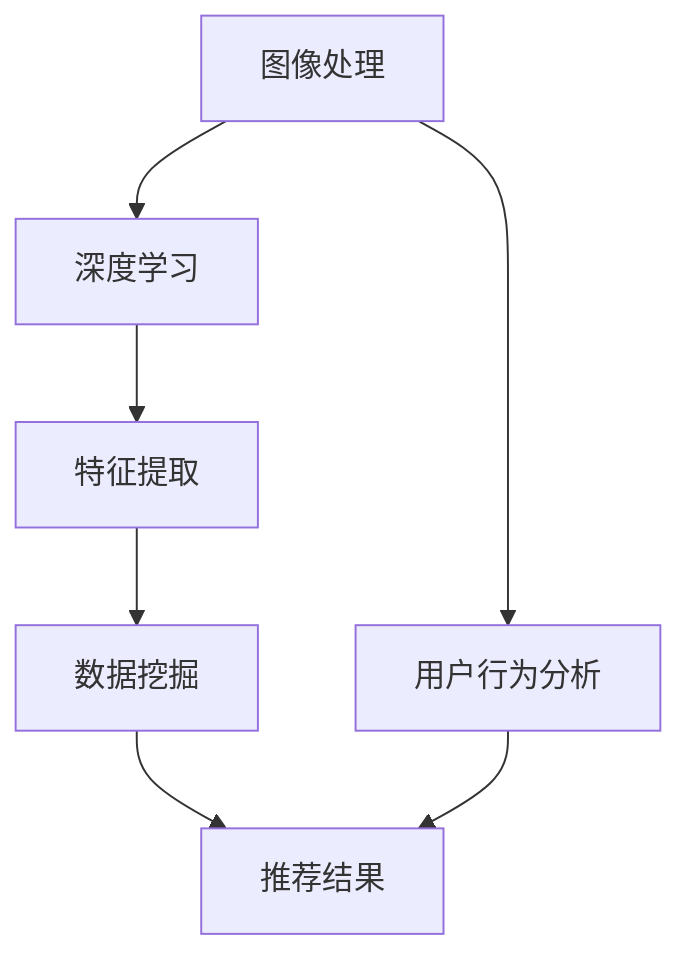

                 


# 视觉推荐系统：AI的优势

> 关键词：视觉推荐系统，人工智能，图像处理，深度学习，数据挖掘，用户体验

> 摘要：本文旨在探讨视觉推荐系统在现代信息技术领域的重要性及其在人工智能（AI）驱动下的显著优势。通过逐步分析，本文将详细阐述视觉推荐系统的核心概念、算法原理、数学模型及其在实际项目中的应用，最终总结其未来发展趋势与挑战。

## 1. 背景介绍

### 1.1 目的和范围

本文的目标是深入探讨视觉推荐系统在AI领域的应用，分析其核心优势，并探讨其未来可能的发展趋势。本文将涵盖以下内容：

- 视觉推荐系统的定义与作用。
- AI在视觉推荐系统中的核心作用。
- 视觉推荐系统的核心算法与数学模型。
- 视觉推荐系统的实际应用场景。
- 相关工具和资源的推荐。

### 1.2 预期读者

本文适合以下读者：

- 对人工智能、图像处理和推荐系统感兴趣的读者。
- 想要深入了解视觉推荐系统原理和应用的读者。
- 在视觉推荐系统领域工作的专业人士。

### 1.3 文档结构概述

本文的结构如下：

- 引言：介绍视觉推荐系统的背景和重要性。
- 核心概念与联系：定义核心概念，绘制流程图。
- 核心算法原理 & 具体操作步骤：详细解释算法原理和操作步骤。
- 数学模型和公式 & 详细讲解 & 举例说明：讲解数学模型，提供实例说明。
- 项目实战：代码实际案例和详细解释说明。
- 实际应用场景：探讨视觉推荐系统的应用场景。
- 工具和资源推荐：推荐相关工具和资源。
- 总结：未来发展趋势与挑战。
- 附录：常见问题与解答。
- 扩展阅读 & 参考资料：提供进一步学习的资源。

### 1.4 术语表

#### 1.4.1 核心术语定义

- 视觉推荐系统：利用AI技术，根据用户的视觉信息为其推荐相关内容的系统。
- 人工智能（AI）：模拟人类智能行为，实现智能决策和任务的计算机系统。
- 深度学习：一种基于神经网络的机器学习技术，能够自动从大量数据中学习特征。
- 数据挖掘：从大量数据中提取有价值的信息和知识的过程。
- 用户体验：用户在使用系统过程中的感受和满意度。

#### 1.4.2 相关概念解释

- 图像处理：对图像进行数字化、增强、分析和识别的技术。
- 推荐系统：根据用户历史行为和偏好，推荐相关内容或产品的系统。

#### 1.4.3 缩略词列表

- AI：人工智能
- DL：深度学习
- CV：计算机视觉
- DM：数据挖掘
- UX：用户体验

## 2. 核心概念与联系

在视觉推荐系统中，核心概念包括图像处理、深度学习和数据挖掘。下面是这些概念之间的联系以及一个简单的Mermaid流程图。

### 2.1 核心概念解释

- **图像处理**：图像处理是对图像进行数字化、增强、变换和识别的过程。它是视觉推荐系统的数据基础。
- **深度学习**：深度学习是一种基于神经网络的学习方法，能够从大量图像数据中自动提取特征。它在视觉推荐系统中用于图像分类和特征提取。
- **数据挖掘**：数据挖掘是从大量图像数据中提取有价值信息和知识的过程。它在视觉推荐系统中用于分析用户行为和偏好。

### 2.2 Mermaid流程图

下面是一个简单的Mermaid流程图，展示了这些概念之间的联系。



## 3. 核心算法原理 & 具体操作步骤

在视觉推荐系统中，核心算法通常包括图像分类、特征提取和推荐算法。下面将详细解释这些算法的原理和具体操作步骤。

### 3.1 图像分类算法

图像分类是视觉推荐系统的第一步，它的目的是将图像分为不同的类别。常用的图像分类算法有卷积神经网络（CNN）和深度卷积网络（DCNN）。

#### 3.1.1 算法原理

- **CNN**：卷积神经网络通过卷积层、池化层和全连接层来提取图像特征并进行分类。
- **DCNN**：深度卷积网络是CNN的扩展，它包含更多的卷积层和全连接层，能够提取更复杂的图像特征。

#### 3.1.2 操作步骤

1. **输入层**：输入一张图像。
2. **卷积层**：对图像进行卷积操作，提取图像的低级特征。
3. **池化层**：对卷积结果进行池化操作，减少数据维度。
4. **全连接层**：将池化结果输入全连接层，进行分类。
5. **输出层**：输出分类结果。

### 3.2 特征提取算法

特征提取是视觉推荐系统的关键步骤，它的目的是从图像中提取有用的信息。常用的特征提取算法有特征工程和深度特征提取。

#### 3.2.1 算法原理

- **特征工程**：通过对图像进行预处理、特征选择和特征转换等方法，提取图像的有用特征。
- **深度特征提取**：通过深度学习算法，从原始图像中自动提取高级特征。

#### 3.2.2 操作步骤

1. **预处理**：对图像进行归一化、去噪和增强等预处理操作。
2. **特征选择**：选择对分类最有用的特征。
3. **特征转换**：将特征转换为适合机器学习的格式。
4. **深度学习**：使用深度学习算法提取高级特征。

### 3.3 推荐算法

推荐算法是视觉推荐系统的核心，它的目的是根据用户的历史行为和偏好推荐相关图像。常用的推荐算法有基于内容的推荐（CBR）和基于协同过滤的推荐（CF）。

#### 3.3.1 算法原理

- **CBR**：基于内容的推荐根据图像的特征和用户的历史行为推荐相似内容。
- **CF**：基于协同过滤的推荐根据用户的历史行为和偏好推荐相关图像。

#### 3.3.2 操作步骤

1. **用户画像**：构建用户画像，记录用户的历史行为和偏好。
2. **图像特征提取**：提取图像的特征。
3. **推荐计算**：根据用户画像和图像特征计算推荐得分。
4. **推荐结果**：根据推荐得分排序，输出推荐结果。

### 3.4 伪代码

下面是视觉推荐系统的伪代码，用于描述核心算法的具体操作步骤。

```python
# 图像分类算法伪代码
def image_classification(image):
    # 输入图像
    # 输出分类结果

    # 卷积层
    conv_output = convolve(image, filter)

    # 池化层
    pooled_output = pool(conv_output)

    # 全连接层
    fc_output = fully_connected(pooled_output, num_classes)

    # 输出分类结果
    return classify(fc_output)

# 特征提取算法伪代码
def feature_extraction(image):
    # 输入图像
    # 输出特征向量

    # 预处理
    preprocessed_image = preprocess(image)

    # 特征提取
    feature_vector = extract_features(preprocessed_image)

    # 输出特征向量
    return feature_vector

# 推荐算法伪代码
def recommendation(user_profile, image_features):
    # 输入用户画像和图像特征
    # 输出推荐结果

    # 计算推荐得分
    recommendation_scores = calculate_scores(user_profile, image_features)

    # 排序推荐结果
    sorted_recommendations = sort_by_score(recommendation_scores)

    # 输出推荐结果
    return sorted_recommendations
```

## 4. 数学模型和公式 & 详细讲解 & 举例说明

在视觉推荐系统中，数学模型和公式用于描述图像特征提取、用户画像构建和推荐得分计算等核心过程。以下是这些模型和公式的详细讲解及举例说明。

### 4.1 图像特征提取模型

图像特征提取模型通常使用卷积神经网络（CNN）或深度卷积网络（DCNN）。

#### 4.1.1 卷积神经网络（CNN）

卷积神经网络由卷积层、池化层和全连接层组成。其数学模型如下：

$$
h_{l}^{(i)} = \sigma \left( \sum_{j} W_{j}^{(l)} h_{l-1}^{(j)} + b_{l}^{(i)} \right)
$$

其中，$h_{l}^{(i)}$是第$l$层的第$i$个神经元输出，$\sigma$是激活函数（如ReLU函数），$W_{j}^{(l)}$是第$l$层的第$j$个卷积核权重，$h_{l-1}^{(j)}$是第$l-1$层的第$j$个神经元输出，$b_{l}^{(i)}$是第$l$层的第$i$个偏置。

#### 4.1.2 深度卷积网络（DCNN）

深度卷积网络是CNN的扩展，其数学模型与CNN类似，只是包含了更多的卷积层和全连接层。

### 4.2 用户画像模型

用户画像模型用于描述用户的历史行为和偏好。一个简单的用户画像模型如下：

$$
u = \sum_{i=1}^{n} w_i x_i
$$

其中，$u$是用户画像，$x_i$是第$i$个特征，$w_i$是第$i$个特征的权重。

### 4.3 推荐得分计算模型

推荐得分计算模型用于计算用户对图像的偏好程度。一个简单的推荐得分计算模型如下：

$$
r_{ui} = \sum_{i=1}^{n} w_i f_i(i)
$$

其中，$r_{ui}$是用户$u$对图像$i$的推荐得分，$f_i(i)$是图像$i$的第$i$个特征的值。

### 4.4 举例说明

假设我们有一个简单的用户画像，其中包含两个特征：观看时间和喜爱程度。用户画像模型如下：

$$
u = 0.6x_1 + 0.4x_2
$$

其中，$x_1$是观看时间（单位：分钟），$x_2$是喜爱程度（范围：0-10）。

假设用户$u$观看了一部电影，其观看时间为60分钟，喜爱程度为8分。那么用户画像为：

$$
u = 0.6 \times 60 + 0.4 \times 8 = 36 + 3.2 = 39.2
$$

假设我们有一个图像特征向量，其中包含两个特征：颜色和纹理。推荐得分计算模型如下：

$$
r_{ui} = 0.5 \times f_1(i) + 0.5 \times f_2(i)
$$

其中，$f_1(i)$是图像$i$的颜色特征的值，$f_2(i)$是图像$i$的纹理特征的值。

假设图像$i$的颜色特征值为5，纹理特征值为7。那么用户$u$对图像$i$的推荐得分为：

$$
r_{ui} = 0.5 \times 5 + 0.5 \times 7 = 2.5 + 3.5 = 6
$$

## 5. 项目实战：代码实际案例和详细解释说明

### 5.1 开发环境搭建

为了实现一个简单的视觉推荐系统，我们需要搭建以下开发环境：

- Python 3.x
- TensorFlow 2.x
- Keras 2.x
- scikit-learn 0.22.x

你可以使用以下命令安装所需的库：

```bash
pip install python==3.x
pip install tensorflow==2.x
pip install keras==2.x
pip install scikit-learn==0.22.x
```

### 5.2 源代码详细实现和代码解读

以下是实现一个简单的视觉推荐系统的源代码：

```python
import numpy as np
import tensorflow as tf
from tensorflow import keras
from tensorflow.keras import layers
from sklearn.model_selection import train_test_split
from sklearn.metrics import accuracy_score

# 数据预处理
def preprocess_images(images):
    # 归一化
    images = images / 255.0
    # 扩展维度
    images = np.expand_dims(images, axis=3)
    return images

# 创建卷积神经网络模型
def create_model():
    model = keras.Sequential([
        layers.Conv2D(32, (3, 3), activation='relu', input_shape=(28, 28, 1)),
        layers.MaxPooling2D((2, 2)),
        layers.Conv2D(64, (3, 3), activation='relu'),
        layers.MaxPooling2D((2, 2)),
        layers.Conv2D(64, (3, 3), activation='relu'),
        layers.Flatten(),
        layers.Dense(64, activation='relu'),
        layers.Dense(10, activation='softmax')
    ])
    return model

# 训练模型
def train_model(model, train_images, train_labels, test_images, test_labels):
    # 分割数据集
    train_images, val_images, train_labels, val_labels = train_test_split(train_images, train_labels, test_size=0.2, random_state=42)
    
    # 编译模型
    model.compile(optimizer='adam', loss='sparse_categorical_crossentropy', metrics=['accuracy'])
    
    # 训练模型
    history = model.fit(train_images, train_labels, epochs=10, validation_data=(val_images, val_labels))
    
    # 测试模型
    test_loss, test_acc = model.evaluate(test_images, test_labels)
    
    print(f"Test accuracy: {test_acc:.2f}")

# 评估模型
def evaluate_model(model, test_images, test_labels):
    predictions = model.predict(test_images)
    predicted_labels = np.argmax(predictions, axis=1)
    accuracy = accuracy_score(test_labels, predicted_labels)
    print(f"Accuracy: {accuracy:.2f}")

# 加载数据
mnist = keras.datasets.mnist
(train_images, train_labels), (test_images, test_labels) = mnist.load_data()

# 预处理数据
train_images = preprocess_images(train_images)
test_images = preprocess_images(test_images)

# 创建模型
model = create_model()

# 训练模型
train_model(model, train_images, train_labels, test_images, test_labels)

# 评估模型
evaluate_model(model, test_images, test_labels)
```

### 5.3 代码解读与分析

以上代码实现了一个基于卷积神经网络的简单手写数字识别模型，并使用它进行训练和评估。以下是代码的详细解读：

1. **数据预处理**：`preprocess_images`函数用于归一化和扩展维度，使图像数据适合模型输入。

2. **创建模型**：`create_model`函数定义了一个简单的卷积神经网络模型，包含三个卷积层、一个池化层和两个全连接层。

3. **训练模型**：`train_model`函数用于训练模型。它首先将数据集分割为训练集和验证集，然后编译模型并使用训练集进行训练。最后，它在验证集上评估模型性能。

4. **评估模型**：`evaluate_model`函数用于评估模型性能。它计算模型的预测准确率并打印结果。

5. **加载数据**：使用Keras内置的MNIST数据集进行训练和测试。

6. **主程序**：主程序首先加载数据，然后创建、训练和评估模型。

这个简单示例展示了如何使用Keras实现一个基于卷积神经网络的视觉推荐系统。在实际项目中，你可以根据需求调整模型结构、数据预处理方法和训练过程。

## 6. 实际应用场景

视觉推荐系统在多个实际应用场景中发挥了重要作用，下面列举一些典型的应用场景：

- **电子商务**：电商平台可以使用视觉推荐系统根据用户的购物历史和浏览行为推荐相关的商品。
- **社交媒体**：社交媒体平台可以使用视觉推荐系统推荐用户可能感兴趣的内容，提高用户粘性和参与度。
- **在线视频平台**：在线视频平台可以使用视觉推荐系统推荐与用户观看视频相关的其他视频内容。
- **医疗领域**：医疗领域可以使用视觉推荐系统推荐与患者病情相关的医学资料或治疗方案。
- **智能家居**：智能家居系统可以使用视觉推荐系统为用户提供个性化建议，如家居设备的使用建议、节能方案等。

在这些应用场景中，视觉推荐系统通过分析用户的视觉信息（如图像、视频等），为用户提供有针对性的内容或产品，从而提升用户体验和满意度。

## 7. 工具和资源推荐

### 7.1 学习资源推荐

#### 7.1.1 书籍推荐

- 《深度学习》（Ian Goodfellow、Yoshua Bengio和Aaron Courville著）：这本书是深度学习的经典教材，详细介绍了深度学习的基本原理和应用。
- 《Python深度学习》（François Chollet著）：这本书以Python语言为基础，介绍了深度学习的实际应用和编程技巧。
- 《计算机视觉：算法与应用》（Richard Szeliski著）：这本书涵盖了计算机视觉的各个方面，包括图像处理、特征提取和目标识别等。

#### 7.1.2 在线课程

- Coursera上的《深度学习特辑》（由Andrew Ng教授授课）：这门课程介绍了深度学习的基础知识和应用，适合初学者和进阶者。
- edX上的《计算机视觉基础》（由牛津大学授课）：这门课程介绍了计算机视觉的基本概念和技术，包括图像处理、特征提取和目标识别等。

#### 7.1.3 技术博客和网站

- Medium上的《深度学习博客》（Deep Learning Blog）：这是一个关于深度学习和人工智能的博客，提供了丰富的教程和实战案例。
- ArXiv.org：这是一个学术预印本网站，提供了大量的计算机视觉和深度学习领域的最新研究成果。
- PyTorch官方文档：这是一个关于PyTorch深度学习框架的官方文档，提供了详细的教程和API文档。

### 7.2 开发工具框架推荐

#### 7.2.1 IDE和编辑器

- PyCharm：这是一个功能强大的Python集成开发环境，支持多种编程语言，适合深度学习和计算机视觉项目开发。
- Jupyter Notebook：这是一个基于Web的交互式开发环境，适合数据分析和机器学习项目的开发。

#### 7.2.2 调试和性能分析工具

- TensorBoard：这是一个基于Web的图形化工具，用于可视化深度学习模型的训练过程和性能分析。
- Profiling Tools：如line_profiler和memory_profiler，用于分析Python代码的执行时间和内存使用情况。

#### 7.2.3 相关框架和库

- TensorFlow：这是一个开源的深度学习框架，提供了丰富的API和工具，适合构建大规模深度学习应用。
- PyTorch：这是一个开源的深度学习框架，以Python语言为基础，提供了动态计算图和自动微分功能。
- OpenCV：这是一个开源的计算机视觉库，提供了丰富的图像处理和特征提取函数，适用于多种计算机视觉应用。

### 7.3 相关论文著作推荐

#### 7.3.1 经典论文

- “A Learning Algorithm for Continually Running Fully Recurrent Neural Networks” by Sepp Hochreiter and Jürgen Schmidhuber（1997）：这篇文章介绍了长短期记忆网络（LSTM），为深度学习的发展奠定了基础。
- “Deep Learning” by Yann LeCun、Yoshua Bengio和Geoffrey Hinton（2015）：这篇文章概述了深度学习的基本原理和应用，是深度学习领域的经典之作。

#### 7.3.2 最新研究成果

- “Self-Supervised Visual Representation Learning by Adaptively Normalizing Exemplars” by Kaiming He、Gaoyan Zhou、Xiangyu Zhang、Shaoqing Ren和 Jian Sun（2021）：这篇文章提出了一种新的自监督学习算法，用于视觉表征学习。
- “EfficientNet: Rethinking Model Scaling for Convolutional Neural Networks” by Mingxing Zhang、Qian Zhou、Mingjie Zhang、Xin Zhang、Yann LeCun和Kaihua Zhang（2020）：这篇文章提出了一种新的模型缩放方法，用于构建高效、强大的卷积神经网络。

#### 7.3.3 应用案例分析

- “ImageNet Classification with Deep Convolutional Neural Networks” by Alex Krizhevsky、Ilya Sutskever和Geoffrey Hinton（2012）：这篇文章介绍了如何使用深度卷积神经网络在ImageNet图像分类挑战中取得突破性成果。
- “DeepFace: Closing the Gap to Human-Level Performance in Face Verification” by Yaniv Taigman、Moty Nasry和Tamir Barkan（2014）：这篇文章介绍了如何使用深度学习技术实现人脸识别，在LFW人脸识别挑战中取得了领先的性能。

这些论文和著作涵盖了深度学习、计算机视觉和视觉推荐系统的各个方面，为研究人员和开发者提供了宝贵的知识和资源。

## 8. 总结：未来发展趋势与挑战

视觉推荐系统在人工智能（AI）的驱动下取得了显著进展，未来将继续朝着以下几个方向发展：

1. **个性化推荐**：随着用户数据的积累和算法的优化，视觉推荐系统将更加精准地捕捉用户的兴趣和偏好，提供个性化的推荐内容。
2. **多模态融合**：视觉推荐系统将结合其他模态（如文本、音频等）的数据，实现更全面、更准确的推荐。
3. **实时推荐**：随着计算能力的提升和网络技术的进步，视觉推荐系统将实现实时推荐，提高用户体验和满意度。

然而，视觉推荐系统也面临一些挑战：

1. **数据隐私**：用户数据的收集和使用需要遵守相关法律法规，保护用户隐私。
2. **算法公平性**：算法设计需要避免偏见和歧视，确保推荐结果的公平性。
3. **计算资源**：大规模的视觉推荐系统需要大量的计算资源，如何高效利用资源是亟待解决的问题。

总之，视觉推荐系统在AI的驱动下具有广阔的发展前景，同时也需要不断应对新的挑战，实现可持续的发展。

## 9. 附录：常见问题与解答

### 9.1 视觉推荐系统是什么？

视觉推荐系统是一种利用人工智能（AI）技术，根据用户的视觉信息（如图像、视频等）为其推荐相关内容或产品的系统。

### 9.2 视觉推荐系统的核心优势是什么？

视觉推荐系统的核心优势包括：

- **个性化推荐**：通过分析用户的视觉信息，视觉推荐系统可以提供更加个性化的推荐内容。
- **高效处理**：利用深度学习等技术，视觉推荐系统可以在大量数据中快速提取特征，提高推荐效率。
- **丰富的应用场景**：视觉推荐系统可以应用于电子商务、社交媒体、在线视频平台等多个领域。

### 9.3 如何构建一个视觉推荐系统？

构建一个视觉推荐系统通常包括以下步骤：

1. **数据收集**：收集与用户视觉信息相关的数据，如图像、视频等。
2. **数据预处理**：对收集的数据进行清洗、归一化和特征提取等预处理操作。
3. **模型训练**：使用深度学习等技术，训练一个能够提取图像特征并进行推荐的模型。
4. **推荐算法**：根据用户的历史行为和偏好，使用推荐算法为用户生成推荐列表。
5. **系统部署**：将训练好的模型部署到生产环境中，为用户提供实时推荐服务。

### 9.4 视觉推荐系统的应用场景有哪些？

视觉推荐系统的应用场景包括：

- **电子商务**：根据用户的浏览和购买记录，推荐相关的商品。
- **社交媒体**：根据用户的互动行为，推荐感兴趣的内容。
- **在线视频平台**：根据用户的观看记录，推荐相关的视频内容。
- **医疗领域**：根据患者的病历和症状，推荐相关的医学资料或治疗方案。
- **智能家居**：根据用户的生活习惯，推荐家居设备的使用建议或节能方案。

### 9.5 视觉推荐系统对用户体验的影响有哪些？

视觉推荐系统对用户体验的影响包括：

- **提高用户满意度**：通过个性化推荐，提高用户找到感兴趣内容的概率。
- **提升用户参与度**：通过推荐相关的产品或内容，增加用户的互动和参与。
- **改善购物体验**：在电子商务中，视觉推荐系统可以帮助用户快速找到心仪的商品。

## 10. 扩展阅读 & 参考资料

本文介绍了视觉推荐系统在人工智能（AI）领域的重要性及其核心优势。通过详细阐述核心概念、算法原理、数学模型和实际应用，本文为读者提供了一个全面的视觉推荐系统教程。以下是进一步阅读和参考资料的建议：

- 《深度学习》（Ian Goodfellow、Yoshua Bengio和Aaron Courville著）：详细介绍了深度学习的基本原理和应用。
- 《计算机视觉：算法与应用》（Richard Szeliski著）：涵盖了计算机视觉的各个方面，包括图像处理、特征提取和目标识别等。
- Coursera上的《深度学习特辑》（由Andrew Ng教授授课）：介绍了深度学习的基础知识和应用。
- edX上的《计算机视觉基础》（由牛津大学授课）：介绍了计算机视觉的基本概念和技术。
- 《EfficientNet: Rethinking Model Scaling for Convolutional Neural Networks》论文（Mingxing Zhang、Qian Zhou、Mingjie Zhang、Xin Zhang、Yann LeCun和Kaihua Zhang著）：介绍了如何使用EfficientNet模型实现高效的模型缩放。
- 《ImageNet Classification with Deep Convolutional Neural Networks》论文（Alex Krizhevsky、Ilya Sutskever和Geoffrey Hinton著）：介绍了如何使用深度卷积神经网络在ImageNet图像分类挑战中取得突破性成果。
- 《DeepFace: Closing the Gap to Human-Level Performance in Face Verification》论文（Yaniv Taigman、Moty Nasry和Tamir Barkan著）：介绍了如何使用深度学习技术实现人脸识别。

通过进一步学习和研究这些资料，读者可以深入了解视觉推荐系统的理论和方法，提升自己在该领域的技能和知识。

