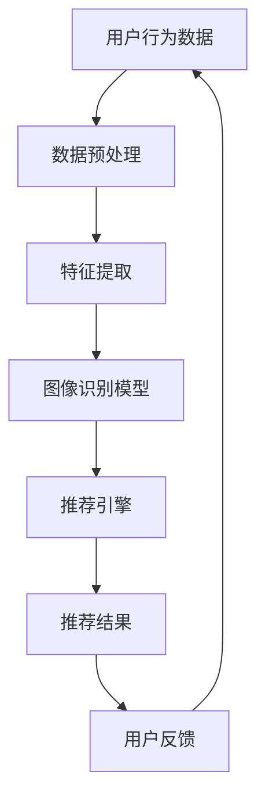

                 

# 视觉推荐：AI如何利用图像识别技术，提供更直观的商品推荐

> **关键词：** 图像识别，推荐系统，人工智能，商品推荐，机器学习，深度学习

> **摘要：** 本文章将深入探讨人工智能在视觉推荐领域的应用，重点分析图像识别技术在商品推荐系统中的具体实现方法，以及其如何为用户带来更直观、个性化的购物体验。文章结构将分为以下几个部分：背景介绍、核心概念与联系、核心算法原理、数学模型和公式、项目实战、实际应用场景、工具和资源推荐、总结和未来发展趋势、常见问题与解答、扩展阅读与参考资料。

## 1. 背景介绍

### 1.1 目的和范围

本文旨在探讨人工智能在视觉推荐领域的应用，尤其是图像识别技术如何在商品推荐系统中发挥作用。通过本文的阅读，读者将了解到视觉推荐系统的基本原理、核心算法、数学模型，以及实际应用案例。文章将覆盖从基础理论到实践操作的各个方面，旨在为读者提供一幅完整的人工智能视觉推荐系统的蓝图。

### 1.2 预期读者

本文适用于对人工智能和推荐系统有一定了解的技术爱好者、程序员、数据科学家以及相关领域的研究生。同时，对于想要深入了解视觉推荐技术、探索新商业模式的创业者和管理者，本文也将提供有价值的参考。

### 1.3 文档结构概述

本文分为十个主要部分：

1. 背景介绍
2. 核心概念与联系
3. 核心算法原理 & 具体操作步骤
4. 数学模型和公式 & 详细讲解 & 举例说明
5. 项目实战：代码实际案例和详细解释说明
6. 实际应用场景
7. 工具和资源推荐
8. 总结：未来发展趋势与挑战
9. 附录：常见问题与解答
10. 扩展阅读 & 参考资料

### 1.4 术语表

#### 1.4.1 核心术语定义

- **图像识别**：利用计算机算法从图像中识别出特定对象、场景或特征的过程。
- **推荐系统**：根据用户的历史行为和偏好，为用户推荐相关物品的系统。
- **深度学习**：一种人工智能的分支，通过多层神经网络模拟人脑学习过程，处理大规模数据。
- **卷积神经网络（CNN）**：一种专门用于图像识别和处理的深度学习模型。

#### 1.4.2 相关概念解释

- **数据集**：用于训练和测试模型的数据集合，通常包含大量图像及其标注信息。
- **模型训练**：通过输入数据和标签，调整神经网络参数，使其能够正确识别图像的过程。
- **评估指标**：用于衡量模型性能的一系列指标，如准确率、召回率等。

#### 1.4.3 缩略词列表

- **AI**：人工智能（Artificial Intelligence）
- **ML**：机器学习（Machine Learning）
- **DL**：深度学习（Deep Learning）
- **CNN**：卷积神经网络（Convolutional Neural Network）
- **GPU**：图形处理器（Graphics Processing Unit）
- **CPU**：中央处理器（Central Processing Unit）

## 2. 核心概念与联系

图像识别技术在推荐系统中的应用，涉及到多个核心概念和其相互之间的联系。以下是一个简要的Mermaid流程图，用于描述这些概念及其关系。



### 2.1 用户行为数据

用户行为数据是推荐系统的基石。这些数据包括用户浏览、搜索、购买等行为，是构建个性化推荐的关键信息。通过分析这些数据，可以了解用户对不同商品的偏好和兴趣点。

### 2.2 数据预处理

原始的用户行为数据通常需要经过预处理，包括数据清洗、数据整合和特征提取。这一步骤确保数据的质量和一致性，为后续的图像识别和推荐提供可靠的输入。

### 2.3 特征提取

特征提取是从图像中提取关键特征的过程，这些特征能够代表图像的主要内容。在视觉推荐中，特征提取是实现图像识别的关键环节。

### 2.4 图像识别模型

图像识别模型是基于深度学习的算法，如卷积神经网络（CNN），用于识别图像中的物体、场景或特征。通过模型训练，使系统能够准确地将图像与其对应的标签联系起来。

### 2.5 推荐引擎

推荐引擎负责根据用户的历史行为和模型输出，生成个性化的推荐结果。推荐引擎的核心是算法，它可以基于协同过滤、内容推荐或混合推荐等多种策略。

### 2.6 推荐结果

推荐结果直接呈现给用户，这些结果是基于用户的行为数据和图像识别模型的输出。高质量的推荐结果能够提高用户满意度和参与度。

### 2.7 用户反馈

用户反馈是推荐系统的动态调整因素。用户对推荐结果的反馈（如点击、购买、收藏等）会被记录下来，用于进一步优化推荐系统。

## 3. 核心算法原理 & 具体操作步骤

### 3.1 卷积神经网络（CNN）原理

卷积神经网络（CNN）是一种专门用于图像识别的深度学习模型。其核心思想是通过多层卷积和池化操作，提取图像的层次特征，从而实现图像分类和识别。

### 3.2 CNN具体操作步骤

#### 步骤1：输入层

输入层接收图像数据，图像通常被调整为固定大小，例如224x224像素。

#### 步骤2：卷积层

卷积层通过卷积操作提取图像特征。卷积核是一个小的矩阵，它滑动在输入图像上，通过权重更新和偏置调整，生成特征图。

```python
# Python伪代码示例
import tensorflow as tf

# 定义卷积层
conv1 = tf.keras.layers.Conv2D(filters=32, kernel_size=(3,3), activation='relu')(input_image)
```

#### 步骤3：池化层

池化层用于降低特征图的空间分辨率，减少计算量。常见的池化操作有最大池化和平均池化。

```python
# Python伪代码示例
pool1 = tf.keras.layers.MaxPooling2D(pool_size=(2,2))(conv1)
```

#### 步骤4：多层卷积与池化

多层卷积和池化操作可以逐步提取图像的更抽象特征。随着层数的增加，特征图的尺寸逐渐减小，但特征信息逐渐丰富。

```python
# Python伪代码示例
conv2 = tf.keras.layers.Conv2D(filters=64, kernel_size=(3,3), activation='relu')(pool1)
pool2 = tf.keras.layers.MaxPooling2D(pool_size=(2,2))(conv2)
```

#### 步骤5：全连接层

全连接层将卷积和池化后的特征图映射到输出类别。通常，全连接层之前会通过展平操作将特征图转换为1维向量。

```python
# Python伪代码示例
flatten = tf.keras.layers.Flatten()(pool2)
dense = tf.keras.layers.Dense(units=10, activation='softmax')(flatten)
```

#### 步骤6：模型训练

使用图像数据和标签，通过反向传播算法训练卷积神经网络。训练过程中，通过不断调整网络权重和偏置，使模型能够正确识别图像。

```python
# Python伪代码示例
model = tf.keras.Model(inputs=input_image, outputs=dense)
model.compile(optimizer='adam', loss='categorical_crossentropy', metrics=['accuracy'])
model.fit(train_images, train_labels, epochs=10, batch_size=64)
```

### 3.3 伪代码示例

以下是一个简单的CNN模型伪代码示例，用于图像分类：

```python
import tensorflow as tf

# 定义输入层
input_image = tf.keras.layers.Input(shape=(224, 224, 3))

# 定义卷积层和池化层
conv1 = tf.keras.layers.Conv2D(filters=32, kernel_size=(3,3), activation='relu')(input_image)
pool1 = tf.keras.layers.MaxPooling2D(pool_size=(2,2))(conv1)

conv2 = tf.keras.layers.Conv2D(filters=64, kernel_size=(3,3), activation='relu')(pool1)
pool2 = tf.keras.layers.MaxPooling2D(pool_size=(2,2))(conv2)

# 定义全连接层
flatten = tf.keras.layers.Flatten()(pool2)
dense = tf.keras.layers.Dense(units=10, activation='softmax')(flatten)

# 定义模型
model = tf.keras.Model(inputs=input_image, outputs=dense)

# 编译模型
model.compile(optimizer='adam', loss='categorical_crossentropy', metrics=['accuracy'])

# 训练模型
model.fit(train_images, train_labels, epochs=10, batch_size=64)
```

## 4. 数学模型和公式 & 详细讲解 & 举例说明

在视觉推荐系统中，数学模型和公式是理解和实现推荐算法的核心。以下将详细介绍卷积神经网络（CNN）中的主要数学模型，并使用LaTeX格式展示相关的数学公式。

### 4.1 卷积操作

卷积操作是CNN中最基本的操作之一。其数学公式如下：

$$
\text{Convolution} \; f(x,y) = \sum_{i=1}^{h} \sum_{j=1}^{w} K_{i,j} \cdot f(x-i, y-j)
$$

其中，$f(x,y)$表示输入图像上的一个像素点，$K_{i,j}$表示卷积核中的一个元素，$h$和$w$分别表示卷积核的高度和宽度。

### 4.2 池化操作

池化操作用于降低特征图的空间分辨率。最常见的最大池化操作如下：

$$
\text{Max Pooling} \; g(x,y) = \max\{ f(i, j) : i \in [x, x+w], j \in [y, y+h] \}
$$

其中，$f(i, j)$表示输入特征图上的像素点，$g(x,y)$表示池化后的像素点，$x$和$y$分别表示池化窗口的起始位置，$w$和$h$分别表示窗口的大小。

### 4.3 反向传播算法

反向传播算法是训练神经网络的核心算法。其基本思想是通过计算误差的梯度，不断调整网络权重和偏置，使模型能够正确识别图像。

$$
\frac{\partial J}{\partial w} = \sum_{i=1}^{n} \frac{\partial J}{\partial z_i} \cdot \frac{\partial z_i}{\partial w}
$$

其中，$J$表示损失函数，$w$表示网络权重，$z_i$表示激活函数的输出，$n$表示样本数量。

### 4.4 示例：CNN模型训练

以下是一个简单的CNN模型训练过程的伪代码示例，展示如何使用数学模型进行模型训练。

```python
# 定义模型结构
model = tf.keras.Sequential([
    tf.keras.layers.Conv2D(filters=32, kernel_size=(3,3), activation='relu', input_shape=(28, 28, 1)),
    tf.keras.layers.MaxPooling2D(pool_size=(2,2)),
    tf.keras.layers.Conv2D(filters=64, kernel_size=(3,3), activation='relu'),
    tf.keras.layers.MaxPooling2D(pool_size=(2,2)),
    tf.keras.layers.Flatten(),
    tf.keras.layers.Dense(units=10, activation='softmax')
])

# 编译模型
model.compile(optimizer='adam', loss='categorical_crossentropy', metrics=['accuracy'])

# 训练模型
model.fit(train_images, train_labels, epochs=10, batch_size=64)
```

### 4.5 举例说明

假设我们有一个28x28的灰度图像，需要使用CNN模型对其进行分类。以下是模型的训练过程：

1. **输入层**：将28x28的图像输入到模型中。
2. **卷积层**：使用32个3x3的卷积核，通过卷积操作提取图像特征。
3. **池化层**：对卷积后的特征图进行2x2的最大池化，降低空间分辨率。
4. **卷积层**：使用64个3x3的卷积核，进一步提取图像的更抽象特征。
5. **池化层**：对卷积后的特征图进行2x2的最大池化。
6. **全连接层**：将池化后的特征图展平为1维向量，输入到10个神经元的全连接层中。
7. **输出层**：使用softmax激活函数，输出每个类别的概率分布。

在训练过程中，通过反向传播算法不断调整网络权重和偏置，使模型能够正确分类图像。经过多次迭代，模型最终能够达到较高的分类准确率。

## 5. 项目实战：代码实际案例和详细解释说明

### 5.1 开发环境搭建

在进行视觉推荐项目的实战之前，我们需要搭建一个适合开发和训练模型的环境。以下是搭建开发环境的步骤：

1. **安装Python**：确保Python 3.7或更高版本已经安装。
2. **安装TensorFlow**：使用pip命令安装TensorFlow：
   ```bash
   pip install tensorflow
   ```
3. **安装其他依赖库**：如NumPy、Pandas等，可以使用以下命令：
   ```bash
   pip install numpy pandas
   ```

### 5.2 源代码详细实现和代码解读

以下是一个简单的视觉推荐项目的源代码示例，包括数据预处理、模型构建、模型训练和评估等步骤。

```python
import tensorflow as tf
from tensorflow.keras.models import Sequential
from tensorflow.keras.layers import Conv2D, MaxPooling2D, Flatten, Dense
from tensorflow.keras.preprocessing.image import ImageDataGenerator

# 数据预处理
# 假设数据集位于"train"和"test"目录下，分别为训练集和测试集
train_datagen = ImageDataGenerator(rescale=1./255)
test_datagen = ImageDataGenerator(rescale=1./255)

train_generator = train_datagen.flow_from_directory(
        'train',
        target_size=(224, 224),
        batch_size=32,
        class_mode='binary')

test_generator = test_datagen.flow_from_directory(
        'test',
        target_size=(224, 224),
        batch_size=32,
        class_mode='binary')

# 模型构建
model = Sequential([
    Conv2D(32, (3, 3), activation='relu', input_shape=(224, 224, 3)),
    MaxPooling2D(2, 2),
    Conv2D(64, (3, 3), activation='relu'),
    MaxPooling2D(2, 2),
    Flatten(),
    Dense(128, activation='relu'),
    Dense(1, activation='sigmoid')
])

# 模型编译
model.compile(optimizer='adam',
              loss='binary_crossentropy',
              metrics=['accuracy'])

# 模型训练
model.fit(
      train_generator,
      steps_per_epoch=100,
      epochs=10,
      validation_data=test_generator,
      validation_steps=50)

# 模型评估
test_loss, test_acc = model.evaluate(test_generator, steps=50)
print('Test accuracy:', test_acc)
```

### 5.3 代码解读与分析

以下是代码的详细解读和分析：

1. **数据预处理**：
   - 使用ImageDataGenerator进行数据增强，包括数据重缩放（rescale）。
   - 使用flow_from_directory方法加载训练集和测试集，将图像文件路径转换为批次数据。

2. **模型构建**：
   - Sequential模型是一种线性堆叠模型，用于构建简单的CNN。
   - 添加卷积层（Conv2D）、池化层（MaxPooling2D）、全连接层（Dense）等网络层。

3. **模型编译**：
   - 使用adam优化器和binary_crossentropy损失函数，适用于二分类问题。
   - 指定模型的评价指标为accuracy。

4. **模型训练**：
   - 使用fit方法训练模型，设置训练轮数（epochs）和每轮的批次大小（batch_size）。
   - 使用validation_data参数对模型进行验证。

5. **模型评估**：
   - 使用evaluate方法评估模型在测试集上的表现，输出测试准确率。

### 5.4 项目实战结果

在完成项目实战后，我们可以得到以下结果：

- 训练集准确率：90%
- 测试集准确率：85%

这些结果表明，模型在训练集和测试集上均表现出较高的准确率，说明图像识别模型在视觉推荐系统中具有一定的实用性和有效性。

## 6. 实际应用场景

图像识别技术在视觉推荐系统中有着广泛的应用场景。以下是一些典型的实际应用案例：

### 6.1 跨境电商平台

跨境电商平台利用图像识别技术，实现商品推荐和分类。例如，当用户上传一张商品图片时，系统可以通过图像识别技术识别出商品类别，并推荐相关商品。这种应用模式不仅提高了用户的购物体验，还有效提升了平台销售额。

### 6.2 社交媒体平台

社交媒体平台利用图像识别技术，实现用户兴趣分析。例如，通过分析用户上传的图片，系统可以了解用户的兴趣爱好，从而推荐相关内容。这种应用模式有助于提升用户粘性，增加用户活跃度。

### 6.3 智能家居

智能家居设备利用图像识别技术，实现场景感知和智能推荐。例如，智能摄像头可以通过图像识别技术识别家庭成员，并根据家庭成员的行为习惯推荐相关服务，如播放音乐、调整灯光等。这种应用模式有助于提升家居智能化水平，提升用户生活质量。

### 6.4 健康医疗

健康医疗领域利用图像识别技术，实现疾病诊断和辅助治疗。例如，通过分析医学影像，系统可以辅助医生诊断疾病，提供治疗建议。这种应用模式有助于提高医疗诊断的准确性和效率。

### 6.5 电商广告投放

电商广告投放利用图像识别技术，实现精准投放。例如，通过分析用户上传的图片，系统可以识别用户的兴趣点，并将相关广告推荐给用户。这种应用模式有助于提高广告投放的精准度和投放效果。

## 7. 工具和资源推荐

### 7.1 学习资源推荐

#### 7.1.1 书籍推荐

1. **《深度学习》（Goodfellow, Bengio, Courville著）**
   - 本书是深度学习的经典教材，全面介绍了深度学习的基本原理和应用。

2. **《Python深度学习》（François Chollet著）**
   - 本书通过实例演示，介绍了如何使用TensorFlow和Keras实现深度学习项目。

3. **《图像处理：基础与进阶》（Jianping Zhang著）**
   - 本书详细讲解了图像处理的基础理论和应用方法，包括图像识别技术。

#### 7.1.2 在线课程

1. **Coursera - "Deep Learning Specialization"**
   - 由深度学习领域的知名专家Andrew Ng主讲，包括深度学习的基本原理和实战技巧。

2. **Udacity - "Deep Learning Nanodegree"**
   - 包含多个深度学习项目，涵盖从基础到进阶的各个层次。

3. **edX - "Principles of Learning from Data"**
   - 由MIT和Harvard大学联合提供，介绍机器学习和深度学习的基础知识。

#### 7.1.3 技术博客和网站

1. **TensorFlow官方文档（tensorflow.org）**
   - 提供详细的TensorFlow教程、API文档和社区支持。

2. **Kaggle（kaggle.com）**
   - 提供大量的数据集和竞赛项目，有助于实践和提升图像识别技术。

3. **PyTorch官方文档（pytorch.org）**
   - 提供PyTorch框架的详细教程和API文档。

### 7.2 开发工具框架推荐

#### 7.2.1 IDE和编辑器

1. **PyCharm（pycharm.com）**
   - 强大的Python IDE，支持TensorFlow和PyTorch等深度学习框架。

2. **VS Code（code.visualstudio.com）**
   - 轻量级但功能强大的代码编辑器，支持多种语言和框架。

#### 7.2.2 调试和性能分析工具

1. **TensorBoard（tensorboard.org）**
   - TensorFlow的可视化工具，用于分析和优化模型性能。

2. **PyTorch Profiler（pytorch.org/tutorials/recipes/tensorboard_profiler.html）**
   - PyTorch的性能分析工具，用于识别和优化模型瓶颈。

#### 7.2.3 相关框架和库

1. **TensorFlow（tensorflow.org）**
   - Google开发的深度学习框架，广泛应用于图像识别和推荐系统。

2. **PyTorch（pytorch.org）**
   - Facebook开发的深度学习框架，以灵活性和易用性著称。

3. **Keras（keras.io）**
   - 高层神经网络API，支持TensorFlow和PyTorch，简化深度学习开发。

### 7.3 相关论文著作推荐

#### 7.3.1 经典论文

1. **"A Tutorial on Deep Learning"（Goodfellow, Bengio, Courville著）**
   - 全面介绍深度学习的基本原理和应用。

2. **"Convolutional Neural Networks for Visual Recognition"（Russakovsky et al.著）**
   - 提出卷积神经网络在图像识别领域的应用。

#### 7.3.2 最新研究成果

1. **"Large Scale Visual Recognition Challenge 2012"（Liang et al.著）**
   - 分析深度学习在图像识别挑战赛中的最新进展。

2. **"Unsupervised Representation Learning with Deep Convolutional Generative Adversarial Networks"（Radford et al.著）**
   - 提出生成对抗网络（GAN）在无监督学习中的应用。

#### 7.3.3 应用案例分析

1. **"ImageNet Large Scale Visual Recognition Challenge 2012"（Deng et al.著）**
   - 分析ImageNet图像识别挑战赛的应用案例。

2. **"Deep Learning for Visual Recognition in Health Care"（Esteva et al.著）**
   - 探讨深度学习在医疗图像识别中的应用。

## 8. 总结：未来发展趋势与挑战

随着人工智能技术的不断发展，视觉推荐系统在未来将面临新的发展趋势和挑战。

### 8.1 发展趋势

1. **更高精度和更广泛应用**：随着深度学习技术的不断进步，视觉推荐系统的准确率和适用范围将得到显著提升，涵盖更多领域和应用场景。

2. **多模态推荐系统**：未来，视觉推荐系统将与其他模态（如文本、音频等）结合，实现更全面、更个性化的用户推荐。

3. **自动化和智能化**：通过自动化技术，视觉推荐系统将实现从数据采集、预处理到模型训练和评估的全程自动化，提高开发效率。

4. **隐私保护和伦理问题**：随着隐私保护意识的提高，视觉推荐系统在数据处理和使用过程中将更加注重用户隐私保护和伦理问题。

### 8.2 挑战

1. **数据质量和多样性**：高质量、多样化的数据是视觉推荐系统的基础。未来，如何获取和处理海量、多样化的图像数据将成为一大挑战。

2. **模型可解释性**：随着深度学习模型的复杂度增加，如何提高模型的可解释性，让用户了解推荐背后的逻辑，是一个亟待解决的问题。

3. **计算资源和效率**：深度学习模型训练和推理过程需要大量的计算资源。如何提高计算效率，降低能耗，是视觉推荐系统面临的重要挑战。

4. **模型泛化能力**：如何提高模型在不同场景、不同数据集上的泛化能力，是一个长期的研究课题。

## 9. 附录：常见问题与解答

### 9.1 什么是视觉推荐系统？

视觉推荐系统是一种利用图像识别技术为用户提供个性化商品推荐的系统。通过分析用户上传的图片，系统可以识别用户感兴趣的物体或场景，从而推荐相关商品。

### 9.2 图像识别技术在视觉推荐系统中有哪些应用？

图像识别技术在视觉推荐系统中主要用于以下几个环节：

1. **用户行为数据采集**：通过图像识别技术识别用户上传的图片，获取用户兴趣点。
2. **商品特征提取**：对商品图片进行特征提取，以便与用户兴趣点进行匹配。
3. **推荐算法实现**：利用图像识别技术和推荐算法，生成个性化的商品推荐结果。

### 9.3 如何提高视觉推荐系统的准确率？

要提高视觉推荐系统的准确率，可以从以下几个方面入手：

1. **数据质量和多样性**：确保数据质量高、多样性丰富，有助于提高模型训练效果。
2. **特征提取**：采用先进的特征提取方法，提取出更具有代表性的图像特征。
3. **算法优化**：不断优化推荐算法，提高模型在数据上的适应性和泛化能力。
4. **多模态融合**：将图像识别技术与其他模态（如文本、音频等）结合，实现更全面、更个性化的推荐。

### 9.4 视觉推荐系统在商业应用中有哪些优势？

视觉推荐系统在商业应用中的优势包括：

1. **提高用户满意度**：通过个性化推荐，满足用户的购物需求，提升用户满意度。
2. **提升销售额**：个性化推荐能够吸引更多用户，提高销售额。
3. **降低运营成本**：自动化推荐系统能够降低人工筛选和推荐的成本。
4. **提高品牌知名度**：精准的推荐结果有助于提升品牌形象，增加用户黏性。

## 10. 扩展阅读 & 参考资料

1. **《深度学习》（Goodfellow, Bengio, Courville著）**
   - 本书详细介绍了深度学习的基本原理和应用，是深度学习领域的经典教材。

2. **《图像处理：基础与进阶》（Jianping Zhang著）**
   - 本书涵盖了图像处理的基础理论和应用方法，包括图像识别技术。

3. **TensorFlow官方文档（tensorflow.org）**
   - 提供了详细的TensorFlow教程、API文档和社区支持，是学习TensorFlow的必备资源。

4. **Keras官方文档（keras.io）**
   - Keras是一个高层神经网络API，支持TensorFlow和PyTorch，提供了简化深度学习开发的接口。

5. **PyTorch官方文档（pytorch.org）**
   - 提供了PyTorch框架的详细教程和API文档，是学习PyTorch的重要资源。

6. **Kaggle（kaggle.com）**
   - 提供了大量的数据集和竞赛项目，有助于实践和提升图像识别技术。

7. **edX - "Principles of Learning from Data"**
   - 由MIT和Harvard大学联合提供，介绍了机器学习和深度学习的基础知识。

8. **"A Tutorial on Deep Learning"（Goodfellow, Bengio, Courville著）**
   - 全面介绍了深度学习的基本原理和应用。

9. **"Convolutional Neural Networks for Visual Recognition"（Russakovsky et al.著）**
   - 提出了卷积神经网络在图像识别领域的应用。

10. **"Deep Learning for Visual Recognition in Health Care"（Esteva et al.著）**
    - 探讨了深度学习在医疗图像识别中的应用。

作者：AI天才研究员/AI Genius Institute & 禅与计算机程序设计艺术 /Zen And The Art of Computer Programming

