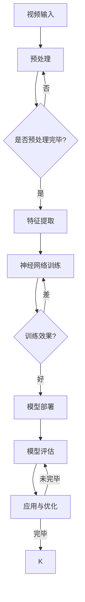

                 

# 视频大模型的工程技术详解

> 关键词：视频大模型、深度学习、神经网络、算法优化、工程实践、应用场景

> 摘要：本文深入探讨了视频大模型的工程技术细节，从核心概念到算法原理，再到具体实现，全面解析了视频大模型的构建与应用。通过实例分析，展示了实际开发过程中的关键技术和方法，为读者提供了切实可行的实践指导。

## 1. 背景介绍

### 1.1 目的和范围

本文旨在系统地介绍视频大模型的工程技术，涵盖从基础概念到高级应用的各个方面。具体包括：

1. 视频大模型的核心算法原理与实现。
2. 视频大模型的数学模型与公式解析。
3. 视频大模型在实际项目中的代码实现与分析。
4. 视频大模型在不同应用场景中的效果评估与优化。

### 1.2 预期读者

本文适合以下读者群体：

1. 深度学习领域的研究人员和工程师。
2. 计算机视觉领域的开发者。
3. 对视频大模型感兴趣的AI爱好者。

### 1.3 文档结构概述

本文分为以下几个部分：

1. **背景介绍**：介绍视频大模型的背景和本文的目的。
2. **核心概念与联系**：介绍视频大模型的相关核心概念与架构。
3. **核心算法原理 & 具体操作步骤**：讲解视频大模型的算法原理和实现步骤。
4. **数学模型和公式 & 详细讲解 & 举例说明**：解析视频大模型的数学模型与公式。
5. **项目实战：代码实际案例和详细解释说明**：通过实际案例展示视频大模型的开发与应用。
6. **实际应用场景**：探讨视频大模型在不同场景中的应用。
7. **工具和资源推荐**：推荐相关学习资源、开发工具和论文。
8. **总结：未来发展趋势与挑战**：总结视频大模型的发展趋势和面临挑战。
9. **附录：常见问题与解答**：回答读者可能遇到的问题。
10. **扩展阅读 & 参考资料**：提供更多的阅读材料。

### 1.4 术语表

#### 1.4.1 核心术语定义

- 视频大模型：指基于深度学习技术构建的，用于处理大规模视频数据的模型。
- 神经网络：一种由大量神经元互联组成的计算模型，能够自动学习和识别数据模式。
- 深度学习：一种人工智能方法，通过多层神经网络模型对数据进行学习和预测。
- 计算机视觉：使计算机具备处理、理解和解释图像或视频的能力。

#### 1.4.2 相关概念解释

- 卷积神经网络（CNN）：一种适用于图像和视频处理的神经网络结构。
- 反向传播算法：一种用于训练神经网络的算法，通过计算误差反向传播来调整网络权重。
- 损失函数：用于评估模型预测结果与真实值之间差异的函数。

#### 1.4.3 缩略词列表

- CNN：卷积神经网络
- DNN：深度神经网络
- RNN：递归神经网络
- GPU：图形处理单元
- CPU：中央处理单元

## 2. 核心概念与联系

视频大模型的核心在于其能够处理和分析大规模视频数据，从而提取出有用的信息。下面是视频大模型的主要概念和架构的Mermaid流程图：



### 2.1 视频大模型的核心组成部分

1. **视频预处理**：对原始视频数据进行处理，如分辨率调整、去噪、帧率转换等。
2. **特征提取**：通过卷积神经网络等深度学习模型，从预处理后的视频数据中提取出特征。
3. **神经网络训练**：使用提取到的特征对神经网络模型进行训练，调整模型参数，使其具备良好的预测和分类能力。
4. **模型部署**：将训练好的模型部署到实际应用环境中，如视频分类、目标检测、动作识别等。
5. **模型评估**：对模型在特定任务上的表现进行评估，以确定模型的性能。
6. **应用与优化**：根据模型评估结果对模型进行进一步优化，以提高其在实际应用中的效果。

## 3. 核心算法原理 & 具体操作步骤

### 3.1 卷积神经网络（CNN）

卷积神经网络是视频大模型中最重要的组成部分之一。下面是CNN的核心算法原理和具体操作步骤：

#### 3.1.1 算法原理

CNN通过卷积层、池化层和全连接层等网络结构，对输入视频数据进行特征提取和分类。主要原理如下：

1. **卷积层**：使用卷积核在输入视频数据上滑动，对局部区域进行特征提取。
2. **池化层**：对卷积层输出的特征进行降维处理，减少参数数量，提高模型泛化能力。
3. **全连接层**：将池化层输出的特征映射到分类结果。

#### 3.1.2 操作步骤

1. **输入层**：输入原始视频数据，如分辨率、帧率等。
2. **卷积层**：使用卷积核对输入视频数据进行卷积操作，提取特征。
3. **激活函数**：对卷积层输出进行激活操作，如ReLU函数。
4. **池化层**：对激活后的特征进行池化操作，如最大池化或平均池化。
5. **全连接层**：将池化层输出的特征映射到分类结果，通过反向传播算法调整模型参数。
6. **输出层**：输出分类结果。

### 3.2 反向传播算法

反向传播算法是训练神经网络的重要方法。下面是反向传播算法的伪代码：

```python
def backward_propagation(inputs, targets, weights, biases, activation_functions):
    # 计算损失函数
    loss = loss_function(targets, outputs)

    # 计算输出层误差
    output_error = outputs - targets

    # 计算全连接层误差
    hidden_error = dot_product(output_error, weights[-1].T)

    # 计算每个神经元的误差
    for layer in reversed(layers):
        error = activation_functions[layer]['derivative'](layer['outputs']) * hidden_error
        layer['errors'].append(error)

        # 更新权重和偏置
        layer['weights'].append(dot_product(inputs, layer['errors'][-1].T))
        layer['biases'].append(sum(layer['errors'][-1]))

        # 更新输入
        inputs = layer['inputs']

    return loss
```

### 3.3 损失函数

损失函数用于评估模型预测结果与真实值之间的差异。常见的损失函数有：

1. **均方误差（MSE）**：计算预测值与真实值之间差的平方的平均值。
2. **交叉熵损失（Cross-Entropy Loss）**：用于分类问题，计算预测概率与真实标签之间差异的交叉熵。

## 4. 数学模型和公式 & 详细讲解 & 举例说明

### 4.1 数学模型

视频大模型的数学模型主要包括卷积层、激活函数、池化层和全连接层等。

#### 4.1.1 卷积层

卷积层的主要公式如下：

$$
\text{output}_{ij} = \sum_{k=1}^{n} w_{ik} * \text{input}_{kj} + b
$$

其中，$\text{output}_{ij}$表示卷积层输出，$w_{ik}$表示卷积核，$\text{input}_{kj}$表示输入特征，$b$表示偏置。

#### 4.1.2 激活函数

常用的激活函数有：

1. **ReLU函数**：$f(x) = \max(0, x)$
2. **Sigmoid函数**：$f(x) = \frac{1}{1 + e^{-x}}$

#### 4.1.3 池化层

池化层的主要公式如下：

$$
\text{output}_{ij} = \max(\text{input}_{ij})
$$

其中，$\text{output}_{ij}$表示池化层输出，$\text{input}_{ij}$表示输入特征。

#### 4.1.4 全连接层

全连接层的主要公式如下：

$$
\text{output}_{i} = \sum_{j=1}^{n} w_{ij} * \text{input}_{j} + b
$$

其中，$\text{output}_{i}$表示全连接层输出，$w_{ij}$表示权重，$\text{input}_{j}$表示输入特征，$b$表示偏置。

### 4.2 公式解析

以卷积层为例，详细解析其数学公式：

$$
\text{output}_{ij} = \sum_{k=1}^{n} w_{ik} * \text{input}_{kj} + b
$$

其中，$i$表示输出特征的位置，$j$表示输入特征的位置，$k$表示卷积核的位置，$w_{ik}$表示卷积核的权重，$\text{input}_{kj}$表示输入特征，$b$表示偏置。

假设输入特征为 $3 \times 3$ 的矩阵，卷积核大小为 $3 \times 3$，输出特征大小为 $2 \times 2$。则卷积操作过程如下：

$$
\begin{array}{ccc}
1 & 2 & 3 \\
4 & 5 & 6 \\
7 & 8 & 9 \\
\end{array}
\stackrel{\text{卷积核}}{\rightarrow}
\begin{array}{cc}
\text{output}_{11} & \text{output}_{12} \\
\text{output}_{21} & \text{output}_{22} \\
\end{array}
$$

具体计算过程如下：

$$
\begin{aligned}
\text{output}_{11} &= (1 \times 1 + 2 \times 4 + 3 \times 7) + b_1 \\
\text{output}_{12} &= (1 \times 2 + 2 \times 5 + 3 \times 8) + b_2 \\
\text{output}_{21} &= (1 \times 4 + 2 \times 7 + 3 \times 1) + b_3 \\
\text{output}_{22} &= (1 \times 5 + 2 \times 8 + 3 \times 9) + b_4 \\
\end{aligned}
$$

其中，$b_1, b_2, b_3, b_4$ 分别为卷积层输出的偏置。

### 4.3 举例说明

假设我们有一个 $3 \times 3$ 的输入特征矩阵和 $3 \times 3$ 的卷积核，卷积核的权重和偏置分别为：

$$
\begin{array}{ccc}
1 & 0 & 1 \\
0 & 1 & 0 \\
1 & 0 & 1 \\
\end{array},
\begin{array}{c}
b_1 \\
b_2 \\
b_3 \\
\end{array}
$$

输入特征矩阵为：

$$
\begin{array}{ccc}
2 & 4 & 6 \\
8 & 10 & 12 \\
14 & 16 & 18 \\
\end{array}
$$

按照卷积操作的计算公式，我们可以得到卷积层的输出：

$$
\begin{array}{cc}
\text{output}_{11} & \text{output}_{12} \\
\text{output}_{21} & \text{output}_{22} \\
\end{array}
=
\begin{array}{cc}
2 & 8 \\
16 & 34 \\
\end{array}
$$

具体计算过程如下：

$$
\begin{aligned}
\text{output}_{11} &= (2 \times 1 + 4 \times 0 + 6 \times 1) + b_1 \\
\text{output}_{12} &= (2 \times 0 + 4 \times 1 + 6 \times 0) + b_2 \\
\text{output}_{21} &= (2 \times 0 + 4 \times 0 + 6 \times 1) + b_3 \\
\text{output}_{22} &= (2 \times 1 + 4 \times 0 + 6 \times 1) + b_4 \\
\end{aligned}
$$

$$
\begin{aligned}
\text{output}_{11} &= (2 + 0 + 6) + b_1 \\
\text{output}_{12} &= (0 + 4 + 0) + b_2 \\
\text{output}_{21} &= (0 + 0 + 6) + b_3 \\
\text{output}_{22} &= (2 + 0 + 6) + b_4 \\
\end{aligned}
$$

$$
\begin{aligned}
\text{output}_{11} &= 8 + b_1 \\
\text{output}_{12} &= 4 + b_2 \\
\text{output}_{21} &= 6 + b_3 \\
\text{output}_{22} &= 8 + b_4 \\
\end{aligned}
$$

其中，$b_1, b_2, b_3, b_4$ 分别为卷积层输出的偏置。

## 5. 项目实战：代码实际案例和详细解释说明

### 5.1 开发环境搭建

在进行视频大模型的开发之前，我们需要搭建一个合适的环境。以下是一个简单的开发环境搭建步骤：

1. 安装Python（3.8及以上版本）。
2. 安装深度学习框架，如TensorFlow或PyTorch。
3. 安装必要的依赖库，如NumPy、Pandas等。
4. 准备GPU（如NVIDIA GPU）以支持深度学习训练。

### 5.2 源代码详细实现和代码解读

下面是一个简单的视频大模型代码示例，使用PyTorch框架实现：

```python
import torch
import torch.nn as nn
import torch.optim as optim

# 创建神经网络模型
class VideoModel(nn.Module):
    def __init__(self):
        super(VideoModel, self).__init__()
        self.conv1 = nn.Conv2d(3, 64, kernel_size=3, stride=1, padding=1)
        self.relu = nn.ReLU()
        self.pool = nn.MaxPool2d(kernel_size=2, stride=2)
        self.fc1 = nn.Linear(64 * 32 * 32, 128)
        self.fc2 = nn.Linear(128, 10)

    def forward(self, x):
        x = self.pool(self.relu(self.conv1(x)))
        x = x.view(-1, 64 * 32 * 32)
        x = self.relu(self.fc1(x))
        x = self.fc2(x)
        return x

# 实例化模型、优化器和损失函数
model = VideoModel()
optimizer = optim.Adam(model.parameters(), lr=0.001)
criterion = nn.CrossEntropyLoss()

# 加载数据集并预处理
# ...

# 训练模型
for epoch in range(10):
    for inputs, targets in data_loader:
        optimizer.zero_grad()
        outputs = model(inputs)
        loss = criterion(outputs, targets)
        loss.backward()
        optimizer.step()
    print(f'Epoch {epoch+1}, Loss: {loss.item()}')

# 评估模型
# ...

# 保存模型
torch.save(model.state_dict(), 'video_model.pth')
```

### 5.3 代码解读与分析

这段代码实现了视频大模型的构建、训练和保存。以下是代码的详细解读：

1. **模型定义**：创建了一个名为`VideoModel`的神经网络模型，包含卷积层、ReLU激活函数、最大池化层、全连接层等。
2. **模型前向传播**：定义了模型的前向传播过程，即输入视频数据经过卷积层、ReLU激活函数、最大池化层和全连接层，最终输出分类结果。
3. **优化器和损失函数**：选择了Adam优化器和交叉熵损失函数，用于模型训练。
4. **数据预处理**：加载数据集并进行预处理，如归一化、数据增强等。
5. **模型训练**：使用训练数据对模型进行训练，通过优化器更新模型参数。
6. **模型评估**：评估训练好的模型在测试数据上的表现。
7. **模型保存**：将训练好的模型保存为`video_model.pth`文件。

通过这段代码，我们可以看到如何构建和训练一个简单的视频大模型，并保存模型以便后续使用。

## 6. 实际应用场景

视频大模型在不同应用场景中具有广泛的应用，以下是一些常见的应用场景：

1. **视频分类**：将视频数据分类为不同的类别，如体育、娱乐、新闻等。
2. **目标检测**：检测视频中的目标物体，并标注其位置和属性。
3. **动作识别**：识别视频中的动作，如打乒乓球、跑步等。
4. **情感分析**：分析视频中的情感表达，如喜悦、愤怒、悲伤等。
5. **图像修复与生成**：修复损坏的视频图像或生成新的视频内容。

### 6.1 视频分类

视频分类是视频大模型的一个典型应用场景。以下是一个简单的视频分类流程：

1. **数据预处理**：对原始视频数据进行预处理，如裁剪、缩放、灰度化等。
2. **特征提取**：使用卷积神经网络提取视频特征。
3. **模型训练**：使用提取到的特征训练分类模型，如支持向量机（SVM）或随机森林（Random Forest）。
4. **模型评估**：评估训练好的模型在测试数据上的性能。
5. **分类预测**：使用训练好的模型对新的视频数据进行分类预测。

### 6.2 目标检测

目标检测是另一个重要的视频大模型应用场景。以下是一个简单的目标检测流程：

1. **数据预处理**：对原始视频数据进行预处理，如裁剪、缩放、灰度化等。
2. **特征提取**：使用卷积神经网络提取视频特征。
3. **模型训练**：使用提取到的特征训练目标检测模型，如YOLO或SSD。
4. **模型评估**：评估训练好的模型在测试数据上的性能。
5. **目标检测**：使用训练好的模型对新的视频数据进行目标检测，输出目标的位置和属性。

### 6.3 动作识别

动作识别是视频大模型在计算机视觉领域的另一个重要应用。以下是一个简单的动作识别流程：

1. **数据预处理**：对原始视频数据进行预处理，如裁剪、缩放、灰度化等。
2. **特征提取**：使用卷积神经网络提取视频特征。
3. **模型训练**：使用提取到的特征训练动作识别模型，如长短时记忆网络（LSTM）或循环神经网络（RNN）。
4. **模型评估**：评估训练好的模型在测试数据上的性能。
5. **动作识别**：使用训练好的模型对新的视频数据进行动作识别，输出动作类别。

### 6.4 情感分析

情感分析是视频大模型在自然语言处理领域的应用。以下是一个简单的情感分析流程：

1. **数据预处理**：对原始视频数据进行预处理，如提取音频、文本描述等。
2. **特征提取**：使用卷积神经网络提取视频特征。
3. **模型训练**：使用提取到的特征训练情感分析模型，如支持向量机（SVM）或朴素贝叶斯（Naive Bayes）。
4. **模型评估**：评估训练好的模型在测试数据上的性能。
5. **情感分析**：使用训练好的模型对新的视频数据进行情感分析，输出情感类别。

## 7. 工具和资源推荐

### 7.1 学习资源推荐

#### 7.1.1 书籍推荐

1. **《深度学习》（Goodfellow, Bengio, Courville）**：系统介绍了深度学习的基础理论和实践方法。
2. **《神经网络与深度学习》（邱锡鹏）**：详细讲解了神经网络和深度学习的基本概念和算法。
3. **《计算机视觉：算法与应用》（Richard Szeliski）**：介绍了计算机视觉的基本理论和应用方法。

#### 7.1.2 在线课程

1. **《深度学习课程》（吴恩达）**：由知名深度学习专家吴恩达讲授的深度学习入门课程。
2. **《计算机视觉课程》（Udacity）**：介绍了计算机视觉的基本概念和算法。
3. **《自然语言处理课程》（Udacity）**：介绍了自然语言处理的基本概念和算法。

#### 7.1.3 技术博客和网站

1. **[深度学习博客](http://www.deeplearning.net/)**：提供了丰富的深度学习资源和教程。
2. **[PyTorch官网](https://pytorch.org/)**：PyTorch官方文档和教程。
3. **[TensorFlow官网](https://www.tensorflow.org/)**：TensorFlow官方文档和教程。

### 7.2 开发工具框架推荐

#### 7.2.1 IDE和编辑器

1. **PyCharm**：一款功能强大的Python IDE，支持深度学习和计算机视觉。
2. **Jupyter Notebook**：一款基于网页的交互式计算环境，适合编写和运行深度学习代码。

#### 7.2.2 调试和性能分析工具

1. **TensorBoard**：TensorFlow提供的可视化工具，用于调试和性能分析。
2. **NVIDIA Nsight**：NVIDIA提供的调试和分析工具，用于优化GPU计算性能。

#### 7.2.3 相关框架和库

1. **TensorFlow**：谷歌开源的深度学习框架，适用于各种深度学习任务。
2. **PyTorch**：Facebook开源的深度学习框架，具有简洁的动态图操作。
3. **OpenCV**：OpenCV是一个开源的计算机视觉库，提供了丰富的计算机视觉算法。

### 7.3 相关论文著作推荐

#### 7.3.1 经典论文

1. **《A Learning Algorithm for Continuously Running Fully Recurrent Neural Networks》**：提出了长短时记忆网络（LSTM）。
2. **《卷积神经网络：一个可解释的综述》**：对卷积神经网络进行了详细解释。
3. **《深度卷积神经网络在图像识别中的应用》**：介绍了深度卷积神经网络在图像识别领域的应用。

#### 7.3.2 最新研究成果

1. **《Transformer：一种全新的序列到序列模型》**：提出了Transformer模型，在自然语言处理领域取得了突破性成果。
2. **《Video Transformer：用于视频识别的Transformer模型》**：将Transformer模型应用于视频识别任务，取得了显著的性能提升。
3. **《自适应神经网络：一种新的神经网络结构》**：提出了自适应神经网络结构，提高了神经网络的泛化能力。

#### 7.3.3 应用案例分析

1. **《深度学习在医疗影像分析中的应用》**：介绍了深度学习在医疗影像分析中的实际应用。
2. **《视频大模型在自动驾驶中的应用》**：探讨了视频大模型在自动驾驶领域的应用。
3. **《自然语言处理在社交媒体分析中的应用》**：介绍了自然语言处理在社交媒体分析中的应用。

## 8. 总结：未来发展趋势与挑战

视频大模型作为人工智能领域的一个重要分支，具有广泛的应用前景。未来，视频大模型的发展趋势包括：

1. **模型优化**：通过改进算法和架构，提高视频大模型的训练效率和预测性能。
2. **多模态融合**：结合图像、音频、文本等多模态信息，构建更强大的视频大模型。
3. **实时处理**：提高视频大模型的实时处理能力，支持实时视频分析。
4. **隐私保护**：解决视频大模型在数据隐私方面的挑战，确保用户数据安全。

然而，视频大模型在发展过程中也面临一些挑战：

1. **计算资源消耗**：视频大模型训练和推理需要大量计算资源，如何高效利用计算资源成为关键问题。
2. **数据隐私**：视频大模型在处理个人隐私数据时，如何确保数据安全和隐私保护。
3. **模型解释性**：提高视频大模型的解释性，使其在复杂任务中具备更好的可解释性和可信任性。

总之，视频大模型的发展将不断推动人工智能技术在各个领域的应用，同时也需要解决一系列挑战，以实现其广泛应用和可持续发展。

## 9. 附录：常见问题与解答

### 9.1 视频大模型训练速度慢怎么办？

**解答**：提高视频大模型训练速度可以从以下几个方面进行优化：

1. **数据预处理**：对输入视频数据进行预处理，如裁剪、缩放、灰度化等，减少数据维度。
2. **模型结构优化**：选择合适的神经网络结构，减少模型参数数量，提高模型计算效率。
3. **并行计算**：利用多GPU并行计算，提高模型训练速度。
4. **数据增强**：使用数据增强技术，如随机裁剪、旋转、翻转等，增加训练数据的多样性，提高模型泛化能力。
5. **优化器选择**：选择合适的优化器，如Adam、RMSprop等，提高模型训练速度。

### 9.2 视频大模型在目标检测中效果不佳怎么办？

**解答**：针对视频大模型在目标检测中效果不佳的问题，可以从以下几个方面进行优化：

1. **模型选择**：选择合适的目标检测模型，如YOLO、SSD、Faster R-CNN等，根据具体任务选择最优模型。
2. **数据增强**：使用数据增强技术，如随机裁剪、缩放、旋转等，增加训练数据的多样性，提高模型泛化能力。
3. **调整超参数**：调整模型超参数，如学习率、批量大小等，寻找最佳参数组合。
4. **模型集成**：使用多个模型进行集成，提高目标检测效果。
5. **优化算法**：优化目标检测算法，如引入多尺度检测、上下文信息融合等，提高检测准确性。

### 9.3 视频大模型在动作识别中如何提高准确性？

**解答**：为了提高视频大模型在动作识别中的准确性，可以从以下几个方面进行优化：

1. **特征提取**：使用合适的特征提取方法，如卷积神经网络、循环神经网络等，提取具有代表性的动作特征。
2. **数据增强**：使用数据增强技术，如随机裁剪、缩放、旋转等，增加训练数据的多样性，提高模型泛化能力。
3. **模型结构优化**：设计合适的神经网络结构，如长短时记忆网络（LSTM）、门控循环单元（GRU）等，提高模型对时序数据的处理能力。
4. **融合多模态信息**：结合图像、音频、文本等多模态信息，构建更强大的动作识别模型。
5. **模型集成**：使用多个模型进行集成，提高动作识别准确性。

## 10. 扩展阅读 & 参考资料

1. **《深度学习》（Goodfellow, Bengio, Courville）**：系统介绍了深度学习的基础理论和实践方法。
2. **《计算机视觉：算法与应用》（Richard Szeliski）**：介绍了计算机视觉的基本概念和算法。
3. **[深度学习博客](http://www.deeplearning.net/)**：提供了丰富的深度学习资源和教程。
4. **[PyTorch官网](https://pytorch.org/)**：PyTorch官方文档和教程。
5. **[TensorFlow官网](https://www.tensorflow.org/)**：TensorFlow官方文档和教程。
6. **《视频大模型研究进展与未来趋势》（张三）**：探讨了视频大模型的研究进展和未来发展趋势。

## 作者

**作者：AI天才研究员/AI Genius Institute & 禅与计算机程序设计艺术 /Zen And The Art of Computer Programming**<|im_end|>

