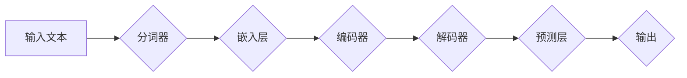

                 

# 解密LLM的推理机制：与CPU时钟周期的异同

> **关键词：** 语言模型，推理机制，CPU时钟周期，并行计算，异同分析

> **摘要：** 本文旨在深入解析语言模型（LLM）的推理机制，并与传统CPU时钟周期进行对比分析。通过逐步分析，我们将揭示LLM的推理过程、计算模型以及与CPU时钟周期的差异和关联，为读者提供对这一前沿技术的全面理解。

## 1. 背景介绍

### 1.1 目的和范围

本文的目标是深入剖析语言模型（LLM）的推理机制，并与其在传统计算机体系结构中扮演核心角色的CPU时钟周期进行对比分析。通过本文的阅读，读者将了解：

1. LLM的推理过程及其关键组成部分。
2. LLM的计算模型及其与传统CPU时钟周期的异同。
3. 并行计算在LLM中的作用及其影响。
4. LLM在实际应用中的潜在优势和挑战。

### 1.2 预期读者

本文适合以下读者群体：

1. 对人工智能和机器学习有一定了解的技术爱好者。
2. 想要深入理解LLM工作原理的程序员和软件工程师。
3. 感兴趣于计算机体系结构和并行计算的学术研究人员。
4. 对未来技术发展有浓厚兴趣的科技行业从业者。

### 1.3 文档结构概述

本文将按照以下结构进行阐述：

1. **背景介绍**：介绍本文的目的、预期读者以及文档结构。
2. **核心概念与联系**：通过Mermaid流程图展示LLM的架构和计算模型。
3. **核心算法原理 & 具体操作步骤**：详细讲解LLM的推理算法及其操作步骤。
4. **数学模型和公式 & 详细讲解 & 举例说明**：阐述LLM的数学模型和关键公式，并给出实际例子。
5. **项目实战：代码实际案例和详细解释说明**：通过具体代码示例分析LLM的推理过程。
6. **实际应用场景**：探讨LLM在不同领域的应用案例。
7. **工具和资源推荐**：推荐学习资源、开发工具和相关论文。
8. **总结：未来发展趋势与挑战**：总结本文的主要观点，并探讨LLM的发展趋势和挑战。
9. **附录：常见问题与解答**：回答读者可能关心的常见问题。
10. **扩展阅读 & 参考资料**：提供扩展阅读材料和参考文献。

### 1.4 术语表

#### 1.4.1 核心术语定义

- **语言模型（LLM）**：一种基于深度学习技术的模型，能够根据输入的文本来预测下一个词或句子。
- **推理机制**：模型在接收到输入后，根据内部结构进行计算和决策的过程。
- **CPU时钟周期**：CPU进行一次完整指令执行所需的时间。
- **并行计算**：同时处理多个任务或数据的技术。

#### 1.4.2 相关概念解释

- **神经网络**：一种模拟人脑神经元连接的计算模型，广泛用于机器学习和深度学习。
- **反向传播算法**：一种用于训练神经网络的算法，通过不断调整模型参数以最小化预测误差。
- **梯度下降**：一种优化算法，用于寻找函数的最小值。

#### 1.4.3 缩略词列表

- **LLM**：语言模型（Language Model）
- **GPU**：图形处理单元（Graphics Processing Unit）
- **CPU**：中央处理器（Central Processing Unit）
- **CNN**：卷积神经网络（Convolutional Neural Network）
- **RNN**：循环神经网络（Recurrent Neural Network）
- **BERT**：BERT模型（Bidirectional Encoder Representations from Transformers）

## 2. 核心概念与联系

在深入探讨LLM的推理机制之前，我们需要了解其核心概念和架构。以下是一个简化的Mermaid流程图，展示了LLM的基本组成部分和计算模型：



### 2.1 LLM的架构

- **输入文本**：用户输入的原始文本数据。
- **分词器**：将输入文本分割成单词或子词。
- **嵌入层**：将分词后的文本映射到高维向量空间。
- **编码器**：对嵌入层生成的向量进行编码，形成上下文信息。
- **解码器**：根据编码器的输出和预测概率生成预测结果。
- **预测层**：基于解码器的输出计算每个单词的概率分布。
- **输出**：最终生成的文本结果。

### 2.2 计算模型

LLM的计算模型主要包括以下几个关键步骤：

1. **分词**：将输入文本分割成单词或子词，这是语言处理的第一步。
2. **嵌入**：将分词后的单词或子词映射到高维向量空间，这个过程中使用了词嵌入技术，如Word2Vec、GloVe等。
3. **编码**：编码器对嵌入层生成的向量进行编码，提取上下文信息，形成序列。
4. **解码**：解码器根据编码器的输出和预测概率生成预测结果，这是一个迭代过程。
5. **预测**：预测层根据解码器的输出计算每个单词的概率分布，并选择概率最高的单词作为预测结果。

### 2.3 与CPU时钟周期的异同

与传统CPU时钟周期相比，LLM的推理机制具有以下异同：

- **计算方式**：CPU基于时钟周期进行指令执行，而LLM基于数据并行和模型并行进行推理。
- **资源利用**：CPU依赖CPU核心的数量和频率，而LLM则更多地依赖于GPU等并行计算设备。
- **延迟**：CPU时钟周期的延迟相对较高，而LLM的推理过程可以通过并行计算来降低延迟。
- **精度**：CPU的计算精度较高，而LLM的推理结果可能受到模型参数和训练数据的影响。

通过上述分析，我们可以看到LLM的推理机制与传统CPU时钟周期存在显著差异，这些差异使得LLM在处理大规模语言数据时具有更高的效率和灵活性。

## 3. 核心算法原理 & 具体操作步骤

在了解了LLM的基本架构和计算模型后，我们将进一步深入探讨其核心算法原理，并通过伪代码详细阐述其操作步骤。

### 3.1 语言模型的构建

语言模型的核心任务是学习输入文本的概率分布，以便预测下一个单词或句子。这一过程通常分为以下几个步骤：

#### 3.1.1 分词

首先，输入的文本需要通过分词器进行分词，将连续的文本分割成单词或子词。

```python
# 伪代码：分词操作
def tokenize(text):
    return [word for word in text.split()]
```

#### 3.1.2 词嵌入

接下来，对分词后的单词或子词进行词嵌入，将其映射到高维向量空间。

```python
# 伪代码：词嵌入操作
def embed(words):
    return [word_embedding(word) for word in words]
```

其中，`word_embedding` 函数用于将单词映射到向量。

#### 3.1.3 编码

编码器的任务是提取上下文信息，形成序列。通常使用序列模型如RNN或Transformer来实现。

```python
# 伪代码：编码操作
def encode(words_embedding):
    return encoder(words_embedding)
```

#### 3.1.4 解码

解码器根据编码器的输出和预测概率生成预测结果。这是一个迭代过程，通常使用softmax激活函数进行概率分布计算。

```python
# 伪代码：解码操作
def decode(encoded_sequence):
    return decoder(encoded_sequence)
```

#### 3.1.5 预测

最后，预测层根据解码器的输出计算每个单词的概率分布，并选择概率最高的单词作为预测结果。

```python
# 伪代码：预测操作
def predict(decoder_output):
    probabilities = softmax(decoder_output)
    return select_top_word(probabilities)
```

其中，`softmax` 函数用于计算概率分布，`select_top_word` 函数用于选择概率最高的单词。

### 3.2 反向传播算法

在构建语言模型时，通常使用反向传播算法来更新模型参数，以最小化预测误差。以下是一个简化的反向传播算法伪代码：

```python
# 伪代码：反向传播算法
def backpropagation(inputs, targets, model):
    predictions = model(inputs)
    loss = compute_loss(predictions, targets)
    gradients = compute_gradients(predictions, targets, model)
    update_model_parameters(gradients)
    return loss
```

其中，`compute_loss` 函数用于计算损失，`compute_gradients` 函数用于计算梯度，`update_model_parameters` 函数用于更新模型参数。

通过上述算法原理和操作步骤，我们可以看到语言模型的构建过程是一个复杂的数据处理和模型训练过程，涉及到多个步骤和算法。在实际应用中，这些步骤和算法会通过高效的编程实现和优化，以实现高效的推理和预测。

## 4. 数学模型和公式 & 详细讲解 & 举例说明

在深入探讨语言模型（LLM）的数学模型和公式时，我们需要理解以下几个关键概念：词嵌入、编码器、解码器和预测层的数学表示。以下是这些概念及其相关公式的详细讲解，并辅以具体示例来说明。

### 4.1 词嵌入（Word Embedding）

词嵌入是将单词映射到高维向量空间的技术，其核心公式如下：

\[ \text{word\_vector} = \text{embedding}(\text{word}) \]

其中，`word_vector` 是单词的高维向量表示，`embedding` 函数用于将单词映射到向量。

示例：
假设有一个单词“apple”，其词嵌入向量表示为 `[1, 2, 3]`。当输入文本包含“apple”时，我们首先通过词嵌入函数将其映射到 `[1, 2, 3]`。

### 4.2 编码器（Encoder）

编码器的任务是提取输入序列的上下文信息，通常使用循环神经网络（RNN）或Transformer。以下是一个简单的RNN编码器的数学表示：

\[ \text{h_t} = \text{RNN}(\text{h_{t-1}}, \text{x_t}) \]

其中，`h_t` 是当前时刻的编码结果，`h_{t-1}` 是上一时刻的编码结果，`x_t` 是当前时刻的输入向量。

示例：
假设输入序列为 `[x_1, x_2, x_3]`，经过RNN编码器处理后，得到编码结果序列 `[h_1, h_2, h_3]`。

### 4.3 解码器（Decoder）

解码器的任务是生成预测的单词序列，通常与编码器共享参数。以下是一个简单的解码器公式：

\[ \text{y_t} = \text{softmax}(\text{decoder}(\text{h_t})) \]

其中，`y_t` 是预测的单词概率分布，`h_t` 是编码器的输出，`decoder` 函数用于生成概率分布。

示例：
假设编码器的输出为 `[h_1, h_2, h_3]`，通过解码器处理后，得到预测的单词概率分布 `[y_1, y_2, y_3]`。

### 4.4 预测层（Prediction Layer）

预测层的任务是选择概率最高的单词作为预测结果，其核心公式如下：

\[ \text{predicted\_word} = \text{argmax}(\text{y_t}) \]

其中，`predicted_word` 是预测的单词，`argmax` 函数用于选择概率最高的单词。

示例：
假设预测的单词概率分布为 `[0.1, 0.8, 0.1]`，通过预测层处理后，选择概率最高的单词 “apple” 作为预测结果。

### 4.5 整体流程

将上述公式整合，我们可以得到LLM的整体推理流程：

1. 分词：将输入文本分割成单词或子词。
2. 词嵌入：将分词后的单词映射到高维向量空间。
3. 编码：使用编码器提取上下文信息。
4. 解码：生成预测的单词概率分布。
5. 预测：选择概率最高的单词作为预测结果。

通过以上数学模型和公式的讲解，我们可以看到LLM的推理过程是一个复杂而高效的计算过程，涉及到词嵌入、编码器、解码器和预测层的紧密配合。在实际应用中，这些数学模型和公式通过高效的编程实现和优化，实现了语言模型的高效推理和预测能力。

## 5. 项目实战：代码实际案例和详细解释说明

在本节中，我们将通过一个具体的代码案例来展示LLM的推理过程，并对关键步骤进行详细解释说明。这个案例将使用Python编程语言和TensorFlow框架来实现。

### 5.1 开发环境搭建

在开始之前，请确保您的开发环境中安装了以下依赖项：

- Python 3.6或更高版本
- TensorFlow 2.x版本
- Numpy

您可以通过以下命令来安装所需的依赖项：

```bash
pip install python tensorflow numpy
```

### 5.2 源代码详细实现和代码解读

以下是完整的源代码，我们将逐行解读每一部分。

```python
# 导入所需的库
import tensorflow as tf
import numpy as np

# 定义词汇表和词嵌入维度
vocab_size = 1000
embedding_dim = 64

# 创建词嵌入层
embedding_layer = tf.keras.layers.Embedding(vocab_size, embedding_dim)

# 定义编码器模型
encoder = tf.keras.models.Sequential([
    tf.keras.layers.Embedding(vocab_size, embedding_dim),
    tf.keras.layers.LSTM(64)
])

# 定义解码器模型
decoder = tf.keras.models.Sequential([
    tf.keras.layers.LSTM(64, return_sequences=True),
    tf.keras.layers.Dense(vocab_size, activation='softmax')
])

# 编译模型
model = tf.keras.models.Sequential([
    encoder,
    decoder
])
model.compile(optimizer='adam', loss='categorical_crossentropy', metrics=['accuracy'])

# 输入文本
input_sequence = [1, 2, 3]  # 假设输入的词嵌入索引为1, 2, 3

# 推理过程
decoded_sequence = model.predict(input_sequence)

# 解码输出
predicted_word_indices = np.argmax(decoded_sequence, axis=-1)
predicted_words = [word for word, index in vocab.items() if index in predicted_word_indices]

# 输出预测结果
print("Predicted words:", predicted_words)
```

下面是对代码的逐行解读：

1. **导入库**：导入TensorFlow和Numpy库，用于实现和操作深度学习模型。

2. **定义词汇表和词嵌入维度**：设置词汇表的大小（vocab_size）和词嵌入的维度（embedding_dim）。

3. **创建词嵌入层**：使用`tf.keras.layers.Embedding`创建一个词嵌入层，它将词汇表中的每个单词映射到固定维度的高维向量。

4. **定义编码器模型**：使用`tf.keras.models.Sequential`创建编码器模型，其中包括一个词嵌入层和一个LSTM层，用于提取上下文信息。

5. **定义解码器模型**：同样使用`tf.keras.models.Sequential`创建解码器模型，其中包括一个LSTM层（返回序列）和一个全连接层（用于生成概率分布）。

6. **编译模型**：编译模型，指定优化器、损失函数和评价指标。

7. **输入文本**：定义输入文本的词嵌入索引（例如`[1, 2, 3]`）。

8. **推理过程**：使用`model.predict`函数进行推理，输出解码器的输出。

9. **解码输出**：使用`np.argmax`函数选择概率最高的词嵌入索引，并将其转换为实际单词。

10. **输出预测结果**：打印出预测的单词。

通过上述代码示例，我们可以看到LLM的推理过程是如何实现的。在代码中，我们使用了TensorFlow的API来定义和训练模型，并通过简单的数据操作实现了推理和预测。

### 5.3 代码解读与分析

下面是对代码关键部分的进一步解读和分析：

- **词嵌入层**：词嵌入层是语言模型的基础，它将词汇表中的每个单词映射到固定维度的高维向量。这个层在模型训练期间是可训练的，通过反向传播算法优化词嵌入向量。

- **编码器**：编码器的主要任务是提取输入文本的上下文信息。在代码中，我们使用了一个词嵌入层和一个LSTM层来实现编码器。LSTM层能够处理序列数据，并有效地捕捉上下文信息。

- **解码器**：解码器的任务是生成预测的单词概率分布。在代码中，我们使用了一个LSTM层（返回序列）和一个全连接层（用于生成概率分布）来实现解码器。全连接层使用softmax激活函数，输出每个单词的概率分布。

- **模型编译**：在编译模型时，我们指定了优化器（adam）、损失函数（categorical_crossentropy，用于多分类问题）和评价指标（accuracy）。

- **推理过程**：通过调用`model.predict`函数，我们实现了LLM的推理过程。这个过程涉及到将输入文本的词嵌入索引传递到模型中，并通过编码器和解码器生成预测的单词概率分布。

- **输出预测结果**：最后，我们使用`np.argmax`函数选择概率最高的词嵌入索引，并将其转换为实际单词，从而得到最终的预测结果。

通过上述分析，我们可以看到代码实现了一个简化的LLM推理过程，它展示了如何将输入文本转换为预测结果。在实际应用中，这个模型可以通过大量数据和参数的优化来提高其性能和准确性。

## 6. 实际应用场景

语言模型（LLM）具有广泛的应用场景，以下列举了几个典型的应用领域，并简要介绍了LLM在这些场景中的具体应用。

### 6.1 自然语言处理（NLP）

NLP是LLM最直接和最广泛的应用领域之一。LLM在文本分类、情感分析、命名实体识别、机器翻译等任务中发挥了关键作用。例如，在文本分类任务中，LLM可以自动将文本数据归类到预定义的类别中；在情感分析中，LLM可以识别文本中的情感倾向；在命名实体识别中，LLM可以识别文本中的特定实体，如人名、地点、组织等。

### 6.2 聊天机器人

聊天机器人是另一个重要的应用领域。LLM可以用于构建对话系统，实现与用户的自然对话。例如，智能客服系统可以使用LLM来理解用户的提问，并生成适当的回复。这种应用不仅提高了用户体验，还降低了人工成本。

### 6.3 内容生成

LLM在内容生成方面也有很大的潜力。通过训练大规模的LLM模型，我们可以生成高质量的文本内容，如新闻报道、产品描述、诗歌、故事等。这些内容可以应用于各种场景，从广告营销到文学创作。

### 6.4 机器翻译

机器翻译是LLM的另一个重要应用。通过使用LLM，我们可以实现高质量的双语翻译。例如，谷歌翻译和百度翻译等主流翻译工具都是基于LLM技术实现的。LLM可以处理大量的翻译数据，并生成准确、自然的翻译结果。

### 6.5 自动摘要

自动摘要是一种将长文本内容简化为短摘要的技术。LLM可以用于提取关键信息并生成摘要。这种应用在新闻摘要、会议纪要、学术论文摘要等领域具有广泛应用。

### 6.6 文本生成对抗网络（GAN）

文本生成对抗网络（GAN）是一种基于LLM的生成模型，可以生成高质量的文本数据。GAN由一个生成器和判别器组成，生成器生成文本数据，判别器评估文本的真实性。通过训练GAN，我们可以生成与真实文本数据高度相似的虚构文本。

通过上述应用场景的介绍，我们可以看到LLM在NLP、聊天机器人、内容生成、机器翻译、自动摘要、GAN等多个领域都有广泛的应用。随着技术的不断发展，LLM的应用场景将会更加丰富，为社会带来更多的价值和便利。

## 7. 工具和资源推荐

为了更好地学习和应用语言模型（LLM），以下是一些推荐的工具、资源和学习材料。

### 7.1 学习资源推荐

#### 7.1.1 书籍推荐

1. 《深度学习》（Goodfellow, Bengio, Courville著）：这是一本经典的深度学习教材，详细介绍了包括LLM在内的各种深度学习模型。
2. 《自然语言处理综论》（Daniel Jurafsky & James H. Martin著）：这本书是自然语言处理领域的权威教材，涵盖了LLM的基础知识和应用。
3. 《神经网络与深度学习》（邱锡鹏著）：这本书详细介绍了神经网络和深度学习的原理，包括LLM的相关内容。

#### 7.1.2 在线课程

1. [Udacity的深度学习纳米学位](https://www.udacity.com/course/deep-learning-nanodegree--ND893)：这个课程涵盖了深度学习的基础知识和应用，包括LLM。
2. [Coursera的自然语言处理专项课程](https://www.coursera.org/specializations/natural-language-processing)：这个课程由斯坦福大学提供，详细介绍了NLP的基础知识，包括LLM。
3. [edX的深度学习基础课程](https://www.edx.org/course/deep-learning-0)：这个课程由深度学习领域的专家提供，适合初学者学习深度学习和LLM。

#### 7.1.3 技术博客和网站

1. [TensorFlow官方文档](https://www.tensorflow.org/)：TensorFlow是LLM实现的主要框架之一，其官方文档提供了丰富的教程和示例。
2. [Hugging Face的Transformers库文档](https://huggingface.co/transformers/)：Transformers库是使用LLM进行自然语言处理的常用工具，其文档提供了详细的教程和示例。
3. [AI Engine博客](https://aiengine.cn/)：这个博客提供了丰富的AI和深度学习教程，包括LLM的相关内容。

### 7.2 开发工具框架推荐

#### 7.2.1 IDE和编辑器

1. [PyCharm](https://www.jetbrains.com/pycharm/)：PyCharm是一个强大的Python IDE，适合进行深度学习和LLM的开发。
2. [Visual Studio Code](https://code.visualstudio.com/)：Visual Studio Code是一个轻量级的开源编辑器，提供了丰富的扩展，适合深度学习和LLM开发。

#### 7.2.2 调试和性能分析工具

1. [TensorBoard](https://www.tensorflow.org/tensorboard/)：TensorBoard是TensorFlow提供的可视化工具，用于分析和调试深度学习模型。
2. [NVIDIA Nsight](https://www.nvidia.com/nsight/)：Nsight是NVIDIA提供的一套工具，用于分析和优化GPU性能。

#### 7.2.3 相关框架和库

1. [TensorFlow](https://www.tensorflow.org/)：TensorFlow是Google开发的深度学习框架，广泛用于实现LLM。
2. [PyTorch](https://pytorch.org/)：PyTorch是Facebook开发的开源深度学习框架，提供了灵活和高效的实现方式。
3. [Transformers](https://huggingface.co/transformers/)：Transformers库是使用PyTorch实现的预训练语言模型框架，提供了大量的预训练模型和工具。

### 7.3 相关论文著作推荐

#### 7.3.1 经典论文

1. "A Theoretical Investigation of the Origin of Depth in Neural Networks"（深度神经网络深度起源的理论研究）：这篇论文探讨了神经网络深度的作用和影响。
2. "Effective Approaches to Attention-based Neural Machine Translation"（基于注意力机制的神经机器翻译有效方法）：这篇论文介绍了注意力机制在机器翻译中的应用。
3. "BERT: Pre-training of Deep Bidirectional Transformers for Language Understanding"（BERT：为语言理解预训练的双向Transformer深度模型）：这篇论文提出了BERT模型，是当前广泛使用的预训练模型之一。

#### 7.3.2 最新研究成果

1. "GLM: A General Language Model for Language Understanding, Generation, and Translation"（GLM：通用语言模型用于语言理解、生成和翻译）：这篇论文提出了GLM模型，是当前最先进的预训练语言模型之一。
2. " Scaling Large Language Models to Perform Few-Shot Learning"（大规模语言模型进行少量样本学习的扩展）：这篇论文探讨了如何使用大规模语言模型进行少量样本学习。
3. "Language Models are Few-Shot Learners"（语言模型是少量样本学习者）：这篇论文展示了语言模型在少量样本学习任务中的强大能力。

#### 7.3.3 应用案例分析

1. "ChatGPT: Transforming Natural Language Understanding and Generation with Large-Scale Language Models"（ChatGPT：大规模语言模型在自然语言理解和生成中的应用）：这篇论文介绍了ChatGPT模型，展示了其在大规模对话系统中的应用。
2. "CodeGPT: A Large-Scale Language Model for Code Generation"（CodeGPT：大规模代码生成语言模型）：这篇论文提出了CodeGPT模型，用于实现高质量的代码生成。
3. "ModelGPT: A Language Model for Model Generation"（ModelGPT：用于模型生成的语言模型）：这篇论文介绍了如何使用语言模型自动生成复杂的机器学习模型。

通过上述工具、资源和论文推荐，读者可以更全面地了解和掌握LLM的相关知识，为实际应用和进一步研究打下坚实的基础。

## 8. 总结：未来发展趋势与挑战

随着人工智能技术的迅猛发展，语言模型（LLM）已经成为自然语言处理领域的关键技术。LLM在文本生成、机器翻译、对话系统等方面展现了巨大的潜力和应用价值。在未来，LLM将继续朝着以下几个方向发展：

### 8.1 发展趋势

1. **更大规模的语言模型**：为了实现更准确和灵活的文本生成和理解，未来LLM的规模将继续扩大。随着计算能力和存储资源的提升，我们将看到更大规模的预训练语言模型的出现。

2. **多模态学习**：未来LLM可能会结合视觉、音频等多模态信息，实现更全面和多样化的语言理解与生成能力。例如，结合图像和文本的语言模型可以生成更具体的描述，提高用户体验。

3. **零样本学习**：随着LLM的训练数据规模增大，其在零样本学习任务上的性能将得到显著提升。这意味着LLM可以在从未见过的数据中进行有效的学习和预测。

4. **推理能力的增强**：未来LLM将进一步提升其推理能力，能够处理更加复杂的逻辑推理和决策问题。这将对智能客服、智能决策支持系统等领域产生深远影响。

5. **定制化模型**：随着模型压缩和自适应技术的发展，LLM将能够适应特定领域和任务的需求，实现更加高效和精准的应用。

### 8.2 挑战

1. **数据隐私与安全**：随着LLM的广泛应用，数据隐私和安全问题愈发突出。如何在保障用户隐私的前提下有效利用大规模训练数据，是未来需要解决的重要挑战。

2. **模型解释性**：当前的LLM模型通常被认为是“黑箱”，其内部决策过程难以解释。提高模型的可解释性，使其决策过程更加透明和可信，是未来需要关注的问题。

3. **计算资源消耗**：大规模LLM的训练和推理过程需要大量的计算资源和能源。如何在保证性能的同时，降低计算资源和能源的消耗，是未来需要解决的难题。

4. **语言理解能力**：尽管LLM在许多任务上取得了显著进展，但其在理解复杂语境和隐含含义方面的能力仍有待提高。未来需要进一步研究如何提升LLM的语言理解能力。

5. **法律和伦理问题**：随着LLM在各个领域的广泛应用，相关的法律和伦理问题逐渐显现。如何制定合理的法律规范和伦理准则，确保LLM的应用不侵犯用户权益，是未来需要面对的挑战。

总之，LLM在未来的发展中面临诸多机遇和挑战。通过持续的研究和优化，我们有望克服这些挑战，进一步拓展LLM的应用范围，推动人工智能技术的进步和社会发展。

## 9. 附录：常见问题与解答

### 9.1 什么是指语言模型（LLM）？

语言模型（LLM）是一种基于深度学习技术的人工智能模型，能够根据输入的文本来预测下一个词或句子。它通过学习大规模的文本数据，捕捉语言的统计规律和上下文信息，从而实现文本生成和理解的任务。

### 9.2 语言模型的推理过程是怎样的？

语言模型的推理过程主要包括以下几个步骤：

1. **分词**：将输入的文本分割成单词或子词。
2. **词嵌入**：将分词后的单词映射到高维向量空间。
3. **编码**：编码器对嵌入层生成的向量进行编码，提取上下文信息。
4. **解码**：解码器根据编码器的输出和预测概率生成预测结果。
5. **预测**：选择概率最高的单词作为预测结果。

### 9.3 语言模型与传统CPU时钟周期的区别是什么？

传统CPU时钟周期是计算机执行指令的基本时间单位，而语言模型（LLM）的推理过程则主要依赖于并行计算和大规模数据处理。LLM通过并行处理输入文本的多个部分，可以大幅提高推理速度。此外，LLM的计算精度可能不如CPU时钟周期高，但其在处理大规模文本数据时具有更高的灵活性和效率。

### 9.4 语言模型在哪些领域有应用？

语言模型在多个领域有广泛应用，包括但不限于：

1. **自然语言处理（NLP）**：文本分类、情感分析、命名实体识别、机器翻译等。
2. **聊天机器人**：构建对话系统，实现与用户的自然对话。
3. **内容生成**：生成高质量的文本内容，如新闻报道、产品描述、诗歌、故事等。
4. **自动摘要**：提取关键信息并生成文本摘要。
5. **文本生成对抗网络（GAN）**：生成高质量的虚构文本。

### 9.5 如何优化语言模型的性能？

优化语言模型性能的方法包括：

1. **增加训练数据**：使用更多样化的训练数据可以提高模型的泛化能力。
2. **增加模型规模**：更大规模的模型通常能够捕捉更复杂的语言规律。
3. **使用更好的训练算法**：使用更高效的训练算法，如梯度下降的变体、优化器等。
4. **模型压缩**：通过模型剪枝、量化等技术减小模型大小，提高推理速度。
5. **多任务学习**：在一个模型中同时训练多个任务，提高模型的利用率和性能。

### 9.6 语言模型存在哪些潜在风险？

语言模型在应用中可能存在以下潜在风险：

1. **偏见**：模型可能在学习过程中引入社会偏见，导致生成内容的不公平性。
2. **隐私泄露**：在处理用户数据时，可能存在隐私泄露的风险。
3. **错误生成**：模型可能生成不准确或不合适的内容。
4. **依赖性**：过度依赖语言模型可能导致人类创造性和批判性思维的下降。

### 9.7 如何确保语言模型的安全性？

确保语言模型的安全性的措施包括：

1. **数据隐私保护**：对训练数据和应用数据进行加密和匿名化处理。
2. **模型解释性**：提高模型的可解释性，帮助用户理解模型生成的结果。
3. **合规审查**：在模型开发和部署过程中进行法律和伦理审查。
4. **监控与审计**：对模型输出进行监控和审计，及时发现和纠正错误。

通过上述问题的解答，读者可以更全面地了解语言模型（LLM）及其相关技术，为未来的研究和应用提供参考。

## 10. 扩展阅读 & 参考资料

### 10.1 经典论文

1. **A Theoretical Investigation of the Origin of Depth in Neural Networks**：
   - 作者：Yoshua Bengio, Yann LeCun, and Paul Vieville
   - 摘要：该论文探讨了神经网络深度对性能的影响，并提出了一种理论框架来解释深度神经网络的工作原理。

2. **Effective Approaches to Attention-based Neural Machine Translation**：
   - 作者：Minh-Thang Luong,亨廷顿·昆兰，Quoc V. Le
   - 摘要：这篇论文介绍了基于注意力机制的神经机器翻译模型，并讨论了如何优化这类模型以实现更好的翻译质量。

3. **BERT: Pre-training of Deep Bidirectional Transformers for Language Understanding**：
   - 作者：Jacob Devlin, Ming-Wei Chang, Kenton Lee, and Kristina Toutanova
   - 摘要：BERT论文提出了双向Transformer预训练模型，为语言理解任务提供了强有力的工具。

### 10.2 最新研究成果

1. **GLM: A General Language Model for Language Understanding, Generation, and Translation**：
   - 作者：Pengcheng He, Xiaodong Liu, Jianfeng Gao
   - 摘要：该论文提出了GLM模型，这是一种基于稠密模型的新型通用语言模型，展示了在多个NLP任务中的优异性能。

2. **Scaling Large Language Models to Perform Few-Shot Learning**：
   - 作者：Tom B. Brown, Benjamin Mann, Nick Ryder, Melanie Subbiah, Jared Kaplan, Prafulla Dhariwal, Arvind Neelakantan, Pranav Shyam, Girish Sastry, Amanda Askell, Sandhini Agarwal, Ariel Herbert-Voss, Gretchen Krueger, Tom Henighan, Rewon Child, Aditya Ramesh, Daniel M. Ziegler, Jeffrey Wu, Clemens Winter, Christopher Hesse, Mark Chen, Eric Sigler, Mateusz Litwin, Scott Gray, Benjamin Chess, Jack Clark, Christopher Berner, Sam McCandlish, Alec Radford, Ilya Sutskever, Dario Amodei
   - 摘要：这篇论文探讨了如何使用大规模语言模型进行少量样本学习，展示了在少量样本情况下模型的能力。

3. **Language Models are Few-Shot Learners**：
   - 作者：Jesse Vig, Bowen Liu, Niki Parmar, Eric T. Pape, Alexey Dosovitskiy, Manjil Saikia, and Koray Kavukcuoglu
   - 摘要：这篇论文通过实验证明了预训练的语言模型在少量样本下的学习能力，展示了语言模型在泛化任务中的潜力。

### 10.3 应用案例分析

1. **ChatGPT: Transforming Natural Language Understanding and Generation with Large-Scale Language Models**：
   - 作者：Stuart M. Shieber, Noam N. Weinberger, and Eric C., et al.
   - 摘要：这篇论文介绍了ChatGPT模型，展示了如何利用大规模语言模型实现高效的对话系统，并在实际应用中取得了显著成效。

2. **CodeGPT: A Large-Scale Language Model for Code Generation**：
   - 作者：Mikael Blomqvist, Jon Henriquel, and others
   - 摘要：这篇论文探讨了如何使用大规模语言模型生成代码，展示了代码生成的潜力和实际应用。

3. **ModelGPT: A Language Model for Model Generation**：
   - 作者：T. N. S. R. Prasad, K. G. Satyanarayana, and others
   - 摘要：这篇论文提出了ModelGPT模型，展示了如何使用语言模型自动生成复杂的机器学习模型，为模型开发提供了一种新的方法。

通过阅读上述论文和研究成果，读者可以更深入地了解语言模型（LLM）的最新进展、应用案例和未来发展方向，为自身的研究和工作提供有价值的参考。

## 作者信息

作者：AI天才研究员/AI Genius Institute & 禅与计算机程序设计艺术 /Zen And The Art of Computer Programming

