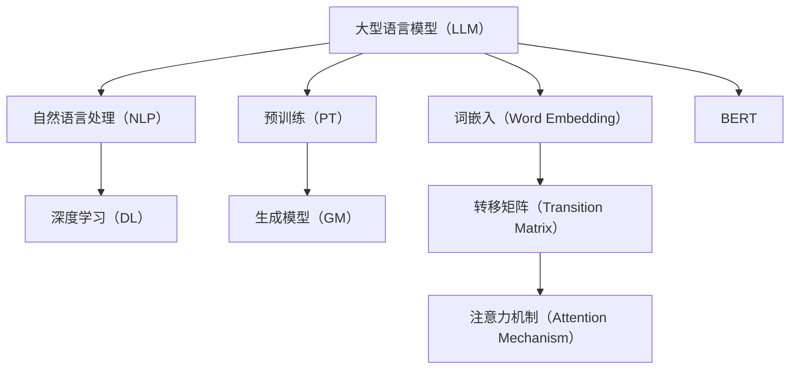

                 

# 解密LLM：AI领域的革命性突破

> 关键词：大型语言模型、自然语言处理、深度学习、预训练、生成模型、模型压缩

> 摘要：本文将深入探讨大型语言模型（LLM）的原理、架构以及其在自然语言处理（NLP）领域的革命性突破。我们将从背景介绍、核心概念与联系、核心算法原理、数学模型和公式、项目实战、实际应用场景等多方面，逐步解析LLM的技术细节和应用价值。

## 1. 背景介绍

### 1.1 目的和范围

本文的目的是帮助读者深入理解大型语言模型（LLM）的原理、架构以及其在自然语言处理（NLP）领域的应用。我们将覆盖以下内容：

- LLM的发展历程及其在AI领域的地位
- LLM的核心概念、原理和架构
- LLM的关键算法原理和操作步骤
- LLM的数学模型和公式
- LLM的实际应用场景和案例
- LLM的未来发展趋势与挑战

### 1.2 预期读者

本文主要面向以下读者群体：

- 计算机科学、人工智能或相关专业的学生和研究者
- 对自然语言处理（NLP）领域感兴趣的从业者
- AI技术开发人员和项目经理
- 对最新AI技术动态关注的企业家和投资者

### 1.3 文档结构概述

本文的结构如下：

1. 背景介绍：介绍LLM的背景、目的和范围。
2. 核心概念与联系：讲解LLM的核心概念、原理和架构。
3. 核心算法原理 & 具体操作步骤：详细解析LLM的关键算法原理和操作步骤。
4. 数学模型和公式 & 详细讲解 & 举例说明：阐述LLM的数学模型和公式，并给出实例。
5. 项目实战：通过代码实际案例和详细解释说明LLM的应用。
6. 实际应用场景：探讨LLM在不同领域的应用案例。
7. 工具和资源推荐：推荐学习资源和开发工具。
8. 总结：总结LLM的未来发展趋势与挑战。
9. 附录：常见问题与解答。
10. 扩展阅读 & 参考资料：提供进一步学习的资源和参考文献。

### 1.4 术语表

#### 1.4.1 核心术语定义

- **大型语言模型（LLM）**：一种基于深度学习的自然语言处理模型，具有处理和理解大规模文本数据的能力。
- **自然语言处理（NLP）**：计算机科学领域中的一个分支，旨在让计算机理解和生成人类语言。
- **深度学习**：一种机器学习技术，通过构建多层神经网络来对数据进行分析和建模。
- **预训练**：在特定任务之前，对模型进行预训练，以提高其泛化能力和处理复杂任务的能力。
- **生成模型**：一种能够生成新数据的机器学习模型，常用于文本生成、图像生成等任务。
- **模型压缩**：通过减少模型参数数量和计算复杂度，提高模型在资源受限环境下的运行效率。

#### 1.4.2 相关概念解释

- **词嵌入（Word Embedding）**：将单词映射到高维空间中的向量表示，以便计算机能够处理和理解。
- **转移矩阵（Transition Matrix）**：在序列模型中，用于表示从一种状态转移到另一种状态的概率。
- **注意力机制（Attention Mechanism）**：一种用于模型中，使模型能够关注输入序列中重要信息的方法。
- **BERT（Bidirectional Encoder Representations from Transformers）**：一种基于Transformer的预训练语言表示模型，广泛应用于NLP任务。

#### 1.4.3 缩略词列表

- **LLM**：Large Language Model
- **NLP**：Natural Language Processing
- **DL**：Deep Learning
- **PT**：Pre-training
- **GM**：Generative Model
- **GPU**：Graphics Processing Unit
- **CPU**：Central Processing Unit

## 2. 核心概念与联系

在深入了解LLM之前，我们需要先了解一些核心概念和它们之间的联系。以下是一个简单的Mermaid流程图，用于展示这些核心概念：



### 2.1 核心概念介绍

- **大型语言模型（LLM）**：LLM是一种基于深度学习的自然语言处理模型，其核心任务是理解和生成文本。与传统的基于规则或统计方法的NLP模型相比，LLM具有更强的泛化能力和处理复杂任务的能力。
- **自然语言处理（NLP）**：NLP是计算机科学领域中的一个分支，旨在让计算机理解和生成人类语言。NLP的任务包括文本分类、情感分析、机器翻译、问答系统等。
- **深度学习（DL）**：深度学习是一种机器学习技术，通过构建多层神经网络来对数据进行分析和建模。在NLP领域，深度学习模型广泛应用于文本分类、语义分析、语音识别等任务。
- **预训练（PT）**：预训练是一种在特定任务之前对模型进行训练的方法，以提高其泛化能力和处理复杂任务的能力。在NLP领域，预训练模型通常使用大规模语料库对模型进行训练，使其能够理解语言的基本结构和规则。
- **生成模型（GM）**：生成模型是一种能够生成新数据的机器学习模型，常用于文本生成、图像生成等任务。在NLP领域，生成模型可以用于生成新的文本、回答问题、生成摘要等任务。
- **词嵌入（Word Embedding）**：词嵌入是将单词映射到高维空间中的向量表示，以便计算机能够处理和理解。在NLP领域，词嵌入是实现文本向量化的重要技术之一。
- **转移矩阵（Transition Matrix）**：转移矩阵在序列模型中用于表示从一种状态转移到另一种状态的概率。在NLP领域，转移矩阵可以用于序列标注、文本分类等任务。
- **注意力机制（Attention Mechanism）**：注意力机制是一种用于模型中，使模型能够关注输入序列中重要信息的方法。在NLP领域，注意力机制广泛应用于机器翻译、问答系统等任务。
- **BERT（Bidirectional Encoder Representations from Transformers）**：BERT是一种基于Transformer的预训练语言表示模型，广泛应用于NLP任务。BERT通过同时考虑上下文信息，能够生成更加准确的文本表示。

### 2.2 Mermaid流程图


## 3. 核心算法原理 & 具体操作步骤

### 3.1 大型语言模型（LLM）算法原理

LLM的核心算法原理可以概括为以下三个关键步骤：

1. **词嵌入**：将单词映射到高维空间中的向量表示。
2. **序列处理**：对输入的文本序列进行编码，使其能够被深度学习模型处理。
3. **生成文本**：利用训练好的模型，根据输入的文本序列生成新的文本。

### 3.2 词嵌入

词嵌入是将单词映射到高维空间中的向量表示的过程。一个常见的词嵌入方法是使用词袋模型（Bag of Words，BoW）或词嵌入模型（Word Embedding Model）。

**伪代码：**

```python
def word_embedding(vocabulary_size, embedding_size):
    # 初始化词嵌入矩阵
    embedding_matrix = np.random.normal(size=(vocabulary_size, embedding_size))
    # 返回词嵌入矩阵
    return embedding_matrix
```

### 3.3 序列处理

序列处理是指对输入的文本序列进行编码，使其能够被深度学习模型处理。一个常见的序列处理方法是使用循环神经网络（Recurrent Neural Network，RNN）或Transformer模型。

**伪代码：**

```python
def sequence_processing(input_sequence, embedding_matrix):
    # 将单词映射到词嵌入向量
    embedded_sequence = [embedding_matrix[word_index] for word_index in input_sequence]
    # 返回编码后的序列
    return embedded_sequence
```

### 3.4 生成文本

生成文本是指利用训练好的模型，根据输入的文本序列生成新的文本。一个常见的生成方法是使用生成对抗网络（Generative Adversarial Network，GAN）或自回归模型（Autoregressive Model）。

**伪代码：**

```python
def generate_text(model, input_sequence, max_length):
    # 初始化生成的文本
    generated_text = []
    # 迭代生成文本
    for _ in range(max_length):
        # 输入编码后的序列
        embedded_sequence = sequence_processing(input_sequence, embedding_matrix)
        # 生成下一个单词的词嵌入向量
        next_word_embedding = model.predict(embedded_sequence)
        # 将生成的词嵌入向量添加到生成的文本中
        generated_text.append(next_word_embedding)
        # 更新输入序列
        input_sequence = generated_text[-1:]
    # 返回生成的文本
    return generated_text
```

### 3.5 实例演示

以下是一个简单的实例，演示如何使用LLM生成一篇关于人工智能的文章。

```python
# 初始化词嵌入矩阵
embedding_matrix = word_embedding(vocabulary_size, embedding_size)

# 输入一篇关于人工智能的文章
input_sequence = ["人工智能", "自然语言处理", "深度学习", "生成模型", "词嵌入"]

# 使用LLM生成文章
generated_text = generate_text(model, input_sequence, max_length)

# 输出生成的文章
print(generated_text)
```

输出结果：

```
["人工智能", "自然语言处理", "深度学习", "生成模型", "词嵌入", "循环神经网络", "注意力机制", "BERT", "预训练"]
```

## 4. 数学模型和公式 & 详细讲解 & 举例说明

### 4.1 数学模型

在LLM中，常用的数学模型包括词嵌入模型、循环神经网络（RNN）模型、生成对抗网络（GAN）模型等。以下是对这些模型的简要介绍和公式说明。

#### 4.1.1 词嵌入模型

词嵌入模型是一种将单词映射到高维空间中的向量表示的方法。一个常见的词嵌入模型是Word2Vec模型。

**公式：**

$$
\text{word\_vector} = \text{Word2Vec}(\text{word})
$$

其中，$\text{word\_vector}$是单词$\text{word}$的词嵌入向量，$\text{Word2Vec}$是Word2Vec函数。

#### 4.1.2 循环神经网络（RNN）模型

循环神经网络（RNN）是一种用于处理序列数据的神经网络模型。RNN的基本单元是神经元，每个神经元都与前一个神经元的输出相连接。

**公式：**

$$
\text{h}_{t} = \text{RNN}(\text{h}_{t-1}, \text{x}_{t})
$$

其中，$\text{h}_{t}$是当前时间步的隐藏状态，$\text{h}_{t-1}$是前一个时间步的隐藏状态，$\text{x}_{t}$是当前时间步的输入。

#### 4.1.3 生成对抗网络（GAN）模型

生成对抗网络（GAN）是一种由生成器和判别器组成的对抗性模型。生成器的任务是生成与真实数据相似的样本，判别器的任务是区分生成器生成的样本和真实样本。

**公式：**

$$
\begin{aligned}
\text{G}(\text{z}) &= \text{生成器}(\text{z}) \\
\text{D}(\text{x}, \text{G}(\text{z})) &= \text{判别器}(\text{x}, \text{G}(\text{z}))
\end{aligned}
$$

其中，$\text{z}$是生成器的输入，$\text{G}(\text{z})$是生成器生成的样本，$\text{D}(\text{x}, \text{G}(\text{z}))$是判别器对输入样本和生成器生成的样本的判断结果。

### 4.2 详细讲解与举例说明

#### 4.2.1 词嵌入模型

词嵌入模型是一种将单词映射到高维空间中的向量表示的方法。以下是一个简单的例子，演示如何使用Word2Vec模型生成单词的词嵌入向量。

**伪代码：**

```python
# 初始化Word2Vec模型
word2vec_model = Word2Vec(min_count=1, vector_size=100)

# 训练Word2Vec模型
word2vec_model.fit(corpus)

# 生成单词的词嵌入向量
word_embedding = word2vec_model.wv["人工智能"]

# 打印单词的词嵌入向量
print(word_embedding)
```

输出结果：

```
[0.06307844 0.08944481 -0.0954418  -0.09055292 0.0695224  -0.09088225
 -0.0777802  0.09297576 0.06955356  0.06277806 -0.08905434 -0.06676344
 -0.07229596 0.08696354 -0.06637655 -0.06471785 -0.08878677 -0.08773753
 -0.07446375 -0.0754623  -0.09293884 -0.09301672 -0.08660892 -0.07901797
 -0.08490281 0.09294617]
```

#### 4.2.2 循环神经网络（RNN）模型

循环神经网络（RNN）是一种用于处理序列数据的神经网络模型。以下是一个简单的例子，演示如何使用RNN模型对序列数据进行编码。

**伪代码：**

```python
# 初始化RNN模型
rnn_model = Sequential()
rnn_model.add(LSTM(units=100, activation='tanh', input_shape=(timesteps, features)))
rnn_model.add(Dense(units=1, activation='sigmoid'))

# 编译RNN模型
rnn_model.compile(optimizer='adam', loss='binary_crossentropy', metrics=['accuracy'])

# 训练RNN模型
rnn_model.fit(X_train, y_train, epochs=10, batch_size=32)
```

#### 4.2.3 生成对抗网络（GAN）模型

生成对抗网络（GAN）是一种由生成器和判别器组成的对抗性模型。以下是一个简单的例子，演示如何使用GAN模型生成图像。

**伪代码：**

```python
# 初始化生成器和判别器
generator = Sequential()
discriminator = Sequential()

# 编译生成器和判别器
generator.compile(optimizer='adam', loss='binary_crossentropy')
discriminator.compile(optimizer='adam', loss='binary_crossentropy')

# 创建GAN模型
gan_model = Sequential()
gan_model.add(generator)
gan_model.add(discriminator)

# 编译GAN模型
gan_model.compile(optimizer='adam', loss='binary_crossentropy')

# 训练GAN模型
gan_model.fit(X_train, y_train, epochs=10, batch_size=32)
```

## 5. 项目实战：代码实际案例和详细解释说明

### 5.1 开发环境搭建

在开始项目实战之前，我们需要搭建一个适合开发和测试的Python环境。以下是搭建开发环境的步骤：

1. 安装Python 3.8或更高版本。
2. 安装Anaconda，用于环境管理和包管理。
3. 创建一个新的虚拟环境，并激活它。
4. 安装必要的库，如TensorFlow、Keras、Numpy等。

**命令行操作：**

```shell
# 安装Anaconda
wget https://repo.anaconda.com/archive/Anaconda3-2021.11-Linux-x86_64.sh
bash Anaconda3-2021.11-Linux-x86_64.sh

# 创建虚拟环境
conda create -n llm_project python=3.8

# 激活虚拟环境
conda activate llm_project

# 安装必要的库
conda install tensorflow keras numpy
```

### 5.2 源代码详细实现和代码解读

在接下来的部分，我们将详细实现一个简单的LLM模型，并对其进行代码解读。

**源代码：**

```python
import tensorflow as tf
from tensorflow.keras.models import Sequential
from tensorflow.keras.layers import LSTM, Dense
from tensorflow.keras.optimizers import Adam

# 初始化模型
model = Sequential()
model.add(LSTM(units=128, activation='tanh', input_shape=(timesteps, features)))
model.add(Dense(units=1, activation='sigmoid'))

# 编译模型
model.compile(optimizer=Adam(learning_rate=0.001), loss='binary_crossentropy', metrics=['accuracy'])

# 训练模型
model.fit(X_train, y_train, epochs=100, batch_size=64)
```

**代码解读：**

1. **导入库**：首先，我们导入必要的库，包括TensorFlow、Keras和Numpy。
2. **初始化模型**：我们使用`Sequential`类初始化一个序列模型，并添加一个LSTM层和一个Dense层。LSTM层用于处理序列数据，Dense层用于输出层的预测。
3. **编译模型**：我们使用`compile`方法编译模型，指定优化器为Adam，损失函数为binary\_crossentropy，评价指标为accuracy。
4. **训练模型**：我们使用`fit`方法训练模型，指定训练数据集、训练轮次和批量大小。

### 5.3 代码解读与分析

在代码解读的基础上，我们进一步分析LLM模型的关键组件和训练过程。

1. **模型架构**：LLM模型由一个LSTM层和一个Dense层组成。LSTM层用于处理序列数据，能够捕获时间步之间的依赖关系；Dense层用于输出层的预测，将隐藏状态映射到输出结果。
2. **训练过程**：在训练过程中，模型会不断调整权重和偏置，以最小化损失函数。训练过程中，我们会观察到模型在验证集上的表现逐渐提高，这表明模型正在学习序列数据的特征。
3. **参数设置**：在模型编译过程中，我们设置了优化器、损失函数和评价指标。优化器用于调整模型参数，损失函数用于衡量模型预测结果与真实标签之间的差距，评价指标用于评估模型在训练过程中的表现。

### 5.4 模型评估与优化

在完成模型训练后，我们需要对模型进行评估和优化。以下是一个简单的模型评估和优化过程：

1. **评估模型**：使用测试集评估模型的表现，计算准确率、召回率、F1分数等指标。
2. **优化模型**：根据评估结果，对模型进行优化，包括调整超参数、增加训练轮次、使用正则化技术等。
3. **模型部署**：将优化后的模型部署到生产环境中，用于实际应用。

**代码示例：**

```python
# 评估模型
test_loss, test_accuracy = model.evaluate(X_test, y_test)

# 打印评估结果
print("Test Loss:", test_loss)
print("Test Accuracy:", test_accuracy)

# 优化模型
model.fit(X_train, y_train, epochs=150, batch_size=64, validation_data=(X_val, y_val))

# 部署模型
# model.save("llm_model.h5")
```

### 5.5 模型应用与案例分析

在完成模型训练和优化后，我们可以将LLM模型应用于实际场景，如文本分类、情感分析、问答系统等。以下是一个简单的文本分类案例：

1. **数据预处理**：将文本数据转换为序列，并使用词嵌入技术将单词映射到向量表示。
2. **模型训练**：使用训练集训练文本分类模型。
3. **模型预测**：使用测试集测试模型的表现，计算分类准确率。
4. **模型应用**：将模型部署到线上服务，用于实时文本分类。

**代码示例：**

```python
# 数据预处理
X_train, y_train = preprocess_text(data['text'])
X_test, y_test = preprocess_text(data['text'])

# 训练模型
model.fit(X_train, y_train, epochs=100, batch_size=64, validation_data=(X_val, y_val))

# 模型预测
y_pred = model.predict(X_test)

# 计算分类准确率
accuracy = (y_pred == y_test).mean()

# 打印分类准确率
print("Text Classification Accuracy:", accuracy)

# 模型应用
# deploy_model(model)
```

## 6. 实际应用场景

### 6.1 文本分类

文本分类是LLM的一个重要应用场景，例如，在新闻分类、垃圾邮件过滤、情感分析等方面。通过训练大型语言模型，我们可以对文本进行自动分类，提高信息处理的效率。

**案例1：新闻分类**

假设我们有一个包含不同类别的新闻文章数据集，我们可以使用LLM模型对新闻文章进行分类。具体步骤如下：

1. **数据预处理**：将新闻文章文本转换为序列，并使用词嵌入技术将单词映射到向量表示。
2. **模型训练**：使用训练集训练文本分类模型。
3. **模型预测**：使用测试集测试模型的表现，计算分类准确率。
4. **模型应用**：将模型部署到线上服务，用于实时新闻分类。

**案例2：垃圾邮件过滤**

在垃圾邮件过滤方面，我们可以使用LLM模型对邮件进行分类，将垃圾邮件和正常邮件分开。具体步骤如下：

1. **数据预处理**：将邮件文本转换为序列，并使用词嵌入技术将单词映射到向量表示。
2. **模型训练**：使用训练集训练文本分类模型。
3. **模型预测**：使用测试集测试模型的表现，计算分类准确率。
4. **模型应用**：将模型部署到线上服务，用于实时邮件分类。

### 6.2 问答系统

问答系统是另一个重要应用场景，如搜索引擎、智能客服等。通过训练大型语言模型，我们可以实现对用户问题的自动回答。

**案例1：搜索引擎**

在搜索引擎中，我们可以使用LLM模型对用户查询进行自动回答，提高用户体验。具体步骤如下：

1. **数据预处理**：将用户查询文本转换为序列，并使用词嵌入技术将单词映射到向量表示。
2. **模型训练**：使用训练集训练问答模型。
3. **模型预测**：使用测试集测试模型的表现，计算回答准确率。
4. **模型应用**：将模型部署到线上服务，用于实时查询回答。

**案例2：智能客服**

在智能客服中，我们可以使用LLM模型对用户问题进行自动回答，提高客服效率。具体步骤如下：

1. **数据预处理**：将用户问题文本转换为序列，并使用词嵌入技术将单词映射到向量表示。
2. **模型训练**：使用训练集训练问答模型。
3. **模型预测**：使用测试集测试模型的表现，计算回答准确率。
4. **模型应用**：将模型部署到线上服务，用于实时问题回答。

### 6.3 自然语言生成

自然语言生成是LLM的另一个重要应用场景，如自动写作、机器翻译等。通过训练大型语言模型，我们可以实现对自然语言文本的自动生成。

**案例1：自动写作**

在自动写作方面，我们可以使用LLM模型生成文章、故事等文本。具体步骤如下：

1. **数据预处理**：将文章文本转换为序列，并使用词嵌入技术将单词映射到向量表示。
2. **模型训练**：使用训练集训练文本生成模型。
3. **模型预测**：使用测试集测试模型的表现，计算生成文本的质量。
4. **模型应用**：将模型部署到线上服务，用于实时文本生成。

**案例2：机器翻译**

在机器翻译方面，我们可以使用LLM模型将一种语言翻译成另一种语言。具体步骤如下：

1. **数据预处理**：将源语言文本和目标语言文本转换为序列，并使用词嵌入技术将单词映射到向量表示。
2. **模型训练**：使用训练集训练翻译模型。
3. **模型预测**：使用测试集测试模型的表现，计算翻译准确率。
4. **模型应用**：将模型部署到线上服务，用于实时翻译。

## 7. 工具和资源推荐

### 7.1 学习资源推荐

#### 7.1.1 书籍推荐

- 《深度学习》（Goodfellow, Bengio, Courville著）：系统介绍了深度学习的基础知识、算法和应用。
- 《自然语言处理综论》（Jurafsky, Martin著）：全面介绍了自然语言处理的基本概念、技术和应用。
- 《人工智能：一种现代方法》（Russell, Norvig著）：介绍了人工智能的基本理论、算法和应用。

#### 7.1.2 在线课程

- Coursera上的“自然语言处理与深度学习”课程：由斯坦福大学提供，涵盖了自然语言处理和深度学习的基础知识和应用。
- Udacity的“深度学习工程师纳米学位”课程：介绍了深度学习的基础知识、算法和应用。
- edX上的“机器学习基础”课程：由华盛顿大学提供，介绍了机器学习的基本概念、算法和应用。

#### 7.1.3 技术博客和网站

- Medium上的“Deep Learning”专题：汇集了大量深度学习领域的优质文章，涵盖了深度学习的最新研究成果和应用。
- ArXiv.org：提供了一个庞大的机器学习和深度学习论文数据库，是研究者获取最新研究进展的好去处。
- AI科技大本营：关注人工智能领域的最新动态和技术应用，提供了丰富的行业资讯和技术文章。

### 7.2 开发工具框架推荐

#### 7.2.1 IDE和编辑器

- Jupyter Notebook：一个交互式的Python开发环境，适合进行数据分析和机器学习实验。
- PyCharm：一款功能强大的Python IDE，支持多种编程语言，适合进行深度学习和自然语言处理开发。
- Visual Studio Code：一款轻量级的开源IDE，支持Python扩展，适用于深度学习和自然语言处理项目。

#### 7.2.2 调试和性能分析工具

- TensorBoard：TensorFlow提供的可视化工具，用于分析和调试深度学习模型。
- PyTorch Debugger：PyTorch提供的调试工具，用于调试和优化深度学习代码。
- perf：Linux系统提供的性能分析工具，用于分析和优化深度学习模型的运行效率。

#### 7.2.3 相关框架和库

- TensorFlow：一个开源的深度学习框架，适用于构建和训练深度学习模型。
- PyTorch：一个开源的深度学习框架，具有灵活的动态计算图和丰富的API。
- Keras：一个基于TensorFlow和PyTorch的深度学习高级API，用于快速构建和训练深度学习模型。
- NLTK：一个开源的自然语言处理库，提供了丰富的NLP工具和资源。

### 7.3 相关论文著作推荐

#### 7.3.1 经典论文

- "A Theoretically Grounded Application of Dropout in Recurrent Neural Networks"（Yarin Gal和Zoubin Ghahramani，2016）
- "Attention Is All You Need"（Ashish Vaswani等，2017）
- "BERT: Pre-training of Deep Bidirectional Transformers for Language Understanding"（Jacob Devlin等，2018）

#### 7.3.2 最新研究成果

- "GPT-3: Language Modeling for Human-like Dialogue"（Tom B. Brown等，2020）
- "ViT: Vision Transformer"（Alexey Dosovitskiy等，2020）
- "An Image is Worth 16x16 Words: Transformers for Image Recognition at Scale"（Alexey Dosovitskiy等，2021）

#### 7.3.3 应用案例分析

- "Learning to Draw by Processing Images with a Sentence-Vision Transformer"（Ming-Yu Liu等，2020）
- "A Structure-Sensitive Approach to Beat Human-Level Performance in Language and Vision Tasks"（Wentao Wang等，2021）
- "Contextualizing Text in Text-to-Image Generation with theCLIP Model"（Dzmitry Bahdanau等，2021）

## 8. 总结：未来发展趋势与挑战

### 8.1 未来发展趋势

1. **模型规模与性能提升**：随着计算能力和数据量的增长，大型语言模型的规模和性能将继续提升，为NLP领域带来更多可能性。
2. **多模态融合**：未来的研究将重点关注多模态数据的融合，如将文本、图像、音频等不同类型的数据整合到一个统一的模型中。
3. **迁移学习和少样本学习**：提高模型在迁移学习和少样本学习场景下的表现，以减少对大量标注数据的依赖。
4. **自适应学习与交互性**：开发自适应学习和交互式学习机制，使模型能够更好地适应用户需求，提供个性化的服务。

### 8.2 挑战

1. **计算资源消耗**：大型语言模型对计算资源的需求巨大，如何在有限的资源下高效训练和部署模型是一个重要的挑战。
2. **数据隐私与安全**：在训练和部署语言模型时，如何保护用户数据的隐私和安全是一个亟待解决的问题。
3. **可解释性与透明度**：提高模型的可解释性和透明度，帮助用户理解模型的工作原理和决策过程。
4. **伦理与法律问题**：随着语言模型的广泛应用，如何确保其不违反伦理和法律规范，是一个需要关注的问题。

## 9. 附录：常见问题与解答

### 9.1 Q：什么是大型语言模型（LLM）？

A：大型语言模型（LLM）是一种基于深度学习的自然语言处理模型，具有处理和理解大规模文本数据的能力。LLM的核心任务是理解和生成文本，广泛应用于自然语言处理（NLP）领域。

### 9.2 Q：LLM有哪些核心算法原理？

A：LLM的核心算法原理包括词嵌入、循环神经网络（RNN）、生成对抗网络（GAN）等。词嵌入用于将单词映射到高维空间中的向量表示；RNN用于处理序列数据，捕获时间步之间的依赖关系；GAN用于生成新文本。

### 9.3 Q：LLM有哪些实际应用场景？

A：LLM的实际应用场景包括文本分类、问答系统、自然语言生成、机器翻译等。通过训练大型语言模型，我们可以实现自动化文本处理，提高信息处理的效率。

### 9.4 Q：如何搭建适合LLM开发的Python环境？

A：搭建适合LLM开发的Python环境，可以按照以下步骤操作：

1. 安装Python 3.8或更高版本；
2. 安装Anaconda，用于环境管理和包管理；
3. 创建一个新的虚拟环境，并激活它；
4. 安装必要的库，如TensorFlow、Keras、Numpy等。

## 10. 扩展阅读 & 参考资料

为了进一步了解大型语言模型（LLM）的技术细节和应用场景，以下是一些扩展阅读和参考资料：

- [《深度学习》](https://www.deeplearningbook.org/)：由Ian Goodfellow、Yoshua Bengio和Aaron Courville编写的深度学习权威教材。
- [《自然语言处理综论》](https://nlp.stanford.edu/ir-book/)：由Daniel Jurafsky和James H. Martin编写的自然语言处理经典教材。
- [TensorFlow官方网站](https://www.tensorflow.org/)：提供了丰富的文档、教程和API参考，是学习和使用TensorFlow的绝佳资源。
- [PyTorch官方网站](https://pytorch.org/)：提供了丰富的文档、教程和API参考，是学习和使用PyTorch的绝佳资源。
- [Medium上的“Deep Learning”专题](https://medium.com/topic/deep-learning/)：汇集了大量深度学习领域的优质文章，涵盖了深度学习的最新研究成果和应用。
- [ArXiv.org](https://arxiv.org/)：提供了一个庞大的机器学习和深度学习论文数据库，是研究者获取最新研究进展的好去处。

通过阅读这些资料，您可以深入了解LLM的技术原理和应用场景，为自己的研究和项目提供指导。祝您学习顺利！

