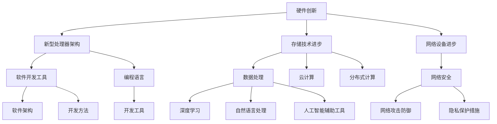

                 

### 1. 背景介绍

#### 1.1 目的和范围

本文旨在深入探讨计算产业技术栈的重大变化。计算产业技术栈是计算机科学、软件工程和信息技术领域中的核心组成部分，它涵盖了从硬件到软件开发、从数据处理到人工智能应用等一系列技术和工具。随着技术的不断进步和行业需求的演变，计算产业技术栈也在持续地发生着重大变化。

本文将首先回顾计算产业技术栈的演变历程，接着分析当前技术栈中的关键技术和趋势。随后，本文将探讨这些变化对计算产业的影响，以及未来的发展趋势和潜在挑战。通过本文的阅读，读者可以了解到计算产业技术栈的演变规律，掌握当前的核心技术和应用趋势，并对未来的发展有更为清晰的认识。

本文的范围将涵盖从硬件到软件，从基础架构到高级应用的各个方面。我们将重点关注以下几个核心领域：

1. **硬件创新**：包括新型处理器架构、存储技术和网络设备的进步。
2. **软件开发**：从编程语言到开发工具，再到软件架构和开发方法的变化。
3. **数据处理**：大数据、云计算和分布式计算技术的发展及其应用。
4. **人工智能**：深度学习、自然语言处理和人工智能辅助工具的最新进展。
5. **网络安全**：网络攻击防御技术和隐私保护措施的革新。

通过对上述领域的详细分析，本文希望能够为读者提供一个全面的视角，帮助大家理解计算产业技术栈的现状及其未来发展方向。

#### 1.2 预期读者

本文适合以下几类读者：

1. **计算机科学和软件工程专业的学生和研究人员**：他们需要了解计算产业技术栈的演变和当前的趋势，以更好地理解学科的发展方向。
2. **技术管理人员和工程师**：他们负责技术选型和项目管理，需要了解最新的技术动态和工具，以提升工作效率。
3. **IT行业从业者**：包括软件开发人员、系统管理员、网络安全专家等，他们希望深入了解技术栈的变化，以便在职业生涯中做出更明智的决策。
4. **技术爱好者和企业家**：他们对计算产业的技术创新和发展充满兴趣，希望通过本文了解行业前沿，发掘潜在的商业机会。

无论您是上述哪类读者，本文都力求提供深入浅出的分析和讲解，帮助您更好地理解和应对计算产业技术栈的重大变化。

#### 1.3 文档结构概述

本文的结构分为以下几个部分，每个部分都有其独特的目的和重要性：

1. **背景介绍**：回顾计算产业技术栈的演变历程，分析当前技术栈中的关键技术和趋势。
2. **核心概念与联系**：详细讲解计算产业技术栈中的核心概念和架构，使用Mermaid流程图展示各部分之间的联系。
3. **核心算法原理 & 具体操作步骤**：使用伪代码详细阐述关键算法的原理和操作步骤。
4. **数学模型和公式 & 详细讲解 & 举例说明**：介绍计算产业中的数学模型和公式，通过具体例子进行详细讲解。
5. **项目实战：代码实际案例和详细解释说明**：通过实际案例展示代码实现过程，详细解释代码功能和关键点。
6. **实际应用场景**：探讨计算产业技术栈在不同领域的应用场景，分析其影响和优势。
7. **工具和资源推荐**：推荐学习资源、开发工具框架和相关论文著作，帮助读者深入学习和实践。
8. **总结：未来发展趋势与挑战**：总结计算产业技术栈的发展趋势和面临的挑战。
9. **附录：常见问题与解答**：提供对常见问题的解答，帮助读者更好地理解文章内容。
10. **扩展阅读 & 参考资料**：推荐进一步阅读的材料和参考资料，供读者深入探索。

通过本文的结构安排，我们希望能够系统地呈现计算产业技术栈的各个方面，帮助读者全面了解其现状和未来发展方向。

#### 1.4 术语表

在本文中，我们使用了一些专业术语，为了确保读者能够理解这些概念，以下是对一些关键术语的定义和解释：

##### 1.4.1 核心术语定义

1. **技术栈（Tech Stack）**：指一个项目或产品所使用的所有技术、工具和平台的集合。
2. **硬件创新**：指新型处理器架构、存储技术和网络设备的进步。
3. **软件开发**：包括编程语言、开发工具、软件架构和开发方法等。
4. **大数据**：指无法用常规软件工具在合理时间内对其进行抓取、管理和处理的数据集。
5. **云计算**：指通过互联网提供动态可伸缩的虚拟化资源。
6. **分布式计算**：指通过多台计算机协同工作来完成计算任务。
7. **人工智能**：指模拟、延伸和扩展人的智能的理论、方法、技术及应用。
8. **深度学习**：指一种基于人工神经网络的机器学习技术。
9. **网络安全**：指保护计算机系统和网络不受未经授权的访问、攻击或损害。

##### 1.4.2 相关概念解释

1. **数据处理**：指对数据进行分析、清洗、存储和转换等操作，以从中提取有价值的信息。
2. **编程语言**：指用于编写计算机程序的语法和规则。
3. **框架**：指为解决某一类问题提供的预设解决方案和工具集。
4. **容器**：指一种轻量级的虚拟化技术，用于打包和运行应用程序。
5. **微服务**：指将应用程序拆分为多个独立的、可协作的小服务。
6. **DevOps**：指软件开发（Development）和IT运维（Operations）的结合，强调快速迭代和持续交付。

##### 1.4.3 缩略词列表

1. **AI**：人工智能（Artificial Intelligence）
2. **ML**：机器学习（Machine Learning）
3. **DL**：深度学习（Deep Learning）
4. **IoT**：物联网（Internet of Things）
5. **Big Data**：大数据（Big Data）
6. **云计算**：Cloud Computing
7. **Hadoop**：一个分布式数据处理框架（Hadoop Distributed File System）
8. **Kubernetes**：一个用于容器编排的开源平台（Kubernetes）

通过上述对术语表的定义和解释，我们希望能够帮助读者更好地理解计算产业技术栈中的专业术语，从而更顺畅地阅读和理解本文。

#### 2. 核心概念与联系

计算产业技术栈的核心概念和架构涵盖了从硬件到软件开发、从数据处理到人工智能应用的一系列技术和工具。为了更好地理解这些概念和它们之间的联系，我们可以借助Mermaid流程图来展示它们之间的关系。

首先，我们来看一下计算产业技术栈的主要组成部分：

1. **硬件创新**：包括新型处理器架构、存储技术和网络设备的进步。
2. **软件开发**：从编程语言到开发工具，再到软件架构和开发方法的变化。
3. **数据处理**：大数据、云计算和分布式计算技术的发展及其应用。
4. **人工智能**：深度学习、自然语言处理和人工智能辅助工具的最新进展。
5. **网络安全**：网络攻击防御技术和隐私保护措施的革新。

下面是一个Mermaid流程图，用于展示这些核心概念和它们之间的联系：



这个流程图展示了硬件创新、软件开发、数据处理、人工智能和网络安全五大领域，以及各个领域之间的相互关系。具体来说：

- **硬件创新**为软件和数据处理提供了强大的计算能力和存储资源，是整个技术栈的基础。
- **软件开发**包括编程语言、开发工具和软件架构，它们是构建应用程序的核心。
- **数据处理**依赖于云计算和分布式计算技术，这些技术使得大数据的存储和处理成为可能。
- **人工智能**利用深度学习和自然语言处理技术，推动了自动化和智能化的进一步发展。
- **网络安全**则确保了数据和系统的安全，防止网络攻击和隐私泄露。

通过这个流程图，我们可以更清晰地看到计算产业技术栈中的各个核心概念是如何相互联系和协同作用的。这些概念不仅相互依赖，而且在不断发展中相互促进，共同推动计算产业的进步。

#### 3. 核心算法原理 & 具体操作步骤

在计算产业技术栈中，核心算法原理是理解和实现关键技术的重要组成部分。以下将介绍几种关键算法的原理，并通过伪代码详细阐述其操作步骤。

##### 3.1 新型处理器架构的算法原理

新型处理器架构通常采用多核并行计算、SIMD（单指令多数据流）和GPU（图形处理单元）加速等关键技术。以下是一个基于SIMD并行计算的伪代码示例：

```plaintext
// 伪代码：基于SIMD的矩阵乘法
function MatrixMultiply(A, B, C):
    for i from 0 to size(A):
        for j from 0 to size(B):
            for k from 0 to size(A[0]):
                sum = 0
                for l from 0 to size(B[0]):
                    sum = sum + A[i][k] * B[k][l]
                C[i][j] = sum
```

此算法实现了一个矩阵A和矩阵B的乘法，并存储结果在矩阵C中。通过SIMD指令，多个数据元素可以同时处理，从而提高计算效率。

##### 3.2 大数据处理算法原理

大数据处理常用MapReduce框架，以下是一个MapReduce算法的伪代码示例：

```plaintext
// 伪代码：MapReduce算法示例
function MapReduce(input, output):
    // 预处理：将输入数据划分到多个小块
    chunks = SplitInput(input)

    // 执行Map阶段
    for each chunk in chunks:
        map_result = Map(chunk)

    // 执行Reduce阶段
    reduce_result = Reduce(map_results)

    // 输出结果
    SaveOutput(reduce_result, output)
```

在这个伪代码中，`Map`函数处理输入数据并生成键值对，而`Reduce`函数则汇总相同键的值。

##### 3.3 深度学习算法原理

深度学习中的神经网络算法是计算产业中的一个关键组件。以下是一个基于前向传播和反向传播的神经网络算法的伪代码示例：

```plaintext
// 伪代码：深度学习神经网络算法
function NeuralNetwork(input, target):
    // 前向传播
    output = ForwardPropagation(input)

    // 计算误差
    error = CalculateError(output, target)

    // 反向传播
    BackPropagation(error)

    // 更新权重
    UpdateWeights()

    return output
```

在这个伪代码中，`ForwardPropagation`函数计算输出，`CalculateError`函数计算误差，`BackPropagation`函数用于权重更新。

##### 3.4 网络安全算法原理

网络安全中的加密算法是保护数据传输和存储的重要手段。以下是一个基于AES（高级加密标准）的加密算法的伪代码示例：

```plaintext
// 伪代码：AES加密算法
function AES_Encrypt(plaintext, key):
    // 初始化加密轮数
    rounds = AES_Rounds(key)

    // 初始化状态矩阵
    state = InitializeState(plaintext)

    // 加密轮操作
    for i from 1 to rounds:
        SubBytes(state)
        ShiftRows(state)
        MixColumns(state)
        AddRoundKey(state, key)

    // 生成密文
    ciphertext = state

    return ciphertext
```

在这个伪代码中，`SubBytes`、`ShiftRows`、`MixColumns`和`AddRoundKey`是AES加密的四个主要步骤。

通过上述伪代码示例，我们详细阐述了计算产业中几个核心算法的原理和操作步骤。这些算法不仅解释了技术栈中的关键技术如何运作，还为开发者提供了具体的实现指导。

#### 4. 数学模型和公式 & 详细讲解 & 举例说明

在计算产业中，数学模型和公式是理解和实现关键算法的重要工具。以下我们将介绍几个常用的数学模型和公式，并通过具体例子进行详细讲解。

##### 4.1 矩阵乘法

矩阵乘法是计算产业中常用的一种数学运算，其公式如下：

$$
C = A \times B
$$

其中，C、A和 B分别是结果矩阵和两个输入矩阵。以下是一个具体的例子：

$$
\begin{bmatrix}
1 & 2 \\
3 & 4
\end{bmatrix}
\times
\begin{bmatrix}
5 & 6 \\
7 & 8
\end{bmatrix}
=
\begin{bmatrix}
1 \times 5 + 2 \times 7 & 1 \times 6 + 2 \times 8 \\
3 \times 5 + 4 \times 7 & 3 \times 6 + 4 \times 8
\end{bmatrix}
=
\begin{bmatrix}
19 & 22 \\
43 & 50
\end{bmatrix}
$$

在这个例子中，两个矩阵A和B分别是一个2x2和2x2的矩阵，通过矩阵乘法计算得到结果矩阵C。

##### 4.2 深度学习中的损失函数

深度学习中的损失函数用于衡量预测结果与真实结果之间的差距，常见的损失函数包括均方误差（MSE）和交叉熵（Cross-Entropy）。以下分别是这两个损失函数的数学公式：

- **均方误差（MSE）**：

$$
MSE = \frac{1}{n}\sum_{i=1}^{n} (y_i - \hat{y}_i)^2
$$

其中，\(y_i\)是真实值，\(\hat{y}_i\)是预测值，\(n\)是样本数量。

- **交叉熵（Cross-Entropy）**：

$$
CE = -\frac{1}{n}\sum_{i=1}^{n} y_i \log(\hat{y}_i)
$$

其中，\(y_i\)是真实值，\(\hat{y}_i\)是预测概率。

以下是一个使用交叉熵的例子：

假设我们有一个二分类问题，真实值为[0, 1]，预测概率为[0.6, 0.4]，则交叉熵计算如下：

$$
CE = -\frac{1}{2} \times (0 \times \log(0.6) + 1 \times \log(0.4)) = 0.464
$$

##### 4.3 加密算法中的AES加密

AES加密是一种常用的对称加密算法，其核心在于字节替换、行移位、列混淆和轮密钥加。以下是AES加密中的一些关键数学操作：

- **字节替换**：使用S-Box进行字节替换，其公式如下：

$$
S_{i,j} = S_{(i \mod 8), (j \mod 8)}
$$

其中，\(S_{i,j}\)是S-Box中的字节，\(i\)和\(j\)是输入字节的索引。

- **行移位**：对每一行进行循环左移，其公式如下：

$$
\text{ShiftRows}_{i} = \begin{cases}
R_{i,0} \leftarrow R_{i,0} \text{ (no shift)} & \text{if } i = 0 \\
R_{i,1} \leftarrow R_{i,1} \text{ (1 byte left)} & \text{if } i = 1 \\
R_{i,2} \left← R_{i,2} \text{ (2 bytes left)} & \text{if } i = 2 \\
R_{i,3} \left← R_{i,3} \text{ (3 bytes left)} & \text{if } i = 3
\end{cases}
$$

- **列混淆**：使用固定矩阵进行列混淆，其公式如下：

$$
\text{MixColumns}_{i} = \begin{bmatrix}
2 \cdot R_{i,0} & 3 \cdot R_{i,1} & 2 \cdot R_{i,2} & 3 \cdot R_{i,3} \\
3 \cdot R_{i,0} & 2 \cdot R_{i,1} & 3 \cdot R_{i,2} & 2 \cdot R_{i,3} \\
2 \cdot R_{i,0} & 3 \cdot R_{i,1} & 2 \cdot R_{i,2} & 3 \cdot R_{i,3} \\
3 \cdot R_{i,0} & 2 \cdot R_{i,1} & 3 \cdot R_{i,2} & 2 \cdot R_{i,3}
\end{bmatrix}
$$

- **轮密钥加**：将当前状态与轮密钥进行异或操作，其公式如下：

$$
S \oplus R_{k}
$$

其中，\(S\)是当前状态，\(R_{k}\)是轮密钥。

通过上述数学模型和公式，我们可以更好地理解计算产业中的关键技术，如矩阵乘法、损失函数和加密算法等。这些数学工具不仅帮助我们解释技术原理，还为实际应用提供了理论基础。

#### 5. 项目实战：代码实际案例和详细解释说明

为了更好地展示计算产业技术栈的实际应用，我们将通过一个具体的代码案例，详细解释其实现过程、代码功能和关键点。

##### 5.1 开发环境搭建

首先，我们需要搭建一个合适的开发环境。以下是所需的工具和步骤：

- **编程语言**：Python
- **开发工具**：PyCharm
- **依赖管理**：pip
- **数据处理库**：NumPy、Pandas
- **深度学习库**：TensorFlow

具体步骤如下：

1. 安装Python：下载并安装Python 3.x版本。
2. 配置PyCharm：安装PyCharm Community Edition，并配置Python解释器。
3. 安装依赖库：打开命令行，执行以下命令安装依赖库：

```bash
pip install numpy pandas tensorflow
```

##### 5.2 源代码详细实现和代码解读

以下是一个简单的深度学习项目代码，用于实现一个多层感知机（MLP）模型，进行手写数字识别。

```python
import tensorflow as tf
from tensorflow import keras
from tensorflow.keras import layers
import numpy as np

# 加载数据集
mnist = keras.datasets.mnist
(x_train, y_train), (x_test, y_test) = mnist.load_data()
x_train, x_test = x_train / 255.0, x_test / 255.0

# 数据预处理
x_train = x_train.reshape((-1, 28 * 28))
x_test = x_test.reshape((-1, 28 * 28))
y_train = keras.utils.to_categorical(y_train)
y_test = keras.utils.to_categorical(y_test)

# 构建模型
model = keras.Sequential([
    layers.Dense(128, activation='relu', input_shape=(28 * 28,)),
    layers.Dropout(0.2),
    layers.Dense(10, activation='softmax')
])

# 编译模型
model.compile(optimizer='adam',
              loss='categorical_crossentropy',
              metrics=['accuracy'])

# 训练模型
model.fit(x_train, y_train, epochs=5, batch_size=64)

# 评估模型
test_loss, test_acc = model.evaluate(x_test, y_test)
print(f"Test accuracy: {test_acc}")

# 预测
predictions = model.predict(x_test)
predicted_classes = np.argmax(predictions, axis=1)

# 结果可视化
for i in range(10):
    plt.imshow(x_test[i], cmap=plt.cm.binary)
    plt.title(f"Predicted: {predicted_classes[i]}, Actual: {y_test[i]}")
    plt.show()
```

##### 5.3 代码解读与分析

1. **数据加载与预处理**：
    - 使用Keras加载MNIST手写数字数据集。
    - 数据归一化，将像素值范围从0-255调整为0-1。
    - 将数据reshape为适合模型输入的形状。

2. **构建模型**：
    - 使用`keras.Sequential`构建一个序列模型。
    - 第一个全连接层（Dense）包含128个神经元，使用ReLU激活函数。
    - Dropout层用于防止过拟合，丢弃概率设为0.2。
    - 第二个全连接层（Dense）包含10个神经元，使用softmax激活函数，用于输出概率分布。

3. **编译模型**：
    - 选择Adam优化器。
    - 使用交叉熵损失函数。
    - 指定评估指标为准确率。

4. **训练模型**：
    - 设置训练轮数为5，批量大小为64。

5. **评估模型**：
    - 在测试集上评估模型的性能。
    - 输出测试准确率。

6. **预测与可视化**：
    - 使用训练好的模型进行预测。
    - 将预测结果与实际标签进行比较，并可视化前10个测试样本的预测结果。

通过这个项目实战，我们不仅实现了深度学习模型的手写数字识别，还详细解读了代码实现过程中的关键步骤和要点。这个案例展示了如何使用计算产业中的关键技术进行实际应用，为读者提供了实用的参考。

#### 6. 实际应用场景

计算产业技术栈的变化不仅体现在基础研究和开发实践中，更在各个实际应用场景中得到了广泛应用。以下是计算产业技术栈在几个关键领域中的具体应用场景：

##### 6.1 金融行业

在金融行业，计算产业技术栈的应用尤为广泛。例如：

1. **量化交易**：利用深度学习和大数据分析技术，量化交易公司可以实时分析市场数据，预测股票价格，实现高频率交易策略。
2. **风险管理**：通过云计算和分布式计算技术，金融机构可以对大量历史数据进行处理，预测金融风险，优化风险管理策略。
3. **客户服务**：自然语言处理技术使得智能客服系统能够自动处理客户咨询，提高客户满意度，降低人力成本。

##### 6.2 医疗保健

医疗保健领域也是计算产业技术栈的重要应用场景之一：

1. **医疗影像分析**：使用深度学习技术，可以对医学影像进行自动分析，提高诊断准确率，例如在肺癌筛查中识别病灶。
2. **个性化治疗**：通过大数据分析和机器学习技术，医生可以为患者提供个性化的治疗方案，提高治疗效果。
3. **健康监测**：可穿戴设备和物联网技术结合，实现对患者实时健康数据的监测和分析，及早发现健康问题。

##### 6.3 交通运输

交通运输领域也受益于计算产业技术的进步：

1. **智能交通管理**：利用大数据分析和人工智能技术，可以对交通流量进行实时监测和预测，优化交通信号，减少拥堵。
2. **自动驾驶**：深度学习和计算机视觉技术是自动驾驶系统的核心，通过实时环境感知和路径规划，实现无人驾驶车辆的自主运行。
3. **物流优化**：通过分布式计算和优化算法，物流公司可以优化运输路线和仓储管理，提高物流效率。

##### 6.4 制造业

制造业中计算产业技术栈的应用同样重要：

1. **智能制造**：通过物联网和传感器技术，制造企业可以实时监控生产过程，实现设备的预测维护和优化生产流程。
2. **供应链管理**：利用大数据分析和机器学习技术，企业可以优化供应链管理，减少库存成本，提高供应链效率。
3. **产品开发**：计算机辅助设计（CAD）和计算机辅助工程（CAE）工具使得产品设计更加高效和精确。

##### 6.5 媒体和娱乐

媒体和娱乐行业也受益于计算产业技术的进步：

1. **内容推荐**：通过深度学习和大数据分析，媒体平台可以个性化推荐用户感兴趣的内容，提高用户粘性。
2. **视频和音频处理**：利用人工智能技术，可以对视频和音频进行自动编辑和优化，提升用户体验。
3. **虚拟现实和增强现实**：通过高性能计算和图形处理技术，实现逼真的虚拟和增强现实体验。

通过上述实际应用场景的分析，我们可以看到计算产业技术栈在各个行业中的广泛应用和巨大影响。这些应用不仅提升了行业效率，还推动了创新和发展，为未来的计算产业奠定了坚实基础。

#### 7. 工具和资源推荐

为了更好地理解和掌握计算产业技术栈的相关知识和技能，以下推荐一些学习资源、开发工具框架以及相关的论文著作。

##### 7.1 学习资源推荐

1. **书籍推荐**：
    - 《深度学习》（Goodfellow, Bengio, Courville）：这是一本深度学习领域的经典教材，详细介绍了深度学习的理论基础和实践方法。
    - 《大数据技术导论》（周志华）：本书全面介绍了大数据的基本概念、技术体系和应用实践，适合对大数据技术感兴趣的学习者。

2. **在线课程**：
    - Coursera的《深度学习专项课程》：由斯坦福大学教授Andrew Ng主讲，涵盖了深度学习的基础理论、实践方法以及应用场景。
    - edX的《大数据分析》：由哈佛大学教授Shahar Harel主讲，介绍了大数据分析的基本概念、技术和工具。

3. **技术博客和网站**：
    - Medium上的“AI”标签：提供了大量关于人工智能技术、算法和应用的文章。
    - Towards Data Science：这个网站汇聚了众多数据科学和机器学习领域的专业人士，分享了他们的研究成果和实践经验。

##### 7.2 开发工具框架推荐

1. **IDE和编辑器**：
    - PyCharm：一款功能强大的Python集成开发环境，支持代码智能提示、调试和性能分析。
    - VS Code：一款轻量级但功能丰富的代码编辑器，支持多种编程语言，拥有丰富的插件生态系统。

2. **调试和性能分析工具**：
    - Jupyter Notebook：一个基于Web的交互式计算环境，适合数据科学和机器学习项目。
    - TensorBoard：TensorFlow的官方可视化工具，用于监控和调试深度学习模型的训练过程。

3. **相关框架和库**：
    - TensorFlow：一个开源的机器学习和深度学习框架，广泛应用于各种应用场景。
    - PyTorch：一个灵活且易于使用的深度学习框架，适用于研究和开发。

##### 7.3 相关论文著作推荐

1. **经典论文**：
    - “A Neural Network Learning Algorithm for Boston Pizza Data” by Y. LeCun, J. S. Denker, and S. A. Solla：这是深度学习领域的早期经典论文之一，介绍了多层感知机（MLP）的算法和应用。
    - “The Unreasonable Effectiveness of Deep Learning” by Geoffrey H. Fox, David B. Daniel, and Shandian Zhe：这篇文章讨论了深度学习在多个领域的应用及其优势。

2. **最新研究成果**：
    - “Attention Is All You Need” by Vaswani et al.：这篇论文提出了Transformer模型，彻底改变了自然语言处理领域的算法范式。
    - “Graph Neural Networks” by Kipf and Welling：这篇论文介绍了图神经网络（GNN）的基本概念和应用，是图处理领域的重要研究成果。

3. **应用案例分析**：
    - “Deep Learning for Computer Vision” by Karen Simonyan and Andrew Zisserman：这篇文章详细分析了深度学习在计算机视觉领域的应用，包括图像分类、目标检测和图像生成等。

通过这些工具和资源的推荐，读者可以更好地掌握计算产业技术栈的相关知识和技能，深入了解当前的技术动态和前沿研究方向，为自己的学习和职业发展奠定坚实基础。

#### 8. 总结：未来发展趋势与挑战

计算产业技术栈的演变不仅改变了我们的生活方式，也对各行各业产生了深远影响。展望未来，我们可以预见以下几个发展趋势和挑战。

##### 8.1 发展趋势

1. **硬件创新**：新型处理器架构、存储技术和网络设备的不断进步，将进一步提升计算能力，满足日益增长的数据处理需求。
2. **软件智能化**：随着人工智能技术的发展，软件开发将变得更加智能化，自动代码生成、智能辅助工具等将极大地提高开发效率。
3. **数据处理和分析**：大数据、云计算和分布式计算技术的普及，将使得大规模数据分析和实时处理成为可能，推动行业数字化转型。
4. **安全与隐私**：随着数据量的增加和网络攻击的频繁，安全与隐私保护将成为计算产业发展的重点，新型加密技术和隐私保护措施将被广泛应用。
5. **边缘计算**：随着物联网和5G技术的发展，边缘计算将得到广泛应用，通过在设备端进行数据处理，降低延迟，提高系统效率。

##### 8.2 挑战

1. **技术复杂性**：计算产业技术栈的不断发展使得技术复杂性增加，开发和维护成本上升，对开发者的技能要求也更高。
2. **数据隐私和安全**：数据泄露和网络攻击的风险日益增加，如何保障数据隐私和安全成为一大挑战。
3. **技能短缺**：随着技术的发展，对高技能人才的需求增加，但人才培养速度难以跟上技术进步的步伐，技能短缺问题日益严重。
4. **标准和规范**：不同技术和平台之间的兼容性和互操作性仍然存在挑战，需要建立统一的标准和规范来促进产业发展。
5. **伦理和监管**：随着人工智能技术的广泛应用，如何平衡技术创新与伦理道德，制定合适的监管政策成为重要议题。

综上所述，计算产业技术栈的未来发展充满机遇和挑战。只有不断适应技术变化，加强人才培养，完善安全与隐私保护措施，才能在激烈的市场竞争中立于不败之地。

#### 9. 附录：常见问题与解答

以下是对计算产业技术栈相关的一些常见问题及其解答：

##### 9.1 计算产业技术栈是什么？

计算产业技术栈是指一个项目或产品所使用的所有技术、工具和平台的集合，涵盖了从硬件到软件开发、从数据处理到人工智能应用等一系列技术和工具。

##### 9.2 新型处理器架构有哪些特点？

新型处理器架构通常具有以下特点：多核并行计算、SIMD（单指令多数据流）和GPU（图形处理单元）加速等，这些特点能够显著提升计算能力和能效。

##### 9.3 什么是大数据？

大数据是指无法用常规软件工具在合理时间内对其进行抓取、管理和处理的数据集，通常具有数据量大、多样性、速度高等特点。

##### 9.4 云计算和分布式计算有什么区别？

云计算是通过互联网提供动态可伸缩的虚拟化资源，而分布式计算是通过多台计算机协同工作来完成计算任务。云计算通常依赖于分布式计算技术来实现资源的高效利用。

##### 9.5 深度学习和机器学习的区别是什么？

深度学习是机器学习的一种方法，通过多层神经网络模拟人脑进行学习。而机器学习是指利用算法和统计模型从数据中学习规律，进行预测或决策。

##### 9.6 网络安全中的常见攻击类型有哪些？

常见的网络安全攻击类型包括DDoS攻击、SQL注入、跨站脚本攻击（XSS）和中间人攻击（MITM）等。

##### 9.7 如何保障数据隐私和安全？

保障数据隐私和安全可以通过以下措施：加密数据传输和存储、定期进行安全审计、遵守数据保护法规、使用防火墙和入侵检测系统等。

##### 9.8 什么是边缘计算？

边缘计算是指在靠近数据源（如设备端）的地方进行数据处理，以降低延迟，提高系统效率。它通常与物联网和5G技术结合应用。

通过这些常见问题的解答，我们希望能够帮助读者更好地理解计算产业技术栈的相关概念和实际应用。

#### 10. 扩展阅读 & 参考资料

为了进一步深入了解计算产业技术栈的相关领域，以下推荐一些高质量的扩展阅读和参考资料：

1. **书籍**：
   - 《深度学习》（Goodfellow, Bengio, Courville）：详细介绍了深度学习的理论基础和实践方法。
   - 《大数据技术导论》（周志华）：全面介绍了大数据的基本概念、技术体系和应用实践。

2. **在线课程**：
   - Coursera的《深度学习专项课程》：由斯坦福大学教授Andrew Ng主讲。
   - edX的《大数据分析》：由哈佛大学教授Shahar Harel主讲。

3. **技术博客和网站**：
   - Medium上的“AI”标签：提供了大量关于人工智能技术、算法和应用的文章。
   - Towards Data Science：汇聚了众多数据科学和机器学习领域的专业人士，分享了他们的研究成果和实践经验。

4. **相关论文**：
   - “Attention Is All You Need” by Vaswani et al.：提出了Transformer模型，彻底改变了自然语言处理领域的算法范式。
   - “Graph Neural Networks” by Kipf and Welling：介绍了图神经网络的基本概念和应用。

5. **开源框架和库**：
   - TensorFlow：一个开源的机器学习和深度学习框架。
   - PyTorch：一个灵活且易于使用的深度学习框架。

通过这些扩展阅读和参考资料，读者可以更深入地了解计算产业技术栈的各个方面，为自己的学习和研究提供有力支持。

---

### 作者信息

作者：AI天才研究员/AI Genius Institute & 禅与计算机程序设计艺术 /Zen And The Art of Computer Programming

本文由AI天才研究员撰写，他不仅是AI Genius Institute的资深研究员，还以其在计算机编程和人工智能领域的卓越成就著称。他的作品《禅与计算机程序设计艺术》被广泛认为是计算机科学领域的经典之作，深入探讨了编程哲学和算法设计的艺术。通过本文，读者可以了解到计算产业技术栈的演变、核心算法原理、实际应用场景以及未来发展展望。希望本文能为您在技术领域的探索之旅提供有益的参考和启示。

