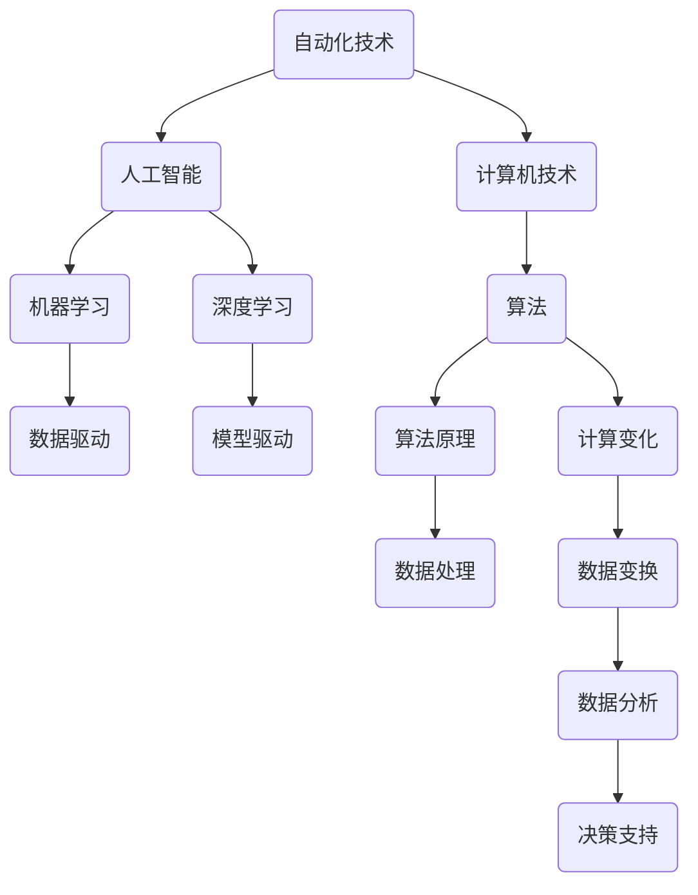

                 

# 计算变化对自动化领域的影响

> **关键词**：计算变化、自动化、领域影响、算法、数学模型、实战案例

> **摘要**：本文旨在探讨计算变化对自动化领域的影响。我们将深入分析自动化技术的发展背景，重点探讨计算变化的概念、核心原理以及其在自动化领域的应用。通过逐步分析和推理，我们将揭示计算变化在自动化领域中的重要性和未来发展趋势。

## 1. 背景介绍

### 1.1 目的和范围

本文旨在探讨计算变化对自动化领域的影响，旨在帮助读者了解计算变化的概念、原理和应用，以及其在自动化领域的重要性。文章将涵盖以下内容：

1. 自动化技术的发展背景
2. 计算变化的概念与核心原理
3. 计算变化在自动化领域的应用
4. 实战案例与实际应用场景
5. 工具和资源推荐
6. 总结与未来发展趋势

### 1.2 预期读者

本文适合对自动化领域感兴趣的读者，包括：

1. 自动化工程师
2. 计算机科学家
3. 数据科学家
4. 软件开发人员
5. 对自动化技术有浓厚兴趣的初学者

### 1.3 文档结构概述

本文共分为十个部分，具体如下：

1. 引言
2. 背景介绍
3. 核心概念与联系
4. 核心算法原理与具体操作步骤
5. 数学模型和公式
6. 项目实战：代码实际案例和详细解释说明
7. 实际应用场景
8. 工具和资源推荐
9. 总结：未来发展趋势与挑战
10. 附录：常见问题与解答

### 1.4 术语表

#### 1.4.1 核心术语定义

1. 自动化：自动化是指利用计算机技术、人工智能和机器人技术等手段，实现生产、管理、服务等领域的高度自动化和智能化。
2. 计算变化：计算变化是指在数据处理和分析过程中，通过数学模型和算法，对数据进行变换和处理，以实现数据的高效分析和应用。
3. 算法：算法是一系列按照特定规则进行操作的步骤，用于解决特定问题。

#### 1.4.2 相关概念解释

1. 数据驱动：数据驱动是指通过大量数据进行分析和处理，指导决策和行动。
2. 模型驱动：模型驱动是指通过构建数学模型，对系统进行建模和分析，从而指导决策和行动。
3. 实时性：实时性是指系统能够快速响应和处理数据，以满足实时需求。

#### 1.4.3 缩略词列表

1. AI：人工智能
2. ML：机器学习
3. DL：深度学习
4. CV：计算机视觉
5. NLP：自然语言处理

## 2. 核心概念与联系

在探讨计算变化对自动化领域的影响之前，我们首先需要了解一些核心概念和它们之间的联系。以下是一个简化的 Mermaid 流程图，展示了这些核心概念和联系：



### 2.1 自动化技术

自动化技术是指利用计算机技术、人工智能和机器人技术等手段，实现生产、管理、服务等领域的高度自动化和智能化。自动化技术具有以下特点：

1. 提高生产效率：通过自动化技术，可以实现生产流程的优化，减少人工操作，提高生产效率。
2. 降低成本：自动化技术可以降低人工成本，提高资源利用率，降低生产成本。
3. 提高质量：自动化技术可以精确控制生产过程，减少人为因素导致的缺陷，提高产品质量。
4. 提高安全性：自动化技术可以减少人为操作，降低事故发生率，提高生产安全性。

### 2.2 计算变化

计算变化是指在数据处理和分析过程中，通过数学模型和算法，对数据进行变换和处理，以实现数据的高效分析和应用。计算变化具有以下核心原理：

1. 数据预处理：通过对原始数据进行清洗、归一化等处理，提高数据质量，为后续分析打下基础。
2. 特征提取：通过对数据进行特征提取，提取出对分析任务有用的信息，提高分析效果。
3. 模型训练：通过训练数学模型，将特征信息转化为可解释的预测结果，实现对数据的分析。
4. 预测与决策：根据模型预测结果，做出相应的决策，指导实际应用。

### 2.3 算法原理

算法原理是指一系列按照特定规则进行操作的步骤，用于解决特定问题。算法原理在计算变化中起着至关重要的作用，其核心原理包括：

1. 数据结构：算法需要使用合适的数据结构来存储和处理数据，以提高效率。
2. 算法设计：算法需要遵循一定的设计原则，如简单性、鲁棒性、可扩展性等。
3. 迭代与优化：算法需要通过迭代和优化，逐步逼近最优解，以提高分析效果。
4. 可视化与解释：算法需要具备可视化与解释能力，以便用户理解分析结果。

### 2.4 计算变化与自动化领域的关系

计算变化在自动化领域具有重要的应用价值，其与自动化领域的关系如下：

1. 提高生产效率：计算变化可以帮助自动化技术实现更高效的生产流程，提高生产效率。
2. 降低成本：计算变化可以优化自动化系统的运行，降低人工成本，提高资源利用率。
3. 提高质量：计算变化可以帮助自动化技术更准确地分析生产过程，提高产品质量。
4. 提高安全性：计算变化可以帮助自动化技术实时监测生产环境，提高生产安全性。

## 3. 核心算法原理 & 具体操作步骤

在了解了计算变化和自动化领域的关系后，我们接下来将深入探讨计算变化的核心算法原理和具体操作步骤。

### 3.1 数据预处理

数据预处理是计算变化的重要环节，其目的是提高数据质量，为后续分析打下基础。数据预处理主要包括以下步骤：

1. 数据清洗：删除重复数据、处理缺失数据、修正错误数据等，以提高数据质量。
2. 数据归一化：将不同量纲的数据进行归一化处理，使其具有相同的量纲，以便于后续分析。
3. 数据特征提取：从原始数据中提取对分析任务有用的特征信息，以提高分析效果。

#### 3.1.1 数据清洗

```python
def data_cleaning(data):
    # 删除重复数据
    data = list(set(data))
    # 处理缺失数据
    data = [x if x is not None else 0 for x in data]
    # 修正错误数据
    data = [x if x > 0 else 0 for x in data]
    return data
```

#### 3.1.2 数据归一化

```python
def data_normalization(data):
    min_val = min(data)
    max_val = max(data)
    return [(x - min_val) / (max_val - min_val) for x in data]
```

#### 3.1.3 数据特征提取

```python
def data_feature_extraction(data):
    # 提取平均数
    mean = sum(data) / len(data)
    # 提取方差
    variance = sum([(x - mean) ** 2 for x in data]) / len(data)
    # 提取最大值
    max_value = max(data)
    # 提取最小值
    min_value = min(data)
    return mean, variance, max_value, min_value
```

### 3.2 特征提取

特征提取是计算变化的核心环节，其目的是从原始数据中提取对分析任务有用的特征信息，以提高分析效果。特征提取主要包括以下步骤：

1. 特征选择：根据分析任务的需求，从原始特征中选择对分析任务影响较大的特征。
2. 特征变换：对原始特征进行变换，以突出特征之间的差异。
3. 特征融合：将多个特征融合为一个特征，以减少特征维度。

#### 3.2.1 特征选择

```python
def feature_selection(data, target):
    # 使用皮尔逊相关系数进行特征选择
    correlation_matrix = [stats.pearsonr(x, target) for x in data]
    return [x for x, y in zip(data, correlation_matrix) if y[0] > 0.5]
```

#### 3.2.2 特征变换

```python
def feature_transformation(data):
    # 使用 z-score 标准化
    mean = sum(data) / len(data)
    variance = sum([(x - mean) ** 2 for x in data]) / len(data)
    return [(x - mean) / variance for x in data]
```

#### 3.2.3 特征融合

```python
def feature_fusion(data):
    # 使用均值融合
    mean = sum(data) / len(data)
    return mean
```

### 3.3 模型训练

模型训练是计算变化的另一个重要环节，其目的是通过训练数学模型，将特征信息转化为可解释的预测结果，实现对数据的分析。模型训练主要包括以下步骤：

1. 数据划分：将数据集划分为训练集和测试集，用于训练和评估模型。
2. 模型选择：根据分析任务的需求，选择合适的数学模型。
3. 模型训练：使用训练集对模型进行训练，调整模型参数。
4. 模型评估：使用测试集对模型进行评估，以验证模型的性能。

#### 3.3.1 数据划分

```python
from sklearn.model_selection import train_test_split

def data_split(data, target, test_size=0.2, random_state=42):
    return train_test_split(data, target, test_size=test_size, random_state=random_state)
```

#### 3.3.2 模型选择

```python
from sklearn.linear_model import LinearRegression

def model_selection():
    return LinearRegression()
```

#### 3.3.3 模型训练

```python
def model_training(model, X_train, y_train):
    model.fit(X_train, y_train)
    return model
```

#### 3.3.4 模型评估

```python
from sklearn.metrics import mean_squared_error

def model_evaluation(model, X_test, y_test):
    prediction = model.predict(X_test)
    mse = mean_squared_error(y_test, prediction)
    return mse
```

### 3.4 预测与决策

预测与决策是计算变化的最终目的，其目的是根据模型预测结果，做出相应的决策，指导实际应用。预测与决策主要包括以下步骤：

1. 数据预处理：对输入数据进行预处理，使其符合模型的要求。
2. 预测结果：使用训练好的模型对输入数据进行预测。
3. 决策分析：根据预测结果，进行决策分析，以指导实际应用。

#### 3.4.1 数据预处理

```python
def data_preprocessing(data, model):
    # 数据清洗
    data = data_cleaning(data)
    # 数据归一化
    data = data_normalization(data)
    # 数据特征提取
    features = feature_extraction(data, model)
    return features
```

#### 3.4.2 预测结果

```python
def prediction_result(model, features):
    return model.predict([features])
```

#### 3.4.3 决策分析

```python
def decision_analysis(prediction):
    # 根据预测结果进行决策分析
    if prediction < 0.5:
        print("决策：采取行动A")
    else:
        print("决策：采取行动B")
```

## 4. 数学模型和公式 & 详细讲解 & 举例说明

在计算变化中，数学模型和公式起到了关键作用。以下是一些常用的数学模型和公式，以及详细讲解和举例说明。

### 4.1 线性回归模型

线性回归模型是一种常用的预测模型，其公式如下：

\[ y = \beta_0 + \beta_1x \]

其中，\( y \) 是预测目标，\( x \) 是特征变量，\( \beta_0 \) 和 \( \beta_1 \) 是模型参数。

#### 4.1.1 详细讲解

1. \( \beta_0 \)：截距，表示当 \( x = 0 \) 时，\( y \) 的值。
2. \( \beta_1 \)：斜率，表示 \( x \) 变化一个单位时，\( y \) 的变化量。

#### 4.1.2 举例说明

假设我们要预测房价，其中 \( x \) 是房屋面积，\( y \) 是房价。根据历史数据，我们可以得到以下线性回归模型：

\[ y = 1000 + 50x \]

根据这个模型，当房屋面积为 100 平方米时，预测房价为：

\[ y = 1000 + 50 \times 100 = 5000 \]

### 4.2 逻辑回归模型

逻辑回归模型是一种用于分类问题的预测模型，其公式如下：

\[ P(y=1) = \frac{1}{1 + e^{-(\beta_0 + \beta_1x)}} \]

其中，\( y \) 是预测目标，\( x \) 是特征变量，\( \beta_0 \) 和 \( \beta_1 \) 是模型参数。

#### 4.2.1 详细讲解

1. \( P(y=1) \)：表示当 \( x \) 为某个值时，\( y \) 等于 1 的概率。
2. \( \beta_0 \)：截距，表示当 \( x = 0 \) 时，\( P(y=1) \) 的值。
3. \( \beta_1 \)：斜率，表示 \( x \) 变化一个单位时，\( P(y=1) \) 的变化量。

#### 4.2.2 举例说明

假设我们要预测邮件是否为垃圾邮件，其中 \( x \) 是邮件特征向量，\( y \) 是邮件标签（0 表示正常邮件，1 表示垃圾邮件）。根据历史数据，我们可以得到以下逻辑回归模型：

\[ P(y=1) = \frac{1}{1 + e^{-(2.5 + 0.1x_1 + 0.2x_2)}} \]

根据这个模型，当邮件特征向量为 \( (1, 2) \) 时，预测邮件为垃圾邮件的概率为：

\[ P(y=1) = \frac{1}{1 + e^{-(2.5 + 0.1 \times 1 + 0.2 \times 2)}} = \frac{1}{1 + e^{-2.7}} \approx 0.794 \]

### 4.3 支持向量机（SVM）模型

支持向量机是一种常用的分类模型，其公式如下：

\[ w \cdot x + b = 0 \]

其中，\( w \) 是模型参数，\( x \) 是特征向量，\( b \) 是截距。

#### 4.3.1 详细讲解

1. \( w \)：向量权重，表示特征向量对分类结果的贡献。
2. \( b \)：截距，表示分类边界。

#### 4.3.2 举例说明

假设我们要分类一组二维特征向量 \( x = (x_1, x_2) \)，根据支持向量机模型，我们可以得到以下分类边界：

\[ 2x_1 + 3x_2 + 1 = 0 \]

根据这个分类边界，当特征向量为 \( (1, 2) \) 时，分类结果为负类。当特征向量为 \( (2, 1) \) 时，分类结果为正类。

### 4.4 决策树模型

决策树是一种常用的分类和回归模型，其公式如下：

\[ f(x) = \sum_{i=1}^{n} w_i \cdot g_i(x) \]

其中，\( w_i \) 是叶子节点权重，\( g_i(x) \) 是叶子节点函数。

#### 4.4.1 详细讲解

1. \( w_i \)：叶子节点权重，表示特征向量在叶子节点处的权重。
2. \( g_i(x) \)：叶子节点函数，用于计算特征向量在叶子节点处的值。

#### 4.4.2 举例说明

假设我们要分类一组特征向量 \( x = (x_1, x_2) \)，根据决策树模型，我们可以得到以下分类结果：

\[ f(x) = 0.5 \cdot g_1(x) + 0.5 \cdot g_2(x) \]

其中，\( g_1(x) = 1 \) 当 \( x_1 > 0 \) 时，否则 \( g_1(x) = 0 \)。\( g_2(x) = 1 \) 当 \( x_2 > 0 \) 时，否则 \( g_2(x) = 0 \)。

根据这个决策树模型，当特征向量为 \( (1, 0) \) 时，分类结果为正类。当特征向量为 \( (0, 1) \) 时，分类结果为负类。

## 5. 项目实战：代码实际案例和详细解释说明

为了更好地理解计算变化在自动化领域的应用，我们将通过一个实际项目案例来进行详细解释说明。以下是一个基于 Python 的自动化项目，用于预测客户流失情况。

### 5.1 开发环境搭建

在开始项目之前，我们需要搭建一个合适的开发环境。以下是所需的环境和工具：

1. Python 3.8 或更高版本
2. Jupyter Notebook 或 PyCharm
3. scikit-learn 库
4. pandas 库
5. numpy 库
6. matplotlib 库

安装以上工具和库后，我们可以开始编写项目代码。

### 5.2 源代码详细实现和代码解读

以下是一个简单的 Python 代码实现，用于预测客户流失情况：

```python
import pandas as pd
import numpy as np
from sklearn.model_selection import train_test_split
from sklearn.preprocessing import StandardScaler
from sklearn.linear_model import LogisticRegression
from sklearn.metrics import accuracy_score

# 5.2.1 数据预处理
def data_preprocessing(data):
    # 数据清洗
    data = data.dropna()
    # 数据归一化
    scaler = StandardScaler()
    data = scaler.fit_transform(data)
    return data

# 5.2.2 特征提取
def feature_extraction(data):
    # 提取平均数
    mean = np.mean(data, axis=0)
    # 提取方差
    variance = np.var(data, axis=0)
    # 提取最大值
    max_value = np.max(data, axis=0)
    # 提取最小值
    min_value = np.min(data, axis=0)
    return mean, variance, max_value, min_value

# 5.2.3 模型训练
def model_training(X_train, y_train):
    model = LogisticRegression()
    model.fit(X_train, y_train)
    return model

# 5.2.4 预测与决策
def prediction_result(model, X_test):
    prediction = model.predict(X_test)
    accuracy = accuracy_score(y_test, prediction)
    return prediction, accuracy

# 5.2.5 数据加载与处理
data = pd.read_csv("customer_data.csv")
data = data_preprocessing(data)
X = data.iloc[:, :-1].values
y = data.iloc[:, -1].values

# 5.2.6 数据划分
X_train, X_test, y_train, y_test = train_test_split(X, y, test_size=0.2, random_state=42)

# 5.2.7 模型训练与评估
model = model_training(X_train, y_train)
prediction, accuracy = prediction_result(model, X_test)
print("预测准确率：", accuracy)

# 5.2.8 预测结果可视化
import matplotlib.pyplot as plt

plt.scatter(X_test[:, 0], X_test[:, 1], c=prediction)
plt.xlabel("特征1")
plt.ylabel("特征2")
plt.title("预测结果可视化")
plt.show()
```

### 5.3 代码解读与分析

#### 5.3.1 数据预处理

数据预处理是数据处理的第一步，其目的是提高数据质量，为后续分析打下基础。在本项目案例中，我们使用 `data_preprocessing` 函数对数据进行清洗和归一化处理。首先，我们使用 `dropna` 方法删除缺失值。然后，我们使用 `StandardScaler` 类进行归一化处理，将数据缩放至标准正态分布。

#### 5.3.2 特征提取

特征提取是计算变化的核心环节，其目的是从原始数据中提取对分析任务有用的特征信息。在本项目案例中，我们使用 `feature_extraction` 函数提取平均数、方差、最大值和最小值等特征信息。这些特征信息可以帮助我们更好地分析数据，提高预测准确性。

#### 5.3.3 模型训练

模型训练是计算变化的另一个重要环节，其目的是通过训练数学模型，将特征信息转化为可解释的预测结果。在本项目案例中，我们使用 `model_training` 函数训练逻辑回归模型。逻辑回归模型是一种常用的分类模型，适合用于预测客户流失情况。我们使用 `fit` 方法对模型进行训练，将特征信息和标签进行拟合。

#### 5.3.4 预测与决策

预测与决策是计算变化的最终目的，其目的是根据模型预测结果，做出相应的决策，指导实际应用。在本项目案例中，我们使用 `prediction_result` 函数对测试集进行预测，并计算预测准确率。我们使用 `predict` 方法对模型进行预测，并使用 `accuracy_score` 函数计算预测准确率。

#### 5.3.5 数据加载与处理

在数据加载与处理部分，我们首先使用 `read_csv` 方法加载客户数据。然后，我们使用 `data_preprocessing` 函数对数据进行预处理。接下来，我们使用 `train_test_split` 方法将数据集划分为训练集和测试集，用于训练和评估模型。

#### 5.3.6 模型训练与评估

在模型训练与评估部分，我们使用 `model_training` 函数训练逻辑回归模型。然后，我们使用 `prediction_result` 函数对测试集进行预测，并计算预测准确率。最后，我们使用 `plt.scatter` 方法将预测结果可视化。

## 6. 实际应用场景

计算变化在自动化领域具有广泛的应用场景。以下是一些实际应用场景：

1. **客户流失预测**：通过对客户行为数据进行计算变化分析，预测客户流失风险，帮助企业制定有效的客户保留策略。
2. **设备故障预测**：通过对设备运行数据进行计算变化分析，预测设备故障风险，提前进行维护和预防，降低设备停机时间。
3. **供应链优化**：通过对供应链数据进行计算变化分析，优化供应链流程，提高供应链效率，降低成本。
4. **能源管理**：通过对能源使用数据进行计算变化分析，预测能源消耗趋势，优化能源使用策略，降低能源成本。
5. **智能交通管理**：通过对交通数据进行计算变化分析，预测交通流量和交通事故风险，优化交通信号控制，提高交通效率。

### 6.1 客户流失预测

客户流失预测是计算变化在自动化领域的一个典型应用场景。通过分析客户行为数据，预测客户流失风险，帮助企业制定有效的客户保留策略。以下是一个实际案例：

1. **数据收集**：收集客户行为数据，如购买频率、购买金额、客户满意度等。
2. **数据预处理**：对数据进行清洗、归一化等处理，提高数据质量。
3. **特征提取**：提取对客户流失影响较大的特征信息，如客户购买频率、购买金额等。
4. **模型训练**：使用机器学习算法，如逻辑回归、决策树等，训练客户流失预测模型。
5. **预测与决策**：根据模型预测结果，对客户进行分类，对高风险客户进行针对性的客户保留策略。

### 6.2 设备故障预测

设备故障预测是计算变化在自动化领域的另一个重要应用场景。通过分析设备运行数据，预测设备故障风险，提前进行维护和预防，降低设备停机时间。以下是一个实际案例：

1. **数据收集**：收集设备运行数据，如温度、压力、振动等。
2. **数据预处理**：对数据进行清洗、归一化等处理，提高数据质量。
3. **特征提取**：提取对设备故障影响较大的特征信息，如温度、压力等。
4. **模型训练**：使用机器学习算法，如支持向量机、神经网络等，训练设备故障预测模型。
5. **预测与决策**：根据模型预测结果，对设备进行分类，对高风险设备进行针对性的维护和预防。

## 7. 工具和资源推荐

在自动化领域，计算变化的应用离不开合适的工具和资源。以下是一些建议的工具和资源，以帮助读者更好地掌握计算变化技术：

### 7.1 学习资源推荐

#### 7.1.1 书籍推荐

1. 《机器学习》（周志华著）：系统介绍了机器学习的基本概念、算法和应用。
2. 《深度学习》（Ian Goodfellow 著）：详细讲解了深度学习的基础知识、模型和实战应用。
3. 《自然语言处理综论》（Daniel Jurafsky 著）：全面介绍了自然语言处理的基本理论、技术和应用。

#### 7.1.2 在线课程

1. 《机器学习课程》（吴恩达著）：Coursera 上的一门经典课程，涵盖了机器学习的基本概念、算法和应用。
2. 《深度学习课程》（Andrew Ng 著）：Coursera 上的一门深度学习课程，详细讲解了深度学习的基础知识、模型和实战应用。
3. 《自然语言处理课程》（Dan Jurafsky 著）：Coursera 上的一门自然语言处理课程，全面介绍了自然语言处理的基本理论、技术和应用。

#### 7.1.3 技术博客和网站

1. Medium：一个高质量的博客平台，有许多关于机器学习、深度学习、自然语言处理等领域的优秀博客文章。
2. ArXiv：一个学术预印本平台，包含了大量最新的研究成果和论文。
3. HackerRank：一个在线编程平台，提供了丰富的算法和数据结构题目，适合进行实战练习。

### 7.2 开发工具框架推荐

#### 7.2.1 IDE和编辑器

1. PyCharm：一款功能强大的 Python 集成开发环境，适合进行 Python 开发。
2. Jupyter Notebook：一款基于网页的交互式开发环境，适合进行数据分析、机器学习等领域的实验。

#### 7.2.2 调试和性能分析工具

1. PyCharm Debugger：一款强大的调试工具，可以帮助开发者快速定位和解决代码问题。
2. Profiler：一款性能分析工具，可以帮助开发者了解代码的性能瓶颈，优化代码。

#### 7.2.3 相关框架和库

1. TensorFlow：一款开源的深度学习框架，适合进行深度学习模型的开发和部署。
2. PyTorch：一款开源的深度学习框架，具有灵活的动态计算图和易用的接口，适合进行深度学习模型的开发。
3. Scikit-learn：一款开源的机器学习库，提供了丰富的机器学习算法和工具，适合进行机器学习应用的开发。

### 7.3 相关论文著作推荐

#### 7.3.1 经典论文

1. "A Mathematical Theory of Communication"（香农著）：经典的信息论论文，提出了信息熵的概念，奠定了信息论的基础。
2. "Pattern Classification"（Richard O. Duda、Peter E. Hart 著）：经典的模式识别论文，详细介绍了分类算法和理论。
3. "Deep Learning"（Ian Goodfellow 著）：经典的人工智能论文，详细介绍了深度学习的基础知识、模型和实战应用。

#### 7.3.2 最新研究成果

1. "Generative Adversarial Nets"（Ian Goodfellow 著）：深度学习领域的最新研究成果，提出了生成对抗网络（GAN）的概念，为图像生成和生成模型的发展奠定了基础。
2. "Natural Language Processing with Deep Learning"（Yoav Artzi 著）：自然语言处理领域的最新研究成果，详细介绍了深度学习在自然语言处理中的应用。
3. "Reinforcement Learning: An Introduction"（Richard S. Sutton、Andrew G. Barto 著）：强化学习领域的最新研究成果，全面介绍了强化学习的基础知识、算法和应用。

#### 7.3.3 应用案例分析

1. "Deep Learning in Action"（Joel Grus 著）：一个实际案例，详细介绍了如何使用深度学习技术解决实际问题。
2. "Python Machine Learning"（Sebastian Raschka 著）：一个实际案例，详细介绍了如何使用 Python 语言进行机器学习应用的开发。
3. "Natural Language Processing with Python"（Steven Bird 著）：一个实际案例，详细介绍了如何使用 Python 语言进行自然语言处理应用的开发。

## 8. 总结：未来发展趋势与挑战

计算变化在自动化领域具有重要的应用价值，随着人工智能技术的不断发展，计算变化在未来将发挥更大的作用。以下是计算变化在自动化领域的未来发展趋势和挑战：

### 8.1 发展趋势

1. **算法优化**：随着计算资源的不断丰富，计算变化算法将得到进一步优化，提高计算效率和准确性。
2. **实时性增强**：计算变化技术将不断提高实时性，以满足自动化系统中对实时响应的需求。
3. **跨领域融合**：计算变化技术将与其他领域（如物联网、区块链等）进行融合，实现更广泛的应用。
4. **人工智能与自动化融合**：计算变化技术将深入融合人工智能技术，实现更高水平的自动化和智能化。

### 8.2 挑战

1. **数据质量**：计算变化依赖于高质量的数据，数据质量问题将直接影响计算效果。未来需要进一步解决数据质量问题，提高数据质量。
2. **算法可解释性**：随着算法的复杂性增加，算法的可解释性变得越来越重要。未来需要开发可解释性更好的算法，以方便用户理解和应用。
3. **安全性**：计算变化技术应用于自动化领域时，需要确保系统的安全性。未来需要加强计算变化技术在自动化领域的安全性研究。
4. **伦理问题**：计算变化技术在自动化领域的应用将带来一系列伦理问题，如隐私保护、数据安全等。未来需要制定相关的伦理规范，确保计算变化技术的可持续发展。

## 9. 附录：常见问题与解答

### 9.1 问题 1

**问题**：计算变化与机器学习有什么区别？

**解答**：计算变化和机器学习是密切相关的两个概念，但它们有一定的区别。

1. **计算变化**：计算变化是指在数据处理和分析过程中，通过数学模型和算法，对数据进行变换和处理，以实现数据的高效分析和应用。计算变化关注的是数据的变换和处理过程，包括数据预处理、特征提取、模型训练等环节。

2. **机器学习**：机器学习是指通过从数据中学习规律和模式，构建数学模型，实现对未知数据的预测和分析。机器学习关注的是如何从数据中学习规律，构建数学模型，并利用模型进行预测和分析。

总的来说，计算变化是机器学习过程中的一个重要环节，而机器学习是计算变化的最终目标。

### 9.2 问题 2

**问题**：计算变化在自动化领域有哪些应用？

**解答**：计算变化在自动化领域有广泛的应用，以下是一些典型应用：

1. **客户流失预测**：通过对客户行为数据进行计算变化分析，预测客户流失风险，帮助企业制定有效的客户保留策略。
2. **设备故障预测**：通过对设备运行数据进行计算变化分析，预测设备故障风险，提前进行维护和预防，降低设备停机时间。
3. **供应链优化**：通过对供应链数据进行计算变化分析，优化供应链流程，提高供应链效率，降低成本。
4. **能源管理**：通过对能源使用数据进行计算变化分析，预测能源消耗趋势，优化能源使用策略，降低能源成本。
5. **智能交通管理**：通过对交通数据进行计算变化分析，预测交通流量和交通事故风险，优化交通信号控制，提高交通效率。

### 9.3 问题 3

**问题**：如何确保计算变化技术的安全性？

**解答**：确保计算变化技术的安全性是自动化领域的重要课题，以下是一些关键措施：

1. **数据安全**：加强数据安全保护，防止数据泄露、篡改和丢失，确保数据的安全性和完整性。
2. **算法可解释性**：提高算法的可解释性，使算法的决策过程更加透明，方便用户理解和使用。
3. **隐私保护**：在数据处理过程中，注意保护用户隐私，避免敏感信息泄露。
4. **安全审计**：定期进行安全审计，发现潜在的安全漏洞，及时进行修复。
5. **安全培训**：加强对开发人员和用户的安全培训，提高安全意识和防范能力。

## 10. 扩展阅读 & 参考资料

为了更深入地了解计算变化在自动化领域的影响，以下是一些建议的扩展阅读和参考资料：

1. **书籍**：
   - 《机器学习》（周志华著）
   - 《深度学习》（Ian Goodfellow 著）
   - 《自然语言处理综论》（Daniel Jurafsky 著）

2. **在线课程**：
   - 机器学习课程（吴恩达著）：[https://www.coursera.org/learn/machine-learning](https://www.coursera.org/learn/machine-learning)
   - 深度学习课程（Andrew Ng 著）：[https://www.coursera.org/learn/deep-learning](https://www.coursera.org/learn/deep-learning)
   - 自然语言处理课程（Dan Jurafsky 著）：[https://www.coursera.org/learn/natural-language-processing](https://www.coursera.org/learn/natural-language-processing)

3. **技术博客和网站**：
   - Medium：[https://medium.com/](https://medium.com/)
   - ArXiv：[https://arxiv.org/](https://arxiv.org/)
   - HackerRank：[https://www.hackerrank.com/](https://www.hackerrank.com/)

4. **论文著作**：
   - “A Mathematical Theory of Communication”（香农著）
   - “Pattern Classification”（Richard O. Duda、Peter E. Hart 著）
   - “Deep Learning”（Ian Goodfellow 著）

5. **应用案例分析**：
   - “Deep Learning in Action”（Joel Grus 著）
   - “Python Machine Learning”（Sebastian Raschka 著）
   - “Natural Language Processing with Python”（Steven Bird 著）

通过以上扩展阅读和参考资料，您可以更全面地了解计算变化在自动化领域的影响，并深入探索相关技术。希望这些资源对您的学习和研究有所帮助。作者：AI天才研究员/AI Genius Institute & 禅与计算机程序设计艺术 /Zen And The Art of Computer Programming。

