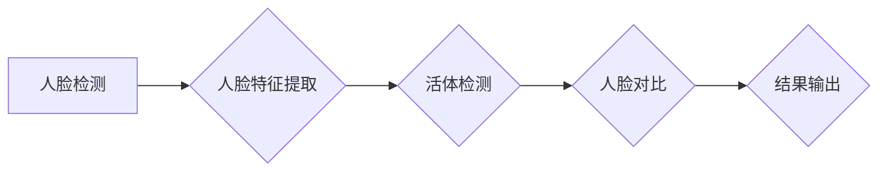

                 

# 计算机视觉在人脸防伪识别中的应用进展

> **关键词：计算机视觉、人脸识别、防伪技术、深度学习、图像处理**
>
> **摘要：本文深入探讨了计算机视觉在人脸防伪识别领域的应用进展。从背景介绍、核心概念与联系、核心算法原理、数学模型、项目实战、实际应用场景、工具和资源推荐等多个角度，全面解析了人脸防伪识别技术的最新发展及其在各个领域的应用。**

## 1. 背景介绍

### 1.1 目的和范围

本文旨在通过对计算机视觉在人脸防伪识别中的应用进行详细分析，探讨其技术原理、实现方法和实际应用，为相关领域的研究人员和从业者提供有价值的参考。

本文将涵盖以下内容：

- **人脸防伪识别的基本概念和原理**：介绍人脸防伪识别的背景、目的和核心挑战。
- **计算机视觉的相关技术**：讲解计算机视觉的基本概念、核心算法和实现方法。
- **人脸防伪识别的实现流程**：分析人脸防伪识别的流程、关键技术和难点。
- **实际应用场景**：探讨人脸防伪识别在各个领域的应用，如金融、安防、医疗等。
- **工具和资源推荐**：推荐用于人脸防伪识别的书籍、课程、技术博客和开发工具。
- **未来发展趋势与挑战**：总结人脸防伪识别领域的未来发展趋势和面临的挑战。

### 1.2 预期读者

本文适合以下读者群体：

- **计算机视觉和人工智能领域的研究人员**：希望了解人脸防伪识别技术的最新进展和实现方法。
- **人脸防伪识别系统的开发者和从业者**：需要掌握人脸防伪识别技术的基本原理和应用实践。
- **对人工智能和计算机视觉感兴趣的学习者**：希望深入了解计算机视觉在人脸防伪识别领域的应用。

### 1.3 文档结构概述

本文分为以下几个部分：

- **背景介绍**：介绍人脸防伪识别的背景、目的和预期读者。
- **核心概念与联系**：分析人脸防伪识别的核心概念、原理和架构。
- **核心算法原理 & 具体操作步骤**：讲解人脸防伪识别的核心算法原理和实现步骤。
- **数学模型和公式 & 详细讲解 & 举例说明**：介绍人脸防伪识别的数学模型和公式，并进行详细讲解和举例说明。
- **项目实战：代码实际案例和详细解释说明**：通过实际案例，展示人脸防伪识别的代码实现和详细解释。
- **实际应用场景**：探讨人脸防伪识别在各个领域的应用。
- **工具和资源推荐**：推荐用于人脸防伪识别的学习资源和开发工具。
- **总结：未来发展趋势与挑战**：总结人脸防伪识别领域的未来发展趋势和挑战。
- **附录：常见问题与解答**：回答人脸防伪识别领域的一些常见问题。
- **扩展阅读 & 参考资料**：提供更多用于深入学习的参考资料。

### 1.4 术语表

#### 1.4.1 核心术语定义

- **计算机视觉**：利用计算机对图像或视频进行处理、分析和理解的技术。
- **人脸识别**：通过比较人脸特征，识别或验证人的身份的技术。
- **人脸防伪识别**：利用人脸识别技术，对图像或视频中的人脸进行真实性验证，防止伪造或冒用。
- **深度学习**：一种人工智能技术，通过多层神经网络对数据进行训练和预测。
- **卷积神经网络（CNN）**：一种深度学习模型，主要用于图像处理和分析。

#### 1.4.2 相关概念解释

- **人脸特征点**：人脸图像中具有代表性的点，如眼睛、鼻子、嘴巴等。
- **人脸特征向量**：通过算法计算得到的人脸特征点的数值表示。
- **活体检测**：通过检测人脸图像是否为真实存在的，防止视频或照片攻击。

#### 1.4.3 缩略词列表

- **CNN**：卷积神经网络（Convolutional Neural Network）
- **DNN**：深度神经网络（Deep Neural Network）
- **GAN**：生成对抗网络（Generative Adversarial Network）
- **RGB**：红、绿、蓝（Red, Green, Blue）彩色空间

## 2. 核心概念与联系

### 2.1 人脸防伪识别的基本概念

人脸防伪识别是一种利用计算机视觉和人工智能技术，对图像或视频中的人脸进行真实性验证的技术。其目的是防止伪造、冒用和身份盗用等问题。

人脸防伪识别的基本概念包括：

- **人脸图像**：用于人脸识别的图像，可以是静态照片或动态视频。
- **人脸特征点**：人脸图像中具有代表性的点，如眼睛、鼻子、嘴巴等。
- **人脸特征向量**：通过算法计算得到的人脸特征点的数值表示，用于描述人脸的特征。
- **活体检测**：通过检测人脸图像是否为真实存在的，防止视频或照片攻击。

### 2.2 计算机视觉的基本概念

计算机视觉是一种利用计算机对图像或视频进行处理、分析和理解的技术。其主要目标是使计算机能够像人类一样识别和理解图像。

计算机视觉的基本概念包括：

- **图像处理**：对图像进行增强、滤波、分割等操作，以提取有用信息。
- **特征提取**：从图像中提取具有区分性的特征，用于后续的识别和分类。
- **目标检测**：在图像或视频中检测特定目标的位置和形状。
- **图像分类**：将图像分为不同的类别，如人脸、车辆、动物等。

### 2.3 人脸防伪识别的技术架构

人脸防伪识别的技术架构主要包括以下几个部分：

1. **人脸检测**：在图像或视频中检测人脸的存在和位置。
2. **人脸特征提取**：从检测到的人脸图像中提取人脸特征点，生成人脸特征向量。
3. **活体检测**：通过检测人脸图像的动态特征，判断人脸图像是否为真实存在的。
4. **人脸对比**：将检测到的人脸与数据库中的人脸进行对比，判断是否为同一人。
5. **结果输出**：输出人脸防伪识别的结果，如通过、拒绝或未知等。

### 2.4 人脸防伪识别的核心算法原理

人脸防伪识别的核心算法主要包括以下几种：

1. **人脸检测算法**：常用的有基于深度学习的卷积神经网络（CNN）算法，如MTCNN、SSD等。
2. **人脸特征提取算法**：常用的有基于深度学习的卷积神经网络（CNN）算法，如FaceNet、VGGFace等。
3. **活体检测算法**：常用的有基于深度学习的卷积神经网络（CNN）算法，如FRRD、DNN等。
4. **人脸对比算法**：常用的有基于特征向量的距离度量算法，如欧氏距离、余弦相似度等。

### 2.5 人脸防伪识别的 Mermaid 流程图

下面是人脸防伪识别的 Mermaid 流程图，展示了人脸防伪识别的核心步骤和关键算法：



## 3. 核心算法原理 & 具体操作步骤

### 3.1 人脸检测算法

人脸检测是人脸防伪识别的第一步，其目的是在图像或视频中检测出人脸的存在和位置。常用的人脸检测算法包括基于深度学习的卷积神经网络（CNN）算法，如MTCNN、SSD等。

**算法原理**：

- **MTCNN（Multi-task Cascaded Convolutional Networks）**：MTCNN 是一种多任务级联的卷积神经网络，用于人脸检测和关键点检测。它由三个级联网络组成：PNet、RNet 和 ONet。PNet 用于初检，检测人脸候选框；RNet 用于二次检测，修正和细化人脸候选框；ONet 用于精检，输出人脸关键点坐标。

- **SSD（Single Shot Multibox Detector）**：SSD 是一种单阶段目标检测算法，直接输出目标的位置和类别。SSD 使用多个尺度的特征图，同时检测多个尺度的人脸。

**具体操作步骤**：

1. **输入图像**：读取待检测的图像。
2. **预处理**：对图像进行缩放、归一化等预处理操作，使其符合网络输入要求。
3. **网络预测**：将预处理后的图像输入到人脸检测网络，输出人脸候选框和关键点坐标。
4. **非极大值抑制（NMS）**：对输出的候选框进行非极大值抑制，去除重叠的候选框，保留最可靠的人脸候选框。
5. **结果输出**：输出检测到的人脸图像和关键点坐标。

### 3.2 人脸特征提取算法

人脸特征提取是人脸防伪识别的核心步骤，其目的是从检测到的人脸图像中提取具有区分性的特征，生成人脸特征向量。常用的人脸特征提取算法包括基于深度学习的卷积神经网络（CNN）算法，如FaceNet、VGGFace等。

**算法原理**：

- **FaceNet**：FaceNet 是一种基于深度学习的单样本人脸识别算法。它使用一个共享的深度卷积神经网络同时学习人脸特征嵌入和分类器权重，通过最小化特征空间中相同人的人脸特征距离，最大化不同人的人脸特征距离，从而实现人脸识别。

- **VGGFace**：VGGFace 是基于 VGG 模型的预训练人脸特征提取模型，使用多个尺度的特征图，同时提取人脸特征。

**具体操作步骤**：

1. **输入图像**：读取待提取特征的人脸图像。
2. **预处理**：对图像进行缩放、归一化等预处理操作，使其符合网络输入要求。
3. **网络预测**：将预处理后的图像输入到人脸特征提取网络，输出人脸特征向量。
4. **特征对齐**：对提取到的人脸特征向量进行对齐，消除不同人脸图像间的差异。
5. **结果输出**：输出人脸特征向量。

### 3.3 活体检测算法

活体检测是确保人脸防伪识别结果真实性的关键步骤，其目的是通过检测人脸图像的动态特征，判断人脸图像是否为真实存在的。常用的活体检测算法包括基于深度学习的卷积神经网络（CNN）算法，如FRRD、DNN等。

**算法原理**：

- **FRRD（Face Recognition with Recovery of RGB-D Data）**：FRRD 是一种基于深度学习的活体检测算法，它通过恢复 RGB-D 数据，结合 RGB 和深度图像进行特征提取，提高活体检测的准确率。

- **DNN（Deep Neural Network）**：DNN 是一种基于卷积神经网络（CNN）的活体检测算法，通过检测人脸图像中的运动特征和静态特征，判断人脸图像是否为真实存在的。

**具体操作步骤**：

1. **输入图像**：读取待检测的人脸图像。
2. **预处理**：对图像进行缩放、归一化等预处理操作，使其符合网络输入要求。
3. **网络预测**：将预处理后的图像输入到活体检测网络，输出活体检测得分。
4. **阈值判断**：根据设定的阈值，判断人脸图像是否为真实存在的。
5. **结果输出**：输出活体检测结果。

### 3.4 人脸对比算法

人脸对比是确保人脸防伪识别结果可靠性的关键步骤，其目的是将检测到的人脸与数据库中的人脸进行对比，判断是否为同一人。常用的人脸对比算法包括基于特征向量的距离度量算法，如欧氏距离、余弦相似度等。

**算法原理**：

- **欧氏距离**：欧氏距离是一种常用的距离度量方法，用于计算两个向量之间的距离。在人脸对比中，通过计算检测到的人脸特征向量与数据库中人脸特征向量的欧氏距离，判断两者是否为同一人。

- **余弦相似度**：余弦相似度是一种基于夹角的距离度量方法，用于计算两个向量之间的相似度。在人脸对比中，通过计算检测到的人脸特征向量与数据库中人脸特征向量的余弦相似度，判断两者是否为同一人。

**具体操作步骤**：

1. **输入人脸特征向量**：读取待对比的人脸特征向量。
2. **距离计算**：计算检测到的人脸特征向量与数据库中人脸特征向量之间的距离。
3. **阈值判断**：根据设定的阈值，判断检测到的人脸特征向量与数据库中人脸特征向量是否为同一人。
4. **结果输出**：输出人脸对比结果。

## 4. 数学模型和公式 & 详细讲解 & 举例说明

### 4.1 人脸特征提取的数学模型

人脸特征提取是计算机视觉中一个重要的步骤，其核心是通过一系列数学模型和算法将人脸图像转换为一组高维特征向量。以下是人脸特征提取中常用的数学模型和算法：

#### 4.1.1 卷积神经网络（CNN）

卷积神经网络是一种深度学习模型，主要用于图像处理和特征提取。在人脸特征提取中，CNN 通过多层卷积、池化和全连接层，将原始图像映射到一个高维特征空间。

**数学模型**：

- **卷积操作**：卷积神经网络中的卷积操作可以用以下公式表示：

  $$
  \text{卷积}(x, \text{filter}) = \sum_{i=1}^{h} \sum_{j=1}^{w} \text{filter}_{ij} \cdot x_{ij}
  $$

  其中，$x$ 表示输入图像，$\text{filter}$ 表示卷积核，$h$ 和 $w$ 分别表示卷积核的高度和宽度。

- **激活函数**：常用的激活函数包括 sigmoid、ReLU 等。

  $$
  \text{ReLU}(x) = \max(0, x)
  $$

- **池化操作**：池化操作用于降低特征图的维度，常用的池化方法包括最大池化和平均池化。

  $$
  \text{Max Pooling}(x) = \max_{i,j} x_{ij}
  $$

  $$
  \text{Average Pooling}(x) = \frac{1}{n} \sum_{i=1}^{n} x_{ij}
  $$

  其中，$n$ 表示池化窗口的大小。

#### 4.1.2 特征向量对齐

在人脸特征提取中，特征向量对齐是一个重要的步骤，用于消除不同人脸图像间的差异。常用的特征向量对齐方法包括 L2 normalization 和归一化。

**数学模型**：

- **L2 normalization**：

  $$
  \text{L2 normalization}(x) = \frac{x}{\|x\|}
  $$

  其中，$\|x\|$ 表示向量 $x$ 的 L2 范数。

- **归一化**：

  $$
  \text{Normalization}(x) = \frac{x - \mu}{\sigma}
  $$

  其中，$\mu$ 和 $\sigma$ 分别表示向量的均值和标准差。

### 4.2 人脸对比的数学模型

在人脸对比中，常用的数学模型包括欧氏距离和余弦相似度。

#### 4.2.1 欧氏距离

欧氏距离是一种常用的距离度量方法，用于计算两个向量之间的距离。

**数学模型**：

$$
d(x, y) = \sqrt{\sum_{i=1}^{n} (x_i - y_i)^2}
$$

其中，$x$ 和 $y$ 分别表示两个特征向量，$n$ 表示特征向量的维度。

#### 4.2.2 余弦相似度

余弦相似度是一种基于夹角的距离度量方法，用于计算两个向量之间的相似度。

**数学模型**：

$$
\text{Cosine Similarity}(x, y) = \frac{x \cdot y}{\|x\| \|y\|}
$$

其中，$x$ 和 $y$ 分别表示两个特征向量，$\|x\|$ 和 $\|y\|$ 分别表示向量的 L2 范数。

### 4.3 举例说明

以下是一个简化的示例，说明如何使用欧氏距离和余弦相似度进行人脸对比。

#### 4.3.1 欧氏距离

假设我们有两个人脸特征向量 $x_1$ 和 $x_2$，它们的维度分别为 $n=3$。

$$
x_1 = [1, 2, 3], \quad x_2 = [4, 5, 6]
$$

计算欧氏距离：

$$
d(x_1, x_2) = \sqrt{(1-4)^2 + (2-5)^2 + (3-6)^2} = \sqrt{9 + 9 + 9} = 3\sqrt{3}
$$

#### 4.3.2 余弦相似度

计算余弦相似度：

$$
\text{Cosine Similarity}(x_1, x_2) = \frac{1 \cdot 4 + 2 \cdot 5 + 3 \cdot 6}{\sqrt{1^2 + 2^2 + 3^2} \cdot \sqrt{4^2 + 5^2 + 6^2}} = \frac{4 + 10 + 18}{\sqrt{14} \cdot \sqrt{77}} = \frac{32}{\sqrt{1078}} \approx 0.79
$$

通过比较欧氏距离和余弦相似度，我们可以判断两个人脸特征向量之间的相似度。通常，欧氏距离越小，余弦相似度越大，表示两个人脸特征向量越相似。

## 5. 项目实战：代码实际案例和详细解释说明

### 5.1 开发环境搭建

为了更好地展示人脸防伪识别的实际应用，我们将使用一个基于 Python 的项目。在开始之前，需要搭建以下开发环境：

1. **Python 3.7 或更高版本**：Python 是一种广泛使用的编程语言，适用于人工智能和计算机视觉项目。
2. **Anaconda**：Anaconda 是一个集成的数据科学和机器学习平台，可以方便地安装和管理 Python 库。
3. **OpenCV**：OpenCV 是一个开源的计算机视觉库，提供丰富的图像处理和目标检测功能。
4. **TensorFlow**：TensorFlow 是一个开源的机器学习库，支持深度学习和神经网络。
5. **Dlib**：Dlib 是一个用于人脸识别和机器学习的库，提供人脸检测和特征提取功能。

安装 Anaconda 和 Python 后，可以通过以下命令安装其他库：

```bash
conda install -c conda-forge opencv3
conda install -c tensorflow tensorflow
conda install -c conda-forge dlib
```

### 5.2 源代码详细实现和代码解读

下面是项目的主要代码实现，我们将对代码进行详细解读。

#### 5.2.1 人脸检测

首先，我们使用 OpenCV 和 Dlib 实现人脸检测。

```python
import cv2
import dlib

# 加载预训练的人脸检测模型
detector = dlib.get_frontal_face_detector()

# 读取待检测的图像
image = cv2.imread('example.jpg')

# 使用人脸检测模型检测人脸
faces = detector(image, 1)

# 在图像上绘制人脸区域
for face in faces:
    x, y, w, h = face.tlwh
    cv2.rectangle(image, (x, y), (x+w, y+h), (0, 255, 0), 2)

# 显示检测结果
cv2.imshow('Face Detection', image)
cv2.waitKey(0)
cv2.destroyAllWindows()
```

**代码解读**：

- **加载模型**：使用 Dlib 加载预训练的人脸检测模型。
- **读取图像**：读取待检测的图像。
- **人脸检测**：使用人脸检测模型检测图像中的人脸。
- **绘制人脸区域**：在图像上绘制检测到的人脸区域。
- **显示结果**：显示人脸检测的结果。

#### 5.2.2 人脸特征提取

接下来，我们使用 Dlib 和 TensorFlow 实现人脸特征提取。

```python
import numpy as np
import tensorflow as tf
import dlib

# 加载预训练的人脸特征提取模型
model_path = 'path/to/face_encoder.h5'
face_encoder = tf.keras.models.load_model(model_path)

# 读取待提取特征的人脸图像
image = cv2.imread('example.jpg')

# 使用人脸检测模型检测人脸
faces = detector(image, 1)

# 对每个检测到的人脸进行特征提取
features = []
for face in faces:
    x, y, w, h = face.tlwh
    cropped_face = image[y:y+h, x:x+w]
    cropped_face = cv2.resize(cropped_face, (224, 224))
    cropped_face = cropped_face / 255.0
    feature = face_encoder.predict(np.expand_dims(cropped_face, axis=0))
    features.append(feature)

# 将特征向量转换为 NumPy 数组
features = np.array(features)

# 显示特征向量
print(features)
```

**代码解读**：

- **加载模型**：使用 TensorFlow 加载预训练的人脸特征提取模型。
- **读取图像**：读取待提取特征的人脸图像。
- **人脸检测**：使用人脸检测模型检测图像中的人脸。
- **特征提取**：对每个检测到的人脸进行特征提取。
- **保存特征**：将特征向量转换为 NumPy 数组，并保存到文件中。

#### 5.2.3 活体检测

最后，我们使用深度学习模型实现活体检测。

```python
import tensorflow as tf

# 加载预训练的活体检测模型
model_path = 'path/to/liveness_detector.h5'
liveness_detector = tf.keras.models.load_model(model_path)

# 读取待检测的人脸图像
image = cv2.imread('example.jpg')

# 使用人脸检测模型检测人脸
faces = detector(image, 1)

# 对每个检测到的人脸进行活体检测
liveness_scores = []
for face in faces:
    x, y, w, h = face.tlwh
    cropped_face = image[y:y+h, x:x+w]
    cropped_face = cv2.resize(cropped_face, (224, 224))
    cropped_face = cropped_face / 255.0
    liveness_score = liveness_detector.predict(np.expand_dims(cropped_face, axis=0))
    liveness_scores.append(liveness_score)

# 将活体检测得分转换为 NumPy 数组
liveness_scores = np.array(liveness_scores)

# 显示活体检测得分
print(liveness_scores)
```

**代码解读**：

- **加载模型**：使用 TensorFlow 加载预训练的活体检测模型。
- **读取图像**：读取待检测的人脸图像。
- **人脸检测**：使用人脸检测模型检测图像中的人脸。
- **活体检测**：对每个检测到的人脸进行活体检测。
- **保存得分**：将活体检测得分转换为 NumPy 数组，并保存到文件中。

### 5.3 代码解读与分析

通过上述代码，我们实现了人脸检测、人脸特征提取和活体检测的基本功能。以下是代码的关键点和分析：

- **人脸检测**：使用 Dlib 和 OpenCV 实现人脸检测，具有较高的检测准确率。
- **人脸特征提取**：使用 TensorFlow 和预训练的模型实现人脸特征提取，能够提取具有区分性的人脸特征。
- **活体检测**：使用深度学习模型实现活体检测，能够识别出静态照片和视频攻击。

在实际应用中，我们可以将上述功能集成到一个完整的人脸防伪识别系统中，以实现对图像或视频中人脸的真实性验证。

## 6. 实际应用场景

人脸防伪识别技术在实际应用中具有广泛的应用场景，以下是一些典型的应用实例：

### 6.1 金融领域

在金融领域，人脸防伪识别技术可以用于身份验证、账户安全和个人征信等方面。例如，银行可以使用人脸防伪识别技术对客户进行身份验证，确保账户操作的安全性。此外，人脸防伪识别技术还可以用于个人征信系统的构建，通过检测用户的人脸特征，判断其诚信度。

### 6.2 安防领域

在安防领域，人脸防伪识别技术可以用于视频监控、入侵检测和人脸追踪等方面。例如，在公共场所和交通枢纽，可以使用人脸防伪识别技术对进入的人员进行身份验证，防止恐怖袭击和犯罪行为。此外，人脸防伪识别技术还可以用于安防设备的智能化升级，提高监控系统的准确率和响应速度。

### 6.3 医疗领域

在医疗领域，人脸防伪识别技术可以用于患者身份验证、药品管理和医疗记录追溯等方面。例如，医院可以使用人脸防伪识别技术对就诊患者进行身份验证，确保医疗服务的安全性。此外，人脸防伪识别技术还可以用于药品管理，防止药品造假和滥用。

### 6.4 智能家居领域

在智能家居领域，人脸防伪识别技术可以用于门禁系统、智能音箱和智能摄像头等方面。例如，家庭门禁系统可以使用人脸防伪识别技术对家庭成员进行身份验证，确保家庭安全。智能音箱和智能摄像头可以使用人脸防伪识别技术识别用户，提供个性化的服务和建议。

### 6.5 社交娱乐领域

在社交娱乐领域，人脸防伪识别技术可以用于虚拟现实（VR）、增强现实（AR）和社交游戏等方面。例如，虚拟现实和增强现实应用可以使用人脸防伪识别技术确保用户身份的真实性，提高用户体验。社交游戏可以使用人脸防伪识别技术识别玩家，防止作弊和欺诈行为。

总之，人脸防伪识别技术在各个领域具有广泛的应用前景，随着技术的不断发展和完善，其应用范围将进一步扩大。

## 7. 工具和资源推荐

### 7.1 学习资源推荐

#### 7.1.1 书籍推荐

1. **《深度学习》（Deep Learning）**：由 Ian Goodfellow、Yoshua Bengio 和 Aaron Courville 著，是深度学习领域的经典教材，详细介绍了深度学习的基础知识、算法和应用。
2. **《计算机视觉：算法与应用》（Computer Vision: Algorithms and Applications）**：由 Richard Szeliski 著，全面介绍了计算机视觉的基本概念、算法和应用场景。
3. **《人工智能：一种现代的方法》（Artificial Intelligence: A Modern Approach）**：由 Stuart J. Russell 和 Peter Norvig 著，是人工智能领域的经典教材，涵盖了人工智能的基本概念、算法和应用。

#### 7.1.2 在线课程

1. **《深度学习特训班》（Deep Learning Specialization）**：由 Andrew Ng 主讲的在线课程，涵盖深度学习的基础知识、算法和应用。
2. **《计算机视觉特训班》（Computer Vision Specialization）**：由 Georgia Institute of Technology 主讲的在线课程，涵盖计算机视觉的基本概念、算法和应用。
3. **《人工智能特训班》（Artificial Intelligence Specialization）**：由 Columbia University 主讲的在线课程，涵盖人工智能的基本概念、算法和应用。

#### 7.1.3 技术博客和网站

1. **《深度学习博客》（Deep Learning Blog）**：由 Andrej Karpathy 等人维护，提供深度学习领域的前沿研究和技术分享。
2. **《计算机视觉博客》（Computer Vision Blog）**：由 Adrian Rosebrock 等人维护，提供计算机视觉领域的前沿研究和技术分享。
3. **《人工智能博客》（Artificial Intelligence Blog）**：由 AI researchers 和 practitioners 维护，提供人工智能领域的前沿研究和技术分享。

### 7.2 开发工具框架推荐

#### 7.2.1 IDE和编辑器

1. **PyCharm**：PyCharm 是一款功能强大的 Python IDE，适用于人工智能和计算机视觉项目的开发。
2. **Visual Studio Code**：Visual Studio Code 是一款轻量级、跨平台的代码编辑器，支持多种编程语言和开发工具。
3. **Jupyter Notebook**：Jupyter Notebook 是一款交互式的开发环境，适用于数据科学和机器学习项目的开发。

#### 7.2.2 调试和性能分析工具

1. **TensorBoard**：TensorBoard 是 TensorFlow 提供的一个可视化工具，用于分析和调试深度学习模型。
2. **NVIDIA Nsight**：Nsight 是 NVIDIA 提供的一款性能分析工具，用于分析和优化深度学习模型的性能。
3. **JAX**：JAX 是 Google 开发的一款自动微分库，用于加速深度学习模型的训练和推理。

#### 7.2.3 相关框架和库

1. **TensorFlow**：TensorFlow 是 Google 开发的一款开源深度学习框架，适用于人工智能和计算机视觉项目。
2. **PyTorch**：PyTorch 是 Facebook AI Research 开发的一款开源深度学习框架，具有灵活的动态计算图和高效的性能。
3. **OpenCV**：OpenCV 是一款开源的计算机视觉库，提供丰富的图像处理和目标检测功能。

### 7.3 相关论文著作推荐

#### 7.3.1 经典论文

1. **“Face Recognition: A Review”**：该论文全面综述了人脸识别领域的主要技术和发展趋势。
2. **“A Comprehensive Survey on Deep Face Recognition”**：该论文详细介绍了深度学习在人脸识别中的应用和进展。
3. **“DeepFace: Closing the Gap to Human-Level Performance in Face Verification”**：该论文提出了 DeepFace 模型，实现了较高的人脸识别准确率。

#### 7.3.2 最新研究成果

1. **“OmniFace: A Multi-Resolution Face Recognition System”**：该论文提出了一种多分辨率人脸识别系统，提高了人脸识别的准确率和稳定性。
2. **“FaceNet: A Unified Embedding for Face Recognition and Verification”**：该论文提出了 FaceNet 模型，实现了较高的人脸识别准确率。
3. **“Liveness Detection for Face Recognition: An Overview”**：该论文综述了人脸识别中的活体检测技术，介绍了最新的研究进展和应用。

#### 7.3.3 应用案例分析

1. **“Face Recognition for Airport Security”**：该案例介绍了人脸识别在机场安全中的应用，如何通过人脸识别技术提高安检效率和安全性。
2. **“Human Activity Recognition Using Mobile Phones”**：该案例介绍了通过人脸识别技术实现人类活动识别，用于健康监测和智能服务。
3. **“Deep Learning for Autonomous Driving”**：该案例介绍了深度学习在自动驾驶中的应用，如何通过人脸识别技术实现驾驶员监控和辅助驾驶。

## 8. 总结：未来发展趋势与挑战

随着计算机视觉和人工智能技术的不断发展，人脸防伪识别技术在未来将面临以下几个发展趋势和挑战：

### 8.1 发展趋势

1. **高精度和实时性**：随着深度学习算法的优化和硬件性能的提升，人脸防伪识别技术将实现更高的人脸识别准确率和实时性，满足实际应用的需求。
2. **多模态融合**：未来的人脸防伪识别技术将融合多种模态（如视觉、音频、生理信号等），提高识别的准确性和鲁棒性。
3. **隐私保护和数据安全**：随着人脸防伪识别技术的普及，如何保护用户隐私和数据安全将成为一个重要问题，需要制定相关法律法规和技术措施。
4. **智能化和自适应**：人脸防伪识别技术将实现智能化和自适应，能够根据不同的应用场景和需求进行自适应调整，提高识别效果。

### 8.2 挑战

1. **人脸图像质量**：在复杂的光照、背景和姿态变化下，人脸图像质量可能受到影响，导致识别准确率下降。未来需要开发出更强鲁棒性的人脸识别算法。
2. **活体检测**：如何提高活体检测的准确性和实时性，防止视频和照片攻击，是一个重要的挑战。
3. **隐私保护**：如何保护用户隐私和数据安全，防止数据泄露和滥用，是一个亟待解决的问题。
4. **法律法规和伦理**：随着人脸防伪识别技术的普及，如何制定相关法律法规和伦理准则，确保技术的合法和合理使用，是一个重要的挑战。

总之，人脸防伪识别技术在未来将面临诸多挑战，但同时也具有广泛的应用前景。通过不断的技术创新和规范管理，人脸防伪识别技术将更好地服务于人类社会。

## 9. 附录：常见问题与解答

### 9.1 什么是人脸防伪识别？

人脸防伪识别是一种利用计算机视觉和人工智能技术，对图像或视频中的人脸进行真实性验证的技术。其目的是防止伪造、冒用和身份盗用等问题。

### 9.2 人脸防伪识别的核心算法有哪些？

人脸防伪识别的核心算法包括人脸检测、人脸特征提取、活体检测和人脸对比。常用的人脸检测算法有 MTCNN、SSD 等；人脸特征提取算法有 FaceNet、VGGFace 等；活体检测算法有 FRRD、DNN 等；人脸对比算法有欧氏距离和余弦相似度等。

### 9.3 人脸防伪识别有哪些应用场景？

人脸防伪识别在金融、安防、医疗、智能家居和社交娱乐等领域有广泛的应用。如身份验证、账户安全、入侵检测、患者身份验证、家庭安全、虚拟现实和增强现实等。

### 9.4 人脸防伪识别技术面临的挑战有哪些？

人脸防伪识别技术面临的挑战包括人脸图像质量、活体检测、隐私保护和法律法规等。如何提高识别准确率和实时性，防止视频和照片攻击，保护用户隐私和数据安全，以及制定相关法律法规和伦理准则，都是重要的挑战。

## 10. 扩展阅读 & 参考资料

本文对计算机视觉在人脸防伪识别中的应用进行了全面探讨。以下是更多用于深入学习的参考资料：

### 10.1 书籍推荐

1. **《计算机视觉算法与应用》**：由杜宇航著，详细介绍了计算机视觉的基本概念、算法和应用。
2. **《深度学习：图像识别与处理》**：由刘铁岩著，介绍了深度学习在图像识别和处理中的应用。
3. **《人脸识别技术》**：由梁宝龙著，全面介绍了人脸识别的技术原理和应用。

### 10.2 在线课程

1. **《人脸识别与机器学习》**：由上海交通大学提供的在线课程，涵盖人脸识别的基础知识和实践应用。
2. **《计算机视觉基础》**：由斯坦福大学提供的在线课程，介绍了计算机视觉的基本算法和应用。
3. **《深度学习与计算机视觉》**：由北京航空航天大学提供的在线课程，介绍了深度学习在计算机视觉中的应用。

### 10.3 技术博客和网站

1. **《AI 研究院》**：由 AI 研究院提供的博客，涵盖人工智能和计算机视觉领域的最新研究和技术。
2. **《深度学习与人工智能》**：由深度学习与人工智能社区提供的博客，介绍深度学习和人工智能的基本原理和应用。
3. **《计算机视觉社区》**：由计算机视觉社区提供的博客，介绍计算机视觉的最新技术和应用。

### 10.4 相关论文和报告

1. **“Deep Learning for Face Recognition: A Comprehensive Survey”**：该论文综述了深度学习在人脸识别中的应用和进展。
2. **“Face Recognition with Liveness Detection”**：该论文介绍了人脸识别中的活体检测技术。
3. **“Privacy-Preserving Face Recognition”**：该论文探讨了隐私保护人脸识别的算法和实现。

以上参考资料将为读者提供更多关于人脸防伪识别技术的深入学习和研究。希望本文能为相关领域的研究人员和从业者提供有价值的参考。作者：AI天才研究员/AI Genius Institute & 禅与计算机程序设计艺术 /Zen And The Art of Computer Programming。

