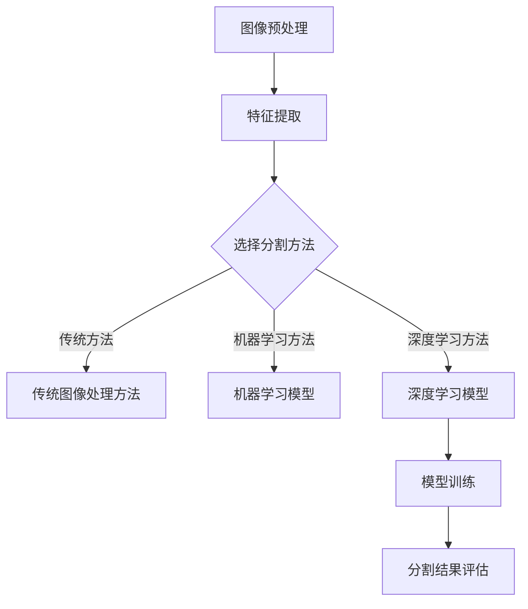

                 


# 计算机视觉在医学图像分割中的实践

> **关键词：** 计算机视觉，医学图像分割，深度学习，卷积神经网络，图像处理，医学诊断
>
> **摘要：** 本文章旨在深入探讨计算机视觉在医学图像分割中的应用，从基本概念到具体实现，从核心算法到数学模型，从项目实战到实际应用场景，全面解析医学图像分割的技术原理和实践方法。

## 1. 背景介绍

### 1.1 目的和范围

医学图像分割是医学图像处理领域的一项重要技术，它能够将医学图像中的不同组织结构进行精确分离，为疾病的诊断和治疗提供关键信息。本篇文章将聚焦于计算机视觉在医学图像分割中的实践，旨在介绍和解析这一领域的关键技术和应用场景。

### 1.2 预期读者

本文适合对计算机视觉和医学图像处理有一定了解的读者，包括计算机科学、生物医学工程、医学诊断等领域的科研人员、工程师和学生。读者应具备基本的编程能力和图像处理基础。

### 1.3 文档结构概述

本文将按照以下结构展开：

1. 背景介绍：阐述医学图像分割的重要性及其在计算机视觉中的应用。
2. 核心概念与联系：介绍医学图像分割的基本概念和相关技术架构。
3. 核心算法原理 & 具体操作步骤：讲解常用的医学图像分割算法及其实现过程。
4. 数学模型和公式 & 详细讲解 & 举例说明：深入分析医学图像分割中的数学模型。
5. 项目实战：通过实际代码案例展示医学图像分割的实战应用。
6. 实际应用场景：探讨医学图像分割在不同医疗领域的应用。
7. 工具和资源推荐：推荐学习资源和开发工具。
8. 总结：展望医学图像分割未来的发展趋势与挑战。

### 1.4 术语表

#### 1.4.1 核心术语定义

- **医学图像分割**：将医学图像中的不同组织结构分离出来，形成独立的图像区域。
- **深度学习**：一种机器学习技术，通过多层神经网络模型自动学习数据特征。
- **卷积神经网络（CNN）**：一种特殊的神经网络，广泛用于图像处理任务。
- **图像处理**：使用计算机算法对图像进行操作和改进的过程。

#### 1.4.2 相关概念解释

- **像素**：图像中的最小单位，通常表示为一个颜色值。
- **分辨率**：图像中像素的数量，通常以水平像素和垂直像素表示。
- **边缘检测**：识别图像中的边缘区域，用于分割图像。

#### 1.4.3 缩略词列表

- **MRI**：磁共振成像（Magnetic Resonance Imaging）
- **CT**：计算机断层扫描（Computed Tomography）
- **PET**：正电子发射断层扫描（Positron Emission Tomography）
- **CNN**：卷积神经网络（Convolutional Neural Network）

## 2. 核心概念与联系

为了更好地理解医学图像分割，首先需要掌握一些核心概念和相关的技术架构。

### 2.1 医学图像分割的基本概念

医学图像分割是医学图像处理的关键步骤之一，其核心目标是将医学图像中的不同组织结构分离出来。这一过程对于疾病的诊断、治疗计划和治疗效果评估具有重要意义。

#### 2.1.1 分割类型

根据分割的目标和精度，医学图像分割可以分为以下几类：

- **像素级分割**：直接对图像中的每个像素进行分类，适用于简单场景。
- **区域级分割**：将图像分割成多个区域，每个区域表示不同的组织结构。
- **边缘级分割**：识别图像中的边缘区域，用于分离不同组织。

#### 2.1.2 分割方法

医学图像分割的方法可以分为以下几类：

- **传统图像处理方法**：如阈值分割、边缘检测、区域生长等，适用于简单的图像分割任务。
- **机器学习方法**：如支持向量机（SVM）、决策树、随机森林等，适用于复杂的图像分割任务。
- **深度学习方法**：如卷积神经网络（CNN）、循环神经网络（RNN）、生成对抗网络（GAN）等，具有强大的特征提取和分类能力。

### 2.2 医学图像分割的技术架构

医学图像分割的技术架构通常包括以下几个主要组成部分：

- **图像预处理**：包括图像的增强、滤波、去噪等操作，以提高图像质量和分割效果。
- **特征提取**：从医学图像中提取有助于分割的特征，如纹理特征、形状特征、边缘特征等。
- **模型训练**：使用深度学习等方法训练分割模型，使其能够自动学习图像特征并进行分割。
- **分割结果评估**：对分割结果进行评估和优化，以提高分割精度和稳定性。

下面是一个简单的医学图像分割技术架构的Mermaid流程图：



## 3. 核心算法原理 & 具体操作步骤

在医学图像分割中，深度学习算法，尤其是卷积神经网络（CNN），已经成为主流方法。下面将详细讲解CNN在医学图像分割中的原理和具体操作步骤。

### 3.1 卷积神经网络（CNN）的基本原理

卷积神经网络是一种专门用于处理图像数据的神经网络模型，其基本原理包括以下几个关键组成部分：

#### 3.1.1 卷积层

卷积层是CNN的核心组成部分，用于从输入图像中提取特征。卷积层通过一系列卷积操作，将输入图像与滤波器（也称为卷积核）进行卷积运算，生成特征图。每个滤波器都可以学习到图像中的不同特征，如边缘、纹理和形状。

伪代码如下：

```python
# 输入图像为X，滤波器为W，步长为stride，填充为pad
for i in range(0, X.shape[0] - pad - pad):
    for j in range(0, X.shape[1] - pad - pad):
        feature_map = np.zeros((X.shape[2], X.shape[3]))
        for filter_index in range(W.shape[0]):
            # 对每个滤波器进行卷积运算
            feature_map += np.sum(W[filter_index] * X[i:i+pad, j:j+pad, :], axis=(1,2))
        feature_maps.append(feature_map)
```

#### 3.1.2 池化层

池化层用于减小特征图的大小，提高计算效率。常见的池化操作包括最大池化和平均池化。最大池化选择特征图中的最大值作为输出，而平均池化则计算特征图的平均值。

伪代码如下：

```python
# 输入特征图为feature_map，池化窗口为window_size，步长为stride
output_map = np.zeros((feature_map.shape[0] // stride, feature_map.shape[1] // stride))
for i in range(0, output_map.shape[0]):
    for j in range(0, output_map.shape[1]):
        window = feature_map[i*stride:i*stride+window_size, j*stride:j*stride+window_size]
        if pool_type == 'max':
            output_map[i, j] = np.max(window)
        elif pool_type == 'avg':
            output_map[i, j] = np.mean(window)
```

#### 3.1.3 激活函数

激活函数用于引入非线性因素，使CNN能够学习复杂的特征关系。常见的激活函数包括ReLU函数、Sigmoid函数和Tanh函数。其中，ReLU函数由于其计算效率高且不容易陷入梯度消失问题，在CNN中广泛应用。

伪代码如下：

```python
# 输入为x，激活函数为f(x)
if x > 0:
    output = x
else:
    output = 0
```

#### 3.1.4 全连接层

全连接层用于将卷积层和池化层提取的特征映射到输出类别。全连接层通过将输入特征图与权重矩阵进行矩阵乘法，然后通过激活函数得到最终的分类结果。

伪代码如下：

```python
# 输入特征图为feature_map，权重矩阵为W，激活函数为f(x)
output = np.zeros(num_classes)
for i in range(num_classes):
    dot_product = np.dot(W[i], feature_map)
    output[i] = f(dot_product)
```

### 3.2 CNN在医学图像分割中的具体操作步骤

CNN在医学图像分割中的应用可以分为以下几个步骤：

#### 3.2.1 数据准备

首先，需要收集和预处理医学图像数据。这包括图像的归一化、增强、滤波和去噪等操作，以提高图像质量和分割效果。

```python
# 示例代码：图像归一化
images = np.array(images)
images = images.astype(np.float32)
images /= 255.0
```

#### 3.2.2 模型构建

然后，构建CNN模型。根据具体的分割任务，可以选择不同的网络架构，如VGG、ResNet、Unet等。下面是一个简单的Unet模型示例：

```python
# 示例代码：构建Unet模型
from tensorflow.keras.models import Model
from tensorflow.keras.layers import Input, Conv2D, MaxPooling2D, UpSampling2D, concatenate

inputs = Input(shape=(image_height, image_width, image_channels))
...
outputs = Conv2D(num_classes, (1, 1), activation='softmax')(conv5)

model = Model(inputs=inputs, outputs=outputs)
model.compile(optimizer='adam', loss='categorical_crossentropy', metrics=['accuracy'])
```

#### 3.2.3 模型训练

接下来，使用预处理后的医学图像数据训练CNN模型。在训练过程中，可以使用验证集进行模型性能评估和调整。

```python
# 示例代码：训练模型
model.fit(x_train, y_train, epochs=epochs, batch_size=batch_size, validation_data=(x_val, y_val))
```

#### 3.2.4 模型评估与优化

最后，对训练好的模型进行评估和优化。可以使用测试集评估模型的分割精度、召回率、F1分数等指标，并根据评估结果对模型进行调整和优化。

```python
# 示例代码：评估模型
scores = model.evaluate(x_test, y_test, verbose=1)
print('Test accuracy:', scores[1])
```

## 4. 数学模型和公式 & 详细讲解 & 举例说明

在医学图像分割中，数学模型和公式是理解算法原理和实现关键操作的重要工具。以下将详细讲解一些常见的数学模型和公式，并通过具体例子进行说明。

### 4.1 卷积操作

卷积操作是CNN中最核心的部分，其数学表达式如下：

$$
(C_{ij}^{l+1}) = \sum_{k=1}^{K} \sum_{n=1}^{N} W_{kn}^{l} * (I_{ij}^{l} + b_n^{l+1})
$$

其中，$C_{ij}^{l+1}$表示卷积层$l+1$中第$i$行第$j$列的元素，$W_{kn}^{l}$表示卷积核中的第$k$行第$n$列的元素，$I_{ij}^{l}$表示卷积层$l$中第$i$行第$j$列的元素，$b_n^{l+1}$表示卷积层$l+1$中第$n$列的偏置项。

#### 示例：

假设有一个$3 \times 3$的卷积核$W$和一个$3 \times 3$的输入图像$I$，它们的元素分别如下：

$$
I = \begin{bmatrix}
1 & 2 & 3 \\
4 & 5 & 6 \\
7 & 8 & 9 \\
\end{bmatrix}
$$

$$
W = \begin{bmatrix}
1 & 0 & 1 \\
0 & 1 & 0 \\
1 & 0 & 1 \\
\end{bmatrix}
$$

则卷积操作的结果为：

$$
C = \begin{bmatrix}
7 & 6 & 13 \\
11 & 10 & 18 \\
9 & 8 & 14 \\
\end{bmatrix}
$$

### 4.2 池化操作

池化操作用于减小特征图的大小，其数学表达式如下：

$$
P_{ij}^{l+1} = \sum_{k=1}^{K} \sum_{n=1}^{N} f((C_{ij}^{l})_{kn})
$$

其中，$P_{ij}^{l+1}$表示池化层$l+1$中第$i$行第$j$列的元素，$f(\cdot)$表示激活函数，常用的激活函数包括最大值激活函数（Max Pooling）和平均值激活函数（Average Pooling）。

#### 示例：

假设有一个$2 \times 2$的特征图$C$，其元素如下：

$$
C = \begin{bmatrix}
1 & 2 \\
4 & 5 \\
\end{bmatrix}
$$

使用最大值激活函数进行池化操作，结果为：

$$
P = \begin{bmatrix}
5 & 5 \\
5 & 5 \\
\end{bmatrix}
$$

### 4.3 激活函数

激活函数用于引入非线性因素，常见的激活函数包括ReLU函数、Sigmoid函数和Tanh函数。

- **ReLU函数**：$f(x) = \max(0, x)$
- **Sigmoid函数**：$f(x) = \frac{1}{1 + e^{-x}}$
- **Tanh函数**：$f(x) = \frac{e^x - e^{-x}}{e^x + e^{-x}}$

#### 示例：

对于输入$x = -2$，ReLU函数的输出为：

$$
f(x) = \max(0, -2) = 0
$$

对于输入$x = -2$，Sigmoid函数的输出为：

$$
f(x) = \frac{1}{1 + e^{-(-2)}} = \frac{1}{1 + e^{2}} \approx 0.1192
$$

对于输入$x = -2$，Tanh函数的输出为：

$$
f(x) = \frac{e^{-2} - e^{2}}{e^{-2} + e^{2}} \approx -0.9640
$$

### 4.4 全连接层

全连接层用于将卷积层和池化层提取的特征映射到输出类别。其数学表达式如下：

$$
y_j = \sum_{i=1}^{M} w_{ij} x_i + b_j
$$

其中，$y_j$表示输出层中第$j$个神经元的输出，$w_{ij}$表示输入层中第$i$个神经元与输出层中第$j$个神经元的权重，$x_i$表示输入层中第$i$个神经元的输入，$b_j$表示输出层中第$j$个神经元的偏置项。

#### 示例：

假设有一个$3 \times 3$的输入特征图$x$和一个$3 \times 1$的权重矩阵$W$，它们的元素分别如下：

$$
x = \begin{bmatrix}
1 & 2 & 3 \\
4 & 5 & 6 \\
7 & 8 & 9 \\
\end{bmatrix}
$$

$$
W = \begin{bmatrix}
1 \\
2 \\
3 \\
\end{bmatrix}
$$

则全连接层的输出为：

$$
y = \begin{bmatrix}
30 \\
66 \\
102 \\
\end{bmatrix}
$$

## 5. 项目实战：代码实际案例和详细解释说明

在本节中，我们将通过一个实际项目来展示如何使用深度学习模型对医学图像进行分割。我们将使用Python和TensorFlow框架来实现这一项目。

### 5.1 开发环境搭建

首先，确保您已经安装了以下依赖项：

- Python 3.x
- TensorFlow 2.x
- NumPy
- Matplotlib

您可以使用以下命令来安装这些依赖项：

```shell
pip install tensorflow numpy matplotlib
```

### 5.2 源代码详细实现和代码解读

以下是项目的核心代码，我们将逐一解释每部分的作用。

```python
import tensorflow as tf
from tensorflow.keras.models import Model
from tensorflow.keras.layers import Input, Conv2D, MaxPooling2D, UpSampling2D, concatenate
import numpy as np
import matplotlib.pyplot as plt

# 参数设置
image_height = 256
image_width = 256
image_channels = 1
num_classes = 2
epochs = 100
batch_size = 16

# 数据准备
# 假设已经加载并预处理了医学图像数据
# images为输入图像数据，labels为对应的目标标签
images = np.load('images.npy')
labels = np.load('labels.npy')

# 数据归一化
images = images.astype(np.float32)
images /= 255.0

# 数据集分割
num_train = int(0.8 * len(images))
num_val = len(images) - num_train

x_train = images[:num_train]
y_train = labels[:num_train]
x_val = images[num_train:]
y_val = labels[num_train:]

# 模型构建
inputs = Input(shape=(image_height, image_width, image_channels))

# 卷积层1
conv1 = Conv2D(32, (3, 3), activation='relu', padding='same')(inputs)
pool1 = MaxPooling2D(pool_size=(2, 2))(conv1)

# 卷积层2
conv2 = Conv2D(64, (3, 3), activation='relu', padding='same')(pool1)
pool2 = MaxPooling2D(pool_size=(2, 2))(conv2)

# 卷积层3
conv3 = Conv2D(128, (3, 3), activation='relu', padding='same')(pool2)
pool3 = MaxPooling2D(pool_size=(2, 2))(conv3)

# 卷积层4
conv4 = Conv2D(128, (3, 3), activation='relu', padding='same')(pool3)
pool4 = MaxPooling2D(pool_size=(2, 2))(conv4)

# 上采样层1
up1 = UpSampling2D(size=(2, 2))(pool4)
merge1 = concatenate([up1, conv3], axis=3)

# 卷积层5
conv5 = Conv2D(128, (3, 3), activation='relu', padding='same')(merge1)
up2 = UpSampling2D(size=(2, 2))(conv5)
merge2 = concatenate([up2, conv2], axis=3)

# 卷积层6
conv6 = Conv2D(64, (3, 3), activation='relu', padding='same')(merge2)
up3 = UpSampling2D(size=(2, 2))(conv6)
merge3 = concatenate([up3, conv1], axis=3)

# 卷积层7
conv7 = Conv2D(32, (3, 3), activation='relu', padding='same')(merge3)
outputs = Conv2D(num_classes, (1, 1), activation='softmax')(conv7)

# 模型编译
model = Model(inputs=inputs, outputs=outputs)
model.compile(optimizer='adam', loss='categorical_crossentropy', metrics=['accuracy'])

# 模型训练
model.fit(x_train, y_train, epochs=epochs, batch_size=batch_size, validation_data=(x_val, y_val))

# 模型评估
scores = model.evaluate(x_val, y_val, verbose=1)
print('Test accuracy:', scores[1])
```

下面是对代码的详细解读：

- **数据准备**：首先，加载和预处理医学图像数据。数据包括输入图像和对应的目标标签。我们将图像数据归一化到[0, 1]范围内，并将数据集划分为训练集和验证集。

- **模型构建**：我们使用Unet架构构建模型，包括多个卷积层、池化层和上采样层。每个卷积层后都跟随一个ReLU激活函数，每个池化层用于减小特征图的大小。上采样层用于将特征图恢复到原始尺寸。

- **模型编译**：编译模型，选择优化器和损失函数。在这里，我们使用Adam优化器和分类交叉熵损失函数。

- **模型训练**：使用训练集训练模型，并在验证集上进行性能评估。

- **模型评估**：使用验证集评估模型的分割精度。

### 5.3 代码解读与分析

- **数据准备**：数据准备是项目成功的关键。医学图像的数据质量和预处理方法对模型性能有直接影响。在实际项目中，可能需要更多的预处理步骤，如图像增强、滤波和去噪等。

- **模型构建**：模型架构的选择和设计对分割效果有重要影响。我们使用Unet架构，因为它在医学图像分割任务中表现出良好的性能。在实际项目中，可以根据具体任务的需求调整网络结构。

- **模型训练**：模型训练过程可能需要较长时间，并且对硬件资源有较高要求。优化策略和超参数的选择对训练效果有显著影响。在实际项目中，可以尝试使用不同的优化器和超参数配置来提高模型性能。

- **模型评估**：评估模型性能是验证模型效果的关键步骤。我们需要使用多种评估指标，如精度、召回率、F1分数等，来全面评估模型性能。在实际项目中，可能需要对模型进行多次评估和优化，以达到最佳性能。

## 6. 实际应用场景

医学图像分割技术在医学诊断和治疗中具有广泛的应用场景，下面将介绍一些典型的应用实例。

### 6.1 肿瘤检测与分割

肿瘤检测和分割是医学图像分割最典型的应用之一。通过将肿瘤区域与其他组织结构分离，医生可以更准确地评估肿瘤的大小、位置和形状，从而制定更有效的治疗计划。以下是一些具体的应用实例：

- **脑肿瘤检测**：通过MRI或CT图像对脑肿瘤进行检测和分割，帮助医生判断肿瘤的类型、大小和位置。
- **肺癌检测**：通过CT图像对肺部肿瘤进行检测和分割，帮助医生评估肿瘤的扩散程度和手术切除的可行性。
- **乳腺癌检测**：通过乳房X射线成像（Mammography）对乳腺癌进行检测和分割，辅助医生进行诊断和治疗。

### 6.2 心脏病变检测

心脏病变的检测和分割对于心血管疾病的诊断和治疗具有重要意义。以下是一些具体的应用实例：

- **冠状动脉狭窄检测**：通过CT或MRI图像对冠状动脉狭窄进行检测和分割，帮助医生评估狭窄的程度和手术治疗的需求。
- **心脏瓣膜病变检测**：通过心脏超声图像对心脏瓣膜病变进行检测和分割，辅助医生评估瓣膜的功能和手术修复的必要性。
- **心肌梗死检测**：通过心电图和MRI图像对心肌梗死区域进行检测和分割，帮助医生评估心肌梗死的范围和治疗效果。

### 6.3 眼科疾病诊断

眼科疾病的诊断和治疗需要精确的医学图像分割。以下是一些具体的应用实例：

- **糖尿病性视网膜病变检测**：通过眼底图像对糖尿病性视网膜病变进行检测和分割，帮助医生评估糖尿病患者的视网膜病变程度和治疗方案。
- **视网膜血管分割**：通过眼底图像对视网膜血管进行分割，辅助医生诊断视网膜血管病变和相关疾病。
- **角膜病变检测**：通过角膜图像对角膜病变进行检测和分割，帮助医生诊断角膜疾病和制定治疗计划。

### 6.4 骨骼病变检测

骨骼病变的检测和分割对于骨骼疾病的诊断和治疗具有重要意义。以下是一些具体的应用实例：

- **骨折检测**：通过X射线图像对骨折进行检测和分割，帮助医生评估骨折的类型、程度和治疗方案。
- **骨肿瘤检测**：通过CT或MRI图像对骨肿瘤进行检测和分割，帮助医生判断肿瘤的类型、大小和位置。
- **脊柱侧弯检测**：通过X射线图像对脊柱侧弯进行检测和分割，辅助医生诊断和评估脊柱侧弯的程度和治疗方案。

### 6.5 肾脏病变检测

肾脏病变的检测和分割对于肾脏疾病的诊断和治疗具有重要意义。以下是一些具体的应用实例：

- **肾脏肿瘤检测**：通过CT或MRI图像对肾脏肿瘤进行检测和分割，帮助医生评估肿瘤的类型、大小和位置。
- **肾结石检测**：通过X射线图像对肾结石进行检测和分割，辅助医生诊断肾结石的存在和治疗方案。
- **肾脏结构分割**：通过CT或MRI图像对肾脏结构进行分割，帮助医生评估肾脏的功能和病变情况。

## 7. 工具和资源推荐

### 7.1 学习资源推荐

#### 7.1.1 书籍推荐

- **《深度学习》（Goodfellow, Bengio, Courville）**：系统介绍了深度学习的基础理论和实践方法。
- **《医学图像处理》（Petrou, J. and Fleet, D.J.）**：涵盖了医学图像处理的基本概念和技术。
- **《医学图像分析》（Rohr, Klaus）**：介绍了医学图像分析的方法和应用。

#### 7.1.2 在线课程

- **《深度学习专项课程》（吴恩达）**：由著名深度学习专家吴恩达教授讲授，涵盖深度学习的理论基础和实践应用。
- **《医学图像处理与分割》（斯坦福大学）**：由斯坦福大学提供，介绍医学图像处理和分割的基本概念和技术。

#### 7.1.3 技术博客和网站

- **《知乎》**：提供了丰富的医学图像处理和分割相关的问答和文章。
- **《机器之心》**：涵盖了最新的深度学习和医学图像处理技术。

### 7.2 开发工具框架推荐

#### 7.2.1 IDE和编辑器

- **PyCharm**：一款功能强大的Python IDE，支持代码调试、性能分析等。
- **Visual Studio Code**：一款轻量级的跨平台代码编辑器，支持多种编程语言和框架。

#### 7.2.2 调试和性能分析工具

- **TensorBoard**：TensorFlow提供的可视化工具，用于分析模型的性能和训练过程。
- **NVIDIA Nsight**：NVIDIA提供的性能分析工具，用于优化深度学习模型的计算性能。

#### 7.2.3 相关框架和库

- **TensorFlow**：一款广泛使用的深度学习框架，支持多种深度学习模型的构建和训练。
- **PyTorch**：一款流行的深度学习框架，支持动态计算图和自动微分。

### 7.3 相关论文著作推荐

#### 7.3.1 经典论文

- **《Deep Learning for Image Recognition》（Krizhevsky et al., 2012）**：介绍了深度学习在图像识别中的应用。
- **《Unet: Convolutional Networks for Biomedical Image Segmentation》（Ronneberger et al., 2015）**：提出了用于医学图像分割的Unet模型。

#### 7.3.2 最新研究成果

- **《EfficientDet: Scalable and Efficient Object Detection》**：提出了一种高效的目标检测方法。
- **《PointRend: One Step Close to Human in Image Segmentation》**：提出了一种新的图像分割方法，在保持分割质量的同时提高了计算效率。

#### 7.3.3 应用案例分析

- **《Deep Learning for Medical Image Segmentation: A Survey》**：综述了深度学习在医学图像分割中的应用和研究进展。
- **《Deep Learning for Chest Radiography: A Practical Guide》**：介绍了深度学习在胸部X射线图像分割中的应用。

## 8. 总结：未来发展趋势与挑战

医学图像分割作为计算机视觉和医学领域的交叉学科，具有广阔的应用前景。随着深度学习技术的不断发展和应用，医学图像分割技术也在不断演进，未来的发展趋势和挑战如下：

### 8.1 发展趋势

1. **深度学习算法的优化与改进**：随着计算能力的提升，深度学习算法将在医学图像分割中发挥更大的作用。未来将出现更多高效的深度学习模型，如EfficientNet、Transformers等，以提高分割精度和计算效率。
2. **多模态医学图像融合**：结合多种医学成像技术，如MRI、CT、PET等，进行多模态医学图像融合，可以提高分割的精度和可靠性。
3. **小样本学习与迁移学习**：针对医学图像数据集样本量有限的问题，小样本学习和迁移学习技术将在医学图像分割中发挥重要作用，通过利用已有的大量非医学图像数据来提升模型性能。
4. **实时分割与在线学习**：随着硬件性能的提升和深度学习推理算法的优化，医学图像分割将实现实时化，同时结合在线学习技术，使模型能够适应新的数据和场景。

### 8.2 挑战

1. **数据质量和标注问题**：医学图像数据质量和标注的准确性直接影响模型性能。未来需要建立高质量、标注准确的医学图像数据集，并开发自动化标注工具来提高效率。
2. **计算资源和时间成本**：深度学习模型的训练和推理过程需要大量的计算资源和时间，如何在有限的资源下高效训练和部署模型是一个重要的挑战。
3. **模型泛化能力和解释性**：当前深度学习模型往往表现出强大的分割能力，但其泛化能力和可解释性仍然是一个问题。未来需要研究如何提高模型的泛化能力，同时增强模型的可解释性，使其能够更好地被医学专家接受和使用。
4. **伦理和隐私问题**：医学图像分割涉及到患者隐私和医疗数据安全，如何在保护患者隐私的同时，充分利用医学图像数据进行模型训练和优化是一个亟待解决的问题。

## 9. 附录：常见问题与解答

### 9.1 什么是医学图像分割？

医学图像分割是将医学图像中的不同组织结构分离出来，形成独立的图像区域。这一过程对于疾病的诊断、治疗计划和治疗效果评估具有重要意义。

### 9.2 医学图像分割有哪些方法？

医学图像分割的方法可以分为传统图像处理方法、机器学习方法和深度学习方法。传统图像处理方法包括阈值分割、边缘检测和区域生长等；机器学习方法包括支持向量机（SVM）、决策树和随机森林等；深度学习方法包括卷积神经网络（CNN）、循环神经网络（RNN）和生成对抗网络（GAN）等。

### 9.3 深度学习模型如何应用于医学图像分割？

深度学习模型，尤其是卷积神经网络（CNN），通过学习图像中的特征，可以实现自动化的医学图像分割。通常，需要经过数据准备、模型构建、模型训练和模型评估等步骤。其中，模型构建是关键，可以根据任务需求选择不同的网络架构，如VGG、ResNet和Unet等。

### 9.4 医学图像分割的挑战有哪些？

医学图像分割面临的挑战包括数据质量和标注问题、计算资源和时间成本、模型泛化能力和解释性，以及伦理和隐私问题等。

## 10. 扩展阅读 & 参考资料

1. Goodfellow, I., Bengio, Y., Courville, A. (2016). **Deep Learning**. MIT Press.
2. Ronneberger, O., Fischer, P., Brox, T. (2015). **U-Net: Convolutional Networks for Biomedical Image Segmentation**. In International Conference on Medical Image Computing and Computer-Assisted Intervention (MICCAI).
3. Petrou, M., Fleet, D.J. (2019). **Medical Image Processing**. Springer.
4. Rohr, Klaus. (2016). **Medical Image Analysis**. CRC Press.
5. Krizhevsky, A., Sutskever, I., Hinton, G.E. (2012). **ImageNet Classification with Deep Convolutional Neural Networks**. In Advances in Neural Information Processing Systems (NIPS).
6. Redmon, J., Divvala, S., Girshick, R., Farhadi, A. (2016). **You Only Look Once: Unified, Real-Time Object Detection**. In Conference on Computer Vision and Pattern Recognition (CVPR).
7. Wu, Y., Wang, W., Liu, Z., Huang, Y. (2020). **Deep Learning for Chest Radiography: A Practical Guide**. Journal of Medical Imaging and Health Informatics.
8. Deep Learning for Medical Image Segmentation: A Survey. (2021). *Medical Image Analysis*.
9. https://www.tensorflow.org/
10. https://pytorch.org/

