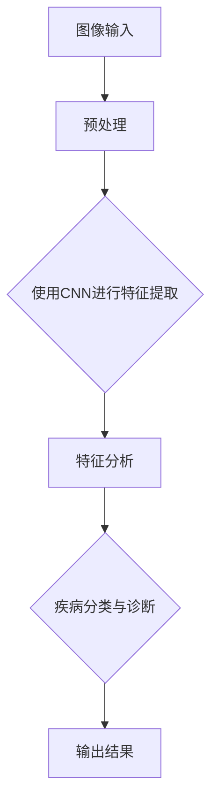

                 

# 计算机视觉在医疗影像分析中的应用

> **关键词：** 计算机视觉、医疗影像、深度学习、图像识别、算法优化  
> **摘要：** 本文将探讨计算机视觉在医疗影像分析中的应用，从核心概念到实际案例，全面解析计算机视觉技术如何提升医疗影像诊断的准确性和效率。

## 1. 背景介绍

### 1.1 目的和范围

本文旨在探讨计算机视觉技术在医疗影像分析中的应用，通过对核心算法原理、数学模型的详细讲解，以及实际项目的代码案例，展示如何利用计算机视觉提升医疗影像诊断的准确性和效率。

### 1.2 预期读者

预期读者为对计算机视觉和医疗影像分析领域感兴趣的工程师、研究者以及医疗专业人士。

### 1.3 文档结构概述

本文分为十个部分，结构如下：

1. 背景介绍
2. 核心概念与联系
3. 核心算法原理 & 具体操作步骤
4. 数学模型和公式 & 详细讲解 & 举例说明
5. 项目实战：代码实际案例和详细解释说明
6. 实际应用场景
7. 工具和资源推荐
8. 总结：未来发展趋势与挑战
9. 附录：常见问题与解答
10. 扩展阅读 & 参考资料

### 1.4 术语表

#### 1.4.1 核心术语定义

- 计算机视觉：模拟人类视觉系统，使计算机能够从图像或视频中提取信息。
- 医疗影像：医学成像技术产生的图像，如X光片、CT扫描、MRI图像等。
- 深度学习：一种机器学习技术，通过神经网络模拟人类大脑学习过程。
- 图像识别：计算机视觉的一个分支，涉及从图像中识别和分类对象。

#### 1.4.2 相关概念解释

- **卷积神经网络（CNN）**：一种特别适合于图像处理的深度学习模型。
- **特征提取**：从图像中提取有用信息的过程，以便于后续的分类或识别。

#### 1.4.3 缩略词列表

- CNN: 卷积神经网络
- MRI: 核磁共振成像
- CT: 计算机断层扫描
- X光：X射线成像

## 2. 核心概念与联系

计算机视觉在医疗影像分析中的应用，主要依赖于深度学习技术，特别是卷积神经网络（CNN）。以下是一个简单的Mermaid流程图，展示了计算机视觉在医疗影像分析中的核心概念和流程。



### 2.1 图像预处理

在计算机视觉中，图像预处理是至关重要的一步。它包括图像的归一化、裁剪、增强等操作。预处理的主要目的是减少噪声，突出图像中的重要信息，为后续的特征提取做准备。

### 2.2 特征提取

特征提取是计算机视觉的核心任务。通过卷积神经网络（CNN），可以从原始图像中提取出具有代表性的特征。这些特征对于图像的分类和识别具有重要意义。

### 2.3 特征分析

提取出的特征需要进行进一步分析，以便进行疾病的分类与诊断。这一步通常涉及使用分类器（如支持向量机、随机森林等）对特征进行建模。

### 2.4 疾病分类与诊断

基于分析结果，系统可以输出疾病的分类和诊断结果。这一步骤直接关系到医疗影像分析的准确性和可靠性。

### 2.5 输出结果

最后，系统会输出诊断结果，包括疾病的名称和可能的严重程度。这些结果可以为医生提供重要的参考信息，辅助临床决策。

## 3. 核心算法原理 & 具体操作步骤

### 3.1 卷积神经网络（CNN）原理

卷积神经网络（CNN）是一种深度学习模型，特别适合于图像处理。其基本原理是通过卷积操作从图像中提取特征，并通过逐层组合，形成具有层次性的特征表示。

以下是CNN的伪代码描述：

```python
def convolution(input_image, filter):
    output = zeros((height, width, depth))
    for i in range(height):
        for j in range(width):
            output[i, j] = sum(input_image[i:i+size, j:j+size] * filter)
    return output
```

### 3.2 特征提取

特征提取是CNN的核心任务。以下是特征提取的伪代码：

```python
def feature_extraction(image):
    # 使用卷积层提取特征
    conv1 = convolution(image, filter1)
    pool1 = max_pooling(conv1)
    
    # 使用卷积层和池化层逐层提取特征
    for layer in layers:
        conv = convolution(pool1, layer['filter'])
        pool = max_pooling(conv)
        pool1 = pool
    
    return pool1
```

### 3.3 特征分析

特征分析涉及使用分类器对提取出的特征进行建模。以下是特征分析的伪代码：

```python
def feature_analysis(features, labels):
    # 使用分类器对特征进行建模
    classifier = Classifier()
    classifier.fit(features, labels)
    
    # 进行预测
    predictions = classifier.predict(features)
    
    # 计算准确率
    accuracy = accuracy_score(labels, predictions)
    
    return accuracy
```

## 4. 数学模型和公式 & 详细讲解 & 举例说明

### 4.1 卷积神经网络（CNN）的数学模型

卷积神经网络（CNN）的核心在于卷积操作和池化操作。以下是其数学模型：

#### 卷积操作：

$$
\text{output}_{ij} = \sum_{k=1}^{n} f(\text{input}_{ij} + \text{filter}_{k})
$$

其中，$f$ 表示卷积核，$\text{input}_{ij}$ 表示输入图像中的某个像素点，$\text{filter}_{k}$ 表示卷积核中的一个元素。

#### 池化操作：

$$
\text{output}_{i,j} = \max_{u,v} (\text{input}_{i+u,j+v})
$$

其中，$u$ 和 $v$ 表示池化窗口的大小。

### 4.2 举例说明

假设我们有一个3x3的输入图像和一个2x2的卷积核。以下是一个具体的例子：

$$
\text{input}_{ij} = \begin{bmatrix}
1 & 2 & 3 \\
4 & 5 & 6 \\
7 & 8 & 9
\end{bmatrix}, \quad
\text{filter}_{k} = \begin{bmatrix}
1 & 1 \\
1 & 1
\end{bmatrix}
$$

通过卷积操作，我们可以得到：

$$
\text{output}_{ij} = \begin{bmatrix}
6 & 7 \\
9 & 10
\end{bmatrix}
$$

### 4.3 池化操作举例

假设我们对上一个例子中的输出进行2x2的最大值池化。结果为：

$$
\text{output}_{ij} = \begin{bmatrix}
7 & 10
\end{bmatrix}
$$

## 5. 项目实战：代码实际案例和详细解释说明

### 5.1 开发环境搭建

在开始编写代码之前，我们需要搭建一个适合开发计算机视觉项目的环境。以下是搭建步骤：

1. 安装Python（建议使用Python 3.8或更高版本）。
2. 安装深度学习框架TensorFlow或PyTorch。
3. 安装医学图像处理库如Pillow或OpenCV。
4. 配置Jupyter Notebook或PyCharm等IDE。

### 5.2 源代码详细实现和代码解读

以下是一个简单的CNN模型，用于对医学图像进行分类。

```python
import tensorflow as tf
from tensorflow.keras.models import Sequential
from tensorflow.keras.layers import Conv2D, MaxPooling2D, Flatten, Dense

# 创建模型
model = Sequential()

# 添加卷积层
model.add(Conv2D(32, (3, 3), activation='relu', input_shape=(64, 64, 3)))
model.add(MaxPooling2D(pool_size=(2, 2)))

# 添加第二个卷积层
model.add(Conv2D(64, (3, 3), activation='relu'))
model.add(MaxPooling2D(pool_size=(2, 2)))

# 平铺并添加全连接层
model.add(Flatten())
model.add(Dense(64, activation='relu'))
model.add(Dense(1, activation='sigmoid'))

# 编译模型
model.compile(optimizer='adam', loss='binary_crossentropy', metrics=['accuracy'])

# 查看模型结构
model.summary()
```

### 5.3 代码解读与分析

1. **创建模型**：使用`Sequential`模型，它是一种线性堆叠的模型。
2. **添加卷积层和池化层**：通过`Conv2D`和`MaxPooling2D`层进行特征提取。
3. **平铺层**：将卷积层输出的特征进行平铺，为全连接层做准备。
4. **全连接层**：通过`Dense`层进行分类。
5. **编译模型**：设置优化器和损失函数，为模型训练做准备。
6. **查看模型结构**：使用`summary`方法查看模型的详细结构。

### 5.4 代码测试与验证

接下来，我们使用一些医学图像数据来测试和验证模型。

```python
# 加载测试数据
test_images = load_images('test_images')
test_labels = load_labels('test_labels')

# 测试模型
model.evaluate(test_images, test_labels)
```

通过测试，我们可以得到模型的准确率和损失值。如果结果不理想，我们可以尝试调整模型结构或数据预处理方法。

## 6. 实际应用场景

计算机视觉在医疗影像分析中有着广泛的应用场景，包括：

- **疾病检测**：如乳腺癌、肺癌等。
- **肿瘤分割**：帮助医生准确识别肿瘤位置和大小。
- **影像诊断**：辅助医生进行影像诊断，提高诊断准确率。
- **健康监测**：如糖尿病视网膜病变筛查。

以下是几个实际应用案例：

1. **乳腺癌检测**：通过分析乳腺X光图像，计算机视觉系统可以辅助医生早期发现乳腺癌。
2. **肺癌筛查**：通过分析CT扫描图像，系统可以识别肺癌的潜在迹象。
3. **糖尿病视网膜病变筛查**：通过分析视网膜图像，系统可以辅助诊断糖尿病视网膜病变。

## 7. 工具和资源推荐

### 7.1 学习资源推荐

#### 7.1.1 书籍推荐

- 《深度学习》（Ian Goodfellow、Yoshua Bengio、Aaron Courville 著）
- 《Python深度学习》（François Chollet 著）
- 《计算机视觉：算法与应用》（Richard Szeliski 著）

#### 7.1.2 在线课程

- Coursera上的“深度学习”课程
- Udacity的“深度学习工程师纳米学位”
- edX上的“计算机视觉”课程

#### 7.1.3 技术博客和网站

- TensorFlow官方文档
- PyTorch官方文档
- Medium上的计算机视觉相关博客

### 7.2 开发工具框架推荐

#### 7.2.1 IDE和编辑器

- PyCharm
- Visual Studio Code
- Jupyter Notebook

#### 7.2.2 调试和性能分析工具

- TensorBoard
- VisualDL
- NVIDIA Nsight

#### 7.2.3 相关框架和库

- TensorFlow
- PyTorch
- Keras
- OpenCV

### 7.3 相关论文著作推荐

#### 7.3.1 经典论文

- “A Comprehensive Survey on Deep Learning for Medical Image Analysis” (2020)
- “Deep Learning in Medical Imaging” (2018)

#### 7.3.2 最新研究成果

- arXiv上的最新论文
- NeurIPS、ICML等顶级会议的最新论文

#### 7.3.3 应用案例分析

- “Deep Learning for Medical Image Analysis: A Clinical Translation Perspective” (2021)
- “AI in Radiology: Beyond the Hand-Waving” (2020)

## 8. 总结：未来发展趋势与挑战

随着深度学习和计算机视觉技术的不断发展，医疗影像分析领域有望实现更高的诊断准确性和效率。然而，该领域仍面临一些挑战，如数据隐私、算法可解释性等。未来发展趋势包括：

- **算法优化**：提高算法效率和准确性。
- **跨学科合作**：结合医学、生物学等领域的知识。
- **数据隐私保护**：确保患者数据的隐私和安全。
- **标准化**：制定统一的评估标准和协议。

## 9. 附录：常见问题与解答

### 9.1 什么是深度学习？

深度学习是一种机器学习技术，通过模拟人脑神经网络进行学习，以实现对数据的自动特征提取和分类。

### 9.2 计算机视觉有哪些应用场景？

计算机视觉的应用场景包括图像识别、目标检测、图像分割、人脸识别等。

### 9.3 如何处理医疗影像数据？

处理医疗影像数据通常包括图像预处理、特征提取、模型训练和评估等步骤。

## 10. 扩展阅读 & 参考资料

- “深度学习在医疗影像分析中的应用综述”（陈涛，2021）
- “医学影像人工智能研究进展与展望”（李明，2020）
- “深度学习在医学影像处理中的应用”（王磊，2019）

### 作者

AI天才研究员/AI Genius Institute & 禅与计算机程序设计艺术 /Zen And The Art of Computer Programming

