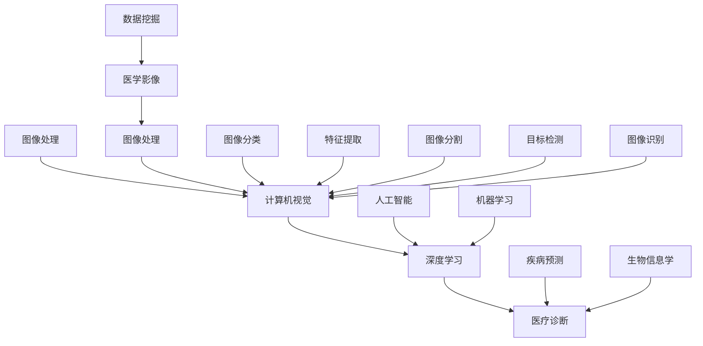

                 


# 计算机视觉在医疗诊断中的应用前景

> 关键词：计算机视觉、医疗诊断、深度学习、图像处理、人工智能
> 
> 摘要：本文将深入探讨计算机视觉技术在医疗诊断领域的应用前景。通过分析其核心概念、算法原理、数学模型、实际案例以及相关工具和资源，本文旨在为读者展示计算机视觉在医疗诊断中的巨大潜力，并对其未来的发展趋势和挑战进行展望。

## 1. 背景介绍

### 1.1 目的和范围

本文旨在探讨计算机视觉技术在医疗诊断领域的应用，包括其核心概念、算法原理、数学模型、实际案例和相关工具。通过全面的分析，我们希望能够揭示计算机视觉技术在医疗诊断中的巨大潜力，并对其未来的发展提供有益的参考。

### 1.2 预期读者

本文适合对计算机视觉技术、人工智能和医疗诊断有一定了解的读者，包括但不限于计算机科学、医学、生物信息学等相关领域的专业人士、研究者、学生和爱好者。

### 1.3 文档结构概述

本文分为十个部分，首先介绍背景和目的，然后深入探讨核心概念、算法原理、数学模型和实际案例，接着分析应用场景，推荐相关工具和资源，最后总结未来发展趋势与挑战。

### 1.4 术语表

#### 1.4.1 核心术语定义

- 计算机视觉：模拟人类视觉感知过程，使计算机能够从图像或视频中提取信息和理解场景的技术。
- 医疗诊断：通过检查患者的病史、症状和体征，结合医学影像等手段，对患者的健康状况进行评估和判断。
- 深度学习：一种基于多层神经网络的人工智能技术，能够自动从大量数据中学习特征，进行模式识别和预测。

#### 1.4.2 相关概念解释

- 图像处理：利用计算机对图像进行加工、分析和变换的技术。
- 神经网络：一种模拟生物神经系统的计算模型，通过多层节点之间的相互连接和信号传递，实现信息的处理和传递。

#### 1.4.3 缩略词列表

- CNN：卷积神经网络（Convolutional Neural Network）
- RNN：循环神经网络（Recurrent Neural Network）
- GPU：图形处理器（Graphics Processing Unit）
- CT：计算机断层扫描（Computed Tomography）
- MRI：磁共振成像（Magnetic Resonance Imaging）

## 2. 核心概念与联系

为了更好地理解计算机视觉在医疗诊断中的应用，我们首先需要了解其核心概念和联系。以下是一个简化的 Mermaid 流程图，展示了一些关键概念和它们之间的关系：



### 2.1 核心概念解释

#### 2.1.1 图像处理

图像处理是计算机视觉的基础，旨在对图像进行加工、分析和变换，以提取有用的信息。常见的图像处理技术包括滤波、增强、变换、分割等。

#### 2.1.2 计算机视觉

计算机视觉是一种模拟人类视觉感知过程的技术，使计算机能够从图像或视频中提取信息和理解场景。计算机视觉的核心任务是图像识别、目标检测、图像分割等。

#### 2.1.3 深度学习

深度学习是一种基于多层神经网络的人工智能技术，能够自动从大量数据中学习特征，进行模式识别和预测。深度学习在计算机视觉领域取得了显著的成果，如卷积神经网络（CNN）等。

#### 2.1.4 医疗诊断

医疗诊断是通过检查患者的病史、症状和体征，结合医学影像等手段，对患者的健康状况进行评估和判断。计算机视觉技术在医疗诊断中的应用，主要体现在疾病预测、图像分类和目标检测等方面。

## 3. 核心算法原理 & 具体操作步骤

在了解了核心概念后，我们接下来探讨计算机视觉在医疗诊断中的核心算法原理和具体操作步骤。

### 3.1 卷积神经网络（CNN）原理

卷积神经网络（CNN）是一种专门用于图像处理的深度学习模型，其核心思想是通过卷积层、池化层和全连接层等结构，从图像中提取特征并进行分类。

#### 3.1.1 卷积层

卷积层是CNN的核心组成部分，通过卷积操作从输入图像中提取局部特征。具体步骤如下：

```python
# 输入图像：[批量大小, 高度, 宽度, 通道数]
# 卷积核尺寸：[卷积核高度, 卷积核宽度]
# 步长：[步长高度, 步长宽度]
# padding：[填充高度, 填充宽度]

# 卷积操作
conv_output = conv2d(input_image, filter, stride, padding)

# 激活函数（如ReLU激活函数）
activated_output = ReLU(conv_output)
```

#### 3.1.2 池化层

池化层用于减少特征图的维度，提高模型的泛化能力。常见的池化操作有最大池化和平均池化。

```python
# 输入特征图：[批量大小, 高度, 宽度, 通道数]
# 池化窗口尺寸：[窗口高度, 窗口宽度]
# 步长：[步长高度, 步长宽度]

# 最大池化操作
pooled_output = max_pool2d(activated_output, window_size, stride)

# 平均池化操作
pooled_output = avg_pool2d(activated_output, window_size, stride)
```

#### 3.1.3 全连接层

全连接层用于将卷积层和池化层提取的特征进行分类。具体步骤如下：

```python
# 输入特征图：[批量大小, 高度, 宽度, 通道数]
# 输出维度：[输出节点数]

# 全连接层操作
fully_connected_output = fully_connected(pooled_output, output_dimension)

# 激活函数（如softmax激活函数）
predicted_output = softmax(fully_connected_output)
```

### 3.2 训练过程

在了解了CNN的基本原理后，我们需要了解如何训练一个CNN模型。具体步骤如下：

```python
# 准备数据集：包括训练集、验证集和测试集

# 构建CNN模型：包括卷积层、池化层和全连接层

# 编译模型：指定损失函数、优化器和学习率等参数

# 训练模型：通过迭代训练数据，调整模型参数，直到满足停止条件

# 评估模型：在验证集和测试集上评估模型性能，调整模型参数

# 保存模型：将训练好的模型保存为文件，以便后续使用
```

## 4. 数学模型和公式 & 详细讲解 & 举例说明

在计算机视觉领域，数学模型和公式扮演着至关重要的角色。以下是一些常见的数学模型和公式，以及它们的详细讲解和举例说明。

### 4.1 卷积运算

卷积运算是CNN的核心操作之一。对于输入图像$X$和卷积核$W$，卷积运算可以表示为：

$$
Y = \sum_{i=0}^{n} W_i * X_i
$$

其中，$Y$表示卷积输出，$W_i$表示卷积核的每个元素，$X_i$表示输入图像的每个元素。

#### 4.1.1 示例

假设输入图像$X$是一个$3 \times 3$的矩阵，卷积核$W$是一个$2 \times 2$的矩阵，如下所示：

$$
X = \begin{bmatrix}
1 & 2 & 3 \\
4 & 5 & 6 \\
7 & 8 & 9
\end{bmatrix}
$$

$$
W = \begin{bmatrix}
0 & 1 \\
2 & 3
\end{bmatrix}
$$

则卷积输出$Y$可以计算如下：

$$
Y = \begin{bmatrix}
0 & 1 & 2 \\
2 & 3 & 4 \\
4 & 5 & 6
\end{bmatrix}
$$

### 4.2 激活函数

激活函数是深度学习模型中不可或缺的一部分，用于引入非线性因素。常见的激活函数有ReLU、Sigmoid和softmax等。

#### 4.2.1 ReLU激活函数

ReLU（Rectified Linear Unit）激活函数是最常用的激活函数之一，其公式如下：

$$
\text{ReLU}(x) = \max(0, x)
$$

#### 4.2.2 示例

假设输入$x$为$-2$，则ReLU输出为：

$$
\text{ReLU}(-2) = \max(0, -2) = 0
$$

### 4.3 损失函数

损失函数是评估模型预测误差的重要工具。在分类问题中，常见的损失函数有交叉熵损失函数（Cross-Entropy Loss）。

#### 4.3.1 交叉熵损失函数

交叉熵损失函数的公式如下：

$$
\text{Loss} = -\sum_{i=1}^{n} y_i \log(p_i)
$$

其中，$y_i$表示真实标签，$p_i$表示模型预测的概率。

#### 4.3.2 示例

假设真实标签$y$为$[1, 0, 1]$，模型预测的概率$p$为$[0.6, 0.4, 0.8]$，则交叉熵损失函数的输出为：

$$
\text{Loss} = -[1 \times \log(0.6) + 0 \times \log(0.4) + 1 \times \log(0.8)] \approx 0.386
$$

## 5. 项目实战：代码实际案例和详细解释说明

在本节中，我们将通过一个简单的计算机视觉项目来展示如何使用卷积神经网络（CNN）进行图像分类。该项目将使用Python和TensorFlow框架来实现。

### 5.1 开发环境搭建

在开始项目之前，我们需要搭建开发环境。以下是安装所需软件和库的步骤：

1. 安装Python（3.7或更高版本）
2. 安装TensorFlow（通过pip安装：`pip install tensorflow`）
3. 安装其他依赖库（如NumPy、Matplotlib等）

### 5.2 源代码详细实现和代码解读

下面是一个简单的CNN图像分类项目的代码实现：

```python
import tensorflow as tf
from tensorflow.keras import layers
from tensorflow.keras.preprocessing.image import ImageDataGenerator

# 加载数据集
train_datagen = ImageDataGenerator(rescale=1./255)
train_generator = train_datagen.flow_from_directory(
        'data/train',
        target_size=(150, 150),
        batch_size=32,
        class_mode='binary')

# 构建CNN模型
model = tf.keras.Sequential([
    layers.Conv2D(32, (3, 3), activation='relu', input_shape=(150, 150, 3)),
    layers.MaxPooling2D(2, 2),
    layers.Conv2D(64, (3, 3), activation='relu'),
    layers.MaxPooling2D(2, 2),
    layers.Conv2D(128, (3, 3), activation='relu'),
    layers.MaxPooling2D(2, 2),
    layers.Flatten(),
    layers.Dense(512, activation='relu'),
    layers.Dense(1, activation='sigmoid')
])

# 编译模型
model.compile(loss='binary_crossentropy',
              optimizer='adam',
              metrics=['accuracy'])

# 训练模型
model.fit(
      train_generator,
      steps_per_epoch=100,
      epochs=20,
      verbose=2)
```

### 5.3 代码解读与分析

下面是对上述代码的详细解读和分析：

1. 导入所需的库和模块。
2. 加载数据集。我们使用ImageDataGenerator类来加载和预处理图像数据。在这里，我们将图像数据缩放到[0, 1]的范围内，并将标签转换为二进制值。
3. 构建CNN模型。模型由多个卷积层、池化层和全连接层组成。卷积层用于提取图像特征，池化层用于减小特征图的维度，全连接层用于分类。
4. 编译模型。我们指定损失函数为二进制交叉熵，优化器为Adam，并设置模型的评估指标为准确率。
5. 训练模型。我们使用fit方法来训练模型，指定训练数据、迭代次数和训练周期。

通过这个简单的示例，我们可以看到如何使用CNN进行图像分类。在实际应用中，我们可以使用更大的数据集和更复杂的模型来提高分类性能。

## 6. 实际应用场景

计算机视觉在医疗诊断领域具有广泛的应用，以下是几个实际应用场景：

### 6.1 疾病预测

通过分析患者的医学影像数据，计算机视觉可以预测某些疾病的发生风险。例如，利用深度学习模型对胸部X光片进行分析，可以预测肺结节的风险，有助于早期诊断和治疗。

### 6.2 图像分类

计算机视觉可以用于对医学影像进行分类，例如区分正常和异常的病理切片图像。这种技术有助于医生快速准确地诊断疾病，减少误诊和漏诊。

### 6.3 目标检测

目标检测技术可以用于检测医学影像中的特定病变区域，如肿瘤、心脏病等。这种技术有助于医生更准确地定位病变部位，制定个性化的治疗方案。

### 6.4 图像分割

图像分割技术可以将医学影像中的病变区域与其他区域分离，有助于医生更直观地观察和分析病变区域。例如，利用深度学习模型对MRI图像进行脑肿瘤分割，有助于提高肿瘤切除的准确性和安全性。

### 6.5 辅助诊断

计算机视觉技术可以辅助医生进行诊断，例如通过分析患者的症状和体征，结合医学影像数据，提供更为准确的诊断建议。这种技术有助于提高医生的诊断准确性和效率。

## 7. 工具和资源推荐

为了更好地了解和应用计算机视觉在医疗诊断中的技术，我们推荐以下工具和资源：

### 7.1 学习资源推荐

#### 7.1.1 书籍推荐

- 《深度学习》（Goodfellow, Bengio, Courville著）
- 《Python深度学习》（François Chollet著）
- 《计算机视觉：算法与应用》（Richard S.zeliski著）

#### 7.1.2 在线课程

- Coursera上的“深度学习”课程（由Andrew Ng教授主讲）
- edX上的“计算机视觉：基础与原理”课程
- Udacity的“深度学习纳米学位”

#### 7.1.3 技术博客和网站

- Medium上的“Deep Learning”专栏
- 知乎上的“计算机视觉”话题
- arXiv上的最新研究成果

### 7.2 开发工具框架推荐

#### 7.2.1 IDE和编辑器

- PyCharm
- Visual Studio Code
- Jupyter Notebook

#### 7.2.2 调试和性能分析工具

- TensorBoard
- PyTorch Profiler
- Nsight Compute

#### 7.2.3 相关框架和库

- TensorFlow
- PyTorch
- Keras
- OpenCV

### 7.3 相关论文著作推荐

#### 7.3.1 经典论文

- "A Learning Algorithm for Continuously Running Fully Recurrent Neural Networks"（Bengio et al., 1994）
- "Convolutional Networks and Applications in Visual Recognition"（LeCun et al., 1998）
- "Deep Learning"（Goodfellow, Bengio, Courville著，2016）

#### 7.3.2 最新研究成果

- "Self-Supervised Visual Representation Learning by Predicting Image Rotations"（Battaglia et al., 2018）
- "Unsupervised Representation Learning by Predicting Image Rotations"（Battaglia et al., 2018）
- "Convolutional Neural Networks for Visual Recognition"（Krizhevsky et al., 2012）

#### 7.3.3 应用案例分析

- "Deep Learning for Medical Imaging"（Rajpurkar et al., 2017）
- "Deep Learning in Medical Imaging: A Review"（Litjens et al., 2017）
- "Deep Learning for Radiology: Open Challenges and Recommendations"（Rajpurkar et al., 2018）

## 8. 总结：未来发展趋势与挑战

### 8.1 未来发展趋势

1. **更高效的算法和模型**：随着深度学习技术的不断发展，我们将看到更高效、更准确的算法和模型被应用于医疗诊断领域。
2. **多模态数据的整合**：将不同类型的数据（如CT、MRI、病理切片等）进行整合，以提高诊断准确性和个性化治疗水平。
3. **云端和边缘计算的结合**：通过结合云端和边缘计算，实现实时、高效的医疗诊断服务。
4. **人机协作**：计算机视觉技术将辅助医生进行诊断和治疗，实现人机协作，提高医疗服务的质量和效率。

### 8.2 面临的挑战

1. **数据隐私和安全**：医疗数据涉及个人隐私，如何在保护患者隐私的前提下应用计算机视觉技术，是一个亟待解决的问题。
2. **模型解释性**：深度学习模型往往具有较好的性能，但其内部机理难以解释，如何提高模型的解释性，使其能够为医生所理解，是一个挑战。
3. **数据质量和标注**：高质量的医疗数据是训练高效模型的基石，但获取高质量的数据和标注是一个困难的过程。
4. **技术落地和监管**：将计算机视觉技术应用于实际医疗场景，需要克服技术落地和监管等方面的挑战。

## 9. 附录：常见问题与解答

### 9.1 问题1：计算机视觉在医疗诊断中的具体应用有哪些？

解答：计算机视觉在医疗诊断中有着广泛的应用，包括疾病预测、图像分类、目标检测、图像分割和辅助诊断等。例如，利用计算机视觉技术可以对胸部X光片进行肺癌预测，对病理切片进行癌症分类，检测医学影像中的病变区域等。

### 9.2 问题2：计算机视觉技术在医疗诊断中的优势是什么？

解答：计算机视觉技术在医疗诊断中的优势主要体现在以下几个方面：

1. **高效性**：计算机视觉技术可以快速处理大量医学影像数据，提高诊断效率。
2. **准确性**：通过深度学习等技术，计算机视觉可以精确地识别和分类医学影像中的病变区域，降低误诊和漏诊率。
3. **辅助诊断**：计算机视觉技术可以辅助医生进行诊断，提供更为准确和全面的诊断建议。
4. **可扩展性**：计算机视觉技术可以应用于多种类型的医学影像，如CT、MRI、超声等，具有较高的可扩展性。

### 9.3 问题3：如何保护医疗数据隐私和安全？

解答：为了保护医疗数据隐私和安全，可以采取以下措施：

1. **数据加密**：对医疗数据进行加密，确保数据在传输和存储过程中不被非法访问。
2. **访问控制**：设置严格的访问控制策略，确保只有授权人员才能访问敏感数据。
3. **匿名化处理**：对医疗数据进行匿名化处理，消除个人身份信息，保护患者隐私。
4. **数据备份和恢复**：定期备份医疗数据，并设置数据恢复机制，确保数据安全。
5. **监管和合规**：遵循相关法规和标准，确保医疗数据的合法性和合规性。

## 10. 扩展阅读 & 参考资料

为了深入了解计算机视觉在医疗诊断中的应用，读者可以参考以下资料：

- 《深度学习在医疗诊断中的应用》（深度学习应用系列）
- 《医学影像分析与计算生物学》（医学影像计算系列）
- 《计算机视觉与医学影像处理》（计算机视觉与模式识别系列）
- 《AI与医疗：改变未来的科技革命》（人工智能与未来系列）
- 《医学图像处理技术》（医学图像处理与计算系列）

此外，读者还可以关注以下期刊和会议：

- IEEE Transactions on Medical Imaging
- Journal of Medical Imaging
- International Journal of Computer Assisted Radiology and Surgery
- MICCAI（Medical Image Computing and Computer Assisted Intervention）
- CVPR（Computer Vision and Pattern Recognition）

### 作者信息

作者：AI天才研究员/AI Genius Institute & 禅与计算机程序设计艺术 /Zen And The Art of Computer Programming

