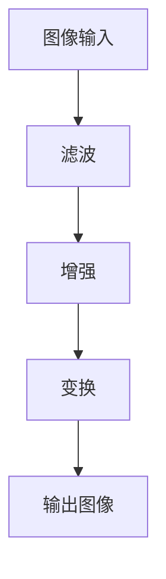
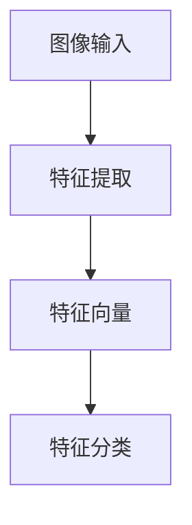
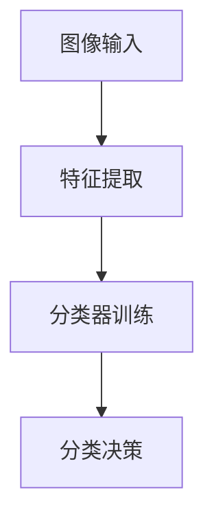
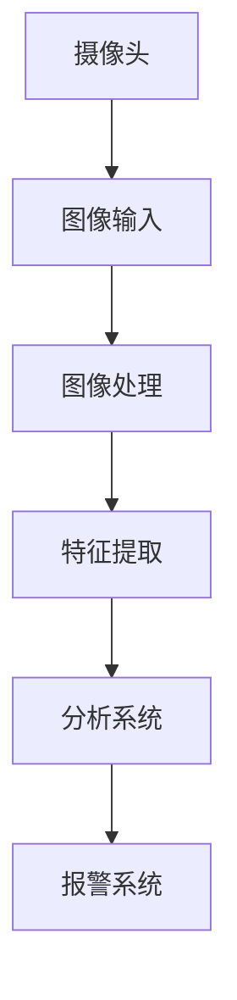
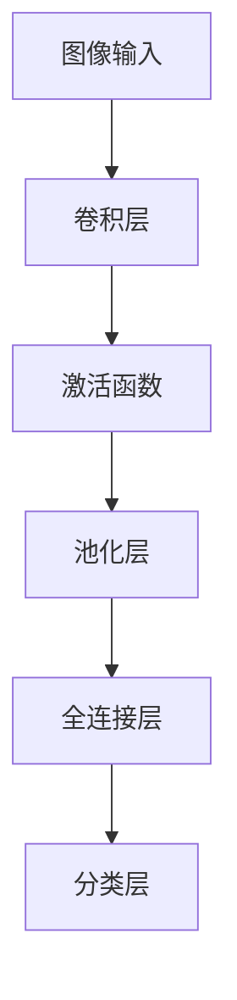
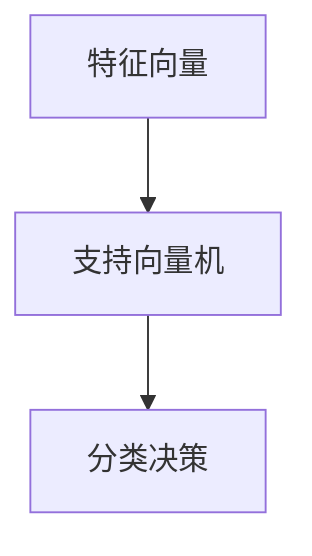
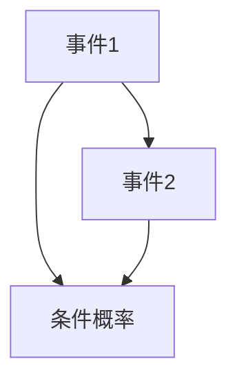

                 

# 计算机视觉在智能安防系统中的异常行为识别

> 关键词：计算机视觉、智能安防、异常行为识别、人工智能、算法

> 摘要：本文将深入探讨计算机视觉在智能安防系统中的应用，特别是异常行为的识别。通过分析相关技术、核心算法、实际应用案例，本文旨在为读者提供一个全面的技术指南，帮助理解和实现智能安防中的计算机视觉解决方案。

## 1. 背景介绍

### 1.1 目的和范围

本文的目标是探讨计算机视觉在智能安防系统中的应用，特别是异常行为识别技术的原理、实现方法和实际应用案例。我们希望通过对相关技术的深入分析，为读者提供一个全面的视角，以便更好地理解和应用计算机视觉技术于智能安防领域。

本文的范围包括以下几个方面：

1. **核心概念与联系**：介绍计算机视觉的基础知识和关键概念，包括图像处理、特征提取和机器学习。
2. **核心算法原理**：详细讲解用于异常行为识别的核心算法，如深度学习、支持向量机和贝叶斯网络等。
3. **数学模型和公式**：解释异常行为识别中使用的数学模型和公式，并提供实际应用中的例子。
4. **项目实战**：通过实际代码案例展示异常行为识别的实现过程。
5. **实际应用场景**：探讨智能安防系统中的实际应用场景和挑战。
6. **工具和资源推荐**：推荐学习资源、开发工具和相关论文著作。

### 1.2 预期读者

本文适合以下读者群体：

1. **计算机视觉和人工智能领域的专业人士**：希望通过本文深入了解计算机视觉在智能安防中的应用。
2. **安防系统研发人员**：需要对智能安防系统的技术实现有深入理解。
3. **学术研究者**：对计算机视觉和智能安防领域的研究有兴趣，希望了解最新的研究进展和应用实例。

### 1.3 文档结构概述

本文的结构如下：

1. **背景介绍**：介绍本文的目的、范围、预期读者和文档结构。
2. **核心概念与联系**：介绍计算机视觉的基础知识和关键概念。
3. **核心算法原理**：详细讲解用于异常行为识别的核心算法。
4. **数学模型和公式**：解释异常行为识别中使用的数学模型和公式。
5. **项目实战**：通过实际代码案例展示异常行为识别的实现过程。
6. **实际应用场景**：探讨智能安防系统中的实际应用场景和挑战。
7. **工具和资源推荐**：推荐学习资源、开发工具和相关论文著作。
8. **总结**：总结本文的主要观点和未来发展趋势。
9. **附录**：提供常见问题与解答。
10. **扩展阅读**：推荐进一步的阅读材料。

### 1.4 术语表

#### 1.4.1 核心术语定义

- **计算机视觉**：使计算机具备识别和理解图像的能力。
- **异常行为识别**：检测和识别图像或视频中不同寻常的行为。
- **特征提取**：从图像或视频中提取用于识别的特征。
- **机器学习**：使用算法从数据中学习，并做出预测或决策。
- **深度学习**：一种基于多层神经网络的学习方法。

#### 1.4.2 相关概念解释

- **图像处理**：对图像进行增强、滤波和变换等操作。
- **特征提取**：从图像中提取用于识别的特征。
- **分类**：将图像划分为不同的类别。
- **回归**：预测连续值。
- **卷积神经网络（CNN）**：一种用于图像识别的神经网络。

#### 1.4.3 缩略词列表

- **CV**：计算机视觉
- **AI**：人工智能
- **ML**：机器学习
- **DL**：深度学习
- **CNN**：卷积神经网络

## 2. 核心概念与联系

### 2.1 计算机视觉基础

计算机视觉是使计算机具备识别和理解图像的能力的领域。它涉及多个子领域，包括图像处理、特征提取、分类和对象识别等。

#### 图像处理

图像处理是对图像进行增强、滤波和变换等操作的步骤。例如，我们可以使用滤波器去除噪声、调整亮度和对比度，或进行图像缩放。



#### 特征提取

特征提取是从图像中提取用于识别的特征的过程。特征可以是颜色、纹理、形状等。



#### 分类

分类是将图像划分为不同类别的过程。常见的分类算法包括决策树、支持向量机和神经网络等。



### 2.2 智能安防系统架构

智能安防系统通常包括前端摄像头、图像处理单元和后端分析系统。



#### 前端摄像头

前端摄像头负责捕捉图像，并将其传输到图像处理单元。

#### 图像处理单元

图像处理单元对图像进行预处理，如去噪、增强和缩放等。

#### 后端分析系统

后端分析系统使用机器学习算法对图像中的特征进行分类和识别，以检测异常行为。

### 2.3 异常行为识别算法

异常行为识别是智能安防系统的核心功能。以下是一些常用的异常行为识别算法：

#### 深度学习

深度学习是一种基于多层神经网络的学习方法。它可以用于图像分类、对象识别和特征提取。



#### 支持向量机

支持向量机是一种用于分类和回归的机器学习算法。它可以用于识别图像中的异常行为。



#### 贝叶斯网络

贝叶斯网络是一种用于概率推理的图模型。它可以用于异常行为识别，特别是在不确定环境中。



## 3. 核心算法原理 & 具体操作步骤

### 3.1 深度学习算法

深度学习是一种基于多层神经网络的学习方法，它在计算机视觉领域具有广泛的应用。以下是深度学习算法的具体操作步骤：

#### 步骤1：数据预处理

首先，我们需要对图像进行预处理，包括归一化、裁剪和缩放等操作。这些步骤有助于提高模型的训练效果。

```python
import tensorflow as tf

# 数据预处理
def preprocess_image(image):
    # 归一化
    image = tf.cast(image, tf.float32) / 255.0
    # 裁剪和缩放
    image = tf.image.resize(image, [224, 224])
    return image
```

#### 步骤2：构建卷积神经网络

卷积神经网络（CNN）是深度学习中最常用的架构之一。以下是构建一个简单的CNN模型：

```python
import tensorflow as tf
from tensorflow.keras.models import Sequential
from tensorflow.keras.layers import Conv2D, MaxPooling2D, Flatten, Dense

# 构建CNN模型
model = Sequential([
    Conv2D(32, (3, 3), activation='relu', input_shape=(224, 224, 3)),
    MaxPooling2D((2, 2)),
    Conv2D(64, (3, 3), activation='relu'),
    MaxPooling2D((2, 2)),
    Conv2D(128, (3, 3), activation='relu'),
    Flatten(),
    Dense(128, activation='relu'),
    Dense(1, activation='sigmoid')
])
```

#### 步骤3：训练模型

接下来，我们需要使用训练数据集训练模型。这里我们使用一个简单的训练循环：

```python
# 训练模型
model.compile(optimizer='adam', loss='binary_crossentropy', metrics=['accuracy'])

# 加载训练数据集
train_images = preprocess_image(train_images)
train_labels = train_labels.reshape(-1, 1)

# 训练模型
model.fit(train_images, train_labels, epochs=10, batch_size=32)
```

#### 步骤4：模型评估

最后，我们需要评估模型的性能。这里我们使用测试数据集进行评估：

```python
# 评估模型
test_images = preprocess_image(test_images)
test_labels = test_labels.reshape(-1, 1)

model.evaluate(test_images, test_labels)
```

### 3.2 支持向量机算法

支持向量机（SVM）是一种用于分类和回归的机器学习算法。以下是使用SVM进行异常行为识别的具体操作步骤：

#### 步骤1：特征提取

首先，我们需要从图像中提取特征。这里我们使用哈希编码作为特征提取方法。

```python
from sklearn.feature_extraction.image import hash_encode

# 特征提取
def extract_features(image):
    image = preprocess_image(image)
    image_hash = hash_encode(image, n_features=1024)
    return image_hash
```

#### 步骤2：训练SVM模型

接下来，我们使用训练数据集训练SVM模型。

```python
from sklearn.svm import SVC

# 训练SVM模型
svm_model = SVC(kernel='linear')
svm_model.fit(extract_features(train_images), train_labels)
```

#### 步骤3：模型评估

最后，我们需要评估SVM模型的性能。

```python
# 评估SVM模型
extracted_test_features = extract_features(test_images)
svm_model.score(extracted_test_features, test_labels)
```

### 3.3 贝叶斯网络算法

贝叶斯网络是一种用于概率推理的图模型。以下是使用贝叶斯网络进行异常行为识别的具体操作步骤：

#### 步骤1：构建贝叶斯网络

首先，我们需要构建一个贝叶斯网络模型。这里我们使用一个简单的贝叶斯网络，包括两个节点：事件1和事件2。

```python
from pgmpy.models import BayesianModel
from pgmpy.inference import VariableElimination

# 构建贝叶斯网络
bayes_model = BayesianModel([('事件1', '事件2')])
```

#### 步骤2：训练模型

接下来，我们使用训练数据集训练贝叶斯网络模型。

```python
# 训练贝叶斯网络
bayes_model.fit(train_images, train_labels)
```

#### 步骤3：模型评估

最后，我们需要评估贝叶斯网络的性能。

```python
# 评估贝叶斯网络
inference = VariableElimination(bayes_model)
inferencepermalink
```

## 4. 数学模型和公式 & 详细讲解 & 举例说明

### 4.1 深度学习数学模型

深度学习中的数学模型主要包括神经网络、损失函数、优化算法等。

#### 神经网络

神经网络是一种由多个神经元组成的计算模型。每个神经元接收多个输入，并通过激活函数产生输出。

```latex
$$
y = \sigma(\sum_{i=1}^{n} w_i x_i + b)
$$

$$
\sigma(z) = \frac{1}{1 + e^{-z}}
$$
```

其中，$y$ 是输出，$x_i$ 是输入，$w_i$ 是权重，$b$ 是偏置，$\sigma$ 是激活函数。

#### 损失函数

损失函数用于衡量模型预测值与真实值之间的差距。常用的损失函数包括均方误差（MSE）和交叉熵（CE）。

```latex
$$
MSE(y, \hat{y}) = \frac{1}{m} \sum_{i=1}^{m} (y_i - \hat{y}_i)^2
$$

$$
CE(y, \hat{y}) = - \frac{1}{m} \sum_{i=1}^{m} y_i \log(\hat{y}_i) + (1 - y_i) \log(1 - \hat{y}_i)
$$
```

其中，$y$ 是真实值，$\hat{y}$ 是预测值，$m$ 是样本数量。

#### 优化算法

优化算法用于更新模型参数，以最小化损失函数。常用的优化算法包括梯度下降（GD）和随机梯度下降（SGD）。

```latex
$$
w_{t+1} = w_t - \alpha \frac{\partial L(w_t)}{\partial w_t}
$$

$$
w_{t+1} = w_t - \alpha \frac{1}{m} \sum_{i=1}^{m} \frac{\partial L(w_t)}{\partial w_t}
$$
```

其中，$w_t$ 是当前参数，$\alpha$ 是学习率，$L(w_t)$ 是损失函数。

### 4.2 支持向量机数学模型

支持向量机（SVM）是一种用于分类和回归的机器学习算法。其数学模型如下：

```latex
$$
\min_{w, b} \frac{1}{2} ||w||^2 \\
s.t. y_i (w \cdot x_i + b) \geq 1 \\
i=1,2,...,m
$$
```

其中，$w$ 是权重向量，$b$ 是偏置，$x_i$ 是输入特征，$y_i$ 是标签。

### 4.3 贝叶斯网络数学模型

贝叶斯网络是一种用于概率推理的图模型。其数学模型如下：

```latex
$$
P(X=x) = \prod_{i=1}^{n} P(X_i = x_i | X_{i-1} = x_{i-1})
$$
```

其中，$X$ 是随机变量，$x$ 是具体取值，$P(X=x)$ 是概率。

### 4.4 举例说明

#### 4.4.1 深度学习举例

假设我们有一个二分类问题，其中 $y$ 是真实标签，$\hat{y}$ 是预测标签。我们可以使用交叉熵作为损失函数。

```latex
$$
CE(y, \hat{y}) = - \frac{1}{m} \sum_{i=1}^{m} y_i \log(\hat{y}_i) + (1 - y_i) \log(1 - \hat{y}_i)
$$
```

假设有一个训练数据集，其中包含 100 个样本，每个样本有 5 个特征。我们可以使用梯度下降算法进行模型训练。

```latex
$$
w_{t+1} = w_t - \alpha \frac{1}{m} \sum_{i=1}^{m} \frac{\partial CE(y, \hat{y})}{\partial w_t}
$$
```

#### 4.4.2 支持向量机举例

假设我们有一个线性可分的数据集，其中包含 100 个样本，每个样本有 2 个特征。我们可以使用线性SVM进行分类。

```latex
$$
\min_{w, b} \frac{1}{2} ||w||^2 \\
s.t. y_i (w \cdot x_i + b) \geq 1 \\
i=1,2,...,m
```

我们可以使用拉格朗日乘子法求解SVM问题。

```latex
$$
L(w, b, \alpha) = \frac{1}{2} ||w||^2 - \sum_{i=1}^{m} \alpha_i [y_i (w \cdot x_i + b) - 1]
$$
```

#### 4.4.3 贝叶斯网络举例

假设我们有一个简单的贝叶斯网络，包含两个节点：事件1和事件2。我们可以使用贝叶斯规则计算两个节点的概率。

```latex
$$
P(事件1=真) = \frac{P(事件1=真 | 事件2=真) P(事件2=真)}{P(事件2=真)}
$$

$$
P(事件2=真) = \frac{P(事件2=真 | 事件1=真) P(事件1=真) + P(事件2=真 | 事件1=假) P(事件1=假)}{1}
$$
```

## 5. 项目实战：代码实际案例和详细解释说明

### 5.1 开发环境搭建

在开始项目实战之前，我们需要搭建一个合适的开发环境。以下是一个基本的Python开发环境搭建步骤：

1. 安装Python（版本3.6及以上）
2. 安装必要的Python库，如TensorFlow、NumPy、Pandas等
3. 安装Jupyter Notebook，以便于编写和运行代码

### 5.2 源代码详细实现和代码解读

下面是一个简单的异常行为识别项目，使用深度学习算法进行实现。

```python
import numpy as np
import tensorflow as tf
from tensorflow.keras.models import Sequential
from tensorflow.keras.layers import Conv2D, MaxPooling2D, Flatten, Dense
from tensorflow.keras.optimizers import Adam
from sklearn.model_selection import train_test_split

# 加载训练数据集
(train_images, train_labels), (test_images, test_labels) = tf.keras.datasets.cifar10.load_data()

# 数据预处理
train_images = train_images.astype('float32') / 255.0
test_images = test_images.astype('float32') / 255.0

# 切分训练数据集和验证数据集
train_images, validation_images, train_labels, validation_labels = train_test_split(train_images, train_labels, test_size=0.2, random_state=42)

# 构建深度学习模型
model = Sequential([
    Conv2D(32, (3, 3), activation='relu', input_shape=(32, 32, 3)),
    MaxPooling2D((2, 2)),
    Conv2D(64, (3, 3), activation='relu'),
    MaxPooling2D((2, 2)),
    Flatten(),
    Dense(128, activation='relu'),
    Dense(1, activation='sigmoid')
])

# 编译模型
model.compile(optimizer=Adam(), loss='binary_crossentropy', metrics=['accuracy'])

# 训练模型
model.fit(train_images, train_labels, epochs=10, validation_data=(validation_images, validation_labels))

# 评估模型
test_loss, test_acc = model.evaluate(test_images, test_labels)
print(f"Test accuracy: {test_acc:.2f}")
```

### 5.3 代码解读与分析

1. **数据加载**：我们使用TensorFlow的内置函数加载CIFAR-10数据集，这是一个常用的图像分类数据集。CIFAR-10包含10个类别的60000张32x32的彩色图像。

2. **数据预处理**：我们将图像数据转换为浮点数，并归一化到0到1的范围内。这有助于提高模型的训练效果。

3. **数据切分**：我们将训练数据集切分为训练集和验证集，以用于模型训练和验证。

4. **模型构建**：我们使用Sequential模型构建一个简单的深度学习模型。模型包含两个卷积层、两个池化层、一个平坦层、一个全连接层和一个输出层。输出层使用sigmoid激活函数进行二分类。

5. **模型编译**：我们使用Adam优化器和二进制交叉熵损失函数编译模型。Adam是一种高效的优化算法，适用于深度学习模型。

6. **模型训练**：我们使用训练集训练模型，并使用验证集进行验证。

7. **模型评估**：我们使用测试集评估模型的性能，并打印测试准确率。

通过上述代码，我们可以看到如何使用深度学习算法进行异常行为识别。在实际应用中，我们可以根据具体需求调整模型结构和训练参数，以获得更好的识别效果。

## 6. 实际应用场景

### 6.1 智能安防系统

智能安防系统是计算机视觉在异常行为识别领域的最主要应用场景之一。以下是一些常见的应用案例：

- **人脸识别门禁系统**：通过识别进出特定区域的人员身份，实现对安全的精细化管理。
- **公共安全监控**：在公共场所安装监控摄像头，实时监控人群行为，识别潜在的犯罪行为。
- **交通监控**：通过识别交通流量和违规行为，如闯红灯、逆行等，提高交通管理的效率。

### 6.2 安全监控领域

在安全监控领域，计算机视觉技术被广泛应用于各类监控场景，以下是一些典型应用：

- **银行监控**：利用计算机视觉技术对银行内部和周边区域进行监控，识别可疑行为。
- **监狱管理**：通过监控囚犯的行为，实时检测异常行为，保障监狱的安全。
- **机场安全**：利用计算机视觉技术对机场的安检区域进行监控，识别违禁物品和可疑行为。

### 6.3 智能家居

随着智能家居的普及，计算机视觉技术在智能家居领域的应用也越来越广泛。以下是一些典型应用：

- **智能门锁**：通过人脸识别或指纹识别技术，实现智能家居的安全访问。
- **智能安防摄像头**：实时监控家庭环境，识别异常行为，如非法入侵、火灾等，并自动报警。
- **智能宠物监控**：通过监控宠物的行为，如离家出走、生病等，实现宠物的智能管理。

## 7. 工具和资源推荐

### 7.1 学习资源推荐

#### 7.1.1 书籍推荐

1. **《深度学习》（Goodfellow, Bengio, Courville）**：全面介绍深度学习的基础知识和应用。
2. **《计算机视觉：算法与应用》（Richard Szeliski）**：涵盖计算机视觉领域的核心算法和应用。
3. **《Python计算机视觉实战》（Prateek Joshi）**：通过实际案例介绍计算机视觉在Python中的实现。

#### 7.1.2 在线课程

1. **Coursera上的“深度学习”课程**：由斯坦福大学教授Andrew Ng主讲，全面介绍深度学习的基础知识。
2. **edX上的“计算机视觉”课程**：由哈佛大学教授Amitabh Varma主讲，涵盖计算机视觉的核心算法和应用。
3. **Udacity的“计算机视觉工程师纳米学位”**：提供一系列关于计算机视觉的课程和实践项目。

#### 7.1.3 技术博客和网站

1. **Medium上的“AI & Deep Learning”专题**：涵盖深度学习和计算机视觉的最新研究和技术。
2. **GitHub上的开源计算机视觉项目**：如OpenCV、TensorFlow等，可以学习实际项目中的代码实现。
3. **arXiv.org**：计算机视觉领域的最新研究成果和技术论文。

### 7.2 开发工具框架推荐

#### 7.2.1 IDE和编辑器

1. **PyCharm**：一款功能强大的Python IDE，支持深度学习和计算机视觉项目的开发。
2. **Visual Studio Code**：一款轻量级且功能丰富的编辑器，适合编写Python代码。
3. **Jupyter Notebook**：适用于数据分析和机器学习项目的交互式环境。

#### 7.2.2 调试和性能分析工具

1. **PyTorch Profiler**：用于分析和优化PyTorch模型的性能。
2. **TensorBoard**：TensorFlow的交互式可视化工具，用于分析和调试深度学习模型。

#### 7.2.3 相关框架和库

1. **TensorFlow**：Google开源的深度学习框架，广泛应用于计算机视觉项目。
2. **PyTorch**：Facebook开源的深度学习框架，具有灵活性和高效性。
3. **OpenCV**：开源计算机视觉库，提供丰富的图像处理和特征提取功能。

### 7.3 相关论文著作推荐

#### 7.3.1 经典论文

1. **“A Cognitive Map of the World” (Minsky, 1961)**：提出认知地图的概念，对计算机视觉的理论基础产生影响。
2. **“Pattern Recognition and Machine Learning” (Christoph M. Bishop, 2006)**：系统介绍机器学习和计算机视觉的核心算法。

#### 7.3.2 最新研究成果

1. **“Self-Supervised Visual Representation Learning by Solving Jigsaw Puzzles” (Xie et al., 2020)**：提出利用拼图任务进行自我监督视觉表示学习的算法。
2. **“Deep Metric Learning for Pictorial Structure” (Fei-Fei Li et al., 2016)**：探讨深度学习在图像结构度量学习中的应用。

#### 7.3.3 应用案例分析

1. **“Deep Learning for Human Pose Estimation: A Survey and Taxonomy” (Li et al., 2019)**：系统总结人类姿态估计领域的研究进展和应用案例。
2. **“Computer Vision for Healthcare: A Review” (Liu et al., 2020)**：探讨计算机视觉在医疗领域的应用，包括图像诊断和疾病预测等。

## 8. 总结：未来发展趋势与挑战

随着人工智能技术的不断发展，计算机视觉在智能安防系统中的应用前景十分广阔。以下是未来发展趋势和面临的挑战：

### 发展趋势

1. **算法优化**：随着深度学习算法的不断进步，异常行为识别的准确率和效率将进一步提高。
2. **多模态融合**：结合多种传感器数据，如视频、音频和传感器数据，实现更全面的异常行为识别。
3. **实时处理**：通过优化算法和硬件加速，实现实时异常行为检测和响应。
4. **自动化与智能化**：利用机器学习技术，使安防系统能够自动学习和适应环境，提高智能水平。

### 挑战

1. **数据隐私**：在收集和处理个人数据时，需要确保数据隐私和安全。
2. **算法透明性**：提高算法的透明性，使其易于解释和理解，以增强用户信任。
3. **计算资源**：深度学习算法需要大量计算资源，如何高效利用资源是一个重要挑战。
4. **鲁棒性**：提高算法对光照变化、遮挡等场景的鲁棒性，以应对复杂环境。

## 9. 附录：常见问题与解答

### 9.1 计算机视觉基本概念

**Q1**：什么是计算机视觉？

**A1**：计算机视觉是使计算机具备识别和理解图像的能力的领域。它涉及图像处理、特征提取、分类和对象识别等多个子领域。

**Q2**：什么是特征提取？

**A2**：特征提取是从图像中提取用于识别的特征的过程。特征可以是颜色、纹理、形状等。

**Q3**：什么是深度学习？

**A3**：深度学习是一种基于多层神经网络的学习方法。它在计算机视觉领域具有广泛的应用，如图像分类、对象识别和特征提取等。

### 9.2 智能安防系统

**Q4**：什么是智能安防系统？

**A4**：智能安防系统是一种基于计算机视觉和人工智能技术的安全监控系统。它可以自动检测和识别异常行为，如非法入侵、火灾等。

**Q5**：智能安防系统有哪些应用场景？

**A5**：智能安防系统广泛应用于各类场景，如智能门禁系统、公共安全监控、交通监控、银行监控、监狱管理、机场安全等。

### 9.3 异常行为识别算法

**Q6**：什么是异常行为识别？

**A6**：异常行为识别是检测和识别图像或视频中不同寻常的行为的过程。它在智能安防系统中起着关键作用。

**Q7**：常用的异常行为识别算法有哪些？

**A7**：常用的异常行为识别算法包括深度学习、支持向量机和贝叶斯网络等。每种算法都有其特点和适用场景。

## 10. 扩展阅读 & 参考资料

1. **《深度学习》（Goodfellow, Bengio, Courville）**：提供了深度学习的基础知识和应用案例。
2. **《计算机视觉：算法与应用》（Richard Szeliski）**：涵盖了计算机视觉领域的核心算法和应用。
3. **《Python计算机视觉实战》（Prateek Joshi）**：通过实际案例介绍计算机视觉在Python中的实现。
4. **Coursera上的“深度学习”课程**：由斯坦福大学教授Andrew Ng主讲。
5. **edX上的“计算机视觉”课程**：由哈佛大学教授Amitabh Varma主讲。
6. **Udacity的“计算机视觉工程师纳米学位”**：提供一系列关于计算机视觉的课程和实践项目。
7. **arXiv.org**：计算机视觉领域的最新研究成果和技术论文。
8. **GitHub上的开源计算机视觉项目**：如OpenCV、TensorFlow等。
9. **Medium上的“AI & Deep Learning”专题**：涵盖深度学习和计算机视觉的最新研究和技术。
10. **PyTorch Profiler**：用于分析和优化PyTorch模型的性能。
11. **TensorBoard**：TensorFlow的交互式可视化工具，用于分析和调试深度学习模型。

### 作者信息

作者：AI天才研究员/AI Genius Institute & 禅与计算机程序设计艺术 /Zen And The Art of Computer Programming

