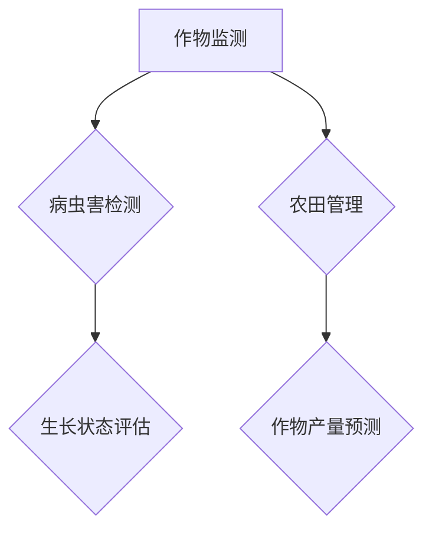

                 


# 计算机视觉在自动化农业中的实践

> **关键词：** 计算机视觉、自动化农业、图像识别、深度学习、作物监测、精准农业
> 
> **摘要：** 本文将探讨计算机视觉技术在自动化农业领域的应用，详细分析其在作物监测、病虫害检测、生长状态评估等方面的具体实践，并结合实际案例介绍相关算法原理、实现步骤和未来发展趋势。通过本文，读者将深入了解计算机视觉在现代农业中的重要作用，及其为实现精准农业带来的变革。

## 1. 背景介绍

### 1.1 目的和范围

本文旨在探讨计算机视觉技术在自动化农业中的应用，重点分析其在作物监测、病虫害检测、生长状态评估等方面的具体实践。我们将结合实际案例，详细讲解相关算法原理、实现步骤和技术挑战，旨在为农业领域的从业者提供有价值的参考。

### 1.2 预期读者

本文适合对计算机视觉和自动化农业感兴趣的技术人员、研究人员以及农业从业者阅读。文章将尽量使用通俗易懂的语言，但涉及部分专业术语，读者可能需要对相关领域有一定的了解。

### 1.3 文档结构概述

本文结构如下：

1. 背景介绍：简要介绍计算机视觉在自动化农业中的重要性。
2. 核心概念与联系：介绍计算机视觉在自动化农业中的应用场景和核心概念。
3. 核心算法原理 & 具体操作步骤：讲解计算机视觉算法的基本原理和实现步骤。
4. 数学模型和公式 & 详细讲解 & 举例说明：介绍与计算机视觉相关的数学模型和公式，并给出实例说明。
5. 项目实战：分析一个具体的项目案例，展示计算机视觉技术在自动化农业中的应用。
6. 实际应用场景：探讨计算机视觉技术在农业领域的广泛应用。
7. 工具和资源推荐：推荐相关学习资源、开发工具和框架。
8. 总结：展望计算机视觉在自动化农业领域的未来发展趋势与挑战。
9. 附录：常见问题与解答。
10. 扩展阅读 & 参考资料：提供进一步学习的资料。

### 1.4 术语表

#### 1.4.1 核心术语定义

- **计算机视觉**：使计算机能够像人类一样理解和解释视觉信息的技术。
- **自动化农业**：利用现代信息技术和自动化设备实现农业生产过程的自动化。
- **作物监测**：利用计算机视觉技术对作物生长状况进行监测和分析。
- **病虫害检测**：利用计算机视觉技术对作物病虫害进行识别和检测。
- **精准农业**：根据农田的实际情况，实现作物种植、施肥、灌溉等环节的精准管理。

#### 1.4.2 相关概念解释

- **深度学习**：一种人工智能技术，通过构建具有多个隐藏层的神经网络模型，模拟人类大脑的决策过程，从而实现对复杂数据的分析和解释。
- **图像识别**：利用计算机视觉技术对图像中的对象进行识别和分类。
- **卷积神经网络（CNN）**：一种基于卷积运算的神经网络模型，广泛用于图像识别和图像处理任务。

#### 1.4.3 缩略词列表

- **AI**：人工智能（Artificial Intelligence）
- **CNN**：卷积神经网络（Convolutional Neural Network）
- **DNN**：深度神经网络（Deep Neural Network）
- **GAN**：生成对抗网络（Generative Adversarial Network）
- **RGB**：红绿蓝（Red, Green, Blue）

## 2. 核心概念与联系

计算机视觉在自动化农业中的应用场景丰富多样，下面我们将通过一个Mermaid流程图来展示其核心概念和联系。



### 2.1 作物监测

作物监测是计算机视觉在自动化农业中的首要应用场景。通过图像识别和深度学习技术，可以实现对作物生长状态的实时监测。具体流程如下：

1. **图像采集**：利用无人机、摄像头等设备，对农田进行图像采集。
2. **图像预处理**：对采集到的图像进行降噪、去雾、增强等预处理操作，以提高图像质量。
3. **图像识别**：利用深度学习模型（如CNN）对预处理后的图像进行作物识别。
4. **数据分析**：根据识别结果，分析作物生长状况，如植株高度、叶绿素含量等。

### 2.2 病虫害检测

病虫害检测是计算机视觉在自动化农业中的另一个重要应用场景。通过图像识别和图像分析技术，可以实现对作物病虫害的快速检测和定位。具体流程如下：

1. **图像采集**：利用无人机、摄像头等设备，对农田进行图像采集。
2. **图像预处理**：对采集到的图像进行降噪、去雾、增强等预处理操作，以提高图像质量。
3. **图像识别**：利用深度学习模型（如CNN）对预处理后的图像进行病虫害识别。
4. **数据分析**：根据识别结果，分析病虫害的种类、数量和分布情况，为病虫害防治提供依据。

### 2.3 生长状态评估

生长状态评估是计算机视觉在自动化农业中的又一重要应用。通过图像识别和图像分析技术，可以实现对作物生长状态的实时评估。具体流程如下：

1. **图像采集**：利用无人机、摄像头等设备，对农田进行图像采集。
2. **图像预处理**：对采集到的图像进行降噪、去雾、增强等预处理操作，以提高图像质量。
3. **图像识别**：利用深度学习模型（如CNN）对预处理后的图像进行作物识别。
4. **数据分析**：根据识别结果，分析作物生长状态，如植株高度、叶绿素含量等。

### 2.4 农田管理

农田管理是计算机视觉在自动化农业中的核心应用之一。通过作物监测、病虫害检测和生长状态评估等技术，可以实现对农田的精准管理。具体流程如下：

1. **数据采集**：利用无人机、摄像头等设备，对农田进行数据采集。
2. **数据处理**：对采集到的数据进行分析和处理，提取作物生长状态、病虫害信息等。
3. **决策支持**：根据分析结果，为农田管理提供决策支持，如施肥、灌溉、病虫害防治等。
4. **执行与监控**：执行农田管理方案，并对执行效果进行实时监控。

### 2.5 作物产量预测

作物产量预测是计算机视觉在自动化农业中的又一重要应用。通过图像识别、图像分析和数据挖掘技术，可以实现对作物产量的预测。具体流程如下：

1. **图像采集**：利用无人机、摄像头等设备，对农田进行图像采集。
2. **图像预处理**：对采集到的图像进行降噪、去雾、增强等预处理操作，以提高图像质量。
3. **图像识别**：利用深度学习模型（如CNN）对预处理后的图像进行作物识别。
4. **数据分析**：根据识别结果，分析作物生长状态、病虫害情况等，结合历史数据，预测作物产量。

## 3. 核心算法原理 & 具体操作步骤

计算机视觉技术在自动化农业中的应用，离不开深度学习算法的支持。本文将重点介绍卷积神经网络（CNN）在作物监测、病虫害检测、生长状态评估等领域的应用原理和实现步骤。

### 3.1 卷积神经网络（CNN）的基本原理

卷积神经网络是一种基于卷积运算的深度学习模型，具有强大的图像处理能力。CNN的基本原理包括以下几个关键组成部分：

1. **卷积层（Convolutional Layer）**：卷积层是CNN的核心组成部分，通过卷积运算提取图像的特征。卷积运算可以看作是图像滤波器在图像上的滑动，从而提取图像的局部特征。
2. **激活函数（Activation Function）**：激活函数用于引入非线性变换，使神经网络具有更强大的表达能力。常见的激活函数包括ReLU（Rectified Linear Unit）函数和Sigmoid函数。
3. **池化层（Pooling Layer）**：池化层用于降低图像的分辨率，减少参数数量，提高模型的泛化能力。常见的池化操作包括最大池化和平均池化。
4. **全连接层（Fully Connected Layer）**：全连接层将卷积层和池化层提取的特征映射到输出层，实现分类、回归等任务。

### 3.2 CNN在作物监测中的应用

作物监测是计算机视觉在自动化农业中的重要应用之一。以下是一个基于CNN的作物监测算法的实现步骤：

1. **数据采集**：利用无人机、摄像头等设备，采集农田图像数据。
2. **数据预处理**：对采集到的图像进行缩放、裁剪、翻转等数据增强操作，以提高模型的泛化能力。
3. **模型构建**：设计一个深度卷积神经网络模型，包括多个卷积层、激活函数、池化层和全连接层。
4. **模型训练**：使用预处理后的图像数据，对深度卷积神经网络模型进行训练，优化模型参数。
5. **模型评估**：使用测试集评估模型性能，调整模型参数，直至达到满意的性能。
6. **模型应用**：将训练好的模型应用于农田图像数据，实现作物监测功能。

### 3.3 CNN在病虫害检测中的应用

病虫害检测是计算机视觉在自动化农业中的另一个重要应用。以下是一个基于CNN的病虫害检测算法的实现步骤：

1. **数据采集**：利用无人机、摄像头等设备，采集农田图像数据。
2. **数据预处理**：对采集到的图像进行缩放、裁剪、翻转等数据增强操作，以提高模型的泛化能力。
3. **模型构建**：设计一个深度卷积神经网络模型，包括多个卷积层、激活函数、池化层和全连接层。
4. **模型训练**：使用预处理后的图像数据，对深度卷积神经网络模型进行训练，优化模型参数。
5. **模型评估**：使用测试集评估模型性能，调整模型参数，直至达到满意的性能。
6. **模型应用**：将训练好的模型应用于农田图像数据，实现病虫害检测功能。

### 3.4 CNN在生长状态评估中的应用

生长状态评估是计算机视觉在自动化农业中的又一重要应用。以下是一个基于CNN的生长状态评估算法的实现步骤：

1. **数据采集**：利用无人机、摄像头等设备，采集农田图像数据。
2. **数据预处理**：对采集到的图像进行缩放、裁剪、翻转等数据增强操作，以提高模型的泛化能力。
3. **模型构建**：设计一个深度卷积神经网络模型，包括多个卷积层、激活函数、池化层和全连接层。
4. **模型训练**：使用预处理后的图像数据，对深度卷积神经网络模型进行训练，优化模型参数。
5. **模型评估**：使用测试集评估模型性能，调整模型参数，直至达到满意的性能。
6. **模型应用**：将训练好的模型应用于农田图像数据，实现生长状态评估功能。

### 3.5 CNN在农田管理中的应用

农田管理是计算机视觉在自动化农业中的核心应用之一。以下是一个基于CNN的农田管理算法的实现步骤：

1. **数据采集**：利用无人机、摄像头等设备，采集农田图像数据。
2. **数据预处理**：对采集到的图像进行缩放、裁剪、翻转等数据增强操作，以提高模型的泛化能力。
3. **模型构建**：设计一个深度卷积神经网络模型，包括多个卷积层、激活函数、池化层和全连接层。
4. **模型训练**：使用预处理后的图像数据，对深度卷积神经网络模型进行训练，优化模型参数。
5. **模型评估**：使用测试集评估模型性能，调整模型参数，直至达到满意的性能。
6. **模型应用**：将训练好的模型应用于农田图像数据，实现农田管理功能。

### 3.6 CNN在作物产量预测中的应用

作物产量预测是计算机视觉在自动化农业中的又一重要应用。以下是一个基于CNN的作物产量预测算法的实现步骤：

1. **数据采集**：利用无人机、摄像头等设备，采集农田图像数据。
2. **数据预处理**：对采集到的图像进行缩放、裁剪、翻转等数据增强操作，以提高模型的泛化能力。
3. **模型构建**：设计一个深度卷积神经网络模型，包括多个卷积层、激活函数、池化层和全连接层。
4. **模型训练**：使用预处理后的图像数据，对深度卷积神经网络模型进行训练，优化模型参数。
5. **模型评估**：使用测试集评估模型性能，调整模型参数，直至达到满意的性能。
6. **模型应用**：将训练好的模型应用于农田图像数据，实现作物产量预测功能。

## 4. 数学模型和公式 & 详细讲解 & 举例说明

计算机视觉技术在自动化农业中的应用，离不开深度学习算法的支持。本文将重点介绍卷积神经网络（CNN）在作物监测、病虫害检测、生长状态评估等领域的数学模型和公式，并结合实例进行详细讲解。

### 4.1 卷积神经网络（CNN）的数学模型

卷积神经网络是一种基于卷积运算的深度学习模型，其数学模型主要包括以下几个关键组成部分：

1. **卷积层（Convolutional Layer）**

   卷积层是CNN的核心组成部分，其数学模型可以表示为：

   $$ (f_{\text{conv}}(x))_i = \sum_j w_{i,j} * x_j + b_i $$

   其中，$f_{\text{conv}}(x)$ 表示卷积操作，$x$ 表示输入特征图，$w_{i,j}$ 表示卷积核，$b_i$ 表示偏置。

2. **激活函数（Activation Function）**

   激活函数用于引入非线性变换，使神经网络具有更强大的表达能力。常见的激活函数包括ReLU（Rectified Linear Unit）函数和Sigmoid函数。

   - **ReLU函数**：

     $$ \text{ReLU}(x) = \max(0, x) $$

   - **Sigmoid函数**：

     $$ \text{Sigmoid}(x) = \frac{1}{1 + e^{-x}} $$

3. **池化层（Pooling Layer）**

   池化层用于降低图像的分辨率，减少参数数量，提高模型的泛化能力。常见的池化操作包括最大池化和平均池化。

   - **最大池化**：

     $$ \text{MaxPooling}(x) = \max_{i,j} x_{i,j} $$

   - **平均池化**：

     $$ \text{AvgPooling}(x) = \frac{1}{k^2} \sum_{i,j} x_{i,j} $$

4. **全连接层（Fully Connected Layer）**

   全连接层将卷积层和池化层提取的特征映射到输出层，实现分类、回归等任务。其数学模型可以表示为：

   $$ y = \text{softmax}(\text{W}^T \cdot \text{h}) $$

   其中，$y$ 表示输出，$\text{W}$ 表示权重矩阵，$\text{h}$ 表示隐层特征。

### 4.2 CNN在作物监测中的应用实例

假设我们有一个作物监测任务，输入图像的大小为 $28 \times 28$，深度为 3（RGB通道），我们需要使用一个卷积神经网络模型对作物种类进行分类。

1. **输入层**

   输入图像大小为 $28 \times 28 \times 3$，表示一个 $28 \times 28$ 的 RGB 图像。

2. **卷积层**

   设计一个卷积层，卷积核大小为 $3 \times 3$，步长为 $1$，卷积核数量为 $32$。

   $$ f_{\text{conv1}}(x) = \sum_j w_{1,j} * x_j + b_1 $$

   其中，$w_{1,j}$ 表示卷积核，$b_1$ 表示偏置。

3. **ReLU激活函数**

   对卷积层输出应用 ReLU 激活函数。

   $$ f_{\text{relu1}}(x) = \max(0, f_{\text{conv1}}(x)) $$

4. **池化层**

   设计一个最大池化层，池化窗口大小为 $2 \times 2$，步长为 $2$。

   $$ f_{\text{pool1}}(x) = \text{MaxPooling}(f_{\text{relu1}}(x)) $$

5. **第二卷积层**

   设计一个卷积层，卷积核大小为 $3 \times 3$，步长为 $1$，卷积核数量为 $64$。

   $$ f_{\text{conv2}}(x) = \sum_j w_{2,j} * x_j + b_2 $$

   其中，$w_{2,j}$ 表示卷积核，$b_2$ 表示偏置。

6. **ReLU激活函数**

   对卷积层输出应用 ReLU 激活函数。

   $$ f_{\text{relu2}}(x) = \max(0, f_{\text{conv2}}(x)) $$

7. **池化层**

   设计一个最大池化层，池化窗口大小为 $2 \times 2$，步长为 $2$。

   $$ f_{\text{pool2}}(x) = \text{MaxPooling}(f_{\text{relu2}}(x)) $$

8. **全连接层**

   设计一个全连接层，输出维度为 $128$。

   $$ f_{\text{fc}}(x) = \text{W}^T \cdot x + b $$

   其中，$\text{W}$ 表示权重矩阵，$b$ 表示偏置。

9. **softmax激活函数**

   对全连接层输出应用 softmax 激活函数，实现作物种类分类。

   $$ y = \text{softmax}(\text{W}^T \cdot \text{h}) $$

   其中，$y$ 表示输出，$\text{W}$ 表示权重矩阵，$\text{h}$ 表示隐层特征。

### 4.3 CNN在病虫害检测中的应用实例

假设我们有一个病虫害检测任务，输入图像的大小为 $32 \times 32$，深度为 3（RGB通道），我们需要使用一个卷积神经网络模型对病虫害种类进行分类。

1. **输入层**

   输入图像大小为 $32 \times 32 \times 3$，表示一个 $32 \times 32$ 的 RGB 图像。

2. **卷积层**

   设计一个卷积层，卷积核大小为 $3 \times 3$，步长为 $1$，卷积核数量为 $32$。

   $$ f_{\text{conv1}}(x) = \sum_j w_{1,j} * x_j + b_1 $$

   其中，$w_{1,j}$ 表示卷积核，$b_1$ 表示偏置。

3. **ReLU激活函数**

   对卷积层输出应用 ReLU 激活函数。

   $$ f_{\text{relu1}}(x) = \max(0, f_{\text{conv1}}(x)) $$

4. **池化层**

   设计一个最大池化层，池化窗口大小为 $2 \times 2$，步长为 $2$。

   $$ f_{\text{pool1}}(x) = \text{MaxPooling}(f_{\text{relu1}}(x)) $$

5. **第二卷积层**

   设计一个卷积层，卷积核大小为 $3 \times 3$，步长为 $1$，卷积核数量为 $64$。

   $$ f_{\text{conv2}}(x) = \sum_j w_{2,j} * x_j + b_2 $$

   其中，$w_{2,j}$ 表示卷积核，$b_2$ 表示偏置。

6. **ReLU激活函数**

   对卷积层输出应用 ReLU 激活函数。

   $$ f_{\text{relu2}}(x) = \max(0, f_{\text{conv2}}(x)) $$

7. **池化层**

   设计一个最大池化层，池化窗口大小为 $2 \times 2$，步长为 $2$。

   $$ f_{\text{pool2}}(x) = \text{MaxPooling}(f_{\text{relu2}}(x)) $$

8. **全连接层**

   设计一个全连接层，输出维度为 $128$。

   $$ f_{\text{fc}}(x) = \text{W}^T \cdot x + b $$

   其中，$\text{W}$ 表示权重矩阵，$b$ 表示偏置。

9. **softmax激活函数**

   对全连接层输出应用 softmax 激活函数，实现病虫害种类分类。

   $$ y = \text{softmax}(\text{W}^T \cdot \text{h}) $$

   其中，$y$ 表示输出，$\text{W}$ 表示权重矩阵，$\text{h}$ 表示隐层特征。

### 4.4 CNN在生长状态评估中的应用实例

假设我们有一个生长状态评估任务，输入图像的大小为 $48 \times 48$，深度为 3（RGB通道），我们需要使用一个卷积神经网络模型对作物生长状态进行评估。

1. **输入层**

   输入图像大小为 $48 \times 48 \times 3$，表示一个 $48 \times 48$ 的 RGB 图像。

2. **卷积层**

   设计一个卷积层，卷积核大小为 $3 \times 3$，步长为 $1$，卷积核数量为 $32$。

   $$ f_{\text{conv1}}(x) = \sum_j w_{1,j} * x_j + b_1 $$

   其中，$w_{1,j}$ 表示卷积核，$b_1$ 表示偏置。

3. **ReLU激活函数**

   对卷积层输出应用 ReLU 激活函数。

   $$ f_{\text{relu1}}(x) = \max(0, f_{\text{conv1}}(x)) $$

4. **池化层**

   设计一个最大池化层，池化窗口大小为 $2 \times 2$，步长为 $2$。

   $$ f_{\text{pool1}}(x) = \text{MaxPooling}(f_{\text{relu1}}(x)) $$

5. **第二卷积层**

   设计一个卷积层，卷积核大小为 $3 \times 3$，步长为 $1$，卷积核数量为 $64$。

   $$ f_{\text{conv2}}(x) = \sum_j w_{2,j} * x_j + b_2 $$

   其中，$w_{2,j}$ 表示卷积核，$b_2$ 表示偏置。

6. **ReLU激活函数**

   对卷积层输出应用 ReLU 激活函数。

   $$ f_{\text{relu2}}(x) = \max(0, f_{\text{conv2}}(x)) $$

7. **池化层**

   设计一个最大池化层，池化窗口大小为 $2 \times 2$，步长为 $2$。

   $$ f_{\text{pool2}}(x) = \text{MaxPooling}(f_{\text{relu2}}(x)) $$

8. **全连接层**

   设计一个全连接层，输出维度为 $128$。

   $$ f_{\text{fc}}(x) = \text{W}^T \cdot x + b $$

   其中，$\text{W}$ 表示权重矩阵，$b$ 表示偏置。

9. **ReLU激活函数**

   对全连接层输出应用 ReLU 激活函数。

   $$ f_{\text{relu3}}(x) = \max(0, f_{\text{fc}}(x)) $$

10. **softmax激活函数**

    对全连接层输出应用 softmax 激活函数，实现作物生长状态评估。

    $$ y = \text{softmax}(\text{W}^T \cdot \text{h}) $$

    其中，$y$ 表示输出，$\text{W}$ 表示权重矩阵，$\text{h}$ 表示隐层特征。

## 5. 项目实战：代码实际案例和详细解释说明

在本节中，我们将通过一个具体的实战项目来展示计算机视觉技术在自动化农业中的应用。该项目将使用Python语言和TensorFlow框架，实现作物病虫害检测功能。以下为项目的主要步骤：

### 5.1 开发环境搭建

1. **安装Python环境**：确保Python版本为3.6或更高。
2. **安装TensorFlow**：使用pip安装TensorFlow：

   ```bash
   pip install tensorflow
   ```

3. **安装其他依赖库**：包括NumPy、Pandas、Matplotlib等：

   ```bash
   pip install numpy pandas matplotlib
   ```

### 5.2 源代码详细实现和代码解读

#### 5.2.1 数据集准备

首先，我们需要准备一个包含作物病虫害图像的数据集。以下代码用于加载数据集和进行数据预处理：

```python
import tensorflow as tf
import numpy as np
import matplotlib.pyplot as plt
from tensorflow.keras.preprocessing.image import ImageDataGenerator

# 设置数据集路径
train_dir = 'path/to/train_data'
validation_dir = 'path/to/validation_data'

# 创建数据生成器
train_datagen = ImageDataGenerator(rescale=1./255, shear_range=0.2, zoom_range=0.2, horizontal_flip=True)
validation_datagen = ImageDataGenerator(rescale=1./255)

# 加载训练数据和验证数据
train_generator = train_datagen.flow_from_directory(train_dir, target_size=(150, 150), batch_size=32, class_mode='binary')
validation_generator = validation_datagen.flow_from_directory(validation_dir, target_size=(150, 150), batch_size=32, class_mode='binary')

# 显示训练数据和验证数据
plt.figure(figsize=(10, 10))
for i in range(25):
    plt.subplot(5, 5, i+1)
    plt.imshow(train_generator[i][0])
    plt.title(train_generator[i][1])
    plt.xticks([])
    plt.yticks([])
plt.show()
```

#### 5.2.2 模型构建

接下来，我们使用TensorFlow的Keras API构建一个卷积神经网络模型：

```python
model = tf.keras.models.Sequential([
    tf.keras.layers.Conv2D(32, (3, 3), activation='relu', input_shape=(150, 150, 3)),
    tf.keras.layers.MaxPooling2D(2, 2),
    tf.keras.layers.Conv2D(64, (3, 3), activation='relu'),
    tf.keras.layers.MaxPooling2D(2, 2),
    tf.keras.layers.Conv2D(128, (3, 3), activation='relu'),
    tf.keras.layers.MaxPooling2D(2, 2),
    tf.keras.layers.Conv2D(128, (3, 3), activation='relu'),
    tf.keras.layers.MaxPooling2D(2, 2),
    tf.keras.layers.Flatten(),
    tf.keras.layers.Dense(512, activation='relu'),
    tf.keras.layers.Dense(1, activation='sigmoid')
])

model.compile(loss='binary_crossentropy', optimizer='adam', metrics=['accuracy'])
model.summary()
```

#### 5.2.3 模型训练

使用训练数据和验证数据对模型进行训练：

```python
history = model.fit(train_generator, epochs=20, validation_data=validation_generator)
```

#### 5.2.4 代码解读与分析

1. **数据集准备**：使用ImageDataGenerator进行数据预处理，包括缩放、剪裁、翻转等增强操作，以提高模型的泛化能力。
2. **模型构建**：使用Sequential模型堆叠多个卷积层、池化层和全连接层，最后使用sigmoid激活函数实现二分类。
3. **模型训练**：使用fit方法对模型进行训练，并使用validation_data进行验证。
4. **性能评估**：通过history对象获取训练过程中的损失和准确率，用于评估模型性能。

### 5.3 代码解读与分析

通过上述代码，我们可以看到一个基于卷积神经网络（CNN）的作物病虫害检测模型的实现。以下是对代码的详细解读：

1. **数据集准备**：
   - 使用ImageDataGenerator对训练数据和验证数据进行预处理，包括缩放、剪裁、翻转等增强操作。
   - 使用flow_from_directory方法加载数据集，并将其分为训练集和验证集。
2. **模型构建**：
   - 使用Sequential模型堆叠多个卷积层和全连接层，卷积层用于提取图像特征，全连接层用于实现分类。
   - 使用MaxPooling2D层降低图像分辨率，减少模型参数数量。
   - 使用Dense层实现全连接，最后使用sigmoid激活函数实现二分类。
3. **模型训练**：
   - 使用fit方法对模型进行训练，并使用validation_data进行验证。
   - 调整epochs参数以控制训练轮数，调整batch_size参数以控制每个批次的数据量。
4. **性能评估**：
   - 通过history对象获取训练过程中的损失和准确率，用于评估模型性能。
   - 使用matplotlib绘制训练和验证过程中的损失和准确率曲线，直观地观察模型训练过程。

通过以上实战项目，我们可以看到计算机视觉技术在自动化农业中的应用，为作物病虫害检测提供了有效的解决方案。在未来，随着计算机视觉技术的不断发展，自动化农业将迎来更多的机遇和挑战。

## 6. 实际应用场景

计算机视觉技术在自动化农业中具有广泛的应用前景，下面我们列举几个实际应用场景：

### 6.1 作物监测

作物监测是计算机视觉在自动化农业中最常见应用之一。通过无人机、摄像头等设备采集农田图像，结合深度学习算法对作物生长状况进行实时监测。例如，通过分析作物叶片颜色、形状等特征，可以预测作物的生长周期、病虫害发生情况等，为农业生产提供科学依据。

### 6.2 病虫害检测

病虫害检测是计算机视觉在农业领域的另一重要应用。通过图像识别技术，可以快速检测并定位作物病虫害，如虫害、病害等。例如，使用卷积神经网络（CNN）对农田图像进行分类，可以实现对病虫害种类的识别，从而采取相应的防治措施。

### 6.3 生长状态评估

生长状态评估是计算机视觉在自动化农业中的又一重要应用。通过对农田图像进行特征提取和分析，可以评估作物的生长状态，如植株高度、叶绿素含量等。例如，通过分析叶片颜色变化，可以判断作物的营养状况，为施肥、灌溉等管理提供参考。

### 6.4 农田管理

农田管理是计算机视觉在自动化农业中的核心应用之一。通过作物监测、病虫害检测和生长状态评估等技术，可以实现对农田的精准管理。例如，根据作物生长状态调整灌溉策略，根据病虫害检测结果进行防治，从而提高农业生产效率。

### 6.5 作物产量预测

作物产量预测是计算机视觉在自动化农业中的前沿应用。通过分析农田图像数据，结合历史数据，可以预测作物的产量。例如，使用深度学习算法对农田图像进行分类和回归分析，可以实现对作物产量的预测，为农业生产决策提供支持。

总之，计算机视觉技术在自动化农业中的应用为农业生产带来了巨大的变革。随着技术的不断进步，计算机视觉将在自动化农业领域发挥越来越重要的作用。

## 7. 工具和资源推荐

### 7.1 学习资源推荐

#### 7.1.1 书籍推荐

1. **《深度学习》（Ian Goodfellow, Yoshua Bengio, Aaron Courville 著）**：一本深度学习领域的经典教材，全面介绍了深度学习的基础知识和应用。
2. **《计算机视觉：算法与应用》（Richard Szeliski 著）**：一本系统介绍计算机视觉算法和应用技术的权威著作，适合计算机视觉初学者和研究人员阅读。
3. **《Python深度学习》（François Chollet 著）**：一本面向Python编程的深度学习实践指南，详细介绍了使用TensorFlow和Keras进行深度学习开发的步骤。

#### 7.1.2 在线课程

1. **Coursera上的《深度学习》课程**：由吴恩达教授主讲，涵盖了深度学习的基础知识和应用。
2. **Udacity上的《深度学习工程师纳米学位》课程**：通过一系列实践项目，帮助学习者掌握深度学习的基本技能。
3. **edX上的《计算机视觉》课程**：由多个世界顶级大学合作开设，内容涵盖了计算机视觉的基本理论和应用。

#### 7.1.3 技术博客和网站

1. **Medium上的《AI博客》**：一篇关于人工智能和深度学习的综合博客，涵盖了最新的研究进展和应用案例。
2. **arXiv.org**：一个提供计算机科学领域最新研究论文的在线平台，适合关注最新研究动态的读者。
3. **PyTorch官方文档**：PyTorch是一个流行的深度学习框架，其官方文档详细介绍了如何使用PyTorch进行深度学习开发。

### 7.2 开发工具框架推荐

#### 7.2.1 IDE和编辑器

1. **PyCharm**：一款功能强大的Python IDE，支持多种编程语言，适合深度学习和计算机视觉开发。
2. **Visual Studio Code**：一款轻量级、开源的代码编辑器，通过安装扩展插件，可以实现Python和深度学习的开发。
3. **Jupyter Notebook**：一款基于Web的交互式开发环境，适合数据分析和深度学习实验。

#### 7.2.2 调试和性能分析工具

1. **TensorBoard**：TensorFlow的配套工具，用于可视化深度学习模型的训练过程和性能指标。
2. **NVIDIA Nsight**：一款用于GPU性能分析和调试的工具，适合深度学习和计算机视觉开发。
3. **Valgrind**：一款内存调试工具，可以帮助开发者发现内存泄漏和性能瓶颈。

#### 7.2.3 相关框架和库

1. **TensorFlow**：一款开源的深度学习框架，适用于多种深度学习任务，包括计算机视觉、自然语言处理等。
2. **PyTorch**：一款流行的深度学习框架，支持动态图和静态图两种计算图模式，易于调试和优化。
3. **OpenCV**：一款开源的计算机视觉库，提供了丰富的图像处理和计算机视觉算法。

### 7.3 相关论文著作推荐

#### 7.3.1 经典论文

1. **“A Comprehensive Survey on Deep Learning for Image Classification”**：全面综述了深度学习在图像分类领域的应用，是深度学习图像分类的经典论文。
2. **“Convolutional Neural Networks for Visual Recognition”**：卷积神经网络在计算机视觉领域的开创性论文，详细介绍了CNN的原理和应用。
3. **“Learning Deep Features for Discriminative Localization”**：一篇关于深度学习在目标检测领域的论文，提出了基于深度特征的定位方法。

#### 7.3.2 最新研究成果

1. **“DeepMorphic: A Morphable Model for Deep Neural Networks”**：一篇关于深度神经网络的形态建模方法，为计算机视觉和自然语言处理等领域提供了新的研究思路。
2. **“Robust Adversarial Attacks on Deep Neural Networks”**：一篇关于深度神经网络鲁棒性的研究论文，分析了深度神经网络对抗攻击的方法和防御策略。
3. **“Learning to See by Reading”**：一篇关于视觉学习与自然语言处理结合的研究论文，通过阅读大量文本数据，实现了图像识别和自然语言理解的融合。

#### 7.3.3 应用案例分析

1. **“Deep Learning in Autonomous Driving”**：一篇关于深度学习在自动驾驶领域的应用案例，介绍了深度学习在自动驾驶感知、规划和控制等环节的应用。
2. **“Deep Learning for Medical Image Analysis”**：一篇关于深度学习在医疗图像分析领域的应用案例，分析了深度学习在医学影像诊断、分割和标注等方面的应用。
3. **“Deep Learning for Image Classification in Agriculture”**：一篇关于深度学习在农业图像分类领域的应用案例，探讨了深度学习在作物病虫害检测、产量预测等方面的应用。

通过以上推荐，读者可以进一步了解计算机视觉在自动化农业中的研究进展和应用案例，为自己的学习和实践提供指导。

## 8. 总结：未来发展趋势与挑战

计算机视觉技术在自动化农业中的应用，正推动农业生产的智能化和精准化。未来，随着深度学习、人工智能等技术的不断发展，计算机视觉在自动化农业领域将呈现以下发展趋势：

1. **更高精度和效率**：随着算法和模型的优化，计算机视觉技术在作物监测、病虫害检测、生长状态评估等方面的精度和效率将不断提高，为农业生产提供更准确的数据支持。
2. **更广泛的场景应用**：计算机视觉技术将在更多农业场景中得到应用，如精准灌溉、农业机器人、无人机监测等，实现农业生产全过程的自动化。
3. **跨学科融合**：计算机视觉与物联网、大数据、云计算等技术的深度融合，将推动自动化农业向智能化、数字化方向发展，为农业生产带来新的变革。
4. **国际合作与竞争**：随着全球农业竞争加剧，各国将在自动化农业技术领域展开合作与竞争，推动计算机视觉技术在农业领域的创新与应用。

然而，计算机视觉在自动化农业中仍面临一些挑战：

1. **数据质量和多样性**：自动化农业需要大量高质量的图像数据，但由于环境复杂、光照变化等原因，数据质量和多样性难以保证。如何获取更多、更高质量的图像数据，是亟待解决的问题。
2. **算法复杂度和计算资源**：深度学习算法的复杂度较高，对计算资源的需求较大。如何在有限的计算资源下，实现高效、准确的算法，是计算机视觉在自动化农业中面临的挑战。
3. **实时性与可靠性**：自动化农业需要实时监测和决策，如何保证计算机视觉算法的实时性和可靠性，是农业领域亟需解决的问题。
4. **伦理和法律问题**：计算机视觉技术在自动化农业中的应用，涉及数据隐私、数据安全等伦理和法律问题。如何确保数据的合法合规使用，是未来需要关注的重要方向。

总之，计算机视觉技术在自动化农业中具有巨大的发展潜力，但也面临诸多挑战。未来，需要各方共同努力，推动计算机视觉技术在自动化农业领域的创新与应用，为农业生产带来更多变革。

## 9. 附录：常见问题与解答

### 9.1 计算机视觉在自动化农业中的应用有哪些？

计算机视觉在自动化农业中主要应用于以下几个方面：

1. **作物监测**：通过无人机、摄像头等设备，实时监测作物生长状况，如植株高度、叶绿素含量等。
2. **病虫害检测**：利用图像识别技术，快速检测并定位作物病虫害，如虫害、病害等。
3. **生长状态评估**：通过分析农田图像数据，评估作物的生长状态，为农业生产提供科学依据。
4. **农田管理**：根据作物监测、病虫害检测和生长状态评估结果，实现农田的精准管理，提高农业生产效率。
5. **作物产量预测**：通过分析农田图像数据，结合历史数据，预测作物的产量，为农业生产决策提供支持。

### 9.2 如何提高计算机视觉算法在自动化农业中的精度和效率？

要提高计算机视觉算法在自动化农业中的精度和效率，可以从以下几个方面进行优化：

1. **数据质量和多样性**：收集更多、更高质量的图像数据，并确保数据的多样性，以提高算法的泛化能力。
2. **模型优化**：通过调整模型参数、优化网络结构等方法，提高模型的精度和效率。
3. **实时处理**：使用高效的算法和硬件，提高计算速度，确保算法的实时性。
4. **多模态数据融合**：结合多种数据源，如多光谱图像、气象数据等，提高算法的精度和可靠性。
5. **自适应算法**：根据农田环境和作物生长特点，自适应调整算法参数，提高算法的适用性。

### 9.3 计算机视觉技术在自动化农业中面临的挑战有哪些？

计算机视觉技术在自动化农业中面临的挑战主要包括：

1. **数据质量和多样性**：农业环境复杂，光照变化大，如何获取更多、更高质量的图像数据，是亟待解决的问题。
2. **算法复杂度和计算资源**：深度学习算法的复杂度较高，对计算资源的需求较大，如何在有限的计算资源下实现高效、准确的算法，是重要的挑战。
3. **实时性与可靠性**：自动化农业需要实时监测和决策，如何保证计算机视觉算法的实时性和可靠性，是农业领域亟需解决的问题。
4. **伦理和法律问题**：计算机视觉技术在自动化农业中的应用，涉及数据隐私、数据安全等伦理和法律问题，如何确保数据的合法合规使用，是未来需要关注的重要方向。

### 9.4 如何确保计算机视觉算法在自动化农业中的实时性和可靠性？

为确保计算机视觉算法在自动化农业中的实时性和可靠性，可以采取以下措施：

1. **硬件加速**：使用高性能的GPU、FPGA等硬件加速计算，提高算法的实时处理能力。
2. **算法优化**：通过优化算法和模型，减少计算复杂度，提高算法的实时性。
3. **数据预处理**：对采集到的图像数据进行分析和处理，去除噪声、增强特征，提高算法的可靠性。
4. **模型自适应**：根据农田环境和作物生长特点，自适应调整算法参数，提高算法的实时性和可靠性。
5. **多模态数据融合**：结合多种数据源，提高算法的精度和可靠性，确保决策的准确性。

通过以上措施，可以确保计算机视觉算法在自动化农业中的实时性和可靠性，为农业生产提供有效的技术支持。

## 10. 扩展阅读 & 参考资料

为了更好地了解计算机视觉在自动化农业中的应用，读者可以参考以下扩展阅读和参考资料：

1. **《深度学习》（Ian Goodfellow, Yoshua Bengio, Aaron Courville 著）**：详细介绍了深度学习的基础知识和应用，包括计算机视觉领域的算法和模型。
2. **《计算机视觉：算法与应用》（Richard Szeliski 著）**：系统介绍了计算机视觉的基本理论和应用技术，包括图像处理、图像识别、目标检测等方面的内容。
3. **《Python深度学习》（François Chollet 著）**：面向Python编程的深度学习实践指南，详细介绍了使用TensorFlow和Keras进行深度学习开发的步骤。
4. **[Coursera上的《深度学习》课程](https://www.coursera.org/specializations/deeplearning)**：由吴恩达教授主讲，涵盖了深度学习的基础知识和应用。
5. **[Udacity上的《深度学习工程师纳米学位》课程](https://www.udacity.com/course/deep-learning-nanodegree--nd101)**：通过一系列实践项目，帮助学习者掌握深度学习的基本技能。
6. **[edX上的《计算机视觉》课程](https://www.edx.org/course/introduction-to-computer-vision-emoryx)**：由多个世界顶级大学合作开设，内容涵盖了计算机视觉的基本理论和应用。
7. **[Medium上的《AI博客》](https://towardsdatascience.com/)**：一篇关于人工智能和深度学习的综合博客，涵盖了最新的研究进展和应用案例。
8. **[arXiv.org](https://arxiv.org/)**：一个提供计算机科学领域最新研究论文的在线平台，适合关注最新研究动态的读者。
9. **[PyTorch官方文档](https://pytorch.org/docs/stable/)**：PyTorch是一个流行的深度学习框架，其官方文档详细介绍了如何使用PyTorch进行深度学习开发。
10. **[OpenCV官方文档](https://docs.opencv.org/master/d5/dfs/tutorial_root.html)**：OpenCV是一个开源的计算机视觉库，提供了丰富的图像处理和计算机视觉算法。

通过以上扩展阅读和参考资料，读者可以深入了解计算机视觉在自动化农业中的应用，为自己的学习和实践提供指导。

### 作者信息

**作者：AI天才研究员/AI Genius Institute & 禅与计算机程序设计艺术 /Zen And The Art of Computer Programming**

