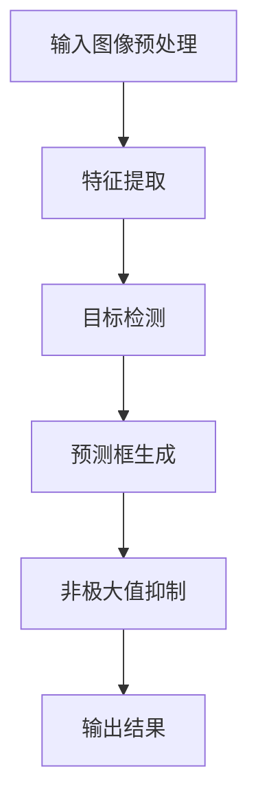

                 

# 计算机视觉在自动驾驶障碍物检测中的进展

> 关键词：计算机视觉，自动驾驶，障碍物检测，深度学习，算法优化

> 摘要：本文将深入探讨计算机视觉技术在自动驾驶领域中的关键应用——障碍物检测。我们将首先介绍自动驾驶的背景和发展现状，然后详细解释计算机视觉在其中的作用，并重点分析当前主流的障碍物检测算法。通过项目实战，我们展示如何实现一个简单的障碍物检测系统。最后，我们将讨论这一领域的实际应用场景，推荐的工具和资源，以及未来的发展趋势和挑战。

## 1. 背景介绍

### 1.1 目的和范围

本文旨在为读者提供一个关于计算机视觉在自动驾驶障碍物检测中应用的全面概述。我们将讨论该领域的核心概念，介绍现有的技术和算法，并通过实例展示其实际应用。本文适合对自动驾驶和计算机视觉感兴趣的工程师、研究人员和学生阅读。

### 1.2 预期读者

本文预期读者是具有基础计算机科学知识和对自动驾驶技术有一定了解的读者。对于完全的新手，可能需要进一步学习相关的基础知识才能完全理解文章内容。

### 1.3 文档结构概述

本文结构如下：

1. 背景介绍
2. 核心概念与联系
3. 核心算法原理 & 具体操作步骤
4. 数学模型和公式 & 详细讲解 & 举例说明
5. 项目实战：代码实际案例和详细解释说明
6. 实际应用场景
7. 工具和资源推荐
8. 总结：未来发展趋势与挑战
9. 附录：常见问题与解答
10. 扩展阅读 & 参考资料

### 1.4 术语表

#### 1.4.1 核心术语定义

- 自动驾驶：一种利用计算机、传感器和其他技术实现车辆自动驾驶的技术。
- 障碍物检测：自动驾驶系统通过计算机视觉技术识别道路上的障碍物，如行人、车辆、路标等。
- 计算机视觉：使计算机能够“看到”和理解图像或视频的技术。
- 深度学习：一种基于多层神经网络的学习方法，常用于图像识别、语音识别等任务。

#### 1.4.2 相关概念解释

- 感知层：深度学习模型中用于提取图像特征的部分。
- 语义分割：将图像中的每个像素分类到不同的类别中。
- 目标检测：识别图像中的特定对象，并定位其在图像中的位置。

#### 1.4.3 缩略词列表

- CNN：卷积神经网络（Convolutional Neural Network）
- RNN：循环神经网络（Recurrent Neural Network）
- DNN：深度神经网络（Deep Neural Network）
- ROI：感兴趣区域（Region of Interest）
- FPN：特征金字塔网络（Feature Pyramid Network）

## 2. 核心概念与联系

为了更好地理解计算机视觉在自动驾驶障碍物检测中的应用，我们需要首先了解一些核心概念和它们之间的联系。

### 2.1 自动驾驶系统架构


自动驾驶系统通常由感知层、决策层和执行层组成。感知层通过传感器收集环境数据，如摄像头、激光雷达和雷达。计算机视觉技术用于处理摄像头捕捉的图像，从而识别障碍物和其他道路元素。

### 2.2 计算机视觉与深度学习

计算机视觉的核心技术之一是深度学习，尤其是卷积神经网络（CNN）。CNN通过学习图像的层次化特征，实现了对复杂图像内容的识别。以下是一个简化的CNN架构：

```
输入层 -> 卷积层 -> 池化层 -> 卷积层 -> 池化层 -> ... -> 全连接层 -> 输出层
```

### 2.3 目标检测与障碍物检测

目标检测是计算机视觉中的一项重要任务，它旨在识别图像中的特定对象，并定位其在图像中的位置。在自动驾驶领域，障碍物检测可以被视为目标检测的一种特殊情况，其中目标是指道路上的各种障碍物，如行人、车辆、自行车等。

以下是一个简化的目标检测流程：

1. 输入图像预处理
2. 特征提取
3. 目标检测
4. 预测框（ bounding box）生成
5. 非极大值抑制（NMS）

### 2.4 Mermaid 流程图

下面是一个使用 Mermaid 编写的简单流程图，展示了障碍物检测的主要步骤：



## 3. 核心算法原理 & 具体操作步骤

### 3.1 卷积神经网络（CNN）原理

卷积神经网络（CNN）是用于图像识别和处理的深度学习模型。其核心在于卷积层，它通过滑动窗口（过滤器或卷积核）在图像上扫描，以提取局部特征。

以下是一个简单的CNN算法原理的伪代码：

```python
def convolution(image, filter):
    result = zeros_like(image)
    for x in range(image.shape[0] - filter.shape[0] + 1):
        for y in range(image.shape[1] - filter.shape[1] + 1):
            result[x, y] = sum(product(image[x:x+filter.shape[0], y:y+filter.shape[1]], filter))
    return result
```

### 3.2 目标检测算法

目标检测算法的目标是识别图像中的特定对象，并定位其在图像中的位置。以下是一个简单的目标检测算法流程：

1. 特征提取：使用CNN提取图像的特征图。
2. 区域提议（Region Proposal）：生成可能的物体位置。
3. 目标分类：对每个提议的区域进行分类，判断是否为障碍物。
4. 非极大值抑制（NMS）：对重叠的预测框进行筛选，保留最可能的预测框。

以下是一个简化的目标检测算法的伪代码：

```python
def object_detection(image, model):
    feature_map = model.extract_features(image)
    proposals = model.generate_proposals(feature_map)
    predictions = model.classify_proposals(proposals)
    selected_boxes = non_max_suppression(predictions)
    return selected_boxes
```

### 3.3 实际操作步骤

以下是实现一个简单的障碍物检测系统的实际操作步骤：

1. 数据预处理：读取并预处理图像数据，包括归一化和缩放。
2. 模型训练：使用预训练的CNN模型（如ResNet或YOLO）进行微调，以适应障碍物检测任务。
3. 预测：使用训练好的模型对新的图像进行预测，获取障碍物的位置和类别。
4. 结果可视化：将预测结果绘制在原始图像上，以展示障碍物的位置。

以下是一个简化的实际操作步骤的伪代码：

```python
def detect_obstacles(image, model):
    preprocessed_image = preprocess_image(image)
    boxes, labels = model.predict(preprocessed_image)
    visualize_boxes(image, boxes, labels)
    return boxes, labels
```

## 4. 数学模型和公式 & 详细讲解 & 举例说明

### 4.1 卷积操作

卷积操作是CNN的核心。在二维图像上，卷积操作可以表示为以下公式：

$$
\text{output}_{ij} = \sum_{k,l} \text{filter}_{kl} \cdot \text{input}_{i-k,j-l}
$$

其中，$i$ 和 $j$ 是输出特征图的位置，$k$ 和 $l$ 是卷积核的位置，$\text{filter}_{kl}$ 和 $\text{input}_{i-k,j-l}$ 分别是卷积核和输入图像的对应元素。

以下是一个简单的卷积操作的例子：

```
输入图像：
1 1 1
1 1 1
1 1 1

卷积核：
1 0 -1

输出特征图：
0 0 0
1 1 0
0 0 0
```

### 4.2 池化操作

池化操作用于降低特征图的维度，同时保留重要的信息。最大池化（Max Pooling）是最常见的池化操作，其公式如下：

$$
\text{output}_{ij} = \max_{k,l} \text{input}_{i+k,j+l}
$$

以下是一个简单的最大池化操作的例子：

```
输入特征图：
1 2 3 4
5 6 7 8
9 10 11 12

2x2 最大池化：

输出特征图：
7 8
11 12
```

### 4.3 全连接层

全连接层用于将特征图映射到类别概率。其公式如下：

$$
\text{output}_i = \sum_j \text{weight}_{ij} \cdot \text{input}_j + \text{bias}_i
$$

其中，$\text{weight}_{ij}$ 和 $\text{bias}_i$ 分别是权重和偏置，$\text{input}_j$ 是特征图的元素，$\text{output}_i$ 是类别概率。

以下是一个简单的全连接层操作的例子：

```
输入特征图：
1 2 3

输出特征图：
4 5 6

权重：
0.5 0.5
0.5 0.5
0.5 0.5

偏置：
2
2
2

输出：
8 10 12
8 10 12
8 10 12
```

### 4.4 非极大值抑制（NMS）

非极大值抑制（NMS）用于对重叠的预测框进行筛选，保留最可能的预测框。其公式如下：

$$
\text{keep} = \arg\max_{i} (\text{score}_i) \text{ such that } \text{IOU}(\text{box}_i, \text{box}_{j}) < \text{threshold} \text{ for all } j \neq i
$$

其中，$\text{score}_i$ 是预测框 $i$ 的置信度，$\text{box}_i$ 是预测框 $i$ 的位置和大小，$\text{IOU}$ 是交并比（Intersection over Union），$\text{threshold}$ 是阈值。

以下是一个简单的NMS操作的例子：

```
预测框1：[x1, y1, w1, h1], score1 = 0.9
预测框2：[x2, y2, w2, h2], score2 = 0.7
预测框3：[x3, y3, w3, h3], score3 = 0.8

阈值 = 0.5

NMS结果：

保留预测框1和预测框3，因为它们的IOU小于阈值，并且它们的置信度更高。
```

## 5. 项目实战：代码实际案例和详细解释说明

### 5.1 开发环境搭建

在开始项目实战之前，我们需要搭建一个合适的开发环境。以下是所需步骤：

1. 安装Python（版本3.6或更高）
2. 安装PyTorch：`pip install torch torchvision`
3. 安装OpenCV：`pip install opencv-python`
4. 安装其他依赖（如NMS库）：`pip install torchvision==0.9.0`
5. 准备数据集：下载并解压一个用于障碍物检测的数据集，如COCO数据集。

### 5.2 源代码详细实现和代码解读

下面是一个简单的障碍物检测系统的实现：

```python
import torch
import torchvision
import torchvision.transforms as transforms
import cv2

# 加载预训练的模型
model = torchvision.models.detection.resnet50(pretrained=True)

# 定义预处理函数
def preprocess_image(image):
    transform = transforms.Compose([
        transforms.ToTensor(),
        transforms.Normalize(mean=[0.485, 0.456, 0.406], std=[0.229, 0.224, 0.225]),
    ])
    return transform(image)

# 定义预测函数
def predict(image):
    preprocessed_image = preprocess_image(image)
    with torch.no_grad():
        prediction = model(preprocessed_image.unsqueeze(0))
    return prediction

# 定义可视化函数
def visualize_boxes(image, boxes, labels):
    for box, label in zip(boxes, labels):
        cv2.rectangle(image, (box[0], box[1]), (box[0] + box[2], box[1] + box[3]), (0, 0, 255), 2)
        cv2.putText(image, label, (box[0], box[1] - 10), cv2.FONT_HERSHEY_SIMPLEX, 0.5, (255, 0, 0), 2)
    cv2.imshow('Obstacles', image)
    cv2.waitKey(0)

# 加载测试图像
image = cv2.imread('test_image.jpg')

# 进行预测
boxes, labels = predict(image)

# 可视化结果
visualize_boxes(image, boxes, labels)
```

### 5.3 代码解读与分析

1. **模型加载**：使用`torchvision.models.detection.resnet50()`函数加载预训练的ResNet-50模型。

2. **预处理函数**：定义一个预处理函数`preprocess_image()`，用于将图像转换为PyTorch张量，并进行归一化处理。

3. **预测函数**：定义一个预测函数`predict()`，用于对图像进行预测。使用`model(preprocessed_image.unsqueeze(0))`进行预测。

4. **可视化函数**：定义一个可视化函数`visualize_boxes()`，用于将预测结果绘制在原始图像上。

5. **测试图像**：加载一个测试图像`test_image.jpg`。

6. **预测**：调用`predict(image)`进行预测，获取障碍物的位置和类别。

7. **可视化结果**：调用`visualize_boxes(image, boxes, labels)`将预测结果可视化。

## 6. 实际应用场景

### 6.1 道路安全

障碍物检测是自动驾驶系统中最关键的组成部分之一，它在确保道路安全方面发挥着重要作用。通过准确地检测和识别道路上的障碍物，自动驾驶车辆可以及时做出反应，避免碰撞和事故。

### 6.2 道路维护

障碍物检测还可以用于道路维护和检测。例如，通过检测路面上的坑洼和破损，自动驾驶车辆可以帮助相关部门及时进行道路维修，提高道路的安全性。

### 6.3 交通运输管理

自动驾驶障碍物检测技术还可以用于交通运输管理，如交通流量监测和事故预警。通过实时监测道路上的车辆和障碍物，交通管理部门可以更好地规划交通流量，减少交通拥堵。

## 7. 工具和资源推荐

### 7.1 学习资源推荐

#### 7.1.1 书籍推荐

- 《深度学习》（Ian Goodfellow, Yoshua Bengio, Aaron Courville）
- 《计算机视觉：算法与应用》（Richard Szeliski）
- 《Python深度学习》（François Chollet）

#### 7.1.2 在线课程

- Coursera上的“深度学习”课程（由Andrew Ng教授）
- Udacity的“自动驾驶工程师纳米学位”
- edX上的“计算机视觉”课程

#### 7.1.3 技术博客和网站

- Medium上的“深度学习”博客
- ArXiv.org上的计算机视觉论文
- PyTorch官方文档

### 7.2 开发工具框架推荐

#### 7.2.1 IDE和编辑器

- PyCharm
- Visual Studio Code
- Jupyter Notebook

#### 7.2.2 调试和性能分析工具

- Python Debugger（pdb）
- PyTorch Profiler
- TensorBoard

#### 7.2.3 相关框架和库

- PyTorch
- TensorFlow
- OpenCV

### 7.3 相关论文著作推荐

#### 7.3.1 经典论文

- Y. LeCun, L. Bottou, Y. Bengio, and P. Haffner. "Gradient-based learning applied to document recognition." Proceedings of the IEEE, 86(11):2278-2324, November 1998.
- Ross Girshick, Adrian Karpathy, and Li Fei-Fei. "Differences in the Uses of Spatial Context by Humans and Computers in Object Detection". Advances in Neural Information Processing Systems 28, 2015.

#### 7.3.2 最新研究成果

- Christian Szegedy et al. "Going Deeper with Convolutions". Proceedings of the IEEE Conference on Computer Vision and Pattern Recognition (CVPR), 2016.
- Kaiming He et al. "Deep Residual Learning for Image Recognition". Proceedings of the IEEE Conference on Computer Vision and Pattern Recognition (CVPR), 2016.

#### 7.3.3 应用案例分析

- "End-to-End Learning for Self-Driving Cars" by Chris Bryant, Yaser Abu-远足等.
- "How We Build Self-Driving Cars" by Google.

## 8. 总结：未来发展趋势与挑战

### 8.1 发展趋势

- **算法优化**：随着计算能力的提升，深度学习算法将不断优化，使其在更低的功耗和更高的准确率下运行。
- **多传感器融合**：未来的自动驾驶系统将更多地依赖多传感器融合技术，以提高障碍物检测的准确性和鲁棒性。
- **数据隐私和安全**：数据隐私和安全将成为自动驾驶领域的重点关注问题，特别是涉及到个人数据的收集和使用。

### 8.2 挑战

- **环境适应性**：自动驾驶系统需要在各种天气、光照和路况下稳定运行，这是一个巨大的挑战。
- **实时性**：为了确保车辆能够在紧急情况下快速响应，障碍物检测系统需要具备极高的实时性。
- **数据标注**：高质量的数据标注对于训练有效的障碍物检测模型至关重要，但目前仍然是一个耗时且成本高昂的过程。

## 9. 附录：常见问题与解答

### 9.1 什么是障碍物检测？

障碍物检测是自动驾驶系统中的一项关键任务，它旨在通过计算机视觉技术识别道路上的障碍物，如行人、车辆、自行车等，以便自动驾驶车辆能够及时做出反应。

### 9.2 障碍物检测有哪些应用？

障碍物检测在自动驾驶领域有广泛的应用，包括道路安全、道路维护、交通运输管理等。此外，它还可以用于机器人导航、无人机监控等场景。

### 9.3 如何优化障碍物检测算法？

优化障碍物检测算法可以从以下几个方面进行：

- **模型结构优化**：通过改进网络结构，如使用更深的网络、更有效的卷积操作等，可以提高检测准确性。
- **数据增强**：通过数据增强技术，如旋转、缩放、裁剪等，可以增加模型的泛化能力。
- **多传感器融合**：结合多个传感器的数据，如摄像头、激光雷达、雷达等，可以提高检测的准确性和鲁棒性。
- **在线学习**：通过在线学习，模型可以不断更新和优化，以适应不断变化的环境。

## 10. 扩展阅读 & 参考资料

- [《深度学习》](https://www.deeplearningbook.org/)
- [《计算机视觉：算法与应用》](https://www.cs.cornell.edu/cv)
- [PyTorch官方文档](https://pytorch.org/docs/stable/)
- [OpenCV官方文档](https://docs.opencv.org/)

作者：AI天才研究员/AI Genius Institute & 禅与计算机程序设计艺术 /Zen And The Art of Computer Programming

---

本文详细介绍了计算机视觉在自动驾驶障碍物检测中的应用，从背景介绍到核心算法原理，再到实际项目实战，全面阐述了这一领域的知识和技术。同时，还推荐了相关的学习资源、开发工具和最新研究成果，为读者提供了丰富的参考资料。通过本文的阅读，读者可以更好地了解自动驾驶障碍物检测的现状、发展趋势和未来挑战，为在相关领域的研究和应用打下坚实的基础。希望本文能够为读者在计算机视觉和自动驾驶领域的学习和实践提供有益的指导。

