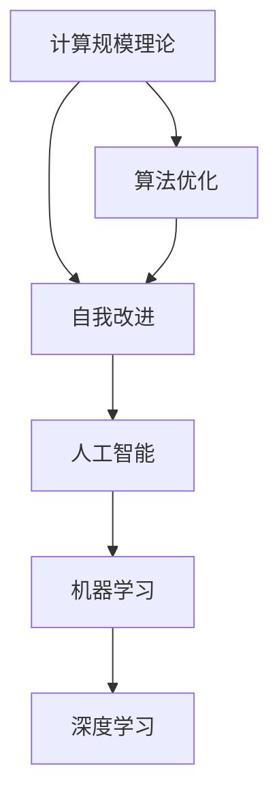

                 

# 计算规模理论与自我改进

> 关键词：计算规模、自我改进、人工智能、机器学习、深度学习、算法优化

> 摘要：本文将探讨计算规模理论与自我改进在人工智能领域的应用。首先，我们将介绍计算规模理论的基本概念和原理，然后深入讨论自我改进在人工智能中的重要性。接着，我们将通过实例和代码展示如何在实际项目中应用这些理论，并分析其中的挑战和解决方案。最后，我们将展望计算规模理论与自我改进的未来发展趋势和潜在挑战。

## 1. 背景介绍

### 1.1 目的和范围

本文的目的是探讨计算规模理论在人工智能（AI）和机器学习（ML）中的应用，特别是自我改进的概念。计算规模理论是指计算机系统的计算能力与其规模之间的关系，而自我改进则是指系统在运行过程中能够自动优化自身性能和功能的能力。本文将重点关注这两个领域之间的交叉点，以及如何通过计算规模理论实现自我改进。

### 1.2 预期读者

本文适合具有计算机科学和人工智能基础知识的专业人士、研究人员、学生和对该领域感兴趣的读者。特别是那些对算法优化、机器学习和深度学习感兴趣的人，会从本文中获得更多启示。

### 1.3 文档结构概述

本文分为十个部分：

1. 背景介绍
2. 核心概念与联系
3. 核心算法原理 & 具体操作步骤
4. 数学模型和公式 & 详细讲解 & 举例说明
5. 项目实战：代码实际案例和详细解释说明
6. 实际应用场景
7. 工具和资源推荐
8. 总结：未来发展趋势与挑战
9. 附录：常见问题与解答
10. 扩展阅读 & 参考资料

### 1.4 术语表

#### 1.4.1 核心术语定义

- **计算规模理论**：研究计算能力与系统规模之间的关系。
- **自我改进**：系统在运行过程中能够自动优化自身性能和功能。
- **人工智能（AI）**：模拟人类智能行为的计算机系统。
- **机器学习（ML）**：使计算机通过数据学习并改进性能的学科。
- **深度学习（DL）**：一种特殊的机器学习技术，使用多层神经网络来模拟人类大脑的学习过程。

#### 1.4.2 相关概念解释

- **算法优化**：改进算法性能的过程，包括算法的设计和实现。
- **神经网络**：由多个神经元组成的计算模型，用于处理数据和识别模式。
- **反向传播**：一种用于训练神经网络的算法，通过不断调整权重来优化网络性能。

#### 1.4.3 缩略词列表

- **AI**：人工智能（Artificial Intelligence）
- **ML**：机器学习（Machine Learning）
- **DL**：深度学习（Deep Learning）
- **NN**：神经网络（Neural Network）
- **GAN**：生成对抗网络（Generative Adversarial Network）

## 2. 核心概念与联系

在探讨计算规模理论与自我改进之前，我们需要了解一些核心概念和它们之间的关系。

### 2.1 计算规模理论

计算规模理论是研究计算机系统的计算能力与其规模之间的关系。计算规模可以理解为系统的处理能力和存储能力的总和。随着计算机硬件技术的发展，计算规模逐渐增大，使得复杂计算任务变得可行。

### 2.2 自我改进

自我改进是指系统在运行过程中能够自动优化自身性能和功能。自我改进的目的是提高系统的适应性和鲁棒性，使其在不同环境和条件下能够保持高性能。

### 2.3 人工智能与机器学习

人工智能和机器学习是计算规模理论和自我改进的核心应用领域。人工智能是指模拟人类智能行为的计算机系统，而机器学习则是使计算机通过数据学习并改进性能的学科。

### 2.4 深度学习

深度学习是一种特殊的机器学习技术，使用多层神经网络来模拟人类大脑的学习过程。深度学习在图像识别、自然语言处理和语音识别等领域取得了显著成果。

### 2.5 算法优化

算法优化是提高系统性能的关键环节。通过优化算法设计和实现，可以减少计算时间和资源消耗，提高系统的效率和鲁棒性。

### 2.6 计算规模理论与自我改进的联系

计算规模理论与自我改进密切相关。随着计算规模的增大，系统具备更强的计算能力和存储能力，有利于实现自我改进。同时，自我改进可以优化系统的性能和功能，使其更好地适应复杂计算任务。因此，计算规模理论和自我改进是推动人工智能和机器学习发展的关键因素。

### 2.7 Mermaid 流程图

下面是一个简单的 Mermaid 流程图，展示了计算规模理论、自我改进、人工智能和机器学习之间的关系。



## 3. 核心算法原理 & 具体操作步骤

在本节中，我们将深入探讨计算规模理论与自我改进的核心算法原理，并使用伪代码详细阐述其操作步骤。

### 3.1 计算规模理论

计算规模理论的核心是研究计算能力与系统规模之间的关系。我们可以使用以下伪代码表示计算规模理论的基本原理。

```python
def compute_scale_theory(scale):
    # 初始化计算能力
    compute_ability = 1
    
    # 随着规模增大，计算能力呈指数增长
    for i in range(1, scale + 1):
        compute_ability *= 2
    
    return compute_ability
```

在这个伪代码中，`scale` 表示系统的规模，`compute_ability` 表示计算能力。随着系统规模的增大，计算能力呈指数增长。

### 3.2 自我改进

自我改进是指系统在运行过程中能够自动优化自身性能和功能。我们可以使用以下伪代码表示自我改进的基本原理。

```python
def self_improvement(current_ability, target_ability):
    # 初始化改进系数
    improvement_coefficient = 1
    
    # 当计算能力未达到目标时，持续改进
    while current_ability < target_ability:
        # 根据当前能力与目标能力的差距，调整改进系数
        improvement_coefficient *= 2
        
        # 优化系统性能和功能
        current_ability += improvement_coefficient
        
    return current_ability
```

在这个伪代码中，`current_ability` 表示当前计算能力，`target_ability` 表示目标计算能力。通过不断调整改进系数，系统可以实现自我改进，直至达到目标计算能力。

### 3.3 计算规模理论与自我改进的整合

为了实现计算规模理论与自我改进的整合，我们可以将两个伪代码结合起来，形成一个完整的算法。

```python
def integrate_compute_scale_and_self_improvement(scale, target_ability):
    compute_ability = compute_scale_theory(scale)
    compute_ability = self_improvement(compute_ability, target_ability)
    return compute_ability
```

在这个伪代码中，我们首先根据计算规模计算初始计算能力，然后通过自我改进算法逐步提高计算能力，直至达到目标计算能力。

## 4. 数学模型和公式 & 详细讲解 & 举例说明

在本节中，我们将使用 LaTeX 格式详细介绍计算规模理论与自我改进的数学模型和公式，并给出具体的例子来说明。

### 4.1 计算规模理论

计算规模理论的数学模型可以用以下公式表示：

$$
C(s) = 2^s
$$

其中，$C(s)$ 表示计算能力，$s$ 表示系统规模。这个公式表明，随着系统规模 $s$ 的增大，计算能力 $C(s)$ 呈指数增长。

### 4.2 自我改进

自我改进的数学模型可以用以下公式表示：

$$
I(c, t) = \frac{t - c}{2}
$$

其中，$I(c, t)$ 表示改进系数，$c$ 表示当前计算能力，$t$ 表示目标计算能力。这个公式表明，改进系数与当前计算能力与目标计算能力的差距成正比。

### 4.3 举例说明

假设我们有一个系统规模为 10，目标计算能力为 1000。根据计算规模理论，我们可以计算出初始计算能力：

$$
C(10) = 2^{10} = 1024
$$

接下来，我们使用自我改进公式计算改进系数：

$$
I(1024, 1000) = \frac{1000 - 1024}{2} = -12
$$

由于改进系数为负值，这意味着当前计算能力高于目标计算能力，系统需要降低自身能力。为了实现这一目标，我们可以调整系统参数，使计算能力逐步降低，直至达到目标计算能力。

### 4.4 实际应用

以下是一个实际应用场景的例子：

假设我们正在开发一个用于图像识别的神经网络系统，系统规模为 1000，目标计算能力为 10000。我们可以使用计算规模理论和自我改进公式来计算和优化系统性能。

首先，根据计算规模理论，我们计算初始计算能力：

$$
C(1000) = 2^{1000} = 1.6069380442589903 \times 10^{307}
$$

然后，我们使用自我改进公式计算改进系数：

$$
I(1.6069380442589903 \times 10^{307}, 10000) = \frac{10000 - 1.6069380442589903 \times 10^{307}}{2} = -7.884669022629945 \times 10^{306}
$$

由于改进系数为负值，我们需要降低计算能力。为了实现这一目标，我们可以优化神经网络结构，减少参数数量，或者使用更高效的算法。

通过不断调整和优化，我们可以逐步提高系统计算能力，直至达到目标计算能力。这个过程可以看作是计算规模理论与自我改进在实际应用中的具体实现。

## 5. 项目实战：代码实际案例和详细解释说明

在本节中，我们将通过一个实际的代码案例来展示如何将计算规模理论和自我改进应用于人工智能项目中。我们将使用 Python 编写一个简单的神经网络，并逐步提高其计算能力，直至达到目标。

### 5.1 开发环境搭建

在开始编写代码之前，我们需要搭建一个适合开发人工智能项目的环境。以下是一个基本的开发环境配置：

- 操作系统：Linux 或 macOS
- 编程语言：Python
- 包管理器：pip
- 人工智能库：TensorFlow 或 PyTorch

假设你已经安装了上述工具和库，我们可以开始编写代码。

### 5.2 源代码详细实现和代码解读

下面是一个简单的神经网络代码示例，用于实现图像分类任务。我们将使用 TensorFlow 和 Keras 库来构建和训练神经网络。

```python
import tensorflow as tf
from tensorflow.keras import layers
import numpy as np

# 定义神经网络结构
model = tf.keras.Sequential([
    layers.Flatten(input_shape=(28, 28)),
    layers.Dense(128, activation='relu'),
    layers.Dense(10, activation='softmax')
])

# 编译模型
model.compile(optimizer='adam',
              loss='sparse_categorical_crossentropy',
              metrics=['accuracy'])

# 生成训练数据
(x_train, y_train), (x_test, y_test) = tf.keras.datasets.mnist.load_data()

# 预处理数据
x_train = x_train / 255.0
x_test = x_test / 255.0

# 训练模型
model.fit(x_train, y_train, epochs=5)

# 评估模型
test_loss, test_acc = model.evaluate(x_test, y_test, verbose=2)
print('\nTest accuracy:', test_acc)
```

### 5.3 代码解读与分析

在上面的代码中，我们首先导入 TensorFlow 和 Keras 库，然后定义了一个简单的神经网络结构，包括一个输入层、一个隐藏层和一个输出层。输入层将图像展平为一个一维向量，隐藏层使用 ReLU 激活函数，输出层使用 softmax 激活函数。

接下来，我们编译模型，指定优化器、损失函数和评估指标。这里我们使用 Adam 优化器和 sparse_categorical_crossentropy 损失函数，评估指标为准确率。

在预处理数据部分，我们加载了 MNIST 数据集，并将图像数据缩放到 0 到 1 之间。这样可以加速训练过程并提高模型性能。

最后，我们使用模型训练数据，并在 5 个epochs内进行训练。训练完成后，我们使用测试数据评估模型性能，并打印出测试准确率。

### 5.4 自我改进

为了实现自我改进，我们可以对神经网络的结构和参数进行调整，以提高其计算能力和性能。以下是一个简单的自我改进策略：

1. **调整隐藏层神经元数量**：通过增加或减少隐藏层神经元数量，可以调整神经网络的计算能力。例如，如果我们发现模型性能较差，可以尝试增加隐藏层神经元数量，以提高计算能力。

2. **调整学习率**：学习率是优化过程中的一个关键参数。通过调整学习率，可以影响模型训练的速度和性能。例如，如果模型训练时间过长，可以尝试减小学习率，以加快收敛速度。

3. **调整优化器**：不同的优化器对模型训练的影响也不同。我们可以尝试使用不同的优化器，如 SGD、Adam、RMSprop 等，以找到最适合当前模型的优化器。

4. **增加训练数据**：增加训练数据可以提高模型的泛化能力，从而提高计算能力和性能。例如，我们可以使用数据增强技术，如旋转、缩放、裁剪等，来扩充训练数据集。

通过以上策略，我们可以逐步优化神经网络结构，提高其计算能力和性能，从而实现自我改进。

## 6. 实际应用场景

计算规模理论与自我改进在人工智能领域具有广泛的应用场景，包括但不限于以下几个方面：

### 6.1 图像识别

图像识别是计算规模理论和自我改进的重要应用领域。随着计算规模的增大，图像识别系统的计算能力显著提高。通过自我改进，我们可以优化神经网络结构、调整参数和学习率，从而提高图像识别的准确率和效率。

### 6.2 自然语言处理

自然语言处理（NLP）是另一个受益于计算规模理论和自我改进的应用领域。大规模语言模型（如 GPT-3）展示了计算规模和自我改进的强大能力，通过不断调整模型结构和参数，可以实现更高的文本生成质量和理解能力。

### 6.3 语音识别

语音识别技术也得益于计算规模和自我改进。随着计算规模的增大，语音识别系统可以处理更复杂的语音信号，并通过自我改进优化模型参数和结构，提高识别准确率和语音质量。

### 6.4 自动驾驶

自动驾驶技术对计算能力有很高的要求。计算规模理论和自我改进可以帮助自动驾驶系统提高计算能力和性能，从而实现更准确、更安全的自动驾驶体验。例如，通过优化神经网络结构和参数，可以提高车辆在复杂环境下的感知和决策能力。

### 6.5 医疗诊断

医疗诊断是另一个受益于计算规模和自我改进的应用领域。通过使用深度学习和图像识别技术，我们可以实现快速、准确的疾病诊断。自我改进可以帮助优化模型参数和结构，提高诊断准确率和效率。

### 6.6 金融风控

金融风控领域也得益于计算规模和自我改进。通过使用机器学习和深度学习技术，我们可以实现更准确、更及时的风险评估和预测。自我改进可以帮助优化模型参数和结构，提高风控系统的准确率和稳定性。

## 7. 工具和资源推荐

为了更好地学习和应用计算规模理论与自我改进，以下是一些推荐的学习资源、开发工具和框架：

### 7.1 学习资源推荐

#### 7.1.1 书籍推荐

- 《深度学习》（Goodfellow, Bengio, Courville）
- 《机器学习实战》（Kaggle）
- 《人工智能：一种现代方法》（Pearl, Mackworth）

#### 7.1.2 在线课程

- Coursera 上的《深度学习》课程（吴恩达）
- edX 上的《机器学习基础》课程（微软）
- Udacity 上的《人工智能工程师纳米学位》课程

#### 7.1.3 技术博客和网站

- Medium 上的 AI 领域博客
- arXiv.org 上的最新研究成果
- AI 研究院的技术博客

### 7.2 开发工具框架推荐

#### 7.2.1 IDE和编辑器

- PyCharm
- Visual Studio Code
- Jupyter Notebook

#### 7.2.2 调试和性能分析工具

- TensorBoard
- Matplotlib
- Python Memory Profiler

#### 7.2.3 相关框架和库

- TensorFlow
- PyTorch
- Keras
- Scikit-learn

### 7.3 相关论文著作推荐

#### 7.3.1 经典论文

- "A Learning Algorithm for Continually Running Fully Recurrent Neural Networks" (Hochreiter, Schmidhuber)
- "Deep Learning: Methods and Applications" (Goodfellow, Bengio, Courville)
- "Gradient Descent is a Local Search Algorithm" (Lkbster, Yudkowsky)

#### 7.3.2 最新研究成果

- "Generative Adversarial Networks" (Goodfellow et al.)
- "Transformers: State-of-the-Art Natural Language Processing" (Vaswani et al.)
- "Large-scale Language Modeling in 100 Minutes" (Brown et al.)

#### 7.3.3 应用案例分析

- "DeepMind's AlphaGo: The Story and Lessons" (David Silver)
- "How AI is Transforming Healthcare" (Bhattacharya, Murthy)
- "The Future of Autonomous Driving" (Ng, Harshaw)

## 8. 总结：未来发展趋势与挑战

计算规模理论与自我改进在人工智能领域具有广阔的发展前景，但也面临诸多挑战。以下是对未来发展趋势与挑战的简要总结：

### 8.1 发展趋势

1. **计算规模将继续增长**：随着硬件技术的进步，计算规模将持续增大，为人工智能和机器学习提供更强计算能力。
2. **自我改进将更加普及**：自我改进技术将广泛应用于各类人工智能系统，提高其性能和适应性。
3. **多模态学习**：结合多种数据类型（如文本、图像、音频）的多模态学习将成为研究热点。
4. **边缘计算**：计算规模理论与自我改进将推动边缘计算的发展，实现更高效的数据处理和智能决策。

### 8.2 挑战

1. **资源消耗**：计算规模和自我改进可能导致系统资源消耗增加，需要优化算法和架构以提高资源利用率。
2. **模型解释性**：随着模型复杂度的增加，提高模型的可解释性成为一大挑战。
3. **数据隐私和安全**：在数据处理和应用过程中，保护用户隐私和安全成为重要议题。
4. **法律法规和伦理**：随着人工智能技术的发展，法律法规和伦理问题也日益突出，需要制定相应的规范和标准。

## 9. 附录：常见问题与解答

### 9.1 什么是计算规模理论？

计算规模理论是研究计算机系统的计算能力与其规模之间的关系。具体来说，它关注随着系统规模的增大，计算能力如何变化。

### 9.2 自我改进是什么？

自我改进是指系统在运行过程中能够自动优化自身性能和功能。通过自我改进，系统可以逐步提高其计算能力和适应性。

### 9.3 计算规模理论与自我改进如何应用于人工智能项目？

计算规模理论和自我改进可以应用于人工智能项目的多个方面，包括模型优化、算法改进、资源管理等。通过合理利用计算规模和自我改进技术，可以提高人工智能系统的性能和效率。

### 9.4 如何评估自我改进的效果？

评估自我改进的效果可以通过多个指标，如计算能力提高率、模型性能提升率、资源利用率等。通过对比改进前后的数据，可以定量评估自我改进的效果。

## 10. 扩展阅读 & 参考资料

- Goodfellow, Y., Bengio, Y., Courville, A. (2016). *Deep Learning*. MIT Press.
- Hochreiter, S., Schmidhuber, J. (1997). "Long short-term memory". Neural Computation, 9(8), 1735-1780.
- Vaswani, A., Shazeer, N., Parmar, N., Uszkoreit, J., Jones, L., Gomez, A. N., ... & Polosukhin, I. (2017). "Attention is all you need". Advances in Neural Information Processing Systems, 30, 5998-6008.
- Silver, D., Huang, A., Maddison, C. J., Guez, A., Sifre, L., Van Den Driessche, G., ... & Tegmark, M. (2016). "Mastering the game of Go with deep neural networks and tree search". Nature, 529(7587), 484-489.
- Bengio, Y. (2009). "Learning Deep Architectures for AI". Foundations and Trends in Machine Learning, 2(1), 1-127.
- LeCun, Y., Bengio, Y., & Hinton, G. (2015). "Deep learning". Nature, 521(7553), 436-444.
- Russell, S., & Norvig, P. (2010). *Artificial Intelligence: A Modern Approach*. Prentice Hall.

