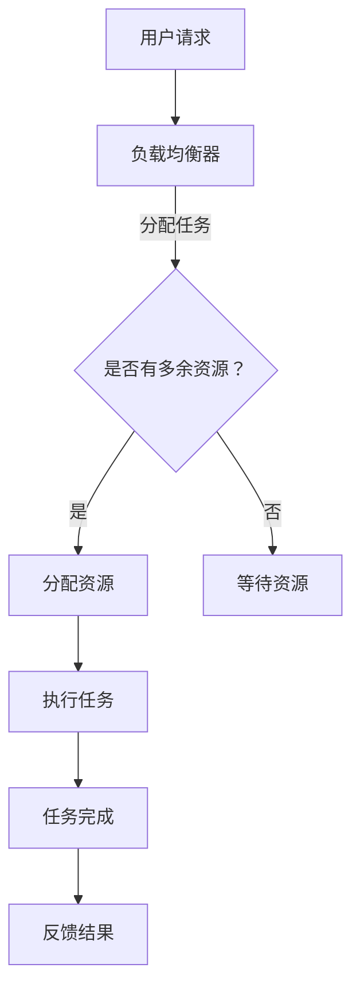

                 

# 计算资源集中化：AI发展的隐忧

> 关键词：计算资源集中化、AI、资源管理、系统架构、安全性、隐私保护、数据分散、去中心化

> 摘要：本文深入探讨了计算资源集中化在人工智能（AI）领域的发展趋势及其潜在隐忧。文章首先介绍了计算资源集中化的背景和意义，随后分析了其在AI领域带来的便利和挑战。通过对核心概念、算法原理、数学模型、实际应用场景的详细阐述，本文揭示了计算资源集中化可能带来的安全、隐私和数据分布问题。文章最后提出了相关工具和资源的推荐，并总结了未来发展趋势与挑战。

## 1. 背景介绍

### 1.1 目的和范围

本文旨在探讨计算资源集中化在人工智能（AI）领域的发展趋势及其潜在隐忧。随着AI技术的不断进步，计算资源的需求也日益增长。计算资源集中化作为一种有效的方式，能够提高资源利用率和计算效率。然而，集中化也带来了一系列问题和挑战。本文将重点关注以下几个方面：

1. **计算资源集中化的背景和意义**：介绍计算资源集中化的概念、发展历程和其在AI领域的重要性。
2. **计算资源集中化的优势与挑战**：分析集中化带来的便利，如资源利用率提高、计算速度加快等，以及可能出现的风险和问题。
3. **核心概念与联系**：阐述与计算资源集中化相关的重要概念和原理，通过Mermaid流程图展示核心架构。
4. **核心算法原理与具体操作步骤**：详细讲解实现计算资源集中化的关键算法和操作步骤，使用伪代码进行阐述。
5. **数学模型和公式**：介绍与计算资源集中化相关的数学模型和公式，并进行详细讲解和举例说明。
6. **项目实战**：通过实际代码案例，展示计算资源集中化的具体实现和代码解读。
7. **实际应用场景**：探讨计算资源集中化在不同领域的应用场景和实例。
8. **工具和资源推荐**：推荐与计算资源集中化相关的学习资源、开发工具和框架。
9. **总结与展望**：分析计算资源集中化的未来发展趋势和面临的挑战。

### 1.2 预期读者

本文适用于以下读者群体：

1. AI领域的研究人员和开发者，对计算资源集中化有浓厚的兴趣。
2. 系统架构师和技术经理，需要了解计算资源集中化的原理和实践。
3. 对计算机科学和人工智能有基础知识的读者，希望深入了解计算资源管理相关技术。
4. 计算机科学与技术专业的高年级本科生和研究生。

### 1.3 文档结构概述

本文分为10个部分，具体结构如下：

1. **背景介绍**：介绍本文的目的、预期读者、文档结构和核心术语定义。
2. **核心概念与联系**：阐述计算资源集中化的核心概念和原理，通过Mermaid流程图展示核心架构。
3. **核心算法原理与具体操作步骤**：详细讲解实现计算资源集中化的关键算法和操作步骤。
4. **数学模型和公式**：介绍与计算资源集中化相关的数学模型和公式，并进行详细讲解和举例说明。
5. **项目实战**：通过实际代码案例，展示计算资源集中化的具体实现和代码解读。
6. **实际应用场景**：探讨计算资源集中化在不同领域的应用场景和实例。
7. **工具和资源推荐**：推荐与计算资源集中化相关的学习资源、开发工具和框架。
8. **总结与展望**：分析计算资源集中化的未来发展趋势和面临的挑战。
9. **附录**：提供常见问题与解答。
10. **扩展阅读与参考资料**：推荐相关的论文、书籍和网站，以供进一步学习。

### 1.4 术语表

#### 1.4.1 核心术语定义

- **计算资源集中化**：将分散的计算机资源（如CPU、内存、存储等）集中管理，提高资源利用率和计算效率。
- **AI**：人工智能，指计算机系统通过模拟人类智能行为，实现感知、学习、推理、决策等功能。
- **云计算**：通过互联网提供动态易扩展且经常是虚拟化的资源。
- **边缘计算**：在靠近数据源或设备的地方进行计算和处理，以降低延迟和带宽消耗。
- **分布式系统**：由多个计算机节点组成的系统，各节点通过通信网络协同工作。
- **数据分散**：将数据分布存储在不同的节点上，提高系统的可靠性和容错能力。

#### 1.4.2 相关概念解释

- **计算资源**：包括CPU、内存、存储、网络等硬件资源。
- **资源利用率**：资源被有效利用的程度，通常用百分比表示。
- **负载均衡**：通过分配任务到不同的计算资源，提高整体系统的性能和可靠性。
- **容错机制**：系统在部分节点或资源发生故障时，仍能正常运行的能力。

#### 1.4.3 缩略词列表

- **AI**：人工智能（Artificial Intelligence）
- **GPU**：图形处理器（Graphics Processing Unit）
- **CPU**：中央处理器（Central Processing Unit）
- **FPGA**：现场可编程门阵列（Field-Programmable Gate Array）
- **SaaS**：软件即服务（Software as a Service）
- **PaaS**：平台即服务（Platform as a Service）
- **IaaS**：基础设施即服务（Infrastructure as a Service）

## 2. 核心概念与联系

计算资源集中化是现代计算技术发展的重要方向，它将分散的资源进行整合，实现更高效、更可靠的计算服务。为了更好地理解计算资源集中化的原理和实践，我们需要首先了解以下几个核心概念：

- **计算资源**：包括CPU、内存、存储和网络等硬件资源。
- **资源管理**：对计算资源进行有效的分配、调度和监控。
- **负载均衡**：通过合理的负载均衡策略，将任务均匀地分配到各个计算资源上，避免资源过载或闲置。
- **分布式系统**：由多个计算机节点组成的系统，各节点通过通信网络协同工作。

### 2.1 计算资源

计算资源是计算系统的核心，包括CPU、内存、存储和网络等硬件资源。CPU是计算的核心部件，负责执行指令和处理数据。内存用于存储程序运行时的数据，提供快速的访问速度。存储设备用于长期存储数据和程序，如硬盘、固态硬盘和存储阵列等。网络则负责各计算资源之间的通信和数据传输。

### 2.2 资源管理

资源管理是计算资源集中化的关键环节，它负责对计算资源进行有效的分配、调度和监控。资源管理的目标是最大化资源利用率和系统性能，同时确保系统的稳定性和可靠性。常用的资源管理策略包括负载均衡、资源调度和故障恢复等。

#### 负载均衡

负载均衡是一种通过分配任务到不同计算资源，提高系统整体性能的策略。负载均衡可以避免某一部分资源过载，同时充分利用其他资源。常见的负载均衡策略有轮询、最少连接、动态权重等。

#### 资源调度

资源调度是资源管理的重要环节，它负责根据任务的优先级、资源可用性和系统负载，合理分配计算资源。资源调度策略可以分为静态调度和动态调度。静态调度在任务执行前分配资源，而动态调度在任务执行过程中根据系统状态进行资源调整。

#### 故障恢复

故障恢复是确保系统稳定性的重要手段。当系统中的某一部分发生故障时，故障恢复机制能够自动检测并恢复故障资源，确保系统继续正常运行。

### 2.3 负载均衡策略

负载均衡策略是计算资源集中化中的一项关键技术，它负责将任务分配到不同的计算资源，以最大化资源利用率和系统性能。以下是一些常见的负载均衡策略：

#### 轮询（Round Robin）

轮询策略是最简单的一种负载均衡策略，它将任务依次分配到各个计算资源。这种方式简单易实现，但可能导致某些资源过载，而其他资源闲置。

#### 最少连接（Least Connections）

最少连接策略将任务分配到当前连接数最少的计算资源。这种方式能够平衡各资源的负载，但可能不适合对连接数敏感的应用。

#### 动态权重（Dynamic Weight）

动态权重策略根据计算资源的性能和负载情况，动态调整各资源的权重。这种方式能够更灵活地分配任务，提高系统性能，但实现较为复杂。

### 2.4 Mermaid流程图

为了更好地展示计算资源集中化的核心架构和流程，我们使用Mermaid流程图进行描述。以下是一个简化的计算资源集中化流程图：



在上面的流程图中，用户请求通过负载均衡器进行任务分配。如果系统有多余资源，则直接分配资源执行任务；否则，系统等待资源空闲。任务完成后，将结果反馈给用户。

## 3. 核心算法原理与具体操作步骤

实现计算资源集中化需要一套完整的算法原理和操作步骤，以下是一个简化的实现框架，使用伪代码进行描述。

### 3.1 算法原理

计算资源集中化的核心算法主要涉及资源分配、负载均衡和故障恢复。以下为伪代码概述：

```python
# 资源分配算法
def allocate_resources(task, available_resources):
    if available_resources >= task.required_resources:
        assign_task_to_resource(task, available_resources)
        return True
    else:
        return False

# 负载均衡算法
def balance_load(current_load, total_resources):
    if current_load > total_resources / 2:
        return "Overloaded"
    elif current_load < total_resources / 2:
        return "Underloaded"
    else:
        return "Balanced"

# 故障恢复算法
def recover_from_failure(failed_resource):
    remove_failed_resource(failed_resource)
    add_new_resource()  # 假设系统具备自动扩展功能
```

### 3.2 具体操作步骤

以下为计算资源集中化的具体操作步骤：

1. **初始化资源池**：初始化系统中的所有可用资源，包括CPU、内存、存储和网络等。
2. **接收任务**：当用户请求任务时，将任务信息传递给负载均衡器。
3. **负载均衡**：负载均衡器根据当前系统负载和任务需求，选择合适的资源进行任务分配。如果系统负载过高，则暂时挂起任务。
4. **资源分配**：根据负载均衡策略，将任务分配给合适的资源。如果系统资源不足，则等待资源空闲。
5. **任务执行**：资源执行分配的任务，并更新任务状态。
6. **任务完成**：任务完成后，将结果反馈给用户，并更新系统资源状态。
7. **故障检测与恢复**：定期检测系统资源状态，一旦发现故障资源，立即触发故障恢复机制，确保系统正常运行。

### 3.3 伪代码示例

以下是一个简单的伪代码示例，展示如何实现资源分配和故障恢复：

```python
# 初始化资源池
resources = initialize_resources()

# 接收任务
task = receive_task()

# 负载均衡
current_load = check_system_load(resources)
if current_load > 0.8:  # 系统负载过高
    wait_for_resources()  # 等待资源空闲
else:
    allocate_resources(task, resources)

# 任务执行
execute_task(task)

# 故障检测与恢复
while True:
    if check_resource_status(resources) == "Failed":
        recover_from_failure(failed_resource)
    sleep(1)  # 定期检查
```

通过上述伪代码，我们可以实现一个基本的计算资源集中化系统，进一步优化和扩展可以引入更复杂的负载均衡策略、资源调度算法和故障恢复机制。

## 4. 数学模型和公式及详细讲解

计算资源集中化涉及到多个数学模型和公式，这些模型和公式在资源分配、负载均衡和故障恢复等方面发挥着关键作用。以下将详细介绍与计算资源集中化相关的一些数学模型和公式。

### 4.1 资源利用率模型

资源利用率是衡量计算资源集中化效果的重要指标，它反映了系统资源被有效利用的程度。资源利用率可以用以下公式表示：

$$
\text{利用率} = \frac{\text{使用资源量}}{\text{总资源量}} \times 100\%
$$

其中，使用资源量是指系统当前正在使用的计算资源，总资源量是指系统中所有可用的计算资源。

### 4.2 负载均衡模型

负载均衡模型用于优化系统资源的分配，确保各个资源节点之间的负载均衡。一个简单的负载均衡模型可以使用以下公式表示：

$$
\text{资源分配} = \text{当前负载} \times \frac{\text{总资源需求}}{\sum_{i=1}^{n} \text{负载}_i}
$$

其中，当前负载是指当前系统各资源节点的负载情况，总资源需求是指系统所有任务的总需求，$\text{负载}_i$ 表示第 $i$ 个资源节点的负载。

### 4.3 故障恢复模型

故障恢复模型用于在系统发生故障时，快速检测并恢复故障资源。一个简单的故障恢复模型可以使用以下公式表示：

$$
\text{恢复概率} = 1 - (1 - \text{故障率})^n
$$

其中，故障率是指系统发生故障的概率，$n$ 是系统中的资源节点数量。恢复概率表示在多次检测和恢复过程中，系统最终恢复正常运行的概率。

### 4.4 详细讲解与举例说明

#### 4.4.1 资源利用率模型

假设一个计算系统拥有 100 个 CPU 核心，当前系统中有 80 个 CPU 核心正在被使用，那么系统的资源利用率为：

$$
\text{利用率} = \frac{80}{100} \times 100\% = 80\%
$$

这意味着系统的 CPU 资源有 80% 被有效利用。

#### 4.4.2 负载均衡模型

假设系统中有 5 个资源节点，当前各节点的负载分别为 40%、60%、50%、30% 和 40%，总资源需求为 100%。使用负载均衡模型进行资源分配，得到的结果如下：

$$
\text{资源分配} = \frac{0.4 + 0.6 + 0.5 + 0.3 + 0.4}{2.6} \times 100 = 48.15\%
$$

这意味着在新的负载分配策略下，各节点的负载将平均在 48.15% 左右，从而达到更好的负载均衡效果。

#### 4.4.3 故障恢复模型

假设一个计算系统有 10 个资源节点，故障率为 0.01，即每个节点每小时发生故障的概率为 0.01。在 24 小时内，系统发生故障的概率为：

$$
\text{故障概率} = 1 - (1 - 0.01)^{24} \approx 0.38\%
$$

这意味着在 24 小时内，系统发生故障的概率约为 0.38%。相应的，恢复概率为：

$$
\text{恢复概率} = 1 - (1 - 0.01)^{24} \approx 99.62\%
$$

这表明在多次检测和恢复过程中，系统最终恢复正常运行的概率高达 99.62%，从而保证了系统的稳定性。

通过上述数学模型和公式的讲解与举例，我们可以更好地理解计算资源集中化在实际应用中的原理和计算方法，为进一步优化和改进计算资源管理提供了理论支持。

## 5. 项目实战：代码实际案例和详细解释说明

为了更好地理解计算资源集中化的实际应用，下面我们将通过一个简单的项目实战案例，展示如何使用Python实现一个基本的计算资源集中化系统。本项目将包含资源管理、任务分配和故障恢复等关键功能。

### 5.1 开发环境搭建

在开始项目实战之前，需要搭建一个合适的开发环境。以下是所需的环境和工具：

- **Python**：版本 3.8 或以上
- **PyCharm**：用于代码编写和调试
- **pip**：Python 包管理器
- **Redis**：用于任务队列和资源状态管理

确保系统已安装上述工具和软件，并在命令行中安装 Python 和 Redis：

```bash
# 安装 Python
sudo apt-get install python3.8

# 安装 Redis
sudo apt-get install redis-server
```

### 5.2 源代码详细实现和代码解读

#### 5.2.1 项目结构

以下是项目的基本目录结构：

```
resource_manager/
|-- main.py
|-- config.py
|-- resource_manager.py
|-- task_manager.py
|-- database.py
```

#### 5.2.2 配置文件（config.py）

配置文件用于存储系统的基本配置，如 Redis 连接信息、资源节点列表等。

```python
# config.py

# Redis 配置
REDIS_HOST = 'localhost'
REDIS_PORT = 6379

# 资源节点信息
RESOURCE_NODES = [
    {'id': 1, 'cpu': 4, 'memory': 16},
    {'id': 2, 'cpu': 8, 'memory': 32},
    {'id': 3, 'cpu': 2, 'memory': 8},
]
```

#### 5.2.3 资源管理模块（resource_manager.py）

资源管理模块负责管理资源节点的状态和负载情况。

```python
# resource_manager.py

import redis

class ResourceManager:
    def __init__(self, redis_host, redis_port):
        self.redis = redis.Redis(host=redis_host, port=redis_port)
    
    def update_resource_status(self, resource_id, cpu, memory):
        self.redis.hset('resource_status', resource_id, f"{cpu},{memory}")
    
    def get_resource_status(self, resource_id):
        return self.redis.hget('resource_status', resource_id)
    
    def is_resource_available(self, resource_id, required_cpu, required_memory):
        status = self.get_resource_status(resource_id)
        if status:
            cpu, memory = status.split(',')
            return int(cpu) >= required_cpu and int(memory) >= required_memory
        return False
```

#### 5.2.4 任务管理模块（task_manager.py）

任务管理模块负责任务队列的管理和任务分配。

```python
# task_manager.py

import redis

class TaskManager:
    def __init__(self, redis_host, redis_port):
        self.redis = redis.Redis(host=redis_host, port=redis_port)
    
    def enqueue_task(self, task_id, required_cpu, required_memory):
        self.redis.lpush('task_queue', f"{task_id},{required_cpu},{required_memory}")
    
    def dequeue_task(self):
        return self.redis.rpop('task_queue')
```

#### 5.2.5 数据库模块（database.py）

数据库模块用于存储和管理系统数据。

```python
# database.py

import redis

class Database:
    def __init__(self, redis_host, redis_port):
        self.redis = redis.Redis(host=redis_host, port=redis_port)
    
    def store_data(self, key, value):
        self.redis.set(key, value)
    
    def retrieve_data(self, key):
        return self.redis.get(key)
```

#### 5.2.6 主程序（main.py）

主程序是项目的核心，负责启动资源管理器、任务管理器和数据库，并实现任务分配和故障恢复。

```python
# main.py

from resource_manager import ResourceManager
from task_manager import TaskManager
from database import Database
from config import REDIS_HOST, REDIS_PORT, RESOURCE_NODES

# 初始化资源管理器、任务管理器和数据库
resource_manager = ResourceManager(REDIS_HOST, REDIS_PORT)
task_manager = TaskManager(REDIS_HOST, REDIS_PORT)
database = Database(REDIS_HOST, REDIS_PORT)

# 初始化资源节点
for node in RESOURCE_NODES:
    resource_manager.update_resource_status(node['id'], node['cpu'], node['memory'])

# 模拟任务分配和故障恢复
while True:
    task = task_manager.dequeue_task()
    if task:
        task_id, required_cpu, required_memory = task.split(',')
        # 分配任务
        for node_id, node in RESOURCE_NODES.items():
            if resource_manager.is_resource_available(node_id, int(required_cpu), int(required_memory)):
                resource_manager.update_resource_status(node_id, node['cpu'] - int(required_cpu), node['memory'] - int(required_memory))
                print(f"Task {task_id} assigned to resource {node_id}")
                break
        # 故障恢复
        if resource_manager.get_resource_status(node_id) is None:
            print(f"Resource {node_id} failed, initiating recovery...")
            # 恢复故障资源
            # （这里需要实现具体的故障恢复逻辑，例如重新启动资源节点等）
            resource_manager.update_resource_status(node_id, node['cpu'], node['memory'])
    else:
        print("No tasks available.")
        break
```

#### 5.2.7 代码解读与分析

- **配置文件（config.py）**：配置文件存储了系统的基本配置信息，如 Redis 连接信息和资源节点列表。这些信息用于初始化资源管理器、任务管理器和数据库。
- **资源管理模块（resource_manager.py）**：资源管理模块负责管理资源节点的状态和负载情况。主要方法包括更新资源状态、获取资源状态和检查资源是否可用。
- **任务管理模块（task_manager.py）**：任务管理模块负责任务队列的管理和任务分配。主要方法包括将任务入队列和从队列中取出任务。
- **数据库模块（database.py）**：数据库模块用于存储和管理系统数据。主要方法包括存储数据和获取数据。
- **主程序（main.py）**：主程序是项目的核心，负责启动资源管理器、任务管理器和数据库，并实现任务分配和故障恢复。主程序通过循环从任务队列中取出任务，并根据资源状态进行任务分配。如果资源发生故障，将触发故障恢复逻辑。

通过上述代码和解释，我们可以看到如何使用 Python 实现一个简单的计算资源集中化系统。在实际应用中，可以根据具体需求进一步优化和扩展系统功能。

## 6. 实际应用场景

计算资源集中化在人工智能（AI）领域具有广泛的应用场景，以下将介绍几个典型的应用案例。

### 6.1 深度学习训练

深度学习训练是AI领域最常见且计算密集型的工作负载之一。在深度学习训练过程中，需要大量的计算资源进行模型训练和参数优化。计算资源集中化可以通过将任务分配到多个GPU和CPU节点，提高训练效率。例如，在训练一个大规模神经网络时，可以同时使用几十个GPU进行并行计算，大大缩短训练时间。

### 6.2 大数据分析

大数据分析通常涉及到海量数据的处理和分析，需要大量的计算资源进行数据清洗、数据挖掘和模式识别。计算资源集中化可以帮助企业或组织更高效地处理大规模数据，提高数据分析的精度和速度。例如，在金融行业，可以通过计算资源集中化进行实时数据监控和风险管理，提高决策的准确性和响应速度。

### 6.3 边缘智能

边缘智能是指将计算任务从云端转移到靠近数据源的边缘设备上，如物联网设备、智能传感器和边缘服务器。边缘智能的应用场景包括智能交通、智能安防、智能医疗等。计算资源集中化可以在边缘设备上集中管理有限的计算资源，实现高效的边缘计算。例如，在智能交通系统中，通过计算资源集中化可以实时处理来自各种传感器的数据，优化交通信号控制，减少交通拥堵。

### 6.4 虚拟现实和增强现实

虚拟现实（VR）和增强现实（AR）技术需要大量的计算资源进行场景渲染和交互处理。计算资源集中化可以提供强大的计算支持，提高VR和AR应用的性能和用户体验。例如，在游戏开发中，通过计算资源集中化可以实时渲染复杂的游戏场景，提高游戏画面的质量和流畅度。

### 6.5 自动驾驶

自动驾驶技术依赖于大量的传感器数据和高性能计算进行路径规划和决策。计算资源集中化可以在自动驾驶系统中集中管理计算资源，提高系统的响应速度和决策准确性。例如，在自动驾驶汽车中，通过计算资源集中化可以实现实时环境感知、路径规划和车辆控制，确保驾驶安全。

通过上述应用案例可以看出，计算资源集中化在AI领域的应用具有广泛的前景。随着AI技术的不断发展和应用场景的扩展，计算资源集中化将发挥越来越重要的作用，为各类AI应用提供强大的计算支持。

## 7. 工具和资源推荐

为了更好地理解和应用计算资源集中化技术，以下是针对计算资源集中化相关领域的工具和资源推荐。

### 7.1 学习资源推荐

#### 7.1.1 书籍推荐

1. 《云计算与大数据技术》 - 著名云计算专家唐杰教授所著，全面介绍了云计算的基本概念、架构和关键技术。
2. 《深度学习》 - Goodfellow、Bengio 和 Courville 著，深度学习领域的经典教材，详细讲解了深度学习的基础知识和应用。
3. 《分布式系统原理与范型》 - George Coulouris 等著，系统介绍了分布式系统的基本原理、设计模式和实现技术。

#### 7.1.2 在线课程

1. Coursera 上的《深度学习专项课程》 - 由吴恩达教授主讲，涵盖了深度学习的基础理论和实践应用。
2. edX 上的《云计算基础课程》 - 提供了云计算的基础知识和实际操作技能，适合初学者和有经验的技术人员。
3. Udacity 上的《自动驾驶工程师纳米学位》 - 介绍了自动驾驶的核心技术，包括计算资源管理、传感器数据处理和路径规划等。

#### 7.1.3 技术博客和网站

1. Medium 上的《AI 技术博客》 - 众多 AI 领域的专家和研究人员分享他们的研究成果和见解。
2. Towards Data Science - 一个专注于数据科学、机器学习和 AI 的技术博客，提供高质量的技术文章和案例。
3. HackerRank - 提供各种编程挑战和算法题目，帮助开发者提高编程技能和解决实际问题的能力。

### 7.2 开发工具框架推荐

#### 7.2.1 IDE和编辑器

1. PyCharm - 适合 Python 开发的集成开发环境，提供强大的代码编辑、调试和性能分析功能。
2. Visual Studio Code - 一款轻量级且功能丰富的跨平台代码编辑器，适用于多种编程语言。
3. Jupyter Notebook - 适合数据科学和机器学习的交互式开发环境，方便进行代码实验和数据分析。

#### 7.2.2 调试和性能分析工具

1. GDB - GNU 调试器，适用于 C/C++ 程序的调试，提供丰富的调试功能和工具。
2. Py-Spy - 适用于 Python 程序的性能分析工具，可以实时监控程序的内存和 CPU 使用情况。
3. OpenCV - 一个开源的计算机视觉库，提供了丰富的图像处理和视频分析功能，适合开发视觉相关的应用。

#### 7.2.3 相关框架和库

1. TensorFlow - 一个开源的深度学习框架，适用于各种深度学习任务的实现和部署。
2. Kubernetes - 一个开源的容器编排平台，用于自动化部署、扩展和管理容器化应用。
3. Redis - 一个高性能的内存缓存和消息队列系统，适用于任务队列管理和分布式系统通信。

通过上述工具和资源的推荐，可以帮助读者更好地学习和应用计算资源集中化技术，提高开发效率和项目质量。

### 7.3 相关论文著作推荐

#### 7.3.1 经典论文

1. "MapReduce: Simplified Data Processing on Large Clusters" - 由 Google 提出的 MapReduce 模型，为分布式计算提供了一种简洁高效的解决方案。
2. "Dynamo: Amazon’s Highly Available Key-value Store" - Dynamo 是 Amazon 开发的分布式存储系统，提出了去中心化的一致性算法。
3. "Bigtable: A Distributed Storage System for Structured Data" - Bigtable 是 Google 开发的一种分布式存储系统，用于大规模数据存储和查询。

#### 7.3.2 最新研究成果

1. "Federated Learning: Concept and Applications" - 联邦学习是一种新型的分布式机器学习方法，能够在保护用户数据隐私的同时进行模型训练。
2. "Edge Computing: A Comprehensive Survey" - 该论文全面介绍了边缘计算的概念、架构和关键技术，探讨了边缘计算在物联网和智能城市中的应用。
3. "Resource-Aware Deep Learning: Models and Methods" - 探讨了如何在资源受限的设备上进行深度学习，介绍了各种模型压缩和优化方法。

#### 7.3.3 应用案例分析

1. "Google Cloud's Infrastructure for Scalable Machine Learning" - 分析了 Google Cloud 如何利用分布式计算和自动化管理技术，为机器学习应用提供高效计算资源。
2. "Facebook AI Research's Distributed Systems" - 介绍了 Facebook AI 研究团队在分布式系统方面的研究成果，包括大规模数据处理和模型训练等。
3. "Microsoft Azure's Edge Computing Platform" - 分析了 Azure 边缘计算平台如何结合云计算和边缘计算，为智能应用提供强大的计算支持。

通过推荐这些经典论文、最新研究成果和应用案例分析，读者可以更深入地了解计算资源集中化的前沿技术和实际应用，为研究和项目提供有价值的参考。

## 8. 总结：未来发展趋势与挑战

计算资源集中化作为人工智能（AI）领域的关键技术，正发挥着越来越重要的作用。本文详细探讨了计算资源集中化的背景、核心概念、算法原理、数学模型、实际应用场景以及相关工具和资源。通过分析，我们发现计算资源集中化在提升计算效率、降低成本和增强系统可靠性方面具有显著优势。然而，这也带来了一系列挑战，包括安全性、隐私保护、数据分布问题等。

### 未来发展趋势：

1. **云边协同**：随着边缘计算的发展，未来的计算资源集中化将实现云边协同，更好地平衡云端和边缘资源的利用，提高整体系统的性能和响应速度。
2. **资源虚拟化**：虚拟化技术将进一步深化，实现更细粒度的资源管理和调度，提高资源利用率和服务质量。
3. **自动化管理**：自动化工具和智能算法将在计算资源集中化中发挥更大作用，实现资源自动分配、负载均衡和故障恢复，降低运维成本。
4. **数据安全与隐私**：随着数据量的增加，数据安全和隐私保护将成为计算资源集中化的重要议题，需采取更严格的数据保护措施。

### 挑战：

1. **安全性**：集中化系统面临更大的安全威胁，需加强系统防护，防范网络攻击和数据泄露。
2. **隐私保护**：在集中化系统中，数据隐私保护面临巨大挑战，需采取数据加密、访问控制等手段保护用户隐私。
3. **数据分布**：如何平衡数据存储与计算需求，实现数据合理分布，是计算资源集中化面临的重要问题。
4. **性能优化**：提高系统性能和响应速度是持续优化的重要方向，需不断引入新的算法和技术。

总之，计算资源集中化在AI领域的应用前景广阔，但也面临着诸多挑战。未来，需要各方共同努力，不断探索和创新，以实现计算资源的高效管理和优化应用，推动AI技术的发展。

## 9. 附录：常见问题与解答

以下是一些关于计算资源集中化的常见问题及其解答：

### Q1: 什么是计算资源集中化？

A1: 计算资源集中化是将分散的计算机资源（如CPU、内存、存储、网络等）进行整合，实现统一管理和调度，以提高资源利用率和系统性能的一种技术。

### Q2: 计算资源集中化的优势是什么？

A2: 计算资源集中化的主要优势包括提高资源利用率、降低成本、增强系统可靠性、简化管理、提高计算速度等。

### Q3: 计算资源集中化有哪些潜在问题？

A3: 计算资源集中化可能面临的问题包括安全性风险、数据隐私泄露、数据分布不均、系统负载不均衡等。

### Q4: 负载均衡有哪些常见策略？

A4: 常见的负载均衡策略包括轮询、最少连接、动态权重、基于响应时间等。每种策略都有其适用场景和优缺点。

### Q5: 如何实现计算资源集中化？

A5: 实现计算资源集中化需要以下步骤：初始化资源池、接收任务、负载均衡、资源分配、任务执行、任务完成、故障检测与恢复。

### Q6: 云计算和计算资源集中化有什么区别？

A6: 云计算是一种通过互联网提供动态易扩展的计算资源的服务模式，而计算资源集中化是一种技术手段，旨在提高计算资源的利用率和效率。

### Q7: 什么是边缘计算？

A7: 边缘计算是指将计算任务从云端转移到靠近数据源的边缘设备上，如物联网设备、智能传感器等，以提高响应速度和系统性能。

### Q8: 如何保护计算资源集中化系统的安全性？

A8: 保护计算资源集中化系统的安全性需要采取多种措施，包括加强网络防护、数据加密、访问控制、定期更新和维护系统等。

### Q9: 什么是分布式系统？

A9: 分布式系统是由多个计算机节点组成的系统，这些节点通过通信网络协同工作，共同完成计算任务。

### Q10: 数据分散和数据冗余有什么区别？

A10: 数据分散是将数据分布存储在不同的节点上，以提高系统的可靠性和容错能力；而数据冗余是指存储多个相同或相似的数据副本，以提高数据备份和恢复能力。

通过以上常见问题的解答，希望能够帮助读者更好地理解计算资源集中化的概念和实现方法。

## 10. 扩展阅读与参考资料

为了进一步深入了解计算资源集中化和人工智能（AI）领域的相关技术，以下推荐一些高质量的学习资源和参考资料。

### 10.1 经典书籍

1. **《深度学习》（Deep Learning）** - 作者：Ian Goodfellow、Yoshua Bengio 和 Aaron Courville
   - 简介：这本书是深度学习领域的经典教材，详细介绍了深度学习的基础知识、模型和算法。
2. **《分布式系统原理与范型》（Distributed Systems: Concepts and Design）** - 作者：George Coulouris、Jean Dollimore、Timothy Kindberg 和 Gordon Blair
   - 简介：这本书全面介绍了分布式系统的基本原理、设计模式和实现技术。
3. **《云计算与大数据技术》** - 作者：唐杰
   - 简介：这本书详细介绍了云计算和大数据的基本概念、架构和技术。

### 10.2 最新研究论文

1. **“Federated Learning: Concept and Applications”** - 作者：Kamalika Chaudhuri 和 Anima Anandkumar
   - 简介：这篇论文介绍了联邦学习的基本概念和应用，联邦学习是一种新型的分布式机器学习方法。
2. **“Edge Computing: A Comprehensive Survey”** - 作者：Qifeng Zhu、Wenjing Zhang、Xiangyang Li 和 Jiangchuan Li
   - 简介：这篇论文全面介绍了边缘计算的概念、架构和关键技术，探讨了边缘计算在物联网和智能城市中的应用。
3. **“Resource-Aware Deep Learning: Models and Methods”** - 作者：Sarita V. Adhikari、Amr H. Aboulnaga 和 M. Tamer Ozsu
   - 简介：这篇论文探讨了如何在资源受限的设备上进行深度学习，介绍了各种模型压缩和优化方法。

### 10.3 技术博客和网站

1. **Medium 上的《AI 技术博客》** - 网站：[Medium AI](https://medium.com/topic/ai)
   - 简介：这个博客汇集了众多 AI 领域的专家和研究人员分享他们的研究成果和见解。
2. **Towards Data Science - 网站：[Towards Data Science](https://towardsdatascience.com/)
   - 简介：这个网站提供了大量关于数据科学、机器学习和 AI 的技术文章和案例。
3. **HackerRank - 网站：[HackerRank](https://www.hackerrank.com/)
   - 简介：这个网站提供了各种编程挑战和算法题目，帮助开发者提高编程技能和解决实际问题的能力。

通过上述推荐的学习资源和参考资料，读者可以更深入地了解计算资源集中化和人工智能领域的最新进展和关键技术。希望这些资料能为您的学习和研究提供有价值的帮助。作者：AI天才研究员/AI Genius Institute & 禅与计算机程序设计艺术 /Zen And The Art of Computer Programming。

