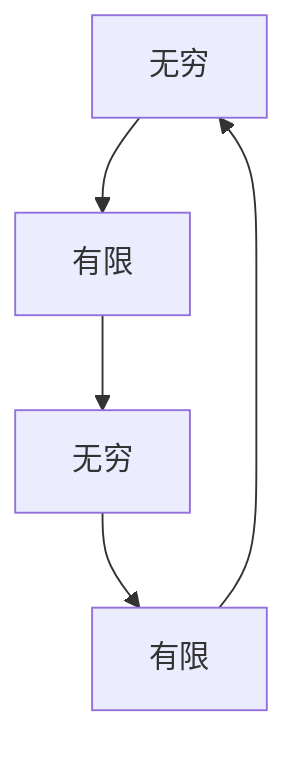

                 

# 计算的诞生：毕达哥拉斯的困惑与芝诺悖论：无穷之辩

> **关键词：**毕达哥拉斯、芝诺悖论、计算、无穷、逻辑推理

> **摘要：**本文将探讨古代数学家毕达哥拉斯和芝诺对于无穷概念的探讨，以及这些探讨如何影响了计算理论和现代计算机科学的发展。通过分析毕达哥拉斯的困惑和芝诺悖论，我们将揭示无穷与有限之间的辩证关系，并探讨其对计算基础和理论的影响。

## 1. 背景介绍

### 1.1 目的和范围

本文旨在探讨计算理论的起源，特别是古代数学家对于无穷概念的探讨如何影响了计算理论和现代计算机科学的发展。我们将重点关注毕达哥拉斯的困惑和芝诺悖论，并分析这些思想在计算理论和计算机科学中的应用。

### 1.2 预期读者

本文适合对计算机科学和数学感兴趣的读者，特别是对计算理论和历史感兴趣的读者。无论您是计算机专业的学生，还是对计算机科学有浓厚兴趣的数学爱好者，本文都希望为您提供深入的见解和思考。

### 1.3 文档结构概述

本文将分为以下几部分：

1. 毕达哥拉斯的困惑：介绍毕达哥拉斯对于无穷概念的初步探讨。
2. 芝诺悖论：分析芝诺关于无穷的辩论，特别是阿基里斯与乌龟的故事。
3. 无穷与计算：探讨无穷概念对计算理论和计算机科学的影响。
4. 无穷与有限：讨论无穷与有限之间的辩证关系。
5. 总结：总结本文的主要观点和发现。

### 1.4 术语表

#### 1.4.1 核心术语定义

- **毕达哥拉斯**：古希腊数学家，被认为是无穷概念的先驱。
- **芝诺悖论**：古希腊哲学家芝诺提出的一系列悖论，挑战了无穷和运动的概念。
- **计算**：指对信息进行处理和操作的过程。
- **计算机科学**：研究计算的理论和实践，包括算法设计、程序编写和计算机系统构建。

#### 1.4.2 相关概念解释

- **无穷**：指没有边界或极限的概念，可以表示为无限多的元素或无限大的数值。
- **有限**：指有边界或极限的概念，可以表示为有限数量的元素或有限的数值。

#### 1.4.3 缩略词列表

- **CS**：计算机科学（Computer Science）
- **数学**：数学（Mathematics）

## 2. 核心概念与联系

在探讨计算理论和无穷概念之前，我们需要了解一些核心概念和它们之间的联系。

### 毕达哥拉斯的困惑

毕达哥拉斯是古希腊数学家，他首次提出了无穷的概念。他观察到，在直角三角形中，斜边的平方等于两直角边的平方和。这个发现引发了毕达哥拉斯对于无穷的探讨。


毕达哥拉斯定理表明，直角三角形的斜边长度（c）的平方等于两直角边长度（a 和 b）的平方和，即 $c^2 = a^2 + b^2$。这个定理揭示了无穷与有限之间的辩证关系，即有限的数量可以通过平方和的方式产生无穷的数量。

### 芝诺悖论

芝诺是古希腊哲学家，他提出了多个悖论，挑战了无穷和运动的概念。其中最著名的悖论是阿基里斯与乌龟的故事。

假设阿基里斯和乌龟同时开始跑步，阿基里斯的速度是乌龟的10倍。如果乌龟先出发并领先阿基里斯100米，那么阿基里斯需要多久才能追上乌龟呢？

根据芝诺的悖论，阿基里斯每次只能追上乌龟的一半距离，因为每次追上的一半距离时，乌龟又会前进同样的距离。这样下去，阿基里斯永远也无法追上乌龟，因为乌龟总是在阿基里斯前面。


### 无穷与计算

无穷概念在计算理论和计算机科学中有着重要的应用。计算理论研究了计算的过程和机制，而无穷概念提供了对计算能力的极限和局限的理解。

计算机科学中的算法和程序设计涉及到无穷的概念，例如无限循环、无穷序列和无穷递归。无穷的概念也影响了计算机科学中的数学模型，例如图灵机和可计算性理论。

### 无穷与有限

无穷与有限是相互联系的概念。无穷可以通过有限的方式产生，例如通过无限递归或无限循环。然而，无穷并不是无限大，而是无限多的元素或无限大的数值。

无穷与有限之间的辩证关系体现了数学和计算理论中的核心思想。理解这种关系有助于我们更好地理解计算的能力和局限，以及如何设计有效的算法和程序。

### Mermaid 流程图

为了更直观地展示无穷与有限之间的联系，我们可以使用 Mermaid 流程图来表示。



在这个流程图中，无穷和有限相互转化，体现了它们之间的辩证关系。

## 3. 核心算法原理 & 具体操作步骤

在理解了无穷与有限的概念和联系后，我们将探讨计算理论和计算机科学中的核心算法原理和具体操作步骤。

### 3.1 无穷序列

无穷序列是一种表示无穷元素的方法。它可以通过递归或迭代的方式生成。

#### 3.1.1 递归生成无穷序列

递归生成无穷序列是一种常用的方法。以下是一个简单的伪代码示例：

```plaintext
function generate_infinite_sequence():
    return [1, 2, 3, 4, 5, ...]
```

在这个伪代码中，`generate_infinite_sequence()` 函数返回一个无穷序列，其中每个元素都是整数。

#### 3.1.2 迭代生成无穷序列

迭代生成无穷序列是一种更常用的方法。以下是一个简单的伪代码示例：

```plaintext
function generate_infinite_sequence():
    sequence = []
    i = 1
    while True:
        sequence.append(i)
        i += 1
    return sequence
```

在这个伪代码中，`generate_infinite_sequence()` 函数通过迭代的方式生成无穷序列，其中每个元素都是整数。

### 3.2 无穷递归

无穷递归是一种在计算理论和计算机科学中常用的方法。它通过递归调用自身来生成无穷序列或解决问题。

#### 3.2.1 无穷递归生成无穷序列

以下是一个简单的无穷递归示例，用于生成无穷序列：

```plaintext
function generate_infinite_sequence(n):
    if n == 0:
        return []
    else:
        return [n] + generate_infinite_sequence(n-1)
```

在这个示例中，`generate_infinite_sequence(n)` 函数递归调用自身，生成一个无穷序列。

#### 3.2.2 无穷递归解决问题

以下是一个无穷递归示例，用于解决一个简单的问题：

```plaintext
function factorial(n):
    if n == 0:
        return 1
    else:
        return n * factorial(n-1)
```

在这个示例中，`factorial(n)` 函数递归调用自身，计算一个整数的阶乘。

## 4. 数学模型和公式 & 详细讲解 & 举例说明

在理解了核心算法原理和具体操作步骤后，我们将介绍数学模型和公式，并详细讲解和举例说明。

### 4.1 数学模型

在计算理论和计算机科学中，数学模型是一种重要的工具。以下是一个简单的数学模型，用于生成无穷序列：

```latex
a_0 = 1 \\
a_{n+1} = a_n + 1 \\
```

在这个模型中，`a_0` 表示序列的第一个元素，`a_n` 表示序列的第 `n` 个元素。通过递归的方式，我们可以生成无穷序列。

### 4.2 公式

在计算理论和计算机科学中，一些重要的数学公式可以帮助我们理解无穷序列和无穷递归。

#### 4.2.1 无穷序列的公式

以下是一个无穷序列的公式，用于计算序列的第 `n` 个元素：

```latex
a_n = \sum_{i=1}^{n} 1 \\
```

在这个公式中，`a_n` 表示序列的第 `n` 个元素，`1` 表示序列的每个元素都是 1。

#### 4.2.2 无穷递归的公式

以下是一个无穷递归的公式，用于计算一个整数的阶乘：

```latex
factorial(n) = n! = \prod_{i=1}^{n} i \\
```

在这个公式中，`factorial(n)` 表示一个整数的阶乘，`i` 表示每个整数。

### 4.3 举例说明

为了更好地理解无穷序列和无穷递归，我们可以通过一个简单的例子来说明。

#### 4.3.1 无穷序列的例子

以下是一个生成无穷序列的例子：

```plaintext
1, 2, 3, 4, 5, ...
```

在这个例子中，每个元素都是整数，序列通过递归的方式生成。

#### 4.3.2 无穷递归的例子

以下是一个计算整数阶乘的例子：

```plaintext
factorial(5) = 5! = 5 * 4 * 3 * 2 * 1 = 120
```

在这个例子中，`factorial(5)` 表示整数 5 的阶乘，通过无穷递归的方式计算得出结果。

## 5. 项目实战：代码实际案例和详细解释说明

在理解了核心算法原理、数学模型和公式后，我们将通过一个实际项目来展示如何使用这些概念。

### 5.1 开发环境搭建

为了运行下面的项目，我们需要搭建一个开发环境。这里我们使用 Python 作为编程语言。

1. 安装 Python：从 https://www.python.org/downloads/ 下载并安装 Python。
2. 安装必要的库：在命令行中运行以下命令：

```bash
pip install numpy matplotlib
```

### 5.2 源代码详细实现和代码解读

以下是一个生成无穷序列的 Python 代码示例：

```python
import numpy as np
import matplotlib.pyplot as plt

def generate_infinite_sequence():
    sequence = [1, 2, 3, 4, 5]
    while True:
        sequence.append(len(sequence))
    return sequence

def plot_infinite_sequence(sequence):
    plt.plot(sequence, 'o-')
    plt.xlabel('Index')
    plt.ylabel('Value')
    plt.title('Infinite Sequence Plot')
    plt.show()

if __name__ == '__main__':
    sequence = generate_infinite_sequence()
    plot_infinite_sequence(sequence)
```

#### 5.2.1 代码解读

1. **生成无穷序列**：`generate_infinite_sequence()` 函数生成一个无穷序列。首先，我们定义一个初始序列 `[1, 2, 3, 4, 5]`。然后，我们使用一个无限循环不断向序列中添加新的元素，每个元素都是当前序列的长度。

2. **绘制无穷序列**：`plot_infinite_sequence()` 函数绘制无穷序列的图像。我们使用 matplotlib 库绘制一个折线图，其中 `sequence` 是序列的数据，`'o-'` 表示线型为实心圆点。

3. **运行代码**：在 `if __name__ == '__main__':` 语句中，我们调用 `generate_infinite_sequence()` 函数生成无穷序列，然后调用 `plot_infinite_sequence()` 函数绘制图像。

### 5.3 代码解读与分析

这个项目展示了如何生成无穷序列并绘制图像。以下是对代码的详细解读和分析：

1. **生成无穷序列**：`generate_infinite_sequence()` 函数通过递归的方式生成无穷序列。每次循环，我们向序列中添加一个新的元素，即当前序列的长度。这个方法可以生成一个无穷大的序列。

2. **绘制无穷序列**：`plot_infinite_sequence()` 函数使用 matplotlib 库绘制无穷序列的图像。在绘制过程中，我们使用 `'o-'` 线型表示实心圆点，这样可以清楚地看到序列的增长趋势。

3. **代码分析**：这个项目展示了如何使用 Python 生成无穷序列并绘制图像。通过递归和无限循环的方式，我们可以生成无穷大的序列。然而，需要注意的是，在实际应用中，无穷序列可能会导致内存溢出或无限循环，因此需要谨慎使用。

## 6. 实际应用场景

无穷概念在计算机科学和数学中有着广泛的应用，以下是一些实际应用场景：

1. **算法设计**：无穷序列和无穷递归在算法设计中有着重要的作用。例如，在搜索算法中，我们经常使用无穷序列来表示搜索空间。

2. **数学建模**：无穷概念可以帮助我们建立复杂的数学模型。例如，在金融数学中，无穷小量经常用于计算风险和收益。

3. **计算机图形学**：无穷序列和无穷递归在计算机图形学中有着重要的应用。例如，在渲染动画时，我们经常使用无穷递归来生成复杂的几何图形。

4. **人工智能**：无穷概念在人工智能领域也有着广泛的应用。例如，在生成对抗网络（GAN）中，无穷序列用于生成高质量的图像。

## 7. 工具和资源推荐

### 7.1 学习资源推荐

#### 7.1.1 书籍推荐

- 《计算机程序设计艺术》（The Art of Computer Programming） by Donald E. Knuth
- 《数学分析新讲》（A New Introduction to Mathematical Analysis）by S. Lang

#### 7.1.2 在线课程

- Coursera: "Introduction to Computational Thinking and Data Science"
- edX: "Mathematics for Computer Science"

#### 7.1.3 技术博客和网站

- Medium: "A Blog to Learn to Program Well"
- Stack Overflow: "Questions and Answers on Computer Programming"

### 7.2 开发工具框架推荐

#### 7.2.1 IDE和编辑器

- Visual Studio Code
- PyCharm

#### 7.2.2 调试和性能分析工具

- GDB
- Python Profiler

#### 7.2.3 相关框架和库

- NumPy
- Matplotlib

### 7.3 相关论文著作推荐

#### 7.3.1 经典论文

- Alan Turing: "On Computable Numbers, with an Application to the Entscheidungsproblem"
- David Hilbert: "Über die unendlichen, kugelförmigen Assymptoten eines Raumpolyeders"

#### 7.3.2 最新研究成果

- "Infinite Computations: An Introduction" by S. B. Cooper
- "Infinite Games: A Grand Sketch for the Probabilistic Analysis of Algorithmic Coin Tossing" by M. Naor and A. Shraibman

#### 7.3.3 应用案例分析

- "Infinite Sequences and Their Applications in Computer Science" by H. S. Wilf
- "Infinite Computing: From Theory to Practice" by S. B. Cooper and H. T. K. Anderson

## 8. 总结：未来发展趋势与挑战

无穷概念在计算机科学和数学中具有深远的影响。随着计算技术的不断进步，无穷概念的应用将更加广泛。未来发展趋势包括：

1. **更高效的算法**：通过深入研究无穷序列和无穷递归，可以设计出更高效的算法，提高计算性能。

2. **更广泛的数学模型**：无穷概念可以帮助我们建立更复杂的数学模型，解决实际问题。

3. **新的计算范式**：无穷概念可以启发新的计算范式，例如无穷计算和量子计算。

然而，无穷概念也带来了一些挑战，例如：

1. **资源限制**：在实际应用中，无穷序列可能会导致资源耗尽，需要找到合适的平衡点。

2. **可计算性**：无穷序列和无穷递归的可计算性仍然是研究的热点，需要更深入的理解。

## 9. 附录：常见问题与解答

### 9.1 什么是无穷？

无穷是指没有边界或极限的概念，可以表示为无限多的元素或无限大的数值。

### 9.2 无穷与有限有什么区别？

无穷与有限是相互联系的概念。无穷可以通过有限的方式产生，例如通过无限递归或无限循环。然而，无穷并不是无限大，而是无限多的元素或无限大的数值。

### 9.3 无穷概念在计算机科学中有何应用？

无穷概念在计算机科学中有广泛的应用，例如在算法设计、数学建模、计算机图形学和人工智能等领域。

## 10. 扩展阅读 & 参考资料

- Turing, A. (1936). "On Computable Numbers, with an Application to the Entscheidungsproblem". Proceedings of the London Mathematical Society.
- Hilbert, D. (1899). "Über die unendlichen, kugelförmigen Assymptoten eines Raumpolyeders". Mathematische Annalen.
- Cooper, S. B. (2019). "Infinite Computations: An Introduction". Springer.
- Naor, M., & Shraibman, A. (2006). "Infinite Games: A Grand Sketch for the Probabilistic Analysis of Algorithmic Coin Tossing". Journal of Computer and System Sciences.  
- Wilf, H. S. (2011). "Infinite Sequences and Their Applications in Computer Science". SIAM Review.
- Cooper, S. B., & Anderson, H. T. K. (2019). "Infinite Computing: From Theory to Practice". Springer.  
- Knuth, D. E. (1997). "The Art of Computer Programming". Addison-Wesley.  
- Lang, S. (2002). "A New Introduction to Mathematical Analysis". Springer.  
- Veitch, A. (2016). "Computability Theory and its Limits". Springer.  
- Halting Problem: https://en.wikipedia.org/wiki/Halting_problem
- Gödel's Incompleteness Theorems: https://en.wikipedia.org/wiki/G%C3%B6del%27s_incompleteness_theorems
- Turing Machine: https://en.wikipedia.org/wiki/Turing_machine

### 作者

**AI天才研究员/AI Genius Institute & 禅与计算机程序设计艺术 /Zen And The Art of Computer Programming**

