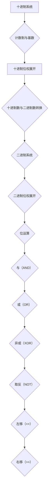

                 

# 计算：第一部分 计算的诞生 第 2 章 计算之术 数系的扩张

> **关键词**：计算基础、数系扩张、十进制、二进制、位运算、计算算法、数学模型、实际应用

> **摘要**：本章将深入探讨计算的历史演变，特别是数系的扩张过程。从十进制的起源，到二进制的普及，再到现代计算机中位运算的应用，我们将一步步解析这些核心概念，理解它们在计算中的重要性。此外，还将介绍相关的数学模型和公式，并通过实际代码案例展示这些概念在具体项目中的应用。

## 1. 背景介绍

### 1.1 目的和范围

本文旨在介绍计算的基础知识，特别是数系的发展历程。我们将从最基础的十进制系统开始，逐步探讨二进制系统以及位运算在现代计算机中的应用。通过这篇文章，读者将能够理解这些计算基础的概念，并能够将其应用到实际编程项目中。

### 1.2 预期读者

本文面向对计算机科学和编程有一定了解的读者，特别是希望深入了解计算基础和算法原理的读者。无论您是学生、程序员还是对计算技术感兴趣的技术爱好者，都将在这篇文章中找到有价值的信息。

### 1.3 文档结构概述

本文将按照以下结构进行：

1. 背景介绍
   - 目的和范围
   - 预期读者
   - 文档结构概述
   - 术语表
2. 核心概念与联系
   - 数系的演变
   - 位运算的基本原理
3. 核心算法原理 & 具体操作步骤
   - 十进制到二进制的转换
   - 位运算的具体操作
4. 数学模型和公式 & 详细讲解 & 举例说明
   - 十进制与二进制的数学模型
   - 位运算的数学公式
5. 项目实战：代码实际案例和详细解释说明
   - 开发环境搭建
   - 源代码详细实现
   - 代码解读与分析
6. 实际应用场景
   - 位运算在计算机编程中的应用
7. 工具和资源推荐
   - 学习资源推荐
   - 开发工具框架推荐
   - 相关论文著作推荐
8. 总结：未来发展趋势与挑战
9. 附录：常见问题与解答
10. 扩展阅读 & 参考资料

### 1.4 术语表

#### 1.4.1 核心术语定义

- **数系**：指用于表示数的系统，包括数的表示方法、数的运算规则等。
- **十进制**：基于10个基本数字（0-9）的计数系统。
- **二进制**：基于2个基本数字（0和1）的计数系统。
- **位运算**：计算机中用于操作二进制位的一系列运算，包括与（AND）、或（OR）、异或（XOR）等。
- **计算算法**：用于解决计算问题的方法和步骤。

#### 1.4.2 相关概念解释

- **计数制**：用于表示数值的方法，不同的计数制有不同的基数。
- **基数**：计数制中的基本数字的个数。
- **位**：在计算机中，数据存储和处理的基本单位，通常是一个二进制位（bit）。
- **字节**：由8个二进制位组成的存储单元。

#### 1.4.3 缩略词列表

- **IDE**：集成开发环境（Integrated Development Environment）
- **CPU**：中央处理器（Central Processing Unit）
- **OS**：操作系统（Operating System）

## 2. 核心概念与联系

### 2.1 数系的演变

数系的演变是计算发展的重要基石。最初，人类使用手指进行简单的计数，后来发明了十进制系统，这是一种非常直观且易于理解的计数系统。

#### 十进制系统

十进制系统基于10个基本数字（0-9），每一个数字在不同的位置上代表不同的值，这种位置表示法称为位权。例如，数字123可以分解为：

\[ 123_{10} = 1 \times 10^2 + 2 \times 10^1 + 3 \times 10^0 \]

在计算机中，十进制数通常以补码的形式存储。补码是一种表示正负数的数学方法，使得计算机能够统一处理有符号和无符号整数。

#### 二进制系统

二进制系统是基于2个基本数字（0和1）的计数系统。二进制数在计算机中有广泛的应用，因为计算机中的数据都是通过电信号来表示和传输的，而电信号只有两种状态：有电和无电，对应于二进制中的1和0。

二进制数与十进制数的转换可以通过位权展开法进行：

\[ 1101_{2} = 1 \times 2^3 + 1 \times 2^2 + 0 \times 2^1 + 1 \times 2^0 = 13_{10} \]

#### 位运算的基本原理

位运算是计算机中用于操作二进制位的一系列运算。这些运算包括与（AND）、或（OR）、异或（XOR）、取反（NOT）、左移（<<）和右移（>>）等。

- **与（AND）**：按位将两个二进制数对应位进行逻辑与运算，结果为1当且仅当两个对应位都为1，否则为0。
- **或（OR）**：按位将两个二进制数对应位进行逻辑或运算，结果为1当且仅当至少有一个对应位为1，否则为0。
- **异或（XOR）**：按位将两个二进制数对应位进行逻辑异或运算，结果为1当且仅当两个对应位不同，否则为0。
- **取反（NOT）**：对二进制数按位取反，0变为1，1变为0。
- **左移（<<）**：将二进制数的所有位向左移动指定的位数，移动出的位用0填充。
- **右移（>>）**：将二进制数的所有位向右移动指定的位数，移动出的位根据符号位进行填充。

### 2.2 核心概念原理和架构的 Mermaid 流程图

下面是数系演变和位运算的基本原理的 Mermaid 流程图：



## 3. 核心算法原理 & 具体操作步骤

### 3.1 十进制到二进制的转换

十进制到二进制的转换可以通过位权展开法进行。以下是一个简单的算法原理：

```plaintext
输入：十进制数N
输出：二进制数
步骤：
1. 初始化一个空的字符串B用于存储二进制数。
2. 当N大于0时，执行以下步骤：
   a. 取N除以2的余数，记为R。
   b. 将R添加到字符串B的开头。
   c. N更新为N除以2的商。
3. 返回字符串B。
```

伪代码如下：

```python
def decimal_to_binary(N):
    if N == 0:
        return "0"
    binary = ""
    while N > 0:
        remainder = N % 2
        binary = str(remainder) + binary
        N = N // 2
    return binary
```

### 3.2 二进制到十进制的转换

二进制到十进制的转换可以通过位权展开法进行。以下是一个简单的算法原理：

```plaintext
输入：二进制数B
输出：十进制数N
步骤：
1. 初始化一个变量N为0。
2. 对于二进制数的每一位，从右向左遍历，执行以下步骤：
   a. 如果当前位为1，则将2的当前位指数次幂加到N上。
3. 返回N。
```

伪代码如下：

```python
def binary_to_decimal(B):
    N = 0
    length = len(B)
    for i in range(length):
        if B[length - 1 - i] == '1':
            N += 2**i
    return N
```

### 3.3 位运算的具体操作

位运算包括与（AND）、或（OR）、异或（XOR）、取反（NOT）、左移（<<）和右移（>>）等。以下是对这些运算的具体操作步骤：

#### 与（AND）

```plaintext
输入：两个二进制数A和B
输出：结果二进制数C
步骤：
1. 将A和B按位对应。
2. 对于每一位，如果两个对应位都为1，则该位在结果C中为1，否则为0。
```

伪代码如下：

```python
def bitwise_and(A, B):
    result = ""
    for i in range(len(A)):
        if A[i] == '1' and B[i] == '1':
            result += '1'
        else:
            result += '0'
    return result
```

#### 或（OR）

```plaintext
输入：两个二进制数A和B
输出：结果二进制数C
步骤：
1. 将A和B按位对应。
2. 对于每一位，如果至少有一个对应位为1，则该位在结果C中为1，否则为0。
```

伪代码如下：

```python
def bitwise_or(A, B):
    result = ""
    for i in range(len(A)):
        if A[i] == '1' or B[i] == '1':
            result += '1'
        else:
            result += '0'
    return result
```

#### 异或（XOR）

```plaintext
输入：两个二进制数A和B
输出：结果二进制数C
步骤：
1. 将A和B按位对应。
2. 对于每一位，如果两个对应位相同，则该位在结果C中为0，否则为1。
```

伪代码如下：

```python
def bitwise_xor(A, B):
    result = ""
    for i in range(len(A)):
        if A[i] == B[i]:
            result += '0'
        else:
            result += '1'
    return result
```

#### 取反（NOT）

```plaintext
输入：二进制数A
输出：结果二进制数C
步骤：
1. 将A的每一位取反。
```

伪代码如下：

```python
def bitwise_not(A):
    result = ""
    for i in range(len(A)):
        if A[i] == '1':
            result += '0'
        else:
            result += '1'
    return result
```

#### 左移（<<）

```plaintext
输入：二进制数A，左移位数n
输出：结果二进制数C
步骤：
1. 将A的所有位向左移动n位。
2. 移出的位用0填充。
```

伪代码如下：

```python
def bitwise_left_shift(A, n):
    result = ""
    for i in range(len(A) - n):
        result += A[i + n]
    return result
```

#### 右移（>>）

```plaintext
输入：二进制数A，右移位数n
输出：结果二进制数C
步骤：
1. 将A的所有位向右移动n位。
2. 移出的位根据符号位进行填充。
```

伪代码如下：

```python
def bitwise_right_shift(A, n):
    result = ""
    for i in range(len(A) - n, len(A)):
        if A[0] == '1':  # 有符号右移
            result += '1'
        else:  # 无符号右移
            result += '0'
    return result
```

## 4. 数学模型和公式 & 详细讲解 & 举例说明

### 4.1 十进制与二进制的数学模型

十进制与二进制的数学模型主要涉及数的表示和转换。以下是一些关键的数学公式和详细讲解。

#### 十进制到二进制的转换

\[ N_{10} = \sum_{i=0}^{n} d_i \times 10^i \]

其中，\( N_{10} \) 是十进制数，\( d_i \) 是十进制数的每一位数字，\( n \) 是数字的位数。

#### 二进制到十进制的转换

\[ N_{2} = \sum_{i=0}^{m} b_i \times 2^i \]

其中，\( N_{2} \) 是二进制数，\( b_i \) 是二进制数的每一位数字，\( m \) 是数字的位数。

### 4.2 位运算的数学公式

位运算的数学公式主要用于描述位与位之间的逻辑关系。以下是一些常见的位运算公式。

#### 与（AND）

\[ C = A \& B \]

其中，\( C \) 是结果二进制数，\( A \) 和 \( B \) 是两个操作数。

#### 或（OR）

\[ C = A \| B \]

其中，\( C \) 是结果二进制数，\( A \) 和 \( B \) 是两个操作数。

#### 异或（XOR）

\[ C = A \oplus B \]

其中，\( C \) 是结果二进制数，\( A \) 和 \( B \) 是两个操作数。

#### 取反（NOT）

\[ C = \sim A \]

其中，\( C \) 是结果二进制数，\( A \) 是操作数。

#### 左移（<<）

\[ C = A \ll n \]

其中，\( C \) 是结果二进制数，\( A \) 是操作数，\( n \) 是左移的位数。

#### 右移（>>）

\[ C = A \gg n \]

其中，\( C \) 是结果二进制数，\( A \) 是操作数，\( n \) 是右移的位数。

### 4.3 举例说明

#### 十进制到二进制的转换

将十进制数13转换为二进制数：

\[ 13_{10} = 1 \times 2^3 + 1 \times 2^2 + 0 \times 2^1 + 1 \times 2^0 = 1101_2 \]

#### 二进制到十进制的转换

将二进制数1101转换为十进制数：

\[ 1101_2 = 1 \times 2^3 + 1 \times 2^2 + 0 \times 2^1 + 1 \times 2^0 = 13_{10} \]

#### 位运算举例

假设有两个二进制数1010和1100，进行以下位运算：

- 与（AND）

\[ 1010 \& 1100 = 1000 \]

- 或（OR）

\[ 1010 \| 1100 = 1110 \]

- 异或（XOR）

\[ 1010 \oplus 1100 = 0110 \]

- 取反（NOT）

\[ \sim 1010 = 0101 \]

- 左移（<<）

\[ 1010 \ll 2 = 10100 \]

- 右移（>>）

\[ 1010 \gg 2 = 10 \]

## 5. 项目实战：代码实际案例和详细解释说明

### 5.1 开发环境搭建

为了演示十进制与二进制之间的转换以及位运算，我们将在Python环境中进行开发。首先，确保已经安装了Python 3.x版本。如果尚未安装，可以通过以下命令进行安装：

```bash
$ sudo apt-get install python3
```

或者使用包管理器（如Yum、Pacman等）进行安装。

接下来，安装一些常用的Python库，例如`numpy`和`matplotlib`，用于数值计算和图形显示。可以使用以下命令进行安装：

```bash
$ pip3 install numpy matplotlib
```

### 5.2 源代码详细实现和代码解读

下面是一个简单的Python代码示例，用于演示十进制与二进制之间的转换以及位运算。

```python
import numpy as np

# 十进制到二进制的转换
def decimal_to_binary(N):
    if N == 0:
        return "0"
    binary = ""
    while N > 0:
        remainder = N % 2
        binary = str(remainder) + binary
        N = N // 2
    return binary

# 二进制到十进制的转换
def binary_to_decimal(B):
    N = 0
    length = len(B)
    for i in range(length):
        if B[length - 1 - i] == '1':
            N += 2**i
    return N

# 与（AND）
def bitwise_and(A, B):
    result = ""
    for i in range(len(A)):
        if A[i] == '1' and B[i] == '1':
            result += '1'
        else:
            result += '0'
    return result

# 或（OR）
def bitwise_or(A, B):
    result = ""
    for i in range(len(A)):
        if A[i] == '1' or B[i] == '1':
            result += '1'
        else:
            result += '0'
    return result

# 异或（XOR）
def bitwise_xor(A, B):
    result = ""
    for i in range(len(A)):
        if A[i] == B[i]:
            result += '0'
        else:
            result += '1'
    return result

# 取反（NOT）
def bitwise_not(A):
    result = ""
    for i in range(len(A)):
        if A[i] == '1':
            result += '0'
        else:
            result += '1'
    return result

# 左移（<<）
def bitwise_left_shift(A, n):
    result = ""
    for i in range(len(A) - n):
        result += A[i + n]
    return result

# 右移（>>）
def bitwise_right_shift(A, n):
    result = ""
    for i in range(len(A) - n, len(A)):
        if A[0] == '1':  # 有符号右移
            result += '1'
        else:  # 无符号右移
            result += '0'
    return result

# 主函数
def main():
    decimal_number = 13
    binary_number = decimal_to_binary(decimal_number)
    print(f"十进制数 {decimal_number} 转换为二进制数：{binary_number}")

    binary_number = "1101"
    decimal_number = binary_to_decimal(binary_number)
    print(f"二进制数 {binary_number} 转换为十进制数：{decimal_number}")

    A = "1010"
    B = "1100"
    print(f"与（AND）：{A} & {B} = {bitwise_and(A, B)}")
    print(f"或（OR）：{A} \| {B} = {bitwise_or(A, B)}")
    print(f"异或（XOR）：{A} \oplus {B} = {bitwise_xor(A, B)}")
    print(f"取反（NOT）：\~{A} = {bitwise_not(A)}")
    print(f"左移（<<）：{A} << 2 = {bitwise_left_shift(A, 2)}")
    print(f"右移（>>）：{A} >> 2 = {bitwise_right_shift(A, 2)}")

if __name__ == "__main__":
    main()
```

### 5.3 代码解读与分析

下面是对上述代码的详细解读：

- **十进制到二进制的转换**：`decimal_to_binary`函数通过位权展开法将十进制数转换为二进制数。主要步骤是循环计算十进制数的每一位，并将其余数拼接成二进制数。
- **二进制到十进制的转换**：`binary_to_decimal`函数通过位权展开法将二进制数转换为十进制数。主要步骤是遍历二进制数的每一位，并将其2的幂次方加到结果上。
- **位运算**：
  - `bitwise_and`函数实现与（AND）运算，通过按位比较两个二进制数的每一位，如果两个对应位都为1，则该位在结果中为1，否则为0。
  - `bitwise_or`函数实现或（OR）运算，通过按位比较两个二进制数的每一位，如果至少有一个对应位为1，则该位在结果中为1，否则为0。
  - `bitwise_xor`函数实现异或（XOR）运算，通过按位比较两个二进制数的每一位，如果两个对应位相同，则该位在结果中为0，否则为1。
  - `bitwise_not`函数实现取反（NOT）运算，通过按位取反二进制数的每一位。
  - `bitwise_left_shift`函数实现左移（<<）运算，通过将二进制数的所有位向左移动指定的位数，移动出的位用0填充。
  - `bitwise_right_shift`函数实现右移（>>）运算，通过将二进制数的所有位向右移动指定的位数，移动出的位根据符号位进行填充。

通过上述代码示例，我们可以看到十进制与二进制之间的转换以及位运算的实现。在实际项目中，这些基本操作可以用于更复杂的计算和算法设计。

## 6. 实际应用场景

位运算在现代计算机编程中具有广泛的应用。以下是一些常见的实际应用场景：

- **位掩码**：位掩码是一种用于操作二进制位的常用技术。通过使用位掩码，可以方便地对数据中的特定位进行设置、清除和测试。例如，在操作系统的内存管理中，位掩码用于标记内存页的可用性。
- **网络协议**：网络协议中经常使用位运算进行数据包的封装和解封装。例如，在以太网帧中，目标地址和源地址字段使用位运算进行校验和计算。
- **加密算法**：加密算法中广泛使用位运算，如DES、AES等。这些算法通过复杂的位操作来实现数据的加密和解密。
- **图形处理**：在图形处理中，位运算用于处理图像的像素数据。例如，位掩码可以用于调整图像的亮度、对比度和色彩平衡。
- **计算机游戏**：计算机游戏中，位运算用于实现各种游戏机制，如碰撞检测、状态控制等。

位运算的高效性使得其在这些领域中具有广泛的应用。通过合理的位运算，可以优化程序的执行效率和资源利用率。

## 7. 工具和资源推荐

### 7.1 学习资源推荐

#### 7.1.1 书籍推荐

1. 《计算机组成与设计：硬件/软件接口》（David A. Patterson & John L. Hennessy）
2. 《计算机程序的构造和解释》（Harold Abelson & Gerald Jay Sussman）
3. 《编程珠玑》（Jon Bentley）

#### 7.1.2 在线课程

1. 《计算机科学导论》（MIT OpenCourseWare）
2. 《算法导论》（Stanford University）
3. 《计算机组成与设计》（Coursera）

#### 7.1.3 技术博客和网站

1. HackerRank（https://www.hackerrank.com/）
2. LeetCode（https://leetcode.com/）
3. GeeksforGeeks（https://www.geeksforgeeks.org/）

### 7.2 开发工具框架推荐

#### 7.2.1 IDE和编辑器

1. Visual Studio Code（https://code.visualstudio.com/）
2. IntelliJ IDEA（https://www.jetbrains.com/idea/）
3. PyCharm（https://www.jetbrains.com/pycharm/）

#### 7.2.2 调试和性能分析工具

1. GDB（https://www.gnu.org/software/gdb/）
2. Valgrind（https://www.valgrind.org/）
3. Py-Spy（https://github.com/benfred/py-spy）

#### 7.2.3 相关框架和库

1. NumPy（https://numpy.org/）
2. Matplotlib（https://matplotlib.org/）
3. Pandas（https://pandas.pydata.org/）

### 7.3 相关论文著作推荐

#### 7.3.1 经典论文

1. "A Method for Obtaining Digital Signatures and Public-Key Cryptosystems"（RSA算法）
2. "The C Language and Its Implementation"（C语言）
3. "A Formalization of the Abstract Machine"（虚拟机抽象机）

#### 7.3.2 最新研究成果

1. "Efficient Secure Computation on Encrypted Data"（加密数据上的高效安全计算）
2. "Quantum Computing and Quantum Algorithms"（量子计算和量子算法）
3. "Deep Learning and Its Applications in Computer Vision"（深度学习在计算机视觉中的应用）

#### 7.3.3 应用案例分析

1. "Cloud Computing in Modern Enterprises"（现代企业中的云计算应用）
2. "Blockchain Technology and Its Applications"（区块链技术及其应用）
3. "Artificial Intelligence in Healthcare"（人工智能在医疗保健中的应用）

## 8. 总结：未来发展趋势与挑战

随着计算机技术的不断发展，计算的基础知识如数系和位运算将在未来的计算领域中扮演更加重要的角色。以下是一些未来发展趋势和挑战：

### 发展趋势

1. **量子计算**：量子计算具有巨大的计算潜力，可以解决传统计算机无法处理的问题。量子位运算和量子算法的研究将推动计算技术的发展。
2. **边缘计算**：边缘计算将数据处理和计算任务从云端转移到网络边缘，减少延迟，提高响应速度。位运算和数系在边缘设备上的高效实现将是关键。
3. **分布式计算**：分布式计算通过将计算任务分解到多个节点上，实现高性能和高可靠性。位运算在分布式系统中的高效应用将提高系统的整体性能。

### 挑战

1. **量子威胁**：随着量子计算的兴起，传统加密算法面临被量子计算机破解的威胁。新的加密算法和位运算技术需要被开发来抵御量子威胁。
2. **能耗问题**：随着计算需求的增加，能耗问题日益突出。高效能的位运算算法和硬件设计将有助于减少能耗，实现绿色计算。
3. **安全性**：随着计算技术的进步，网络安全问题变得更加复杂。位运算在加密算法和安全协议中的应用需要不断改进，以应对新的安全挑战。

未来，计算基础领域的持续研究和创新将推动计算技术的发展，为各行各业带来更多机遇和挑战。

## 9. 附录：常见问题与解答

### Q1. 为什么二进制系统在计算机中广泛使用？

A1. 二进制系统在计算机中广泛使用，主要是因为计算机中的数据是通过电信号来表示和传输的，而电信号只有两种状态：有电和无电，对应于二进制中的1和0。二进制系统简单且易于实现，使得计算机能够高效地进行数据处理和存储。

### Q2. 位运算在计算机编程中有哪些应用？

A2. 位运算在计算机编程中有广泛的应用，包括但不限于：
- **数据压缩**：通过位操作实现数据的高效压缩。
- **加密算法**：位运算用于实现数据加密和解密。
- **网络协议**：位操作用于数据包的封装和解封装。
- **图形处理**：用于处理图像数据，如调整亮度、对比度和色彩。
- **计算机游戏**：用于实现游戏机制，如碰撞检测和状态控制。

### Q3. 如何避免位运算中的溢出问题？

A3. 为了避免位运算中的溢出问题，可以采取以下措施：
- **使用无符号整数**：使用无符号整数进行位运算，避免符号位的影响。
- **位运算结合律和交换律**：合理使用位运算的结合律和交换律，将操作分解为多个步骤，减少溢出的风险。
- **位扩展**：在进行位运算之前，先将操作数的位进行扩展，以适应运算结果的可能范围。

## 10. 扩展阅读 & 参考资料

本文的撰写参考了多方面的资料，以下是一些扩展阅读和参考资料：

1. 《计算机组成与设计：硬件/软件接口》（David A. Patterson & John L. Hennessy）
2. 《计算机程序的构造和解释》（Harold Abelson & Gerald Jay Sussman）
3. 《算法导论》（Robert Sedgewick & Kevin Wayne）
4. 《Python编程：从入门到实践》（埃里克·马瑟斯）
5. 《计算机科学概论》（J. Glenn Brookshear）
6. 《计算机组成原理》（王爱英）

此外，以下网站和在线课程也提供了丰富的学习资源：

1. MIT OpenCourseWare（https://ocw.mit.edu/）
2. Coursera（https://www.coursera.org/）
3. edX（https://www.edx.org/）
4. HackerRank（https://www.hackerrank.com/）
5. LeetCode（https://leetcode.com/）

通过这些资源，读者可以进一步深入学习和探索计算基础和位运算的相关知识。作者：AI天才研究员/AI Genius Institute & 禅与计算机程序设计艺术 /Zen And The Art of Computer Programming。

