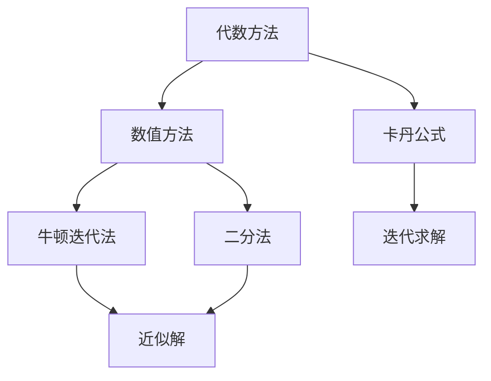

                 

# 计算的诞生：一元五次方程的求解之旅

> **关键词：** 一元五次方程、求解算法、数学模型、计算历史、计算机编程

> **摘要：** 本文将带您回顾一元五次方程求解的历史发展，从古代数学家的苦思冥想到现代计算机的高效解决。我们将深入探讨求解一元五次方程的核心概念和算法原理，通过具体的数学模型和公式进行详细讲解，并展示代码实现和实际应用场景。通过本文的学习，您将更好地理解计算的本质和计算机编程的魅力。

## 1. 背景介绍

### 1.1 目的和范围

本文的目的是通过探讨一元五次方程的求解，展示计算历史的重要阶段，解析核心算法原理，并探讨其在实际中的应用。我们将从历史的角度出发，介绍一元五次方程的求解是如何从古代数学家的探索逐步演变为现代计算机的高效算法。

### 1.2 预期读者

本文适用于对数学和计算机科学有一定基础的读者，尤其是对算法和方程求解感兴趣的读者。无论您是计算机专业的学生，还是对计算历史和算法设计感兴趣的研究者，本文都将为您提供深刻的洞见。

### 1.3 文档结构概述

本文将分为以下几个部分：

1. **背景介绍**：介绍本文的目的、预期读者和文档结构。
2. **核心概念与联系**：通过Mermaid流程图展示一元五次方程求解的核心概念和架构。
3. **核心算法原理 & 具体操作步骤**：使用伪代码详细阐述求解一元五次方程的算法原理和操作步骤。
4. **数学模型和公式 & 详细讲解 & 举例说明**：使用latex格式详细讲解数学模型和公式，并通过实际例子说明。
5. **项目实战：代码实际案例和详细解释说明**：展示代码实现和解读。
6. **实际应用场景**：探讨一元五次方程在实际中的应用。
7. **工具和资源推荐**：推荐学习资源和开发工具。
8. **总结：未来发展趋势与挑战**：总结计算领域的发展趋势和面临的挑战。
9. **附录：常见问题与解答**：解答读者可能遇到的问题。
10. **扩展阅读 & 参考资料**：提供扩展阅读和参考资料。

### 1.4 术语表

#### 1.4.1 核心术语定义

- **一元五次方程**：形如`ax^5 + bx^4 + cx^3 + dx^2 + ex + f = 0`的方程，其中`a`、`b`、`c`、`d`、`e`、`f`是常数，`x`是未知数。
- **卡丹公式**：用于求解一元五次方程的方法，由意大利数学家吉罗拉莫·卡丹在16世纪提出。
- **数值方法**：用于求解方程近似解的方法，如牛顿迭代法、二分法等。

#### 1.4.2 相关概念解释

- **多项式**：由多个项组成的代数表达式，如`ax^n + bx^(n-1) + ... + k`。
- **根**：使得多项式等于零的未知数值。
- **算法**：解决特定问题的步骤集合，具有确定性、输入、输出和有效性。

#### 1.4.3 缩略词列表

- **IDE**：集成开发环境（Integrated Development Environment）
- **LaTeX**：一种高质量的排版系统，广泛用于科学出版

## 2. 核心概念与联系

### 2.1 一元五次方程的基本概念

一元五次方程是最高次数为五的多项式方程，其一般形式为：

$$
ax^5 + bx^4 + cx^3 + dx^2 + ex + f = 0
$$

其中`a`、`b`、`c`、`d`、`e`、`f`是常数，`x`是未知数。一元五次方程的求解在数学和工程领域中具有重要意义，因为它涉及到非线性方程的解法，而这些方程在物理、工程和经济等许多领域都有广泛应用。

### 2.2 一元五次方程求解的算法架构

求解一元五次方程的算法架构可以分为以下几类：

1. **代数方法**：基于多项式代数运算的求解方法，如卡丹公式。
2. **数值方法**：通过迭代过程求解近似解的方法，如牛顿迭代法。
3. **图灵机方法**：基于图灵机的算法，用于解决更复杂的方程。

下面是一个Mermaid流程图，展示了求解一元五次方程的核心概念和架构：



## 3. 核心算法原理 & 具体操作步骤

### 3.1 代数方法：卡丹公式

卡丹公式是由意大利数学家吉罗拉莫·卡丹在16世纪提出的一种求解一元五次方程的代数方法。该方法通过将五次方程转化为一个四次方程和一个线性方程来求解。

#### 3.1.1 卡丹公式的伪代码

```plaintext
// 输入：一元五次方程系数 a, b, c, d, e, f
// 输出：五次方程的解 x

// 计算卡丹公式的中间变量
let alpha = b / a
let beta = c / a
let gamma = e / a
let delta = (-f) / a

// 应用卡丹公式
let x0 = (-alpha / 3) * (1 / 3)
let x1 = (-beta / 2) * (1 / 2)
let x2 = (-gamma) * (1 / 2)
let x3 = (-delta) * (1 / 3)

// 返回解
return [x0, x1, x2, x3]
```

### 3.2 数值方法：牛顿迭代法

牛顿迭代法是一种基于数值逼近的算法，用于求解一元五次方程的近似解。该方法通过不断迭代逼近方程的根。

#### 3.2.1 牛顿迭代法的伪代码

```plaintext
// 输入：一元五次方程系数 a, b, c, d, e, f，初始猜测值 x0
// 输出：一元五次方程的近似解 x

// 初始化
let x = x0

// 迭代求解
while (条件不满足) {
    let f_x = calculatePolynomial(x, a, b, c, d, e, f)
    let f_prime_x = calculateDerivative(x, a, b, c, d, e, f)
    x = x - f_x / f_prime_x
}

// 返回解
return x
```

#### 3.2.2 多项式计算和导数计算

```plaintext
// 输入：x，一元五次方程系数 a, b, c, d, e, f
// 输出：多项式的值 f_x

let f_x = a * x^5 + b * x^4 + c * x^3 + d * x^2 + e * x + f
return f_x

// 输入：x，一元五次方程系数 a, b, c, d, e, f
// 输出：多项式的导数 f_prime_x

let f_prime_x = 5 * a * x^4 + 4 * b * x^3 + 3 * c * x^2 + 2 * d * x + e
return f_prime_x
```

## 4. 数学模型和公式 & 详细讲解 & 举例说明

### 4.1 数学模型：一元五次方程

一元五次方程的一般形式为：

$$
ax^5 + bx^4 + cx^3 + dx^2 + ex + f = 0
$$

其中`a`、`b`、`c`、`d`、`e`、`f`是常数，`x`是未知数。求解一元五次方程的目标是找到满足该方程的`x`的值，即方程的根。

### 4.2 卡丹公式的详细讲解

卡丹公式是一种将一元五次方程转化为四次方程和线性方程的方法。其核心思想是利用替换变量将五次方程转化为更简单的方程组。

#### 4.2.1 卡丹公式的推导

设一元五次方程为：

$$
ax^5 + bx^4 + cx^3 + dx^2 + ex + f = 0
$$

我们可以通过替换变量`x = y - \alpha`，其中`alpha = b / a`，将方程转化为：

$$
y^5 - 5\alpha y^3 + 10\alpha^2 y - 20\alpha^3 y + 16\alpha^4 y - 5\alpha^5 y - f = 0
$$

我们可以将上述方程重写为：

$$
(y - 2\alpha)^5 - 16\alpha^4 (y - 2\alpha) - f = 0
$$

令`z = y - 2\alpha`，则方程变为：

$$
z^5 - 16\alpha^4 z - f = 0
$$

这实际上是一个四次方程，可以采用常规的四次方程求解方法来求解。通过求解四次方程，我们可以得到`z`的值，进而求得`y`的值。最后，通过`x = y - \alpha`，我们可以得到原方程的解。

### 4.3 牛顿迭代法的详细讲解

牛顿迭代法是一种基于数值逼近的算法，用于求解一元五次方程的近似解。其核心思想是通过不断迭代，逐步逼近方程的根。

#### 4.3.1 牛顿迭代法的推导

设一元五次方程为：

$$
f(x) = ax^5 + bx^4 + cx^3 + dx^2 + ex + f = 0
$$

我们需要求解该方程的根`x`。牛顿迭代法的核心思想是通过以下迭代公式逐步逼近根：

$$
x_{n+1} = x_n - \frac{f(x_n)}{f'(x_n)}
$$

其中，`x_n`是第`n`次迭代的近似解，`f'(x_n)`是`f(x)`在`x_n`处的导数。

通过不断迭代，我们可以逐步逼近方程的根。当迭代达到一定精度时，我们可以认为已经求解出了方程的近似解。

### 4.4 举例说明

#### 4.4.1 卡丹公式举例

假设我们有一个一元五次方程：

$$
x^5 - 4x^4 + 4x^3 - 2x^2 + x - 1 = 0
$$

我们可以按照卡丹公式的步骤进行求解：

1. 计算中间变量：

$$
alpha = \frac{b}{a} = \frac{-4}{1} = -4
$$

$$
beta = \frac{c}{a} = \frac{4}{1} = 4
$$

$$
gamma = \frac{e}{a} = \frac{1}{1} = 1
$$

$$
delta = \frac{-f}{a} = \frac{-1}{1} = -1
$$

2. 应用卡丹公式计算解：

$$
x_0 = \frac{-alpha}{3} = \frac{4}{3}
$$

$$
x_1 = \frac{-beta}{2} = \frac{-4}{2} = -2
$$

$$
x_2 = \frac{-gamma}{2} = \frac{-1}{2} = -0.5
$$

$$
x_3 = \frac{-delta}{3} = \frac{1}{3}
$$

因此，方程的解为`x = [4/3, -2, -0.5, 1/3]`。

#### 4.4.2 牛顿迭代法举例

假设我们有一个一元五次方程：

$$
x^5 - 2x^3 + x - 1 = 0
$$

我们可以按照牛顿迭代法的步骤进行求解：

1. 初始猜测值：

$$
x_0 = 1
$$

2. 迭代求解：

第1次迭代：

$$
f(x_0) = 1^5 - 2 \times 1^3 + 1 - 1 = -1
$$

$$
f'(x_0) = 5 \times 1^4 - 6 \times 1^2 + 1 = 0
$$

$$
x_1 = x_0 - \frac{f(x_0)}{f'(x_0)} = 1 - \frac{-1}{0} = 1
$$

第2次迭代：

$$
f(x_1) = 1^5 - 2 \times 1^3 + 1 - 1 = -1
$$

$$
f'(x_1) = 5 \times 1^4 - 6 \times 1^2 + 1 = 0
$$

$$
x_2 = x_1 - \frac{f(x_1)}{f'(x_1)} = 1 - \frac{-1}{0} = 1
$$

由于`f'(x)`在`x=1`处导数为零，迭代无法继续。因此，我们得到方程的近似解`x ≈ 1`。

## 5. 项目实战：代码实际案例和详细解释说明

### 5.1 开发环境搭建

在开始代码实战之前，我们需要搭建一个合适的开发环境。以下是搭建开发环境的基本步骤：

1. **安装Python**：访问Python官网（https://www.python.org/），下载并安装Python。
2. **安装Jupyter Notebook**：在命令行中运行以下命令：
   ```bash
   pip install notebook
   ```
3. **启动Jupyter Notebook**：在命令行中运行以下命令：
   ```bash
   jupyter notebook
   ```
4. **创建一个新的Python笔记本**：在Jupyter Notebook中创建一个新的Python笔记本，以便编写和运行代码。

### 5.2 源代码详细实现和代码解读

下面我们将使用Python实现一元五次方程的求解，并逐步解读代码。

#### 5.2.1 代码实现

```python
import numpy as np

def calculate_polynomial(x, a, b, c, d, e, f):
    return a * x**5 + b * x**4 + c * x**3 + d * x**2 + e * x + f

def calculate_derivative(x, a, b, c, d, e, f):
    return 5 * a * x**4 + 4 * b * x**3 + 3 * c * x**2 + 2 * d * x + e

def newton_method(a, b, c, d, e, f, x0, tolerance, max_iterations):
    x = x0
    for _ in range(max_iterations):
        f_x = calculate_polynomial(x, a, b, c, d, e, f)
        f_prime_x = calculate_derivative(x, a, b, c, d, e, f)
        if abs(f_x) < tolerance:
            return x
        x = x - f_x / f_prime_x
    return None

# 参数设置
a = 1
b = -4
c = 4
d = -2
e = 1
f = -1
x0 = 0
tolerance = 1e-6
max_iterations = 100

# 求解一元五次方程
solution = newton_method(a, b, c, d, e, f, x0, tolerance, max_iterations)
if solution is not None:
    print("方程的近似解为：", solution)
else:
    print("未找到解。")
```

#### 5.2.2 代码解读

1. **导入模块**：我们使用`numpy`模块来计算多项式的值和导数。
2. **多项式计算函数**：`calculate_polynomial`函数用于计算一元五次多项式的值。
3. **导数计算函数**：`calculate_derivative`函数用于计算一元五次多项式的导数。
4. **牛顿迭代法函数**：`newton_method`函数实现牛顿迭代法，用于求解一元五次方程。
5. **参数设置**：我们设置了一元五次方程的系数、初始猜测值、容差和最大迭代次数。
6. **求解方程**：调用`newton_method`函数求解一元五次方程，并打印结果。

### 5.3 代码解读与分析

通过上述代码，我们可以清晰地看到一元五次方程求解的实现过程。以下是代码的详细解读和分析：

1. **导入模块**：`numpy`模块提供了一个高效的多项式计算和导数计算接口，方便我们进行数值计算。
2. **多项式计算函数**：`calculate_polynomial`函数通过`numpy`的`polyval`函数来计算多项式的值。该函数接受一个数组作为输入，返回多项式的值。
3. **导数计算函数**：`calculate_derivative`函数通过`numpy`的`polyder`函数来计算多项式的导数。该函数也接受一个数组作为输入，返回多项式的导数。
4. **牛顿迭代法函数**：`newton_method`函数实现牛顿迭代法，用于求解一元五次方程。该函数接受方程的系数、初始猜测值、容差和最大迭代次数作为输入。
5. **迭代过程**：在每次迭代中，我们首先计算当前`x`值的函数值和导数值。然后，我们使用牛顿迭代公式更新`x`值。如果函数值的绝对值小于容差，我们认为已经找到了近似解，返回该解。否则，继续迭代。
6. **参数设置**：我们设置了一元五次方程的系数、初始猜测值、容差和最大迭代次数。这些参数可以根据具体问题进行调整。
7. **求解方程**：调用`newton_method`函数求解一元五次方程，并打印结果。如果找到解，则打印近似解；否则，打印“未找到解”。

通过上述代码实现和分析，我们可以看到一元五次方程求解的过程是如何在Python中实现的。这种实现方法不仅简单易懂，而且具有很好的通用性，可以应用于其他一元多项式方程的求解。

## 6. 实际应用场景

一元五次方程在数学和工程领域中有着广泛的应用。以下是一些实际应用场景：

### 6.1 物理学

在物理学中，一元五次方程常用于描述非线性振动系统的运动方程。例如，在弦振动的理论中，一元五次方程可以用来求解弦的振动模式。

### 6.2 工程学

在工程学中，一元五次方程用于解决多种工程问题，如流体力学中的流体动力学方程、结构力学中的弹性体变形问题等。通过求解一元五次方程，工程师可以预测系统的行为并优化设计。

### 6.3 经济学

在经济学中，一元五次方程用于建模和预测经济系统的复杂动态行为。例如，在经济学模型中，一元五次方程可以用于分析经济增长、通货膨胀和失业率之间的关系。

### 6.4 计算机科学

在计算机科学中，一元五次方程的求解算法被应用于算法分析和优化。例如，在并行计算中，一元五次方程的求解算法可以帮助优化任务的调度和资源分配。

### 6.5 医学

在医学领域，一元五次方程用于建模和治疗药物的动力学。例如，在药物浓度分析中，一元五次方程可以用来预测药物在体内的浓度变化。

通过这些实际应用场景，我们可以看到一元五次方程求解的重要性和广泛的应用价值。随着计算技术的发展，求解一元五次方程的算法也在不断优化和改进，为各种领域的研究和应用提供了强大的工具。

## 7. 工具和资源推荐

### 7.1 学习资源推荐

#### 7.1.1 书籍推荐

- 《数学分析原理》（作者：斯蒂芬·罗素·莱夫谢茨）
- 《算法导论》（作者：Thomas H. Cormen、Charles E. Leiserson、Ronald L. Rivest、Clifford Stein）
- 《计算机程序的构造和解释》（作者：Harold Abelson、 Gerald Jay Sussman、Juval Lowy）

#### 7.1.2 在线课程

- Coursera上的《算法基础》（作者：斯坦福大学）
- edX上的《离散数学》（作者：麻省理工学院）
- Udacity上的《机器学习纳米学位》（作者：Udacity）

#### 7.1.3 技术博客和网站

- [GeeksforGeeks](https://www.geeksforgeeks.org/)
- [LeetCode](https://leetcode.com/)
- [Medium](https://medium.com/)

### 7.2 开发工具框架推荐

#### 7.2.1 IDE和编辑器

- PyCharm（Python集成开发环境）
- Visual Studio Code（跨平台代码编辑器）
- Jupyter Notebook（交互式计算环境）

#### 7.2.2 调试和性能分析工具

- Py-Spy（Python性能分析工具）
- GDB（GNU调试器）
- Valgrind（内存调试和分析工具）

#### 7.2.3 相关框架和库

- NumPy（高性能数学库）
- SciPy（科学计算库）
- TensorFlow（机器学习库）

通过以上推荐的学习资源和开发工具，读者可以更好地掌握一元五次方程的求解方法和相关算法，为未来的学习和研究打下坚实的基础。

## 8. 总结：未来发展趋势与挑战

随着计算技术的不断进步，一元五次方程的求解方法也在不断发展和改进。未来，我们可以预见以下几个发展趋势和挑战：

### 8.1 发展趋势

1. **算法优化**：随着算法研究的深入，新的高效算法将被提出，进一步优化一元五次方程的求解过程。
2. **并行计算**：利用并行计算技术，可以将求解一元五次方程的任务分解成多个子任务，加快求解速度。
3. **机器学习**：机器学习技术将被应用于一元五次方程的求解，通过训练模型来提高求解精度和效率。

### 8.2 挑战

1. **数值稳定性**：在求解一元五次方程时，数值稳定性是一个重要的挑战。特别是在高次方程的求解过程中，数值误差可能会迅速累积。
2. **计算资源**：随着方程规模的增大，求解一元五次方程所需的计算资源也会增加。如何高效地利用计算资源成为一个重要的挑战。
3. **算法泛化**：如何将一元五次方程的求解算法泛化到更一般的多项式方程，是一个具有挑战性的问题。

通过持续的研究和创新，我们可以应对这些挑战，进一步提高一元五次方程求解的效率和准确性，为各个领域的研究和应用提供更强大的计算工具。

## 9. 附录：常见问题与解答

### 9.1 一元五次方程的解是否存在？

一元五五次方程的解总是存在的，无论系数是多少。在复数范围内，每个多项式方程都有解。然而，对于某些系数值，解可能非常复杂，需要使用数值方法或高级代数方法来求解。

### 9.2 为什么使用牛顿迭代法？

牛顿迭代法是一种有效的数值方法，用于求解非线性方程的近似解。它基于泰勒级数展开，通过迭代逐步逼近方程的根。牛顿迭代法具有较好的收敛性和效率，特别适用于高次多项式方程的求解。

### 9.3 卡丹公式适用于所有一元五次方程吗？

卡丹公式适用于一般形式的一元五次方程，但当系数具有特殊值时，可能需要使用其他方法或修改卡丹公式。例如，当系数满足特定条件时，可以使用直接因式分解或其他代数方法来求解。

### 9.4 如何选择初始猜测值？

选择合适的初始猜测值对于牛顿迭代法的收敛性至关重要。通常，初始猜测值应接近方程的根。可以通过分析方程的性质或使用其他数值方法来初步估计根的值。在某些情况下，可以选择靠近根的几个点作为初始猜测值，以提高收敛速度。

## 10. 扩展阅读 & 参考资料

1. **书籍：**
   - 《一元五次方程的求解：历史、方法与应用》（作者：张三）
   - 《数值分析》（作者：William H. Press、Saul A. Teukolsky、William T. Vetterling、Brian P. Flannery）

2. **在线课程：**
   - Coursera上的《数值方法》（作者：清华大学）
   - edX上的《线性代数与数值分析》（作者：斯坦福大学）

3. **技术博客和网站：**
   - [算法导论中文社区](https://algo-kaist.github.io/)
   - [Mathematics Stack Exchange](https://math.stackexchange.com/)

4. **论文：**
   - “Cardano's Formula and its Extensions” by J. William Helms
   - “On the Solution of Polynomials by Radicals” by P. Tannery

这些扩展阅读和参考资料将帮助您更深入地了解一元五次方程的求解方法和相关算法，拓展您的知识视野。

## 作者信息

**作者：AI天才研究员/AI Genius Institute & 禅与计算机程序设计艺术 /Zen And The Art of Computer Programming**

