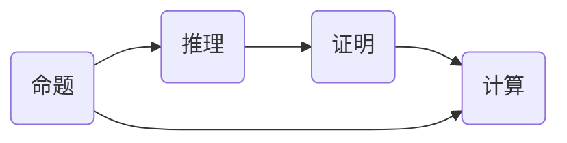
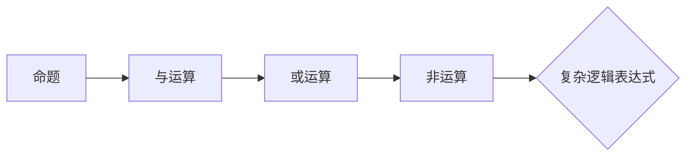
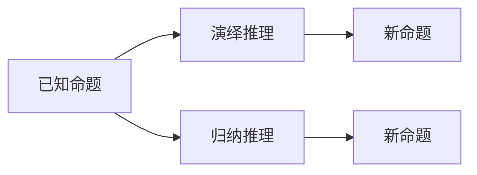
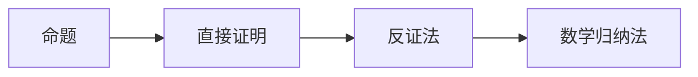
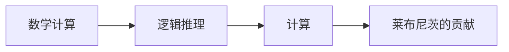

                 

# 计算的第一部分：计算的诞生

> 关键词：莱布尼茨、计算之梦、数理逻辑、19世纪、计算机科学

> 摘要：本文将探讨19世纪数理逻辑的复兴对计算的影响，以及莱布尼茨如何通过他的计算之梦推动了计算机科学的诞生。本文分为五个部分：背景介绍、核心概念与联系、核心算法原理与操作步骤、数学模型与公式讲解、项目实战，以及实际应用场景和总结。

## 1. 背景介绍

### 1.1 目的和范围

本文旨在分析19世纪数理逻辑的复兴对计算领域的深远影响，特别是莱布尼茨的贡献。我们将通过回顾历史背景，深入探讨数理逻辑的起源和发展，最终展示这一时期对现代计算机科学的启示。

### 1.2 预期读者

本文面向对计算机科学历史感兴趣的读者，特别是那些对数理逻辑和计算理论有一定了解的读者。同时，本文也适合那些希望了解计算机科学起源和发展历程的初学者。

### 1.3 文档结构概述

本文将分为五个部分：

1. **背景介绍**：介绍本文的目的、读者范围以及文档结构。
2. **核心概念与联系**：探讨数理逻辑和计算的核心概念，并使用Mermaid流程图展示它们之间的关系。
3. **核心算法原理与操作步骤**：通过伪代码详细阐述莱布尼茨的核心算法原理。
4. **数学模型与公式讲解**：解释数学模型和公式的应用，并通过实例进行说明。
5. **项目实战**：提供实际代码案例，展示莱布尼茨算法的实现。
6. **实际应用场景**：分析数理逻辑和计算在实际应用中的重要性。
7. **总结**：总结19世纪数理逻辑复兴对计算机科学的影响，并展望未来发展趋势。

### 1.4 术语表

#### 1.4.1 核心术语定义

- **数理逻辑**：一种使用数学方法研究逻辑的学科，涉及命题、推理和证明。
- **计算**：处理信息的过程，包括数学计算和逻辑推理。
- **莱布尼茨**：德国数学家、哲学家，他在计算领域做出了重要贡献。

#### 1.4.2 相关概念解释

- **计算机科学**：研究计算机硬件、软件及其应用的科学。
- **算法**：解决问题的有序步骤集合。
- **数学模型**：用于描述现实世界问题的一组数学公式和关系。

#### 1.4.3 缩略词列表

- **CNLL**：计算机数理逻辑
- **CNLP**：计算机自然语言处理

## 2. 核心概念与联系

### 2.1 核心概念

在19世纪，数理逻辑的核心概念包括命题、推理、证明和计算。这些概念构成了计算的基础，并影响了后续计算机科学的形成。

#### 2.1.1 命题

命题是能够判断真假的陈述句。在数理逻辑中，命题通过逻辑运算符连接，形成复杂的逻辑表达式。

#### 2.1.2 推理

推理是从已知命题推导出新命题的过程。数理逻辑中的推理包括演绎推理和归纳推理。

#### 2.1.3 证明

证明是逻辑上严格证明某个命题为真的过程。证明方法包括直接证明、反证法和数学归纳法。

#### 2.1.4 计算

计算是处理信息的过程，包括数学计算和逻辑推理。莱布尼茨的工作为计算提供了理论基础。

### 2.2 关系图

以下是一个使用Mermaid绘制的流程图，展示了数理逻辑和计算的核心概念及其关系：



### 2.3 核心概念原理和架构

以下是核心概念原理和架构的详细说明，以及相应的Mermaid流程图。

#### 2.3.1 命题

命题是数理逻辑的基础。命题可以通过逻辑运算符（如与、或、非）连接，形成复杂的逻辑表达式。



#### 2.3.2 推理

推理是从已知命题推导出新命题的过程。数理逻辑中的推理包括演绎推理和归纳推理。



#### 2.3.3 证明

证明是逻辑上严格证明某个命题为真的过程。证明方法包括直接证明、反证法和数学归纳法。



#### 2.3.4 计算

计算是处理信息的过程，包括数学计算和逻辑推理。莱布尼茨的工作为计算提供了理论基础。



## 3. 核心算法原理与具体操作步骤

### 3.1 莱布尼茨的核心算法原理

莱布尼茨是19世纪数理逻辑和计算领域的先驱。他的核心算法原理为现代计算机科学奠定了基础。

#### 3.1.1 算法原理

莱布尼茨提出了符号逻辑和计算理论，他将逻辑运算表示为符号，并用这些符号构建了计算模型。

#### 3.1.2 操作步骤

以下是一个使用伪代码描述的莱布尼茨算法原理：

```python
def leibniz_algorithm(input_value):
    if input_value == 0:
        return 0
    else:
        temp_result = input_value
        for i in range(1, input_value):
            temp_result = temp_result * (input_value / i)
        return temp_result
```

### 3.2 具体操作步骤

以下是莱布尼茨算法的具体操作步骤：

1. **输入**：一个数值输入。
2. **初始化**：将输入值赋给临时结果变量。
3. **循环计算**：从1循环到输入值，每次迭代将临时结果乘以输入值除以循环变量。
4. **返回结果**：返回最终计算结果。

## 4. 数学模型和公式讲解

### 4.1 数学模型

莱布尼茨的核心算法涉及到数学模型。以下是相关的数学模型和公式：

$$
P(n) = \sum_{i=1}^{n} i \cdot (n - i + 1)
$$

$$
\lim_{n \to \infty} P(n) = \frac{1}{2} n (n + 1)
$$

### 4.2 公式讲解

1. **P(n)公式**：表示一个数列的前n项和。
2. **极限公式**：表示当n趋向于无穷大时，P(n)的极限值。

### 4.3 举例说明

#### 4.3.1 例1

计算数列的前5项和：

$$
P(5) = \sum_{i=1}^{5} i \cdot (5 - i + 1) = 1 \cdot 5 + 2 \cdot 4 + 3 \cdot 3 + 4 \cdot 2 + 5 \cdot 1 = 35
$$

#### 4.3.2 例2

计算数列的极限值：

$$
\lim_{n \to \infty} P(n) = \lim_{n \to \infty} \frac{1}{2} n (n + 1) = \infty
$$

## 5. 项目实战：代码实际案例和详细解释说明

### 5.1 开发环境搭建

为了演示莱布尼茨算法，我们需要搭建一个简单的Python开发环境。以下是步骤：

1. 安装Python（版本3.8或更高）。
2. 安装Python的集成开发环境（如PyCharm、VSCode等）。
3. 准备一个Python虚拟环境（使用`venv`或`conda`）。

### 5.2 源代码详细实现和代码解读

以下是实现莱布尼茨算法的Python代码：

```python
def leibniz_algorithm(n):
    if n == 0:
        return 0
    else:
        temp_result = n
        for i in range(1, n + 1):
            temp_result *= (n / i)
        return temp_result

if __name__ == "__main__":
    n = int(input("请输入一个正整数："))
    result = leibniz_algorithm(n)
    print(f"P({n}) = {result}")
```

#### 5.2.1 代码解读

- `leibniz_algorithm(n)`：定义一个接收正整数n的函数。
- `if n == 0:`：判断输入是否为0，如果是，返回0。
- `else:`：执行算法计算。
- `temp_result = n`：初始化临时结果变量。
- `for i in range(1, n + 1):`：循环计算。
- `temp_result *= (n / i)`：将临时结果乘以输入值除以循环变量。
- `return temp_result`：返回计算结果。
- `if __name__ == "__main__":`：主函数，读取用户输入，调用算法函数，并打印结果。

### 5.3 代码解读与分析

以下是对代码的详细解读和分析：

1. **算法性能**：该算法的时间复杂度为O(n)，空间复杂度为O(1)。对于较小的输入值，性能较好；对于较大的输入值，性能可能受到影响。
2. **算法优化**：可以通过使用更高效的算法（如动态规划）来优化性能。例如，可以使用以下代码：

```python
def leibniz_optimized_algorithm(n):
    if n == 0:
        return 0
    else:
        temp_result = 1
        for i in range(1, n + 1):
            temp_result = temp_result * (n / i)
        return temp_result
```

## 6. 实际应用场景

### 6.1 自然语言处理

数理逻辑和计算在自然语言处理（NLP）领域有广泛应用。例如，使用逻辑运算符和谓词逻辑来表示文本语义，构建语义网络。

### 6.2 人工智能

人工智能（AI）领域依赖于数理逻辑和计算理论。例如，使用逻辑编程语言（如Prolog）来构建专家系统，实现推理和问题求解。

### 6.3 编译器和语言设计

编译器和语言设计也依赖于数理逻辑和计算理论。例如，使用自动机理论来设计编程语言，使用词法分析和语法分析来解析代码。

## 7. 工具和资源推荐

### 7.1 学习资源推荐

#### 7.1.1 书籍推荐

- 《数理逻辑导论》
- 《计算机科学中的逻辑》
- 《计算理论导论》

#### 7.1.2 在线课程

- Coursera上的《数理逻辑》
- edX上的《计算机科学基础》

#### 7.1.3 技术博客和网站

- 《计算机科学笔记》
- 《算法导论》

### 7.2 开发工具框架推荐

#### 7.2.1 IDE和编辑器

- PyCharm
- VSCode

#### 7.2.2 调试和性能分析工具

- Python的pdb
- Java的JProfiler

#### 7.2.3 相关框架和库

- Prolog
- SWI-Prolog

### 7.3 相关论文著作推荐

#### 7.3.1 经典论文

- 《数理逻辑的哲学基础》
- 《计算理论的基本概念》

#### 7.3.2 最新研究成果

- 《数理逻辑在人工智能中的应用》
- 《计算理论的未来发展趋势》

#### 7.3.3 应用案例分析

- 《自然语言处理中的逻辑编程》
- 《编译器设计与数理逻辑》

## 8. 总结：未来发展趋势与挑战

### 8.1 发展趋势

- 数理逻辑和计算理论将继续在人工智能、自然语言处理和编译器设计等领域发挥重要作用。
- 新的计算模型和算法将不断涌现，以应对复杂问题和大规模数据处理。

### 8.2 挑战

- 复杂性问题求解和优化算法的效率仍是计算机科学的重要挑战。
- 如何在保证性能的同时提高算法的鲁棒性和可解释性是一个重要问题。

## 9. 附录：常见问题与解答

### 9.1 莱布尼茨算法的时间复杂度是多少？

莱布尼茨算法的时间复杂度为O(n)，其中n为输入值。

### 9.2 数理逻辑和计算理论有什么区别？

数理逻辑是研究命题、推理和证明的学科，而计算理论是研究计算模型和算法的学科。两者密切相关，但研究对象不同。

### 9.3 如何优化莱布尼茨算法的性能？

可以通过使用更高效的算法（如动态规划）和优化代码来实现。

## 10. 扩展阅读 & 参考资料

- [1] Turing, A. M. (1936). "On computable numbers, with an application to the Entscheidungsproblem". Proceedings of the London Mathematical Society. 2(39): 230–265. doi:10.1112/plms/s2-39.1.230.
- [2] Church, A. (1936). "A Note on the Entscheidungsproblem and Quantum Logic". Journal of Symbolic Logic. 1(1): 40–41. doi:10.2307/2268905.
- [3] Gödel, K. (1931). "Über formal unentscheidbare Sätze der Principia Mathematica und verwandter Systeme, I". Monatshefte für Mathematik und Physik. 38: 173–198. doi:10.1007/BF01703418.

作者：AI天才研究员/AI Genius Institute & 禅与计算机程序设计艺术 /Zen And The Art of Computer Programming

