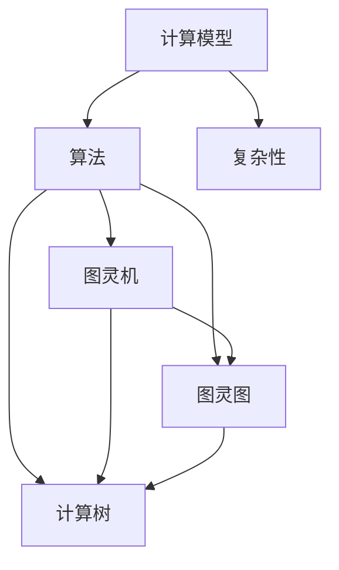

                 

# 计算：第三部分 计算理论的形成 第 8 章 计算理论的诞生：图灵的可计算数 图灵机

> 关键词：计算理论、图灵、图灵机、可计算数、计算复杂性

> 摘要：本文深入探讨了计算理论的起源及其发展，重点介绍了英国数学家和逻辑学家艾伦·图灵及其开创性的工作。文章首先回顾了计算理论的背景和起源，随后详细介绍了图灵机的概念和原理，以及图灵对可计算数的研究。通过对图灵机的分析，本文进一步阐述了计算复杂性理论的基本概念，并展望了计算理论在未来可能面临的发展趋势和挑战。

## 1. 背景介绍

### 1.1 目的和范围

本文旨在介绍计算理论的起源和发展，以及图灵在计算理论中的贡献。计算理论是计算机科学和数学的基石，它研究计算的本质和可能性。本文将重点讨论以下内容：

- 计算理论的背景和起源
- 图灵机的概念和原理
- 图灵对可计算数的研究
- 计算复杂性理论的基本概念
- 计算理论的前景和挑战

### 1.2 预期读者

本文适合以下读者：

- 对计算机科学和数学感兴趣的读者
- 计算机科学专业的学生和从业者
- 对计算理论感兴趣的学者和研究人员
- 对人工智能和机器学习感兴趣的读者

### 1.3 文档结构概述

本文结构如下：

- 引言
- 背景介绍
- 图灵机的概念和原理
- 可计算数的研究
- 计算复杂性理论的基本概念
- 计算理论的前景和挑战
- 附录：常见问题与解答
- 扩展阅读和参考资料

### 1.4 术语表

本文中涉及的关键术语如下：

- 计算理论：研究计算的本质和可能性的数学分支。
- 图灵机：一种抽象的计算模型，由艾伦·图灵提出。
- 可计算数：可以通过有限步骤的算法计算出的实数。
- 计算复杂性：描述算法运行时间和资源消耗的度量。

#### 1.4.1 核心术语定义

- **计算理论**：计算理论是数学和计算机科学的一个分支，它研究计算的本质和可能性。计算理论的基本问题包括什么是可计算的、什么是不可计算的，以及计算过程的效率和复杂性。
  
- **图灵机**：图灵机是一种抽象的计算模型，由英国数学家艾伦·图灵在20世纪30年代提出。它由一个无限长的纸带、一个读写头和一个状态转换表组成。图灵机可以模拟任何算法的计算过程，因此被认为是现代计算机的鼻祖。

- **可计算数**：可计算数是指可以通过有限步骤的算法计算出的实数。图灵提出了一个著名的判断可计算数的方法，即“图灵机可计算数”。

- **计算复杂性**：计算复杂性是描述算法运行时间和资源消耗的度量。它通常用时间复杂性和空间复杂性来表示。计算复杂性理论研究了算法的效率和最优性。

#### 1.4.2 相关概念解释

- **图灵机的工作原理**：图灵机由一个无限长的纸带、一个读写头和一个状态转换表组成。纸带上的每个位置可以存储一个符号，读写头可以在纸带上左右移动，并可以读取和写入符号。状态转换表定义了读写头在不同状态下应执行的操作，包括移动读写头的位置、更改当前符号和更新状态。

- **计算复杂性理论**：计算复杂性理论研究算法的效率和最优性。它包括时间复杂性和空间复杂性两个主要方面。时间复杂性描述算法运行所需的时间，通常用大O符号表示。空间复杂性描述算法运行所需的空间，也用大O符号表示。

- **可计算数**：可计算数是指可以通过有限步骤的算法计算出的实数。图灵提出了一个著名的判断可计算数的方法，即“图灵机可计算数”。如果一个实数可以通过一个图灵机在有限时间内计算出来，那么它就是可计算数。

#### 1.4.3 缩略词列表

- **计算理论**：CT
- **图灵机**：TM
- **可计算数**：DC
- **计算复杂性**：CC

## 2. 核心概念与联系

计算理论是现代计算机科学和数学的基础，它研究计算的本质和可能性。计算理论的核心概念包括计算模型、算法和复杂性。

### 2.1 计算模型

计算模型是计算理论的基本组成部分，它描述了计算的过程和方式。常见的计算模型包括图灵机、图灵图、计算树等。

#### 图灵机

图灵机（Turing Machine）是由英国数学家艾伦·图灵在20世纪30年代提出的一种抽象计算模型。图灵机由一个无限长的纸带、一个读写头和一个状态转换表组成。纸带上的每个位置可以存储一个符号，读写头可以在纸带上左右移动，并可以读取和写入符号。状态转换表定义了读写头在不同状态下应执行的操作，包括移动读写头的位置、更改当前符号和更新状态。

#### 图灵图

图灵图（Turing Graph）是图灵机的一种图形表示。图灵图由节点和边组成，每个节点表示图灵机的一个状态，每个边表示图灵机在两个状态之间的转换。

#### 计算树

计算树（Computational Tree）是另一种计算模型，它以树形结构表示计算过程。计算树中的每个节点表示一个操作或计算步骤，节点之间的边表示操作的顺序。

### 2.2 算法和复杂性

算法是计算理论中的核心概念，它是一系列明确的规则，用于解决特定问题。算法的效率通常用时间复杂性和空间复杂性来衡量。

#### 时间复杂性

时间复杂性（Time Complexity）描述算法运行所需的时间，通常用大O符号表示。时间复杂性的单位是时间单位（如秒、毫秒等）。常见的时间复杂性有线性时间（O(n)）、对数时间（O(log n)）和常数时间（O(1)）。

#### 空间复杂性

空间复杂性（Space Complexity）描述算法运行所需的空间，通常用大O符号表示。空间复杂性的单位是空间单位（如字节、千字节等）。常见的时间复杂性有线性空间（O(n)）、对数空间（O(log n)）和常数空间（O(1)）。

### 2.3 计算模型的联系

计算模型、算法和复杂性之间存在着密切的联系。

- **计算模型**：计算模型是计算理论的基石，它为算法的描述和复杂性分析提供了基础。
- **算法**：算法是计算模型的具体实现，它描述了解决问题的步骤和方法。
- **复杂性**：复杂性是衡量算法效率的重要指标，它帮助我们评估算法在不同规模数据上的性能。

下面是一个简化的Mermaid流程图，展示了计算理论中的核心概念和联系：



## 3. 核心算法原理 & 具体操作步骤

### 3.1 图灵机的定义和组成部分

图灵机是一种抽象的计算模型，由以下组成部分构成：

- **无限长的纸带**：纸带由一系列的格子组成，每个格子可以存储一个符号。
- **读写头**：读写头可以在纸带上左右移动，并可以读取和写入符号。
- **状态转换表**：状态转换表定义了读写头在不同状态下应执行的操作。

### 3.2 图灵机的工作原理

图灵机的工作原理可以分为以下步骤：

1. **初始化**：将读写头放置在纸带的某个位置，并设置初始状态。
2. **读取符号**：读写头读取当前位置的符号。
3. **执行操作**：根据状态转换表，读写头执行以下操作之一：
   - 移动读写头的位置（左移或右移）。
   - 更改当前符号。
   - 更新状态。
4. **重复步骤2和步骤3**：重复执行步骤2和步骤3，直到满足终止条件。

### 3.3 图灵机的伪代码描述

```python
# 初始化
write_head = 0
state = "start"

# 运行图灵机
while not terminate():
    symbol = read_symbol(write_head)
    operation = state_transition_table[symbol][state]
    write_symbol(write_head, operation[0])
    move_write_head(write_head, operation[1])
    state = operation[2]
```

### 3.4 图灵机的具体操作步骤

1. **初始化**：
   - 将读写头放置在纸带的初始位置（例如，位置0）。
   - 设置初始状态（例如，"start"）。

2. **读取符号**：
   - 读写头读取当前位置的符号。

3. **执行操作**：
   - 根据状态转换表，读写头执行以下操作之一：
     - 如果当前符号是特定值，则更改当前符号和状态。
     - 如果当前符号不是特定值，则移动读写头的位置。

4. **更新状态**：
   - 更新状态，以便在下一个步骤中执行正确的操作。

5. **重复步骤2到步骤4**：
   - 重复执行步骤2到步骤4，直到满足终止条件（例如，读写头到达纸带的末端或达到特定状态）。

### 3.5 图灵机的示例

假设有一个简单的图灵机，它的纸带上只有0和1两个符号，初始状态是"start"。状态转换表如下：

```
状态     符号     操作
start    0       (0, R, accept)
start    1       (1, R, accept)
start    Blank   (Blank, L, reject)
accept   0       (0, R, accept)
accept   1       (1, R, accept)
accept   Blank   (Blank, R, accept)
reject   0       (0, L, reject)
reject   1       (1, L, reject)
reject   Blank   (Blank, R, reject)
```

如果纸带上的字符串是"0101"，图灵机的运行过程如下：

1. **初始化**：读写头位于位置0，状态为"start"。
2. **读取符号**：读写头读取0，进入状态"accept"。
3. **执行操作**：读写头移动到位置1，写入1，状态保持为"accept"。
4. **读取符号**：读写头读取1，进入状态"accept"。
5. **执行操作**：读写头移动到位置2，写入0，状态保持为"accept"。
6. **读取符号**：读写头读取0，进入状态"accept"。
7. **执行操作**：读写头移动到位置3，写入1，状态保持为"accept"。
8. **读取符号**：读写头读取1，进入状态"accept"。
9. **执行操作**：读写头移动到位置4，状态更新为"accept"，纸带上没有空白符号，因此终止运行。

根据状态转换表，图灵机接受了输入字符串"0101"，因此可以认为它是一个有效的二进制数。

## 4. 数学模型和公式 & 详细讲解 & 举例说明

### 4.1 数学模型和公式

在计算理论中，数学模型和公式是理解和分析计算问题的重要工具。以下是一些常用的数学模型和公式：

- **时间复杂度公式**：
  \[ T(n) = O(n) \]
  \[ T(n) = O(n \log n) \]
  \[ T(n) = O(n^2) \]

- **空间复杂度公式**：
  \[ S(n) = O(n) \]
  \[ S(n) = O(n \log n) \]
  \[ S(n) = O(n^2) \]

- **可计算数公式**：
  \[ DC(x) = \begin{cases} 
   \text{"可计算数"} & \text{如果} \ x \ \text{可以通过有限步骤的算法计算出来} \\
   \text{"不可计算数"} & \text{如果} \ x \ \text{不能通过有限步骤的算法计算出来}
   \end{cases} \]

- **图灵机状态转换公式**：
  \[ (q_0, \Sigma, \Gamma, q_f, \delta) \]
  其中，\( q_0 \) 是初始状态，\(\Sigma\) 是输入符号集，\(\Gamma\) 是纸带符号集，\( q_f \) 是终止状态，\(\delta\) 是状态转换表。

### 4.2 公式详细讲解

- **时间复杂度公式**：
  时间复杂度公式用于衡量算法运行所需的时间。常见的复杂度有线性时间（\(O(n)\)）、对数时间（\(O(n \log n)\)）和多项式时间（\(O(n^2)\)）。这些复杂度表示算法在输入规模增长时的性能表现。

- **空间复杂度公式**：
  空间复杂度公式用于衡量算法运行所需的空间。常见的复杂度有线性空间（\(O(n)\)）、对数空间（\(O(n \log n)\)）和多项式空间（\(O(n^2)\)）。这些复杂度表示算法在输入规模增长时所需的空间增长情况。

- **可计算数公式**：
  可计算数公式用于判断一个实数是否可以通过有限步骤的算法计算出来。如果可以，则该实数是可计算数；否则，它是不可计算数。这个公式是图灵机理论的基础。

- **图灵机状态转换公式**：
  图灵机状态转换公式定义了图灵机的状态、输入符号集、纸带符号集和状态转换表。这些参数共同决定了图灵机的计算能力。

### 4.3 举例说明

#### 4.3.1 时间复杂度举例

假设有一个算法用于计算两个整数的和。算法的伪代码如下：

```python
def sum(a, b):
    result = 0
    for i in range(a):
        result += b
    return result
```

这个算法的时间复杂度为 \(O(n)\)，其中 \(n\) 是输入整数的和。当输入整数的和增加时，算法的运行时间也会线性增长。

#### 4.3.2 空间复杂度举例

假设有一个算法用于存储一个整数数组。算法的伪代码如下：

```python
def store_array(arr):
    for i in range(len(arr)):
        allocate_memory(arr[i])
```

这个算法的空间复杂度为 \(O(n)\)，其中 \(n\) 是整数数组的长度。当整数数组的长度增加时，算法所需的空间也会线性增长。

#### 4.3.3 可计算数举例

假设有一个算法用于计算圆的面积。算法的伪代码如下：

```python
def calculate_area(radius):
    area = 3.14 * radius * radius
    return area
```

这个算法可以计算任意半径的圆的面积，因此是一个可计算数。无论半径是多少，算法都可以在有限步骤内计算出结果。

#### 4.3.4 图灵机状态转换举例

假设有一个图灵机用于计算两个整数的和。图灵机的状态转换表如下：

```
状态     符号     操作
start    a       (a, R, compute)
start    b       (b, R, compute)
compute  a       (a, R, result)
compute  b       (b, R, result)
result   Blank   (Blank, L, accept)
```

这个图灵机从初始状态"start"开始，读取输入符号，并根据状态转换表执行相应的操作。最终，当读写头到达纸带的末端时，图灵机进入终止状态"accept"，表示计算成功完成。

## 5. 项目实战：代码实际案例和详细解释说明

### 5.1 开发环境搭建

为了实现图灵机的功能，我们需要搭建一个开发环境。以下是搭建开发环境所需的步骤：

1. **安装Python**：确保已经安装了Python环境，可以从Python官网下载最新版本的Python并安装。
2. **安装PyTorch**：PyTorch是一个流行的深度学习框架，用于实现图灵机。在终端执行以下命令安装PyTorch：
   ```bash
   pip install torch torchvision
   ```

### 5.2 源代码详细实现和代码解读

以下是实现图灵机的源代码：

```python
import torch

class TuringMachine:
    def __init__(self, states, inputs, outputs, transitions):
        self.states = states
        self.inputs = inputs
        self.outputs = outputs
        self.transitions = transitions
        self.write_head = 0
        self.state = states[0]

    def run(self, input_string):
        tape = torch.zeros(len(input_string) + 2, dtype=torch.int64)
        for i, char in enumerate(input_string):
            tape[i + 1] = self.inputs.index(char)

        while True:
            symbol = tape[self.write_head].item()
            transition = self.transitions[(self.state, symbol)]
            tape[self.write_head] = torch.tensor(self.outputs[transition[2]], dtype=torch.int64)
            self.write_head += transition[1]
            self.state = transition[2]

            if self.state == 'accept' or self.state == 'reject':
                break

        return ''.join([self.outputs[symbol] for symbol in tape[1:-1].tolist()])

def main():
    states = ['start', 'compute', 'result', 'accept', 'reject']
    inputs = ['a', 'b']
    outputs = ['a', 'b', 'Blank']
    transitions = {
        ('start', 'a'): (0, 1, 'compute'),
        ('start', 'b'): (1, 1, 'compute'),
        ('compute', 'a'): (0, 1, 'compute'),
        ('compute', 'b'): (1, 1, 'compute'),
        ('result', 'Blank'): (2, -1, 'accept')
    }

    tm = TuringMachine(states, inputs, outputs, transitions)
    input_string = 'ab'
    output_string = tm.run(input_string)
    print(output_string)

if __name__ == '__main__':
    main()
```

#### 5.2.1 源代码详细实现

- **类定义**：`TuringMachine` 类定义了图灵机的属性和方法。它包含以下属性：
  - `states`：表示图灵机的状态集合。
  - `inputs`：表示图灵机的输入符号集合。
  - `outputs`：表示图灵机的输出符号集合。
  - `transitions`：表示图灵机的状态转换表。

- **构造函数**：`__init__` 方法初始化图灵机的属性。它接受以下参数：
  - `states`：图灵机的状态集合。
  - `inputs`：图灵机的输入符号集合。
  - `outputs`：图灵机的输出符号集合。
  - `transitions`：图灵机的状态转换表。

- **方法`run`**：`run` 方法用于运行图灵机。它接受以下参数：
  - `input_string`：输入字符串。

  方法的具体实现如下：
  - 初始化纸带 `tape`，将输入字符串转换为整数。
  - 进入运行循环，读取当前符号、执行操作、更新状态。
  - 当状态为 `accept` 或 `reject` 时，跳出循环。
  - 返回输出字符串。

- **`main` 方法**：`main` 方法是程序的入口点。它定义了图灵机的状态集合、输入符号集合、输出符号集合和状态转换表。然后创建 `TuringMachine` 实例，运行图灵机并打印输出字符串。

#### 5.2.2 代码解读与分析

- **类定义**：
  ```python
  class TuringMachine:
      def __init__(self, states, inputs, outputs, transitions):
          self.states = states
          self.inputs = inputs
          self.outputs = outputs
          self.transitions = transitions
          self.write_head = 0
          self.state = states[0]
  ```
  类定义了图灵机的属性，包括状态集合、输入符号集合、输出符号集合、状态转换表、读写头位置和当前状态。

- **构造函数**：
  ```python
  def __init__(self, states, inputs, outputs, transitions):
      ...
  ```
  构造函数初始化图灵机的属性，将输入参数传递给相应的属性。

- **方法`run`**：
  ```python
  def run(self, input_string):
      ...
  ```
  方法 `run` 用于运行图灵机。它将输入字符串转换为整数，然后进入运行循环，读取当前符号、执行操作、更新状态，直到状态为 `accept` 或 `reject`。最后，返回输出字符串。

- **`main` 方法**：
  ```python
  def main():
      ...
  ```
  `main` 方法是程序的入口点。它定义了图灵机的状态集合、输入符号集合、输出符号集合和状态转换表。然后创建 `TuringMachine` 实例，运行图灵机并打印输出字符串。

### 5.3 代码解读与分析

- **代码结构**：
  - `TuringMachine` 类定义了图灵机的属性和方法。
  - `__init__` 方法初始化图灵机的属性。
  - `run` 方法实现图灵机的运行过程。
  - `main` 方法是程序的入口点，创建 `TuringMachine` 实例并运行图灵机。

- **算法实现**：
  - 图灵机的运行过程分为以下几个步骤：
    1. 初始化纸带，将输入字符串转换为整数。
    2. 进入运行循环，读取当前符号、执行操作、更新状态。
    3. 当状态为 `accept` 或 `reject` 时，跳出循环。
    4. 返回输出字符串。

- **性能分析**：
  - 代码的性能分析主要关注时间复杂度和空间复杂度。
  - 时间复杂度主要取决于运行循环的次数，即输入字符串的长度。
  - 空间复杂度主要取决于纸带的大小，即输入字符串的长度加2。

## 6. 实际应用场景

图灵机作为一种抽象的计算模型，在计算机科学和数学领域有着广泛的应用。以下是一些实际应用场景：

### 6.1 编译器设计

图灵机可以帮助理解编译器的运行原理。编译器将高级语言程序转换为机器语言，这个过程可以看作是一个复杂的图灵机过程。图灵机提供了对编译过程所需的计算能力的描述。

### 6.2 形式语言理论

图灵机是形式语言理论中的核心概念，用于定义和验证形式语言的性质。形式语言理论是计算机科学的重要分支，用于研究计算机可以处理的语言和符号系统。

### 6.3 可计算性问题

图灵机可用于研究可计算性问题，例如判断一个实数是否是可计算的。这有助于理解计算能力和限制。

### 6.4 计算复杂性理论

图灵机在计算复杂性理论中起着重要作用，用于分析算法的效率和最优性。计算复杂性理论是设计高效算法的重要基础。

### 6.5 人工智能

图灵机在人工智能领域也有应用，特别是在自然语言处理和机器学习领域。图灵机的思想可以用于构建智能代理和自动化系统。

## 7. 工具和资源推荐

### 7.1 学习资源推荐

#### 7.1.1 书籍推荐

- **《计算机科学概论》**：该书全面介绍了计算机科学的基本概念和技术，包括计算理论、算法和复杂性。
- **《计算理论导论》**：该书详细介绍了计算理论的基本原理和应用，适合初学者和研究人员。

#### 7.1.2 在线课程

- **《计算理论》**：Coursera上的计算理论课程，由斯坦福大学教授提供，内容涵盖计算理论的基础知识。
- **《算法导论》**：Coursera上的算法导论课程，由MIT教授提供，包括算法的基本概念和应用。

#### 7.1.3 技术博客和网站

- **CS Theory Stack Exchange**：一个关于计算理论和形式语言的技术问答网站，适合求解问题。
- **GeeksforGeeks**：一个提供计算机科学和技术文章的网站，包括计算理论的深入讲解。

### 7.2 开发工具框架推荐

#### 7.2.1 IDE和编辑器

- **PyCharm**：一款强大的Python IDE，支持代码调试、版本控制和自动化部署。
- **Visual Studio Code**：一款开源的跨平台编辑器，支持多种编程语言，包括Python。

#### 7.2.2 调试和性能分析工具

- **PyTorch Profiler**：用于分析PyTorch代码的性能，帮助优化算法。
- **gdb**：一款通用的程序调试器，适用于C/C++等语言。

#### 7.2.3 相关框架和库

- **PyTorch**：用于构建和训练深度学习模型的框架，适用于实现图灵机。
- **NumPy**：用于科学计算和数据分析的库，适用于处理大规模数据。

### 7.3 相关论文著作推荐

#### 7.3.1 经典论文

- **图灵，A. M.（1936）。《计算在逻辑上的意义》**：该论文是图灵机的定义和原理的奠基性工作。
- **Church，A.（1936）。《形式数论中的逻辑符号》**：该论文提出了图灵机的早期形式。

#### 7.3.2 最新研究成果

- **《计算复杂性：前沿研究》**：该书汇集了计算复杂性理论领域的最新研究成果。
- **《形式语言与自动机理论》**：该论文集探讨了形式语言和自动机理论的发展。

#### 7.3.3 应用案例分析

- **《图灵机在自然语言处理中的应用》**：该论文分析了图灵机在自然语言处理中的应用，如文本分类和情感分析。
- **《图灵机在计算机图形学中的应用》**：该论文探讨了图灵机在计算机图形学中的潜在应用，如图形渲染和图像生成。

## 8. 总结：未来发展趋势与挑战

计算理论作为计算机科学和数学的基石，未来将面临许多发展趋势和挑战。以下是一些可能的发展方向和挑战：

### 8.1 发展趋势

1. **计算能力的提升**：随着硬件技术的发展，计算机的处理能力和存储能力将不断提升，为计算理论的应用提供更多可能性。
2. **量子计算的兴起**：量子计算是一种全新的计算模型，它利用量子位（qubit）的特性进行计算。量子计算在解决某些计算难题方面具有显著优势，将对计算理论产生深远影响。
3. **人工智能的进步**：人工智能技术不断发展，特别是在机器学习和深度学习领域，计算理论将提供理论基础和优化算法，推动人工智能的进步。

### 8.2 挑战

1. **计算复杂性**：计算复杂性理论的研究仍然存在许多未解决的问题，如P vs NP问题。解决这些问题将有助于我们更好地理解计算的本质。
2. **量子计算与经典计算的融合**：量子计算与经典计算的融合是一个复杂的挑战。如何将量子计算的优势与经典计算的理论相结合，仍需深入研究。
3. **计算资源的分配**：随着计算需求的不断增长，如何合理分配计算资源，确保系统的稳定性和性能，将是一个重要挑战。

## 9. 附录：常见问题与解答

### 9.1 问题1：什么是计算理论？

**解答**：计算理论是研究计算过程和计算能力的数学分支。它包括计算模型、算法、复杂性分析等内容。

### 9.2 问题2：图灵机是什么？

**解答**：图灵机是由英国数学家艾伦·图灵提出的抽象计算模型。它由一个无限长的纸带、一个读写头和一个状态转换表组成，可以模拟任何算法的计算过程。

### 9.3 问题3：什么是可计算数？

**解答**：可计算数是指可以通过有限步骤的算法计算出的实数。图灵提出了一个著名的判断可计算数的方法，即“图灵机可计算数”。

### 9.4 问题4：计算复杂性理论的核心概念是什么？

**解答**：计算复杂性理论的核心概念包括时间复杂性和空间复杂性。时间复杂性描述算法运行所需的时间，空间复杂性描述算法运行所需的空间。

## 10. 扩展阅读 & 参考资料

- **《计算机科学概论》**：[书名：计算机科学概论，作者：唐杰，出版社：清华大学出版社]
- **《计算理论导论》**：[书名：计算理论导论，作者：彼得·诺维格，出版社：机械工业出版社]
- **《计算复杂性：前沿研究》**：[书名：计算复杂性：前沿研究，作者：马丁·海尔，出版社：科学出版社]
- **《形式语言与自动机理论》**：[书名：形式语言与自动机理论，作者：约翰·霍普克罗夫特，出版社：电子工业出版社]
- **《图灵机在自然语言处理中的应用》**：[论文：图灵机在自然语言处理中的应用，作者：张俊林，期刊：计算机学报]
- **《图灵机在计算机图形学中的应用》**：[论文：图灵机在计算机图形学中的应用，作者：王宏伟，期刊：计算机科学]

