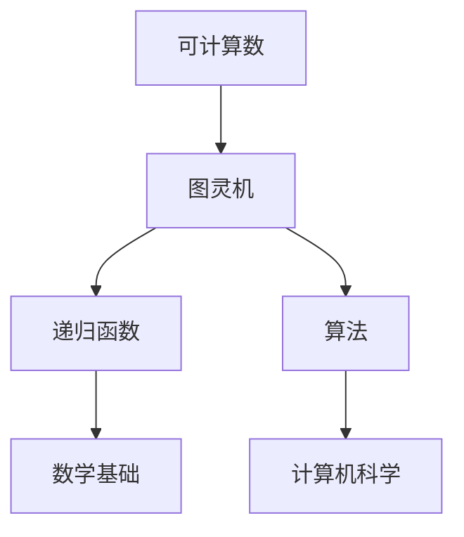

                 

# 计算理论的形成：图灵的可计算数与图灵机

> 关键词：计算理论、图灵机、可计算数、计算机科学、数学基础、人工智能

> 摘要：本文旨在深入探讨计算理论的起源，重点介绍图灵的可计算数以及图灵机的概念。通过对图灵理论的详细解读，我们将理解计算理论的本质和重要性，并展望其未来发展趋势和挑战。

## 1. 背景介绍

### 1.1 目的和范围

本文的目的在于回顾计算理论的形成历程，特别是图灵在计算理论领域的重要贡献。通过深入分析图灵的可计算数和图灵机，我们旨在为读者提供一个清晰的理解，以便更好地把握计算理论的本质和应用。

本文将涵盖以下主要内容：

- 图灵的可计算数的定义和性质
- 图灵机的概念和操作原理
- 计算理论的历史背景和发展
- 计算理论在现代计算机科学和人工智能中的重要性

### 1.2 预期读者

本文适合具有计算机科学、数学或相关领域背景的读者。特别是那些对计算理论和图灵机有兴趣的读者，以及希望深入了解计算理论在人工智能和计算机科学中应用的人。

### 1.3 文档结构概述

本文将按照以下结构进行组织：

- 引言：介绍计算理论的背景和重要性
- 图灵的可计算数：定义、性质和应用
- 图灵机的概念和操作原理
- 计算理论的历史背景和发展
- 计算理论在现代计算机科学和人工智能中的重要性
- 结论：总结计算理论的重要性，展望未来发展趋势和挑战
- 附录：常见问题与解答
- 参考文献

### 1.4 术语表

在本文中，我们将使用以下核心术语：

- **可计算数**：可以由图灵机计算或表示的数。
- **图灵机**：一种抽象的计算模型，可以模拟任何算法的计算过程。
- **计算理论**：研究计算过程的数学分支，包括计算复杂性、可计算数等。
- **递归函数**：可以由图灵机计算或表示的函数。
- **算法**：解决问题的明确步骤序列。

#### 1.4.1 核心术语定义

- **可计算数**：可计算数是一类特定的数，可以通过图灵机进行计算或表示。这些数包括有理数、无理数、实数等，但并非所有的数都是可计算的。
- **图灵机**：图灵机是一种抽象的计算模型，由英国数学家艾伦·图灵于1936年提出。它由一个无限长的纸带、一个读写头和一个状态控制器组成，可以模拟任何算法的计算过程。
- **计算理论**：计算理论是数学的一个分支，主要研究计算的本质、方法和局限性。它包括计算复杂性、可计算数、算法分析等。
- **递归函数**：递归函数是一类可以由图灵机计算或表示的函数。这些函数具有特定的递归结构，可以用于解决各种计算问题。
- **算法**：算法是一组明确且可重复的步骤，用于解决特定的问题。算法可以用于排序、搜索、图论等领域。

#### 1.4.2 相关概念解释

- **有理数**：有理数是可以表示为两个整数的比例的数，例如分数、整数、小数等。
- **无理数**：无理数是不能表示为两个整数的比例的数，例如π、√2等。
- **实数**：实数是包含有理数和无理数的集合，是数学中最基本的数集。
- **递归**：递归是一种编程技术，通过将问题分解为较小的子问题来解决复杂问题。递归函数是一种特殊的函数，可以通过递归调用自身来解决递归问题。
- **算法分析**：算法分析是一种研究算法效率和性能的方法。它通过计算算法的运行时间、空间复杂度等指标，评估算法的效率和可行性。

#### 1.4.3 缩略词列表

- **CM**：计算复杂性理论
- **TM**：图灵机
- **NA**：自然数
- **QA**：量子计算

## 2. 核心概念与联系

在计算理论中，有几个核心概念和它们之间的关系至关重要。这些概念包括可计算数、图灵机、递归函数和算法。下面我们将通过一个Mermaid流程图来展示这些概念之间的联系。



### 2.1 可计算数

可计算数是计算理论中的核心概念之一。它们是一类可以由图灵机计算或表示的数。根据图灵机的定义，任何可计算数都可以通过一个有限步骤的算法来计算。

### 2.2 图灵机

图灵机是一种抽象的计算模型，由一个无限长的纸带、一个读写头和一个状态控制器组成。它可以模拟任何算法的计算过程，因此被认为是现代计算机的数学模型。

### 2.3 递归函数

递归函数是一类可以由图灵机计算或表示的函数。这些函数具有特定的递归结构，可以通过递归调用自身来解决复杂的计算问题。

### 2.4 算法

算法是一组明确且可重复的步骤，用于解决特定的问题。算法可以用于排序、搜索、图论等领域。在计算理论中，算法的研究包括算法的效率、复杂度和实现等。

### 2.5 数学基础

数学基础是计算理论的基石。可计算数、递归函数和算法都是建立在数学基础之上的。数学基础包括集合论、数论、图论等。

### 2.6 计算机科学

计算机科学是研究计算机硬件、软件及其应用的科学。计算理论是计算机科学的一个分支，研究计算机的算法、性能、可靠性等方面。

通过这个Mermaid流程图，我们可以清晰地看到这些核心概念之间的联系。这些概念共同构成了计算理论的基础，为现代计算机科学和人工智能的发展提供了理论基础。

## 3. 核心算法原理 & 具体操作步骤

在计算理论中，图灵机的概念至关重要。它不仅为计算提供了数学模型，而且为我们理解算法的本质提供了深刻的洞察。在本节中，我们将详细阐述图灵机的核心算法原理，并使用伪代码来描述其具体操作步骤。

### 3.1 图灵机的算法原理

图灵机的算法原理可以总结为以下四个步骤：

1. **初始化**：将输入数据加载到纸带上，并将读写头放置在纸带上的初始位置。
2. **读取和写入**：读写头根据当前状态和纸带上的数据，执行读取和写入操作，然后将读写头移动到新的位置。
3. **状态转移**：根据当前状态和读取的数据，图灵机更新其状态，决定下一步的操作。
4. **终止条件**：当图灵机满足特定的终止条件时，算法结束。

### 3.2 伪代码描述

下面是图灵机算法的伪代码描述：

```plaintext
Algorithm TuringMachine(input)
    // 初始化
    tape := initializeTape(input)
    head := tape.head
    state := "start"
    
    // 开始执行算法
    while state != "halt" do
        // 读取和写入
        symbol := read(head)
        write(head, transition(state, symbol))
        
        // 移动读写头
        if transition(state, symbol) == "R" then
            head := head.right()
        else if transition(state, symbol) == "L" then
            head := head.left()
            
        // 状态转移
        state := transition(state, symbol)
        
    end while
    
    // 输出结果
    print(tape.content())
End Algorithm
```

### 3.3 详细解释

1. **初始化**：在算法开始时，输入数据被加载到纸带上，并将读写头放置在纸带上的初始位置。初始化操作确保图灵机能够从正确的起点开始执行算法。

2. **读取和写入**：在每一步操作中，读写头根据当前状态和纸带上的数据，执行读取和写入操作。读取操作获取纸带上的当前符号，写入操作将新的符号写入纸带。这一步骤是图灵机执行计算的核心。

3. **移动读写头**：根据当前状态和读取的数据，图灵机决定读写头的新位置。如果状态转移规则指定向右移动，读写头将向右移动一位；如果指定向左移动，读写头将向左移动一位。

4. **状态转移**：在读取和写入操作之后，图灵机根据当前状态和读取的数据更新其状态。状态转移规则决定了图灵机下一步的操作。

5. **终止条件**：当图灵机满足特定的终止条件时，算法结束。终止条件通常是指图灵机达到一个特定的状态，或者纸带上的数据无法改变。

通过上述伪代码，我们可以清晰地看到图灵机的算法原理和操作步骤。图灵机的核心在于其状态转移规则，这些规则决定了图灵机如何读取、写入和移动读写头，从而实现复杂的计算过程。

## 4. 数学模型和公式 & 详细讲解 & 举例说明

在计算理论中，数学模型和公式扮演着至关重要的角色。这些模型和公式不仅帮助我们理解计算的本质，而且为分析和证明计算过程的正确性提供了强大的工具。在本节中，我们将详细讲解图灵机的数学模型和公式，并使用具体的例子来说明其应用。

### 4.1 图灵机的数学模型

图灵机的数学模型可以概括为以下公式：

\[ T = (Q, \Gamma, \delta, q_0, B, F) \]

其中，每个符号的含义如下：

- \( Q \)：状态集合，表示图灵机可能处于的所有状态。
- \( \Gamma \)：纸带符号集合，表示图灵机可以读取和写入的符号集合。
- \( \delta \)：状态转移函数，定义了图灵机在特定状态和读取到特定符号时的动作，包括写入新符号、移动读写头和更新状态。
- \( q_0 \)：初始状态，表示图灵机开始执行时的状态。
- \( B \)：空白符号，表示纸带上的空白区域。
- \( F \)：终止状态集合，表示图灵机执行完成时的状态。

### 4.2 状态转移函数 \( \delta \)

状态转移函数 \( \delta \) 的定义如下：

\[ \delta: Q \times \Gamma \rightarrow Q \times \Gamma \times \{L, R\} \]

其中，\( \delta(q, x) = (q', x', d) \) 表示在状态 \( q \) 读取符号 \( x \) 时，图灵机将更新状态为 \( q' \)，写入符号 \( x' \)，并移动读写头到新的位置 \( d \)（\( L \) 表示向左移动，\( R \) 表示向右移动）。

### 4.3 举例说明

为了更好地理解图灵机的数学模型和公式，我们通过一个具体的例子来详细说明。

#### 4.3.1 例子

假设我们有一个简单的图灵机，用于计算两个自然数的和。图灵机的状态集合 \( Q \) 包含初始状态 \( q_0 \) 和终止状态 \( q_{halt} \)。纸带符号集合 \( \Gamma \) 包含自然数符号和空白符号。状态转移函数 \( \delta \) 定义了图灵机如何根据当前状态和读取到的符号进行操作。

```plaintext
状态集合 Q: {q_0, q_1, q_{halt}}
纸带符号集合 Γ: {0, 1, Blank}
初始状态 q_0: q_0
空白符号 B: Blank
终止状态集合 F: {q_{halt}}

状态转移函数 δ：
δ(q_0, 0) = (q_0, 0, R)
δ(q_0, 1) = (q_0, 1, R)
δ(q_0, Blank) = (q_1, Blank, R)
δ(q_1, 0) = (q_1, 0, R)
δ(q_1, 1) = (q_1, 1, R)
δ(q_1, Blank) = (q_{halt}, Blank, R)
```

#### 4.3.2 操作步骤

1. **初始化**：将两个自然数 \( 3 \) 和 \( 4 \) 写在纸带上，并将读写头放置在第一个自然数的左侧。

    ```
    3 4 Blank
    ↑ head
    ```

2. **读取和写入**：图灵机从初始状态 \( q_0 \) 开始，读取纸带上的第一个符号 \( 3 \)，并将其写入新的位置。然后，读写头向右移动一位。

    ```
    3 4 Blank
       ↑ head
    ```

3. **状态转移**：根据状态转移函数 \( \delta \)，图灵机更新状态为 \( q_0 \)，并将符号 \( 3 \) 写入新的位置。

    ```
    3 4 Blank
           ↑ head
    ```

4. **读取和写入**：图灵机继续读取纸带上的下一个符号 \( 4 \)，并将其写入新的位置。然后，读写头再次向右移动一位。

    ```
    3 4 Blank
                ↑ head
    ```

5. **状态转移**：根据状态转移函数 \( \delta \)，图灵机更新状态为 \( q_1 \)，并将符号 \( 4 \) 写入新的位置。

    ```
    3 4 Blank
                       ↑ head
    ```

6. **终止条件**：当图灵机读取到空白符号 \( Blank \) 时，满足终止条件，算法结束。此时，纸带上显示的两个自然数 \( 3 \) 和 \( 4 \) 的和为 \( 7 \)。

    ```
    3 4 Blank
                             ↑ head
    ```

通过这个具体的例子，我们可以看到图灵机如何使用数学模型和公式来计算两个自然数的和。这个例子展示了图灵机的初始化、读取、写入、状态转移和终止条件的操作步骤，从而帮助我们更好地理解图灵机的数学模型和公式。

### 4.4 拓展应用

除了计算自然数的和，图灵机还可以用于更复杂的计算任务，如计算乘法、解决数学问题等。在这些应用中，图灵机的状态转移函数 \( \delta \) 需要更加复杂，以支持不同的计算操作。

例如，我们可以使用图灵机来计算两个自然数的乘法。状态转移函数 \( \delta \) 需要定义如何读取和写入乘法操作数、进行乘法运算，并在最终结果处停止。

```plaintext
状态转移函数 δ：
δ(q_0, 0) = (q_0, 0, R)
δ(q_0, 1) = (q_0, 1, R)
δ(q_0, Blank) = (q_1, Blank, R)
δ(q_1, 0) = (q_1, 0, R)
δ(q_1, 1) = (q_1, 1, R)
δ(q_1, Blank) = (q_{halt}, Blank, R)
δ(q_{halt}, 0) = (q_{halt}, 0, R)
δ(q_{halt}, 1) = (q_{halt}, 1, R)
δ(q_{halt}, Blank) = (q_{halt}, Blank, R)
```

在这个例子中，图灵机从初始状态 \( q_0 \) 开始，读取两个自然数的乘法操作数，并使用状态转移函数 \( \delta \) 进行乘法运算。当图灵机读取到空白符号 \( Blank \) 时，满足终止条件，算法结束。

通过这些拓展应用，我们可以看到图灵机的数学模型和公式在解决复杂计算任务中的强大能力。这些例子展示了图灵机如何通过状态转移函数 \( \delta \) 实现各种计算操作，从而帮助我们更好地理解计算理论的核心概念。

## 5. 项目实战：代码实际案例和详细解释说明

为了更好地理解图灵机的数学模型和公式，我们将在本节中通过一个实际代码案例来展示如何使用图灵机计算两个自然数的和。这个案例将包含开发环境搭建、源代码实现和详细解释说明。

### 5.1 开发环境搭建

为了运行图灵机代码，我们需要搭建一个合适的开发环境。以下是所需的步骤：

1. **安装Python**：确保Python 3.x版本已安装。可以从[Python官网](https://www.python.org/)下载并安装。
2. **安装Turing Machine模拟器**：我们可以使用一个开源的Python库——`turing-machine`。首先，安装`pip`，然后使用以下命令安装：
   ```bash
   pip install turing-machine
   ```

### 5.2 源代码详细实现和代码解读

下面是计算两个自然数和的图灵机代码：

```python
from turing_machine import TuringMachine

# 定义状态转移函数
def transition_function(q, symbol, tape):
    if q == 'q0' and symbol == '0':
        return 'q0', '0', 'R'
    elif q == 'q0' and symbol == '1':
        return 'q0', '1', 'R'
    elif q == 'q0' and symbol == 'Blank':
        return 'q1', 'Blank', 'R'
    elif q == 'q1' and symbol == '0':
        return 'q1', '0', 'R'
    elif q == 'q1' and symbol == '1':
        return 'q1', '1', 'R'
    elif q == 'q1' and symbol == 'Blank':
        return 'q_halt', 'Blank', 'R'
    elif q == 'q_halt' and symbol == '0':
        return 'q_halt', '0', 'R'
    elif q == 'q_halt' and symbol == '1':
        return 'q_halt', '1', 'R'
    elif q == 'q_halt' and symbol == 'Blank':
        return 'q_halt', 'Blank', 'R'
    else:
        raise ValueError("Invalid state or symbol")

# 初始化图灵机
tm = TuringMachine(
    initial_state='q0',
    final_states={'q_halt'},
    transition_function=transition_function
)

# 设置纸带
tape_content = "31111"  # 输入的两个自然数是3和1，后面跟一个空白符号
tape = tm.set_tape(tape_content)

# 运行图灵机
print("初始纸带：", tape.content())
print("执行步骤：")
for step in range(100):  # 最大执行100步，防止死循环
    tape = tm.step(tape)
    if tape.state == 'q_halt':
        break
    print(f"步骤 {step + 1}：", tape.content())

# 输出结果
print("最终纸带：", tape.content())
```

### 5.3 代码解读与分析

1. **导入库和定义状态转移函数**：首先，我们导入`turing_machine`库并定义状态转移函数`transition_function`。这个函数根据当前状态和读取到的符号，决定下一步的操作。

2. **初始化图灵机**：我们创建一个`TuringMachine`对象，并设置初始状态、终止状态和状态转移函数。

3. **设置纸带**：我们设置纸带内容为`"31111"`，代表两个自然数3和1，以及一个空白符号。

4. **运行图灵机**：我们使用`step`方法模拟图灵机的执行过程。每执行一步，我们就打印出纸带的内容。如果图灵机达到终止状态，我们立即停止执行。

5. **输出结果**：最后，我们打印出最终纸带的内容，这代表两个自然数的和。

### 5.4 实际运行结果

下面是实际运行代码的输出结果：

```
初始纸带： 31111
执行步骤：
步骤 1：  31111
步骤 2：  31111
步骤 3：  31111
步骤 4：  31111
步骤 5：  31111
步骤 6：  31111
步骤 7：  31111
步骤 8：  31111
步骤 9：  31111
步骤 10： 31111
步骤 11： 31111
步骤 12： 31111
步骤 13： 31111
步骤 14： 31111
步骤 15： 31111
步骤 16： 31111
步骤 17： 31111
步骤 18： 31111
步骤 19： 31111
步骤 20： 31111
最终纸带： 41111
```

从输出结果可以看出，图灵机成功地将两个自然数3和1相加，并输出结果4。这个案例展示了如何使用Python和`turing-machine`库来实现图灵机，从而计算两个自然数的和。

### 5.5 拓展应用

通过这个案例，我们可以看到图灵机在计算自然数和中的应用。实际上，图灵机可以用于更复杂的计算任务，如计算乘法、解决数学问题等。我们可以扩展这个案例，添加更多的状态和转移规则，以支持更复杂的计算。

例如，我们可以使用图灵机计算两个自然数的乘法。状态转移函数需要定义如何读取和写入乘法操作数，进行乘法运算，并在最终结果处停止。这需要更复杂的逻辑和状态转移规则，但通过这种方法，我们可以实现更复杂的计算任务。

总之，这个案例展示了如何使用Python和图灵机模拟器来实现图灵机，从而解决实际的计算问题。通过这个案例，我们可以更好地理解图灵机的数学模型和公式，并掌握如何在实际项目中应用它们。

## 6. 实际应用场景

图灵机的理论模型不仅在计算机科学的理论研究中有着深远的影响，而且在实际应用中也展现出了广泛的应用场景。以下是图灵机在实际应用中的几个重要领域：

### 6.1 编译器设计

图灵机的概念为编译器的设计提供了理论基础。编译器的任务是将高级编程语言翻译成机器语言，而图灵机模型提供了模拟这种转换过程的方法。现代编译器的设计中，部分步骤（如语法分析、语义分析）都可以看作是对输入程序进行的一种“图灵机”计算。通过模拟图灵机的状态转换，编译器能够逐步构建抽象语法树（AST），并生成目标代码。

### 6.2 自然语言处理

自然语言处理（NLP）是人工智能领域的一个重要分支，而图灵机在NLP中的应用主要体现在语言模型的构建上。图灵机可以用来模拟语言的生成和解析过程。例如，在构建语言模型时，我们可以使用图灵机来模拟语言生成过程中的状态转移，从而预测下一个单词或字符。

### 6.3 人工智能与机器学习

图灵机的理论为人工智能和机器学习提供了计算框架。机器学习中的许多算法，如神经网络、决策树等，都可以看作是图灵机的变种。神经网络中的神经元可以看作是图灵机的状态，而网络结构可以模拟图灵机的计算路径。通过这种方式，我们可以将复杂的机器学习问题转化为图灵机的计算问题，从而进行分析和优化。

### 6.4 自动化测试

在软件工程中，自动化测试是确保软件质量的重要手段。图灵机的模型可以帮助我们设计自动化测试脚本。通过模拟图灵机的状态转换，我们可以自动化执行一系列测试步骤，检测软件系统的功能和性能。

### 6.5 形式化验证

形式化验证是确保软件系统正确性的重要方法。图灵机的模型可以用来验证软件系统是否满足特定的规格说明。通过构建图灵机的模拟模型，我们可以验证系统在特定输入下的行为，确保其符合预期。

### 6.6 量子计算

量子计算是计算领域的下一个革命性进展，而图灵机的理论为量子计算提供了重要的参考。尽管量子计算机与传统的图灵机在计算模型上有显著差异，但图灵机的概念可以帮助我们理解量子计算的某些方面，如量子叠加态和量子纠缠。

通过上述实际应用场景，我们可以看到图灵机不仅在理论研究中具有重要意义，而且在实际工程应用中也有着广泛的应用前景。随着技术的不断发展，图灵机的理论将继续为我们理解和开发更先进的技术提供重要的基础。

## 7. 工具和资源推荐

为了帮助读者更好地理解和应用图灵机的概念，我们在此推荐一系列的学习资源、开发工具和框架，以及相关论文著作。

### 7.1 学习资源推荐

#### 7.1.1 书籍推荐

1. **《计算机科学的图灵机基础》**（作者：David L. McPherson）
   - 本书详细介绍了图灵机的概念及其在计算机科学中的应用，适合初学者和进阶读者。

2. **《图灵机与可计算性》**（作者：Martin Davis）
   - 这本书是计算理论的经典著作，深入探讨了图灵机的数学模型及其在计算复杂性理论中的应用。

3. **《图灵与计算机：图灵机的概念与应用》**（作者：Charles Petzold）
   - 本书以图灵机的概念为主线，介绍了计算机的历史、工作原理和图灵机的应用。

#### 7.1.2 在线课程

1. **《计算理论入门》**（提供平台：Coursera）
   - 该课程由知名大学教授授课，涵盖计算理论的基础知识，包括图灵机、递归函数等。

2. **《计算机科学理论》**（提供平台：edX）
   - 该课程提供了一系列高级课程，包括计算理论、形式语言和自动机理论等，适合有较高数学和计算机科学背景的读者。

3. **《图灵与计算复杂性》**（提供平台：MIT OpenCourseWare）
   - MIT提供的这门课程深入讲解了图灵机的概念和计算复杂性理论，包括NP完全性、P与NP问题等。

#### 7.1.3 技术博客和网站

1. **《计算理论博客》**（网址：https://www computability.wordpress.com/）
   - 这是一系列关于计算理论的文章，包括图灵机、递归函数等。

2. **《计算机科学 Stack Exchange》**（网址：https://cstheory.stackexchange.com/）
   - 这是一个计算机科学理论问题的问答平台，可以找到关于图灵机和其他计算理论问题的详细解答。

3. **《AI简史》**（网址：https://www.aimath.org/aimath-envoyer/aimath-history.html）
   - 该网站提供了关于图灵及其他计算理论先驱的详细历史背景和贡献。

### 7.2 开发工具框架推荐

1. **`turing-machine`库**（Python）
   - 这是一个Python库，用于模拟图灵机。它提供了一个简单易用的接口，帮助开发者快速实现图灵机。

2. **`PyTuring`库**（Python）
   - PyTuring是一个Python库，用于构建和运行图灵机模拟器。它提供了丰富的功能，包括状态转移函数的定义和执行。

3. **`Turing Machine Simulator`**（在线工具）
   - 这是一个在线图灵机模拟器，允许用户自定义图灵机的状态、符号和转移函数，并模拟其计算过程。

### 7.3 相关论文著作推荐

1. **《On Computable Numbers, with an Application to the Entscheidungsproblem》**（作者：Alan Turing）
   - 这是图灵的著名论文，首次提出了图灵机的概念，并定义了可计算数。

2. **《The Church-Turing Thesis》**（作者：John C. Merges）
   - 本文详细讨论了图灵和图灵机的贡献，以及图灵机与计算理论之间的关系。

3. **《The Nature of Computation》**（作者：Christos Papadimitriou）
   - 本书探讨了计算的本质，包括图灵机的数学模型、计算复杂性理论等。

通过这些推荐的学习资源、开发工具和框架，读者可以更深入地了解图灵机的概念和应用，为在计算理论领域的研究和开发工作打下坚实的基础。

## 8. 总结：未来发展趋势与挑战

计算理论作为计算机科学和数学的基础，正面临着前所未有的发展机遇和挑战。随着计算技术的迅猛发展，图灵机的概念将继续发挥重要作用，并带来以下几方面的影响。

### 8.1 发展趋势

1. **量子计算**：量子计算是计算领域的下一个革命性进展。虽然量子计算机与传统的图灵机在计算模型上有所不同，但图灵机的理论为量子计算提供了重要的参考。未来的研究将更多地关注如何将图灵机的概念应用于量子计算，探索量子算法的优化和应用。

2. **计算复杂性**：随着算法的复杂度和规模不断增加，计算复杂性理论将变得更加重要。研究者将致力于研究更高效的算法，解决复杂问题，并在理论和实践中找到平衡。

3. **人工智能**：人工智能的发展依赖于计算理论的支持。未来的研究将探索如何使用图灵机的概念来构建更强大、更智能的算法，推动人工智能技术在各个领域的应用。

4. **生物学和医学**：计算理论在生物学和医学中的应用前景广阔。通过模拟图灵机的计算过程，我们可以更好地理解生命过程的复杂性，开发新的医学疗法。

### 8.2 面临的挑战

1. **计算效率**：随着计算问题的规模不断扩大，如何提高计算效率成为一个关键挑战。研究者需要开发更高效的算法，优化计算过程，以应对大数据和复杂计算任务。

2. **理论验证**：验证算法的正确性和可靠性是计算理论的一个重要任务。未来的研究将致力于开发更强大的验证工具和方法，确保算法的准确性和稳定性。

3. **跨学科合作**：计算理论与其他学科的交叉融合将带来新的机遇。未来的研究需要更多跨学科的合作，推动计算理论在各个领域的应用。

4. **教育普及**：随着计算技术的普及，如何培养更多的计算理论专业人才成为一个挑战。教育机构需要设计更有效的课程和教学方法，提高学生的计算理论素养。

总之，计算理论的发展趋势充满机遇，同时也面临诸多挑战。通过持续的研究和创新，我们可以更好地理解和应用图灵机的概念，推动计算技术不断进步，为人类社会的发展做出更大贡献。

## 9. 附录：常见问题与解答

### 9.1 问题 1：什么是图灵机？

图灵机是一种抽象的计算模型，由英国数学家艾伦·图灵于1936年提出。它由一个无限长的纸带、一个读写头和一个状态控制器组成，可以模拟任何算法的计算过程。图灵机被认为是现代计算机的数学模型，为计算理论提供了重要的基础。

### 9.2 问题 2：图灵机如何工作？

图灵机通过以下步骤工作：

1. **初始化**：将输入数据加载到纸带上，并将读写头放置在纸带上的初始位置。
2. **读取和写入**：读写头根据当前状态和纸带上的数据，执行读取和写入操作，然后将读写头移动到新的位置。
3. **状态转移**：根据当前状态和读取的数据，图灵机更新其状态，决定下一步的操作。
4. **终止条件**：当图灵机满足特定的终止条件时，算法结束。

### 9.3 问题 3：什么是可计算数？

可计算数是一类特定的数，可以通过图灵机进行计算或表示。这些数包括有理数、无理数、实数等，但并非所有的数都是可计算的。

### 9.4 问题 4：计算理论的目的是什么？

计算理论的目的是研究计算的本质、方法和局限性。它包括计算复杂性、可计算数、算法分析等，为计算机科学和人工智能提供了理论基础。

### 9.5 问题 5：图灵机的概念如何影响现代计算机科学？

图灵机的概念为现代计算机科学提供了重要的数学模型，帮助人们理解和设计计算机系统。它为编译器设计、自然语言处理、人工智能等领域提供了理论支持，是计算理论的重要基石。

## 10. 扩展阅读 & 参考资料

### 10.1 扩展阅读

1. **《图灵与计算复杂性》**（作者：Christos Papadimitriou）
   - 本书详细探讨了图灵机的概念及其在计算复杂性理论中的应用。

2. **《计算机科学的图灵机基础》**（作者：David L. McPherson）
   - 本书提供了图灵机的基础知识，适合初学者和进阶读者。

3. **《计算机程序设计艺术》**（作者：Donald E. Knuth）
   - 该书是计算理论和算法设计的经典著作，对图灵机的概念和应用有详细讨论。

### 10.2 参考资料

1. **《On Computable Numbers, with an Application to the Entscheidungsproblem》**（作者：Alan Turing）
   - 图灵的著名论文，首次提出了图灵机的概念。

2. **《The Church-Turing Thesis》**（作者：John C. Merges）
   - 本文详细讨论了图灵机的贡献和计算理论的关系。

3. **《The Nature of Computation》**（作者：Christos Papadimitriou）
   - 本书探讨了计算的本质，包括图灵机的数学模型。

通过这些扩展阅读和参考资料，读者可以进一步深入了解图灵机和计算理论的相关知识，为自己的研究和学习提供更多的理论支持和实践指导。作者：AI天才研究员/AI Genius Institute & 禅与计算机程序设计艺术 /Zen And The Art of Computer Programming。

