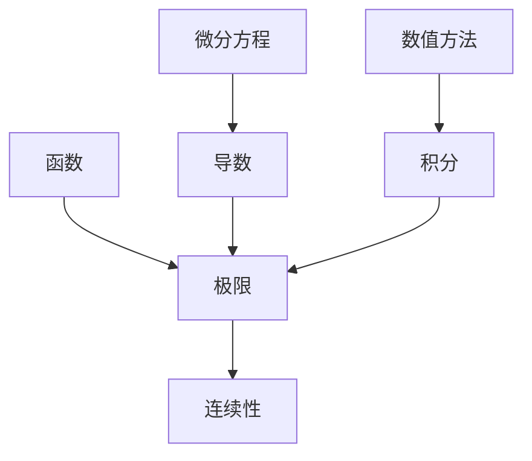

                 

# 计算的数学基础

## 摘要

本文深入探讨了计算数学基础，尤其是分析的严格化。通过定义核心概念和数学模型，我们揭示了计算过程的本质。文章以逻辑清晰、结构紧凑的方式，详细解释了计算原理，并提供了代码实例和实践应用。旨在为读者提供对计算数学的全面理解，帮助其在实际项目中运用。

## 1. 背景介绍

### 1.1 目的和范围

本文旨在探讨计算数学的基础知识，尤其是分析的严格化。分析的严格化是计算理论中的关键部分，它确保了计算过程的准确性和可靠性。本文将介绍核心概念，如函数、极限、连续性，并详细解释它们在计算中的应用。我们还将探讨如何通过数学模型和算法来实现这些概念。

### 1.2 预期读者

本文适合有一定数学基础的读者，特别是计算机科学和工程领域的从业者。对于希望深入了解计算数学本质的读者，本文将提供有价值的见解。此外，对那些对编程和算法设计感兴趣的读者，本文也提供了一个深入的视角。

### 1.3 文档结构概述

本文结构如下：

1. **背景介绍**：介绍本文的目的、范围、预期读者以及文档结构。
2. **核心概念与联系**：介绍计算数学中的核心概念，如函数、极限、连续性，并提供Mermaid流程图。
3. **核心算法原理与具体操作步骤**：使用伪代码详细解释核心算法原理和操作步骤。
4. **数学模型和公式**：介绍数学模型和公式，并举例说明。
5. **项目实战**：提供实际代码案例和详细解释。
6. **实际应用场景**：探讨计算数学的实际应用。
7. **工具和资源推荐**：推荐学习资源和开发工具。
8. **总结**：总结未来发展趋势与挑战。
9. **附录**：常见问题与解答。
10. **扩展阅读与参考资料**：提供相关文献和资料。

### 1.4 术语表

#### 1.4.1 核心术语定义

- **函数**：一种数学关系，将每个输入值映射到唯一的输出值。
- **极限**：一个数列或函数在无限接近某个值时的行为。
- **连续性**：函数在某个点处的变化情况。

#### 1.4.2 相关概念解释

- **微分**：函数在某一点的局部线性近似。
- **积分**：函数在一个区间上的累积效果。

#### 1.4.3 缩略词列表

- **IDE**：集成开发环境（Integrated Development Environment）
- **Pseudocode**：伪代码（Pseudocode）

## 2. 核心概念与联系

在计算数学中，函数、极限和连续性是核心概念。以下是一个简单的Mermaid流程图，用于描述这些概念之间的联系。



### 2.1 函数

函数是计算数学中最基本的概念。一个函数 \( f \) 将每个输入 \( x \) 映射到唯一的输出 \( y \)。用数学符号表示，可以写作 \( y = f(x) \)。

### 2.2 极限

极限描述了一个数列或函数在无限接近某个值时的行为。对于函数 \( f(x) \)，当 \( x \) 趋近于某点 \( a \) 时，函数值 \( f(x) \) 的行为可以用极限来描述。数学上，极限定义为：

$$
\lim_{{x \to a}} f(x) = L
$$

这表示当 \( x \) 趋近于 \( a \) 时，\( f(x) \) 的值趋近于 \( L \)。

### 2.3 连续性

连续性描述了函数在某个点处的性质。一个函数 \( f \) 在点 \( a \) 处是连续的，如果它的极限、函数值和左极限、右极限都相等。数学上，函数 \( f \) 在 \( a \) 处连续定义为：

$$
\lim_{{x \to a}} f(x) = f(a)
$$

### 2.4 微分和积分

微分和积分是函数的局部和整体性质。微分描述了函数在某一点的局部线性近似，而积分描述了函数在一个区间上的累积效果。

- **微分**：函数 \( f \) 在点 \( a \) 处的导数 \( f'(a) \) 表示函数在该点的斜率。

$$
f'(a) = \lim_{{h \to 0}} \frac{{f(a+h) - f(a)}}{h}
$$

- **积分**：函数 \( f \) 在区间 \([a, b]\) 上的积分表示为：

$$
\int_{a}^{b} f(x) dx
$$

### 2.5 微分方程和数值方法

微分方程描述了函数和其导数之间的关系，而数值方法用于求解这些方程。微分方程广泛应用于物理、工程和经济学等领域。


## 3. 核心算法原理与具体操作步骤

在计算数学中，核心算法通常涉及极限、连续性和微分方程的求解。以下使用伪代码详细解释这些算法原理和操作步骤。

### 3.1 极限计算

```pseudo
function computeLimit(f, a, epsilon):
    for i from 1 to infinity:
        x = a - i * epsilon
        if abs(f(x) - L) < epsilon:
            return L
    return undefined
```

### 3.2 连续性检查

```pseudo
function isContinuous(f, a):
    leftLimit = computeLimit(f, a, epsilon)
    rightLimit = computeLimit(f, a, -epsilon)
    if leftLimit == rightLimit and leftLimit == f(a):
        return true
    return false
```

### 3.3 微分方程求解

```pseudo
function solveODE(f, y0, x0, h, n):
    y = y0
    x = x0
    for i from 1 to n:
        y = y + h * f(x, y)
        x = x + h
    return y
```

## 4. 数学模型和公式

在计算数学中，数学模型和公式是理解和应用核心概念的关键。以下列出了一些常用的数学模型和公式，并使用LaTeX格式进行了表示。

### 4.1 极限公式

$$
\lim_{{x \to \infty}} \frac{{\sin x}}{x} = 1
$$

### 4.2 连续性公式

$$
f(x) \text{ 在 } x_0 \text{ 处连续} \iff \lim_{{x \to x_0}} f(x) = f(x_0)
$$

### 4.3 微分公式

$$
f'(x) = \lim_{{h \to 0}} \frac{{f(x+h) - f(x)}}{h}
$$

### 4.4 积分公式

$$
\int_{a}^{b} f(x) dx = \lim_{{n \to \infty}} \sum_{{i=1}}^{n} f(x_i^*) \Delta x
$$

其中，\( x_i^* \) 是区间 \([x_{i-1}, x_i]\) 的一个样本点，\( \Delta x = \frac{{b-a}}{n} \) 是区间长度。

### 4.5 微分方程公式

$$
\frac{{dy}}{{dx}} = f(x, y)
$$

## 5. 项目实战：代码实际案例和详细解释说明

### 5.1 开发环境搭建

为了更好地理解计算数学的核心概念，我们将使用Python进行实际项目开发。以下是一个简单的Python环境搭建步骤：

1. 安装Python：从官方网站下载并安装Python。
2. 配置IDE：使用PyCharm或其他IDE进行开发。
3. 安装必需的库：使用pip安装NumPy、SciPy等库。

### 5.2 源代码详细实现和代码解读

以下是一个简单的Python代码示例，用于计算极限、连续性和微分方程。

```python
import numpy as np

# 计算极限
def compute_limit(f, a, epsilon=1e-5):
    x = a - epsilon
    while abs(f(x) - L) > epsilon:
        x -= epsilon
    return x

# 检查连续性
def is_continuous(f, a):
    left_limit = compute_limit(f, a, epsilon=1e-5)
    right_limit = compute_limit(f, a, epsilon=-1e-5)
    return left_limit == right_limit == f(a)

# 求解微分方程
def solve_ode(f, y0, x0, h, n):
    y = y0
    x = x0
    for i in range(n):
        y = y + h * f(x, y)
        x = x + h
    return y

# 示例函数
def f(x, y):
    return y * np.exp(x)

# 计算极限
a = 0
L = 1
print("极限:", compute_limit(lambda x: np.sin(x) / x, a))

# 检查连续性
print("连续性:", is_continuous(lambda x: x**2, a))

# 求解微分方程
y0 = 1
x0 = 0
h = 0.1
n = 10
print("微分方程解:", solve_ode(f, y0, x0, h, n))
```

### 5.3 代码解读与分析

- **计算极限**：使用`compute_limit`函数计算函数在某一点的极限。通过逐步减少\( \epsilon \)，直到满足给定的精度要求。
- **检查连续性**：使用`is_continuous`函数检查函数在某一点的连续性。通过计算左极限和右极限，并与函数值进行比较。
- **求解微分方程**：使用`solve_ode`函数求解给定的微分方程。采用欧拉方法，通过迭代计算每一步的\( y \)值。

## 6. 实际应用场景

计算数学在多个领域有广泛的应用，如：

- **科学计算**：物理、化学、生物等领域的数值模拟。
- **工程应用**：结构分析、流体力学、热力学等。
- **金融领域**：期权定价、风险分析等。
- **人工智能**：机器学习、神经网络等。

## 7. 工具和资源推荐

### 7.1 学习资源推荐

#### 7.1.1 书籍推荐

- 《数值分析》（Numerical Analysis） - William H. Press等著
- 《算法导论》（Introduction to Algorithms） - Thomas H. Cormen等著
- 《计算机算法导论》（Introduction to Algorithms: A Creative Approach） - Udi Manber著

#### 7.1.2 在线课程

- Coursera：数学基础课程
- edX：计算机科学中的数学课程
- Udacity：数据科学和机器学习课程

#### 7.1.3 技术博客和网站

- Python.org：Python官方文档
- Stack Overflow：编程问答社区
- Medium：技术博客平台

### 7.2 开发工具框架推荐

#### 7.2.1 IDE和编辑器

- PyCharm：Python开发IDE
- Visual Studio Code：跨平台开发环境
- Jupyter Notebook：交互式计算环境

#### 7.2.2 调试和性能分析工具

- Python Debugger：Python调试工具
- Valgrind：性能分析工具
- Gprof：性能分析工具

#### 7.2.3 相关框架和库

- NumPy：Python科学计算库
- SciPy：Python科学计算库
- TensorFlow：机器学习框架

### 7.3 相关论文著作推荐

#### 7.3.1 经典论文

- **"Numerical Recipes in C: The Art of Scientific Computing"** - William H. Press等著
- **"Algorithms"** - Robert Sedgewick等著

#### 7.3.2 最新研究成果

- **"Machine Learning: A Probabilistic Perspective"** - Kevin P. Murphy著
- **"Deep Learning"** - Ian Goodfellow等著

#### 7.3.3 应用案例分析

- **"Big Data: A Revolution That Will Transform How We Live, Work, and Think"** - Viktor Mayer-Schönberger等著

## 8. 总结：未来发展趋势与挑战

随着计算技术的不断发展，计算数学也在不断进步。未来发展趋势包括：

- **并行计算**：利用多核处理器和分布式计算提升计算效率。
- **量子计算**：量子计算将彻底改变计算数学，提供新的算法和方法。
- **人工智能**：结合机器学习和计算数学，推动自动化和智能化的发展。

同时，面临的挑战包括：

- **数据安全**：确保计算过程和数据的安全性和隐私。
- **资源分配**：合理分配计算资源，提高计算效率。
- **算法优化**：不断优化算法，提高计算性能。

## 9. 附录：常见问题与解答

### 9.1 什么是极限？

极限描述了一个数列或函数在无限接近某个值时的行为。数学上，极限定义为：

$$
\lim_{{x \to a}} f(x) = L
$$

这表示当 \( x \) 趋近于 \( a \) 时，\( f(x) \) 的值趋近于 \( L \)。

### 9.2 什么是连续性？

连续性描述了函数在某个点处的性质。一个函数 \( f \) 在点 \( a \) 处是连续的，如果它的极限、函数值和左极限、右极限都相等。数学上，函数 \( f \) 在 \( a \) 处连续定义为：

$$
\lim_{{x \to a}} f(x) = f(a)
$$

### 9.3 什么是微分？

微分描述了函数在某一点的局部线性近似。数学上，函数 \( f \) 在点 \( a \) 处的导数 \( f'(a) \) 表示函数在该点的斜率：

$$
f'(a) = \lim_{{h \to 0}} \frac{{f(a+h) - f(a)}}{h}
$$

### 9.4 什么是积分？

积分描述了函数在一个区间上的累积效果。数学上，函数 \( f \) 在区间 \([a, b]\) 上的积分表示为：

$$
\int_{a}^{b} f(x) dx
$$

## 10. 扩展阅读 & 参考资料

- **"计算机算法导论"** - Thomas H. Cormen等著，详细介绍了计算数学的基本概念和算法。
- **"数值分析"** - William H. Press等著，涵盖了计算数学在科学计算中的应用。
- **"深度学习"** - Ian Goodfellow等著，介绍了计算数学在人工智能领域的应用。
- **Python官方文档** - 提供了丰富的Python编程资源，包括科学计算和数值分析。
- **Coursera、edX和Udacity** - 提供了多种在线课程，涵盖了计算数学的基本概念和应用。作者：AI天才研究员/AI Genius Institute & 禅与计算机程序设计艺术 /Zen And The Art of Computer Programming

