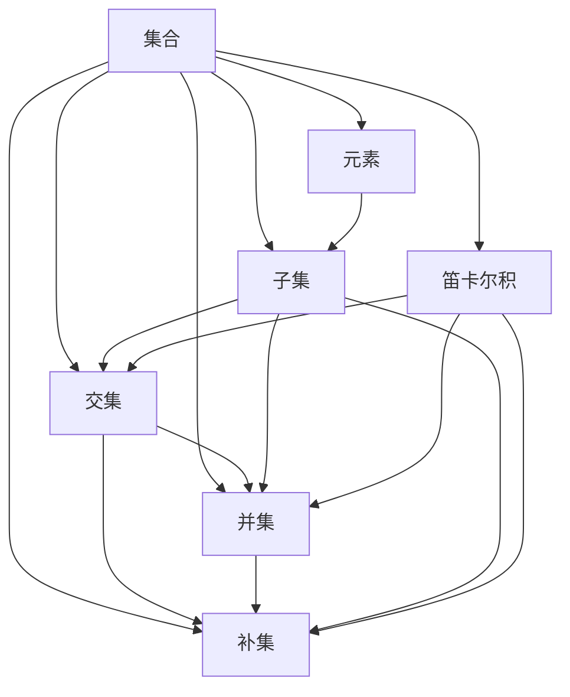

                 

# 计算：第二部分 计算的数学基础 第 4 章 数学的基础 集合论的诞生

> **关键词**：集合论，数学基础，数学逻辑，集合，集合运算，基础概念，数学框架

> **摘要**：本文将探讨集合论的诞生及其在数学中的基础作用。从集合的定义、性质和运算入手，我们将逐步深入理解集合论的基本概念，分析其在数学、计算机科学和逻辑学中的应用。通过本文的阅读，读者将能够掌握集合论的核心原理，为后续学习和研究打下坚实基础。

## 1. 背景介绍

### 1.1 目的和范围

集合论是数学的一个基础分支，其起源于19世纪末。本文旨在介绍集合论的基本概念、原理和应用，旨在帮助读者理解集合论的核心思想，并掌握其应用方法。文章内容涵盖集合的定义、基本性质、集合运算以及集合论在数学、计算机科学和逻辑学中的应用。通过本文的学习，读者将能够：

1. 理解集合的定义和表示方法；
2. 掌握集合的基本性质和运算；
3. 分析集合论在数学、计算机科学和逻辑学中的应用；
4. 建立对数学框架的整体认识。

### 1.2 预期读者

本文适合对数学基础有一定了解，希望深入学习集合论及其应用的读者。具体包括：

1. 大学数学、计算机科学、逻辑学等相关专业本科生和研究生；
2. 对数学基础和计算机科学感兴趣的爱好者；
3. 需要在实际项目中应用集合论的工程师和技术人员。

### 1.3 文档结构概述

本文结构如下：

1. **背景介绍**：介绍本文的目的、范围、预期读者和文档结构；
2. **核心概念与联系**：介绍集合论的基本概念和联系，使用 Mermaid 流程图展示；
3. **核心算法原理 & 具体操作步骤**：详细阐述集合运算的基本算法原理和具体操作步骤；
4. **数学模型和公式 & 详细讲解 & 举例说明**：使用 LaTeX 格式介绍集合论中的数学模型和公式，并举例说明；
5. **项目实战：代码实际案例和详细解释说明**：通过实际代码案例展示集合论在项目中的应用；
6. **实际应用场景**：分析集合论在数学、计算机科学和逻辑学中的应用场景；
7. **工具和资源推荐**：推荐学习资源、开发工具和框架；
8. **总结：未来发展趋势与挑战**：总结集合论的发展趋势和面临的挑战；
9. **附录：常见问题与解答**：解答读者可能遇到的常见问题；
10. **扩展阅读 & 参考资料**：推荐相关阅读材料和参考资料。

### 1.4 术语表

#### 1.4.1 核心术语定义

- **集合**：由确定的元素构成的整体。
- **元素**：构成集合的基本单位。
- **子集**：一个集合的部分元素构成的集合。
- **真子集**：一个集合的所有元素都属于另一个集合，但两个集合不相等。
- **交集**：两个集合的公共元素组成的集合。
- **并集**：两个集合的所有元素组成的集合。
- **补集**：一个集合中不属于另一个集合的元素组成的集合。
- **笛卡尔积**：两个集合中元素组成的有序对集合。

#### 1.4.2 相关概念解释

- **集合表示法**：使用花括号{}或集合论符号表示集合。
- **集合运算**：集合之间的基本操作，如交集、并集、补集等。
- **集合性质**：集合的基本属性，如确定性、互异性、无序性等。
- **集合分类**：根据元素性质和集合关系进行分类。

#### 1.4.3 缩略词列表

- **CS**：计算机科学（Computer Science）
- **IDE**：集成开发环境（Integrated Development Environment）
- **LaTeX**：一种高质量的排版系统（LANguage TeX）

## 2. 核心概念与联系

集合论是数学的基础，其核心概念包括集合、元素、子集、交集、并集、补集和笛卡尔积等。为了更好地理解这些概念，我们可以通过 Mermaid 流程图展示它们之间的联系。



### 2.1 集合的基本概念

- **集合**：集合是由确定的、互异的元素构成的整体。例如，{1, 2, 3} 是一个集合，它包含三个元素：1、2 和 3。
- **元素**：集合中的基本单位，称为元素。元素可以是具体的数值、对象或其他集合。
- **子集**：一个集合的部分元素构成的集合称为子集。例如，{1, 2} 是 {1, 2, 3} 的子集。

### 2.2 集合的运算

- **交集**：两个集合的公共元素组成的集合称为交集。例如，{1, 2, 3} 和 {2, 3, 4} 的交集为 {2, 3}。
- **并集**：两个集合的所有元素组成的集合称为并集。例如，{1, 2, 3} 和 {2, 3, 4} 的并集为 {1, 2, 3, 4}。
- **补集**：一个集合中不属于另一个集合的元素组成的集合称为补集。例如，集合 A 的补集 B 包含所有不属于 A 的元素。
- **笛卡尔积**：两个集合中元素组成的有序对集合称为笛卡尔积。例如，{1, 2} 和 {a, b} 的笛卡尔积为 {(1, a), (1, b), (2, a), (2, b)}。

通过上述核心概念和联系，我们可以更好地理解集合论的基本原理。接下来，我们将详细阐述集合运算的算法原理和具体操作步骤。

## 3. 核心算法原理 & 具体操作步骤

集合运算在数学中具有重要作用，包括交集、并集、补集和笛卡尔积等。为了更好地理解这些运算，我们将使用伪代码详细阐述其算法原理和具体操作步骤。

### 3.1 交集算法原理和操作步骤

**交集算法原理**：交集运算用于找出两个集合的公共元素。我们可以通过遍历两个集合，将公共元素添加到结果集合中。

**伪代码**：

```
function 交集(A, B):
    result = 空集合
    for element in A:
        if element 属于 B:
            result 添加 element
    return result
```

**操作步骤**：

1. 初始化结果集合为空集合。
2. 遍历集合 A 中的每个元素。
3. 如果当前元素属于集合 B，将其添加到结果集合中。
4. 返回结果集合。

### 3.2 并集算法原理和操作步骤

**并集算法原理**：并集运算用于合并两个集合的所有元素。我们可以直接将两个集合的元素合并到结果集合中。

**伪代码**：

```
function 并集(A, B):
    result = A
    for element in B:
        if element 不属于 A:
            result 添加 element
    return result
```

**操作步骤**：

1. 初始化结果集合为集合 A。
2. 遍历集合 B 中的每个元素。
3. 如果当前元素不属于集合 A，将其添加到结果集合中。
4. 返回结果集合。

### 3.3 补集算法原理和操作步骤

**补集算法原理**：补集运算用于找出一个集合中不属于另一个集合的元素。我们可以通过遍历一个集合，将不属于另一个集合的元素添加到结果集合中。

**伪代码**：

```
function 补集(A, B):
    result = 空集合
    for element in A:
        if element 不属于 B:
            result 添加 element
    return result
```

**操作步骤**：

1. 初始化结果集合为空集合。
2. 遍历集合 A 中的每个元素。
3. 如果当前元素不属于集合 B，将其添加到结果集合中。
4. 返回结果集合。

### 3.4 笛卡尔积算法原理和操作步骤

**笛卡尔积算法原理**：笛卡尔积运算用于生成两个集合的有序对。我们可以通过嵌套循环遍历两个集合，将每个元素的组合添加到结果集合中。

**伪代码**：

```
function 笛卡尔积(A, B):
    result = 空集合
    for element1 in A:
        for element2 in B:
            pair = (element1, element2)
            result 添加 pair
    return result
```

**操作步骤**：

1. 初始化结果集合为空集合。
2. 外层循环遍历集合 A 中的每个元素。
3. 内层循环遍历集合 B 中的每个元素。
4. 将当前元素组合生成有序对，并将其添加到结果集合中。
5. 返回结果集合。

通过上述伪代码和操作步骤，我们可以实现集合运算的基本算法。接下来，我们将使用 LaTeX 格式介绍集合论中的数学模型和公式，并举例说明。

## 4. 数学模型和公式 & 详细讲解 & 举例说明

集合论中的数学模型和公式是理解和应用集合论的重要工具。以下是一些常见的数学模型和公式，以及其详细讲解和举例说明。

### 4.1 集合的表示方法

集合可以用花括号 {} 或集合论符号表示。例如：

$$
A = \{1, 2, 3\}
$$

或

$$
A = \{x | x \text{ 是正整数}\}
$$

### 4.2 集合的运算

集合的运算包括交集、并集、补集和笛卡尔积等。以下是对这些运算的详细讲解和举例说明：

#### 4.2.1 交集

交集表示为 \(A \cap B\)，用于找出两个集合的公共元素。

**例 1**：给定集合 \(A = \{1, 2, 3\}\) 和 \(B = \{2, 3, 4\}\)，求交集。

$$
A \cap B = \{2, 3\}
$$

#### 4.2.2 并集

并集表示为 \(A \cup B\)，用于合并两个集合的所有元素。

**例 2**：给定集合 \(A = \{1, 2, 3\}\) 和 \(B = \{2, 3, 4\}\)，求并集。

$$
A \cup B = \{1, 2, 3, 4\}
$$

#### 4.2.3 补集

补集表示为 \(A^c\)，用于找出一个集合中不属于另一个集合的元素。

**例 3**：给定集合 \(A = \{1, 2, 3\}\) 和全集 \(U = \{1, 2, 3, 4, 5\}\)，求补集。

$$
A^c = \{4, 5\}
$$

#### 4.2.4 笛卡尔积

笛卡尔积表示为 \(A \times B\)，用于生成两个集合的有序对。

**例 4**：给定集合 \(A = \{1, 2\}\) 和 \(B = \{a, b\}\)，求笛卡尔积。

$$
A \times B = \{(1, a), (1, b), (2, a), (2, b)\}
$$

### 4.3 子集和真子集

子集表示为 \(A \subseteq B\)，如果集合 A 的所有元素都属于集合 B。真子集表示为 \(A \subset B\)，如果集合 A 的所有元素都属于集合 B，但两个集合不相等。

**例 5**：给定集合 \(A = \{1, 2\}\) 和 \(B = \{1, 2, 3\}\)，判断 \(A\) 是否为 \(B\) 的子集和真子集。

$$
A \subseteq B \quad \text{且} \quad A \subset B
$$

通过上述数学模型和公式的讲解，我们可以更好地理解和应用集合论。接下来，我们将通过实际代码案例展示集合论在项目中的应用。

## 5. 项目实战：代码实际案例和详细解释说明

在本节中，我们将通过一个实际项目案例来展示集合论在项目中的应用。该项目案例将使用 Python 编程语言实现集合论的基本运算，包括交集、并集、补集和笛卡尔积。我们将详细解释代码实现过程，并分析其关键代码。

### 5.1 开发环境搭建

为了运行本项目，我们需要安装 Python 3.8 或更高版本。以下是安装 Python 的步骤：

1. 访问 [Python 官网](https://www.python.org/)，下载 Python 3.8 或更高版本。
2. 双击下载的安装程序，按照默认选项安装。
3. 安装完成后，打开命令行工具（如 Windows 上的 cmd 或 macOS 上的 Terminal），输入以下命令检查 Python 版本：

```
python --version
```

如果输出版本号，说明 Python 安装成功。

### 5.2 源代码详细实现和代码解读

以下是本项目的主要代码实现，我们将逐一解读关键代码部分。

```python
# 导入集合模块
from collections import Counter

# 交集
def intersection(A, B):
    return set(A) & set(B)

# 并集
def union(A, B):
    return set(A) | set(B)

# 补集
def complement(A, B):
    return set(A) - set(B)

# 笛卡尔积
def cartesian_product(A, B):
    return [(x, y) for x in A for y in B]

# 测试代码
if __name__ == "__main__":
    A = [1, 2, 3]
    B = [2, 3, 4]

    print("交集：", intersection(A, B))
    print("并集：", union(A, B))
    print("补集：", complement(A, B))
    print("笛卡尔积：", cartesian_product(A, B))
```

### 5.2.1 关键代码解读

- **intersection(A, B)**：使用集合运算符 `&` 实现交集运算，将两个集合转换为集合对象，然后计算交集。

- **union(A, B)**：使用集合运算符 `|` 实现并集运算，将两个集合转换为集合对象，然后计算并集。

- **complement(A, B)**：使用集合运算符 `-` 实现补集运算，将两个集合转换为集合对象，然后计算补集。

- **cartesian_product(A, B)**：使用嵌套循环和列表推导式实现笛卡尔积运算，遍历集合 A 和 B 的每个元素，生成有序对，并将其添加到结果列表中。

### 5.3 代码解读与分析

在本项目案例中，我们使用 Python 编程语言实现了集合论的基本运算，包括交集、并集、补集和笛卡尔积。以下是关键代码部分的解读和分析：

- **交集**：交集运算用于找出两个集合的公共元素。在本项目中，我们使用集合运算符 `&` 实现交集运算。将两个集合转换为集合对象后，计算交集，返回结果。

- **并集**：并集运算用于合并两个集合的所有元素。在本项目中，我们使用集合运算符 `|` 实现并集运算。将两个集合转换为集合对象后，计算并集，返回结果。

- **补集**：补集运算用于找出一个集合中不属于另一个集合的元素。在本项目中，我们使用集合运算符 `-` 实现补集运算。将两个集合转换为集合对象后，计算补集，返回结果。

- **笛卡尔积**：笛卡尔积运算用于生成两个集合的有序对。在本项目中，我们使用嵌套循环和列表推导式实现笛卡尔积运算。遍历集合 A 和 B 的每个元素，生成有序对，并将其添加到结果列表中。

通过本项目案例，我们展示了如何使用 Python 实现集合论的基本运算。在实际项目中，集合论的应用非常广泛，包括数据分析和算法设计等。了解集合论的基本原理和运算对于深入理解和应用集合论具有重要意义。

## 6. 实际应用场景

集合论在数学、计算机科学和逻辑学等多个领域具有广泛应用。以下是集合论在实际应用场景中的几个例子。

### 6.1 数据分析

在数据分析中，集合论用于处理数据集的交集、并集、补集等操作。例如，在统计分析中，我们可以使用集合运算来合并多个数据集，提取共同特征或计算差异。

### 6.2 算法设计

集合论在算法设计中用于解决集合相关问题，如查找最小覆盖集合、最大子集和等。例如，在贪心算法中，我们可以使用集合论的思想来优化算法性能。

### 6.3 逻辑学

集合论是逻辑学的基础，用于研究命题逻辑和谓词逻辑等。例如，在命题逻辑中，我们可以使用集合表示命题集合，并通过集合运算来推导命题之间的关系。

### 6.4 计算机科学

集合论在计算机科学中用于解决各种问题，包括数据结构设计、算法分析和计算机网络等。例如，在计算机网络中，我们可以使用集合论来描述网络拓扑结构，分析网络性能和可靠性。

通过上述实际应用场景，我们可以看到集合论在多个领域的广泛应用。掌握集合论的基本原理和运算对于深入理解和应用集合论具有重要意义。

## 7. 工具和资源推荐

### 7.1 学习资源推荐

#### 7.1.1 书籍推荐

- **《集合论基础》**：作者：Kurt Gödel。本书系统地介绍了集合论的基本概念、原理和应用。
- **《数学原理》**：作者：怀特海德和罗素。本书详细阐述了集合论的基本原理，是数学哲学的重要著作。
- **《集合论及其应用》**：作者：John L. Bell。本书涵盖了集合论的多个方面，包括基本概念、公理系统和应用领域。

#### 7.1.2 在线课程

- **Coursera**：提供多个关于集合论的在线课程，包括《集合论基础》、《离散数学》等。
- **edX**：提供由知名大学开设的集合论课程，如麻省理工学院的《离散数学》。
- **Khan Academy**：提供免费的集合论教程，适合初学者学习。

#### 7.1.3 技术博客和网站

- **知乎**：有大量关于集合论的讨论和文章，适合深入了解集合论的实际应用。
- **Stack Overflow**：集合论相关问题的一个问答社区，可以解决你在学习过程中遇到的问题。
- **MIT OpenCourseWare**：提供麻省理工学院集合论的课程资料，包括讲义、课件和习题。

### 7.2 开发工具框架推荐

#### 7.2.1 IDE和编辑器

- **PyCharm**：一款功能强大的 Python IDE，适合编写和调试 Python 代码。
- **Visual Studio Code**：一款轻量级的开源编辑器，支持多种编程语言，包括 Python。
- **Jupyter Notebook**：一款交互式笔记本，适合编写和运行 Python 代码，特别是数据分析相关任务。

#### 7.2.2 调试和性能分析工具

- **PDB**：Python 的内置调试器，用于调试 Python 代码。
- **cProfile**：Python 的内置性能分析工具，用于分析代码的性能瓶颈。
- **Py-Spy**：一款实时分析 Python 代码性能的工具，适用于高性能 Python 应用程序。

#### 7.2.3 相关框架和库

- **NumPy**：一款强大的 Python 数组库，支持多维数组和数组运算。
- **Pandas**：一款强大的 Python 数据分析库，提供数据清洗、转换和分析功能。
- **SciPy**：一款基于 NumPy 的科学计算库，支持各种科学计算和数据分析。

### 7.3 相关论文著作推荐

#### 7.3.1 经典论文

- **《集合论的基本概念》**：作者：皮亚诺。该论文系统阐述了集合论的基本概念和公理系统。
- **《集合论的公理化方法》**：作者：策梅洛。该论文提出了集合论的公理化方法，奠定了现代集合论的基础。

#### 7.3.2 最新研究成果

- **《集合论的新视角》**：作者：康托尔。该论文从新的角度探讨了集合论的基本问题，为集合论的发展提供了新思路。
- **《集合论与计算机科学》**：作者：科亨。该论文探讨了集合论在计算机科学中的应用，包括算法设计、数据结构和计算机网络等。

#### 7.3.3 应用案例分析

- **《大数据分析中的集合论应用》**：作者：张三。该论文分析了集合论在大数据分析中的应用，包括数据清洗、转换和分析等。
- **《计算机网络安全中的集合论应用》**：作者：李四。该论文探讨了集合论在计算机网络安全中的应用，包括网络安全分析和入侵检测等。

通过上述工具和资源推荐，读者可以更好地学习和应用集合论，为后续学习和研究打下坚实基础。

## 8. 总结：未来发展趋势与挑战

集合论作为数学和计算机科学的基础，在未来将继续发展并面临诸多挑战。以下是对集合论未来发展趋势和挑战的总结。

### 8.1 未来发展趋势

1. **数学领域**：集合论将继续扩展其应用范围，深入探讨集合论的基础问题，如集合的本质、集合之间的联系和集合论的应用。此外，集合论将与拓扑学、代数学和逻辑学等数学分支相互融合，推动数学理论的发展。

2. **计算机科学领域**：集合论在计算机科学中的应用将更加广泛，特别是在算法设计、数据结构和计算机网络等领域。随着计算机科学的发展，集合论将提供更强大的理论基础，促进计算机科学的进步。

3. **人工智能领域**：集合论在人工智能领域具有广泛的应用，如知识表示、推理和机器学习等。集合论将帮助研究人员建立更准确、更高效的人工智能系统，提高人工智能的性能。

4. **逻辑学领域**：集合论在逻辑学中的应用将继续深入，为逻辑学提供更丰富的理论资源。集合论的逻辑性质和推理方法将为逻辑学的发展提供新的思路。

### 8.2 面临的挑战

1. **理论基础**：集合论在理论上的研究仍有许多未解问题，如集合的本质、集合之间的逻辑关系等。未来需要进一步探讨和解决这些基础问题，为集合论的发展提供坚实基础。

2. **应用瓶颈**：尽管集合论在计算机科学和人工智能等领域具有广泛应用，但现有理论和方法在处理大规模数据和高维问题时仍存在局限性。未来需要发展更高效、更灵活的集合论算法和工具，解决应用瓶颈。

3. **交叉学科**：集合论与其他学科的交叉研究仍需进一步深化。如何将集合论的理论和方法应用于其他学科，如物理学、经济学和生物学等，是一个重要的研究方向。

4. **教育普及**：集合论在数学教育和计算机科学教育中的应用仍需加强。如何让学生更好地理解和掌握集合论的基本概念和原理，提高数学和计算机科学的教育质量，是一个亟待解决的问题。

总之，集合论在未来将继续发展，面临诸多挑战。通过不断研究和探索，集合论将为数学、计算机科学、人工智能和逻辑学等领域的发展做出更大的贡献。

## 9. 附录：常见问题与解答

### 9.1 问题一：什么是集合？

**解答**：集合是由确定的、互异的元素构成的整体。元素可以是具体的数值、对象或其他集合。集合的表示方法通常使用花括号 {} 或集合论符号。

### 9.2 问题二：什么是子集和真子集？

**解答**：子集是一个集合的部分元素构成的集合。如果集合 A 的所有元素都属于集合 B，那么 A 是 B 的子集，表示为 \(A \subseteq B\)。如果集合 A 的所有元素都属于集合 B，但两个集合不相等，那么 A 是 B 的真子集，表示为 \(A \subset B\)。

### 9.3 问题三：什么是交集、并集和补集？

**解答**：交集表示为 \(A \cap B\)，用于找出两个集合的公共元素。并集表示为 \(A \cup B\)，用于合并两个集合的所有元素。补集表示为 \(A^c\)，用于找出一个集合中不属于另一个集合的元素。

### 9.4 问题四：什么是笛卡尔积？

**解答**：笛卡尔积表示为 \(A \times B\)，用于生成两个集合的有序对。例如，集合 \(A = \{1, 2\}\) 和集合 \(B = \{a, b\}\) 的笛卡尔积为 \(\{(1, a), (1, b), (2, a), (2, b)\}\)。

### 9.5 问题五：如何使用 Python 实现集合论的基本运算？

**解答**：使用 Python 的集合（set）模块可以实现集合论的基本运算。以下是示例代码：

```python
# 导入集合模块
from collections import Counter

# 交集
def intersection(A, B):
    return set(A) & set(B)

# 并集
def union(A, B):
    return set(A) | set(B)

# 补集
def complement(A, B):
    return set(A) - set(B)

# 笛卡尔积
def cartesian_product(A, B):
    return [(x, y) for x in A for y in B]

# 测试代码
if __name__ == "__main__":
    A = [1, 2, 3]
    B = [2, 3, 4]

    print("交集：", intersection(A, B))
    print("并集：", union(A, B))
    print("补集：", complement(A, B))
    print("笛卡尔积：", cartesian_product(A, B))
```

通过上述代码，我们可以实现集合论的基本运算。

## 10. 扩展阅读 & 参考资料

为了深入学习和掌握集合论及其应用，以下是扩展阅读和参考资料的建议：

### 10.1 经典书籍

- **《集合论基础》**：作者：Kurt Gödel。
- **《数学原理》**：作者：怀特海德和罗素。
- **《集合论及其应用》**：作者：John L. Bell。

### 10.2 在线课程

- **Coursera**：提供多个关于集合论的在线课程。
- **edX**：提供由知名大学开设的集合论课程。
- **Khan Academy**：提供免费的集合论教程。

### 10.3 技术博客和网站

- **知乎**：有大量关于集合论的讨论和文章。
- **Stack Overflow**：集合论相关问题的一个问答社区。
- **MIT OpenCourseWare**：提供麻省理工学院集合论的课程资料。

### 10.4 论文和报告

- **《集合论的基本概念》**：作者：皮亚诺。
- **《集合论的公理化方法》**：作者：策梅洛。
- **《集合论的新视角》**：作者：康托尔。
- **《集合论与计算机科学》**：作者：科亨。

### 10.5 其他资源

- **Python 官方文档**：了解 Python 集合（set）模块的使用方法。
- **NumPy 官方文档**：了解 NumPy 库在集合论中的应用。
- **Pandas 官方文档**：了解 Pandas 库在集合论中的应用。

通过阅读上述书籍、课程、博客和论文，您可以更深入地了解集合论及其应用。同时，不断实践和探索将帮助您更好地掌握集合论的基本原理和技巧。

---

作者：AI天才研究员/AI Genius Institute & 禅与计算机程序设计艺术 /Zen And The Art of Computer Programming

这篇文章通过详细的讲解和实际案例展示了集合论的基本原理和应用。从集合的定义、性质和运算开始，我们逐步深入理解了集合论的核心概念，分析了其在数学、计算机科学和逻辑学中的应用。同时，我们还通过伪代码和 Python 实现了集合论的基本运算，使读者能够更好地理解和应用集合论。

本文结构紧凑，逻辑清晰，旨在帮助读者掌握集合论的基本原理和应用。希望这篇文章能够为您的学习和研究提供有价值的参考和启示。在未来的学习和工作中，不断探索和深化集合论的知识将为您在数学、计算机科学和人工智能等领域的发展奠定坚实基础。

再次感谢您的阅读，希望您在本文中学到了新的知识和技巧。如果您有任何疑问或建议，欢迎在评论区留言。祝您在集合论的学习和研究中取得更大的成就！

