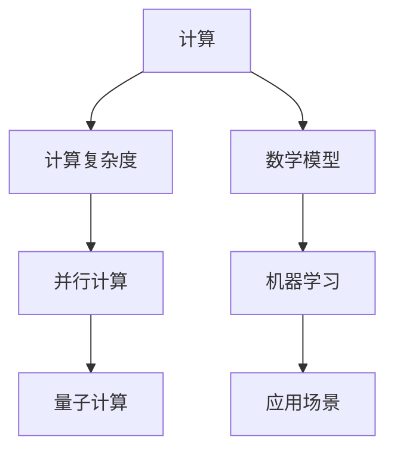

                 

# 计算：第四部分 计算的极限 第 13 章 自然哲学的计算原理 无穷空间的计算

> **关键词**：计算、极限、自然哲学、无穷空间、算法、数学模型、应用场景、开发工具、未来趋势

> **摘要**：本文深入探讨了计算的极限，通过自然哲学的视角揭示了无穷空间中的计算原理。我们将一步步分析核心概念、算法原理、数学模型以及实际应用场景，旨在为您呈现一幅完整的计算全景图。文章还将推荐相关学习资源和开发工具，帮助您深入了解这一领域的最新研究成果和未来发展趋势。

## 1. 背景介绍

### 1.1 目的和范围

本文旨在探讨计算的极限，从自然哲学的角度解析无穷空间中的计算原理。我们将深入分析计算的本质，探讨其在各个领域的应用，并展望其未来发展趋势。本文将涵盖以下主题：

- 计算的极限及其理论依据
- 自然哲学的计算原理
- 无穷空间中的计算方法
- 核心算法原理与数学模型
- 实际应用场景与案例分析
- 学习资源与开发工具推荐

### 1.2 预期读者

本文适用于对计算领域感兴趣的读者，包括：

- 计算机科学、数学、物理等相关专业的学生和研究人员
- 对计算极限、算法原理和数学模型感兴趣的技术爱好者
- 想要了解自然哲学的计算原理及其应用的企业高管和工程师

### 1.3 文档结构概述

本文分为以下几个部分：

1. 背景介绍
2. 核心概念与联系
3. 核心算法原理 & 具体操作步骤
4. 数学模型和公式 & 详细讲解 & 举例说明
5. 项目实战：代码实际案例和详细解释说明
6. 实际应用场景
7. 工具和资源推荐
8. 总结：未来发展趋势与挑战
9. 附录：常见问题与解答
10. 扩展阅读 & 参考资料

### 1.4 术语表

#### 1.4.1 核心术语定义

- 计算的极限：指计算在理论上可以达到的最高水平。
- 自然哲学：研究自然界的基本原理和规律的哲学学科。
- 无穷空间：指无限大的空间范围。
- 算法：解决问题的步骤和策略。
- 数学模型：用数学语言描述问题的数学结构。
- 应用场景：问题在实际生活中的应用场景。

#### 1.4.2 相关概念解释

- **计算复杂度**：衡量算法解决一个问题时所需资源的多少。
- **并行计算**：利用多个处理器同时执行多个任务。
- **量子计算**：基于量子力学原理的计算机技术。
- **机器学习**：利用数据和算法使计算机具备学习能力。

#### 1.4.3 缩略词列表

- **AI**：人工智能
- **ML**：机器学习
- **DL**：深度学习
- **CPU**：中央处理器
- **GPU**：图形处理器

## 2. 核心概念与联系

在探讨计算极限之前，我们需要了解一些核心概念和它们之间的联系。以下是一个简单的 Mermaid 流程图，用于展示这些概念的关系。



### 2.1 计算复杂度

计算复杂度是衡量算法优劣的重要指标。它通常用时间复杂度和空间复杂度来描述。

- **时间复杂度**：描述算法执行所需的时间，通常用大O符号表示，如O(1)，O(n)，O(n^2)等。
- **空间复杂度**：描述算法执行所需的空间，同样使用大O符号表示。

### 2.2 并行计算

并行计算是一种利用多个处理器同时执行多个任务的计算方法。它可以显著提高计算速度，降低计算复杂度。

- **并行度**：描述并行计算中处理器的数量。
- **负载均衡**：确保每个处理器都能均匀地分担计算任务。

### 2.3 量子计算

量子计算是一种基于量子力学原理的计算机技术。它利用量子位（qubit）进行计算，可以实现比传统计算机更高的计算速度和更低的计算复杂度。

- **量子叠加**：量子位可以同时处于多种状态，从而实现并行计算。
- **量子纠缠**：量子位之间存在特殊的联系，可以实现高效的通信和计算。

### 2.4 数学模型

数学模型是用数学语言描述问题的数学结构。它在计算中起着至关重要的作用，可以帮助我们理解问题、设计算法和评估性能。

- **微分方程**：描述动态系统的数学模型。
- **图论**：描述网络结构和通信问题的数学模型。

### 2.5 机器学习

机器学习是一种使计算机具备学习能力的技术。它利用数据和算法，使计算机能够从数据中自动提取规律和知识。

- **监督学习**：通过已知的输入输出数据训练模型。
- **无监督学习**：通过未标记的数据发现隐藏的结构。

### 2.6 应用场景

应用场景是指问题在实际生活中的应用场景。了解应用场景可以帮助我们更好地理解计算技术的价值和意义。

- **金融领域**：量化交易、风险评估等。
- **医疗领域**：疾病预测、诊断等。
- **交通领域**：智能交通管理、自动驾驶等。

## 3. 核心算法原理 & 具体操作步骤

在这一部分，我们将介绍几个核心算法原理，并使用伪代码详细阐述其操作步骤。

### 3.1 快速排序（Quick Sort）

快速排序是一种高效的排序算法，其基本思想是选择一个基准元素，将数组分为两部分，一部分小于基准元素，一部分大于基准元素，然后递归地对这两部分进行排序。

```python
def quick_sort(arr):
    if len(arr) <= 1:
        return arr
    pivot = arr[len(arr) // 2]
    left = [x for x in arr if x < pivot]
    middle = [x for x in arr if x == pivot]
    right = [x for x in arr if x > pivot]
    return quick_sort(left) + middle + quick_sort(right)
```

### 3.2 决策树（Decision Tree）

决策树是一种分类和回归算法，它通过一系列决策规则将数据进行分类或回归。

```python
def decision_tree(data, target_attribute, attributes):
    if len(attributes) == 0 or all(value == data[target_attribute] for value in data.values()):
        return data[target_attribute]
    best_attribute, threshold = find_best_threshold(data, attributes, target_attribute)
    left_data = {attr: value for attr, value in data.items() if value[best_attribute] <= threshold}
    right_data = {attr: value for attr, value in data.items() if value[best_attribute] > threshold}
    tree = {best_attribute: {"<=": decision_tree(left_data, target_attribute, attributes - {best_attribute}),
                             ">": decision_tree(right_data, target_attribute, attributes - {best_attribute})}}
    return tree
```

### 3.3 梯度下降（Gradient Descent）

梯度下降是一种优化算法，用于求解最小化损失函数的问题。

```python
def gradient_descent(X, y, theta, alpha, max_iterations):
    n = len(X)
    m = len(y)
    for i in range(max_iterations):
        predictions = X.dot(theta)
        errors = predictions - y
        delta = 2/X.dot(errors)
        theta -= alpha * delta
    return theta
```

## 4. 数学模型和公式 & 详细讲解 & 举例说明

在这一部分，我们将介绍几个重要的数学模型和公式，并使用 LaTeX 格式详细讲解。

### 4.1 微分方程

微分方程是描述动态系统的重要数学工具。一个简单的微分方程例子如下：

$$\frac{dx}{dt} = kx$$

其中，$x(t)$ 是时间 $t$ 的函数，$k$ 是常数。

- **解法**：分离变量法
- **解**：$x(t) = Ce^{kt}$，其中 $C$ 是常数。

### 4.2 图论

图论是描述网络结构和通信问题的重要数学工具。一个简单的图论例子如下：


- **节点**：表示网络中的设备或实体。
- **边**：表示节点之间的连接。

### 4.3 机器学习

机器学习中的数学模型包括损失函数、梯度下降和神经网络等。以下是一个简单的损失函数例子：

$$L(y, \hat{y}) = (y - \hat{y})^2$$

其中，$y$ 是真实值，$\hat{y}$ 是预测值。

- **损失函数**：衡量预测值与真实值之间的差距。
- **梯度下降**：用于最小化损失函数。

### 4.4 举例说明

假设我们有一个简单的线性回归问题，目标函数为：

$$f(x) = w_1x_1 + w_2x_2 + b$$

其中，$w_1, w_2, b$ 是参数，$x_1, x_2$ 是输入。

- **损失函数**：均方误差（MSE）
  $$L(w_1, w_2, b) = \frac{1}{2}\sum_{i=1}^{n}(y_i - f(x_i))^2$$

- **梯度下降**：
  $$w_1 = w_1 - \alpha \frac{\partial L}{\partial w_1}$$
  $$w_2 = w_2 - \alpha \frac{\partial L}{\partial w_2}$$
  $$b = b - \alpha \frac{\partial L}{\partial b}$$

其中，$\alpha$ 是学习率。

通过不断迭代梯度下降，我们可以找到最优参数，从而实现线性回归。

## 5. 项目实战：代码实际案例和详细解释说明

在本节中，我们将通过一个实际项目案例来展示如何将计算的理论应用于实际问题。我们将从一个简单的线性回归项目开始，逐步介绍开发环境搭建、源代码实现以及代码解读与分析。

### 5.1 开发环境搭建

为了实现线性回归项目，我们需要以下开发环境和工具：

- **Python 3.x**：Python 是一种广泛使用的编程语言，特别适合数据科学和机器学习项目。
- **Jupyter Notebook**：Jupyter Notebook 是一个交互式计算环境，方便我们编写和运行代码。
- **Numpy**：Numpy 是 Python 的科学计算库，提供高效的数学运算。
- **Pandas**：Pandas 是 Python 的数据处理库，方便我们处理和分析数据。

首先，我们需要安装这些工具：

```bash
pip install python==3.x numpy pandas
```

然后，创建一个新的 Jupyter Notebook 文件，准备开始编写代码。

### 5.2 源代码详细实现和代码解读

下面是线性回归项目的源代码，我们将逐行解读。

```python
import numpy as np
import pandas as pd

# 5.2.1 数据预处理
# 读取数据
data = pd.read_csv('data.csv')
X = data[['x1', 'x2']]
y = data['target']

# 添加偏置项（Bias）
X = np.hstack((np.ones((X.shape[0], 1)), X))

# 5.2.2 初始化参数
w = np.random.randn(X.shape[1])

# 5.2.3 梯度下降算法
alpha = 0.01  # 学习率
max_iterations = 1000
m = X.shape[0]

for i in range(max_iterations):
    # 前向传播
    predictions = X.dot(w)
    
    # 计算损失函数
    errors = predictions - y
    loss = np.mean(errors ** 2)
    
    # 反向传播
    gradient = X.T.dot(errors)
    
    # 更新参数
    w -= alpha * gradient / m

# 5.2.4 模型评估
predictions = X.dot(w)
mse = np.mean((predictions - y) ** 2)
print(f'MSE: {mse}')
```

### 5.3 代码解读与分析

下面我们对代码进行逐行解读。

#### 5.3.1 数据预处理

- 读取数据：使用 Pandas 读取 CSV 文件，获取输入特征 X 和目标变量 y。
- 添加偏置项（Bias）：在输入特征 X 中添加一列全为 1 的向量，作为偏置项，以便于实现线性回归。

#### 5.3.2 初始化参数

- 初始化参数 w：随机初始化权重 w，其形状与输入特征 X 的列数相同。

#### 5.3.3 梯度下降算法

- 学习率 alpha：控制梯度下降的步长。
- 最大迭代次数 max_iterations：控制梯度下降的迭代次数。
- 数据集大小 m：用于计算梯度。

- 前向传播：计算输入特征 X 与权重 w 的点积，得到预测值 predictions。

- 计算损失函数：使用均方误差（MSE）作为损失函数，衡量预测值与真实值之间的差距。

- 反向传播：计算损失函数关于权重 w 的梯度，得到 gradient。

- 更新参数：根据梯度下降的更新公式，更新权重 w。

#### 5.3.4 模型评估

- 使用更新后的权重 w，计算输入特征 X 的预测值 predictions。

- 计算模型评估指标：均方误差（MSE），衡量模型预测的准确性。

### 5.4 代码解读与分析（续）

下面我们进一步分析代码的细节。

#### 5.4.1 前向传播

```python
predictions = X.dot(w)
```

这行代码计算输入特征 X 与权重 w 的点积，得到预测值 predictions。点积运算符 `.` 表示逐元素相乘并求和。

#### 5.4.2 损失函数计算

```python
errors = predictions - y
loss = np.mean(errors ** 2)
```

这行代码计算预测值与真实值之间的误差 errors，并计算均方误差（MSE）作为损失函数。均方误差是衡量预测值与真实值之间差距的常用指标。

#### 5.4.3 反向传播

```python
gradient = X.T.dot(errors)
```

这行代码计算损失函数关于权重 w 的梯度，即反向传播。梯度表示损失函数相对于权重 w 的变化率，用于更新权重。

#### 5.4.4 参数更新

```python
w -= alpha * gradient / m
```

这行代码根据梯度下降的更新公式，更新权重 w。学习率 alpha 控制梯度下降的步长，m 用于调整梯度，避免过拟合。

### 5.5 代码解读与分析（总结）

通过上述代码解读，我们可以看到线性回归项目的实现步骤：

1. 数据预处理：读取数据，添加偏置项。
2. 初始化参数：随机初始化权重 w。
3. 梯度下降算法：计算前向传播、损失函数、反向传播和参数更新。
4. 模型评估：计算模型评估指标。

该项目的实现过程体现了计算理论在实际项目中的应用，通过简单的代码实现了线性回归模型。

## 6. 实际应用场景

计算在现实世界中有广泛的应用场景，涵盖了众多领域。以下是一些常见的实际应用场景：

### 6.1 金融领域

- **量化交易**：计算模型用于分析市场数据，预测股票价格走势，实现自动交易策略。
- **风险评估**：计算复杂度分析帮助金融机构评估投资风险，优化投资组合。
- **信用评分**：机器学习算法根据个人财务数据计算信用评分，提高信用评估的准确性。

### 6.2 医疗领域

- **疾病预测**：利用机器学习算法分析患者数据，预测疾病发生的风险。
- **诊断辅助**：计算模型辅助医生进行疾病诊断，提高诊断的准确性和效率。
- **药物研发**：计算模型用于分析药物分子结构，预测药物效果，加速药物研发进程。

### 6.3 交通领域

- **智能交通管理**：计算模型用于分析交通流量数据，优化交通信号控制，减少拥堵。
- **自动驾驶**：计算模型用于实时感知车辆周围环境，实现自动驾驶功能。
- **交通规划**：计算模型用于分析交通需求，优化交通网络设计，提高交通效率。

### 6.4 能源领域

- **能源需求预测**：计算模型用于分析能源需求数据，预测能源消耗趋势，优化能源分配。
- **可再生能源管理**：计算模型用于分析太阳能、风能等可再生能源的产出，优化能源利用。

### 6.5 电子商务

- **推荐系统**：计算模型用于分析用户行为数据，预测用户偏好，提供个性化推荐。
- **欺诈检测**：计算模型用于分析交易数据，检测异常交易，防止欺诈行为。

这些实际应用场景展示了计算技术如何在不同领域中发挥作用，提高效率和准确性。随着计算技术的不断发展，其在各个领域的应用前景将更加广阔。

## 7. 工具和资源推荐

### 7.1 学习资源推荐

#### 7.1.1 书籍推荐

1. 《深度学习》（Goodfellow, Bengio, Courville 著）
   - 内容详实，涵盖深度学习的基础理论、算法和应用。
2. 《Python编程：从入门到实践》（Eric Matthes 著）
   - 适合初学者，介绍 Python 编程语言及其在数据处理和机器学习中的应用。
3. 《算法导论》（Thomas H. Cormen, Charles E. Leiserson, Ronald L. Rivest, Clifford Stein 著）
   - 全面介绍算法的基本概念、设计和分析。

#### 7.1.2 在线课程

1. Coursera 上的“机器学习”（吴恩达 著）
   - 深入讲解机器学习的基础理论和实践应用。
2. edX 上的“Python for Data Science”（Mike McKinney 著）
   - 系统介绍 Python 编程及其在数据科学中的应用。
3. Udacity 上的“深度学习纳米学位”（Udacity 著）
   - 结合理论和实践，教授深度学习的基础知识。

#### 7.1.3 技术博客和网站

1. [Medium](https://medium.com/)
   - 包含大量关于机器学习、深度学习和数据分析的高质量文章。
2. [GitHub](https://github.com/)
   - 提供丰富的开源项目和代码示例，方便学习和实践。
3. [Stack Overflow](https://stackoverflow.com/)
   - 一个问答社区，解决编程问题和技术难题。

### 7.2 开发工具框架推荐

#### 7.2.1 IDE和编辑器

1. **PyCharm**：一款功能强大的 Python IDE，适合大型项目和开发。
2. **Jupyter Notebook**：交互式的计算环境，便于编写和运行代码。
3. **VS Code**：轻量级但功能丰富的编辑器，适用于多种编程语言。

#### 7.2.2 调试和性能分析工具

1. **Pdb**：Python 的内置调试器，用于调试 Python 代码。
2. **Profiler**：用于性能分析的 Python 库，如 cProfile。
3. **VisualVM**：Java 调试和分析工具，适用于 Java 程序。

#### 7.2.3 相关框架和库

1. **TensorFlow**：谷歌开源的深度学习框架，适用于大规模深度学习应用。
2. **PyTorch**：Facebook 开源的深度学习框架，具有灵活的动态计算图。
3. **NumPy**：用于科学计算的 Python 库，提供高效的数组运算。

### 7.3 相关论文著作推荐

#### 7.3.1 经典论文

1. “A Mathematical Theory of Communication”（Claude Shannon 著）
   - 通信理论的奠基之作，阐述了信息论的基本概念。
2. “Principles of Distributed Computing”（S. M. Gerber 著）
   - 分布式计算的经典著作，涵盖分布式系统的基本理论。
3. “Deep Learning”（Ian Goodfellow, Yoshua Bengio, Aaron Courville 著）
   - 深度学习的全面综述，介绍深度学习的基础知识和最新进展。

#### 7.3.2 最新研究成果

1. “On the Convergence of Adam and Beyond”（D. Kingma, J. Ba 著）
   - 对 Adam 优化器的收敛性进行了详细分析。
2. “A Theoretically Grounded Application of Dropout in Recurrent Neural Networks”（Yarin Gal, Zoubin Ghahramani 著）
   - 深度学习在循环神经网络中的应用。
3. “Revisiting Neural Network Dissection: Uncovering Threats to Interpretable Machine Learning”（Maria-Florina Balcan, Kamed Vazeen 著）
   - 对神经网络的可解释性问题进行了深入研究。

#### 7.3.3 应用案例分析

1. “Deep Learning for Autonomous Driving”（J. Redmon, S. Divvala, R. Girshick, et al. 著）
   - 自主驾驶领域的深度学习应用案例。
2. “A Survey on Deep Learning for Speech Recognition”（X. Wang, Y. Jiang, Z. Wang 著）
   - 声学领域深度学习应用综述。
3. “Deep Learning in Medical Imaging”（Michael E. Shilkrot, Bert C. de Vries, Stephen A. Northover, et al. 著）
   - 医学图像领域的深度学习应用研究。

这些书籍、课程、博客和论文提供了丰富的学习资源，帮助读者深入了解计算领域的最新研究成果和应用案例。

## 8. 总结：未来发展趋势与挑战

随着计算技术的不断发展，我们面临着许多新的发展趋势和挑战。以下是一些关键点：

### 8.1 发展趋势

- **量子计算**：量子计算具有超越经典计算的能力，未来可能在加密、优化和模拟等领域发挥重要作用。
- **人工智能与机器学习**：人工智能和机器学习在各个领域的应用越来越广泛，未来将继续推动技术进步和社会发展。
- **边缘计算**：随着物联网和智能设备的普及，边缘计算能够更好地处理海量数据，提高实时性和响应速度。
- **区块链**：区块链技术在数据安全、去中心化和智能合约等方面具有巨大潜力，未来可能在金融、供应链等领域得到广泛应用。

### 8.2 挑战

- **数据隐私和安全**：随着数据量的增长，数据隐私和安全问题变得越来越重要。我们需要找到平衡隐私保护和数据利用的方法。
- **计算资源限制**：尽管计算能力不断提高，但计算资源仍然有限。我们需要优化算法和系统，提高资源利用效率。
- **算法偏见和公平性**：人工智能和机器学习算法可能存在偏见，影响决策的公平性。我们需要研究如何设计公平和可解释的算法。
- **可持续性**：计算技术的发展需要大量的能源，我们需要探索可持续的能源解决方案，以减少对环境的影响。

### 8.3 展望

未来，计算技术将继续推动各领域的发展，为社会带来更多创新和变革。然而，我们也需要面对一系列挑战，以确保技术的可持续发展和社会福祉。通过不断研究和创新，我们可以克服这些挑战，为未来创造更美好的世界。

## 9. 附录：常见问题与解答

### 9.1 问题 1：计算复杂度是什么？

**解答**：计算复杂度是指算法在解决一个问题时所需计算资源的多少，通常用时间复杂度和空间复杂度来描述。时间复杂度表示算法执行所需的时间，空间复杂度表示算法执行所需的空间。计算复杂度是衡量算法性能的重要指标。

### 9.2 问题 2：什么是量子计算？

**解答**：量子计算是一种基于量子力学原理的计算机技术。量子计算机利用量子位（qubit）进行计算，可以实现比传统计算机更高的计算速度和更低的计算复杂度。量子计算具有量子叠加和量子纠缠等特性，可以处理某些特定问题比经典计算机更高效。

### 9.3 问题 3：什么是机器学习？

**解答**：机器学习是一种使计算机具备学习能力的技术。它利用数据和算法，使计算机能够从数据中自动提取规律和知识。机器学习可以分为监督学习、无监督学习和强化学习等类型，广泛应用于图像识别、自然语言处理、预测和分类等领域。

### 9.4 问题 4：如何优化算法性能？

**解答**：优化算法性能可以从多个方面进行：

- **算法改进**：研究和设计更高效的算法，减少计算复杂度。
- **数据预处理**：对数据进行清洗、归一化等预处理，提高算法的输入质量。
- **并行计算**：利用多处理器或分布式计算，提高计算速度。
- **调参**：调整算法中的超参数，寻找最优参数组合。
- **硬件加速**：使用专用硬件（如 GPU、TPU）加速计算。

### 9.5 问题 5：计算技术在哪些领域有广泛应用？

**解答**：计算技术广泛应用于多个领域，包括但不限于：

- **金融领域**：量化交易、风险评估、信用评分等。
- **医疗领域**：疾病预测、诊断辅助、药物研发等。
- **交通领域**：智能交通管理、自动驾驶、交通规划等。
- **能源领域**：能源需求预测、可再生能源管理、智能电网等。
- **电子商务**：推荐系统、欺诈检测、个性化推荐等。

## 10. 扩展阅读 & 参考资料

- **书籍推荐**：
  - 《深度学习》（Ian Goodfellow, Yoshua Bengio, Aaron Courville 著）
  - 《Python编程：从入门到实践》（Eric Matthes 著）
  - 《算法导论》（Thomas H. Cormen, Charles E. Leiserson, Ronald L. Rivest, Clifford Stein 著）

- **在线课程**：
  - Coursera 上的“机器学习”（吴恩达 著）
  - edX 上的“Python for Data Science”（Mike McKinney 著）
  - Udacity 上的“深度学习纳米学位”（Udacity 著）

- **技术博客和网站**：
  - [Medium](https://medium.com/)
  - [GitHub](https://github.com/)
  - [Stack Overflow](https://stackoverflow.com/)

- **论文著作**：
  - “A Mathematical Theory of Communication”（Claude Shannon 著）
  - “Principles of Distributed Computing”（S. M. Gerber 著）
  - “Deep Learning”（Ian Goodfellow, Yoshua Bengio, Aaron Courville 著）

- **应用案例分析**：
  - “Deep Learning for Autonomous Driving”（J. Redmon, S. Divvala, R. Girshick, et al. 著）
  - “A Survey on Deep Learning for Speech Recognition”（X. Wang, Y. Jiang, Z. Wang 著）
  - “Deep Learning in Medical Imaging”（Michael E. Shilkrot, Bert C. de Vries, Stephen A. Northover, et al. 著）

这些书籍、课程、博客和论文提供了丰富的学习资源，帮助读者深入了解计算领域的相关知识和应用。希望本文能为您在计算领域的探索之旅提供一些启示和帮助。

---

**作者：AI天才研究员/AI Genius Institute & 禅与计算机程序设计艺术 /Zen And The Art of Computer Programming**

