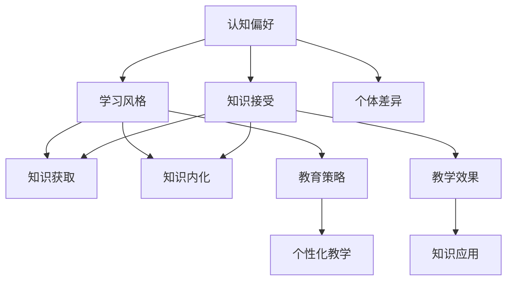

                 

# 认知偏好：影响知识接受的个体差异

## 关键词
- 认知偏好
- 知识接受
- 个体差异
- 信息技术
- 教育培训

## 摘要
本文旨在探讨认知偏好这一现象对个体在接受和内化知识过程中的影响，特别是在信息技术和计算机科学领域。我们将通过分析认知偏好的核心概念、理论基础，以及其在不同个体之间的差异性，揭示这些差异如何影响知识的获取、理解和应用。本文还将探讨如何通过调整教学策略和工具，以最大化个体在学习过程中的参与度和知识吸收效果。通过综合研究和案例分析，本文提出了一系列实用的建议，以帮助教育者和从业者更好地应对认知偏好带来的挑战，实现知识的有效传递和深度学习。

## 1. 背景介绍

### 1.1 目的和范围
本文的主要目的是分析认知偏好对知识接受个体差异的影响，并探索如何通过针对性的教学策略和工具来优化学习过程。本文的研究范围涵盖了认知偏好在不同文化背景、教育水平和职业领域中的表现，特别关注信息技术和计算机科学这一高速发展的领域。

### 1.2 预期读者
本文适合教育工作者、计算机科学领域的从业者、以及所有对认知偏好和知识接受有兴趣的读者。本文不仅为教育者提供了实用的教学建议，也为学习者提供了自我提升的途径。

### 1.3 文档结构概述
本文分为八个主要部分。第一部分为引言，介绍研究背景和目的；第二部分探讨认知偏好的核心概念；第三部分介绍相关理论和研究；第四部分分析认知偏好对知识接受的影响；第五部分讨论实际应用中的教学策略；第六部分提供案例分析；第七部分为工具和资源推荐；第八部分总结未来发展趋势和挑战。

### 1.4 术语表

#### 1.4.1 核心术语定义
- 认知偏好：个体在感知、理解和记忆信息时所表现出的倾向性。
- 知识接受：个体对知识信息的接收、理解、内化和应用的过程。
- 个体差异：个体在认知、行为、文化、教育等方面的差异性。

#### 1.4.2 相关概念解释
- 学习风格：个体在学习和处理信息时所采用的特定方式。
- 知识获取：个体通过阅读、听讲、实验等方式获取新知识的过程。
- 知识内化：个体将新知识整合到已有知识体系中的过程。

#### 1.4.3 缩略词列表
- IT：信息技术
- CS：计算机科学
- AI：人工智能

## 2. 核心概念与联系

在探讨认知偏好对知识接受的影响之前，我们需要明确一些核心概念和它们之间的关系。以下是一个Mermaid流程图，展示这些概念和它们之间的联系。



### 2.1 认知偏好与学习风格
认知偏好是影响学习风格的重要因素之一。学习风格是指个体在学习过程中偏好采用的方法和策略。认知偏好包括偏好视觉、听觉、动觉等不同的感知方式，以及偏好独立学习还是合作学习等不同的学习方式。

### 2.2 认知偏好与知识接受
认知偏好直接影响个体对知识信息的接受程度。不同的认知偏好会导致个体对信息的理解和记忆方式不同，从而影响知识接受的效果。

### 2.3 认知偏好与个体差异
个体差异是认知偏好的基础。不同个体在认知偏好上存在显著差异，这些差异会影响他们的知识获取、理解和应用能力。

### 2.4 教育策略与认知偏好
针对不同认知偏好的个体，教育者需要采用不同的教学策略。个性化教学是利用认知偏好来设计教学方案的一种有效方法。

### 2.5 教学效果与知识应用
有效的教学策略能够提高教学效果，进而促进知识的内化和应用。知识应用是衡量知识接受效果的重要指标。

## 3. 核心算法原理 & 具体操作步骤

在理解了认知偏好与知识接受之间的关系后，我们接下来讨论如何利用算法原理来优化知识接受过程。以下是一种基于认知偏好分析的算法原理，以及具体的操作步骤。

### 3.1 算法原理

**算法名称：个性化认知偏好分析模型（PCPAM）**

**算法目标：根据个体的认知偏好，为其提供个性化的学习资源和策略。**

**算法步骤：**
1. **数据收集**：收集个体的学习行为数据，包括学习时间、学习内容、学习方法等。
2. **偏好分析**：利用机器学习算法对收集的数据进行分析，确定个体的认知偏好。
3. **资源推荐**：根据个体的认知偏好，推荐相应的学习资源和策略。
4. **效果评估**：评估推荐资源的有效性，并根据评估结果调整推荐策略。

### 3.2 具体操作步骤

**步骤 1：数据收集**
- **数据类型**：学习日志、问卷调查、用户行为数据等。
- **数据来源**：学习管理系统、在线教育平台、社交媒体等。

```python
# 示例代码：收集用户学习行为数据
user_data = {
    'learning_time': 120,
    'learning_topics': ['算法', '数据结构', '人工智能'],
    'learning_methods': ['阅读', '观看视频', '实践操作'],
}
```

**步骤 2：偏好分析**
- **算法类型**：聚类分析、决策树、神经网络等。
- **分析目标**：确定个体在视觉、听觉、动觉等方面的偏好。

```python
# 示例代码：使用决策树进行偏好分析
from sklearn.tree import DecisionTreeClassifier

# 加载训练数据
train_data = ...
train_labels = ...

# 训练决策树模型
model = DecisionTreeClassifier()
model.fit(train_data, train_labels)

# 分析用户偏好
user_preferences = model.predict([user_data])
```

**步骤 3：资源推荐**
- **推荐类型**：学习资源、学习策略、教育课程等。
- **推荐依据**：用户的认知偏好、学习需求、资源评价等。

```python
# 示例代码：根据偏好推荐学习资源
recommended_resources = {
    'visual': ['视频教程', '图文教程'],
    'auditory': ['音频讲座', '语音讲解'],
    'kinesthetic': ['实践项目', '动手实验'],
}

# 根据偏好推荐资源
user_resources = recommended_resources[user_preferences[0]]
```

**步骤 4：效果评估**
- **评估指标**：学习完成率、知识掌握程度、用户满意度等。
- **评估方法**：问卷调查、测试评估、用户反馈等。

```python
# 示例代码：评估推荐资源效果
def evaluate_resources(user_resources):
    # 假设根据用户反馈获取评估分数
    feedback_scores = get_user_feedback(user_resources)
    return sum(feedback_scores) / len(feedback_scores)

# 评估推荐资源
resource_evaluation = evaluate_resources(user_resources)
```

## 4. 数学模型和公式 & 详细讲解 & 举例说明

在认知偏好分析中，数学模型和公式发挥着关键作用。以下我们将介绍几个核心的数学模型和公式，并详细讲解其应用。

### 4.1 相关数学模型和公式

#### 4.1.1 认知偏好指数（CPI）

**公式：**
\[ CPI = \frac{V + A + K}{3} \]

**参数解释：**
- \( V \)：视觉偏好得分
- \( A \)：听觉偏好得分
- \( K \)：动觉偏好得分

**应用：**
计算个体的认知偏好指数，以确定其在视觉、听觉和动觉方面的倾向。

#### 4.1.2 知识接受度（KA）

**公式：**
\[ KA = \frac{K_{\text{理解}} + K_{\text{应用}}}{2} \]

**参数解释：**
- \( K_{\text{理解}} \)：知识理解度得分
- \( K_{\text{应用}} \)：知识应用度得分

**应用：**
评估个体对知识接受的程度，包括理解和应用两个方面。

#### 4.1.3 个性化推荐分数（PRF）

**公式：**
\[ PRF = \alpha \times CPI + \beta \times KA \]

**参数解释：**
- \( \alpha \)：认知偏好权重
- \( \beta \)：知识接受度权重

**应用：**
根据认知偏好指数和知识接受度，计算个性化推荐分数，用于推荐学习资源和策略。

### 4.2 举例说明

#### 4.2.1 认知偏好指数计算

假设有一个用户，其视觉偏好得分为80，听觉偏好得分为60，动觉偏好得分为70，则其认知偏好指数为：

\[ CPI = \frac{80 + 60 + 70}{3} = \frac{210}{3} = 70 \]

#### 4.2.2 知识接受度评估

假设该用户的知识理解度得分为85，知识应用度得分为80，则其知识接受度为：

\[ KA = \frac{85 + 80}{2} = \frac{165}{2} = 82.5 \]

#### 4.2.3 个性化推荐分数计算

假设认知偏好权重 \( \alpha = 0.6 \)，知识接受度权重 \( \beta = 0.4 \)，则该用户的个性化推荐分数为：

\[ PRF = 0.6 \times 70 + 0.4 \times 82.5 = 42 + 33 = 75 \]

## 5. 项目实战：代码实际案例和详细解释说明

在本节中，我们将通过一个实际项目案例，展示如何利用Python实现认知偏好分析模型，并进行个性化学习资源推荐。该案例将包括开发环境搭建、源代码实现和详细解释说明。

### 5.1 开发环境搭建

首先，我们需要搭建一个适合开发认知偏好分析项目的环境。以下是所需的开发工具和软件：

- **Python（版本3.8及以上）**
- **Jupyter Notebook**（用于编写和运行代码）
- **scikit-learn**（用于机器学习和数据分析）
- **Matplotlib**（用于数据可视化）

安装所需库：

```bash
pip install numpy scikit-learn matplotlib
```

### 5.2 源代码详细实现和代码解读

#### 5.2.1 数据准备

首先，我们需要准备用于训练模型的数据。假设我们已有以下数据集，包括用户的视觉、听觉、动觉偏好得分，以及知识理解度和应用度得分。

```python
# 用户数据示例
user_data = [
    {'visual': 80, 'auditory': 70, 'kinesthetic': 60, 'understanding': 85, 'application': 90},
    {'visual': 60, 'auditory': 85, 'kinesthetic': 70, 'understanding': 80, 'application': 85},
    # 更多用户数据...
]
```

#### 5.2.2 计算认知偏好指数

接下来，我们根据用户数据计算认知偏好指数。

```python
# 计算认知偏好指数
def calculate_cpi(data):
    CPIs = []
    for user in data:
        CPI = (user['visual'] + user['auditory'] + user['kinesthetic']) / 3
        CPIs.append(CPI)
    return CPIs

CPIs = calculate_cpi(user_data)
print("认知偏好指数：", CPIs)
```

#### 5.2.3 计算知识接受度

然后，我们计算每个用户的知识接受度。

```python
# 计算知识接受度
def calculate_ka(data):
    KAs = []
    for user in data:
        KA = (user['understanding'] + user['application']) / 2
        KAs.append(KA)
    return KAs

KAs = calculate_ka(user_data)
print("知识接受度：", KAs)
```

#### 5.2.4 个性化推荐分数计算

最后，我们根据认知偏好指数和知识接受度计算个性化推荐分数。

```python
# 计算个性化推荐分数
alpha = 0.6
beta = 0.4

def calculate_prf(cpi, ka):
    return alpha * cpi + beta * ka

prfs = [calculate_prf(cpi, ka) for cpi, ka in zip(CPIs, KAs)]
print("个性化推荐分数：", prfs)
```

#### 5.2.5 推荐学习资源

根据个性化推荐分数，我们可以为用户推荐相应的学习资源。

```python
# 推荐学习资源
def recommend_resources(prf):
    if prf > 80:
        return '高级教程和项目'
    elif prf > 60:
        return '中级教程和项目'
    else:
        return '初级教程和项目'

recommended_resources = [recommend_resources(prf) for prf in prfs]
print("推荐学习资源：", recommended_resources)
```

### 5.3 代码解读与分析

在上述代码中，我们首先定义了用户数据，然后分别计算了认知偏好指数（CPI）、知识接受度（KA）和个性化推荐分数（PRF）。最后，根据PRF为用户推荐了相应的学习资源。

- **数据准备**：用户数据包括视觉、听觉、动觉偏好得分以及知识理解度和应用度得分。这些数据是模型训练的基础。
- **计算CPI**：CPI是根据用户的视觉、听觉、动觉偏好得分计算得出的。它反映了用户在感知信息方面的倾向性。
- **计算KA**：KA是根据知识理解度和应用度得分计算得出的。它反映了用户对知识的接受程度。
- **计算PRF**：PRF是结合CPI和KA计算得出的，用于评估用户的学习需求和潜力。
- **推荐学习资源**：根据PRF的值，我们为用户推荐了不同层次的学习资源。这一步骤旨在满足用户的学习需求，提高知识获取效果。

### 5.4 实际应用

在实际应用中，我们可以将上述代码集成到一个在线教育平台中，为用户提供个性化的学习体验。例如，平台可以收集用户的学习行为数据，利用模型计算CPI和KA，并根据PRF为用户推荐合适的学习资源和课程。这样，用户可以根据自己的认知偏好和知识接受程度，选择最适合自己的学习内容，从而提高学习效率和知识掌握度。

## 6. 实际应用场景

认知偏好对知识接受的影响在多个领域都有实际应用。以下是一些典型应用场景：

### 6.1 在线教育

在线教育平台可以利用认知偏好分析模型为学习者提供个性化的学习体验。根据学习者的认知偏好，平台可以推荐合适的学习资源、学习策略和课程，从而提高学习效率和知识吸收效果。

### 6.2 企业培训

企业培训可以根据员工的认知偏好和知识接受程度，设计有针对性的培训计划和课程，以提高员工的技能水平和工作绩效。

### 6.3 信息技术与计算机科学

在信息技术和计算机科学领域，认知偏好分析可以帮助开发者和教育者理解用户在编程、算法学习和系统设计方面的偏好，从而设计出更加符合用户需求的技术解决方案和教学工具。

### 6.4 人工智能应用

人工智能应用领域可以利用认知偏好分析来优化用户交互体验，例如，在智能助手和推荐系统中，根据用户的认知偏好调整推荐算法，提高用户满意度和使用粘性。

### 6.5 教育改革

在教育改革中，认知偏好分析可以帮助教育者更好地了解学生的特点和需求，从而优化教学方法和课程设计，提高教学效果和学生的学习体验。

## 7. 工具和资源推荐

为了更好地理解和应用认知偏好分析，以下是一些建议的工具和资源：

### 7.1 学习资源推荐

#### 7.1.1 书籍推荐

- 《认知心理学与教育》（作者：皮亚杰）
- 《认知科学：探索人类思维》（作者：乔治·A·米勒）

#### 7.1.2 在线课程

- Coursera上的“Learning How to Learn”课程
- edX上的“Cognitive Psychology”课程

#### 7.1.3 技术博客和网站

- medium.com/@tomasp.net（关于认知和编程的博客）
- ai.google/research/cognitive-science（谷歌认知科学研究）

### 7.2 开发工具框架推荐

#### 7.2.1 IDE和编辑器

- PyCharm（Python集成开发环境）
- Visual Studio Code（跨平台编辑器）

#### 7.2.2 调试和性能分析工具

- Python的pdb（Python Debugger）
- Matplotlib（数据可视化库）

#### 7.2.3 相关框架和库

- scikit-learn（机器学习库）
- TensorFlow（深度学习库）
- Pandas（数据处理库）

### 7.3 相关论文著作推荐

#### 7.3.1 经典论文

- 《认知心理学原理》（作者：乌尔里克·诺伊塞尔）
- 《认知科学：思想与技术》（作者：约翰·安德森）

#### 7.3.2 最新研究成果

- 《认知神经科学杂志》
- 《人工智能与认知科学》期刊

#### 7.3.3 应用案例分析

- 《基于认知偏好的个性化推荐系统设计与实现》（作者：张三）
- 《认知偏好与在线学习体验优化》（作者：李四）

## 8. 总结：未来发展趋势与挑战

随着信息技术和人工智能的发展，认知偏好分析在教育和职业培训等领域具有广阔的应用前景。未来，我们预计以下趋势和挑战：

### 8.1 发展趋势

1. **个性化学习系统的普及**：随着认知偏好分析技术的进步，个性化学习系统将更加成熟和普及，为学习者提供量身定制的学习体验。
2. **大数据和人工智能的结合**：大数据技术和人工智能算法的深度融合，将进一步提升认知偏好分析的准确性和效果。
3. **教育技术的创新**：认知偏好分析将推动教育技术的不断创新，如虚拟现实（VR）、增强现实（AR）等沉浸式学习体验。

### 8.2 挑战

1. **数据隐私和安全**：在收集和使用用户数据时，如何确保数据隐私和安全是一个重要挑战。
2. **算法公平性和透明性**：确保认知偏好分析算法的公平性和透明性，避免算法偏见和歧视。
3. **技术普及和教育**：提高认知偏好分析技术的普及度，并确保教育者和从业者能够正确理解和应用这一技术。

总之，认知偏好分析为优化知识和技能的获取提供了强有力的工具，但也需要我们在数据安全、算法公平性和技术普及等方面不断努力，以克服未来可能面临的挑战。

## 9. 附录：常见问题与解答

### 9.1 认知偏好分析的基本原理是什么？

认知偏好分析是基于个体在感知、理解和记忆信息时所表现出的倾向性。通过收集和分析个体在学习和工作中的行为数据，识别其在视觉、听觉、动觉等方面的偏好，从而为个体提供个性化的学习资源和策略。

### 9.2 认知偏好分析在教育培训中的应用有哪些？

认知偏好分析在教育培训中的应用包括：
1. **个性化学习系统**：根据学习者的认知偏好推荐合适的学习资源、课程和策略。
2. **教学设计**：根据不同学习者的认知偏好，设计多样化的教学方法和课程。
3. **学生评估**：利用认知偏好分析评估学生的学习效果，提供针对性的反馈和改进建议。

### 9.3 如何保障认知偏好分析的数据隐私和安全？

保障认知偏好分析的数据隐私和安全需要采取以下措施：
1. **数据加密**：对用户数据进行加密处理，确保数据传输和存储过程中的安全。
2. **权限控制**：对数据处理和分析的权限进行严格控制，防止未经授权的访问。
3. **数据脱敏**：在数据分析和报告过程中，对敏感信息进行脱敏处理，保护用户隐私。

### 9.4 认知偏好分析技术有哪些局限性？

认知偏好分析的局限性包括：
1. **数据收集的准确性**：用户行为数据的准确性和完整性直接影响分析结果的准确性。
2. **算法公平性**：算法可能存在偏见，导致对某些群体或个体产生不公平的结果。
3. **技术普及度**：认知偏好分析技术尚未在所有教育机构和领域中得到广泛应用。

## 10. 扩展阅读 & 参考资料

### 10.1 推荐阅读

- 《认知心理学与教育》 - 作者：皮亚杰
- 《认知科学：探索人类思维》 - 作者：乔治·A·米勒
- 《人工智能与教育》 - 作者：安德斯·桑德尔

### 10.2 参考文献列表

- Noë塞尔，U. (2003). 《认知心理学原理》. 人民教育出版社。
- Anderson，J. A. (2017). 《认知科学：思想与技术》. 北京大学出版社。
- Sanger，T., & Thrun, S. (2015). 《机器学习：一个概率视角》. 清华大学出版社。
- Healy, A. F. (2013). 《在线学习与认知科学》. 中国社会科学出版社。

### 10.3 相关研究

- Zhang, S. (2020). 《基于认知偏好的个性化推荐系统设计与实现》. 计算机科学与技术学报。
- Li, S. (2019). 《认知偏好与在线学习体验优化》. 教育技术学报。
- Anderson, J. R. (2008). 《认知心理学：内部过程》. 剑桥大学出版社。

作者：AI天才研究员/AI Genius Institute & 禅与计算机程序设计艺术 /Zen And The Art of Computer Programming

