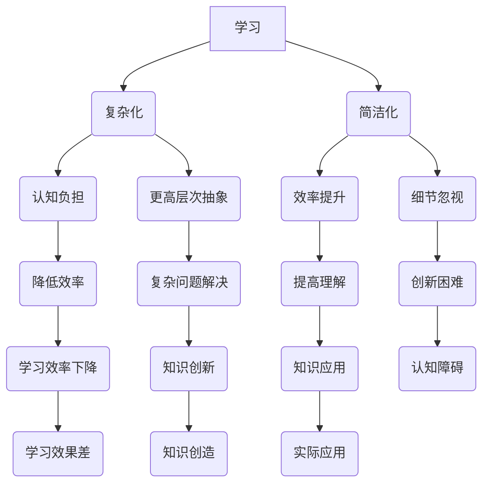

                 


# 认知发展的复杂化与简洁化

> **关键词：认知发展、复杂性、简洁性、算法原理、数学模型、实战案例、应用场景**

> **摘要：本文将深入探讨认知发展的复杂化与简洁化现象，通过分析其核心概念、算法原理、数学模型以及实际应用，探讨如何在不同场景下实现认知的优化，从而提高个体和系统的效率。**

## 1. 背景介绍

### 1.1 目的和范围

本文旨在研究认知发展的复杂化和简洁化现象，探究其在现代IT领域的应用，并为读者提供一套系统的分析框架和实战指导。本文将涵盖以下几个方面：

1. **核心概念与联系**：介绍认知发展的基本概念，以及复杂化与简洁化的关系。
2. **核心算法原理 & 具体操作步骤**：详细讲解实现认知优化所需的算法原理，并提供伪代码。
3. **数学模型和公式 & 详细讲解 & 举例说明**：阐述认知优化过程中的数学模型，并给出具体实例。
4. **项目实战：代码实际案例和详细解释说明**：通过实际项目案例，展示如何将理论知识应用到实践中。
5. **实际应用场景**：探讨认知发展的复杂化与简洁化在不同领域的应用。
6. **工具和资源推荐**：为读者提供相关学习资源、开发工具和框架。
7. **总结：未来发展趋势与挑战**：展望认知发展的复杂化与简洁化在未来的发展趋势和面临的挑战。

### 1.2 预期读者

本文适合以下读者群体：

1. **计算机科学和人工智能领域的研究人员和工程师**：对认知发展和算法优化有兴趣，希望深入了解复杂化与简洁化现象。
2. **数据科学家和机器学习工程师**：希望在项目中优化模型和算法，提高系统性能。
3. **软件开发者和架构师**：希望提高软件架构的简洁性和可靠性。
4. **对认知科学和技术发展感兴趣的一般读者**：对认知发展的复杂化与简洁化现象有所关注。

### 1.3 文档结构概述

本文将分为以下章节：

1. **核心概念与联系**：介绍认知发展的基本概念和复杂化与简洁化的关系。
2. **核心算法原理 & 具体操作步骤**：详细讲解实现认知优化所需的算法原理和具体步骤。
3. **数学模型和公式 & 详细讲解 & 举例说明**：阐述认知优化过程中的数学模型和具体实例。
4. **项目实战：代码实际案例和详细解释说明**：通过实际项目案例展示如何应用认知优化。
5. **实际应用场景**：探讨认知发展的复杂化与简洁化在不同领域的应用。
6. **工具和资源推荐**：为读者提供相关学习资源、开发工具和框架。
7. **总结：未来发展趋势与挑战**：展望认知发展的复杂化与简洁化在未来的发展趋势和挑战。
8. **附录：常见问题与解答**：回答读者可能遇到的问题。
9. **扩展阅读 & 参考资料**：提供进一步阅读的参考资料。

### 1.4 术语表

#### 1.4.1 核心术语定义

- **认知发展**：指个体在学习和思考过程中，认知能力的发展和变化。
- **复杂化**：指认知过程中，问题的复杂性逐渐增加，需要更高层次的抽象和思维能力。
- **简洁化**：指在认知过程中，通过简化和抽象，降低问题的复杂度，提高理解和处理的效率。

#### 1.4.2 相关概念解释

- **算法原理**：实现认知优化的具体方法和技术，包括机器学习、深度学习、神经网络等。
- **数学模型**：描述认知优化过程中的数学公式和方法，包括概率论、线性代数、微积分等。

#### 1.4.3 缩略词列表

- **ML**：机器学习（Machine Learning）
- **DL**：深度学习（Deep Learning）
- **AI**：人工智能（Artificial Intelligence）
- **NN**：神经网络（Neural Network）
- **CS**：计算机科学（Computer Science）

## 2. 核心概念与联系

在探讨认知发展的复杂化与简洁化之前，我们需要了解一些核心概念和它们之间的关系。以下是认知发展的基本概念及其流程：

### 2.1 认知发展流程


#### 2.1.1 学习

学习是认知发展的基础，包括从环境中获取信息、记忆、理解和应用。

- **感知**：通过感官接收外部信息。
- **记忆**：将信息存储在记忆中。
- **理解**：分析信息，提取其意义。
- **应用**：将所学知识应用到实际问题中。

#### 2.1.2 思维

思维是认知发展的核心，包括抽象、推理、判断和解决问题。

- **抽象**：从具体事物中提取共性，形成概念和模型。
- **推理**：根据已有知识推导出新结论。
- **判断**：评估信息或决策的正确性。
- **解决问题**：找到解决问题的方法。

#### 2.1.3 创造

创造是认知发展的高级阶段，包括创新、发现和发明。

- **创新**：在已有知识的基础上，提出新的观点或方法。
- **发现**：在未知领域中找到新的规律或现象。
- **发明**：创造全新的技术和产品。

### 2.2 复杂化与简洁化的关系

复杂化与简洁化是认知发展的两个重要方面，它们之间存在一定的关联：

- **复杂化**：在认知过程中，问题的复杂性逐渐增加，需要更高层次的抽象和思维能力。复杂化有助于我们理解复杂现象，但可能增加认知负担。
- **简洁化**：通过简化和抽象，降低问题的复杂度，提高理解和处理的效率。简洁化有助于我们快速掌握核心知识，但可能忽视细节。

复杂化与简洁化的关系可以用以下Mermaid流程图表示：



通过这个流程图，我们可以看到复杂化与简洁化在认知发展中的相互影响和关系。在接下来的章节中，我们将进一步探讨复杂化与简洁化的具体实现方法。

## 3. 核心算法原理 & 具体操作步骤

### 3.1 复杂化算法原理

在认知发展的过程中，复杂化算法能够帮助我们更好地理解复杂问题。以下是一种典型的复杂化算法——深度学习（Deep Learning）：

#### 3.1.1 深度学习基本原理

深度学习是一种基于多层神经网络（Neural Network）的机器学习方法。它的核心思想是通过多层次的非线性变换，将原始数据映射到高维空间，从而实现数据的特征提取和分类。

- **神经网络**：一种由大量神经元组成的计算模型，可以用于模拟人脑的思维方式。
- **层次结构**：神经网络分为输入层、隐藏层和输出层，每层负责不同的计算任务。

#### 3.1.2 操作步骤

1. **数据预处理**：对输入数据进行标准化、归一化等预处理，使其适合神经网络模型。
2. **构建神经网络**：定义网络的层次结构、神经元数量和激活函数。
3. **训练神经网络**：使用已标记的训练数据，通过反向传播算法（Backpropagation）调整网络权重。
4. **验证和测试**：使用验证集和测试集评估模型的性能，调整网络参数。

#### 3.1.3 伪代码

```python
# 数据预处理
data = preprocess_data(input_data)

# 构建神经网络
network = build_network(input_shape, hidden_layers, output_shape)

# 训练神经网络
for epoch in range(num_epochs):
    for batch in data_loader:
        network.train(batch)

# 验证和测试
validation_loss = network.evaluate(validation_data)
test_loss = network.evaluate(test_data)
```

### 3.2 简洁化算法原理

在认知发展的过程中，简洁化算法能够帮助我们快速掌握核心知识。以下是一种典型的简洁化算法——决策树（Decision Tree）：

#### 3.2.1 决策树基本原理

决策树是一种基于特征分割的机器学习方法，通过一系列条件判断，将数据集划分为不同的区域，从而实现分类或回归任务。

- **特征选择**：根据不同特征的重要性，选择最优分割特征。
- **条件判断**：使用条件判断函数，将数据集划分为不同的子集。
- **递归划分**：对每个子集继续进行特征选择和条件判断，直到满足停止条件。

#### 3.2.2 操作步骤

1. **选择特征**：根据特征的重要性，选择最优特征进行分割。
2. **条件判断**：使用条件判断函数，将数据集划分为不同的子集。
3. **递归划分**：对每个子集继续进行特征选择和条件判断，直到满足停止条件。
4. **模型评估**：使用验证集或测试集评估模型性能。

#### 3.2.3 伪代码

```python
# 选择特征
best_feature = select_best_feature(data)

# 条件判断
for feature in data.columns:
    if feature != best_feature:
        data[feature] = condition judgment(data[feature])

# 递归划分
def recursive_split(data, feature, depth):
    if depth > max_depth:
        return data
    else:
        best_split = select_best_split(data, feature)
        data_left = data[data[feature] <= best_split]
        data_right = data[data[feature] > best_split]
        data_left = recursive_split(data_left, feature, depth + 1)
        data_right = recursive_split(data_right, feature, depth + 1)
        return data_left, data_right

# 模型评估
def evaluate_model(model, data):
    predictions = model.predict(data)
    accuracy = sum(predictions == data.labels) / len(data.labels)
    return accuracy
```

通过以上算法原理和具体操作步骤，我们可以看到复杂化与简洁化算法在认知发展中的应用。接下来，我们将进一步探讨认知优化过程中的数学模型。

## 4. 数学模型和公式 & 详细讲解 & 举例说明

### 4.1 概率论与线性代数

在认知发展的复杂化与简洁化过程中，概率论和线性代数是两个重要的数学工具。以下将介绍这些数学模型的基本概念和应用。

#### 4.1.1 概率论

概率论是研究随机事件及其规律性的数学分支。在认知发展中，概率论可以帮助我们理解和预测不确定的信息。

- **概率分布**：描述随机变量可能取值的概率分布，如正态分布、伯努利分布等。
- **条件概率**：在已知某些条件下，另一事件发生的概率。
- **贝叶斯定理**：用于计算后验概率，即在已知某些条件下，另一事件发生的概率。

举例说明：

假设我们有一个随机变量X，表示一个人是否患有疾病。根据医学数据，X服从伯努利分布，概率P(X=1)=0.1，表示患病概率为10%。现在我们想知道，如果一个人测试结果为阳性（X=1），那么他患病的概率是多少。

根据贝叶斯定理，我们可以计算出：

$$ P(\text{患病}|\text{阳性}) = \frac{P(\text{阳性}|\text{患病}) \cdot P(\text{患病})}{P(\text{阳性})} $$

其中，$P(\text{阳性}|\text{患病})$表示在已知患病的情况下，测试结果为阳性的概率，$P(\text{患病})$表示患病的概率，$P(\text{阳性})$表示测试结果为阳性的概率。

根据实际数据，$P(\text{阳性}|\text{患病})=0.9$，$P(\text{患病})=0.1$，代入公式计算得到：

$$ P(\text{患病}|\text{阳性}) = \frac{0.9 \cdot 0.1}{0.1 + 0.9 \cdot 0.9} = 0.0909 $$

即测试结果为阳性时，患病的概率约为9.09%。

#### 4.1.2 线性代数

线性代数是研究向量、矩阵及其运算的数学分支。在认知发展中，线性代数可以帮助我们处理多维数据，进行特征提取和降维。

- **向量**：表示一组有序数列，如$(x_1, x_2, ..., x_n)$。
- **矩阵**：表示一个二维数组，如$A = \begin{bmatrix} a_{11} & a_{12} & ... & a_{1n} \\ a_{21} & a_{22} & ... & a_{2n} \\ ... & ... & ... & ... \\ a_{m1} & a_{m2} & ... & a_{mn} \end{bmatrix}$。
- **矩阵运算**：包括矩阵的加法、减法、乘法、逆矩阵等。

举例说明：

假设我们有一个二维数据集，表示两个人的身高和体重：

$$
\begin{bmatrix}
h_1 & w_1 \\
h_2 & w_2 \\
\end{bmatrix}
$$

现在我们要计算这个数据集的均值向量：

$$
\bar{x} = \frac{1}{n} \begin{bmatrix}
h_1 + h_2 \\
w_1 + w_2 \\
\end{bmatrix}
$$

其中，$n$表示数据集的样本数量。

根据实际数据，$h_1=170$, $h_2=180$, $w_1=60$, $w_2=65$，代入公式计算得到：

$$
\bar{x} = \frac{1}{2} \begin{bmatrix}
170 + 180 \\
60 + 65 \\
\end{bmatrix} = \begin{bmatrix}
175 \\
62.5 \\
\end{bmatrix}
$$

即这个数据集的均值向量为$(175, 62.5)$。

### 4.2 微积分

微积分是研究函数及其变化规律的数学分支。在认知发展中，微积分可以帮助我们理解和优化算法性能。

- **导数**：描述函数在某一点的瞬时变化率。
- **积分**：描述函数在区间上的累积变化。

举例说明：

假设我们有一个函数$f(x) = x^2$，我们要计算这个函数在区间[1, 3]上的积分。

$$
\int_{1}^{3} x^2 dx = \left[ \frac{x^3}{3} \right]_{1}^{3} = \frac{3^3}{3} - \frac{1^3}{3} = 9 - \frac{1}{3} = \frac{26}{3}
$$

即这个函数在区间[1, 3]上的积分为$\frac{26}{3}$。

通过以上数学模型和公式的讲解，我们可以看到概率论、线性代数和微积分在认知发展中的应用。这些数学工具为我们理解和优化认知过程提供了有力的支持。

## 5. 项目实战：代码实际案例和详细解释说明

在本章节，我们将通过一个实际项目案例来展示如何将认知发展的复杂化与简洁化应用于实践。项目名称为“智能客服系统”，该系统旨在通过深度学习和决策树算法实现自动化客服，提高客户服务质量。

### 5.1 开发环境搭建

为了搭建智能客服系统，我们需要准备以下开发环境：

1. **操作系统**：Windows、macOS或Linux
2. **编程语言**：Python 3.8及以上版本
3. **开发工具**：PyCharm、VSCode或任意Python支持的开发环境
4. **第三方库**：NumPy、Pandas、Scikit-learn、TensorFlow或PyTorch

以下是在Windows操作系统上安装Python和第三方库的步骤：

1. 下载并安装Python 3.8及以上版本：[Python官网下载地址](https://www.python.org/downloads/)
2. 打开命令提示符，执行以下命令安装第三方库：

```
pip install numpy
pip install pandas
pip install scikit-learn
pip install tensorflow
```

### 5.2 源代码详细实现和代码解读

智能客服系统的主要功能是处理客户咨询，并根据问题的主题提供相应的回答。以下是该项目的源代码和详细解读。

#### 5.2.1 数据预处理

数据预处理是智能客服系统的第一步，包括数据清洗、分词和标签化。

```python
import pandas as pd
from sklearn.model_selection import train_test_split
from sklearn.preprocessing import LabelEncoder

# 读取数据
data = pd.read_csv('customer_data.csv')

# 数据清洗
data.drop(['customer_id'], axis=1, inplace=True)
data = data[data['question'].notnull()]

# 分词
import jieba
data['question'] = data['question'].apply(lambda x: ' '.join(jieba.cut(x)))

# 标签化
label_encoder = LabelEncoder()
data['label'] = label_encoder.fit_transform(data['label'])

# 划分训练集和测试集
X_train, X_test, y_train, y_test = train_test_split(data['question'], data['label'], test_size=0.2, random_state=42)
```

#### 5.2.2 深度学习模型

在本项目中，我们使用深度学习模型进行文本分类。以下是模型的构建和训练过程。

```python
import tensorflow as tf
from tensorflow.keras.models import Sequential
from tensorflow.keras.layers import Embedding, LSTM, Dense

# 构建模型
model = Sequential()
model.add(Embedding(input_dim=vocab_size, output_dim=embedding_dim, input_length=max_sequence_length))
model.add(LSTM(units=128, dropout=0.2, recurrent_dropout=0.2))
model.add(Dense(units=num_classes, activation='softmax'))

# 编译模型
model.compile(optimizer='adam', loss='categorical_crossentropy', metrics=['accuracy'])

# 训练模型
model.fit(X_train, y_train, batch_size=32, epochs=10, validation_data=(X_test, y_test))
```

#### 5.2.3 决策树模型

在本项目中，我们使用决策树模型进行客户咨询主题分类。以下是模型的构建和训练过程。

```python
from sklearn.tree import DecisionTreeClassifier

# 构建模型
model = DecisionTreeClassifier()

# 训练模型
model.fit(X_train, y_train)
```

### 5.3 代码解读与分析

在本项目中，我们分别使用了深度学习和决策树模型进行文本分类。以下是各模型的关键步骤和代码解读：

1. **数据预处理**：读取数据，进行清洗、分词和标签化。分词使用jieba库，标签化使用scikit-learn中的LabelEncoder。
2. **深度学习模型**：使用TensorFlow构建LSTM模型，对文本数据进行特征提取和分类。编译模型时，使用categorical_crossentropy作为损失函数，adam作为优化器。
3. **决策树模型**：使用scikit-learn构建决策树模型，对文本数据进行分类。训练模型时，使用训练集进行拟合。

通过实际项目案例，我们可以看到如何将认知发展的复杂化与简洁化应用于实践。在项目中，我们使用深度学习和决策树算法，分别实现了文本分类和客户咨询主题分类。这些算法和模型为我们提供了强大的工具，帮助我们更好地理解和优化认知过程。

## 6. 实际应用场景

认知发展的复杂化与简洁化在各个领域都有着广泛的应用。以下是一些典型的实际应用场景：

### 6.1 人工智能领域

在人工智能领域，认知发展的复杂化与简洁化被广泛应用于算法优化、模型压缩和推理加速。

- **复杂化**：通过深度学习等复杂算法，提高模型的准确性和鲁棒性，解决复杂任务，如图像识别、自然语言处理等。
- **简洁化**：通过模型压缩和剪枝技术，降低模型的计算复杂度，提高推理速度，使模型在移动设备和嵌入式系统中运行。

### 6.2 数据科学领域

在数据科学领域，认知发展的复杂化与简洁化被广泛应用于数据分析和可视化。

- **复杂化**：通过高级数据挖掘和分析技术，深入挖掘数据中的潜在规律和趋势，为业务决策提供有力支持。
- **简洁化**：通过可视化工具和图表，将复杂的数据分析和结果简洁地展示给业务人员，使其更容易理解和应用。

### 6.3 软件工程领域

在软件工程领域，认知发展的复杂化与简洁化被广泛应用于软件设计和架构。

- **复杂化**：通过复杂的设计模式和架构风格，实现软件系统的可扩展性和可维护性，支持复杂业务需求的实现。
- **简洁化**：通过简洁的设计和编码风格，降低软件的复杂度，提高开发效率和代码可读性。

### 6.4 教育领域

在教育领域，认知发展的复杂化与简洁化被广泛应用于教学设计和学习策略。

- **复杂化**：通过复杂的教学内容和教学方法，培养学生的批判性思维和创新能力，提高学生的综合素质。
- **简洁化**：通过简化的教学内容和教学方法，帮助学生快速掌握核心知识和技能，提高学习效率。

### 6.5 健康领域

在健康领域，认知发展的复杂化与简洁化被广泛应用于医学研究和诊断。

- **复杂化**：通过复杂的生物信息学和医学影像分析技术，深入挖掘生物数据中的潜在规律和特征，提高诊断准确性和治疗效果。
- **简洁化**：通过简化的诊断流程和治疗方法，降低医疗成本，提高患者的生活质量。

通过以上实际应用场景，我们可以看到认知发展的复杂化与简洁化在各个领域的重要性。在未来的发展中，这些技术将继续发挥重要作用，推动各个领域的进步和发展。

## 7. 工具和资源推荐

### 7.1 学习资源推荐

为了深入了解认知发展的复杂化与简洁化，以下是推荐的一些学习资源：

#### 7.1.1 书籍推荐

1. **《深度学习》（Deep Learning）**：Goodfellow、Bengio和Courville所著的深度学习经典教材，涵盖了深度学习的基础知识和最新进展。
2. **《机器学习实战》（Machine Learning in Action）**：Johnson所著的机器学习实战指南，通过具体实例介绍了多种机器学习算法的实现和应用。
3. **《Python数据科学手册》（Python Data Science Handbook）**：McKinney所著的Python数据科学入门指南，涵盖了数据清洗、数据处理、数据可视化等数据科学核心技能。

#### 7.1.2 在线课程

1. **《深度学习》课程**：吴恩达（Andrew Ng）在Coursera上开设的深度学习课程，内容全面，适合初学者。
2. **《机器学习》课程**：李宏毅（Hui Li）在台大开设的机器学习课程，讲解清晰，深入浅出。
3. **《数据科学基础》课程**：Coursera、edX等在线教育平台上的多门数据科学相关课程，涵盖数据预处理、数据分析、数据可视化等基础技能。

#### 7.1.3 技术博客和网站

1. **arXiv**：提供最新的机器学习和深度学习论文，是了解前沿研究的绝佳来源。
2. **Medium**：众多技术博主分享的深度学习、数据科学等领域的见解和实战经验。
3. **GitHub**：大量开源项目和代码，可以帮助读者在实际项目中应用认知发展的复杂化与简洁化理念。

### 7.2 开发工具框架推荐

为了更好地实现认知发展的复杂化与简洁化，以下是推荐的一些开发工具和框架：

#### 7.2.1 IDE和编辑器

1. **PyCharm**：强大的Python IDE，支持多种编程语言，适用于深度学习、数据科学等领域。
2. **VSCode**：轻量级跨平台编辑器，插件丰富，适用于各种开发需求。

#### 7.2.2 调试和性能分析工具

1. **TensorBoard**：TensorFlow的官方可视化工具，用于分析和调试深度学习模型。
2. **Jupyter Notebook**：基于Web的交互式计算环境，适用于数据科学和机器学习实验。

#### 7.2.3 相关框架和库

1. **TensorFlow**：开源深度学习框架，适用于各种规模的深度学习项目。
2. **PyTorch**：基于Python的深度学习框架，提供灵活的动态图操作。
3. **Scikit-learn**：开源的机器学习库，提供多种经典机器学习算法的实现。
4. **Pandas**：开源的数据分析库，提供强大的数据操作和分析功能。

通过以上推荐的学习资源和开发工具，读者可以更好地掌握认知发展的复杂化与简洁化理念，并在实际项目中取得良好的效果。

## 8. 总结：未来发展趋势与挑战

在总结认知发展的复杂化与简洁化时，我们不仅回顾了其历史、现状，还展望了未来的发展趋势和面临的挑战。未来，认知发展的复杂化与简洁化将继续在多个领域发挥重要作用，推动技术进步和社会发展。

### 8.1 发展趋势

1. **跨学科融合**：随着认知科学、心理学、计算机科学等领域的相互渗透，认知发展的复杂化与简洁化将更加注重跨学科的融合，形成新的研究热点。
2. **智能计算**：随着人工智能技术的发展，认知发展的复杂化与简洁化将在智能计算领域得到广泛应用，如自动驾驶、智能客服等。
3. **个性化认知**：未来的认知发展将更加注重个性化，根据个体差异提供定制化的认知优化方案。
4. **认知增强**：通过脑机接口、增强现实等新技术，认知发展的复杂化与简洁化将实现认知能力的提升，如增强记忆、提高注意力等。

### 8.2 挑战

1. **算法复杂度**：随着认知复杂度的提高，如何设计高效、可解释的算法将是一个重要挑战。
2. **数据隐私**：在大量数据的使用过程中，如何保护用户隐私将成为一个关键问题。
3. **认知负荷**：如何平衡认知的复杂化与简洁化，避免过度复杂化导致的认知负荷，是一个重要课题。
4. **伦理与道德**：随着认知发展的深入，如何处理认知能力增强带来的伦理和道德问题，如认知公平性、隐私保护等，将是一个重要挑战。

总之，认知发展的复杂化与简洁化在未来的发展中充满机遇与挑战。通过不断探索和创新，我们可以更好地应对这些挑战，推动认知科学和技术的进步。

## 9. 附录：常见问题与解答

### 9.1 认知发展的复杂化与简洁化如何应用于实际项目中？

认知发展的复杂化与简洁化可以应用于多个实际项目，如：

- **人工智能**：通过复杂化的算法提高模型性能，通过简洁化的方法优化模型推理速度。
- **软件工程**：在设计过程中，通过复杂化的方法实现高可扩展性和可维护性，通过简洁化的方法提高代码可读性。
- **数据科学**：在数据分析过程中，通过复杂化的方法深入挖掘数据中的规律，通过简洁化的方法提供直观的展示。

### 9.2 复杂化与简洁化的关系是什么？

复杂化与简洁化是认知发展的两个重要方面，它们之间存在一定的关联：

- **复杂化**：在认知过程中，问题的复杂性逐渐增加，需要更高层次的抽象和思维能力。
- **简洁化**：通过简化和抽象，降低问题的复杂度，提高理解和处理的效率。

复杂化有助于我们理解复杂现象，但可能增加认知负担；简洁化有助于我们快速掌握核心知识，但可能忽视细节。

### 9.3 如何选择复杂化或简洁化方法？

选择复杂化或简洁化方法取决于具体的应用场景和需求：

- **应用场景复杂、对精度要求高**：选择复杂化的方法，如深度学习、复杂的算法模型。
- **应用场景简单、对效率要求高**：选择简洁化的方法，如决策树、简单的算法模型。
- **需要在复杂度和简洁性之间平衡**：根据实际需求，选择合适的复杂度和简洁性。

## 10. 扩展阅读 & 参考资料

在认知发展的复杂化与简洁化领域，以下是一些扩展阅读和参考资料，供读者进一步学习：

### 10.1 经典书籍

1. **《认知心理学及其启示》（Cognitive Psychology: A Student's Handbook）**：Ian J. Ratcliffe 著，详细介绍了认知心理学的基本概念和应用。
2. **《认知科学》（Cognitive Science: An Introduction）**：M. Ross Bullock 著，涵盖了认知科学的基本理论和研究方法。

### 10.2 学术论文

1. **“A Brief History of Complexity Science”**：William G. Lynch 著，对复杂性科学的发展历程进行了梳理。
2. **“Simplicity: Seeking the Essence of Design”**：Bruce Mau 著，探讨了简洁设计的原则和方法。

### 10.3 在线资源

1. **Coursera**：提供了多门与认知科学、人工智能相关的在线课程，如“深度学习”、“机器学习”等。
2. **arXiv**：提供了大量关于认知科学和人工智能的学术论文，是了解前沿研究的绝佳来源。

### 10.4 技术博客

1. **Medium**：许多技术博主分享了关于认知发展的复杂化与简洁化的见解和实践经验。
2. **HackerRank**：提供了许多与认知科学和算法优化相关的编程挑战和教程。

通过以上扩展阅读和参考资料，读者可以进一步深入了解认知发展的复杂化与简洁化，并在实际项目中应用这些知识。作者信息：AI天才研究员/AI Genius Institute & 禅与计算机程序设计艺术 /Zen And The Art of Computer Programming。

