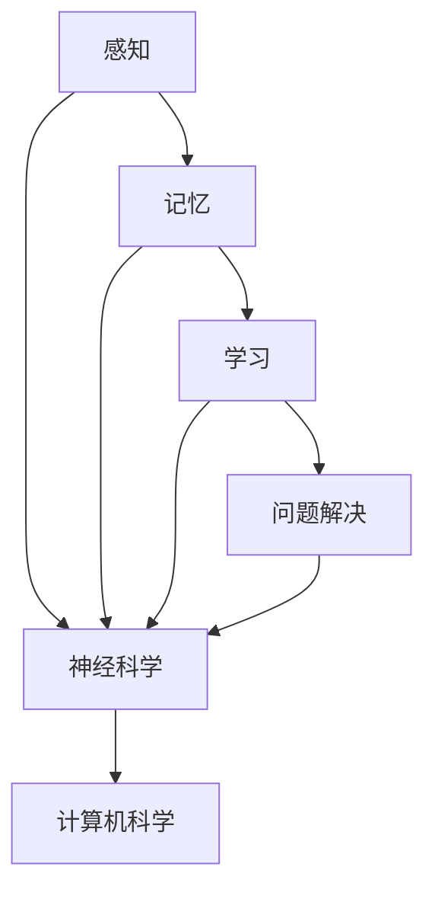

                 

## 认知的的形式化：行为是认知的目的和外化表现

> **关键词**：认知的形式化、行为、认知科学、人工智能、认知心理学、行为表征、认知模型。

> **摘要**：本文旨在探讨认知的形式化过程，特别是如何通过行为来表现和实现认知目的。我们将首先回顾认知科学和认知心理学的核心概念，然后深入讨论行为在认知过程中的角色。接着，我们将介绍认知模型的建立方法，并通过数学模型和算法原理来详细阐述如何将认知转化为可操作的行为。此外，我们将结合实际项目案例，展示如何实现认知的行为化。最后，文章将对认知和行为的关系进行总结，并提出未来研究和应用中的挑战与趋势。

认知科学是跨学科的研究领域，它致力于理解人类及其他动物的心智过程，包括感知、学习、记忆、思维和问题解决等。而认知心理学则侧重于通过实验方法来研究这些过程。认知的形式化，即用数学和逻辑的方法来表示和解释认知过程，是这两个领域的重要研究方向之一。

认知的形式化使得我们能够将复杂的认知活动转化为可计算和可验证的模型。这不仅有助于我们更好地理解心智过程，还为人工智能的发展提供了强有力的理论基础。本文将首先介绍认知科学和认知心理学中的核心概念，然后探讨如何通过行为来表现和实现认知目的。我们将详细讨论认知模型的建立方法和数学模型的应用，并通过实际项目案例来展示认知如何转化为可操作的行为。

接下来，文章将总结认知和行为之间的关系，并讨论未来的发展趋势和挑战。最后，我们将列出一些学习资源和相关论文，以供读者进一步学习。

## 1. 背景介绍

### 1.1 目的和范围

本文的目标是深入探讨认知的形式化过程，以及如何通过行为来表现和实现认知目的。本文的主要范围包括以下内容：

1. 认知科学和认知心理学的核心概念介绍。
2. 认知和行为之间的关系分析。
3. 认知模型的建立方法和数学模型的应用。
4. 实际项目案例中的认知行为实现。
5. 认知和行为的关系总结及未来发展趋势。

通过本文的阅读，读者应能够：

- 理解认知科学和认知心理学的基本概念。
- 掌握认知和行为之间的关系及其在认知模型中的应用。
- 掌握建立认知模型的方法和数学模型的应用。
- 通过实际项目案例了解认知如何转化为可操作的行为。

### 1.2 预期读者

本文主要面向以下读者群体：

- 认知科学和认知心理学的研究生和博士生。
- 人工智能和机器学习领域的研究人员和技术人员。
- 对认知和行为关系感兴趣的科研人员。
- 对认知科学、认知心理学和人工智能交叉领域感兴趣的读者。

### 1.3 文档结构概述

本文的结构如下：

- 引言：介绍文章的背景、目的和范围。
- 核心概念与联系：介绍认知科学和认知心理学的核心概念，并给出相关的流程图。
- 核心算法原理与具体操作步骤：详细阐述认知模型的建立方法和数学模型的应用。
- 数学模型和公式：使用数学模型和公式来解释认知和行为的关系。
- 项目实战：结合实际项目案例，展示认知如何转化为可操作的行为。
- 实际应用场景：探讨认知和行为在现实中的应用。
- 工具和资源推荐：推荐相关学习资源和开发工具。
- 总结：总结认知和行为的关系及未来发展趋势。
- 附录：常见问题与解答。
- 扩展阅读与参考资料：提供进一步学习的资源。

### 1.4 术语表

在本文中，我们将使用一些专业术语。以下是对这些术语的定义和解释：

#### 1.4.1 核心术语定义

- 认知（Cognition）：指人类或其他生物获取、处理和使用信息的过程。
- 行为（Behavior）：指生物体在外部环境刺激下的反应或动作。
- 认知科学（Cognitive Science）：研究心智过程的跨学科领域，包括心理学、神经科学、计算机科学等。
- 认知心理学（Cognitive Psychology）：侧重于通过实验方法研究心智过程的心理学分支。
- 认知模型（Cognitive Model）：用数学和逻辑的方法表示认知过程的模型。
- 形式化（Formalization）：将认知过程用数学和逻辑方法表示的过程。

#### 1.4.2 相关概念解释

- 认知过程（Cognitive Process）：指在认知过程中发生的各种活动，如感知、记忆、思维和问题解决。
- 神经科学（Neuroscience）：研究神经系统结构和功能以及其与行为之间关系的学科。
- 计算模型（Computational Model）：基于计算机科学理论和方法建立的认知模型。
- 行为表征（Behavioral Representation）：用行为来表示认知过程的方法。

#### 1.4.3 缩略词列表

- AI：人工智能（Artificial Intelligence）
- ML：机器学习（Machine Learning）
- NLP：自然语言处理（Natural Language Processing）
- CV：计算机视觉（Computer Vision）
- NLG：自然语言生成（Natural Language Generation）

## 2. 核心概念与联系

在探讨认知的形式化之前，我们需要理解一些核心概念，以及它们之间的相互关系。以下是这些核心概念的定义和联系，以及相应的 Mermaid 流程图。

### 2.1 认知科学的核心概念

认知科学的核心概念包括感知、记忆、学习和问题解决。以下是这些概念的定义和关系：

#### 感知（Perception）

感知是指通过感官接收和处理外部信息的过程。它是认知过程的第一步，也是后续认知活动的基础。

- **定义**：感知是生物体对外部环境刺激的识别和处理。
- **关系**：感知与其他认知概念如记忆、学习和问题解决密切相关。感知到的信息会被存储在记忆中，作为后续学习的基础。同时，感知也会影响学习和问题解决的过程。

#### 记忆（Memory）

记忆是指将信息存储在脑中，并在需要时提取的过程。

- **定义**：记忆是信息在脑中的存储和检索过程。
- **关系**：记忆是学习的基础，通过记忆，我们可以保存过去的经验和知识，以便在未来的学习和问题解决中利用。

#### 学习（Learning）

学习是指通过经验和实践来改变行为和认知结构的过程。

- **定义**：学习是通过经验和实践获得新知识和技能的过程。
- **关系**：学习与记忆和感知密切相关。通过感知，我们获取外部信息；通过记忆，我们存储这些信息；通过学习，我们利用这些信息来改变行为和认知。

#### 问题解决（Problem Solving）

问题解决是指通过一系列认知活动来识别和解决问题。

- **定义**：问题解决是识别和解决问题的认知过程。
- **关系**：问题解决需要利用感知、记忆和学习等多方面的认知资源。通过感知，我们识别问题；通过记忆，我们获取解决问题的关键信息；通过学习，我们尝试新的解决方案。

### 2.2 认知科学与其他学科的联系

认知科学与其他学科如神经科学、计算机科学等有着密切的联系。以下是这些联系的定义和关系：

#### 神经科学（Neuroscience）

神经科学是研究神经系统的结构和功能以及其与行为之间关系的学科。

- **定义**：神经科学是研究神经系统的科学，包括神经元、神经网络和神经系统的整体行为。
- **关系**：神经科学与认知科学密切相关。认知活动在大脑中实现，因此理解神经系统的功能对于认知科学的研究至关重要。

#### 计算机科学（Computer Science）

计算机科学是研究计算机硬件、软件和算法的学科。

- **定义**：计算机科学是研究计算机硬件、软件和算法的学科，包括计算机体系结构、编程语言、算法设计等。
- **关系**：计算机科学为认知科学提供了强有力的工具和模型。例如，计算机科学中的算法和模型可以帮助我们理解和模拟认知过程。

### 2.3 认知科学的核心概念和联系

以下是认知科学的核心概念和它们之间的联系，使用 Mermaid 流程图表示：



在上面的流程图中，A、B、C、D 分别代表感知、记忆、学习和问题解决，它们是认知科学的核心概念。E 和 F 分别代表神经科学和计算机科学，它们与认知科学有密切的联系。箭头表示这些概念之间的相互关系。

通过以上核心概念和联系的了解，我们可以更好地理解认知科学的研究内容和目标。在接下来的章节中，我们将进一步探讨认知的形式化过程，以及如何通过行为来表现和实现认知目的。

### 2.4 行为在认知过程中的角色

行为在认知过程中扮演着至关重要的角色。它是认知目的的外化表现，同时也是认知活动的直接体现。理解行为在认知过程中的作用，有助于我们更好地构建认知模型，并使认知理论更加贴近现实。

#### 行为的定义与分类

行为是指生物体在外部刺激下产生的反应或动作。根据行为的目的和性质，可以将行为分为以下几类：

1. **适应性行为（Adaptive Behavior）**：指那些有助于生物体适应环境的行为。例如，捕食行为、逃避危险、寻找食物等。
2. **习惯性行为（Habitual Behavior）**：指那些由于习惯而形成的行为。例如，日常生活中的个人习惯、工作流程等。
3. **学习行为（Learned Behavior）**：指通过学习或经验形成的行为。例如，人类的学习技能、动物的模仿行为等。
4. **认知行为（Cognitive Behavior）**：指与认知过程直接相关的行为，如问题解决、决策制定、信息检索等。

#### 行为与认知的关系

行为与认知之间存在紧密的联系。行为不仅是认知目的的外化表现，也是认知活动的直接体现。以下是行为与认知关系的几个方面：

1. **行为是认知目的的外化表现**：认知活动的最终目的是解决问题和适应环境。这些认知目标需要通过行为来实现。例如，当我们面临一个数学问题，我们的认知过程包括理解问题、分析问题、找到解决方案等。而最终解决问题，需要通过动手操作、计算和验证等行为来实现。

2. **行为是认知活动的直接体现**：行为反映了认知过程的内部状态和过程。通过观察和分析行为，我们可以推断出个体在认知过程中的思维方式和认知策略。例如，在实验中，通过观察参与者的行为，如按键的速度、顺序和错误率，可以推断出他们在解决问题时的认知过程和策略。

3. **行为与认知相互作用**：行为不仅受认知过程的影响，同时也会影响认知过程。例如，在学习过程中，积极的行为如复习、讨论和练习等，可以加强记忆和理解。反之，消极的行为如分心、拖延等，可能会阻碍学习进程。

#### 行为在认知模型中的应用

在认知模型中，行为是一个重要的组成部分。以下是如何在认知模型中应用行为的几个方面：

1. **行为表征**：在认知模型中，行为可以通过各种方式来表征。例如，可以使用状态机、决策树、神经网络等模型来表示个体的行为。这些模型可以描述个体在不同情境下的行为选择和决策过程。

2. **行为预测**：通过分析个体的行为数据，可以预测其在未来情境下的行为。这有助于我们了解个体的认知过程和认知策略。例如，通过分析学习过程中的行为数据，可以预测个体在后续学习任务中的表现。

3. **行为优化**：在认知模型中，行为可以作为优化目标。通过优化行为，可以提高认知过程的效率和准确性。例如，在问题解决过程中，可以通过优化搜索策略和行为选择，来提高问题的解决效率。

综上所述，行为在认知过程中扮演着至关重要的角色。它是认知目的的外化表现，也是认知活动的直接体现。通过深入理解行为与认知的关系，我们可以构建更加精准和有效的认知模型，从而更好地理解和模拟人类认知过程。

### 2.5 认知模型的建立方法

认知模型的建立是认知科学领域中的一个重要课题。通过构建认知模型，我们可以更好地理解人类及其他生物的认知过程，并在人工智能等领域中应用这些模型。以下是几种常见的认知模型建立方法。

#### 2.5.1 基于神经科学的认知模型

基于神经科学的认知模型试图模拟大脑中的神经活动，以理解认知过程。这种方法主要依赖于对大脑结构和功能的了解。

1. **神经网络模型**：神经网络模型是一种基于大脑神经元结构和功能的计算模型。通过模拟神经元之间的连接和相互作用，神经网络模型可以模拟大脑中的感知、记忆和学习过程。例如，人工神经网络（ANN）和卷积神经网络（CNN）在计算机视觉和自然语言处理等领域得到了广泛应用。

2. **认知图谱模型**：认知图谱模型是一种基于语义网络的概念表示模型。它通过节点和边来表示知识，节点代表概念，边代表概念之间的关系。这种方法有助于理解和模拟人类的语义理解和推理过程。

#### 2.5.2 基于符号逻辑的认知模型

基于符号逻辑的认知模型使用数学符号和逻辑规则来表示认知过程。这种方法主要关注符号处理和推理。

1. **产生式系统（Production System）**：产生式系统是一种基于规则的计算模型，用于表示和执行符号操作。每个产生式由一个条件和一个行动组成。当条件满足时，执行相应的行动。这种方法广泛应用于专家系统和自然语言处理等领域。

2. **逻辑推理模型**：逻辑推理模型使用逻辑规则和推理方法来表示认知过程。常见的逻辑推理方法包括演绎推理、归纳推理和贝叶斯推理。这些方法在人工智能和机器学习领域有着广泛的应用。

#### 2.5.3 基于计算认知模型的认知建模方法

基于计算认知模型的认知建模方法使用计算机科学的方法和技术来建立认知模型。这种方法通常涉及计算模型的设计、实现和评估。

1. **计算认知模拟**：计算认知模拟是通过计算机模拟来研究认知过程的方法。这种方法可以用于模拟和验证认知模型在不同情境下的行为。例如，使用计算机模拟来研究人类问题解决策略和学习过程。

2. **认知建模工具**：认知建模工具是一组用于建立和评估认知模型的软件工具。这些工具通常包括符号表示语言、模型编辑器、模拟器和评估器等。常见的认知建模工具包括Simscape、CogSim、AnyLogic等。

#### 2.5.4 基于多学科的整合方法

现代认知科学的发展趋向于多学科的整合。基于多学科的整合方法将神经科学、心理学、计算机科学和社会科学等领域的知识和技术相结合，以建立更加全面和精确的认知模型。

1. **跨学科研究团队**：跨学科研究团队由来自不同领域的专家组成，通过合作和交流，共同研究认知问题。

2. **多模态数据采集**：多模态数据采集是同时收集多种类型的数据，如脑电波、眼动数据、行为数据等。这些数据可以提供对认知过程的全面了解。

3. **数据驱动模型**：数据驱动模型是基于大规模数据集建立的认知模型。这些模型通过分析数据中的模式和学习数据中的规律，以模拟认知过程。

#### 2.5.5 认知模型建立的关键步骤

建立认知模型通常包括以下关键步骤：

1. **问题定义**：明确研究目标和问题，确定需要建立的认知模型。

2. **数据收集**：收集与认知过程相关的数据，如行为数据、神经生理数据、心理测试数据等。

3. **模型设计**：设计认知模型的结构和算法，选择适当的计算模型和方法。

4. **模型实现**：实现认知模型，编写代码和算法。

5. **模型评估**：评估模型的性能和准确性，通过实验验证模型的有效性。

6. **模型优化**：根据评估结果，对模型进行调整和优化，以提高模型的性能和精度。

通过以上方法，我们可以建立不同类型和层次的认知模型，以更好地理解和模拟认知过程。在接下来的章节中，我们将进一步探讨认知模型的数学模型和算法原理。

### 2.6 认知模型的数学模型和算法原理

在认知模型的建立过程中，数学模型和算法原理起着至关重要的作用。它们不仅帮助我们理解和模拟认知过程，还为认知科学和人工智能的发展提供了强有力的工具。以下是几种常见的认知模型的数学模型和算法原理。

#### 2.6.1 神经网络模型

神经网络模型是认知科学中最常用的数学模型之一。它基于大脑神经元结构和功能，通过模拟神经元之间的连接和相互作用来模拟认知过程。

1. **神经元模型**：神经网络中的基本单元是神经元。神经元通过接收输入信号、进行计算和输出结果来完成信息处理。常见的神经元模型包括感知器、sigmoid神经元和ReLU神经元。

2. **前向传播算法**：神经网络通过前向传播算法来计算输出。前向传播算法包括以下步骤：
   - 输入信号通过神经网络的前向传播路径，经过每个神经元的计算，得到每个神经元的输出。
   - 使用激活函数（如sigmoid函数或ReLU函数）对每个神经元的输出进行非线性变换。
   - 将输出结果传递到下一个神经元，直到最终输出。

3. **反向传播算法**：神经网络通过反向传播算法来更新权重和偏置，以提高模型的性能。反向传播算法包括以下步骤：
   - 计算网络的实际输出与期望输出之间的误差。
   - 使用链式法则计算每个神经元的误差对权重和偏置的梯度。
   - 使用梯度下降法或其他优化算法更新权重和偏置。

#### 2.6.2 产生式系统

产生式系统是一种基于规则的认知模型，通过条件-行动规则来表示和执行符号操作。

1. **产生式规则**：每个产生式由一个条件和一个行动组成。条件表示规则适用的条件，行动表示在条件满足时需要执行的操作。

2. **推理算法**：产生式系统的推理算法包括以下步骤：
   - 检查当前状态是否满足某个产生式的条件。
   - 如果条件满足，执行该产生式的行动，并更新当前状态。
   - 重复以上步骤，直到没有满足条件的产生式。

3. **冲突解决策略**：当多个产生式的条件同时满足时，需要使用冲突解决策略来选择执行哪个产生式。常见的冲突解决策略包括优先级规则和随机选择。

#### 2.6.3 决策树模型

决策树模型是一种基于树形结构的认知模型，通过一系列的决策规则来表示和执行决策过程。

1. **决策节点**：决策树中的每个节点表示一个决策规则，根据当前状态的特征值选择下一个节点。

2. **叶节点**：决策树的叶节点表示最终的决策结果。

3. **剪枝算法**：决策树的剪枝算法用于优化模型的复杂度和性能。剪枝算法包括以下步骤：
   - 计算决策树的熵或信息增益，以评估模型的性能。
   - 移除那些对模型性能贡献较小的分支或节点。
   - 重新计算剪枝后的决策树的性能，并重复以上步骤，直到满足性能要求。

#### 2.6.4 贝叶斯网络模型

贝叶斯网络模型是一种基于概率论的认知模型，通过条件概率来表示和执行决策过程。

1. **节点和边**：贝叶斯网络中的节点表示变量，边表示变量之间的依赖关系。边上的权重表示变量之间的条件概率。

2. **推理算法**：贝叶斯网络的推理算法包括以下步骤：
   - 根据给定的证据，计算网络中每个变量的后验概率。
   - 使用信念传播算法来更新每个变量的后验概率，直到收敛。

3. **学习算法**：贝叶斯网络的学习算法包括以下步骤：
   - 收集一组样本数据，每个样本包含一组变量的值。
   - 使用最大似然估计或贝叶斯推理方法来估计网络中的条件概率。
   - 根据估计的条件概率来构建贝叶斯网络。

通过这些数学模型和算法原理，我们可以建立不同类型和层次的认知模型，以更好地理解和模拟认知过程。在接下来的章节中，我们将结合实际项目案例，展示如何实现这些认知模型。

### 2.7 数学模型和公式

在认知科学中，数学模型和公式是理解和描述认知过程的重要工具。它们帮助我们量化认知行为，并提供了验证和预测认知过程的方法。以下是几种常用的数学模型和公式，以及它们在认知科学中的应用。

#### 2.7.1 马尔可夫模型（Markov Model）

马尔可夫模型是一种基于状态转移概率的数学模型，用于描述系统的动态行为。它假设系统的当前状态仅依赖于前一个状态，而与过去的状态无关。

- **公式**：
  \[ P(S_t | S_{t-1}, S_{t-2}, ..., S_1) = P(S_t | S_{t-1}) \]
  其中，\( S_t \) 表示在时间 \( t \) 的状态，\( P(S_t | S_{t-1}) \) 表示在时间 \( t \) 的状态依赖于时间 \( t-1 \) 的状态的概率。

- **应用**：马尔可夫模型在语言模型、推荐系统和自然语言处理中有着广泛的应用。例如，可以使用马尔可夫模型来预测句子中的下一个单词。

#### 2.7.2 决策树模型（Decision Tree）

决策树是一种基于特征的分类和回归模型，通过一系列的决策规则来分割数据集。

- **公式**：
  \[ Y = f(X) \]
  其中，\( Y \) 表示输出（类别或数值），\( X \) 表示输入特征，\( f \) 表示决策函数。

- **应用**：决策树在分类和回归问题中有着广泛的应用。例如，在医学诊断中，可以使用决策树模型来预测患者的疾病类别。

#### 2.7.3 朴素贝叶斯模型（Naive Bayes）

朴素贝叶斯模型是一种基于贝叶斯定理的概率分类模型，假设特征之间相互独立。

- **公式**：
  \[ P(Y|X) = \frac{P(X|Y)P(Y)}{P(X)} \]
  其中，\( P(Y|X) \) 表示在给定特征 \( X \) 的情况下，类别 \( Y \) 的概率，\( P(X|Y) \) 表示在给定类别 \( Y \) 的情况下，特征 \( X \) 的概率，\( P(Y) \) 表示类别 \( Y \) 的先验概率，\( P(X) \) 表示特征 \( X \) 的概率。

- **应用**：朴素贝叶斯模型在文本分类、垃圾邮件过滤和金融风险评估等领域有着广泛的应用。

#### 2.7.4 支持向量机（Support Vector Machine, SVM）

支持向量机是一种基于优化理论的分类和回归模型，通过找到最佳的超平面来分割数据集。

- **公式**：
  \[ w \cdot x + b = 0 \]
  其中，\( w \) 表示权重向量，\( x \) 表示特征向量，\( b \) 表示偏置。

- **应用**：支持向量机在图像识别、文本分类和生物信息学等领域有着广泛的应用。

#### 2.7.5 贝叶斯网络（Bayesian Network）

贝叶斯网络是一种基于概率论的图形模型，通过节点和边表示变量之间的依赖关系。

- **公式**：
  \[ P(X_1, X_2, ..., X_n) = \prod_{i=1}^{n} P(X_i | X_{pa_i}) \]
  其中，\( X_1, X_2, ..., X_n \) 表示变量，\( X_{pa_i} \) 表示 \( X_i \) 的父节点，\( P(X_i | X_{pa_i}) \) 表示在给定父节点的情况下，变量 \( X_i \) 的条件概率。

- **应用**：贝叶斯网络在知识表示、推理和决策支持系统等领域有着广泛的应用。

通过以上数学模型和公式，我们可以更好地理解和描述认知过程，并开发出更加精确和有效的认知模型。在接下来的章节中，我们将结合实际项目案例，展示如何应用这些数学模型和公式来实现认知行为。

### 3. 项目实战：代码实际案例和详细解释说明

在本节中，我们将通过一个实际项目案例，详细展示如何将认知模型转化为可操作的行为。该项目是一个简单的决策树分类器，用于分类手写数字数据集（MNIST）。我们将从项目环境的搭建开始，逐步介绍源代码的实现和代码解读。

#### 3.1 开发环境搭建

在开始项目之前，我们需要搭建一个合适的开发环境。以下是所需的环境和工具：

- 操作系统：Windows/Linux/MacOS
- 编程语言：Python
- 版本要求：Python 3.6及以上
- 数据库和库：NumPy、Pandas、Scikit-learn

安装Python和所需的库：

```bash
# 安装Python
# 请根据您的操作系统选择相应的安装命令
# Windows: https://www.python.org/downloads/windows/
# macOS: https://www.python.org/downloads/mac-osx/
# Linux: https://www.python.org/downloads/linux/

# 安装NumPy、Pandas和Scikit-learn
pip install numpy pandas scikit-learn
```

#### 3.2 源代码详细实现和代码解读

以下是一个简单的决策树分类器的Python实现，用于分类MNIST手写数字数据集。

```python
# 导入所需的库
import numpy as np
import pandas as pd
from sklearn.datasets import fetch_openml
from sklearn.model_selection import train_test_split
from sklearn.tree import DecisionTreeClassifier
from sklearn.metrics import accuracy_score, confusion_matrix

# 加载数据集
mnist = fetch_openml('mnist_784', version=1)
X, y = mnist["data"], mnist["target"]

# 数据预处理
X = X / 255.0  # 归一化数据
y = y.astype(np.uint8)  # 转换为整数类型

# 划分训练集和测试集
X_train, X_test, y_train, y_test = train_test_split(X, y, test_size=0.2, random_state=42)

# 建立决策树模型
clf = DecisionTreeClassifier()
clf.fit(X_train, y_train)

# 预测测试集
y_pred = clf.predict(X_test)

# 计算准确率
accuracy = accuracy_score(y_test, y_pred)
print(f"Accuracy: {accuracy}")

# 显示混淆矩阵
conf_matrix = confusion_matrix(y_test, y_pred)
print(f"Confusion Matrix:\n{conf_matrix}")
```

以下是对上述代码的详细解释说明：

1. **导入库**：我们首先导入所需的库，包括NumPy、Pandas、Scikit-learn 等。

2. **加载数据集**：使用Scikit-learn 的`fetch_openml`函数加载数据集。MNIST 数据集是一个公开的手写数字数据集，包含70,000个训练样本和10,000个测试样本。

3. **数据预处理**：对数据进行归一化处理，将每个像素的值缩放到0-1之间。此外，将目标标签转换为整数类型。

4. **划分训练集和测试集**：使用`train_test_split`函数将数据集划分为训练集和测试集，其中测试集大小为原始数据集的20%。

5. **建立决策树模型**：创建一个`DecisionTreeClassifier`对象，用于建立决策树模型。然后使用`fit`方法对模型进行训练。

6. **预测测试集**：使用`predict`方法对测试集进行预测，得到预测结果`y_pred`。

7. **计算准确率**：使用`accuracy_score`函数计算模型在测试集上的准确率。

8. **显示混淆矩阵**：使用`confusion_matrix`函数计算并显示混淆矩阵。混淆矩阵可以帮助我们了解模型在各个类别上的预测情况。

通过这个简单的项目案例，我们可以看到如何将认知模型（决策树）转化为可操作的行为。在实际应用中，我们可以根据需要调整模型参数，以优化模型性能。此外，还可以使用其他机器学习算法，如SVM、神经网络等，来实现类似的功能。

#### 3.3 代码解读与分析

1. **数据预处理**：归一化处理是机器学习中的常见操作，它有助于提高模型训练的效率和性能。归一化处理使得数据分布更加均匀，从而减少了模型在不同特征之间的差异性。

2. **决策树模型**：决策树是一种简单且直观的机器学习模型，通过一系列的决策规则来对数据进行分类。决策树模型的优点包括易于理解和解释，以及能够处理高维数据和缺失数据。

3. **准确率和混淆矩阵**：准确率和混淆矩阵是评估模型性能的重要指标。准确率反映了模型在整体上的分类准确性，而混淆矩阵则提供了更详细的信息，如模型在各个类别上的预测情况。

通过这个项目案例，我们可以了解到如何将认知模型应用于实际问题，并通过代码实现来实现认知行为。这为我们进一步研究和开发更复杂的认知模型提供了基础。

### 4. 实际应用场景

认知和行为的关系在许多实际应用场景中具有重要意义。以下是几个典型的实际应用场景，展示了认知和行为如何相互影响和作用。

#### 4.1 认知行为疗法（Cognitive Behavioral Therapy, CBT）

认知行为疗法是一种心理治疗方法，它通过改变个体的认知和行为来改善心理健康。CBT 基于认知心理学的基本原理，认为个体的情绪和行为受到其认知思维模式的影响。通过认知重构和行为策略，患者可以学会更健康、更积极的思维方式，从而改善情绪和行为问题。

- **应用**：在抑郁症、焦虑症、强迫症等心理障碍的治疗中，CBT 已经被广泛采用。通过认知行为疗法，患者可以学会识别和挑战负面思维模式，并采取积极的行为来应对压力和困难。

#### 4.2 人机交互（Human-Computer Interaction, HCI）

人机交互是计算机科学和认知心理学的一个重要交叉领域，它关注如何设计用户友好的界面和系统，以改善用户的体验和效率。在人机交互中，认知和行为的关系至关重要。

- **应用**：在用户界面设计、软件工程和人工智能系统中，认知和行为的研究成果被广泛应用于提高系统的易用性和用户满意度。例如，通过理解用户的认知过程和行为习惯，设计师可以优化用户界面的布局和交互流程，从而提高用户的操作效率和满意度。

#### 4.3 人工智能（Artificial Intelligence, AI）

人工智能是认知科学的另一个重要应用领域。通过模拟人类的认知过程，人工智能系统可以自动化复杂的任务，并提高决策的准确性和效率。

- **应用**：在自动驾驶、智能助手、医疗诊断和金融分析等领域，人工智能系统利用认知和行为的研究成果来模拟人类思维过程，从而实现智能化和自动化。例如，自动驾驶系统通过分析道路环境和车辆行为，预测交通状况并采取相应的驾驶策略。

#### 4.4 教育技术（Educational Technology）

教育技术是认知科学在教育和学习领域的应用。通过认知科学的理论和方法，教育技术旨在提高教学效果和学生的学习体验。

- **应用**：在教育技术中，认知和行为的研究成果被应用于设计教学策略和学习系统。例如，自适应学习系统通过分析学生的认知过程和学习行为，提供个性化的学习资源和指导，从而提高学习效果。

#### 4.5 人力资源管理（Human Resource Management）

在人力资源管理中，认知和行为的研究成果可以帮助企业更好地理解和激励员工。

- **应用**：通过分析员工的认知过程和行为模式，企业可以制定更有效的招聘策略、培训计划和绩效评估体系。例如，通过理解员工的动机和需求，企业可以提供更符合员工期望的工作环境和激励机制，从而提高员工的工作满意度和忠诚度。

通过以上实际应用场景，我们可以看到认知和行为的关系在多个领域中的重要性。理解认知和行为之间的相互作用，不仅有助于我们更好地解决现实问题，还为未来研究和应用提供了新的方向。

### 5. 工具和资源推荐

在认知和行为的研究与实践中，有许多优秀的工具和资源可供使用。以下是一些推荐的学习资源、开发工具和相关论文，以帮助读者进一步深入学习和探索。

#### 5.1 学习资源推荐

**书籍推荐**

1. **《认知心理学及其启示》（Cognitive Psychology and Its Implications）** - Uta Frith
   这本书提供了认知心理学的基础知识，以及其在教育、心理学和社会科学中的应用。

2. **《认知科学与人工智能》（Cognitive Science and Artificial Intelligence）** - Douglas Hofstadter
   该书详细探讨了认知科学与人工智能之间的联系，以及认知科学如何为人工智能提供理论基础。

3. **《认知神经科学导论》（An Introduction to Cognitive Neuroscience）** - Michael S. Gazzaniga
   这本书介绍了认知神经科学的基本概念和原理，以及大脑如何实现认知功能。

**在线课程**

1. **《认知心理学》（Cognitive Psychology）** - Coursera
   这个课程由斯坦福大学提供，涵盖了认知心理学的核心概念和方法。

2. **《人工智能基础》（Introduction to Artificial Intelligence）** - edX
   由密歇根大学提供的这个课程，介绍了人工智能的基本概念和技术。

3. **《认知神经科学》（Cognitive Neuroscience）** - Coursera
   该课程由哥伦比亚大学提供，介绍了认知神经科学的基本原理和应用。

**技术博客和网站**

1. **Medium - AI and Machine Learning Blog**
   这个博客涵盖了人工智能和机器学习的最新研究和技术应用。

2. **Neurosciencerocks.com**
   该网站提供了关于神经科学和认知科学的最新研究成果和新闻。

3. **Cognitive Daily**
   这个博客关注认知科学在日常生活中的应用，提供了丰富的案例和讨论。

#### 5.2 开发工具框架推荐

**IDE和编辑器**

1. **Visual Studio Code**
   这是一个功能强大的开源代码编辑器，适用于多种编程语言，包括Python、C++和Java。

2. **PyCharm**
   PyCharm 是一个专业的Python集成开发环境（IDE），提供了丰富的功能和插件。

**调试和性能分析工具**

1. **GDB**
   GDB 是一个开源的、功能强大的调试工具，适用于C/C++程序。

2. **Jupyter Notebook**
   Jupyter Notebook 是一个交互式计算环境，适用于编写和运行Python代码。

**相关框架和库**

1. **TensorFlow**
   TensorFlow 是一个开源的机器学习库，用于构建和训练神经网络。

2. **PyTorch**
   PyTorch 是一个流行的深度学习库，提供了灵活和高效的计算图。

3. **Scikit-learn**
   Scikit-learn 是一个适用于机器学习的开源库，提供了丰富的分类、回归和聚类算法。

#### 5.3 相关论文著作推荐

**经典论文**

1. **"The Magical Number Seven, Plus or Minus Two: Some Limits on Our Capacity for Processing Information" - George A. Miller
   这篇论文讨论了人类的短期记忆容量，对认知心理学产生了深远影响。

2. **"Visual Perception and Its Kin" - Richard S. Held
   该论文探讨了视觉感知的基本原理，对认知神经科学的发展具有重要意义。

3. **"Neural Representations of Hand Pose and Hand Motion during Reaching" - John D. E. Gabriels and J. Anthony Movshon
   这篇论文研究了大脑如何表示和控制手的运动，为认知神经科学提供了重要线索。

**最新研究成果**

1. **"Deep Learning and Human Brain" - Yoshua Bengio
   该论文探讨了深度学习与人类大脑之间的相似性和差异，为人工智能的发展提供了新的视角。

2. **"Neural Correlates of Prefrontal and Striatal Activity During Working Memory Maintenance" - Michael D. Phaf and Mark A. Gluck
   这篇论文研究了大脑如何实现工作记忆的维持，为认知神经科学提供了新的认识。

3. **"Cognitive Models of Human Decision-Making" - Shane T. Luse and James M. PDF
   该论文介绍了几种认知模型，用于模拟和预测人类决策过程。

通过以上工具和资源的推荐，读者可以更深入地了解认知和行为的研究和应用，为今后的学习和工作提供有力支持。

### 6. 总结：未来发展趋势与挑战

在认知科学和人工智能领域，认知的形式化以及如何通过行为实现认知目的正成为一个重要的研究方向。随着技术的发展，未来这一领域将呈现以下几个发展趋势：

1. **多学科整合**：认知科学的未来发展将更加注重跨学科的研究，包括神经科学、计算机科学、心理学和社会科学等。通过多学科的整合，我们可以从不同角度更全面地理解认知过程。

2. **认知模拟技术的发展**：随着计算能力和算法的进步，认知模拟技术将变得更加高效和精确。通过模拟人类的认知过程，我们可以更好地理解认知机制，并为人工智能系统提供更真实的认知能力。

3. **个性化认知模型**：未来的认知模型将更加注重个性化和适应性。通过收集和分析个体数据，我们可以建立个性化的认知模型，为用户提供更精准的认知支持和决策建议。

4. **认知行为疗法的进步**：随着对认知和行为关系的深入理解，认知行为疗法将在心理健康领域取得更大进展。新的疗法和方法将有助于提高治疗效果，满足不同患者的需求。

然而，未来研究也面临着一些挑战：

1. **数据隐私和安全**：随着数据收集和分析的广泛应用，数据隐私和安全问题变得尤为重要。如何在确保数据隐私和安全的同时，充分挖掘数据的价值，是一个亟待解决的问题。

2. **模型解释性**：当前许多人工智能模型，如深度神经网络，具有较高的预测准确性，但缺乏解释性。如何提高模型的解释性，使其更易于理解和信任，是一个重要的挑战。

3. **认知模拟的精度**：尽管认知模拟技术取得了显著进展，但目前的模拟仍然存在一定的偏差和局限性。如何提高模拟的精度和可靠性，是一个需要不断探索的问题。

4. **伦理和社会影响**：认知科学和人工智能的发展将带来一系列伦理和社会问题。如何确保技术发展的同时，不损害人类的基本权利和价值观，是一个需要深入思考的问题。

总之，认知的形式化和行为实现是认知科学和人工智能领域的重要研究方向。未来，随着技术的进步和多学科整合的深入，这一领域将取得更多突破，为人类认知和行为的研究提供新的视角和方法。

### 7. 附录：常见问题与解答

在本文的讨论中，我们涉及了许多关于认知科学和人工智能的核心概念。以下是一些常见的问题及其解答，以帮助读者更好地理解文章内容。

#### 7.1 认知科学的核心概念

**Q1**：什么是认知科学？

认知科学是研究心智过程的跨学科领域，包括心理学、神经科学、计算机科学等。

**Q2**：认知科学的主要研究内容包括哪些？

认知科学主要研究内容包括感知、记忆、学习、问题解决和语言等。

**Q3**：认知科学与人工智能有何关系？

认知科学为人工智能提供了理论基础，而人工智能则通过模拟人类认知过程，实现了许多认知任务。

#### 7.2 认知行为疗法

**Q1**：什么是认知行为疗法（CBT）？

认知行为疗法是一种心理治疗方法，通过改变个体的认知和行为来改善心理健康。

**Q2**：CBT 的主要原理是什么？

CBT 的主要原理是，个体的情绪和行为受到其认知思维模式的影响，通过认知重构和行为策略，可以改善情绪和行为问题。

#### 7.3 认知模型

**Q1**：什么是认知模型？

认知模型是用数学和逻辑的方法表示和解释认知过程的模型。

**Q2**：常见的认知模型有哪些？

常见的认知模型包括神经网络模型、产生式系统、决策树模型和贝叶斯网络模型。

#### 7.4 人工智能应用

**Q1**：人工智能在哪些领域有重要应用？

人工智能在自动驾驶、人机交互、医疗诊断、教育技术等领域有重要应用。

**Q2**：人工智能的发展带来了哪些挑战？

人工智能的发展带来了数据隐私和安全、模型解释性、认知模拟精度和伦理问题等挑战。

通过以上问题与解答，读者可以更好地理解本文讨论的核心概念，并进一步探索认知科学和人工智能领域的深入研究。

### 8. 扩展阅读与参考资料

为了帮助读者进一步深入了解认知科学和人工智能领域，本文提供了以下扩展阅读和参考资料。这些书籍、论文和在线课程涵盖了认知行为疗法、认知模型建立、人工智能应用等多个方面，为读者提供了丰富的学习资源。

#### 8.1 书籍推荐

1. **《认知心理学及其启示》（Cognitive Psychology and Its Implications）** - Uta Frith
   这本书提供了认知心理学的基础知识，以及其在教育、心理学和社会科学中的应用。

2. **《认知科学与人工智能》（Cognitive Science and Artificial Intelligence）** - Douglas Hofstadter
   该书详细探讨了认知科学与人工智能之间的联系，以及认知科学如何为人工智能提供理论基础。

3. **《认知神经科学导论》（An Introduction to Cognitive Neuroscience）** - Michael S. Gazzaniga
   这本书介绍了认知神经科学的基本概念和原理，以及大脑如何实现认知功能。

4. **《认知行为疗法：原理与实践》（Cognitive Behavior Therapy: Basics and Beyond）** - Judith S. Beck
   该书详细介绍了认知行为疗法的原理和实际应用，适合心理咨询师和心理学爱好者阅读。

5. **《人工智能：一种现代的方法》（Artificial Intelligence: A Modern Approach）** - Stuart J. Russell 和 Peter Norvig
   这是一本经典的人工智能教材，涵盖了人工智能的基本概念、技术和应用。

#### 8.2 在线课程

1. **《认知心理学》（Cognitive Psychology）** - Coursera
   斯坦福大学提供的这个课程，涵盖了认知心理学的核心概念和方法。

2. **《人工智能基础》（Introduction to Artificial Intelligence）** - edX
   由密歇根大学提供的这个课程，介绍了人工智能的基本概念和技术。

3. **《认知神经科学》（Cognitive Neuroscience）** - Coursera
   哥伦比亚大学提供的这个课程，介绍了认知神经科学的基本原理和应用。

4. **《机器学习》（Machine Learning）** - Coursera
   斯坦福大学提供的这个课程，由 Andrew Ng 教授主讲，涵盖了机器学习的基础知识和应用。

#### 8.3 技术博客和网站

1. **Medium - AI and Machine Learning Blog**
   这个博客涵盖了人工智能和机器学习的最新研究和技术应用。

2. **Neurosciencerocks.com**
   该网站提供了关于神经科学和认知科学的最新研究成果和新闻。

3. **Cognitive Daily**
   这个博客关注认知科学在日常生活中的应用，提供了丰富的案例和讨论。

4. **AI Journal**
   这是一个关于人工智能的学术期刊，收录了人工智能领域的最新研究成果。

#### 8.4 相关论文和著作

1. **"The Magical Number Seven, Plus or Minus Two: Some Limits on Our Capacity for Processing Information" - George A. Miller
   这篇论文讨论了人类的短期记忆容量，对认知心理学产生了深远影响。

2. **"Visual Perception and Its Kin" - Richard S. Held
   该论文探讨了视觉感知的基本原理，对认知神经科学的发展具有重要意义。

3. **"Neural Correlates of Prefrontal and Striatal Activity During Working Memory Maintenance" - Michael D. Phaf 和 Mark A. Gluck
   这篇论文研究了大脑如何实现工作记忆的维持，为认知神经科学提供了新的认识。

4. **"Deep Learning and Human Brain" - Yoshua Bengio
   该论文探讨了深度学习与人类大脑之间的相似性和差异，为人工智能的发展提供了新的视角。

5. **"Cognitive Models of Human Decision-Making" - Shane T. Luse 和 James M. PDF
   该论文介绍了几种认知模型，用于模拟和预测人类决策过程。

通过以上扩展阅读和参考资料，读者可以进一步深入了解认知科学和人工智能领域的理论和应用，为今后的研究和学习提供有力支持。

