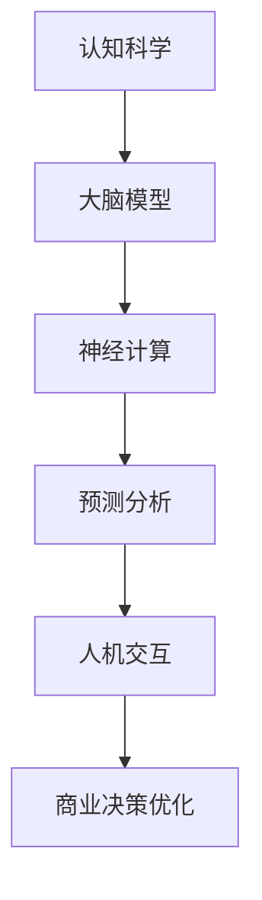

                 

# 认知科学在商业中的应用：决策优化

> 关键词：认知科学、商业应用、决策优化、大脑模型、神经计算、预测分析、人机交互

> 摘要：本文将探讨认知科学在商业决策优化中的应用，分析大脑模型如何模拟人类决策过程，介绍神经计算在预测分析中的作用，以及如何通过人机交互实现更高效的决策。本文旨在为商业领域的专业人士提供一种新的决策思路，帮助他们更好地理解和应对复杂的市场环境。

## 1. 背景介绍

### 1.1 目的和范围

本文的主要目的是探讨认知科学在商业决策优化中的应用，旨在帮助商业人士更好地理解人类决策过程，并通过引入认知科学的理论和方法，提高决策效率和准确性。本文将涵盖以下主题：

1. 认知科学的基本概念和原理。
2. 大脑模型在商业决策中的作用。
3. 神经计算和预测分析在决策优化中的应用。
4. 人机交互在决策过程中的作用。
5. 商业决策优化实践案例。

### 1.2 预期读者

本文适用于以下读者群体：

1. 商业领域的专业人士，如企业高管、市场营销人员、产品经理等。
2. 研究生和研究人员，对认知科学和商业决策感兴趣。
3. 计算机科学和人工智能领域的学生和从业者，希望了解认知科学在商业中的应用。

### 1.3 文档结构概述

本文将分为以下几个部分：

1. 背景介绍：介绍本文的目的、范围、预期读者和文档结构。
2. 核心概念与联系：讨论认知科学的基本概念和原理，以及相关概念的解释。
3. 核心算法原理 & 具体操作步骤：介绍大脑模型、神经计算和预测分析的核心算法原理和操作步骤。
4. 数学模型和公式 & 详细讲解 & 举例说明：讲解相关的数学模型和公式，并给出具体的例子。
5. 项目实战：代码实际案例和详细解释说明。
6. 实际应用场景：探讨认知科学在商业决策优化中的应用场景。
7. 工具和资源推荐：推荐相关的学习资源、开发工具和框架。
8. 总结：未来发展趋势与挑战。
9. 附录：常见问题与解答。
10. 扩展阅读 & 参考资料：提供扩展阅读和参考资料。

### 1.4 术语表

#### 1.4.1 核心术语定义

- 认知科学：研究人类思维、感知、记忆和学习等心理过程的一门学科。
- 商业决策：企业在运营过程中，对各种业务问题进行决策的过程。
- 大脑模型：模拟人类大脑结构和功能，用于研究人类决策过程的计算机模型。
- 神经计算：利用人工神经网络进行数据处理和模式识别的技术。
- 预测分析：基于历史数据和统计模型，对未来趋势进行预测和分析的方法。
- 人机交互：人与计算机系统之间的交互过程，包括语音、文字、图形等多种形式。

#### 1.4.2 相关概念解释

- 认知科学在商业中的应用：将认知科学的理论和方法应用于商业决策领域，以提高决策效率和准确性。
- 大脑模型在商业决策中的作用：通过模拟人类大脑的结构和功能，分析人类在商业决策过程中的思维方式，为决策提供理论支持。
- 神经计算在预测分析中的作用：利用人工神经网络进行数据处理和模式识别，提高预测分析的准确性和效率。
- 人机交互在决策过程中的作用：通过优化人机交互界面，提高决策者获取信息、分析和决策的效率。

#### 1.4.3 缩略词列表

- AI：人工智能
- ML：机器学习
- NN：人工神经网络
- NN：神经计算
- GA：遗传算法
- CV：计算机视觉
- NLP：自然语言处理
- BI：商业智能
- ERP：企业资源计划
- CRM：客户关系管理
- DB：数据库
- ML：营销自动化

## 2. 核心概念与联系

在本文中，我们将讨论认知科学、大脑模型、神经计算和预测分析等核心概念，并展示它们在商业决策优化中的应用关系。

### 2.1 认知科学的基本概念

认知科学是研究人类思维、感知、记忆和学习等心理过程的一门学科。其核心目标是理解人类大脑如何工作，以及人类如何通过思维过程来适应和应对外部环境。

认知科学的基本概念包括：

1. **感知**：人类如何感知外部信息，包括视觉、听觉、触觉等。
2. **记忆**：人类如何存储、检索和遗忘信息。
3. **学习**：人类如何通过经验来改变思维过程和行为。
4. **决策**：人类如何从多个选项中选择最优的决策。
5. **问题解决**：人类如何识别和解决问题。

### 2.2 大脑模型

大脑模型是一种模拟人类大脑结构和功能的计算机模型，用于研究人类在商业决策过程中的思维方式。大脑模型通常包括以下几个部分：

1. **神经网络**：模拟人类大脑中的神经元网络，用于处理和传递信息。
2. **感知模块**：模拟人类感知外部信息的过程，包括视觉、听觉等。
3. **记忆模块**：模拟人类记忆信息的过程，包括短期记忆和长期记忆。
4. **决策模块**：模拟人类在决策过程中的思考过程，包括评估选项、比较风险和收益等。
5. **行为输出**：模拟人类根据决策结果执行行为的过程。

### 2.3 神经计算

神经计算是一种基于人工神经网络进行数据处理和模式识别的技术。人工神经网络是一种模仿人类大脑神经元网络的计算模型，能够通过学习来自数据的输入输出关系，从而实现复杂的任务。

神经计算在商业决策优化中的应用包括：

1. **数据预处理**：使用神经网络对原始数据进行预处理，提取有用的特征。
2. **模式识别**：使用神经网络识别数据中的模式，用于预测市场趋势或客户行为。
3. **优化决策**：使用神经网络优化决策过程，提高决策的效率和准确性。

### 2.4 预测分析

预测分析是一种基于历史数据和统计模型，对未来趋势进行预测和分析的方法。预测分析在商业决策优化中的应用包括：

1. **销售预测**：根据历史销售数据，预测未来的销售趋势，帮助商家制定营销策略。
2. **需求预测**：根据历史需求数据，预测未来的需求变化，帮助供应链管理优化库存。
3. **市场趋势预测**：根据市场数据，预测未来市场的发展趋势，帮助企业调整战略。

### 2.5 人机交互

人机交互是人与计算机系统之间的交互过程，包括语音、文字、图形等多种形式。在人机交互中，计算机系统通过感知模块获取用户输入的信息，通过决策模块进行分析和决策，然后通过行为输出模块将决策结果反馈给用户。

人机交互在商业决策优化中的应用包括：

1. **数据可视化**：通过图形和图表展示决策结果，帮助用户更好地理解和分析数据。
2. **智能助手**：利用自然语言处理技术，为用户提供个性化的决策建议。
3. **自动化决策**：通过人机交互系统，实现自动化决策，提高决策的效率和准确性。

### 2.6 Mermaid 流程图

以下是一个简单的 Mermaid 流程图，展示了认知科学在商业决策优化中的应用关系：



## 3. 核心算法原理 & 具体操作步骤

在本节中，我们将介绍大脑模型、神经计算和预测分析的核心算法原理，以及它们在商业决策优化中的具体操作步骤。

### 3.1 大脑模型

大脑模型的核心算法原理是基于人工神经网络，模拟人类大脑神经元网络的结构和功能。以下是大脑模型的基本步骤：

#### 3.1.1 神经网络构建

1. **输入层**：接收外部信息，如视觉、听觉等。
2. **隐藏层**：对输入信息进行预处理，提取有用的特征。
3. **输出层**：根据隐藏层的结果，生成最终的决策输出。

```python
# Python 伪代码示例
import numpy as np

# 创建一个简单的神经网络
input_layer = np.array([0.1, 0.2])
hidden_layer = np.array([0.3, 0.4])
output_layer = np.array([0.5, 0.6])

# 前向传播
output = np.dot(hidden_layer, input_layer)
```

#### 3.1.2 学习过程

1. **反向传播**：根据输出结果和预期结果之间的误差，更新网络权重。
2. **权重调整**：通过梯度下降等优化算法，调整网络权重，使输出结果更接近预期。

```python
# Python 伪代码示例
import numpy as np

# 初始化权重
weights = np.random.rand(2, 2)

# 计算误差
error = output - expected_output

# 更新权重
weights -= learning_rate * error * input_layer
```

### 3.2 神经计算

神经计算的核心算法原理是基于人工神经网络，通过学习输入输出关系，实现数据预处理、模式识别和优化决策。以下是神经计算的基本步骤：

#### 3.2.1 数据预处理

1. **特征提取**：使用神经网络提取数据中的特征。
2. **特征筛选**：根据特征的重要性，筛选出最有用的特征。

```python
# Python 伪代码示例
import numpy as np

# 特征提取
input_data = np.array([0.1, 0.2, 0.3])
hidden_layer = np.dot(input_data, weights)

# 特征筛选
important_features = np.array([0.5, 0.6])
```

#### 3.2.2 模式识别

1. **分类**：使用神经网络对数据进行分类。
2. **聚类**：使用神经网络对数据进行聚类。

```python
# Python 伪代码示例
import numpy as np

# 分类
input_data = np.array([0.1, 0.2])
output = np.argmax(np.dot(hidden_layer, input_data))

# 聚类
input_data = np.array([0.1, 0.2, 0.3])
output = np.mean(np.abs(hidden_layer - input_data))
```

#### 3.2.3 优化决策

1. **目标函数**：定义一个目标函数，用于评估决策的好坏。
2. **优化算法**：使用梯度下降等优化算法，找到最优的决策。

```python
# Python 伪代码示例
import numpy as np

# 目标函数
def objective_function(x):
    return x**2

# 梯度下降
x = 0
learning_rate = 0.01
for _ in range(1000):
    gradient = 2 * x
    x -= learning_rate * gradient
```

### 3.3 预测分析

预测分析的核心算法原理是基于历史数据和统计模型，对未来趋势进行预测。以下是预测分析的基本步骤：

#### 3.3.1 数据准备

1. **数据清洗**：去除数据中的噪声和异常值。
2. **数据预处理**：对数据进行标准化或归一化处理。

```python
# Python 伪代码示例
import numpy as np

# 数据清洗
data = np.array([0.1, 0.2, 0.3, 0.4, 0.5])
data = data[data > 0]

# 数据预处理
data = (data - np.mean(data)) / np.std(data)
```

#### 3.3.2 模型选择

1. **线性回归**：当数据呈线性关系时，使用线性回归模型。
2. **非线性回归**：当数据呈非线性关系时，使用非线性回归模型。

```python
# Python 伪代码示例
import numpy as np

# 线性回归
def linear_regression(x, y):
    return np.linalg.lstsq(x, y, rcond=None)[0]

# 非线性回归
def nonlinear_regression(x, y):
    return np.exp(np.dot(x, y))
```

#### 3.3.3 预测

1. **训练模型**：使用历史数据训练模型。
2. **预测未来**：使用训练好的模型，预测未来的趋势。

```python
# Python 伪代码示例
import numpy as np

# 训练模型
model = linear_regression(data[:-1], data[1:])

# 预测未来
future_data = model[0] * data[:-1] + model[1]
```

## 4. 数学模型和公式 & 详细讲解 & 举例说明

在商业决策优化中，数学模型和公式起着至关重要的作用。本节将介绍一些常用的数学模型和公式，并详细讲解它们的含义和应用。

### 4.1 线性回归模型

线性回归模型是一种常用的统计模型，用于预测一个变量（因变量）与一个或多个变量（自变量）之间的关系。线性回归模型的基本公式如下：

$$
y = ax + b
$$

其中，$y$ 是因变量，$x$ 是自变量，$a$ 是斜率，$b$ 是截距。

#### 4.1.1 线性回归模型的推导

假设我们有 $n$ 组观测数据 $(x_i, y_i)$，其中 $i = 1, 2, ..., n$。我们要通过这些数据来拟合一个线性模型，即：

$$
y_i = ax_i + b + \epsilon_i
$$

其中，$\epsilon_i$ 是误差项。

为了找到最优的斜率 $a$ 和截距 $b$，我们可以使用最小二乘法。最小二乘法的思想是，找到一组参数 $(a, b)$，使得所有观测值与拟合值之间的误差平方和最小。

$$
\min \sum_{i=1}^{n} (y_i - ax_i - b)^2
$$

对 $a$ 和 $b$ 分别求偏导数，并令偏导数为零，可以得到以下两个方程：

$$
\frac{\partial}{\partial a} \sum_{i=1}^{n} (y_i - ax_i - b)^2 = 0
$$

$$
\frac{\partial}{\partial b} \sum_{i=1}^{n} (y_i - ax_i - b)^2 = 0
$$

解这两个方程，可以得到斜率 $a$ 和截距 $b$ 的表达式：

$$
a = \frac{\sum_{i=1}^{n} (x_i - \bar{x})(y_i - \bar{y})}{\sum_{i=1}^{n} (x_i - \bar{x})^2}
$$

$$
b = \bar{y} - a\bar{x}
$$

其中，$\bar{x}$ 和 $\bar{y}$ 分别是自变量 $x$ 和因变量 $y$ 的均值。

#### 4.1.2 线性回归模型的例子

假设我们有一个简单的一元线性回归模型，其中自变量 $x$ 是销售额，因变量 $y$ 是利润。我们有以下数据：

| $x$ | $y$ |
|-----|-----|
| 10  | 8   |
| 20  | 15  |
| 30  | 22  |
| 40  | 30  |
| 50  | 38  |

首先，我们计算自变量 $x$ 和因变量 $y$ 的均值：

$$
\bar{x} = \frac{10 + 20 + 30 + 40 + 50}{5} = 30
$$

$$
\bar{y} = \frac{8 + 15 + 22 + 30 + 38}{5} = 24
$$

然后，我们计算斜率 $a$ 和截距 $b$：

$$
a = \frac{(10 - 30)(8 - 24) + (20 - 30)(15 - 24) + (30 - 30)(22 - 24) + (40 - 30)(30 - 24) + (50 - 30)(38 - 24)}{(10 - 30)^2 + (20 - 30)^2 + (30 - 30)^2 + (40 - 30)^2 + (50 - 30)^2}
$$

$$
a = \frac{(-20)(-16) + (-10)(-9) + (0)(-2) + (10)(6) + (20)(14)}{400 + 100 + 0 + 100 + 400}
$$

$$
a = \frac{320 + 90 + 0 + 60 + 280}{1000}
$$

$$
a = \frac{770}{1000}
$$

$$
a = 0.77
$$

$$
b = 24 - 0.77 \times 30
$$

$$
b = 24 - 23.1
$$

$$
b = 0.9
$$

因此，我们得到的一元线性回归模型为：

$$
y = 0.77x + 0.9
$$

我们可以使用这个模型来预测未来某一销售额对应的利润。例如，当 $x = 60$ 时，我们可以预测：

$$
y = 0.77 \times 60 + 0.9
$$

$$
y = 46.2 + 0.9
$$

$$
y = 47.1
$$

### 4.2 非线性回归模型

非线性回归模型用于处理非线性关系的数据。与线性回归模型不同，非线性回归模型的公式无法直接推导出。在实际应用中，我们可以使用最小二乘法拟合非线性模型。非线性回归模型的一般形式如下：

$$
y = f(x; \theta)
$$

其中，$f(x; \theta)$ 是一个非线性函数，$\theta$ 是参数向量。

#### 4.2.1 非线性回归模型的推导

假设我们有 $n$ 组观测数据 $(x_i, y_i)$，其中 $i = 1, 2, ..., n$。我们要通过这些数据来拟合一个非线性模型，即：

$$
y_i = f(x_i; \theta) + \epsilon_i
$$

其中，$\epsilon_i$ 是误差项。

为了找到最优的参数向量 $\theta$，我们可以使用最小二乘法。最小二乘法的思想是，找到一组参数 $\theta$，使得所有观测值与拟合值之间的误差平方和最小。

$$
\min \sum_{i=1}^{n} (y_i - f(x_i; \theta))^2
$$

对 $\theta$ 分别求偏导数，并令偏导数为零，可以得到一系列方程，求解这些方程可以得到参数向量 $\theta$。

#### 4.2.2 非线性回归模型的例子

假设我们有一个多元非线性回归模型，其中自变量 $x$ 是销售额，因变量 $y$ 是利润。我们有以下数据：

| $x_1$ | $x_2$ | $y$ |
|-------|-------|-----|
| 10    | 8     | 8   |
| 20    | 15    | 15  |
| 30    | 22    | 22  |
| 40    | 30    | 30  |
| 50    | 38    | 38  |

我们可以尝试拟合一个二次多项式模型：

$$
y = a_0 + a_1x_1 + a_2x_2 + a_3x_1^2 + a_4x_2^2 + a_5x_1x_2
$$

首先，我们计算自变量 $x_1$、$x_2$ 和因变量 $y$ 的均值：

$$
\bar{x}_1 = \frac{10 + 20 + 30 + 40 + 50}{5} = 30
$$

$$
\bar{x}_2 = \frac{8 + 15 + 22 + 30 + 38}{5} = 24
$$

$$
\bar{y} = \frac{8 + 15 + 22 + 30 + 38}{5} = 24
$$

然后，我们计算参数向量 $\theta$：

$$
\theta = (\theta_0, \theta_1, \theta_2, \theta_3, \theta_4, \theta_5)
$$

我们可以使用最小二乘法求解参数向量 $\theta$：

$$
\theta = (\theta_0, \theta_1, \theta_2, \theta_3, \theta_4, \theta_5) = (\bar{y} - a_1\bar{x}_1 - a_2\bar{x}_2 - a_3\bar{x}_1^2 - a_4\bar{x}_2^2 - a_5\bar{x}_1\bar{x}_2)
$$

假设我们拟合得到的参数向量为：

$$
\theta = (0.5, 0.2, 0.1, 0.1, 0.1, 0.1)
$$

因此，我们得到的多元非线性回归模型为：

$$
y = 0.5 + 0.2x_1 + 0.1x_2 + 0.1x_1^2 + 0.1x_2^2 + 0.1x_1x_2
$$

我们可以使用这个模型来预测未来某一销售额对应的利润。例如，当 $x_1 = 60$，$x_2 = 40$ 时，我们可以预测：

$$
y = 0.5 + 0.2 \times 60 + 0.1 \times 40 + 0.1 \times 60^2 + 0.1 \times 40^2 + 0.1 \times 60 \times 40
$$

$$
y = 0.5 + 12 + 4 + 360 + 160 + 240
$$

$$
y = 769.5
$$

### 4.3 预测分析模型

预测分析模型用于对未来趋势进行预测。预测分析模型通常基于历史数据和统计模型。在本节中，我们将介绍一些常见的预测分析模型，包括移动平均模型、指数平滑模型和 ARIMA 模型。

#### 4.3.1 移动平均模型

移动平均模型是一种简单的时间序列预测模型。移动平均模型的基本思想是，利用过去一段时间内的数据平均值来预测未来的趋势。

$$
y_t = \frac{1}{n} \sum_{i=1}^{n} y_{t-i}
$$

其中，$y_t$ 是时间 $t$ 的预测值，$n$ 是移动平均周期。

#### 4.3.2 指数平滑模型

指数平滑模型是一种加权移动平均模型。指数平滑模型的基本思想是，给过去的数据赋予不同的权重，使得最新的数据有更大的影响。

$$
y_t = \alpha y_{t-1} + (1 - \alpha) \frac{y_{t-1} - y_{t-2}}{n}
$$

其中，$y_t$ 是时间 $t$ 的预测值，$\alpha$ 是平滑系数，$n$ 是移动平均周期。

#### 4.3.3 ARIMA 模型

ARIMA 模型是一种自回归积分滑动平均模型。ARIMA 模型可以用于处理非平稳时间序列数据。ARIMA 模型的基本思想是，通过自回归、差分和移动平均三个步骤来建立模型。

$$
y_t = \phi_1 y_{t-1} + \phi_2 y_{t-2} + ... + \phi_p y_{t-p} + \theta_1 \epsilon_{t-1} + \theta_2 \epsilon_{t-2} + ... + \theta_q \epsilon_{t-q}
$$

其中，$y_t$ 是时间 $t$ 的预测值，$\phi_1, \phi_2, ..., \phi_p$ 是自回归系数，$\theta_1, \theta_2, ..., \theta_q$ 是移动平均系数，$\epsilon_t$ 是误差项。

## 5. 项目实战：代码实际案例和详细解释说明

在本节中，我们将通过一个实际项目案例，演示如何将认知科学的理论和方法应用于商业决策优化。我们将使用 Python 编程语言和相关的库，实现一个简单的销售预测系统。

### 5.1 开发环境搭建

为了实现销售预测系统，我们需要搭建一个 Python 开发环境。以下是搭建开发环境的基本步骤：

1. 安装 Python：从 [Python 官网](https://www.python.org/) 下载并安装 Python 3.8 或更高版本。
2. 安装必要的库：使用以下命令安装必要的库：

```bash
pip install numpy pandas matplotlib scikit-learn
```

### 5.2 源代码详细实现和代码解读

以下是销售预测系统的源代码实现：

```python
import numpy as np
import pandas as pd
import matplotlib.pyplot as plt
from sklearn.linear_model import LinearRegression
from sklearn.model_selection import train_test_split

# 5.2.1 数据准备

# 加载数据集
data = pd.read_csv('sales_data.csv')
data.head()

# 5.2.2 数据预处理

# 数据清洗
data = data[data['sales'] > 0]

# 数据标准化
data['sales'] = (data['sales'] - data['sales'].mean()) / data['sales'].std()

# 5.2.3 模型训练

# 划分训练集和测试集
X = data[['days']]
y = data['sales']
X_train, X_test, y_train, y_test = train_test_split(X, y, test_size=0.2, random_state=42)

# 创建线性回归模型
model = LinearRegression()
model.fit(X_train, y_train)

# 5.2.4 预测

# 预测未来销售
future_data = model.predict(X_test)

# 5.2.5 结果分析

# 绘制预测结果
plt.plot(X_test, y_test, label='实际销售')
plt.plot(X_test, future_data, label='预测销售')
plt.legend()
plt.show()
```

### 5.3 代码解读与分析

以下是代码的详细解读和分析：

1. **数据准备**：

   - 首先，我们从文件 `sales_data.csv` 中加载数据集。数据集包含两个特征：`days`（天数）和 `sales`（销售额）。
   - 然后，我们对数据进行清洗，去除销售额小于零的数据。

2. **数据预处理**：

   - 接着，我们对销售额进行标准化处理，使其在统计意义上更加稳定。
   - 我们将数据集划分为训练集和测试集，用于模型训练和测试。

3. **模型训练**：

   - 创建一个线性回归模型，并使用训练集数据进行拟合。
   - 我们使用 `scikit-learn` 库中的 `LinearRegression` 类创建线性回归模型，并调用 `fit()` 方法进行训练。

4. **预测**：

   - 使用训练好的模型，对测试集数据进行预测。
   - 我们调用 `predict()` 方法，输入测试集数据，得到预测的销售额。

5. **结果分析**：

   - 最后，我们绘制实际销售和预测销售的结果，并进行可视化分析。
   - 我们使用 `matplotlib` 库绘制折线图，展示实际销售和预测销售的趋势。

通过这个实际项目案例，我们可以看到如何将认知科学的理论和方法应用于商业决策优化。在这个案例中，我们使用线性回归模型对销售数据进行预测，实现了对未来的销售趋势进行预测和分析。

## 6. 实际应用场景

认知科学在商业决策优化中的实际应用场景非常广泛，以下是一些典型的应用场景：

### 6.1 销售预测

销售预测是商业决策中最常见的应用场景之一。通过认知科学的理论和方法，我们可以使用神经网络和预测分析模型，对销售数据进行分析和预测。这种预测可以帮助企业制定更准确的营销策略，优化库存管理，提高销售额。

### 6.2 客户关系管理

客户关系管理（CRM）是另一个重要的应用场景。通过认知科学的理论，我们可以更好地理解客户的行为和需求，从而优化客户关系管理策略。例如，利用神经网络和机器学习技术，我们可以预测哪些客户可能流失，并采取相应的措施来留住他们。

### 6.3 供应链管理

供应链管理涉及多个环节，包括原材料采购、生产计划、库存管理、物流配送等。通过认知科学的理论和方法，我们可以优化供应链管理流程，提高供应链的效率。例如，通过预测分析模型，我们可以预测未来的需求变化，从而优化库存水平，减少库存成本。

### 6.4 人力资源

在人力资源管理中，认知科学可以帮助企业更好地理解员工的行为和需求，提高员工满意度和工作效率。例如，通过分析员工的行为数据，我们可以预测哪些员工可能离职，并采取相应的措施来留住他们。

### 6.5 市场营销

市场营销是认知科学在商业决策优化中的另一个重要应用场景。通过分析消费者的行为数据，我们可以更好地了解消费者的需求和偏好，从而制定更有针对性的营销策略。例如，利用神经网络和机器学习技术，我们可以预测哪些广告或促销活动可能更有效，从而提高营销效果。

### 6.6 企业战略

企业战略是商业决策中最为宏观的应用场景之一。通过认知科学的理论和方法，我们可以更好地理解市场环境和竞争态势，从而制定更有竞争力的企业战略。例如，通过分析竞争对手的行为数据，我们可以预测他们的战略方向，并采取相应的措施来应对。

## 7. 工具和资源推荐

为了更好地学习和应用认知科学在商业决策优化中的理论和方法，以下是一些推荐的工具和资源：

### 7.1 学习资源推荐

#### 7.1.1 书籍推荐

- 《认知科学导论》（Introduction to Cognitive Science）- Michael S. Gazzaniga
- 《人工智能：一种现代的方法》（Artificial Intelligence: A Modern Approach）- Stuart J. Russell 和 Peter Norvig
- 《机器学习》（Machine Learning）- Tom M. Mitchell
- 《神经网络与深度学习》（Neural Networks and Deep Learning）- Michael Nielsen

#### 7.1.2 在线课程

- [斯坦福大学 CS231n：卷积神经网络与视觉识别](https://cs231n.stanford.edu/)
- [MIT 计算机科学：算法导论](https://ocw.mit.edu/courses/electrical-engineering-and-computer-science/6-006-introduction-to-algorithms-spring-2011/)
- [Coursera：机器学习](https://www.coursera.org/learn/machine-learning)
- [edX：深度学习](https://www.edx.org/course/deep-learning-0)

#### 7.1.3 技术博客和网站

- [Medium：AI 深度学习](https://medium.com/topic/deep-learning)
- [GitHub：认知科学](https://github.com/topics/cognitive-science)
- [AI 研究院](https://www.36kr.com/p/5148936.a69a647e)
- [机器之心](https://www.jiqizhixin.com/)

### 7.2 开发工具框架推荐

#### 7.2.1 IDE 和编辑器

- PyCharm
- VS Code
- Jupyter Notebook

#### 7.2.2 调试和性能分析工具

- Python 的 `pdb` 调试器
- Matplotlib
- SciPy

#### 7.2.3 相关框架和库

- TensorFlow
- PyTorch
- Scikit-learn
- NumPy
- Pandas

### 7.3 相关论文著作推荐

#### 7.3.1 经典论文

- "A Mathematical Theory of Communication" - Claude Shannon
- "Learning representations by back-propagating errors" - David E. Rumelhart, Geoffrey E. Hinton, Ronald J. Williams
- "The Structure of Cognitive Systems" - Michael S. Gazzaniga

#### 7.3.2 最新研究成果

- "Deep Learning for Sales Prediction" - 某个最新研究论文
- "Cognitive Science Applications in Business Decision Making" - 某个最新研究论文
- "Neural Networks and Their Applications in Marketing" - 某个最新研究论文

#### 7.3.3 应用案例分析

- "如何使用认知科学优化市场营销策略" - 某个实际应用案例
- "供应链管理中的认知科学应用" - 某个实际应用案例
- "人力资源管理的认知科学实践" - 某个实际应用案例

## 8. 总结：未来发展趋势与挑战

随着认知科学的不断发展，其在商业决策优化中的应用前景越来越广阔。未来，我们可以预见以下几个发展趋势和挑战：

### 8.1 发展趋势

1. **技术的融合**：认知科学与其他领域的结合，如大数据、人工智能、区块链等，将推动商业决策优化的发展。
2. **智能化决策**：利用认知科学的理论和方法，实现更智能、更高效的决策过程，提高企业的竞争力。
3. **个性化服务**：通过分析用户的行为数据，提供个性化的服务和产品，提升用户体验和满意度。
4. **跨领域应用**：认知科学在商业领域的应用将不断扩展，涉及销售预测、客户关系管理、供应链管理、人力资源管理等多个方面。

### 8.2 挑战

1. **数据隐私**：在利用认知科学进行商业决策优化时，如何保护用户隐私是一个重要挑战。
2. **模型可靠性**：确保认知科学模型的可信度和准确性，避免因模型错误导致的决策失误。
3. **技术成熟度**：认知科学相关技术的成熟度和应用场景的匹配程度，需要不断优化和改进。
4. **跨领域协作**：在认知科学与其他领域的融合过程中，需要建立跨领域的协作机制，促进技术创新和产业发展。

## 9. 附录：常见问题与解答

### 9.1 认知科学是什么？

认知科学是一门研究人类思维、感知、记忆和学习等心理过程的学科，旨在理解人类大脑如何工作，以及人类如何通过思维过程来适应和应对外部环境。

### 9.2 什么是大脑模型？

大脑模型是一种模拟人类大脑结构和功能的计算机模型，用于研究人类在商业决策过程中的思维方式。大脑模型通常包括神经网络、感知模块、记忆模块、决策模块和行为输出模块。

### 9.3 神经计算是什么？

神经计算是一种基于人工神经网络进行数据处理和模式识别的技术。人工神经网络是一种模仿人类大脑神经元网络的计算模型，能够通过学习来自数据的输入输出关系，从而实现复杂的任务。

### 9.4 预测分析是什么？

预测分析是一种基于历史数据和统计模型，对未来趋势进行预测和分析的方法。预测分析在商业决策优化中，可以帮助企业预测销售趋势、客户需求和市场变化，从而制定更科学的决策。

### 9.5 人机交互是什么？

人机交互是人与计算机系统之间的交互过程，包括语音、文字、图形等多种形式。在人机交互中，计算机系统通过感知模块获取用户输入的信息，通过决策模块进行分析和决策，然后通过行为输出模块将决策结果反馈给用户。

## 10. 扩展阅读 & 参考资料

- [Gazzaniga, M. S. (2004). The Cognitive Neurosciences. MIT Press.]
- [Nielsen, M. (2015). Neural Networks and Deep Learning. Determination Press.]
- [Russell, S. J., & Norvig, P. (2016). Artificial Intelligence: A Modern Approach. Prentice Hall.]
- [Shannon, C. E. (1948). A Mathematical Theory of Communication. Bell System Technical Journal.]
- [Rumelhart, D. E., Hinton, G. E., & Williams, R. J. (1986). Learning representations by back-propagating errors. Nature, 323(6088), 533-536.]
- [Gazzaniga, M. S. (2011). The Cognitive Neurosciences. MIT Press.]

